<div align="center">


### 사람이 들어가기 전에, 로봇이 먼저 들어가 찾고 확인합니다

**🤖 로봇 · 제어**


**👁️ 인식 · 음성**


**🖥️ 관제 웹 · API**


**🗄️ 데이터 · 인프라**


[🎯 소개](#-문제와-접근) · [🎬 시연](#-시연) · [✨ 핵심 기능](#-핵심-기능) · [🧩 시스템](#-시스템-구성) · [🚀 실행](#-실행) · [📚 문서](#-개발-문서)

[📄 발표 자료](docs/Sentinel-UGV-presentation.pdf) · [📊 검증과 한계](#-검증과-한계) · [🛡️ 안전](#-안전) · [💡 회고](#-회고) · [👥 팀](#-팀)

</div>

# Sentinel UGV

Sentinel UGV는 사람이 진입하기 어려운 재난·사고 현장을 먼저 탐사하는 무인 지상 차량입니다.
로봇이 현장의 지도를 만들고 사람을 발견해 상태를 확인하면, 관제 시스템이 영상·위치·대화 결과를
하나의 임무 기록으로 제공합니다.

Jetson Orin Nano에서 ROS 2 기반 자율주행과 사람 탐지를 수행하고, 음성 인식은 원격 GPU 서버에서
처리합니다. 관제 시스템은 Spring Boot와 Next.js로 구성했습니다.

## 🎯 문제와 접근

<div align="center">
  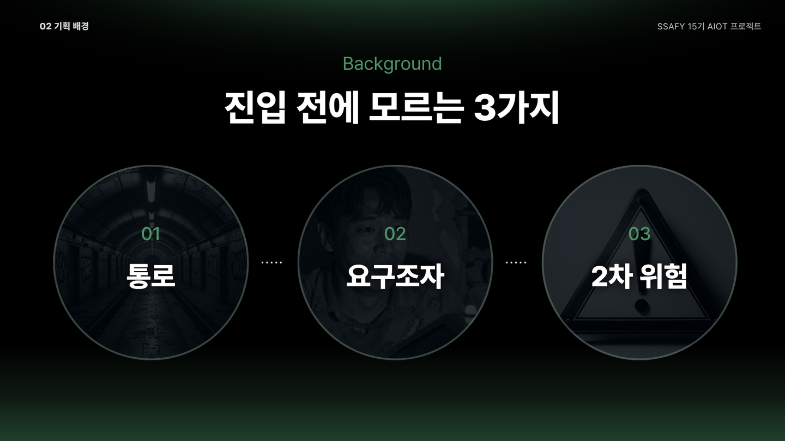
</div>

재난 현장에 사람이 먼저 들어가면 통로 상태, 요구조자의 위치와 상태, 추가 위험을 직접 확인해야
합니다. Sentinel UGV는 이 정보를 구조 인력이 진입하기 전에 수집하는 것을 목표로 했습니다.

<div align="center">
  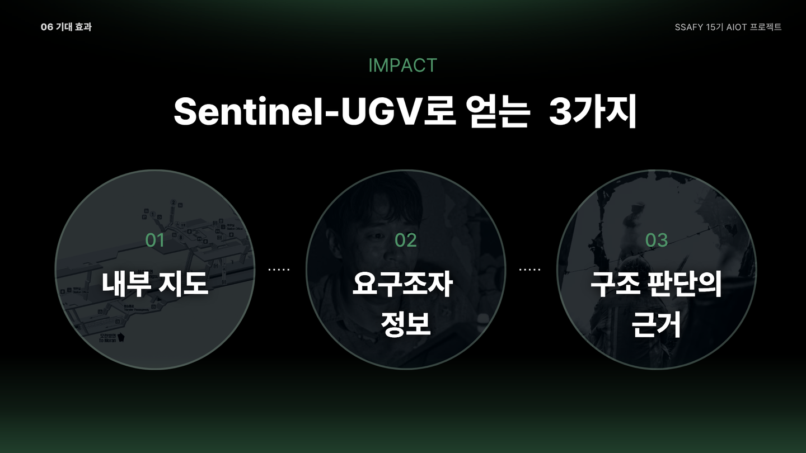
</div>

SLAM으로 내부 지도를 만들고, 카메라로 사람을 탐지하며, 음성 대화로 상태를 확인합니다. 수집한
영상과 센서 데이터는 관제 화면과 임무 이력에서 확인할 수 있습니다.

## 🎬 시연

<div align="center">
  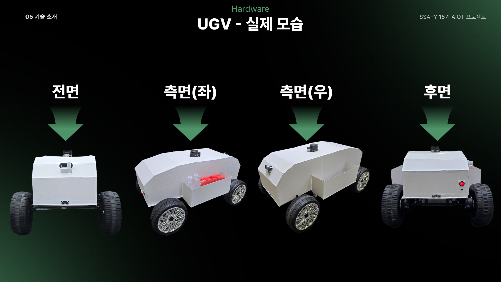
</div>

<div align="center">
  <a href="https://www.youtube.com/watch?v=guyA2-h8ZME">
    
  </a>
  <br>
  <a href="https://www.youtube.com/watch?v=guyA2-h8ZME">
    
  </a>
  <a href="docs/Sentinel-UGV-presentation.pdf">
    
  </a>
</div>

시연에서는 **탐사 시작 → 자율 탐사 → 사람 발견 → 접근 → 음성 대화 → 관제 보고 → 임무 종료**의
전체 흐름을 실제 차량으로 확인했습니다.

### 관제 화면

<div align="center">
  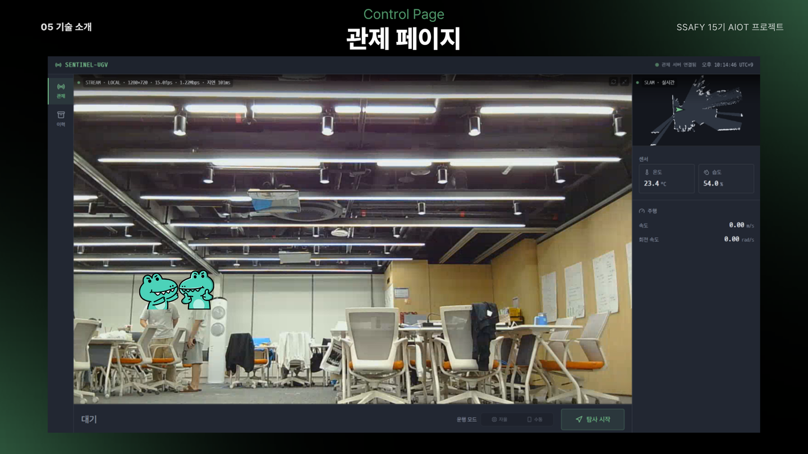
</div>

관제 화면에서 실시간 영상과 SLAM 지도, 온습도, 주행 상태를 함께 확인할 수 있습니다. 운영자는
자율·수동 모드를 전환하고 임무를 시작하거나 중단할 수 있습니다.

<div align="center">
  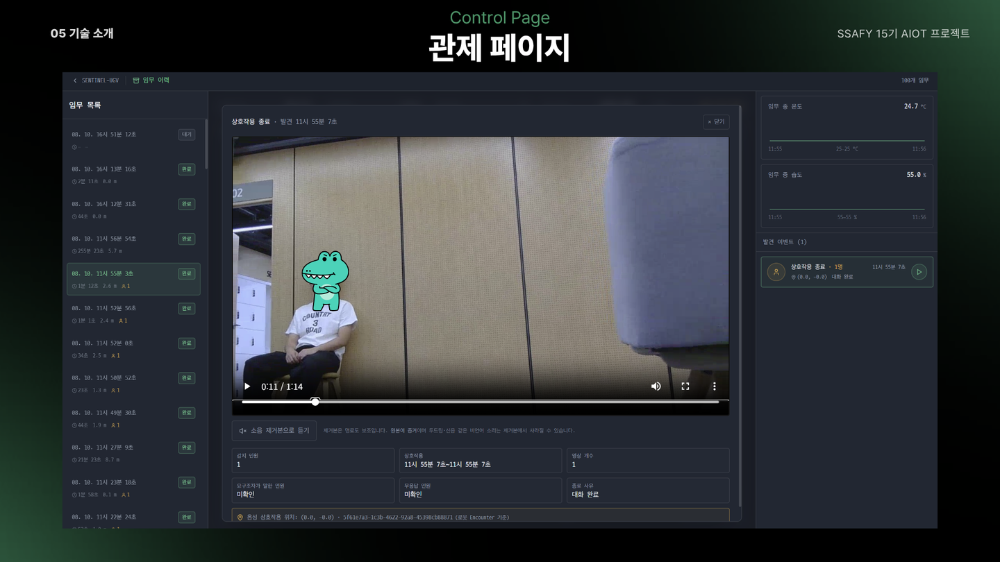
</div>

임무가 끝나면 사람 발견 전후의 영상, 대화 결과, 감지 인원, 종료 사유를 이력으로 조회할 수
있습니다. 소음 제거 음성은 청취를 돕기 위한 보조 자료이며 원본도 함께 보관합니다.

화면 설계는 [프런트엔드 와이어프레임](frontend/docs/wireframe.md), 상세 시나리오는
[프로젝트 개요](docs/01-프로젝트-개요.md#42-핵심-시연-시퀀스)에서 확인할 수 있습니다.

## ✨ 핵심 기능

<div align="center">
  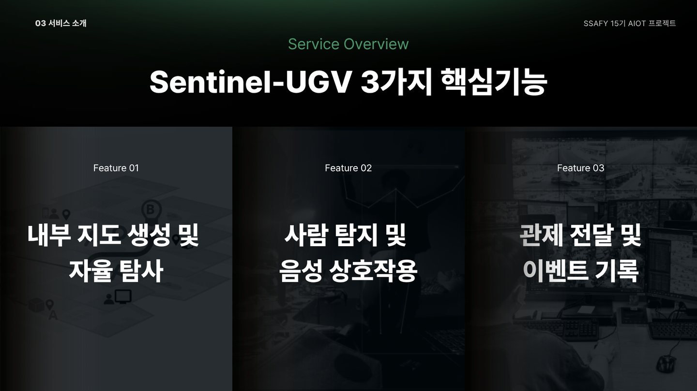
</div>

### 자율 탐사

- YDLIDAR X4 Pro와 SLAM Toolbox로 임무마다 새로운 2D 지도를 생성합니다.
- Frontier 탐색으로 아직 확인하지 않은 영역을 선택하고 Nav2로 이동합니다.
- 제자리 회전이 불가능한 전륜 조향 구조를 고려해 Smac Hybrid-A*와 Regulated Pure Pursuit를
  사용했습니다.

### 사람 탐지와 접근

- YOLO26n과 BoT-SORT로 사람을 탐지하고 추적합니다.
- 사람이 연속으로 확인될 때만 자세 추정을 실행해 쓰러짐 여부를 판정합니다.
- 사람을 발견하면 카메라 방위각을 기준으로 접근하고 약 1.5~2.0m 거리를 두고 정지합니다.

### 음성 상호작용

- Silero VAD로 발화 구간을 찾고 Qwen3-ASR로 음성을 텍스트로 변환합니다.
- 대화 모델은 답변을 정리하는 데만 사용하며 위험도는 명시적인 규칙으로 계산합니다.
- 음성 인식 실패와 사람의 무응답을 구분해 기록합니다.

### 실시간 관제와 기록

- WebRTC 영상, SLAM 지도, 2Hz 텔레메트리를 관제 화면에 전달합니다.
- 사람 발견 전 3초부터 상호작용 종료 후 3초까지를 하나의 이벤트 영상으로 저장합니다.
- 임무·센서·이벤트 정보는 TimescaleDB에, 영상과 지도는 S3 호환 스토리지에 보관합니다.

### 안전 제어

- ESP32 watchdog, 수동 조종 명령 만료 시간, Nav2 충돌 감시, 안전 게이트를 단계적으로 적용했습니다.
- 통신이 끊기거나 제어 명령이 갱신되지 않으면 모터가 정지합니다.
- 프로토타입의 안전 한계와 운용 조건은 [안전](#-안전)에 별도로 정리했습니다.

## 🧩 시스템 구성

<div align="center">
  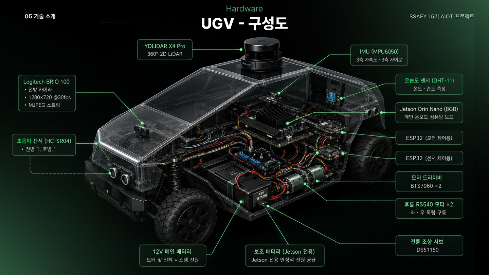
</div>

> 하드웨어 그림에는 전원이 2계통으로 표시되어 있지만, 최종 시연 차량은 12V 메인 전원,
> Jetson 보조 전원, 모터 드라이버용 5V 전원의 3계통으로 운용했습니다.

<div align="center">
  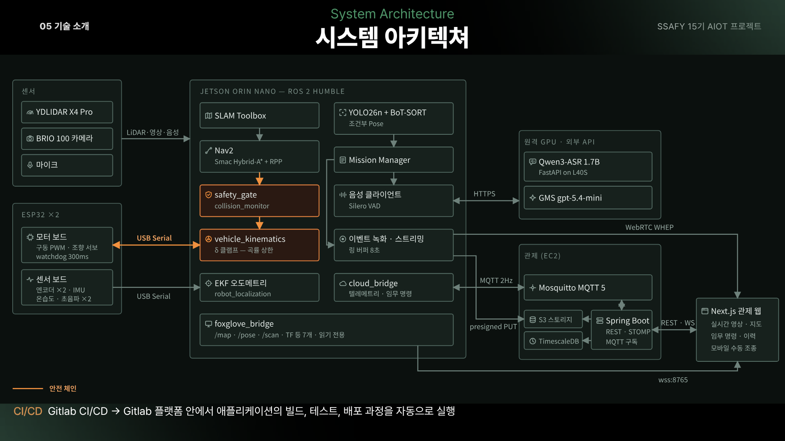
  <br><br>
  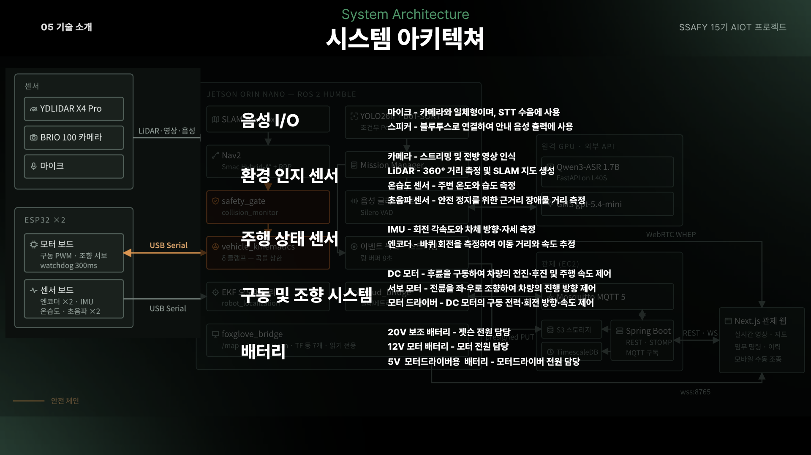
  <br><br>
  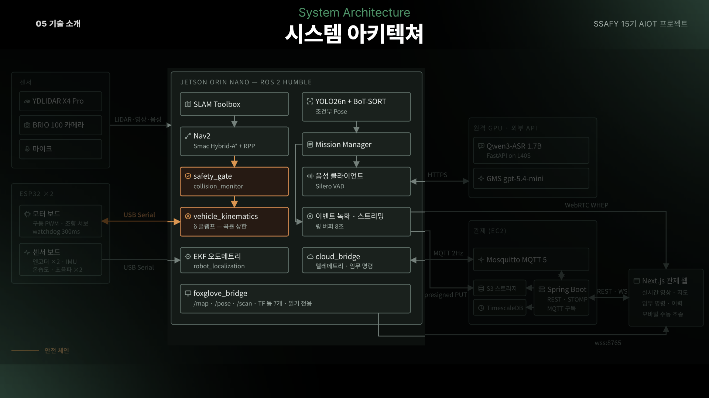
  <br><br>
  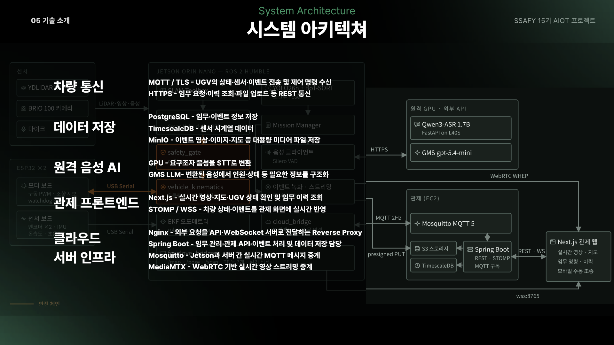
</div>

- **차량**: BMW M7 유아전동차를 기반으로 제작했습니다. 후륜 모터 2개가 구동을, 전륜 서보가
  조향을 담당합니다.
- **Jetson**: 센서 수집, SLAM, 자율 탐사, Nav2 주행, 안전 제어, 탐지와 영상 처리를 수행합니다.
- **ESP32**: 모터 제어 보드와 센서 수집 보드를 분리해 각각 Jetson과 USB Serial로 통신합니다.
- **원격 AI**: Jetson의 메모리 사용량을 고려해 음성 인식 모델은 L40S GPU 서버에서 실행합니다.
- **관제 시스템**: Spring Boot API, Next.js 웹, TimescaleDB, MinIO, Mosquitto, MediaMTX로
  구성했습니다.

## 🧭 기술 선택

| 기술 | 선택 이유 |
|---|---|
| ROS 2 Humble | 센서, 주행, 탐지, 임무 기능을 독립 노드로 나누고 메시지로 연결하기 위해 사용했습니다. |
| Jetson Orin Nano 8GB | 네트워크 연결이 불안정한 환경에서도 주행과 사람 탐지를 차량에서 처리하기 위해 선택했습니다. |
| Smac Hybrid-A* | 제자리 회전이 불가능한 차량의 회전반경과 후진 경로를 계획에 반영할 수 있습니다. |
| SLAM Toolbox | 별도의 사전 지도 없이 현장에서 지도를 생성할 수 있고 Nav2와 연동하기 쉽습니다. |
| YOLO26n · BoT-SORT | 제한된 연산 자원에서 사람 탐지와 추적을 함께 수행하기 위해 사용했습니다. |
| Qwen3-ASR 1.7B | Jetson의 자원을 주행과 비전에 우선 배정하고, 음성 인식은 원격 GPU에서 처리했습니다. |
| ESP32 2대 | 모터 제어와 센서 수집을 분리하고, 모터 보드에서 독립적으로 watchdog을 실행합니다. |
| TimescaleDB · S3 | 센서 시계열 데이터와 대용량 미디어를 성격에 맞게 분리해 저장했습니다. |
| MQTT · STOMP | 로봇과 서버 사이의 텔레메트리, 서버와 브라우저 사이의 실시간 갱신을 나눠 처리했습니다. |

## 🗂️ 저장소 구조

```text
.
├─ jetson/                  # ROS 2 기반 온보드 소프트웨어
├─ ai/
│  ├─ detection/            # 사람 탐지·추적·자세 판정
│  └─ voice/                # 음성 인식·대화 정리·잡음 제거
├─ hardware/                # ESP32 펌웨어, CAD, 배선과 BOM
├─ backend/                 # Spring Boot 관제 API
├─ frontend/                # Next.js 관제 웹
├─ common/                  # 공통 프로토콜과 메시지 스키마
├─ scripts/                 # 실행·설치·계측 스크립트
└─ docs/                    # 통합 명세, 시험과 트러블슈팅 문서
```

## 🚀 실행

Jetson의 전체 스택은 아래 스크립트로 시작하고 종료합니다.

```bash
./scripts/demo_up.sh

./scripts/demo_up.sh enable_esp32:=true enable_ekf:=true \
  enable_nav2:=true enable_exploration:=true \
  enable_approach:=true enable_safety:=true

./scripts/demo_down.sh
```

실제 주행에는 `enable_esp32`, `enable_ekf`, `enable_nav2`, `enable_exploration`,
`enable_approach`, `enable_safety`를 명시적으로 활성화해야 합니다. 특히 EKF를 활성화하지 않으면
주행에 필요한 자세 정보를 만들 수 없습니다.

운영 절차와 장애 대응은 [실행 스크립트 안내](scripts/README.md)와
[트러블슈팅 문서](docs/TROUBLESHOOTING.md)를 참고하세요.

## 📚 개발 문서

| 영역 | 문서 |
|---|---|
| 전체 명세와 변경 이력 | [docs/README.md](docs/README.md) |
| 프로젝트 목표와 시나리오 | [docs/01-프로젝트-개요.md](docs/01-프로젝트-개요.md) |
| 하드웨어와 배선 | [docs/02-하드웨어.md](docs/02-하드웨어.md) |
| 제어와 캘리브레이션 | [docs/03-제어-캘리브레이션.md](docs/03-제어-캘리브레이션.md) |
| 자율주행 | [docs/04-자율주행.md](docs/04-자율주행.md) |
| 통신·서버·영상 | [docs/05-통신-서버-영상.md](docs/05-통신-서버-영상.md) |
| 테스트·보안·운영 | [docs/06-테스트-보안-운영.md](docs/06-테스트-보안-운영.md) |
| 사람 탐지 | [docs/07-AI-탐지.md](docs/07-AI-탐지.md) |
| 음성 상호작용 | [docs/08-AI-음성.md](docs/08-AI-음성.md) |
| 백엔드 | [backend/README.md](backend/README.md) |
| 프런트엔드 | [frontend/README.md](frontend/README.md) |
| Jetson | [jetson/README.md](jetson/README.md) |
| 하드웨어 | [hardware/README.md](hardware/README.md) |

환경변수 예시는 [`.env.example`](.env.example)에 있습니다. Jetson의 런타임 설정은 ROS 파라미터
YAML과 `~/.config/sentinel/secrets.yaml`에서 관리합니다.

## 📊 검증과 한계

### 검증 범위

실제 차량으로 자율 탐사, 사람 탐지와 접근, 음성 상호작용, 영상 스트리밍, 이벤트 녹화,
관제 명령의 전체 흐름을 확인했습니다. 프로젝트 종료 시점에는 GitLab CI에서 총 941개의 자동
시험을 실행했습니다. 현재 GitHub 저장소에서는 해당 CI를 운영하지 않습니다.

아래 값은 성능 순위를 주장하기 위한 지표가 아니라, 차량 제어와 안전 영역을 설정할 때 사용한
실측값입니다.

| 항목 | 측정 결과 | 적용 |
|---|---|---|
| 최소 회전반경 | 좌 1.37m · 우 1.76m | 경로 계획에는 여유를 둔 1.8m 적용 |
| 순항 속도 | 0.30m/s 명령 대비 실속도 99% | 자율주행 기본 속도 설정 |
| 접근 속도 | 0.25m/s | 사람 접근 시 속도 제한 |
| 조향 범위 | 서보 ±55° · 바퀴 ±22° | 역운동학 조향 한계 설정 |
| EKF yaw | 90° 회전에서 89.02° | 자세 추정 보정 확인 |
| 탐지 처리량 | Detect 약 15FPS · Pose 약 2FPS | Pose를 조건부로 실행 |
| 관제 영상 | 1280×720 · 15FPS · 1500kbps | 네트워크 사용량과 지연 조정 |

### 현재 한계

- **자동 복귀**: 시작 위치는 저장하지만 복귀 주행은 구현하지 않았습니다. 임무가 끝나면 로봇은
  현재 위치에서 정지합니다.
- **사람 위치 표시**: 사람 발견 기록은 생성되지만, 지도에는 사람 위치가 아닌 발견 당시 로봇의
  위치가 표시됩니다. 카메라와 LiDAR를 결합한 정확한 사람 위치 추정은 아직 지원하지 않습니다.
- **물리 비상 정지**: 래칭형 E-Stop을 장착하지 않았습니다. 시연 중에는 담당자가 모터 배터리를
  분리할 수 있는 위치에서 차량을 운용했습니다.
- **초음파 센서**: 전·후방 거리를 수집하지만 오탐 문제로 자동 정지 조건에는 사용하지 않습니다.
- **접근 제어**: 속도와 조향은 실측값 기반의 개루프 제어이며, 서보 고장을 직접 감지할 수 없습니다.
- **접근 권한**: 관제 API와 영상 스트림에 애플리케이션 인증을 구현하지 않았습니다. 공개
  네트워크가 아닌 제한된 시연 환경을 전제로 합니다.

### 범위에서 제외한 기능

- Frontier가 모두 사라졌다는 이유만으로 탐사를 자동 종료하지 않습니다. LiDAR 지도가 완성되어도
  전방 카메라가 모든 구역을 확인했다고 볼 수 없기 때문입니다.
- 사람 탐지 모델은 세 가지 데이터셋과 네 가지 학습 방법을 비교했지만 일반화 성능이 낮아져
  별도 파인튜닝 없이 사전학습 가중치를 사용했습니다.
- 게임패드 대신 모바일 수동 조종 화면을 구현했습니다.
- TimescaleDB의 자동 집계와 보존 기간 정책은 적용하지 않고 원본 시계열을 조회합니다.

세부 근거와 후속 과제는 [통합 명세](docs/README.md)와 [TBD 목록](docs/TBD.md)에 정리되어 있습니다.

## 🛡️ 안전

Sentinel UGV는 연구·시연용 프로토타입이며 실제 재난 현장 투입을 인증받은 장비가 아닙니다.

- 운행 전 차량을 들어 올린 상태에서 모터와 조향 동작을 확인합니다.
- 예상하지 못한 주행이 발생하면 관제에서 임무를 중단하고 모터 전원을 분리합니다.
- 통신 장애 후 모터를 자동으로 재가동하지 않으며, 원인을 확인한 뒤 명시적으로 다시 시작합니다.
- 모터·전원·안전 체인을 변경한 경우 실제 장치에서 다시 검증해야 합니다.
- 자격 증명, 인증서, SSH 키, 모델 가중치와 개인 음성 데이터는 저장소에 커밋하지 않습니다.

## 💡 회고

**오류가 드러나지 않는 실패를 먼저 찾아야 했습니다.** 일부 노드가 종료되거나 설정이 빠져도 전체
프로세스는 실행 중으로 보이는 문제가 있었습니다. 이후 콜백, URDF 구조, 메시지 계약을 자동
시험에 추가해 기능 단위의 실패가 바로 드러나도록 했습니다.

**하드웨어 수치를 먼저 확보했어야 했습니다.** 차체와 조향 구조가 늦게 확정되면서 회전반경과
조향 한계를 이용하는 자율주행 튜닝이 프로젝트 후반에 집중됐습니다. 다음에는 실제 하드웨어와
같은 제약을 시뮬레이션에 먼저 반영하고 실물에서는 측정값만 교체하는 방식으로 진행할 계획입니다.

**안전 기능은 개수보다 책임 범위가 중요했습니다.** 센서와 제어 계층이 많아도 실제로 차량을
멈추는 조건이 무엇인지 명확하지 않으면 안전을 보장할 수 없습니다. 각 정지 조건이 어느 계층에서
동작하는지 문서와 시험으로 연결했습니다.

**문서와 코드를 함께 관리해야 했습니다.** 구현 변경과 문서 수정을 같은 MR에서 처리한 뒤부터
명세와 실제 동작의 차이를 찾는 시간이 크게 줄었습니다.

## 👥 팀

역삼역역무실관제센터 · SSAFY 15기 자율 프로젝트 · 2026.07.14 ~ 2026.08.11

| 이름 | 역할 | 주요 작업 |
|---|---|---|
| 박종화 | Robot SW · ROS 2 | 자율 탐사, 임무 제어, 안전 체인, 녹화·스트리밍, 관제 연동 |
| 김민석 | Hardware · Firmware | 모터·센서 펌웨어, 시리얼 통신, 구동·조향 제어, 차체 조립 |
| 박찬혁 | Hardware · Firmware | 모터 펌웨어, 시리얼 브리지, 차체 조립, 이벤트 녹화 |
| 도영훈 | Vision AI | 사람 탐지·추적, 조건부 자세 판정, 쓰러짐 판정 검증 |
| 김호준 | Voice AI | 음성 인식, 원격 GPU 추론, 발화 검출, 대화 정리, 잡음 제거 |
| 이원빈 | Backend · Infrastructure | 관제 API, 실시간 메시징, 데이터 저장, 관제 웹, 배포 |

## ⚖️ 라이선스

프로젝트 자체 라이선스는 아직 정하지 않았으며 루트에 `LICENSE` 파일이 없습니다. 제3자 구성요소와
라이선스는 [THIRD-PARTY-NOTICES.md](THIRD-PARTY-NOTICES.md), 프런트엔드 자산 고지는
[frontend/ATTRIBUTIONS.md](frontend/ATTRIBUTIONS.md)에서 확인할 수 있습니다.
