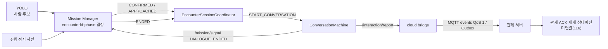

# 음성 파이프라인(STT·LLM·TTS) 통합 문서

> 대상 코드: [`ai/stt/`](../) · 갱신: 2026-07-30 · 기준: `origin/develop`
> 관련 Jira: 49, 50, 69, 109~120, 157, 159, 165
> 설계 기준 명세: 33장 피해자 음성 상호작용([`docs/07-AI-탐지-음성.md`](../../../docs/07-AI-탐지-음성.md))
>
> **이 문서가 `ai/stt` 문서의 단일 기준이다.** 원본 측정 표는 [`data/`](measurements/)에만 둔다.
> 코드 사용법과 폴더 구조는 [`ai/stt/README.md`](../README.md)를 본다.

## 목차

| § | 내용 |
|---|---|
| [1](#1-개요) | 개요 · 파이프라인 흐름 · 설계 변경 이력 |
| [2](#2-안전-정책) | **안전 정책** — 모든 판단의 최상위 제약 |
| [3](#3-보고-계약-33-6) | 보고 계약 33-6 · 9필드 · 전송 Envelope |
| [4](#4-대화-흐름) | 대화 흐름 · 응답 4분류 · 상태 |
| [5](#5-외부-연동) | 비전 Encounter · Mission Manager · 관제 ACK · GMS 장애 |
| [6](#6-안내-음성-자산) | 사전녹음 WAV 6개 · 제작 규격 |
| [7](#7-실행-절차-젯슨) | 젯슨 실행 절차 · 환경 점검 |
| [8](#8-테스트-시나리오-ae) | 육성 테스트 시나리오 A~E |
| [9](#9-측정-결과) | RAM · 모델 선정 · 육성 테스트 실측 |
| [10](#10-정량-검증-기준) | 합격선(측정 전 고정) |
| [11](#11-알려진-한계와-후속-과제) | **알려진 한계** · MVP 제외 항목 |
| [12](#12-트러블슈팅) | 트러블슈팅 |
| [13](#13-용어집) | 팀 공통 용어집 |

---

## 1. 개요

### 1-1. 한 줄 결론

VISION 트리거 → 세션 게이트 → 다턴 대화(VAD → STT → 환각 가드 → GMS 정보 추출)
→ 규칙 위험도 → 관제 보고 → 승인된 사전녹음 안내.
**LLM은 진단하지 않고 사실만 구조화하며, 등급은 버전 고정 규칙으로 산출한다.**

| 단계 | 채택 | 근거 |
|---|---|---|
| 트리거 | **비전 객체탐지** (SED 제외) | §1-4 |
| VAD | Silero VAD | 노이즈 1차 컷, torch 경량 |
| STT | **faster-whisper `small`** (젯슨 `cpu/int8`) | 저SNR·약한 발화 강건성 |
| LLM | **GMS API `gpt-5.4-mini`** | 프롬프트 v2 회귀 **44/44 완전 정답** ([data](measurements/GMS-모델-비교-결과.md)) |
| TTS | **사전녹음 WAV 6개** (모델 미탑재) | RAM 절감 + 자유 생성 문장 위험 제거 |
| 등급 | 규칙 `voice-risk-v1.1` | 재현·설명·감사 가능 |

### 1-2. 파이프라인 흐름

```text
VISION 트리거(/perception/encounter APPROACHED)
 → 세션 게이트(GMS 호스트 도달성)
 → 다턴 대화 INTRO → COUNT → MOBILITY → URGENT → CLOSING
      각 턴: 안내 WAV 재생 → 녹음 → 무음판정 → 정규화 → VAD → STT → 환각 가드
                            → GMS 정보 추출(실패 시 33-8 키워드 폴백)
 → 33-6 보고 9필드 조립 · 값 검증·보정
 → 규칙 위험도 참고값 계산
 → /interaction/report 발행 → cloud bridge → MQTT events(QoS 1, 단절 시 Outbox)
 → /mission/signal DIALOGUE_ENDED 발행
 → 관제 ACK · 탐사 재개 승인(S15P11A301-116, 미연결)
```

### 1-3. 현재 구현 상태

| 항목 | 상태 |
|---|---|
| 다턴 대화 상태머신 · 응답 4분류 | ✅ 구현·단위테스트 |
| 실제 마이크·STT·GMS·안내음성 배선 | ✅ 구현 (`session_runner.py`) |
| 33-6 보고 생성 · 값 보정 · 규칙 위험도 | ✅ 구현 |
| ROS 2 노드 (`ros_node.py`, `voice.launch.py`) | ✅ 구현 |
| 전송 계약 (`common/schemas/interaction-report.schema.json`) | ✅ 확정 |
| `/interaction/report` 발행 → bridge → MQTT | ✅ 구현 (`QUEUED`) |
| 발신 완료·탐사 재개 안내 | ✅ 구현 (183) — 기존 `REPORT_SUCCEEDED_DEPARTURE` 재사용 |
| **관제 ACK 수신** | ⛔ **존재하지 않음** — 로봇 다수 투입으로 관제가 개별 ACK를 내리지 않는다(2026-08-01 확정). `report_lifecycle.py` 삭제. ACK 연결 이슈(182)도 대상이 사라져 삭제했다(§5-2) |
| 젯슨 육성 실기기 검증 | ⚠️ A·B·D·E 통과, **C(무응답) 미검증** (§9-3) |

> `QUEUED`는 **관제 수신 성공이 아니다.** 발신 완료 시점에 완료+탐사 안내를 재생하는
> 것은 Outbox가 전달을 보장한다는 근거로 팀이 수용한 결정이다(§2-6).

### 1-4. 설계 변경 이력

원래 계획과 현재가 다른 이유를 남긴다(문서 유지 원칙 — 차이는 근거와 함께 기록).

| # | 변경 | 근거 |
|---|---|---|
| 1 | **SED 제외, 트리거는 비전** | 순수 모터소음·비언어 소리 검증 부담이 크고 시연 핵심이 아님. "무응답=중증" 보고 경로는 유지 (Jira 50) |
| 2 | 명세 33장의 base급 STT + 키워드 파싱 → **small + LLM 정보 구조화** | 저SNR·자유발화에서 더 안정적. 키워드 파싱은 33-8 폴백으로 유지 (Jira 50) |
| 3 | **로컬 LLM `qwen2.5:3b` → GMS API** | 젯슨 피크 5.62GB + page cache 압박 시 GPU 로드 OOM ([data](measurements/메모리-예산.md) §3) |
| 4 | GMS 모델 `gpt-5-nano` → **`gpt-5.4-mini`** | Jira 118 정량 비교. v1에서는 Haiku 우세였으나 프롬프트 v2에서 Mini가 정확도 100%·오판 0 ([data](measurements/GMS-모델-비교-결과.md) §6) |
| 5 | **MeloTTS → 사전녹음 WAV** | 상주 −1.3~2.0GB. PyPI 패키징 버그로 ARM64 빌드 실패도 겹침 |
| 6 | 구 추출 스키마(의식·통증부위·환경위험) → **33-6 9필드** | 의료 추론 위험 제거. 단일 마이크로 개인 귀속 불가 |
| 7 | 마이크 어레이(DOA) 미채택 | 비용. 단일 USB 마이크 전제 → 모든 발화를 `GROUP` 범위로 취급 |
| 8 | 사투리 지원 범위 제외 | 성능 보장 불가. Jira 120 합격 점수에서 제외 |

---

## 2. 안전 정책

> Jira: S15P11A301-109. **이 절의 제약이 다른 모든 절보다 우선한다.**

### 2-1. 결정 권한

- GMS는 발화에서 **관찰 가능한 사실만** 추출한다. 진단, 생존 가능성 판단, 구조 순서 결정, 도착 시간 추정을 하지 않는다.
- `risk_assessment()`의 결과는 관제의 빠른 검토를 위한 **위험도 참고값**이다.
- 최종 구조 우선순위와 현장 지시는 **관제 담당자 또는 구조대원**이 결정한다.
- 로봇은 참고값을 요구조자에게 말하지 않는다. "당신은 적색 환자입니다", "가장 먼저 구조됩니다" 같은 확정 안내를 금지한다.
- `finalTriage`, `confirmedSeverity`, `medicalPriority` 같은 확정 표현을 생성하지 않는다.

### 2-2. 위험도 참고값 규칙 (`voice-risk-v1.1`)

판정 순서 — 위에서 먼저 걸리면 확정:

| 조건 | `riskLevel` | 기존 색상 표시 |
|---|---|---|
| `anyResponseDetected == null` (관찰 실패) | `UNKNOWN` | 미확인 |
| `anyResponseDetected == false` **이고** 종료 사유가 `AUDIO_DEVICE_ERROR`·`GMS_UNAVAILABLE` | `UNKNOWN` | 미확인 |
| `anyResponseDetected == false` | **`IMMEDIATE`** | 적색(즉시) |
| `urgentConditionReported == YES` | **`IMMEDIATE`** | 적색(즉시) |
| `mobilityStatus == NO` | `URGENT` | 황색(응급) |
| `mobilityStatus == YES` 이고 `urgentConditionReported == NO` | `DELAYED` | 녹색(경증) |
| 그 외 | `UNKNOWN` | 미확인 |

#### 추출 판단을 완화했다 (2026-08-04 팀 결정, S15P11A301-231)

등급 규칙표는 그대로지만 **입력값을 정하는 기준이 느슨해졌다.** 이전 기준은
너무 보수적이어서 쓸 수 있는 정보가 `UNKNOWN`으로 빠졌다.

| 발화 | 이전 | 현재 | 바뀐 이유 |
|---|---|---|---|
| `다리를 다쳤어요` | 긴급 `UNKNOWN` | **`YES`** | 중대한 출혈·호흡만 YES로 보던 규칙을 없앴다. 부상을 말하면 정도를 재지 않는다 |
| `일어나려니까 너무 아파요` | 이동 `UNKNOWN` | **`NO`** | "통증만으로 추측하지 않는다"를 없앴다. 못 일어난다고 말한 것을 그대로 받는다 |
| `두 명 더 있어요` | 인원 `null` | **`3`** | "응답 가능이 직접 확인된 총인원만" 규칙을 없앴다. 화자를 더해 합산한다 |

**등급에 미치는 영향**: 긴급 `YES`는 `IMMEDIATE`, 이동 `NO`는 `URGENT`로 이어지므로
전체적으로 **더 높은 등급이 더 자주 나온다.** 의도한 방향이다 — 구조 현장에서
과소보고가 과대보고보다 무겁고, `operatorReviewRequired`가 항상 `true`라 사람이
반드시 검토한다.

**넘지 않은 선 두 개.**

1. 부정 표현은 뒤집히지 않는다. `다친 곳은 없습니다`는 `NO`다. 글자만 보고
   완화하면 정반대 보고가 나가므로 부정을 먼저 걸러낸다.
2. 부상 언급이 이동 판정으로 번지지 않는다. `다리를 다쳤어요`의 이동은
   `UNKNOWN`이다 — 다쳤다고 못 움직이는 것은 아니다.

두 경로를 함께 고쳤다 — [`prompts/triage_extract.txt`](../prompts/triage_extract.txt)와
33-8 키워드 폴백(`llm.py`의 `keyword_extract`). 어긋나면 GMS 장애 시 보고 내용이
달라진다. 규칙은 `tests/test_report_schema.py`가 고정한다.

**검증** — GMS 실호출 10문장 전부 기대값과 일치했고, 같은 문장에서 폴백과도 값이
같았다(`denoise_try/gms_prompt_check.py`). 프롬프트를 바꿨으므로 S15P11A301-118의
구 프롬프트 결과는 승계하지 않고 다시 쟀다.

> 그 대조에서 폴백의 과소보고 하나를 찾았다 — `다리가 눌려서 못 움직여요`를 GMS는
> 긴급 `YES`로, 폴백은 `UNKNOWN`으로 냈다. 끼임·압착을 폴백의 긴급 근거에 추가해
> 맞췄다. 폴백이 더 낮은 등급을 내면 GMS 장애 시 과소보고가 된다.

> ⚠️ **필드 이름과 의미가 어긋났다.** `reportedResponsiveCount`는 이름이
> "응답 가능 인원"인데, 이제 응답 여부가 확인되지 않은 주변 인원까지 센다
> (대답을 못 한다고 명시된 사람만 제외). S15P11A301-147이 제안한
> `reportedPersonCount` 개명이 이 변경으로 더 필요해졌다.

```json
{
  "riskLevel": "IMMEDIATE",
  "riskReasons": ["긴급 상태가 있다고 발화함"],
  "ruleVersion": "voice-risk-v1.1",
  "operatorReviewRequired": true
}
```

- `operatorReviewRequired`는 **항상 `true`**다.
- `riskReasons`에는 실제 관찰값과 적용된 규칙만 기록한다.
- **시스템 장애·마이크 오류·STT 실패·네트워크 실패는 `IMMEDIATE`의 근거가 아니다.**
- 정상적으로 질문을 재생하고 청취했는데 반응이 없을 때만 무응답을 기록할 수 있다.
- 정보가 부족하면 등급을 추측하지 않고 `UNKNOWN`을 쓴다.

**종료 사유는 게이트가 아니라 부가 정보다(v1.1, S15P11A301-179).** 관찰이 완료됐다면
수집한 값으로 등급을 계산하고, 세션이 중간에 끝났다는 사실은 `riskReasons`에
`"세션 미완료: <사유>"`로 **덧붙인다**. 관찰 근거가 먼저, 절차 정보가 뒤에 온다.

```python
{'riskLevel': 'IMMEDIATE',
 'riskReasons': ['긴급 상태가 있다고 발화함', '세션 미완료: TIMEOUT'],
 'ruleVersion': 'voice-risk-v1.1', 'operatorReviewRequired': True}
```

> **v1.0의 문제** — 종료 사유가 `NORMAL`이 아니면 즉시 `UNKNOWN`을 반환했다. 그래서
> 네 질문에 모두 답을 받고 마지막 안내만 남은 세션이 제한 시간을 1초 넘기면,
> `urgentConditionReported=YES`가 잡혀 있어도 `riskLevel`이 `UNKNOWN`이 됐다.
> `riskLevel`은 관제가 우선순위를 정렬하는 필드이므로 이는 보수적 처리가 아니라
> **알고 있던 정보를 버려서 늦어지는 것**이다. `ABORTED_SAFETY`에서 특히 위험했다 —
> 위험해서 대피한 상황의 정보가 사라진다.

**단, 관찰 실패는 여전히 단락한다.** `anyResponseDetected`가 `null`이면 관찰 자체를
못 한 것이므로 `UNKNOWN`이다. `false`가 왔더라도 종료 사유가 장치·연결 실패면
무응답으로 확정하지 않는다 — **시스템 실패를 요구조자 무응답으로 바꾸지 않는다**(33-3).

### 2-3. 왜 의료 triage가 아닌가

음성 세션이 수집하는 값은 음성 응답 여부, 자기보고 인원, 자력 이동 가능 여부,
긴급 상태 자기보고 네 가지뿐이다. 정식 의료 triage에 필요한 임상 관찰을 충족하지 못한다.

WHO의 MC-IITT는 보행 가능 여부 외에 기도 문제, 호흡 곤란, 대량 출혈·관류 문제,
의식 변화를 평가하며 **반복 재평가**를 요구한다. 미국 HHS의 START도 자발 호흡,
호흡수, 관류, 명령 수행 능력을 함께 사용한다. WHO MC-IITT FAQ는 대량환자 triage를
**경험 있는 임상 인력**이 수행해야 한다고 안내한다.

따라서 로봇의 역할은 네 가지로 한정한다.

1. GMS와 규칙 파서가 발화에서 관찰 가능한 사실을 구조화한다.
2. 버전 고정 규칙 엔진이 `riskLevel`과 `riskReasons`를 계산한다.
3. 관제 화면이 영상·음성 원본, 구조화 리포트, 적용 규칙을 함께 표시한다.
4. **실제 구조 우선순위는 그 정보를 검토한 사람이 결정한다.**

참고: [WHO Triage Tool](https://www.who.int/tools/triage) ·
[WHO MC-IITT](https://cdn.who.int/media/docs/default-source/integrated-health-services-%28ihs%29/csy/mass-casualty---iitt-a0.pdf?sfvrsn=4e8859_1) ·
[MC-IITT FAQ](https://cdn.who.int/media/docs/default-source/integrated-health-services-%28ihs%29/csy/mc-iitt-faq.pdf?sfvrsn=3d3d71e9_1) ·
[HHS START](https://chemm.hhs.gov/startalgotext.htm)

### 2-4. 무응답과 시스템 실패 구분

**명세 33-3이 요구하는 핵심 구분이다.** 시스템 실패를 요구조자의 무응답으로 기록하면 안 된다.

| 상황 | 응답 분류 | 로봇 동작 |
|---|---|---|
| 질문 재생 성공, 마이크 정상, 청취 구간에 음성 없음 | `NO_VOICE_DETECTED` | INTRO는 1회 재질문 후 무응답 관찰 기록 |
| 음성은 있으나 STT 무효 | `VOICE_DETECTED_STT_FAILED` | **무응답으로 기록하지 않음.** 관제 확인 대상 |
| 답은 했으나 값을 확정 불가 | `RESPONSE_UNRECOGNIZED` | `UNKNOWN` 기록, 관제 확인 대상 |
| 값 확정 | `ANSWER_STRUCTURED` | 해당 필드 기록 |
| 마이크 열기·녹음 실패 | — | `terminationReason=AUDIO_DEVICE_ERROR`, 무응답 아님 |
| 세션 시작 전 GMS 단절 | — | 신규 STT 없이 안전 안내 + 전송 대기 |
| STT 완료 후 GMS 실패 | — | 제한 재시도 후 33-8 축소 보고 |

무응답 관찰만으로 의학적 상태를 확정하지 않는다. 관제 검토가 필요한 높은 위험
신호로 전달할 수 있으며 최종 우선순위는 관제가 결정한다.

### 2-5. 구조 ETA 정책

**허용** — 관제 서버가 제공한 `etaMinutes`·`etaUpdatedAt`만 사용하고, 확정 표현 대신
범위와 변동 가능성을 알린다. 오래된 ETA는 재사용하지 않는다.

```text
구조대가 약 15분 후 도착할 예정입니다. 현장 상황에 따라 달라질 수 있습니다.
```

**금지** — GMS·로봇이 이동 거리만 보고 ETA를 생성·보정하는 행위, 관제 승인값 없는
임의 시간 안내, "정확히 10분 뒤 도착합니다" 같은 확정 표현, 네트워크 복구 후 오래된
ETA 재생.

ETA가 없으면 시간을 언급하는 안내를 하지 않는다(문구 v2에서 진행형 안내 자산도
삭제됨). ETA 안내용 별도 문구를 만들지 않는다.

> ⚠️ **"현재 위치에서 안전하게 기다려 주세요"는 쓰지 않는다(2026-07-30 결정).**
> 로봇은 그 지점이 안전한지 알 수 없다. 가스·2차 붕괴·구조물 하중을 판단할 수단이
> 없는데 "안전하게"라고 말하면 근거 없는 안전 보증이 된다. 문구 v2에서는 대기 안내
> 자산 자체를 두지 않는다 — 전송 대기 구간은 무음이다.

동적 ETA 안내는 승인 템플릿 결합 기능이 마련되기 전까지 재생하지 않는다.

### 2-6. 안내 음성 정책

안전 필수 문구는 **사전녹음 WAV만** 사용한다. 자유 생성 문장을 쓰지 않는다.
자산 목록과 규격은 §6.

문구 작성 원칙:

- 짧고 한 번에 한 가지 행동만 요청한다.
- 공포를 유발하거나 구조 순서를 확정하는 표현을 쓰지 않는다.
- **말하는 시점에 참인 문구만 재생한다.** 한국어 시제로 네 단계를 구분한다(아래 표).
- 이동을 권하기 전에 현장 안전과 관제 지시를 우선한다.
- 상대 좌표만으로 "현재 위치가 관제에 전달되었습니다"라고 안내하지 않는다.
- 탐사 문구는 **임무가 진행 중인 상태일 때만** 재생한다.

#### 전송 안내 — 단일 문구 (문구 v2, 2026-08-01)

**종료 안내는 발신 상태와 무관하게 하나다.** 관제 ACK가 없고(로봇 다수 투입) 브리지
인계 실패는 없다고 가정한다. 시제로 4단계를 구분했던 이전 설계는 폐기했다.

| 조건 | 안내 코드 | 문구 | 잠금 |
|---|---|---|---|
| 발신 상태 무관 (`PENDING`·`QUEUED`·`FAILED`) | `REPORT_SUCCEEDED_DEPARTURE` | 구조 요청이 전달되었습니다. 다시 탐색을 시작합니다. | `requires_exploration_resume` |
| 탐사 재개를 약속할 수 없음 (E-Stop 등) | — | **재생하지 않는다** (기록만) | — |
| 세션 게이트 차단 (GMS 불가) | — | **재생하지 않는다** (기록만) | — |

**잔여 위험** — 브리지 인계가 실제로 실패하면 요구조자는 완료 안내를 듣지만 보고는
나가지 않는다. 상태(`FAILED`)·로그·세션 기록에만 남는다. §11에 알려진 한계로 둔다.

**발신 완료가 참인 근거** — 보고는 `/interaction/report`로 발행되고 `cloud_bridge`가
MQTT `events`로 publish한다. 실패하면 `OutboxRepository`(SQLite)가 보관하고 재연결 시
재전송한다. 즉 **"로봇이 보냈다"는 확실히 참이며, 확인되지 않은 것은 "관제가 받았다"뿐이다.**

> ⚠️ **수용한 위험** — 이 자산의 문구는 수동태("전달되었습니다")여서 엄밀히는 관제
> 수신을 주장한다. Outbox가 전달을 보장하므로 대부분의 경우 참이 되지만, 브로커·서버가
> 계속 죽어 있으면 Outbox에 쌓인 상태로 남는데 로봇은 이미 전달되었다고 말한 상태다.
> 새 문구를 녹음하는 비용보다 이 위험을 감수하는 편을 택했다. 엄밀한 구분이 필요해지면
> 문구를 능동태로 재녹음하는 것이 유일한 해결책이다 — 관제 ACK로 구분하는 길은
> 닫혔다(§5-2, ACK 부재 확정).

#### 즉시 재개 정책과 안내 순서

**팀 결정: 관제 전달 완료 즉시 다음 지역 탐사를 시작한다**(관제 담당자의 보고서 확인을
기다리지 않는다). 근거는 ① 기다려도 전달 확률이 오르지 않는다(Outbox가 재전송을 보장)
② 사람의 확인을 조건으로 걸면 관제가 가장 바쁠 때 로봇 진행이 병목이 된다
③ 발견·보고를 마친 요구조자 옆에 머무는 것보다 아직 못 찾은 사람을 찾는 편익이 크다
④ 발견 지점은 `encounter`의 `pose`로 이미 기록된다.

> 재개 자체는 **Mission Manager의 권한**이다(26장 단일 권한). 음성 모듈은 모터 명령을
> 만들지 않고 안내만 한다.

**⚠️ 안내를 `DIALOGUE_ENDED`보다 먼저 재생한다.** 순서를 뒤집으면 Mission Manager가
즉시 재개해 **로봇이 멀어지며 모터 소음 속에서 마지막 안내를 하게 되고, 요구조자가
그것을 듣지 못한다.** 안내를 마친 뒤 신호를 보내면 재개가 자연히 그 뒤에 일어난다.

```text
보고 발신(QUEUED) → 종료 안내 재생 완료 → DIALOGUE_ENDED 발행 → Mission Manager 재개
```

**탐사 문구를 쓸 수 있는 조건** — 안내 시점에는 아직 `DIALOGUE_ENDED`를 보내지 않았으므로
재개를 *관측할 수 없다.* 대신 `ros_node`가 이미 구독 중인 `/mission/status`의 마지막
`state`가 **임무 진행 중**인지 확인한다.

| 약속한다 | 약속하지 않는다 |
|---|---|
| `EXPLORING` `PERSON_APPROACHING` `INTERACTING` `POST_RECORDING` `REPORTING` | `ESTOP` `ERROR` `PAUSED` `MANUAL` `SAFE_IDLE` `COMPLETED` `RETURNING` · 상태 미수신 |

중단·정지·종료 상태에서 "다른 지역 탐사를 시작합니다"를 말하면 거짓이 된다.
`RETURNING`은 복귀이므로 제외한다.

---

## 3. 보고 계약 33-6

> Jira: S15P11A301-113. 기준: 명세 33-4·33-6.

### 3-1. 세션 보고 9필드

BRIO 100 마이크 하나로 화자를 구분할 수 없으므로 **모든 발화를 그룹 단위로 저장**한다.
`safety.coerce_report()`가 이 계약을 강제한다.

| 필드 | 의미 | 타입·허용값 | 결정 주체 |
|---|---|---|---|
| `responseScope` | 발화 정보가 적용되는 범위 | `GROUP` **고정** | 시스템 정책 |
| `anyResponseDetected` | 세션 중 음성 응답을 감지했는지 | `true`/`false`/`null` | VAD·상태머신 |
| `reportedResponsiveCount` | 화자 본인 포함, 발화자가 직접 보고한 **응답 가능** 총인원 | 1 이상 정수, `null` | GMS·폴백 |
| `reportedCountStatus` | 인원 수의 출처·확정 상태 | `SELF_REPORTED_GROUP_COUNT`/`CONFIRMED_BY_OPERATOR`/`UNKNOWN` | 시스템·관제 |
| `countConfidence` | 인원 수 인식 신뢰도 | 0.0~1.0, `null` | STT·검증 (현재 미구현 → `null`) |
| `mobilityStatus` | 그룹이 스스로 이동할 수 있다고 답했는지 | `YES`/`NO`/`UNKNOWN` | GMS·폴백 |
| `urgentConditionReported` | 심한 출혈·호흡 곤란 등을 발화로 알렸는지 | `YES`/`NO`/`UNKNOWN` | GMS·폴백 |
| `operatorReviewRequired` | 관제 담당자의 최종 확인 필요 여부 | `true`/`false` (현재 항상 `true`) | 안전 정책 |
| `terminationReason` | 세션 종료 이유 | §3-2 | 상태머신 |

**`null`과 `UNKNOWN`은 다르다.**

- `null` — 값을 관찰하거나 계산할 수 없었음
- `UNKNOWN` — 질문은 처리했지만 답을 확정할 수 없었음

**`reportedResponsiveCount` 계약** — 주변 사람만 세는 값이 아니다. 음성으로 답하는
화자 본인을 포함하며 사람만 센다. "저 혼자", "사람은 저밖에 없다", "저 말고 대답할
사람은 없다"는 모두 `1`이다. 발화에 등장한 사람 수를 응답 가능 인원으로 추론하지
않으며, 응답 가능 총원이 명시되지 않으면 `null`이다.
**카메라가 감지한 전체 사람 수는 이 필드에 합치지 않고 `visionPersonCount`로 분리한다.**

### 3-2. 종료 사유

| 값 | 의미 |
|---|---|
| `NORMAL` | 질문 흐름을 정상적으로 마침 |
| `TIMEOUT` | 세션 제한 시간 초과 |
| `ABORTED_MANUAL` | 작업자 수동 중단 (MANUAL·PAUSED) |
| `ABORTED_SAFETY` | 로봇·현장 안전 조건으로 중단 (ESTOP·ERROR) |
| `AUDIO_DEVICE_ERROR` | 마이크 열기·녹음 등 오디오 장치 오류 |
| `GMS_UNAVAILABLE` | GMS를 사용할 수 없어 세션 종료 |
| `UNKNOWN` | 아직 종료되지 않았거나 이유 확정 불가 |

### 3-3. 책임 분리

GMS와 키워드 폴백이 추출하는 것은 **세 필드뿐**이다.

```json
{ "reportedResponsiveCount": 2, "mobilityStatus": "NO", "urgentConditionReported": "UNKNOWN" }
```

GMS가 **생성하지 않는** 필드: `responseScope`(시스템 고정) · `anyResponseDetected`(VAD·상태머신) ·
`reportedCountStatus`(시스템·관제) · `countConfidence`(실측값 있을 때만) ·
`operatorReviewRequired`(안전 정책) · `terminationReason`(상태머신).

**잘못된 값 보정** — GMS가 음수 인원, 허용되지 않은 문자열, 잘못된 타입을 반환해도
그대로 쓰지 않는다. `coerce_report()`가 `null` 또는 `UNKNOWN`으로 낮추고
`operatorReviewRequired`를 안전 기본값 `true`로 유지한다.

### 3-4. 전송 Envelope

실제 전송 계약은 `common/schemas/interaction-report.schema.json`이다
(`additionalProperties: false` — CI가 검증한다).

```json
{
  "interactionId": "…",
  "encounterId": "c81f6d20-5a47-4e93-b2d8-1f70e4a95c33",
  "missionId": "4a43f45c-779f-4df5-ac04-1695724829a4",
  "visionPersonCount": 3,
  "startedAt": "2026-07-30T09:16:22.000Z",
  "endedAt": "2026-07-30T09:17:31.000Z",
  "sessionReport": {
    "responseScope": "GROUP",
    "anyResponseDetected": true,
    "reportedResponsiveCount": 2,
    "reportedCountStatus": "SELF_REPORTED_GROUP_COUNT",
    "countConfidence": null,
    "mobilityStatus": "NO",
    "urgentConditionReported": "YES",
    "operatorReviewRequired": true,
    "terminationReason": "NORMAL"
  },
  "riskAssessment": {
    "riskLevel": "IMMEDIATE",
    "riskReasons": ["긴급 상태가 있다고 발화함"],
    "ruleVersion": "voice-risk-v1.1",
    "operatorReviewRequired": true
  },
  "usedFallback": false
}
```

비전·임무 식별자를 `sessionReport` 안에 섞지 않는다. `coerce_report()`가 허용하지 않은
필드를 제거하고 책임도 불명확해진다. `visionPersonCount`는 비전 탐지 인원이며
`reportedResponsiveCount`와 의미가 다르다 — **두 값을 자동으로 같다고 간주하지 않는다.**

**오디오 장치 오류 예시** — `anyResponseDetected`에 `false`를 쓰지 않는다.
사람이 응답하지 않은 것이 아니라 시스템이 관찰하지 못했기 때문이다.

```json
{ "anyResponseDetected": null, "reportedResponsiveCount": null,
  "mobilityStatus": "UNKNOWN", "urgentConditionReported": "UNKNOWN",
  "operatorReviewRequired": true, "terminationReason": "AUDIO_DEVICE_ERROR" }
```

### 3-5. 의도적으로 제외한 정보

| 항목 | 이유 |
|---|---|
| 통증 부위·진단명 | 수집 대상 아님. 의료 추론 위험 |
| ETA | 관제 승인값만 별도 안내. GMS가 생성하지 않음 |
| 특정 피해자 ID | 단일 마이크로 화자 식별 불가 → 자동 귀속 금지 |
| GMS/폴백 출처 | 세션 필드가 아니라 Envelope의 `usedFallback`에 기록 |
| 위험도 참고값 | 원본 관찰값과 분리해 별도 계산 (`riskAssessment`) |

**MVP 제외 항목은 §11-1에 별도로 명시한다.**

---

## 4. 대화 흐름

> Jira: S15P11A301-112(상태머신), 157(실물 배선)

### 4-1. 질문 4개 — 부상 우선 순서로 한 번 훑는다

```text
INTRO → URGENT → MOBILITY → COUNT → CLOSING
```

**URGENT를 먼저 묻는다.** 세션이 조기 종료(타임아웃·중단)되어도 가장 중요한 부상
정보부터 확보한다(S15P11A301-146 v2).

| 질문 | 채우는 필드 | 청취창 | 재질문 (1회) | 재질문 문구 |
|---|---|---|---|---|
| INTRO | `anyResponseDetected` | 5초 | **무음일 때** | `RETRY_NO_RESPONSE` |
| URGENT | `urgentConditionReported` | 8초 | 없음 | — |
| MOBILITY | `mobilityStatus` | 6초 | 없음 | — |
| COUNT | `reportedResponsiveCount` | 6초 | 없음 | — |
| CLOSING | — | — | — | 종료 안내는 전송 단계가 한다(§11-7) |

> **재질문은 INTRO 무음 1회뿐이다** (S15P11A301-201). 값을 확정하지 못한 응답
> (`VOICE_DETECTED_STT_FAILED`·`RESPONSE_UNRECOGNIZED`)은 되묻지 않고 `UNKNOWN`으로
> 두고 다음 질문으로 넘어간다 — 한시가 급한 상황에 "이상하게 말했으니 다시 말해
> 달라"는 요구가 이질적이라는 컨설팅 지적에 따른 것이다.
>
> **트레이드오프를 숨기지 않는다.** 약한 발화("움직일 수 있어요" → STT "이럴 수
> 있어요?")의 값은 기계 보고에서 `UNKNOWN`으로 남는다. 보상 통제는 세션 블랙박스
> (S15P11A301-202) — 원문 전사와 녹음이 관제로 올라가 사람이 판단한다.
> INTRO 무음만 되묻는 이유는 "안 들리는 경우"에 한 번 더 부르는 것은 사람 사이에서도
> 자연스럽기 때문이다.

**중요한 성질 세 가지.**

1. **질문 1개 = 필드 1개.** 답을 못 받아도 다시 묻지 않고 `UNKNOWN`으로 넘어간다.
   "보고서가 채워질 때까지 되묻는" 적응형 흐름은 **채택하지 않았다**(§11-8 닫힌 트랙) —
   한시가 급한 상황에 되묻는 것이 이질적이라는 컨설팅 지적이 근거다.
2. **INTRO 발화는 내용을 분석하지 않는다.** `interpret()`이 즉시 `True`를 반환하므로
   GMS를 호출하지 않는다. "발화가 있었다"만 기록한다.
3. **안내 음성이 끝나는 즉시 녹음이 시작된다.** 별도 신호가 없다. 청취창은 고정 길이라
   답을 마쳐도 시간이 끝날 때까지 기다린다.

세션 제한 시간은 **180초**이며 **질문 사이에서만** 검사한다(진행 중인 녹음·STT를
중단하지 않는다). 정상 세션은 약 75초에 끝나므로 도달하지 않는 비상 상한이다. 초과해도 그때까지 수집한 값의 등급은 유지된다(§11-2).

### 4-2. 응답 4분류 (명세 33-3)

```text
음성 미검출                     → NO_VOICE_DETECTED
음성 있음 + STT 무효            → VOICE_DETECTED_STT_FAILED   ← 무응답으로 기록 금지
STT 성공 + 값 확정 불가         → RESPONSE_UNRECOGNIZED
STT 성공 + 값 확정              → ANSWER_STRUCTURED
```

환각 가드(`safety.is_valid_stt`)가 무효로 처리하는 것: 빈 출력 ·
`no_speech_prob > 0.7` · 같은 토큰 4회 이상 반복 · STT 프라이밍 프롬프트 복사.

### 4-3. 세션 상태

`NOT_STARTED` → `PROMPTING` → `LISTENING` → `TRANSCRIBING` → `LLM_INTERPRETING`
→ `TTS_RESPONDING` → (`RETRYING`) → `COMPLETED`
종료 상태: `ABORTED_MANUAL` · `ABORTED_SAFETY` · `FAILED_AUDIO`

---

## 5. 외부 연동

### 5-1. 비전 Encounter (입력)

> Jira: S15P11A301-117, 159

`/perception/encounter`의 **유일한 발행자는 Mission Manager**다. YOLO·음성·주행
노드가 각자 phase를 발행하면 순서와 `encounterId`가 충돌하므로, 각 모듈은 자신이
관찰한 사실만 Mission Manager에 알린다.



**시작 조건**

- `CONFIRMED` — `encounterId`와 최초 비전 문맥을 등록한다. **녹음하지 않는다.**
- `APPROACHED` — Mission Manager가 안전 위치 정지를 확인한 사건. **이때 한 번만** 세션을 시작한다.
- 같은 `encounterId`의 반복 사건은 두 번째 세션을 만들지 않는다.
- 다른 Encounter가 진행 중이면 현재 세션을 덮어쓰지 않는다.
- `APPROACHED`의 `personCount`가 0이어도 최초 `CONFIRMED`의 사람 수를 보고 문맥으로 보존한다.

**종료와 안전**

- 음성 모듈은 `ENDED`를 직접 발행하지 않는다. 대화 완료 사실만 알리고 Mission Manager가 `ENDED`를 결정한다.
- `LOST`·수동 중단·안전 중단에서는 진행 중 대화를 중단하고 **자동 재개를 요청하지 않는다.**
- **음성 모듈은 모터 명령을 생성하지 않는다.**

**확정 계약**

| 방향 | 항목 | 값 |
|---|---|---|
| 입력 | 토픽·타입 | `/perception/encounter`, `std_msgs/String` |
| 입력 | 본문 | `common/schemas/encounter.schema.json` |
| 출력 | 대화 완료 | `/mission/signal`, `signal=DIALOGUE_ENDED`, `source=VOICE` |
| 출력 | 보고 | `/interaction/report`, `common/schemas/interaction-report.schema.json` |
| 출력 | 관제 경로 | cloud bridge MQTT `events`, QoS 1, 단절 시 Outbox |
| 출력 | 중복 키 | `interactionId`를 MQTT `messageId`로 재사용 |
| 안전 | 중단 매핑 | ESTOP·ERROR → `ABORTED_SAFETY` / MANUAL·PAUSED → `ABORTED_MANUAL` |
| 실행 | 명령 | `.venv/bin/python -m sentinel_voice.ros_node` (`voice.launch.py`) |

### 5-2. 관제 ACK 부재와 탐사 재개 게이트

> ⛔ **관제 ACK는 존재하지 않는다 (2026-08-01 확정).** 로봇이 여러 대 투입되어 관제가
> 개별 보고에 ACK를 내리지 않는다. ACK를 기다리던 `report_lifecycle.py` 상태머신은
> 전제가 성립하지 않아 **삭제했다**(미배선 상태였고, 복원은 git 이력).
> `requires_report_success` 잠금도 함께 제거했다.

**남은 신호는 "탐사 재개 승인" 하나다.** E-Stop·중단 상태에서 "다시 탐색을
시작합니다"를 말하면 거짓이 되므로 그때는 재생하지 않는다. 판단은 `ros_node`가 임무
상태로 하고, 게이트는 `requires_exploration_resume`이다.

- 재개할 수 없으면 종료 안내를 **재생하지 않고** 기록만 남긴다(`SKIPPED`).
- 세션 게이트가 차단한 경우에도 재생하지 않는다(침묵 정책, §2-6).

**ACK를 다시 도입하려면 처음부터 설계해야 한다.** 서버→로봇 채널이 `cmd/mission`
뿐이므로 새 채널·스키마·브리지 중계·음성 모듈 배선이 모두 필요하다. 그 작업을 담고
있던 S15P11A301-182는 대상 코드와 문구가 모두 사라져 **2026-08-03 삭제했다** —
잠금 대상이던 `REPORT_SUCCEEDED` 문구(§6-1 v2에서 단일화)와 `report_lifecycle.py`가
없어 완료 기준 5개가 전부 빈 곳을 가리켰다. 필요해지면 새 이슈로 만든다.

### 5-3. GMS 장애 대응

> Jira: S15P11A301-115

**세션 시작 전** — `session_gate.check_session_gate()`가 ① `GMS_KEY` 설정 ②
`SENTINEL_GMS_BASE` 호스트·포트 ③ 제한 시간 내 TCP 연결 가능 여부를 확인한다.
기본 2초. **API 요청을 보내지 않아 크레딧을 소비하지 않는다.**
차단이면 오디오 장치를 열지 않는다.

| 결과 | 신규 STT 세션 | 안내 |
|---|---|---|
| `READY` | 시작 | 없음 |
| `GMS_MISCONFIGURED` | 차단 | **없음** — 로그·`operator_review_required`로만 (침묵 정책) |
| `GMS_UNAVAILABLE` | 차단 | **없음** — 같음 |

> 차단 안내 문구(`NETWORK_WAIT`)는 문구 v2에서 삭제했다. "연결되는 대로 전달하겠습니다"는
> 세션 데이터가 없는 상태에서 지킬 수 없는 약속이었다.

TCP 연결 성공은 **인증 성공이 아니다.** 키 오류는 실제 호출의 HTTP 401/403으로 구분한다.

**STT 완료 후 GMS 실패 분류** — 기본 최대 2회 호출(최초 1 + 재시도 1), 간격 0.5초.

| 분류 | 대표 조건 | 재시도 | 최종 처리 |
|---|---|---:|---|
| `DEPENDENCY` | `openai` SDK 등 누락 | 안 함 | 배포 환경 수정 |
| `NETWORK` | DNS·연결 거부·손실 | 1회 | 33-8 폴백 |
| `TIMEOUT` | 호출 제한 시간 초과 | 1회 | 33-8 폴백 |
| `AUTH` | 키 누락, 401/403 | 안 함 | 33-8 폴백 + 운영자 확인 |
| `RATE_LIMIT` | 429 | 1회 | 33-8 폴백 |
| `SERVER` | 5xx | 1회 | 33-8 폴백 |
| `INVALID_RESPONSE` | JSON 파싱·계약 오류 | 안 함 | 33-8 폴백 |
| `CLIENT` | 그 밖의 4xx | 안 함 | 33-8 폴백 |

운영 로그에는 분류·예외 종류·시도 횟수만 남긴다.
**GMS 키, 인증 헤더, 요구조자 발화 원문을 장애 메시지에 넣지 않는다.**

**전송 대기 상태** (`report_delivery.queue_report()`)

| 상태 | 의미 | 허용 안내 |
|---|---|---|
| `PENDING` | 전송 어댑터 미연결 | `REPORT_SUCCEEDED_DEPARTURE` |
| `QUEUED` | bridge·Outbox가 인수함 | `REPORT_SUCCEEDED_DEPARTURE` |
| `FAILED` | 대기열 인계 실패 | `REPORT_SUCCEEDED_DEPARTURE` |
| `SUCCEEDED` | (미사용 — 관제 ACK 부재) | — |

**상태는 구분해서 기록하지만 문구는 하나다.** 실패 시 완료 안내가 나가는 잔여 위험은
§2-6과 §11에 기록했다.

---

## 6. 안내 음성 자산

> Jira: S15P11A301-114 · 코드: `sentinel_voice/guide_audio.py` · 파일: `ai/stt/assets/`

젯슨에 TTS 모델을 설치하지 않는다. 승인 문구를 미리 만든 PCM WAV로 재생해 RAM 사용과
자유 생성 문장의 위험을 줄인다.

- 등록되지 않은 문장은 재생하지 않는다(`UNAPPROVED_TEXT`).
- WAV가 없거나 잘못돼도 **동적 TTS로 대체하지 않는다.**
- 재생 실패와 마이크 무응답은 서로 다른 오류다.
- 탐사 재개를 약속할 수 없는 임무 상태(E-Stop 등)에서는 종료 안내를 재생하지
  않는다(`EXPLORATION_RESUME_NOT_APPROVED`) — 지킬 수 없는 약속 금지.

### 6-1. 필수 자산 6개 — 승인 문구 전문 (v2, 2026-08-01)

> 문구 v2 개정(S15P11A301-146): 10개 → 6개. 합니다체 통일, "관제" 금지("구조대"),
> 공백 제외 8자 이상(에코 가드 하한). 삭제 4개 — `RETRY_UNCLEAR`(값 미확정
> 재질문 폐지, 201), `REPORT_PENDING`·`NETWORK_WAIT`(종료 안내 단일화·침묵 정책),
> `REPORT_SUCCEEDED`(관제 ACK 부재 확정 — 로봇 다수 투입).

| 코드 | 파일 | 문구 | 사용 조건 |
|---|---|---|---|
| `INTRO` | `guide_intro.wav` | 구조 로봇입니다. 들리면 대답해 주세요. | 세션 시작 |
| `ASK_URGENT` | `guide_ask_urgent.wav` | 다친 곳이 있으십니까? | 긴급 징후 질문 (첫 질문 — 부상 우선) |
| `ASK_MOBILITY` | `guide_ask_mobility.wav` | 움직일 수 있습니까? | 이동 능력 질문 |
| `ASK_COUNT` | `guide_ask_count.wav` | 주변에 다른 인원이 있습니까? | 인원 질문 |
| `RETRY_NO_RESPONSE` | `guide_retry_no_response.wav` | 제 말이 들린다면 대답해주십시오. | INTRO 무응답 1회 재질문 (유일한 재질문) |
| **`REPORT_SUCCEEDED_DEPARTURE`** | `guide_report_succeeded_departure.wav` | 구조 요청이 전달되었습니다. 다시 탐색을 시작합니다. | **유일한 종료 안내.** 발신 상태 무관(실패 없음 가정, §11). 탐사 재개 약속 불가 시 생략 |

**이 표의 `문구` 열이 유일한 기준이다.**

- 코드의 `GUIDE_ASSETS[...].text`와 **한 글자도 달라서는 안 된다.** `GuidePlayer.play_text()`가
  문자열로 대조해 승인 목록에 없으면 `UNAPPROVED_TEXT`로 재생을 거부한다.
- **재제작·신규 생성 시 이 열을 그대로 TTS 입력으로 쓴다.** 문구를 다른 문서에 옮겨
  적지 않는다(두 곳에 적으면 어긋난다).
- 원본 파일명 규칙: `guide_xxx.wav` ↔ `mini_xxx.wav` (`tools/convert_guide_assets.source_filename`)

### 6-2. 제작 규격과 생성 이력

**WAV 규격** — mono · 16,000Hz · PCM 16-bit · 길이 0.3~15초 ·
peak ≤ −1dBFS · RMS −32~−12dBFS. `validate_wav()`가 검사한다.

| 항목 | 적용값 |
|---|---|
| 생성 서비스 / 모델 | MiniMax / `speech-2.8-hd` |
| Voice / Speed / Pitch / Volume | `Brave Female Warrior` / `1.1` / `0` / `1.75` |
| Emotion · Sound tag · Pause tag | 사용하지 않음 |
| 변환 도구 | `tools/convert_guide_assets` — **PyAV**(`av`) |
| 변환 규격 | `loudnorm=I=-20:TP=-2:LRA=7` → 16kHz mono PCM 16-bit |
| 생성일 | 2026-08-03 (문구 v2) |

**변환은 PyAV로 한다.** PyAV가 ffmpeg의 libavfilter를 품고 있어 `loudnorm`을 그대로
쓸 수 있고, ffmpeg 실행 파일을 설치하지 않는다. `av`는 `requirements.txt`에 명시
선언되어 있다(전이 의존에 기대지 않는다).

> **ffmpeg CLI 폴백을 두지 않는다.** 시스템 ffmpeg와 PyAV의 libav는 버전이 다를 수
> 있고 `loudnorm` 결과가 버전에 따라 달라진다. 실행하는 사람에 따라 자산 음량이
> 달라지면 이 절이 규격을 고정하는 의미가 없다. 경로를 하나로 둔다.

MiniMax 출력은 헤더의 프레임 수가 실제와 다를 수 있다(스트리밍 인코딩 — v2 원본은
실제 1.0~3.2초인데 헤더가 67,108초로 기록돼 있었다). 변환이 디코딩한 샘플로 다시
쓰므로 교정된다. 원본 peak가 0dBFS로 미세 클리핑(연속 최대 9샘플 = 0.28ms)이
있었으나 `loudnorm` 감쇠로 변환본은 클리핑 0건이다.

> **GMS TTS는 쓰지 않는다.** 런타임 합성은 물론 자산 생성에도 쓰지 않는다
> (2026-08-01 확정). 클라우드 전환이 전면 취소되면서 실측 문서 §5-1의 TTS
> 채택도 함께 무효가 됐다. 자산은 사전 녹음 재생 전용이다.

Sound tag와 효과음은 VAD·STT 재유입 가능성이 있어 넣지 않는다.
모든 파일을 같은 설정으로 생성하고 설정값을 검수 기록에 남긴다.

MiniMax 원본은 `ai/stt/`에 `mini_*.wav`로 저장하며 **커밋 대상이 아니다.** 일괄 변환:

```bash
python -m tools.convert_guide_assets --source-dir . --force
```

**생성 입력은 §6-1 표의 `문구` 열을 그대로 쓴다.** 문구가 바뀌면 §6-1과
`guide_audio.py`를 **함께** 고쳐야 하며, 한쪽만 바꾸면 테스트
(`DocumentedTextMatchesCodeTest`)가 깨지고 재생은 `UNAPPROVED_TEXT`로 거부된다.

> **문구와 자산은 반드시 같은 커밋에서 함께 바꾼다.** 코드가 v2로 대조하는데 스피커가
> v1을 재생하면 `GUIDE_BY_TEXT` 대조가 빗나가 **에코 가드가 무력화된다**
> (S15P11A301-165가 막은 구멍이 다시 열린다). 한쪽만 바뀐 상태는
> `test_no_asset_needs_a_new_recording`이 잡는다.
>
> 문구 v2 자산 6개는 2026-08-03 생성·변환·검증 완료. 청취 검수는 §6-3.

### 6-3. 검증

**자동 검사** — 전부 `[OK]`여야 한다.

```bash
python -m tools.validate_guide_assets --report results/guide-assets.json
```

**청취 검수** (파일별 3회) — 문구가 표와 한 글자도 다르지 않음 · 3회 모두 다시 듣지
않고 이해 · 첫·끝 음절 잘림 없음 · 잡음·클리핑·팝 없음 · 파일 전환 시 음량 급변 없음 ·
차분하며 구조 확정·의료 진단으로 오해되지 않는 말투.

**실장 검증 권장 기준** — 파일별 재생 성공률 3/3 · 재생 시작 지연 P95 ≤ 0.5초 ·
끊김 0회 · **로봇 안내 음성의 STT 재유입 0회** · 장치 오류를 무응답으로 기록한 건수 0건.

> 안내 재생 중에는 청취를 시작하지 않는다. 재생 종료 후 **300ms** 뒤 청취를 시작해
> 에코 재유입을 확인한다. 300ms는 초기 검증값이며 실측에 따라 조정한다
> (`SENTINEL_LISTEN_DELAY`). 통과한 에코는 문구 대조로 한 번 더 막는다 — §11-3.

### 6-4. Closing과 탐사 재개 계약

```text
보고 발신 (PENDING·QUEUED·FAILED — 상태 무관)
 → /mission/status 의 마지막 state 가 임무 진행 중인가?
      예  → REPORT_SUCCEEDED_DEPARTURE 재생 ("전달되었습니다. 다시 탐색을 시작합니다")
      아니오 → 재생하지 않음 (기록만 — 지킬 수 없는 약속 금지)
 → DIALOGUE_ENDED 발행  ← Mission Manager 가 이때부터 재개
```

대체 문구를 두지 않는 이유 — 재개를 약속할 수 없을 때 쓸 진행형 안내(`REPORT_PENDING`)가
문구 v2에서 삭제됐다. 침묵이 거짓보다 낫다.

**음성 모듈은 모터를 직접 제어하지 않는다.** 재개는 `DIALOGUE_ENDED`를 받은 Mission
Manager가 결정한다.

로봇의 상대 좌표는 요구조자의 절대 위치를 보장하지 않으므로, 어떤 문구도 "현재 위치가
관제에 전달되었습니다"라고 말하지 않는다.

---

## 7. 실행 절차 (젯슨)

> 2026-07-24 실제로 성공한 절차. 환경: Jetson Orin Nano 8GB · JetPack 6.2.1
> (L4T R36.4.7) · CUDA 12.6 · Python 3.10

### 7-1. ⚠️ 시작 전 반드시: 시계 확인

이 보드는 **RTC 배터리가 없어 전원이 끊기면 시계가 과거로 리셋**된다. 시계가 틀리면
TLS 검증이 깨져 **GMS·pip·HF·Docker가 전부 401/인증 오류**로 실패한다.

```bash
timedatectl status
sudo date -s "YYYY-MM-DD HH:MM:SS"   # 폰 시계 참고
```

교내망은 NTP(UDP 123)가 막혀 자동 동기화가 안 된다. 수동 설정이 정답이다.
**재부팅을 피한다.** 그룹 적용이 필요하면 `newgrp`을 쓴다.

### 7-2. 환경 구축 (최초 1회)

```bash
# 8GB 스왑 (모델 로딩 OOM 방지)
sudo fallocate -l 8G /swapfile && sudo chmod 600 /swapfile && sudo mkswap /swapfile \
  && sudo swapon /swapfile && echo '/swapfile none swap sw 0 0' | sudo tee -a /etc/fstab

# 모니터링
sudo pip3 install -U jetson-stats && sudo jtop --install-service && newgrp jtop

# venv는 저장소 루트에
cd ~/projects/S15P11A301 && python3 -m venv .venv
source .venv/bin/activate && pip install -U pip

# Jetson용 PyTorch — 인덱스 URL 끝의 /+simple/ 이 없으면 실패한다
pip install torch==2.8.0 torchaudio==2.8.0 \
  --index-url https://pypi.jetson-ai-lab.io/jp6/cu126/+simple/
pip install "numpy<2"            # torch 휠이 numpy 1.x 기준 빌드

# 나머지 (melotts 제외 — PyPI 패키징 버그, 사전녹음 방식이라 불필요)
sudo apt install -y portaudio19-dev libsndfile1 pulseaudio-utils v4l-utils
pip install sounddevice soundfile scipy librosa faster-whisper silero-vad openai
```

측정 세션마다 (부팅 시 초기화됨):

```bash
sudo nvpmodel -m 0 && sudo jetson_clocks
```

GMS 키:

```bash
cd ~/projects/S15P11A301/ai/stt && cp -n .env.example .env
# GMS_KEY=<팀 GMS 키> 입력
```

> **GMS 키는 팀 크레딧과 연결된 비밀 값이다.** 코드·문서·커밋·로그·채팅에 넣지 않는다.
> `.env`는 `.gitignore`에 등록되어 있다.

### 7-3. 환경 점검

```bash
SENTINEL_DEVICE=cpu python -m tools.check_env --load
```

| 항목 | 통과 기준 |
|---|---|
| `platform` | `aarch64 / Jetson / R36.4.7` |
| `torch+CUDA` | torch 2.8.0, Orin |
| `config` | `device=cpu compute=int8 jetson=True stt=small llm=gpt-5.4-mini` |
| `faster-whisper` `silero-vad` `sounddevice(장치)` `librosa` | 전부 `[OK]` |
| `guide-audio` | 사전녹음 WAV 6개 보유 |
| `memory/swap` | RAM 7.4GB, Swap 8GB↑ |
| `STT 로드` / `VAD 로드` | `[OK]` |
| **`GMS 실호출`** | `GMS 응답 정상 (...)` — `[WARN]`이면 키·네트워크·**시계** 확인 |

마지막 줄이 `✅ 전부 통과`여야 한다.

> `SENTINEL_DEVICE=cpu`인 이유: ARM64용 CTranslate2에 CUDA 빌드가 없어 faster-whisper는
> **CPU로만 동작**한다. 빼면 `CTranslate2 not compiled with CUDA`로 실패한다.
> GPU STT가 필요해지면 whisper.cpp(CUDA 빌드) 전환을 검토한다.

### 7-4. 오디오 입출력 검증

> Jira: S15P11A301-111

BRIO 100의 USB 마이크를 입력으로 쓰므로 Bluetooth 스피커는 통화용 HFP/HSP가 아닌
**A2DP 출력 프로필**을 사용한다.

```bash
pactl list short sinks && pactl info | grep 'Default Sink'
# Active Profile 이 a2dp-sink 계열인지 확인

python -m tools.check_audio_io                       # 목록만 (녹음·재생 안 함)
python -m tools.check_audio_io \
  --input-match "BRIO" --output-match "<스피커명>" \
  --record-seconds 10 --playback \
  --wav ~/audio_io_sample.wav --report ~/audio_io_report.json
```

**통과 조건** — 입력 이름에 `BRIO` 포함 · `mono/float32/16000Hz` `[OK]` ·
`[FAIL]`·underrun·연결 해제 없음 · 발화 구간 `peak_dbfs < -3dBFS`이고 `clipped_ratio = 0` ·
WAV 재청취 시 음성 식별 가능. RMS는 환경·거리에 따라 달라지므로 절대 합격선으로 쓰지 않는다.

**추가 시험** — ① BRIO 카메라(`v4l2-ctl --stream-mmap=3 --stream-count=300`)와 마이크
동시 실행 ② Bluetooth 전원 재연결 3회 후 기본 sink 유지·첫 음절 누락 여부.
첫 음절이 반복해서 잘리면 안내 음성 앞에 무음 프리롤을 추가하는 후속 업무로 등록한다.

> 개인 음성이 포함된 WAV는 커밋하지 않는다.

### 7-5. 실행

```bash
# 단독 CLI (수동 트리거)
SENTINEL_DEVICE=cpu python -u -m sentinel_voice.pipeline 2>&1 | tee ~/voice_test.log

# 진단이 필요할 때만 — 세션 기록과 청취 원본을 남긴다 (§11-6)
SENTINEL_DEVICE=cpu SENTINEL_SESSION_LOG_DIR=~/sessions \
  python -u -m sentinel_voice.pipeline 2>&1 | tee ~/voice_test.log

# ROS 2 노드 (실제 비전 트리거)
./scripts/demo_up.sh
ros2 topic echo /interaction/report std_msgs/msg/String
ros2 topic echo /mission/signal    std_msgs/msg/String
```

> `-u` 필수. 없으면 `tee` 버퍼링 때문에 멈춘 것처럼 보인다.

### 7-6. 환경 변수

| 변수 | 기본값 | 의미 |
|---|---|---|
| `SENTINEL_DEVICE` | 자동 감지 | 젯슨에서는 **`cpu` 필수** |
| `SENTINEL_COMPUTE` | Jetson `int8` | 연산 정밀도 |
| `SENTINEL_STT_MODEL` | `small` | faster-whisper 모델 |
| `SENTINEL_LLM` | `gpt-5.4-mini` | GMS 모델명 |
| `GMS_KEY` | — | **필수.** `ai/stt/.env`, 커밋 금지 |
| `SENTINEL_GMS_BASE` | `https://gms.ssafy.io/gmsapi/api.openai.com/v1` | GMS 엔드포인트 |
| `SENTINEL_LLM_TIMEOUT` | `10` | 초과 시 33-8 폴백 |
| `SENTINEL_GMS_MAX_ATTEMPTS` | `2` | 최초 호출 포함 최대 호출 수 |
| `SENTINEL_GMS_RETRY_DELAY` | `0.5` | 재시도 전 대기(초) |
| `SENTINEL_GMS_PROBE_TIMEOUT` | `2` | 세션 시작 전 TCP 확인(초) |
| `SENTINEL_SESSION_LOG_DIR` | — | **비활성 기본.** 지정하면 세션 기록·청취 원본을 저장한다(§11-6). 개인 음성이 남으므로 필요할 때만 켠다 |
| `SENTINEL_LISTEN_DELAY` | `0.3` | 안내 재생 후 청취 시작까지 대기(초). 에코 1차 방어선(§11-3) |
| `SENTINEL_ECHO_MATCH_RATIO` | `0.9` | 안내 문구 에코 판정 포함률. 실측 근거는 §11-3 |
| `SENTINEL_ECHO_MIN_CHARS` | `8` | 이보다 짧은 발화는 에코로 판정하지 않는다 |

고정 파라미터: `SILENCE_RMS=0.005` · `NORM_TARGET_RMS=0.08` ·
VAD `threshold=0.5, min_speech_duration_ms=150, min_silence_duration_ms=500, speech_pad_ms=300` ·
STT 프라이밍 프롬프트 `"살려주세요, 도와주세요, 다쳤어요, 가스, 화재"`

---

## 8. 테스트 시나리오 A~E

> Jira: S15P11A301-157. 사람이 직접 말해서 명세 33-3 4분류와 33-6 9필드를 검증한다.

시나리오마다 로그 파일명을 바꿔 `~/voice_test_<A~E>.log` 5개를 남긴다.

### A — 표준 (중증) · 가장 먼저

| # | 로봇 문구 | 말할 대사 |
|---|---|---|
| 1 | 탐사 로봇입니다… 제 말이 들리면 대답해 주세요. | **"네, 들려요."** |
| 2 | …모두 몇 명인가요? | **"저랑 아저씨 한 분, 두 명이요."** |
| 3 | 지금 스스로 움직일 수 있나요? | **"다리가 눌려서 못 움직여요."** |
| 4 | …숨쉬기 어렵거나 피가 많이 나면 말씀해 주세요. | **"숨쉬기가 좀 힘들어요."** |
| 5 | 구조 요청을 관제에 전달하고 있습니다… | (종료) |

**합격** — `riskLevel=IMMEDIATE` · `urgentConditionReported=YES` · `reportedResponsiveCount=2`

### B — 경상 (A의 반대 극단)

`"네, 들립니다."` → `"저 혼자예요."` → `"네, 걸을 수 있어요."` → `"아니요, 괜찮습니다. 다친 데 없어요."`

**합격** — `riskLevel=DELAYED` · `mobilityStatus=YES` · `urgentConditionReported=NO`
관전 포인트는 4번이다. 부정문을 긴급 **없음**으로 옳게 뒤집는지 본다.

### C — 완전 무응답 (의식 없음 상정)

INTRO에서 5초 침묵 → 재질문 재생 → 다시 5초 침묵 → 이후에도 침묵.

**합격** — `[NOVOICE]` 2회 + 재질문 WAV 재생 + `anyResponseDetected=false` + `riskLevel=IMMEDIATE`
이 시나리오에서도 COUNT/MOBILITY/URGENT를 끝까지 물어본다(§11-4).

### D — 발화는 있으나 STT 실패 ⭐ 명세 33-3 핵심

INTRO에서 **말이 아닌 소리**를 5초간 낸다(신음, 웅얼거림, 숨 몰아쉬기).

**합격** — `[STTFAIL]` 로그 + **`anyResponseDetected=true`** + `operatorReviewRequired=true`

여기서 `false`가 나오면 **명세 위반이며 즉시 보고할 결함**이다. 음성은 감지됐고 STT만
실패했으므로 무응답·의식없음으로 기록해서는 안 된다.

### E — 모호한 답

A와 같게 진행하되 MOBILITY에서만 `"글쎄요… 잘 모르겠어요."`

**합격** — `mobilityStatus='UNKNOWN'` + 세션이 중단되지 않고 URGENT까지 진행

### 로그 태그 사전

| 태그 | 의미 |
|---|---|
| `[PLAY]` | 안내 WAV 재생 완료 (이 줄 직후 녹음 시작) |
| `[STT]` | 유효 발화 인식 성공 |
| `[NOVOICE]` | 무음 또는 VAD 음성 미검출 |
| `[STTFAIL]` | 음성 있음, STT 무효 (무응답으로 기록 **안 함**) |
| `[LLM]` | 추출 경로가 GMS가 **아닐** 때만 출력 (= 33-8 폴백) |
| `[WARN]` | 안내 음성 재생 실패 |
| `[FAIL]` | 오디오 장치 오류 → `FAILED_AUDIO` 종료 |

### 공통 확인

- `[LLM] … 추출 경로` 줄이 **없어야** 함 (있으면 GMS 호출 실패)
- `[WARN] … 안내 음성 재생 실패`가 **없어야** 함
- `E2E < 180s` (초과해도 수집한 값의 등급은 유지된다)
- **5개 질문 WAV가 스피커로 실제 들렸는가** — 로그만으로 판단 불가

---

## 9. 측정 결과

원본 표와 상세 조건은 [`data/`](measurements/)에 있다.

### 9-1. RAM — [상세](measurements/메모리-예산.md)

| 구성 | 피크 | 여유 | 상태 |
|---|---|---|---|
| 로컬 LLM `qwen2.5:3b` | **5.62GB / 7.4GB** | ~1.9GB | GMS 전환 근거로 보존 |
| **GMS 구성 (현재)** | **4102MB / 7620MB** | **3518MB** | 2026-07-30 실측 |

GMS 구성 실측 조건: 15W mode 0 · `jetson_clocks` **미적용** · idle 2670MB(GUI·PulseAudio·
Bluetooth 포함) · 시나리오 A 실발화 · `tegrastats` 1초. 세션 E2E 76.8초.

이전 예상 ~3.3GB보다 절대 사용량이 높은 이유는 GUI 포함 베이스라인에서 시작했기
때문이다. **통합 예산에는 보수적으로 4102MB를 쓴다.**

⚠️ **배포 리스크 (로컬 LLM 시절 발견)** — 여유 RAM이 있어 보여도 page cache가 차 있으면
GPU 로드가 OOM으로 실패한다. 젯슨 nvgpu 할당기는 캐시를 회수하지 못하므로 `available`이
커도 진짜 free가 부족하면 실패한다. GMS 전환으로 이 경로는 사라졌으나, 향후 온디바이스
모델을 다시 올릴 때 재발한다.

### 9-2. 모델 선정 — [상세](measurements/GMS-모델-비교-결과.md)

| 단계 | 결과 |
|---|---|
| 1차 선별 (v1, 25회) | Mini·Opus 100%, 후보 압축 |
| 남은 15문장 (v1, 30회) | Haiku 우세(97.78%), Mini 반전 오류 1건 |
| 안전 핵심 5회 반복 (v1) | **Mini 동일 위험→안전 오판 5/5 재현** |
| 프롬프트 v2 고난도 (48회) | **Mini 100%·오판 0**, Haiku 91.67%·환각 3 |
| v2 전체 회귀 | **Mini 완전 일치 44/44 → 최종 선정** |
| 누적 | 143회 이상, 최소 1,260.97 크레딧 |

**프롬프트 v2가 추가한 규칙** — 한 명이라도 이동 불가면 그룹은 `NO` · 전원 이동 가능이
확인된 경우만 `YES` · 일부만 가능하고 나머지 미확인은 `UNKNOWN` · 중대한 출혈·호흡 이상이
하나라도 명시되면 긴급 `YES` · **단순 통증만으로 이동·긴급을 추측하지 않음**.
프롬프트 해시 `sha256:c2ac36ebd461`.

> 서로 다른 데이터셋의 정확도를 직접 개선율로 계산하지 않는다.
> Mini의 v1 반전 오류는 모델 크기보다 **불명확한 프롬프트 규칙**의 영향이 컸다는 것이 근거다.

**모델 선정 규칙** — 아래를 **모두** 만족해야 운영 후보가 된다. 가장 크거나 최신인
모델을 자동 선정하지 않으며, 안전 기준을 통과한 모델 중 지연·사용량이 작은 쪽을 우선한다.

```text
위험→안전 오판 0건 · 파싱 성공률 ≥99% · 슬롯 정확도 ≥90%
숫자·이동가능 정확도 ≥95% · 환각 슬롯 ≤2% · 완전일치 일관성 ≥95% · 성공 P95 ≤3초
```

우선순위는 ① 위험→안전 오판 없음 ② 없는 사실 생성 없음 ③ 세 필드 정확 추출
④ JSON 계약 안정성 ⑤ 허용 지연 내 일관성 ⑥ 그중 사용량이 합리적인 모델 순이다.

**재현** — 크레딧 절감을 위해 단계를 나눈다. `--confirm-live` 없이는 크레딧을 쓰지 않는다.

```bash
python -m bench.gms_model_bench --dry-run                    # 호출 없음
python -m bench.gms_model_bench --models gpt-5.4-mini --runs 1 \
  --case-id all-fields-urgent --confirm-live                 # 스모크
python -m bench.gms_model_bench --models <목록> --runs 2 --confirm-live
```

각 단계 결과를 검토하기 전에는 다음 단계를 실행하지 않는다. 모델 ID 오류(401·403·404)가
나면 임의로 다른 모델로 대체하지 않고 오류를 보존한 뒤 정확한 ID를 확인한다.

**결과 공유 주의** — `.env`·GMS 키를 첨부하지 않는다 · **실제 요구조자 음성·전사문을
비교 데이터로 쓰지 않는다** · 모델 미지원 오류를 품질 실패로 해석하지 않고 "GMS 접근
불가"로 분리한다 · 네트워크·실행 시각이 다른 결과를 단순 지연 순위로 비교하지 않는다 ·
원본을 검토하지 않고 요약 CSV만으로 운영 모델을 확정하지 않는다.

### 9-3. 젯슨 육성 테스트 (2026-07-30, commit `e36f910`)

장비: Logitech BRIO 100 / TS-BTS25-2-D (Bluetooth A2DP) · 15W mode 0 ·
`jetson_clocks` 미적용(sudo 권한 없음) · 단위 테스트 94개 통과.

| 시나리오 | 회차 | riskLevel | E2E | 판정 |
|---|---|---|---|---|
| A 표준 | 1차 | IMMEDIATE | 76.8s | ✅ |
| B 경상 | 2차 | DELAYED | 75.5s | ✅ |
| **C 무응답** | 3차 | — | — | **⏸ 환경 무효** |
| D STT실패 | 2차 | UNKNOWN | 111.2s | ✅ 핵심 조건 |
| E 모호 | 1차 | IMMEDIATE | 75.2s | ✅ 핵심 조건 |

**재시도 사유** (실패를 감추지 않고 기록)

- **B 1차** — MOBILITY 발화가 `"네"`까지만 인식되어 `UNKNOWN`. 또렷하게 말한 2차에서 `YES` 확인.
- **C** — 1·3차는 주변 대화가 문장으로 인식되어 무효. 주변 대화를 중단한 2차에서도
  INTRO 첫 청취만 `[NOVOICE]`였고 **재질문 청취가 `[STTFAIL]`로 분류**됐다. Bluetooth
  출력을 80%→35%로 낮춘 3차에도 별도 발화가 유입되어 음량 조정 효과를 판정할 수 없었다.
  코드 결함으로 단정하지 않고 **조용한 환경·유선 출력 재시험 필요**로 남긴다(§11-3).
- **D 1차** — 신음 레벨이 VAD 임계값에 못 미쳐 무효(§11-5).

> 개인 음성이 포함된 `~/voice_test_*.log`, `~/audio_io_sample.wav`, `~/voice_ram.log`는
> 저장소에 커밋하지 않는다.

### 9-4. 미측정 항목

| 항목 | 왜 남았나 |
|---|---|
| **C 무응답 경로 (`anyResponseDetected=false`)** | **결과가 가장 무거운 경로인데 미검증** (§11-3) |
| ~~STT WER (공개 코퍼스)~~ | **측정됨** — KsponSpeech `eval_clean` 2,471발화. clean CER 0.141 → SNR 0dB 0.366. `measurements/STT-오류율-실측.md` |
| STT WER · 핵심 표현 보존율 (**우리 도메인**) | 위 값은 일상 대화다. 우리 마이크·어휘·약한 발화는 빠져 있어 실전 정확도가 아니다. 도메인 녹음 필요 (Jira 120) |
| GMS 왕복 지연 P50/P95 · 일관성 | bench 재실행 |
| **통합 구동 (비전+SLAM 동시)** | **가장 중요.** 안전 게이트 §9-5 |
| `jetson_clocks` 적용 상태 재측정 | sudo 권한 필요 |

### 9-5. 통합 측정 안전 게이트 — 순서를 건너뛰지 말 것

이 코드는 모터를 제어하지 않지만, 통합 시 **OOM 킬러가 주행·안전 노드를 죽일 수 있다.**

| 단계 | 내용 | 로봇 상태 | 통과 조건 |
|---|---|---|---|
| 1 ✅ | 음성 단독 | 정지 | 완료 (§9-1) |
| 2 | 비전+SLAM+음성 **동시** RAM 측정 | **바퀴 띄움/정지** | 총 RAM 8GB 안 + 여유 확보, OOM·스로틀 없음 |
| 3 | 실제 주행 중 동시 구동 | 주행 | **단계 2 통과 시에만** + 물리 E-Stop 확인 |

**다운시프트 순서** (부족하면 위에서부터)

| 순위 | 조치 | 효과 | 트레이드오프 |
|---|---|---|---|
| 1 ✅ | TTS 사전녹음 확정 | 상주 −1.3~2.0GB | 없음 (적용됨) |
| 2 ✅ | LLM을 GMS로 이관 | 로컬 LLM RAM 0 | 네트워크 의존 (적용됨) |
| 3 | STT `small` → `base` | 소폭 | 저SNR 강건성 하락 — 최후수단 |
| 4 | 규칙 기반 파싱으로 LLM 대체 (33-8) | GMS 호출 0 | 자유발화 이해 포기 |

### 9-6. 자원 측정 도구와 절차 (Jira 119)

측정이 답해야 하는 질문은 네 개다.

1. 로컬 `qwen2.5:3b` 피크 5,620MB 대비 GMS 구성의 피크 RAM이 얼마나 줄었는가?
2. 음성 파이프라인을 추가한 뒤에도 available RAM이 **1GB 이상** 남는가?
3. 세션 종료 60초 뒤 RAM·Swap이 baseline으로 돌아오는가?
4. 비전·SLAM과 동시 실행해도 OOM·열 스로틀링·비전 FPS 10% 초과 하락이 없는가?

> GMS 서버의 메모리는 Jetson RAM에 포함되지 않는다. 이 측정은 **Jetson에서 실제로 쓴
> 메모리**만 비교한다.

**도구** — [`bench/jetson_resource_bench.py`](../bench/jetson_resource_bench.py)가 세 구간을
자동으로 나눈다.

```text
baseline 10초  →  측정 명령 실행  →  종료 후 after 60초
```

| 산출물 | 내용 |
|---|---|
| `tegrastats.log` | 구간 표시가 붙은 tegrastats 원문 |
| `resource-samples.csv` | RAM·available RAM·Swap·CPU·GPU·온도 시계열 |
| `resource-summary.json` | baseline·peak·after, 최소 여유 RAM, 판정 |
| `console.log` | 측정 대상 프로그램의 stdout·stderr |

`resource-summary.json` 주요 필드: `ramBaselineMb`(실행 전 10초 중앙값) ·
`ramPeakMb` · `ramIncreaseFromBaselineMb` · `ramAfterMb`(종료 후 마지막 5샘플 중앙값) ·
`ramRetainedAfterMb` · `memAvailableMinimumMb` · `swapPeakMb` · `temperatureMaxC`

**환경 기록** — 비교 실행끼리 전원 모드·GUI 여부·`jetson_clocks`·연결 장치·테스트
음원·반복 횟수·백그라운드 서비스를 **동일하게** 유지하고 조건을 남긴다.

```bash
mkdir -p results/jetson-resource
{ date --iso-8601=seconds; git rev-parse HEAD; cat /etc/nv_tegra_release
  sudo nvpmodel -q; sudo jetson_clocks --show; free -h
  python -c "from sentinel_voice import config; print(config.summary())"
} | tee results/jetson-resource/environment.txt
```

**스모크 테스트** — 실제 측정 전에 도구 자체가 도는지 확인한다.
`commandExitCode = 0` · `phaseSampleCounts`의 baseline·command·after가 각각 1 이상 ·
`ramPeakMb`와 `memAvailableMinimumMb`가 숫자 · `passed = true`.

**단계 1 — 음성 단독**

```bash
python -m bench.jetson_resource_bench \
  --label voice-gms --output-dir results/jetson-resource/voice-gms \
  --baseline-seconds 10 --after-seconds 60 \
  -- bash -lc 'python -u -m bench.pipeline_bench 2>&1 | tee results/jetson-resource/voice-gms/console.log'
```

⚠️ 먼저 `find data -type f -name '*.wav'`로 벤치 WAV가 실제로 있는지 확인한다.
없으면 `pipeline_bench`가 `NO_FILE`로 스킵해 **STT·GMS E2E 측정으로 인정할 수 없다.**

통과: `commandExitCode = 0` · `memAvailableMinimumMb ≥ 1024` · OOM·강제 종료 0건 ·
종료 후 Swap 증가 ≤ 256MB

**단계 2 — 음성 30회 안정성**

같은 래퍼로 감싸되 **단순 GMS 요청 30회가 아니라 VAD → STT → GMS → 보고 → 안내 음성
전체 세션**이어야 한다. 현재 `pipeline_bench.py`는 오디오 재생·관제 ACK를 포함하지
않으므로 이 단계의 완전한 대체물이 아니다.

**단계 3 — 비전·SLAM 통합** (바퀴 띄움/정지 상태)

① 비전만 → baseline FPS·RAM ② 비전+SLAM ③ 비전+SLAM+음성. 같은 래퍼로 실행하고
비전 로그에서 FPS를 별도 추출한다. 통합 launch는 **ROS 2 담당자가 확정한 실제 launch
파일**을 쓰고 임의로 추정하지 않는다.

```text
FPS 하락률 = (비전 단독 FPS − 음성 동시 FPS) / 비전 단독 FPS × 100
```

**결과표** — 채워서 [`measurements/메모리-예산.md`](measurements/메모리-예산.md)에 기입한다.

| 구성 | 피크 RAM | 최소 available | 종료 후 RAM | 피크 Swap | 판정 |
|---|---:|---:|---:|---:|---|
| 로컬 qwen2.5:3b | 5,620MB | 미측정 | 미측정 | 미측정 | OOM 위험 확인 |
| GMS 음성 단독 | 4,102MB | 측정 예정 | 측정 예정 | 측정 예정 | §9-1 |
| 비전+SLAM+GMS 음성 | 측정 예정 | 측정 예정 | 측정 예정 | 측정 예정 | 미측정 |

```text
절감량(MB) = 5,620 − GMS 피크 RAM        절감률(%) = 절감량 / 5,620 × 100
```

> 기존 로컬 LLM 측정과 GUI·전원 모드 조건이 다르면 직접적인 A/B 실험이라고 표현하지
> 않고 **과거 기준 대비 참고 비교**라고 명시한다.

**팀에 전달할 것** — 장비·전원·commit·환경 정보 · 원본 tegrastats 로그 ·
baseline·peak·after RAM과 최소 available RAM · Swap·최고 온도·CPU/GPU ·
전환 전후 RAM 차이와 조건 차이 · 통합 시 비전 FPS 변화 · **실패 로그와 재현 명령**.
한 단계에서 오류가 나면 다음으로 넘어가지 말고 명령과 전체 출력을 보존한다.

> API 키, 인증 헤더, 개인 식별 가능 음성·전사문은 커밋하지 않는다.

### 9-7. 클라우드 전환 검토 — [상세](measurements/클라우드-전환-실측.md)

2026-07-31 컨설팅 지적("요구조자가 이상한 말을 하는 경우 대책이 없다")에 대응해
TTS·STT·대화 주도권의 클라우드 전환을 실측했다. **개발 PC 측정이므로 지연·RAM은
젯슨에 대체 적용할 수 없다.**

| 항목 | 결과 |
|---|---|
| GMS TTS | `gpt-4o-mini-tts` 사용 가능(`tts-1` 차단) · 24kHz mono · 목소리 13종 · `instructions` 지원 |
| TTS 지연 | 문장 길이와 무관하게 **약 2.2초 고정** · 스트리밍 첫 바이트 1.21초 |
| LLM 주도 발화 안전성 | 느슨한 프롬프트 **25~50% 위반** · 금지 항목 열거 프롬프트 **0/72** (95% 상한 4.2%) |
| 클라우드 STT 정확도 | 실제 녹음 21건에서 `whisper-1` **8승 1패 6무** |
| 클라우드 STT 위험 | 무음 17건에 **17건 환각** ("시청해주셔서 감사합니다" 등) |

**이 절이 기존 서술을 정정하는 항목 2개:**

1. **`SILENCE_RMS = 0.005`는 현장 무음 방어선이 아니다.** 소음 RMS 0.006 이상에서
   발동하지 않는다. 소음이 얹힌 24조건 실측에서 레벨 게이트는 소음만 있는 클립
   12건 중 4건만 폐기했고, **Silero VAD(12/12)와 `no_speech_prob`(12/12)** 만
   살아남았다. 이 게이트는 마이크 단선처럼 레벨이 사실상 0인 경우의 조기 탈출로만
   취급한다. 상세: 실측 문서 §4-3.
2. ~~**`STT_PROMPT`(도메인 프라이밍)가 환각을 만든다.**~~ → **제거됨**
   (S15P11A301-251, 2026-08-04). 로컬 `small`이 `config.STT_PROMPT` 자체를 그대로
   반환하는 사례가 반복 확인됐고, 도메인 발화 16개 × 4조건에서 슬롯 이득이 0이었다.
   `config.STT_PROMPT = None`. 근거: `measurements/STT-오류율-실측.md` §3-1.

> **§2-6과의 충돌** — 현행 "안전 필수 문구는 사전녹음 WAV만 사용한다. 자유 생성 문장을
> 쓰지 않는다"는 LLM 주도 대화와 양립하지 않는다. 개편 착수 시 개정 대상이며,
> 사전녹음 자산은 **폐기가 아니라 GMS 목소리로 재생성한 캐시**로 유지한다(동일 문장도
> 합성마다 길이가 ±15% 흔들려 형식 검증은 파일에만 적용할 수 있다).

**재현** — `--confirm-live` 없이는 크레딧을 쓰지 않는다.

```bash
python -m tools.measure_cloud_pipeline redteam --confirm-live --strict
python -m tools.measure_cloud_pipeline noise-gate --confirm-live --sessions ~/sessions
```

---

## 10. 정량 검증 기준

> Jira: S15P11A301-110. **테스트 전에 통과 기준을 고정하기 위한 절이다.**
> 모델을 골라 놓고 결과를 설명하는 문서가 아니다.

**판정 원칙** — 평균만으로 통과시키지 않고 P50·P95·최악값과 실패 건수를 함께 기록한다 ·
STT·GMS·위험도 규칙·자원·장애 대응을 분리 측정한다 · **시스템 실패를 요구조자 무응답으로
계산하지 않는다** · 같은 원본 음성을 모델별로 재사용한다 · 기준 미달 결과를 삭제하지 않고
원본 로그와 함께 남긴다 · 기준 변경은 측정 **전에** 팀 합의와 사유를 기록한다.

| 단계 | 목적 | Jira |
|---|---|---|
| A | GMS 정보 추출 품질·지연·비용 비교 | 118 ✅ |
| B | Jetson RAM·E2E·통합 자원 측정 | 119 |
| C | STT WER·핵심 슬롯·최종 시나리오 | 120 |

### 10-1. 테스트 데이터

화자 3명 이상 · 표준 한국어·구어체(**사투리 제외**) · 화자당 핵심 발화 10개 이상 ·
소음 clean/SNR 10/5/0dB · 무음 10 + 생활 소음 10 + 신음 10개 이상 ·
응답 가능 인원 1·2·3명과 모호한 수량 표현 포함.
최소 STT 평가량 `3명 × 10발화 × 4조건 = 120개`.

정답 라벨은 모델 출력을 본 뒤 수정하지 않는다. 애매한 샘플은 평가 전에 팀원 2명이
합의하고, 합의되지 않으면 `UNKNOWN` 정답으로 분리한다.

### 10-2. 통과 기준

| 구분 | 항목 | 기준 |
|---|---|---|
| STT | clean / SNR 10 / 5dB WER | ≤ 15% / 20% / 25% |
| STT | SNR 0dB WER | 기록, 목표 ≤ 40% (핵심 표현 기준 우선) |
| STT | 핵심 표현 보존율 | 전체 ≥ 90%, 숫자·가능/불가 ≥ 95% |
| VAD | 발화 검출 재현율 | ≥ 95% |
| VAD | 무음 오검출 / 비발화 오검출률 | 10개 중 0건 / ≤ 5% |
| STT | RTF | P95 ≤ 1.0 |
| GMS | JSON 파싱·스키마 준수율 | ≥ 99% |
| GMS | 핵심 슬롯 정확도 / 숫자·가능불가 | ≥ 90% / ≥ 95% |
| GMS | 발화에 없는 슬롯 생성률 | ≤ 2% |
| GMS | 위험도 규칙 정답 일치율 | ≥ 95% |
| GMS | 반복 일관성 (완전일치) | ≥ 95% |
| GMS | 호출 성공 시 지연 | P95 ≤ 3초 |
| E2E | 트리거→최초 안내 시작 | P95 ≤ 1초 |
| E2E | STT 완료→GMS 완료 | P95 ≤ 3초 |
| E2E | 발화 종료→관제 전송 완료 | P95 ≤ 5초 |
| E2E | 전송 완료→안내 시작 | P95 ≤ 0.5초 |
| 자원 | OOM·강제 종료 / 열 스로틀링 | 0건 / 0건 |
| 자원 | 피크 시 available RAM | ≥ 1GB |
| 자원 | 세션 종료 60초 후 swap 증가 | ≤ 256MB |
| 자원 | 음성 추가 후 비전 FPS 저하 | ≤ 10% |
| 자원 | 30회 세션 후 메모리 증가 | ≤ 10% |

블루투스 절전 복귀로 첫 음절이 잘리는 경우는 지연 통과와 별개로 **실패 처리**한다.

### 10-3. 치명 오류 — 목표 0건

평균 정확도와 별개로 한 건이라도 나오면 원인과 완화책을 리뷰한다.

- `움직일 수 없다`를 `가능`으로 반전
- 요구조자가 말하지 않은 긴급 상태 생성
- 응답 가능 인원 수를 임의 생성
- **시스템 장애를 요구조자 무응답으로 변환**
- GMS가 구조 ETA 또는 최종 구조 순위를 생성

### 10-4. 장애 시나리오

| 시나리오 | 최소 반복 | 통과 기준 |
|---|---:|---|
| 정상 청취 후 무응답 | 5 | 무응답 관찰 기록 100%, 시스템 장애와 혼동 0건 |
| 세션 전 네트워크 단절 | 5 | 신규 STT 0회, 안전 안내 100%, 전송 대기 100% |
| STT 후 GMS 타임아웃 | 5 | 제한 재시도 후 33-8 폴백 100% |
| GMS 401/403 | 3 | 오프라인 오분류 0건, 설정 장애 보고 100% |
| GMS 429 / 5xx | 각 3 | 정책에 맞는 재시도·폴백 100% |
| 마이크 분리 | 5 | 무응답 분류 0건, 장치 오류 보고 100% |
| 관제 전송 실패 | 5 | "전달했습니다" 재생 0회, 대기 문구 100% |
| 연속 음성 세션 | 30 | 완료율 ≥ 95%, 비정상 종료 0건 |

### 10-5. 결과 기록 형식

```text
runId, timestamp, gitCommit, device, powerMode, sampleId, speakerId, snrDb,
sttModel, gmsModel, promptVersion, sttStatus, sttText, referenceText,
wer, keyTermCorrect, gmsStatus, schemaValid, slotCorrect, hallucinatedSlots,
riskExpected, riskActual, riskReasons, riskRuleVersion,
vadMs, sttMs, gmsMs, reportMs, e2eMs,
ramBaselineMb, ramPeakMb, ramAfter60sMb, swapPeakMb, temperatureMaxC,
visionFpsBaseline, visionFpsDuringAudio, outcome, errorType
```

원본 로그·CSV에 **GMS 키, 인증 헤더, 요구조자 개인정보를 저장하지 않는다.**
발표·포트폴리오 자료에는 화자 식별자를 익명화하고 집계값만 쓴다.

**최종 판정** — `PASS`(모든 필수 기준 충족, 치명 오류 0) ·
`CONDITIONAL`(비필수 목표만 미달 + 완화책·재시험 일정 승인) ·
`FAIL`(필수 기준 미달, 치명 오류, 로그 누락, 조건 불일치)

### 10-6. 현재 벤치의 한계

[`bench/pipeline_bench.py`](../bench/pipeline_bench.py)는 STT 단일 실행 시간, GMS
평균·최소·최대 지연, 반복 결과의 일관성, CSV만 제공한다. 최종 검증 전 보완 필요:
정답 transcript·슬롯 라벨로 WER·슬롯 정확도 계산 · 조건별·화자별 반복과 RTF ·
P50·P95·오류율 추가 · 완전일치와 환각 슬롯 비교 · 단계별 monotonic timestamp로 E2E ·
`tegrastats` 로그와 `runId` 연결 · SED 기반 경로가 STT 실패를 무응답으로 만드는 기존
경로 제거.

**현재 벤치 결과만으로 STT 품질이나 GMS 전환 효과가 검증됐다고 결론 내리지 않는다.**

---

## 11. 알려진 한계와 후속 과제

### 11-1. MVP 제외 항목 — 응답 불가 동반자 ⚠️

**결정: MVP 구현에서 제외한다** (2026-07-30).

요구조자가 `"저는 괜찮은데 제 애가 옆에 쓰러져 있어요"`라고 말하면, 그 아이를 기록할
필드가 **어디에도 없다.**

| 필드 | 담을 수 있나 |
|---|---|
| `reportedResponsiveCount` | ❌ 계약상 **응답 가능** 인원만 센다. 의식 없는 사람은 제외 |
| `mobilityStatus` / `urgentConditionReported` | ❌ `GROUP` 단위 값 하나뿐. 사람별로 다른 상태를 표현 불가 |
| `visionPersonCount` | ❌ 비전 계약. 가려진 사람을 못 볼 수 있고 음성이 기여할 경로가 없음 |
| 자유 서술 | ❌ 9필드가 전부. 텍스트 칸이 없음 |

**결과 — 2026-07-31 실측으로 정정.** 당초 이 절은 `mobilityStatus=YES`,
`urgentConditionReported=NO`가 되어 **`riskLevel=DELAYED`(대기 가능)**로 올라간다고
서술했다. 실제 GMS로 전 구간을 돌려보니 **`IMMEDIATE`가 나온다.**

| 턴 | 발화 | 실측 결과 |
|---|---|---|
| MOBILITY | "저는 움직일 수 있는데 애를 옮길 수가 없어요" | `NO` |
| URGENT | "저는 괜찮아요, 애가 숨을 잘 못 쉬는 것 같아요" | `YES` |
| 최종 | | count=1 · mobility=`NO` · urgent=`YES` → **`IMMEDIATE`** |

프롬프트 v2의 그룹 범위 규칙("한 명이라도 스스로 이동할 수 없다고 명시되면 `NO`",
"여러 증상 중 하나를 부정하더라도 다른 긴급 증상이 명시되면 `YES`")이 이미 이 경로를
잡고 있다. 질문 맥락을 프롬프트에 넣어도 결과는 같았다.

**따라서 위험도 오분류는 이 절의 쟁점이 아니다.** 남는 손실은 **상황 그림**이다 —
관제에는 2명이 아니라 1명으로 보이고, `IMMEDIATE` 사유가 "아이의 호흡 곤란"이 아니라
"긴급 상태가 있다고 발화함"으로만 기록된다.

**제외 근거** — 필드 추가는 `interaction-report.schema.json`(`additionalProperties: false`,
CI 검증) 변경이므로 백엔드 파싱·DB·프론트 표시·명세 33-6이 함께 움직여야 한다.
남은 기간에 4개 모듈 합의는 비현실적이다. 또한 "말로 전달된 제3자 정보를 음성 계약에
담을지, 비전 계약을 보정할지, Mission Manager가 합칠지"는 경계 문제여서 팀 합의가 필요하다.

**완화** — 대화 원문 저장(§11-6)이 있으면 구조화되지 않아도 **정보 자체는 보존**된다.
`operatorReviewRequired`가 항상 `true`이므로 사람이 원문을 읽어 만회할 수 있다.
**"미구현"과 "조용히 소실"은 다른 등급이며, 최소한 후자는 막는다.**

### 11-2. ✅ 세션 미완료 시 수집 결과 폐기 — 해결됨 (S15P11A301-179)

**v1.0의 문제.** `risk_assessment()`의 첫 조건이 `terminationReason`을 게이트로 써서,
네 질문에 모두 답을 받고 CLOSING 안내만 남은 세션이 제한 시간을 1초 넘기면
`urgentConditionReported=YES`가 잡혀 있어도 `riskLevel`이 `UNKNOWN`이 됐다.
`riskReasons`도 `"시스템 종료 사유: TIMEOUT"` 한 줄뿐이라 관제 담당자가 요구조자
상태를 읽을 수 없었다. `ABORTED_SAFETY`에서 특히 위험했다.

**v1.1의 해결.** 종료 사유를 게이트에서 부가 정보로 바꿨다(§2-2). 관찰이 완료됐으면
수집한 값으로 등급을 계산하고 `"세션 미완료: <사유>"`를 근거에 덧붙인다. 관찰 자체를
못 한 경우(`anyResponseDetected == null`)와 장치·연결 실패에 `false`가 함께 온
경우만 `UNKNOWN`으로 단락한다.

세션 예산도 **120초 → 180초**로 올렸다. 실측 최대가 111.2초여서 마진이 9초뿐이었고,
재질문 1회나 CPU STT 지연이 겹치면 초과했다. 다만 예산 상향은 부차적이다 — 얼마로
늘려도 초과는 언젠가 발생하므로 등급 보존이 본질이다.

> **후속 수정.** 예산 기본값이 `ConversationMachine`과 `VoiceSessionRunner` 두 곳에
> 복제되어 있어서, 상태머신만 180으로 올렸을 때 실행기가 120을 그대로 넘겨
> **`pipeline`·`ros_node` 두 실기 경로에는 반영되지 않았다.** 지금은
> `conversation.SESSION_TIMEOUT_SECONDS` 한 곳만 값을 갖는다. 실행기 기본값이
> 상태머신과 어긋나면 깨지는 회귀 테스트를 함께 뒀다.

> `ruleVersion`이 `voice-risk-v1.0` → `voice-risk-v1.1`로 올랐다. 같은 버전 문자열이
> 서로 다른 계산을 뜻하면 보고서를 감사할 수 없다. 과거 보고서도 검증되도록
> `common/schemas/interaction-report.schema.json`은 두 버전을 모두 허용한다.

### 11-3. 🟡 안내 음성 에코가 응답으로 오인될 수 있다 — 코드 수정 완료, 실기 재검증 대기

> Jira: S15P11A301-165

시나리오 C가 3차까지 재현되지 않은 원인 가설이며, 코드에 실재하는 구멍이었다.

1. **AEC(음향 반향 제거)가 파이프라인에 없다.** 스피커 출력이 마이크로 유입되는 것을
   막는 장치가 없다. **이건 지금도 없다** — 아래 두 방어선으로 우회한다.
2. **재생 종료 판정이 실제 가청 종료보다 이르다.** `GuidePlayer.play()`는
   `backend.play()` 후 `backend.wait()`로 반환하는데, `sd.wait()`는 로컬 PortAudio
   스트림 기준이다. Bluetooth A2DP는 그 뒤에 100~250ms 싱크 버퍼가 더 있어, 반환된
   뒤에도 스피커에서 안내 음성 꼬리가 재생된다. **녹음은 그 순간 시작된다.**
3. **에코가 유효 발화로 통과한다.** `is_valid_stt()`의 "프롬프트 복사" 가드는
   `config.STT_PROMPT`와만 대조하고 안내 문구 텍스트와는 대조하지 않았다.

**영향** — `anyResponseDetected=true` 오탐. **의식 없는 요구조자를 "응답 있음"으로
보고할 수 있다.**

#### 적용한 방어선 두 개

**① 청취 전 대기** — `config.LISTEN_DELAY`(기본 **0.3초**, `SENTINEL_LISTEN_DELAY`).
녹음 시작 전에 대기해 A2DP 싱크 버퍼가 비워질 시간을 준다. §6-3에 문서로만 있던 값이
이제 코드에 있다. 이것이 **1차 방어선**이다 — 에코가 STT에 도달하기 전에 막는다.

**② 안내 문구 에코 판정** — `safety.guide_echo_match()`. 들린 문자열의 **문자 바이그램
중 몇 %가 승인 안내 문구에 포함되는지**로 본다. 에코는 온전한 문장이 아니라 꼬리 조각으로
들어오므로 정확히 일치하는지 보면 놓친다. 비교 방향이 중요하다 — **들린 쪽을 분모로 둔다.**
안내 문구를 분모로 두면 긴 문구의 일부만 들렸을 때 비율이 낮아 놓친다.

> **에코는 `NO_VOICE_DETECTED`로 분류한다.** `is_valid_stt`만 고쳐서
> `VOICE_DETECTED_STT_FAILED`로 두면, `anyResponseDetected`가 **여전히 `true`**가 되어
> (§2-1의 INTRO 판정) 아무 것도 고친 게 아니다. 들린 것이 우리 스피커였다면 사람 음성을
> 관찰하지 못한 것이므로 무응답이 맞다. 명세 33-3이 금지하는 "STT 실패를 무응답으로
> 기록"과는 다른 경우다 — 그쪽은 **사람을 들었으나 전사에 실패**한 경우다.

#### 임계값을 0.9로 정한 근거 (실측)

**관문이 두 개다.** 먼저 길이 하한(8자)에서 짧은 응답을 걸러내고, 남은 것만 포함률
임계값(0.9)으로 판정한다. 두 관문을 섞어 읽으면 안 된다 — 원 포함률이 높아도 길이에서
먼저 걸러지는 응답이 있다.

**비율 검사에 도달하는 응답 중 최악은 0.600**, 여유 **0.300**이다 (문구 v2 실측, 2026-08-03).

| 들린 말 | 자수 | 포함률 | 걸러낸 관문 |
|---|---|---|---|
| 고정 문구 6개 전부 | — | **1.00** | (에코로 판정) |
| `"주변에 다른 인원은 없어요"` | 11 | **0.600** | **비율** ← 비율 검사 최악 |
| `"지금 움직일 수 있어요"` | 9 | 0.500 | 비율 |
| `"스스로 움직일 수 있어요"` | 10 | 0.444 | 비율 |
| `"두 명이고 움직일 수 없어요"` | 11 | 0.300 | 비율 |
| `"다리를 다쳐서 못 움직여요"` | 11 | 0.100 | 비율 |
| `"움직일 수 있어요"` | 7 | (0.667) | **길이** ← 원 비율은 높지만 도달 못 함 |
| `"살려주세요"` | 5 | (0.500) | 길이 |
| `"못 움직여요"` | 5 | (0.250) | 길이 |
| `"네 들려요"` | 4 | (0.000) | 길이 |

**최악 케이스는 요구조자가 질문의 단어를 그대로 써서 답할 때다.** 임계값을 넘으면
**답한 요구조자가 `anyResponseDetected=false` → `IMMEDIATE`로 올라간다.** 안전한
방향의 오류지만 다수 사상자 상황에서 구조 우선순위를 잘못 배분하고, 그 답변 자체가
사라진다.

> **문구 v2가 여유를 넓혔다.** v1 `"지금 스스로 움직일 수 있나요?"`에서는 같은 유형의
> 응답이 **0.78**이었고 여유가 0.12뿐이었다. 질문을 줄이자 겹치는 바이그램이 줄어
> 최악이 **0.600 / 여유 0.300**이 됐다. 문구 단축의 부수 효과다.

최소 길이 **8자**(`SENTINEL_ECHO_MIN_CHARS`)는 짧은 응답을 삼키지 않기 위한 것이다.
`"네"`·`"살려주세요"`·`"못 움직여요"`·`"움직일 수 있어요"`는 길이에서 걸러 판정 대상에
넣지 않는다.

⚠️ **`ASK_MOBILITY`는 공백 제외 8자로 하한에 정확히 걸린다.** 온전히 들리면 잡히지만
**꼬리 조각(7자 이하)은 잡지 못한다.** 다른 문구는 10자 이상 잃어야 그 상태가 되므로
이 문구만 여유가 없다. 1차 방어선은 `LISTEN_DELAY`(기본 300ms)이며, 에코 가드는 2차다.

**남는 위험** — 조각난 에코의 포함률이 0.9에 못 미치면 새어 나간다. 임계값을 환경변수로
열어 둔 이유이며, **178이 저장한 청취 원본으로 실제 에코의 포함률을 측정해 다시 고른다.**

#### 남은 일 — 실기 재검증

- **유선 출력으로 C 재시험** (A2DP 지연을 변수에서 제거)
- A·D 회귀 확인
- 원인 판정에는 178의 청취 원본과 `session.jsonl`의 `echoOf`·`rawRms`를 쓴다
- 실제 에코 포함률을 측정해 `SENTINEL_ECHO_MATCH_RATIO` 재조정 여부 판단

### 11-4. ✅ 무응답 시 남은 질문 건너뛰기 — 해결됨 (S15P11A301-165)

**이전 동작.** INTRO 재질문까지 반응이 없어도 COUNT→MOBILITY→URGENT를 끝까지 재생했다.
2026-07-31 로컬 시험에서 무응답 세션 E2E가 **69.9초**였다. 반응 없는 요구조자 앞에서
약 50초를 더 쓴 것이고, 그만큼 관제 보고가 늦는다.

**현재 동작.** INTRO가 재질문까지 `NO_VOICE_DETECTED`면 남은 질문을 버리고 **종료
안내로 바로 넘어간다.** 같은 조건에서 E2E가 **15초**로 줄었다.

- **종료 안내는 그대로 재생한다.** 들을 수는 있는 상태일 수 있고, 아무 말 없이
  떠나면 안 된다.
- **보고 내용은 바뀌지 않는다.** 건너뛴 필드는 이미 `UNKNOWN`이 기본값이고,
  `anyResponseDetected=false` → `IMMEDIATE`도 그대로다.
- `terminationReason`은 `NORMAL`이다. 절차대로 끝낸 것이므로 실패가 아니다.

> ⚠️ **`VOICE_DETECTED_STT_FAILED`는 조기 종료하지 않는다.** 사람을 들었으나 전사에
> 실패한 경우이므로 남은 질문을 계속한다. 여기서 종료하면 명세 33-3이 금지하는
> "STT 실패를 무응답과 같이 취급"이 된다. 회귀 테스트로 고정해 두었다.

### 11-5. 약한 발성이 감지되지 않는다

Silero VAD는 **speech 모델**이라 신음·헐떡임 같은 **비언어 발성을 설계상 놓친다.**
threshold를 낮춰도 종류가 다른 소리라 잘 잡히지 않는다(D 1차 실패 원인).

**중상자일수록 크게 말할 수 없으므로 방향이 위험하다.** 명세 33-3이 구분하라고 요구한
`NO_VOICE_DETECTED`와 `VOICE_DETECTED_STT_FAILED`가 실기기에서 하나로 합쳐진다.

**수정 방향** — VAD 단독 판정을 2단으로 바꾼다.

```text
raw_rms < SILENCE_RMS                      → NO_VOICE_DETECTED
VAD 검출됨                                  → 발화 있음 → STT
VAD 미검출 + rms 충분 + 지속시간 ≥ N ms      → 발화 있음 (STT 실패로 처리)   ← 신규
```

⚠️ **순서 주의.** 감도를 올리면 에코·잡음도 더 들어오므로 §11-3의 echo 가드를 **먼저**
넣어야 한다. 두 작업은 서로 반대 방향으로 당긴다.

#### 약하게 말하면 값을 놓친다 — 재질문으로 완화 (S15P11A301-165)

2026-07-31 로컬 시험에서 요구조자가 **작은 소리로** `"움직일 수 있어요"`라고 답했는데
STT가 `"이럴 수 있어요?"`로 받았다. 녹음을 사람이 들어도 그렇게 들릴 만큼 모호했다.
GMS는 값을 확정하지 못했고, 시스템은 **다시 묻지 않고 다음 질문으로 넘어가**
`mobilityStatus=UNKNOWN` · `riskLevel=UNKNOWN`으로 보고했다.

당시 대응은 `RETRY_UNCLEAR`("목소리가 잘 들리지 않았습니다. 천천히 다시 말씀해
주세요.")를 배선해 한 번 더 묻는 것이었다.

> ⛔ **하루 뒤 그 배선을 걷어냈다 (2026-08-01, S15P11A301-201).** 컨설팅 지적 —
> 한시가 급한 상황에 "이상하게 말했으니 다시 말해 달라"는 요구가 이질적이다.
> `RETRY_UNCLEAR` 문구와 자산은 삭제했고, 값 미확정은 `UNKNOWN`으로 두고 진행한다.
>
> **트레이드오프를 숨기지 않는다** — 이 절이 기록한 "약하게 말하면 값을 놓친다"는
> 경로는 **여전히 열려 있다.** 보상 통제는 세션 블랙박스(S15P11A301-202)로 옮겼다:
> 원문 전사와 녹음이 관제로 올라가 사람이 판단한다. 기계가 놓친 값을 사람이 만회하는
> 구조이며, 기계 보고에서는 `UNKNOWN`으로 남는다.

**이 경로가 현장 조건 그 자체다.** 중상자일수록 약하게 말한다. "또박또박 말해 달라"는
시험 지시로는 통하지만 현장에서는 통하지 않는다.

**측정으로 배제한 원인들** (같은 녹음 10건, 모델·디코딩 옵션 고정)

| 가설 | 측정 | 결론 |
|---|---|---|
| 잡음이 많다 | SNR **62~81dB** | ❌ 원인 아님 |
| 정규화가 클리핑을 만든다 | 클리핑 표본 ≤ **0.15%** | ❌ 영향 미미 |
| 정규화 기준을 발화 레벨로 바꾸면 낫다 | A/B: 3건 동일 · **1건 개선 · 2건 악화** | ❌ 순이득 없음. 변경하지 않음 |
| `initial_prompt`가 해롭다 | A/B: 프롬프트 복사 환각이 **사라짐**, 1건 소폭 악화 | 🟡 실패 모드는 실재. 판단은 120 |
| `small` 모델의 한계다 | 정규화·프롬프트 어느 쪽도 `움직일`→`이럴`을 고치지 못함 · **`whisper-1`(GMS)도 `잃을 수 있어요`로 오답** (2026-08-03) | ❌ 모델 크기로 안 풀린다. 녹음 자체가 모호 — 보상은 블랙박스(202) |
| 잡음 제거(DeepFilterNet)로 복원하면 낫다 | A/B 108조건: **원본 58승 대 제거 16승** · 환각 0.9%→13.9% | ❌ **STT에는 해롭다.** 관제 청취용으로만 채택 — [잡음제거-실측](measurements/잡음제거-실측.md) |

`normalize()`는 **바꾸지 않았다.** 창 전체 RMS를 쓰기 때문에 증폭량이 "언제 답했는지"에
좌우되는 것은 사실이지만, 실제 STT로 A/B한 결과 순이득이 없었다. 가설이 그럴듯한 것과
측정으로 확인되는 것은 다르다.

### 11-6. ✅ 대화 내역 저장 — 해결됨 (S15P11A301-178)

**이전 상태.** `sentinel_voice/`에 파일 쓰기가 한 줄도 없었다. 보고서는 `print()`와 ROS
토픽 발행으로만 나가고, 청취 원본과 STT 원문은 콘솔 로그 외에 남지 않았다.
**이것이 C 원인 규명 실패의 직접 원인이다** — "무슨 소리가 마이크로 들어왔는지"를
사후에 확인할 방법이 없어 코드 결함인지 주변 잡음인지 판정할 수 없었다.

**저장 형식** (`sentinel_voice/session_log.py`)

```text
<SENTINEL_SESSION_LOG_DIR>/<YYYYmmdd-HHMMSS>/
  session.jsonl              session_start · turn × N · session_end
  report.json                33-6 보고값과 위험도 (관제로 나간 것과 같은 본문)
  turn_01_INTRO_a1.wav       청취 원본 (정규화 전, PCM 16-bit)
  turn_02_INTRO_a2.wav       재질문 2차 — 1차를 덮지 않는다
```

`turn` 한 줄에 `question` · `attempt` · `responseClass` · `rawRms` · `sttText` ·
`noSpeechProb` · `sttInvalidReason` · `extractionSource` · `extraction` ·
`playback` · `audio`가 들어간다.

**설계 결정 세 가지**

**① 정규화 전 원본만 저장한다.** 정규화는 `NORM_TARGET_RMS`(0.08)를 목표로 음량을
끌어올리므로, 정규화 후만 남기면 **"큰 목소리가 들어왔다"와 "작은 에코가 증폭됐다"를
구분할 수 없다.** 정규화 결과는 원본의 결정적 함수(`scale = 0.08 / rms(원본)`)라서
필요하면 언제든 재생성할 수 있고, `session_start` 줄에 그때 쓰인 `normTargetRms`와
`silenceRms`를 함께 남겨 판정을 재현할 수 있게 했다.

**② 무음·VAD 미검출 경로에서도 저장한다.** 그 경로가 바로 무응답 오판을 진단하는
대상이다. 여기서 조건을 걸면 계측이 무의미해진다.

**③ `(질문, 시도)` 단위로 기록한다.** `TurnDiagnostics`가 질문별로 하나만 유지하던
동안에는 INTRO 재질문의 2차 관찰이 1차를 덮어썼다. **하필 시나리오 C가 그 경로다** —
165의 에코 가설을 검증하려면 1차·2차 오디오가 둘 다 필요하다.

**용량** — 실측 5턴 세션에서 약 **210KB**(오디오 5개 208KB + 기록 3KB). 실제 청취
시간(5·6·6·8초)을 적용하면 세션당 **약 0.8~1MB**다. 16kHz mono PCM 16-bit 기준
초당 32KB.

⚠️ **개인정보 취급**

- **기본 비활성.** `SENTINEL_SESSION_LOG_DIR`가 주어질 때만 저장한다. 현장 로봇이
  요구조자 음성을 기본으로 쌓으면 안 된다.
- `ai/stt/.gitignore`에 `sessions/`를 등록했다. 저장 위치를 저장소 안으로 지정하는
  경우를 대비한 방어선이다. **개인 음성은 어떤 경우에도 커밋하지 않는다.**
- **보관 기간: 진단이 끝나는 즉시 삭제한다.** 시험을 수행한 사람이 삭제 책임을 진다.
  프로젝트 종료 시 남은 세션 디렉터리가 없어야 한다.
- 저장 실패는 경고만 남기고 세션을 계속한다. 계측이 임무를 멈추면 안 된다.

**부수 효과** — ① §11-1의 정보 소실을 완화한다(질문이 요구한 필드 외 추출값도 `extraction`에
남으므로, 사람이 읽어 만회할 수 있다) ② Jira 120(STT WER)의 "테스트 wav가 개발 PC에
있어서 못 함" 제약이 풀린다 — 실제 육성 녹음이 코퍼스가 된다 ③ 183 종료 안내가 실제로
재생됐는지 `playback`으로 확인할 수 있다.

### 11-7. 그 밖의 한계

| # | 한계 | 비고 |
|---|---|---|
| 1 | ✅ **같은 안내가 두 번 들리던 문제** | 해결됨(165). CLOSING이 이미 재생한 안내 코드와 같으면 종료 안내를 재생하지 않는다. CLI는 전송 어댑터가 없어 항상 `PENDING`이므로 두 문구가 같아졌고, **ROS 경로도 탐사 재개를 약속할 수 없어 진행형으로 낮춰지면 같은 구멍이 있었다.** 두 경로 모두 막았다 |
| 2 | **질문 1개 = 필드 1개** | "저 혼자고 다리 못 움직여요"도 COUNT만 채우고 MOBILITY를 또 묻는다. GMS가 뽑은 나머지 필드는 보고에 반영되지 않는다(178에서 기록에는 남기므로 사람이 읽을 수는 있다) → 148이 저렴하다는 뜻 |
| 3 | ✅ **문구가 구버전** | 해결됨(146 → 149). 문구 v2로 전량 재설계·재녹음했고 자산이 10개에서 6개로 줄었다 |
| 4 | `operatorReviewRequired`가 항상 `true` | `risk_assessment()`가 모든 분기에서 `True`를 반환. 안전 기본값이며 결함 아님 |
| 5 | `countConfidence`가 항상 `null` | 신뢰도 측정 미구현 |
| 6 | 근-침묵 환각 | 완전 무음이 아닌 작은 잔향에서 STT가 헛단어를 뱉는 우회 경로 관측(Jira 50). 원본 RMS 게이트 + `is_valid_stt`로 방어하나 완전하지 않다. **사람 말이 없는 소음 63개 중 30.2%가 두 게이트를 통과했다**(2026-08-04 실측, S15P11A301-251). 프라이밍을 제거한 뒤로는 통과해도 나오는 헛소리가 무해해 보고를 오염시키지 않는다 |
| 7 | **브리지 인계 실패 시 완료 안내가 나간다** | 종료 안내는 발신 상태와 무관하게 하나다(§2-6, 146 v2). 브리지 인계 실패는 없다고 가정했기 때문이다. 실패하면 **요구조자는 "구조 요청이 전달되었습니다"를 듣지만 보고는 나가지 않는다.** 잔여 위험이며 상태·로그·세션 기록으로만 남는다. `report_delivery.queue_report()`의 주석이 이 항목을 가리킨다 |
| 8 | **`ASK_URGENT`가 호흡곤란을 직접 묻지 않는다** | 문구가 "다친 곳이 있으십니까?"다. 외상은 묻지만 호흡 곤란·가스 흡입은 직접 묻지 않는다. 요구조자가 스스로 말하면 `urgentConditionReported=YES`로 잡히지만(프롬프트·폴백 모두 호흡·가스를 긴급 근거로 본다) 묻지 않으므로 놓칠 수 있다. 문구를 늘리면 §6의 짧은 문구 원칙과 충돌하므로 MVP에서는 감수한다 |

### 11-8. 후속 작업 순서

```text
[178 대화 내역 저장] ✅ 완료 (§11-6)
      │
      ├──> [165 echo 가드] ✅ 코드 완료 · 실기 C 재검증 대기 (§11-3)
      │
      ├──> [코퍼스 보강] tools/record_corpus.py — 문장을 띄우고 읽게 해 정답을 확정
      │           └──> [120 STT WER·슬롯 정확도 측정]
      │           └──> [202 잡음 제거 실기 재측정] ← noisy 조건이 실기 동시 녹음이다
      │
      └──> [179 타임아웃 결과 보존] ✅ 완료 (§11-2)

[202 세션 블랙박스 + 잡음 제거]      ← ai/denoise 준비 완료 · 프라이버시 합의와
                                     업로드 kind 확장(백엔드) 대기 — 잡음제거-실측.md §7
[147 보고 스키마 확장]              ← 팀 합의 필요, MVP 이후 (§11-1)
```

**닫힌 트랙** — 되살릴 때 근거부터 다시 세워야 하므로 남긴다.

| 폐기 | 이유 |
|---|---|
| 관제 ACK 연결 (구 182) | ACK 부재 확정으로 대상 코드·문구 소멸 (§5-2) |
| VAD 보조 게이트 (구 180) | 레벨 게이트 보강 대신 블랙박스로 보상 (198 코멘트) |
| 적응형 대화 흐름 (구 148) | 고정 질문 4개 유지로 확정 (§4-1) |

---

## 12. 트러블슈팅

| 증상 | 원인 / 해결 |
|---|---|
| pip·HF·GMS·docker 전부 401/인증 오류 | **시계가 과거로 리셋됨**(RTC 배터리 없음) → `sudo date -s "…"` |
| `⚠️ 음성 세션 시작 차단: GMS_MISCONFIGURED` | `.env`의 `GMS_KEY` 미설정 → §7-2 |
| `⚠️ 음성 세션 시작 차단: GMS_UNAVAILABLE` | GMS 호스트 도달 실패 → 네트워크, 그다음 **시계** |
| `pip install torch` → No matching distribution | 인덱스 URL에 **`/+simple/` 누락** → §7-2 |
| torch import 시 `Failed to initialize NumPy` | numpy 2.x 충돌 → `pip install "numpy<2"` |
| `requirements.txt` 설치 중 melotts 빌드 실패 | PyPI 패키징 버그 → melotts 제외 |
| `[FAIL] STT 로드: CTranslate2 not compiled with CUDA` | ARM64에 CUDA 빌드 없음 → `SENTINEL_DEVICE=cpu` |
| LLM 로드 시 `cudaMalloc failed: out of memory` | **page cache가 free를 잠식** → `sudo sh -c 'sync; echo 3 > /proc/sys/vm/drop_caches'`. `available`이 커도 발생 (GMS 구성에서는 해당 없음) |
| 안내 음성이 안 들림 (로그는 `[PLAY]`) | 스피커 출력 장치·볼륨 → §7-4 재실행 |
| `[WARN] … ASSET_NOT_FOUND` | WAV 누락 → `python -m tools.validate_guide_assets` |
| `[ECHO] … 안내 음성 재유입으로 판정` | 로봇 자기 안내가 마이크로 들어왔다. 정상 동작이다(§11-3). **실제 응답이 이렇게 찍히면** 스피커·마이크 거리를 늘리고 `SENTINEL_ECHO_MATCH_RATIO`를 올린다 |
| 계속 `[NOVOICE]`만 뜸 | 마이크 거리·볼륨(`SILENCE_RMS=0.005` 미달) 또는 입력 장치 오선택 |
| `[LLM] … 추출 경로 FALLBACK` | GMS 호출 실패 → 33-8 축소 동작 중. 키·네트워크·시계 확인 |
| `terminationReason=TIMEOUT` | 세션 180초 초과. 수집한 값의 등급은 유지된다(§11-2) |
| 실행이 멈춘 것처럼 보임 (`tee` 사용) | 파이썬 stdout 버퍼링 → `python -u` |
| `jtop`: "I can't access jtop.service" | 그룹 미적용 → `newgrp jtop` (재부팅 금지) |
| 재부팅 후 느려짐 | `jetson_clocks`는 부팅마다 초기화 → 재실행 |
| jetson-containers / l4t-pytorch 이미지 | **비추천** — 압축 6.3GB / 해제 19.6GB로 디스크 초과. 네이티브 설치(§7-2)가 정답 |

---

## 13. 용어집

> 대상: AI 외 역할을 포함한 팀 전체. **일반적인 뜻보다 이 프로젝트에서의 의미를 우선한다.**

### 13-1. 흐름과 구성요소

| 용어 | 의미 |
|---|---|
| **음성 세션** | 로봇이 안내를 시작한 뒤 답변을 듣고 정보를 추출해 관제 보고를 만드는 한 번의 대화 단위 |
| **VISION 트리거** | 비전 모듈이 사람을 발견해 세션 시작을 요청하는 신호. 음성 모듈이 항상 듣고 있는 것은 아니다 |
| **SED** | Sound Event Detection. 신음·충격음 같은 소리 사건 감지. **현재 범위에서 제외**(§1-4) |
| **VAD** | Voice Activity Detection. 말소리 구간을 찾는다. 내용은 이해하지 않는다 |
| **STT** | Speech-to-Text. 젯슨에서 `faster-whisper small`을 로컬 실행 |
| **LLM** | 발화에서 정해진 사실 3개를 추출하는 데만 사용. 의료 판단·구조 순위를 맡기지 않는다 |
| **GMS** | SSAFY의 생성형 AI 호출 서비스. 젯슨에 LLM을 설치하는 대신 API로 `gpt-5.4-mini`를 호출 |
| **TTS** | Text-to-Speech. **운영 경로에는 모델을 탑재하지 않고** 승인된 WAV를 재생 |
| **다턴 대화** | 한 번 묻고 끝나지 않고 여러 질문·답변이 이어지는 대화 |
| **E2E** | End-to-End. 트리거부터 관제 보고·안내까지 전체 경로를 연결해 시험 |

### 13-2. 데이터와 보고

| 용어 | 의미 |
|---|---|
| **전사문(transcript)** | STT 변환 결과. 사람이 말한 원본 의도와 다를 수 있다 |
| **전사** | 사람이 들으며 말한 내용을 글자로 옮기는 일. STT가 자동으로 하는 것과 구분해, 채점 기준이 되는 쪽을 **정답 전사**라고 부른다 |
| **코퍼스** | 채점에 쓰려고 모아 둔 음성·문장 묶음. **정답이 붙어 있어야 코퍼스다** — 음성만 있으면 채점할 수 없다. 우리 것은 `tools/record_corpus.py`로 모으고, 공개 코퍼스로는 KsponSpeech를 쓴다 |
| **어절** | 띄어쓰기로 나뉘는 한국어 낱말 단위. WER이 이것을 센다 |
| **정보 추출** | 자유 문장에서 필요한 사실만 정해진 필드로 옮기는 작업 |
| **응답 가능 총인원** | 화자 본인 포함, **음성으로 응답할 수 있다고 발화자가 직접 보고한** 사람 수. 동물과 응답 미확인 인원은 세지 않으며 카메라 감지 인원과도 구분 |
| **슬롯(slot)** | 정보 추출 평가에서 정답 여부를 따로 세는 정보 칸. 현재 인원·이동·긴급 3개 |
| **스키마 / 스키마 검증** | 필드·자료형·허용값을 정한 데이터 계약 / 그 계약을 지켰는지 검사. JSON 문법이 맞아도 계약을 어기면 실패 |
| **`null`** | 값이 생성되지 않았거나 해당 단계가 실행되지 않아 값 자체가 없음 |
| **`UNKNOWN`** | 처리는 했지만 답을 확정할 근거가 부족함. `null`과 동일하지 않다 |
| **자기보고** | 카메라나 의료진이 확인한 사실이 아니라 요구조자가 말로 알려준 내용 |
| **`riskLevel`** | 관제 검토를 돕는 위험도 참고값. `IMMEDIATE`·`URGENT`·`DELAYED`·`UNKNOWN` |
| **의료 triage** | 의료 전문가가 임상 관찰과 공식 기준으로 우선순위를 정하는 절차. **`riskLevel`을 의료 triage나 최종 구조 순위라고 부르면 안 된다** |
| **ACK** | Acknowledgement. 관제가 보고를 받았다는 확인. 내용 동의나 우선순위 확정이 아니다 |
| **`reportId`** | 보고서마다 발급하는 고유 번호. 과거 보고의 늦은 ACK가 현재 보고에 잘못 적용되는 것을 방지 |
| **Mission Manager** | 로봇 임무 흐름을 관리하는 상위 모듈. ACK 이후 탐사 재개 여부를 결정 |
| **탐사 재개 승인** | 음성 모듈이 임의로 이동하지 않고 Mission Manager가 다음 탐사로 넘어가도 된다고 알리는 신호 |
| **Outbox** | 전송하지 못한 메시지를 보관했다 다시 보내는 대기열. 실제 구현은 bridge 범위 |
| **Safety Gate / Nav2** | 안전 조건 최종 확인 경계 / 경로 계획·주행 담당 |

### 13-3. 안전 처리와 장애

| 용어 | 의미 |
|---|---|
| **환각 / 환각 가드** | 입력에 없는 내용을 생성하는 현상 / 무음·반복·프롬프트 복사를 걸러내는 규칙. 모든 환각을 막지는 못한다 |
| **폴백** | 주 처리가 실패했을 때 더 제한적이고 안전한 대체 경로 |
| **33-8 키워드 폴백** | STT는 끝났지만 GMS만 실패한 경우의 축소 추출 경로. GMS와 같은 이해 성능을 보장하지 않는다 |
| **세션 게이트** | 새 세션 전에 GMS 호스트 연결 가능성을 검사해 시작 여부를 결정하는 경계 |
| **호스트 도달성 / TCP 연결 확인** | GMS 주소·포트까지 연결 가능한지. 다른 인터넷 접속 성공이나 모델 정상 응답과 같지 않다 |
| **401/403 · 429 · 5xx** | 인증·권한 오류(재시도 무의미) · 요청 과다(제한 재시도) · 서버 오류(제한 재시도) |
| **안전 기본값** | 정보 부족 시 낙관적 결론을 만들지 않고 `UNKNOWN`·재질문·관제 검토 필요로 처리하는 값 |
| **에코 / 재유입** | 스피커의 로봇 안내가 마이크에 다시 들어가 요구조자 발화로 처리되는 현상(§11-3) |
| **프라이밍 (도메인 프라이밍)** | STT에게 "이런 말이 나올 것"이라고 낱말 목록을 미리 알려주는 것(`initial_prompt`). 웅얼거려도 그 낱말로 알아듣게 하려는 장치다. **부작용** — 힌트가 세면 안 한 말을 들었다고 우긴다. `config.STT_PROMPT`는 이 때문에 **제거했다**(S15P11A301-251) |
| **프롬프트 복사 / 반출** | 프라이밍으로 준 문장을 STT가 인식 결과로 그대로 되뱉는 환각. 소음뿐인 오디오에서도 나와 허위 긴급 보고가 된다 |
| **되돌리기 (뭉개진 받아쓰기 복원)** | 받아쓰기가 한두 음절 어긋났을 때 LLM이 질문 맥락으로 원래 말을 되돌리는 것. `비가 계속 나요` → `피가 계속 나요`. **부정을 뒤집지 않고**, 통째로 다른 말은 손대지 않는다(S15P11A301-251) |
| **무음 게이트 / VAD 게이트** | STT 앞에 놓인 두 관문. ① 원본 소리 크기(RMS)가 기준 미만이면 무음으로 판정 ② Silero VAD가 말소리를 못 찾으면 중단. 소음만 있는 오디오의 **30%가 이 둘을 통과한다** |

### 13-4. 평가 지표

| 용어 | 의미 |
|---|---|
| **fixture / 정답 라벨** | 반복해도 같은 비교가 되도록 고정한 입력·기대값 / 채점 기준으로 사람이 확정한 정답 |
| **요청 성공률 / 파싱 성공률 / 스키마 준수율** | 오류 없이 응답한 비율 / JSON으로 읽은 비율 / 출력 계약을 지킨 비율. **세 개 모두 정답을 뜻하지 않는다** |
| **슬롯 정확도 / 완전 일치율** | 필드별 채점 / 한 문장의 모든 필드가 동시에 정답인 비율 |
| **출력 일관성** | 같은 입력 반복 호출에서 같은 결과가 나오는 정도. **같은 오답도 일관적일 수 있다** |
| **환각 슬롯 / 정보 누락** | 근거 없이 값을 만든 슬롯 / 명시된 정보를 못 찾고 `UNKNOWN`으로 남긴 경우 |
| **위험→안전 오판** | 실제보다 안전하게 판정한 오류. 이동 불가 `NO`→`YES`, 긴급 `YES`→`NO` |
| **WER** | Word Error Rate. `(치환+삭제+삽입)/정답 단어 수`. 낮을수록 좋다 |
| **CER** | Character Error Rate. WER과 같은 계산을 **글자 단위**로 한다. 한국어는 띄어쓰기가 불안정해 WER보다 신뢰도가 높아 주 지표로 쓴다 |
| **코퍼스 단위 집계 (micro)** | 발화별 오류율을 평균하지 않고 **총 오류 수 ÷ 총 정답 길이**로 한 번에 계산. 발화별 평균은 짧은 발화가 과대 대표된다 — `그래`(2자)를 `아 그래`로 들으면 그것만으로 CER 0.5다 |
| **CER과 슬롯 정확도의 차이** | **같지 않다.** `피가`→`비가`는 CER 0.167(거의 맞음)인데 긴급 보고가 사라진다. 받아쓰기 점수만 보면 위험이 안 보인다 |
| **SNR** | Signal-to-Noise Ratio. 말소리가 소음보다 얼마나 큰지를 dB로 나타낸다. **낮을수록 시끄럽다** — 0dB는 말소리와 소음의 세기가 같은 상태 |
| **핵심 표현 보존율** | 인원·이동 불가·호흡 곤란처럼 후속 판단에 중요한 표현이 STT 결과에 남은 비율 |
| **RTF** | Real-Time Factor. `STT 처리 시간 ÷ 음성 길이`. 1.0 이하면 실시간 |
| **P50 / P95** | 중앙값 / 약 95%가 이 시간 안에 끝나는 경계값. 느린 요청을 반영해 운영 지연을 본다 |
| **회귀 검증 / 스모크 테스트** | 개선 후 기존에 맞던 사례가 깨지지 않았는지 / 주요 경로가 최소 한 번 도는지 빠르게 확인 |

### 13-5. GMS 호출과 비용

| 용어 | 의미 |
|---|---|
| **API 키** | GMS 권한과 팀 크레딧에 연결된 비밀값. **`.env`에서만 관리하고 코드·로그·문서·커밋에 넣지 않는다** |
| **프롬프트 버전 / 해시** | 규칙 변경 전후 구분 / 원문의 SHA-256 요약값. 문구 동일성 식별용이며 원문 복원값이 아니다 |
| **토큰 / 추론 토큰** | 모델이 입·출력을 계산하는 텍스트 단위 / 일부 모델이 최종 답 전 내부 추론에 썼다고 보고하는 토큰 |
| **GMS 크레딧** | GMS의 비용 단위. **토큰 수와 같은 값이 아니며** 모델별 입·출력 단가가 적용된다 |
| **`reasoning_effort`** | GPT 계열 추론량 옵션. 단순 추출에서는 `none`으로 지연·비용을 줄인다 |
| **라이브 호출** | 모의 응답이 아닌 실제 GMS 호출. 크레딧이 소비되므로 벤치에서 명시적 확인 플래그가 필요하다 |

### 13-6. Jetson·실행 환경

| 용어 | 의미 |
|---|---|
| **Jetson Orin Nano** | 파이프라인이 배포되는 NVIDIA 엣지 컴퓨터. 팀 장비는 RAM 8GB |
| **엣지/온디바이스** | 로봇의 젯슨에서 직접 처리. 현재 VAD·STT는 온디바이스, LLM은 GMS 원격 |
| **통합 메모리** | 젯슨은 CPU와 GPU가 같은 RAM을 쓴다. PC 측정값으로 대체할 수 없는 이유 |
| **피크 RAM** | 측정 구간 중 최댓값. 순간 OOM 위험 판단에 중요 |
| **Swap / OOM** | RAM 부족 시 저장장치를 임시 메모리로 쓰는 영역(느리고 OOM을 없애지 않는다) / 메모리 할당 실패로 프로세스가 종료되는 상태 |
| **page cache** | OS가 파일 읽기 속도를 위해 RAM에 두는 캐시. **젯슨 nvgpu 할당기는 이를 회수하지 못한다**(§9-1) |
| **가중치 캐싱 vs 상주 로드** | 배포 전 저장장치에 미리 다운로드 / 실행 중 RAM에 계속 유지 |
| **CUDA / CTranslate2** | NVIDIA GPU 연산 플랫폼 / `faster-whisper`의 실행 엔진. **ARM64 패키지에 CUDA 지원이 없어 STT를 `cpu/int8`로 실행한다** |
| **int8 / float16** | 계산 정밀도. 보통 int8이 메모리를 덜 쓰지만 환경에 따라 속도·정확도 차이가 있다 |
| **가상환경** | PC는 Miniforge `sentinel-audio`, 젯슨은 저장소 루트 `.venv` |

### 13-7. 오디오

| 용어 | 의미 |
|---|---|
| **WAV / PCM** | 오디오 파일 형식 / 소리를 숫자 샘플로 저장하는 방식. 안내 음성은 PCM WAV로 통일 |
| **sample rate / mono** | 1초에 소리를 몇 번 측정했는지 / 채널이 하나. STT 입력은 16kHz mono로 통일 |
| **RMS / peak / dBFS** | 평균 에너지 / 순간 최대 진폭 / 디지털 최대를 0으로 둔 상대 음량. 0에 가까우면 clipping 위험 |
| **clipping** | 신호가 표현 범위를 넘어 파형이 잘리고 왜곡되는 현상 |
| **SNR** | Signal-to-Noise Ratio. 음성과 배경 소음의 크기 비율. 낮을수록 인식이 어렵다 |
| **A2DP vs HFP/HSP** | Bluetooth 음악용 출력 프로필 vs 통화용. **안내 음성은 A2DP를 쓴다**(§7-4) |

### 13-8. 자주 혼동하는 차이

| 표현 | 구분 |
|---|---|
| GMS 응답 성공 vs 파싱 성공 vs 정답 | 응답을 받아도 JSON이 깨지면 파싱 실패, 파싱돼도 값이 틀리면 오답 |
| `null` vs `UNKNOWN` | 값 없음·단계 미실행 vs 처리했지만 확정 불가 |
| 슬롯 정확도 vs 완전 일치율 | 필드별 채점 vs 한 문장의 모든 필드가 맞아야 성공 |
| 누락 vs 환각 vs 위험→안전 오판 | 못 찾음 vs 없던 정보 생성 vs 위험 정보를 안전하게 반전 |
| `riskLevel` vs 의료 triage | 관제 참고용 규칙 결과 vs 전문가의 공식 임상 분류 |
| `visionPersonCount` vs `reportedResponsiveCount` | 카메라 탐지 인원 vs 발화자가 보고한 응답 가능 인원. **자동으로 같다고 보지 않는다** |
| `PENDING` vs `QUEUED` vs `SUCCEEDED` | 어댑터 미연결 vs 로컬 인수 성공 vs **관제 ACK 확인**. 앞의 둘은 관제 수신이 아니다 |
| ACK vs 재개 승인 | 관제가 받았다 vs 로컬 안전 조건 통과. **분리해서 확인한다** |
| 토큰 vs GMS 크레딧 | 처리량 단위 vs 모델별 단가가 반영된 비용 단위 |
| 단위 테스트 vs 실제 장비 검증 | 코드 규칙 검증 vs BRIO 100·스피커·젯슨 실측 |

---

새 용어를 문서에 추가할 때는 §13에도 같은 의미를 추가한다. 같은 개념에 여러 이름을
쓰지 않으며, 의료 판단으로 오해될 표현은 §2의 제한을 우선 적용한다.
