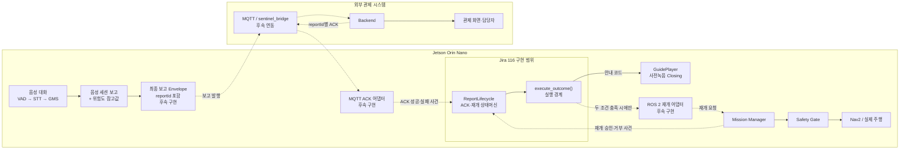

# 관제 보고 ACK·탐사 재개 아키텍처

> Jira: S15P11A301-116
>
> 적용 범위: 음성 세션 보고 생성 이후 관제 ACK, Mission Manager 재개 결정, Closing 안내
>
> 구현 상태: 내부 상태머신·실행 경계 구현 완료, 실제 MQTT·ROS 2 연결은 후속 통합
>
> 용어: [`음성-파이프라인-용어집.md`](음성-파이프라인-용어집.md)

이 문서는 음성 세션이 끝난 뒤 관제 보고를 어떻게 만들고, 관제 수신 확인과
로봇의 탐사 재개 결정을 어떻게 안전하게 결합하는지 설명한다. 특정 프레임워크를
모르는 팀원도 전체 흐름을 이해할 수 있도록 실제 사례와 용어 설명을 함께 제공한다.

## 1. 먼저 알아둘 용어

| 용어 | 쉬운 설명 | 이 프로젝트에서의 역할 |
|---|---|---|
| `ACK` | 상대가 메시지를 정상적으로 받았다는 확인 응답(Acknowledgement) | 관제 서버가 특정 보고서를 수신했는지 확인 |
| `reportId` | 보고서마다 발급하는 고유 번호 | 과거 보고의 늦은 ACK가 현재 보고에 잘못 적용되는 것을 방지 |
| 상태머신 | 현재 상태와 들어온 사건을 기준으로 다음 행동을 결정하는 로직 | ACK·재개 신호의 중복, 역순, timeout을 일관되게 처리 |
| 사건(Event) | 상태머신에 전달되는 외부 변화 | ACK 성공·실패, 재개 승인·거부, timeout |
| `LifecycleOutcome` | 상태머신이 사건을 처리한 결과 | 재생할 음성, 재개 요청 여부, 다음 상태를 표현 |
| 어댑터(Adapter) | 서로 다른 시스템의 형식을 연결하는 변환 계층 | MQTT 메시지를 내부 사건으로 바꾸거나 ROS 2 요청을 호출 |
| MQTT | 로봇과 서버가 메시지를 주고받는 경량 통신 방식 | 보고 전송과 ACK 수신에 사용할 예정 |
| Outbox | 전송하지 못한 메시지를 보관했다가 다시 보내는 대기열 | 네트워크 장애 시 보고 유실 방지. 실제 구현은 bridge 후속 범위 |
| ROS 2 | 로봇 내부 노드가 토픽·서비스로 통신하는 프레임워크 | Mission Manager에 탐사 재개를 요청할 예정 |
| Mission Manager | 현재 임무의 진행·정지·재개를 관리하는 로봇 모듈 | 재개 가능 여부를 승인하고 요청을 인수 |
| Safety Gate | 센서·비상정지 등 안전 조건을 최종 확인하는 경계 | 승인되지 않은 주행 방지 |
| Nav2 | 로봇의 경로 계획과 주행을 담당하는 ROS 2 구성요소 | 안전 확인 후 실제 탐사 주행 수행 |
| Closing | 요구조자와 대화를 마칠 때 재생하는 종료 안내 | 보고 성공 여부와 탐사 지속 여부를 알림 |
| timeout | 정해진 시간 안에 응답이 오지 않은 상태 | 무한 대기를 막되 성공으로 오판하지 않도록 처리 |
| GMS | 외부 LLM API를 호출하는 게이트웨이 | STT 문장에서 정해진 사실 필드만 추출 |
| VAD | 사람의 음성이 있는 구간을 찾는 기능 | 실제 음성 응답 여부 판단을 보조 |
| STT | 음성을 글자로 변환하는 기능 | 요구조자의 발화를 텍스트로 변환 |

`ACK 성공`은 관제 서버가 보고를 받았다는 뜻일 뿐, 로봇이 출발해도 된다는 뜻이
아니다. `재개 승인`도 로컬 안전 조건을 통과했다는 뜻일 뿐, 보고가 관제에
전달됐다는 뜻이 아니다. 따라서 두 신호를 분리해서 확인한다.

## 2. 이번 MR이 만든 아키텍처



### 2.1 모듈별 책임

- 음성 파이프라인은 요구조자의 답변을 구조화하고 보고 내용을 만든다.
- backend·bridge는 보고 전송, Outbox 보관, 관제 ACK 수신을 담당한다.
- `ReportLifecycle`은 ACK와 Mission Manager 결정을 결합한다.
- `execute_outcome()`은 상태머신 결과를 음성 재생과 재개 요청 경계에 전달한다.
- `GuidePlayer`는 승인된 사전녹음 음성만 재생한다.
- Mission Manager·Safety Gate·Nav2가 실제 주행 가능 여부와 주행을 담당한다.
- 음성 모듈은 모터 명령을 직접 생성하지 않는다.

실제 MQTT 토픽·공통 JSON 스키마는 backend와 `sentinel_bridge`의 이벤트 기능이
병합된 뒤 공통 계약으로 확정한다. 이번 MR은 팀원 모듈을 추측해 수정하지 않고,
향후 실제 구현을 꽂을 수 있는 프레임워크 독립적인 경계를 제공한다.

## 3. 보고서가 만들어지는 과정

현재 보고서는 자유 형식의 장문을 LLM이 작성하는 방식이 아니다. GMS는 발화에서
정해진 사실 세 가지만 추출하고, 시스템이 관찰값을 추가한 뒤 고정된 규칙이
위험도 참고값을 별도로 계산한다.

```text
요구조자 음성
→ VAD로 음성 구간 확인
→ STT로 텍스트 변환
→ 환각 가드로 무효 STT 제거
→ GMS 또는 키워드 폴백으로 사실 3개 추출
→ 시스템 필드 추가
→ 허용 형식 검증·안전한 값으로 보정
→ 고정 규칙으로 위험도 참고값 계산
→ 관제 전송 경계에 인계
```

### 3.1 GMS가 추출하는 정보

예를 들어 요구조자가 다음과 같이 말했다고 가정한다.

> 여기 두 명 있어요. 저는 움직이기 어렵고 숨쉬기는 괜찮아요.

GMS는 진단이나 구조 순위를 만들지 않고 다음 세 필드만 추출한다.

```json
{
  "reportedResponsiveCount": 2,
  "mobilityStatus": "NO",
  "urgentConditionReported": "NO"
}
```

### 3.2 시스템이 추가하는 정보

```json
{
  "responseScope": "GROUP",
  "anyResponseDetected": true,
  "reportedResponsiveCount": 2,
  "reportedCountStatus": "SELF_REPORTED_GROUP_COUNT",
  "countConfidence": null,
  "mobilityStatus": "NO",
  "urgentConditionReported": "NO",
  "operatorReviewRequired": true,
  "terminationReason": "NORMAL"
}
```

| 필드 | 의미 | 결정 주체 |
|---|---|---|
| `responseScope` | 발화 정보를 개인이 아닌 주변 그룹 정보로 취급 | 시스템 정책 |
| `anyResponseDetected` | 정상 청취 과정에서 음성 응답을 감지했는지 | VAD·상태머신 |
| `reportedResponsiveCount` | 화자 본인을 포함해 발화자가 직접 보고한 응답 가능 총인원 | GMS·폴백 |
| `reportedCountStatus` | 인원 수의 출처·확정 상태 | 시스템·관제 |
| `countConfidence` | 인원 수 인식 신뢰도 | 현재 측정 미구현이므로 `null` |
| `mobilityStatus` | 그룹이 스스로 이동할 수 있다고 답했는지 | GMS·폴백 |
| `urgentConditionReported` | 긴급 상태가 있다고 발화했는지 | GMS·폴백 |
| `operatorReviewRequired` | 관제 담당자의 최종 확인 필요 여부 | 안전 정책, 항상 `true` |
| `terminationReason` | 세션이 끝난 이유 | 대화 상태머신 |

BRIO 100 마이크 하나로 화자를 정확히 구분할 수 없으므로 모든 발화는
`GROUP` 범위로 취급한다. `null`은 관찰·계산하지 못했다는 뜻이고,
`UNKNOWN`은 질문을 처리했지만 값을 확정하지 못했다는 뜻이다.

### 3.3 잘못된 값 보정

GMS가 음수 인원, 허용되지 않은 문자열, 잘못된 타입을 반환해도 그대로 사용하지 않는다.
`coerce_report()`는 잘못된 값을 `null` 또는 `UNKNOWN`으로 낮추고
`operatorReviewRequired`를 안전한 기본값인 `true`로 유지한다.

### 3.4 위험도 참고값 계산

LLM이 구조 우선순위를 자유롭게 판단하지 않는다. 버전이 고정된
`voice-risk-v1.0` 규칙이 관제 우선 확인용 참고값을 계산한다.

```text
정상 청취 후 음성 응답 없음                 → IMMEDIATE
긴급 상태가 있다고 발화                    → IMMEDIATE
자력 이동이 불가능하다고 발화              → URGENT
자력 이동 가능 + 긴급 상태 없다고 발화     → DELAYED
정보 부족 또는 시스템 오류                 → UNKNOWN
```

앞선 사례의 결과는 다음과 같다.

```json
{
  "riskLevel": "URGENT",
  "riskReasons": [
    "자력 이동이 불가능하다고 발화함"
  ],
  "ruleVersion": "voice-risk-v1.0",
  "operatorReviewRequired": true
}
```

`riskLevel`은 정식 의료 triage나 최종 구조 순위가 아니다. 관제 전문가가 보고 내용을
검토할 때 사용할 위험 신호 참고값이다.

### 3.5 현재 구현과 목표 전송 형식의 차이

현재 `pipeline.py`는 음성 세션 보고와 위험도 참고값을 콘솔에 각각 출력하고,
`queue_report(info)`로 음성 세션 보고를 전송 경계에 인계한다. 실제 전송 어댑터가
없으면 `PENDING`과 “관제 전송 어댑터 미연결”을 반환한다.

따라서 현재 상태는 다음과 같다.

| 항목 | 상태 |
|---|---|
| 음성 세션 보고 생성 | 구현됨 |
| 값 검증·보정 | 구현됨 |
| 규칙 기반 위험도 계산 | 구현됨 |
| 콘솔 출력·전송 대기 상태 | 구현됨 |
| `reportId` 발급 | 후속 구현 |
| 보고와 위험도를 하나의 Envelope로 조립 | 후속 구현 |
| 실제 MQTT 전송·Backend 저장 | 후속 구현 |
| 관제 화면 표시·ACK 반환 | 후속 구현 |

목표로 하는 최종 Envelope의 예시는 다음과 같다. 필드명과 MQTT 계약은 backend·bridge
담당자와 합의한 뒤 확정한다.

```json
{
  "reportId": "report-20260728-001",
  "sessionReport": {
    "responseScope": "GROUP",
    "anyResponseDetected": true,
    "reportedResponsiveCount": 2,
    "reportedCountStatus": "SELF_REPORTED_GROUP_COUNT",
    "countConfidence": null,
    "mobilityStatus": "NO",
    "urgentConditionReported": "NO",
    "operatorReviewRequired": true,
    "terminationReason": "NORMAL"
  },
  "riskAssessment": {
    "riskLevel": "URGENT",
    "riskReasons": [
      "자력 이동이 불가능하다고 발화함"
    ],
    "ruleVersion": "voice-risk-v1.0",
    "operatorReviewRequired": true
  },
  "createdAt": "2026-07-28T16:30:00+09:00"
}
```

## 4. 실제 사례에서의 정상 흐름

### 4.1 요구조자 대화와 보고 생성

1. 요구조자가 “여기 두 명 있고 저는 움직이기 어렵습니다”라고 답한다.
2. STT가 발화를 텍스트로 변환한다.
3. GMS가 인원 수 `2`, 이동 가능 여부 `NO`, 긴급 상태 `UNKNOWN`을 추출한다.
4. 시스템이 응답 감지 여부와 종료 사유를 추가한다.
5. 규칙 엔진이 `URGENT`와 근거를 생성한다.
6. 후속 Envelope 구현이 `report-20260728-001`을 발급해 MQTT로 보낸다.

### 4.2 관제 ACK와 재개 승인

backend가 보고를 저장한 뒤 다음 ACK를 보낸다고 가정한다.

```json
{
  "reportId": "report-20260728-001",
  "status": "SUCCEEDED"
}
```

MQTT 어댑터는 이를 내부 사건으로 변환한다.

```python
LifecycleEvent(
    event_type=LifecycleEventType.REPORT_ACK_SUCCEEDED,
    report_id="report-20260728-001",
)
```

이때 관제 수신만 확인됐으므로 상태는 `WAITING_RESUME_DECISION`이 된다.
아직 성공 음성을 재생하지 않고 탐사 재개도 요청하지 않는다.

Mission Manager가 로봇·센서·임무 상태를 확인하고 같은 보고에 대한
`RESUME_APPROVED` 사건을 전달하면 두 조건이 모두 충족된다.

```text
관제 ACK 성공: O
탐사 재개 승인: O
→ READY_TO_RESUME
```

`execute_outcome()`은 결합형 Closing을 한 번 재생하고
`request_mission_resume()`를 한 번 호출한다.

> 구조 요청이 관제에 전달되었습니다. 다른 구역을 확인하기 위해 탐사를 계속하겠습니다.

이 호출은 Mission Manager에 재개를 요청한 것이며 음성 모듈이 모터를 직접 움직인 것이
아니다. 실제 주행은 Safety Gate 확인을 거쳐 Nav2가 수행한다.

## 5. 장애·예외 사례

### 5.1 관제 ACK는 성공했지만 재개가 거부됨

```text
REPORT_ACK_SUCCEEDED
→ RESUME_REJECTED
→ REPORT_CONFIRMED_STAY
```

관제 전달 성공 안내만 재생하고 정지 상태를 유지한다. 재개 요청은 보내지 않는다.

### 5.2 ACK가 오지 않음

```text
보고 전송
→ ACK 대기
→ CLOSING_TIMEOUT
→ REPORT_PENDING
```

실제 수신을 확인하지 못했으므로 “관제에 전달되었습니다”라고 말하지 않는다.
전송 대기 안내를 사용하고 보고는 Outbox 후속 구현에서 재전송 대상으로 유지한다.

### 5.3 재개 승인이 ACK보다 먼저 도착함

분산 시스템에서는 사건 순서가 바뀔 수 있다. 재개 승인이 먼저 와도 ACK 전에는
음성을 재생하거나 재개를 요청하지 않는다. 나중에 같은 `reportId`의 ACK가 오면
정상 순서와 동일하게 한 번만 처리한다.

```text
ACK 성공 → 재개 승인 ──┐
                       ├→ Closing 1회 → 재개 요청 1회
재개 승인 → ACK 성공 ──┘
```

### 5.4 과거 보고의 ACK가 늦게 도착함

현재 처리 중인 보고가 `report-002`인데 `report-001`의 ACK가 도착하면
`reportId`가 다르므로 무시한다. 과거 ACK 때문에 현재 로봇이 잘못 출발하지 않는다.

### 5.5 중복·충돌 사건

- 같은 ACK 또는 재개 승인이 여러 번 와도 한 번만 처리한다.
- 성공 ACK 뒤 늦게 도착한 실패 ACK는 무시한다.
- 재개 승인 뒤 충돌하는 재개 거부 사건은 상태를 바꾸지 않는다.
- 종료 상태가 된 보고에는 추가 음성이나 재개 요청을 만들지 않는다.

## 6. 상태와 출력

| 상태 | 의미 | 안내·동작 |
|---|---|---|
| `WAITING_REPORT_ACK` | 관제 ACK 대기 | 없음 |
| `WAITING_RESUME_DECISION` | ACK 성공, 재개 결정 대기 | 짧은 Closing 대기 |
| `READY_TO_RESUME` | ACK 성공과 재개 승인 모두 확인 | 결합형 성공·출발 안내, Mission Manager 재개 요청 |
| `REPORT_CONFIRMED_STAY` | ACK 성공, 재개 거부 또는 제한시간 초과 | 성공 안내만 재생, 정지 유지 |
| `REPORT_PENDING` | ACK 없이 제한시간 초과 | 전송 대기 안내, Outbox 유지 |
| `DELIVERY_FAILED` | 전송 실패 확정 | 네트워크 대기 안내 |

## 7. 사건 계약

모든 사건은 같은 `reportId`를 가져야 한다.

| 사건 | 발행 주체 | 의미 |
|---|---|---|
| `REPORT_ACK_SUCCEEDED` | 관제 전송 어댑터 | 관제 서버가 해당 보고를 수신함 |
| `REPORT_ACK_FAILED` | 관제 전송 어댑터 | 전송 실패가 확정됨 |
| `RESUME_APPROVED` | Mission Manager | 로컬 안전 조건을 확인하고 탐사 재개를 승인함 |
| `RESUME_REJECTED` | Mission Manager | 탐사 재개를 허용하지 않음 |
| `CLOSING_TIMEOUT` | 음성 세션 조정 계층 | ACK 또는 재개 결정을 기다리는 제한시간이 끝남 |

## 8. 중복 안내 방지

`REPORT_SUCCEEDED_DEPARTURE` 음원에는 관제 전달 성공과 탐사 지속 안내가 함께 들어 있다.
ACK 직후 성공 음성을 먼저 재생하고 나중에 결합형 음원을 재생하면 성공 문구가
두 번 반복된다. 따라서 짧은 Closing 구간 동안 ACK와 재개 결정을 함께 기다린다.

- ACK와 재개 승인 모두 확인: 결합형 음원 한 번
- ACK 성공 후 재개 거부 또는 Closing timeout: 성공 음원 한 번
- ACK 미확인: 성공 표현 금지

## 9. 이번 MR에서 검증한 범위

단위 테스트는 실제 MQTT 브로커와 ROS 2 노드 대신 가짜 사건·플레이어·콜백을 사용한다.

- ACK 후 재개 승인과 재개 승인 후 ACK가 같은 결과인지
- 조건 충족 전에는 음성과 재개 요청이 발생하지 않는지
- 조건 충족 후 결합형 음성과 재개 요청이 각각 한 번만 발생하는지
- ACK 실패·timeout·재개 거부 시 주행 요청을 보내지 않는지
- 다른 `reportId`, 중복·충돌 사건을 무시하는지
- Mission Manager 어댑터 예외가 상태머신 밖으로 전파되지 않는지

따라서 이번 테스트는 **연동 규칙과 호출 조건을 검증한 단위 테스트**다.
실제 MQTT 송수신, ROS 2 서비스 호출, 로봇 주행을 확인한 통합 테스트는 아니다.

## 10. 후속 통합

1. 최종 보고 Envelope와 `reportId` 발급 규칙 확정
2. backend·bridge의 보고 토픽과 ACK 메시지 계약 확정
3. 실제 MQTT 사건을 `LifecycleEvent`로 변환하는 어댑터 연결
4. Mission Manager 서비스 또는 ROS 2 토픽을 재개 콜백에 연결
5. Jetson에서 중복 ACK·역순·네트워크 단절·센서 비정상 통합 시험
6. Safety Gate와 Nav2를 포함한 실제 정지·재출발 시험
