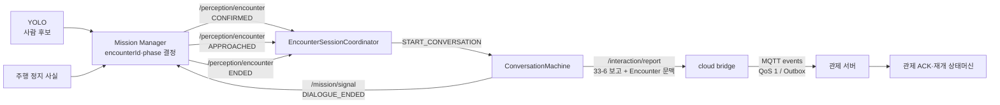

# 비전 Encounter·음성 세션 연동

> Jira: S15P11A301-117, S15P11A301-159
>
> 구현 범위: Encounter 계약 검증, 음성 세션 시작·중단 조건, 중복 억제
>
> S15P11A301-159: 실제 ROS 2 구독·보고·Mission Signal·E-Stop 중단 구현

## 1. 책임과 신호 흐름

`/perception/encounter`의 유일한 발행자는 Mission Manager다. YOLO, 음성, 주행
노드가 각자 Encounter phase를 발행하면 순서와 `encounterId`가 충돌할 수 있으므로
각 모듈은 자신이 관찰한 사실만 Mission Manager에 알린다.



## 2. 시작 조건

- `CONFIRMED`: `encounterId`와 최초 비전 문맥을 등록한다. 녹음하지 않는다.
- `APPROACHED`: Mission Manager가 안전 위치 정지를 확인한 사건이므로 이때 한 번만
  음성 세션을 시작한다.
- 동일 `encounterId`의 반복 사건은 두 번째 세션을 만들지 않는다.
- 다른 Encounter가 진행 중이면 현재 세션을 덮어쓰지 않는다.

`APPROACHED`에 포함된 `personCount`가 0이어도 최초 `CONFIRMED`의 사람 수를
보고 문맥으로 보존한다. phase 사건의 사람 수는 상태 전이 조건이 아니기 때문이다.

## 3. 보고 문맥

음성 세션의 33-6 필드는 발화 관찰값만 나타낸다. 비전·임무 식별자를 그 객체에
섞으면 `coerce_report()`가 허용하지 않은 필드를 제거하고 책임도 불명확해진다.
따라서 최종 보고 Envelope에 넣을 문맥으로 분리한다.

```json
{
  "encounterId": "c81f6d20-5a47-4e93-b2d8-1f70e4a95c33",
  "missionId": "4a43f45c-779f-4df5-ac04-1695724829a4",
  "visionPersonCount": 3
}
```

`visionPersonCount`는 비전 탐지 인원이며 요구조자가 말한
`reportedResponsiveCount`와 의미가 다르다. 두 값을 자동으로 같다고 간주하지 않는다.

## 4. 종료와 안전

- 대화 완료 시 보고 인계와 “대화 완료 사실 통지” 결과를 만든다.
- 음성 모듈은 `/perception/encounter`의 `ENDED`를 직접 발행하지 않는다.
- Mission Manager가 대화 완료 사실을 받아 `ENDED`를 결정한다.
- `LOST`, 수동 중단, 안전 중단에서는 진행 중 대화를 중단하고 자동 재개를 요청하지 않는다.
- 관제 보고 뒤 실제 재개는 S15P11A301-116의 ACK·재개 승인 조건을 따른다.

## 5. 현재 구현과 실제 연동 경계

| 항목 | 상태 |
|---|---|
| Encounter 본문·Envelope JSON 검증 | 구현됨 |
| phase·UUID·UTC·인원·선택 필드 검증 | 구현됨 |
| APPROACHED 이후 한 번만 세션 시작 | 구현됨 |
| 중복·역순·다른 Encounter·LOST 처리 | 구현됨 |
| 보고용 Encounter 문맥 생성 | 구현됨 |
| 대화 시작·중단·보고·완료 통지 실행 어댑터 | 구현됨 |
| 실제 `/perception/encounter` ROS 2 구독 | 구현됨 (`ros_node.py`) |
| 실제 Conversation 실행 호출 | 작업 스레드로 구현됨 |
| 완료 통지 | `/mission/signal`의 `DIALOGUE_ENDED` |
| 구조화 보고 인계 | `/interaction/report` → bridge → MQTT/Outbox |
| ESTOP·ERROR·MANUAL·PAUSED 중단 | 구현됨 |
| 실제 장비 주행·마이크·브로커 시험 | Jetson 검증 필요 |

## 6. 단위 테스트 범위

ROS 2와 카메라 없이 다음 계약을 검증한다.

- 공통 샘플과 같은 본문·Envelope 입력
- 잘못된 JSON, 누락 필드, 잘못된 phase·타입
- `CONFIRMED → APPROACHED → 대화 완료 → ENDED`
- `APPROACHED` 역순, 중복 phase, 다른 `encounterId`
- 진행 중 `LOST`, 수동·안전 중단
- 완료한 Encounter 재시작 방지

## 7. 확정된 계약과 미확정 계약

### 7.1 확정됨: Mission Manager에서 음성 모듈로

| 항목 | 확정값 |
|---|---|
| 발행 주체 | `mission_manager_node` 단일 발행자 |
| ROS 2 토픽 | `/perception/encounter` |
| 메시지 타입 | `std_msgs/String` |
| 본문 형식 | `common/schemas/encounter.schema.json` |
| 세션 등록 | `CONFIRMED` |
| 세션 시작 | 안전 위치 정지를 의미하는 `APPROACHED` |
| 상관관계 키 | `encounterId` |

이 방향은 공통 스키마와 S15P11A301-123 구현이 병합됐으므로 추측 없이 사용할 수 있다.

### 7.2 확정됨: 음성 모듈에서 Mission Manager·관제로

| 항목 | 확정값 |
|---|---|
| 대화 완료 | `/mission/signal`, `signal=DIALOGUE_ENDED`, `source=VOICE` |
| 보고 토픽 | `/interaction/report`, `std_msgs/String` JSON |
| 보고 계약 | `common/schemas/interaction-report.schema.json` |
| 관제 경로 | cloud bridge의 MQTT `events`, QoS 1, 단절 시 Outbox |
| 중복 키 | `interactionId`를 MQTT `messageId`로 재사용 |
| 안전 중단 | ESTOP·ERROR는 `ABORTED_SAFETY`, MANUAL·PAUSED는 `ABORTED_MANUAL` |
| 자동 재개 | 중단 시 금지, 정상 완료는 Mission Manager의 기존 보고 완료 전이를 사용 |
| 실행 | `.venv/bin/python -m sentinel_voice.ros_node` (`voice.launch.py`) |

## 8. 완료 신호 예시

```json
{
  "signal": "DIALOGUE_ENDED",
  "sentAt": "2026-07-30T09:17:31.000Z",
  "source": "VOICE",
  "encounterId": "c81f6d20-5a47-4e93-b2d8-1f70e4a95c33",
  "missionId": "4a43f45c-779f-4df5-ac04-1695724829a4",
  "commandId": null,
  "detail": "음성 세션 종료: NORMAL"
}
```

`DIALOGUE_ENDED`는 보고를 ROS/MQTT 전송 경계에 인계한 뒤 발행한다. 이 시점의
`QUEUED`는 서버 ACK가 아니다. 서버 수신 성공 안내는 S15P11A301-116의 ACK 계약이
연결된 뒤에만 사용할 수 있다.

## 9. 실행과 검증

```bash
./scripts/demo_up.sh
ros2 topic echo /interaction/report std_msgs/msg/String
ros2 topic echo /mission/signal std_msgs/msg/String
```

단위·계약 시험은 `ai/stt/tests/test_integration.py`,
`sentinel_bridge/test/test_message_contract.py`, `common/samples/interaction-report.json`
에서 ROS 장비 없이 검증한다. 실제 마이크·E-Stop·브로커·탐사 복귀는 Jetson 전체
스택에서 최종 확인한다.
