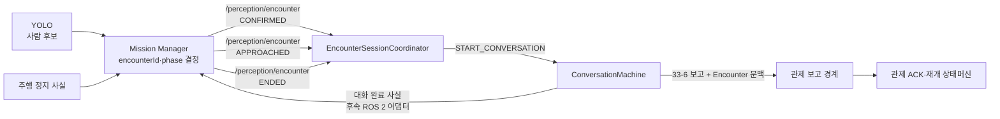

# 비전 Encounter·음성 세션 연동

> Jira: S15P11A301-117
>
> 구현 범위: Encounter 계약 검증, 음성 세션 시작·중단 조건, 중복 억제
>
> 후속 범위: 실제 ROS 2 구독 노드, Mission Manager 상태 통지, Jetson 주행 시험

## 1. 책임과 신호 흐름

`/perception/encounter`의 유일한 발행자는 Mission Manager다. YOLO, 음성, 주행
노드가 각자 Encounter phase를 발행하면 순서와 `encounterId`가 충돌할 수 있으므로
각 모듈은 자신이 관찰한 사실만 Mission Manager에 알린다.



## 2. 시작 조건

- `CONFIRMED`: `encounterId`와 최초 비전 문맥을 등록한다. 녹음하지 않는다.
- `APPROACHED`: Mission Manager가 안전 위치 정지를 확인한 사건이므로 이때 한 번만
  음성 세션을 시작한다.
- 동일 `encounterId`의 반복 사건은 두 번째 세션을 만들지 않는다.
- 다른 Encounter가 진행 중이면 현재 세션을 덮어쓰지 않는다.

`APPROACHED`에 포함된 `personCount`가 0이어도 최초 `CONFIRMED`의 사람 수를
보고 문맥으로 보존한다. phase 사건의 사람 수는 상태 전이 조건이 아니기 때문이다.

## 3. 보고 문맥

음성 세션의 33-6 필드는 발화 관찰값만 나타낸다. 비전·임무 식별자를 그 객체에
섞으면 `coerce_report()`가 허용하지 않은 필드를 제거하고 책임도 불명확해진다.
따라서 최종 보고 Envelope에 넣을 문맥으로 분리한다.

```json
{
  "encounterId": "c81f6d20-5a47-4e93-b2d8-1f70e4a95c33",
  "missionId": "4a43f45c-779f-4df5-ac04-1695724829a4",
  "visionPersonCount": 3
}
```

`visionPersonCount`는 비전 탐지 인원이며 요구조자가 말한
`reportedResponsiveCount`와 의미가 다르다. 두 값을 자동으로 같다고 간주하지 않는다.

## 4. 종료와 안전

- 대화 완료 시 보고 인계와 “대화 완료 사실 통지” 결과를 만든다.
- 음성 모듈은 `/perception/encounter`의 `ENDED`를 직접 발행하지 않는다.
- Mission Manager가 대화 완료 사실을 받아 `ENDED`를 결정한다.
- `LOST`, 수동 중단, 안전 중단에서는 진행 중 대화를 중단하고 자동 재개를 요청하지 않는다.
- 관제 보고 뒤 실제 재개는 S15P11A301-116의 ACK·재개 승인 조건을 따른다.

## 5. 현재 구현과 실제 연동 경계

| 항목 | 상태 |
|---|---|
| Encounter 본문·Envelope JSON 검증 | 구현됨 |
| phase·UUID·UTC·인원·선택 필드 검증 | 구현됨 |
| APPROACHED 이후 한 번만 세션 시작 | 구현됨 |
| 중복·역순·다른 Encounter·LOST 처리 | 구현됨 |
| 보고용 Encounter 문맥 생성 | 구현됨 |
| 대화 시작·중단·보고·완료 통지 실행 어댑터 | 구현됨 |
| 실제 `/perception/encounter` ROS 2 구독 | 후속 구현 |
| 실제 Conversation 실행 호출 | 후속 어댑터 |
| `/interaction/dialogue_state` 통지 계약 | Mission Manager와 확정 필요 |
| 실제 정지·E-Stop·Nav2 통합 시험 | Jetson 후속 검증 |

## 6. 단위 테스트 범위

ROS 2와 카메라 없이 다음 계약을 검증한다.

- 공통 샘플과 같은 본문·Envelope 입력
- 잘못된 JSON, 누락 필드, 잘못된 phase·타입
- `CONFIRMED → APPROACHED → 대화 완료 → ENDED`
- `APPROACHED` 역순, 중복 phase, 다른 `encounterId`
- 진행 중 `LOST`, 수동·안전 중단
- 완료한 Encounter 재시작 방지

## 7. 확정된 계약과 미확정 계약

### 7.1 확정됨: Mission Manager에서 음성 모듈로

| 항목 | 확정값 |
|---|---|
| 발행 주체 | `mission_manager_node` 단일 발행자 |
| ROS 2 토픽 | `/perception/encounter` |
| 메시지 타입 | `std_msgs/String` |
| 본문 형식 | `common/schemas/encounter.schema.json` |
| 세션 등록 | `CONFIRMED` |
| 세션 시작 | 안전 위치 정지를 의미하는 `APPROACHED` |
| 상관관계 키 | `encounterId` |

이 방향은 공통 스키마와 S15P11A301-123 구현이 병합됐으므로 추측 없이 사용할 수 있다.

### 7.2 미확정: 음성 모듈에서 Mission Manager로

다음 항목은 저장소에 공통 계약이나 Mission Manager 구현이 없어 아직 확정할 수 없다.
TBD 대장의 `TBD-AUD-003`으로 추적한다.

| 결정할 항목 | 제안안 | 확인할 내용 |
|---|---|---|
| 대화 상태 전달 방식 | `/interaction/dialogue_state` 토픽 | 토픽·서비스·Action 중 무엇을 사용할지 |
| 메시지 타입 | `std_msgs/String` JSON | 커스텀 ROS 2 메시지가 필요한지 |
| 상관관계 | `encounterId` 필수 | Mission Manager가 같은 키로 상태를 결합하는지 |
| 세션 상태 | `COMPLETED`, `FAILED`, `ABORTED` | 허용 enum과 재시도 의미 |
| 종료 사유 | 33-6 `terminationReason` 재사용 | Mission Manager가 필요한 상세 사유 |
| 보고 상태 | `PENDING`, `QUEUED`, `SUCCEEDED`, `FAILED` | `ENDED` 전에 필요한 최소 상태 |
| 완료 시각 | UTC `occurredAt` | ROS clock과 wall clock 중 기준 |
| `ENDED` 조건 | Mission Manager가 종합 판단 후 발행 | 대화·로컬 보고·사후 영상 중 필수 조건 |
| 재개 요청 방식 | `/mission/resume` 서비스 제안 | 요청·응답 필드와 timeout |
| 실행 패키지 | 별도 ROS 2 interaction 패키지 제안 | `ai/stt`를 어떻게 설치·호출할지 |

## 8. 제안 메시지

아래 JSON은 협의 출발점이며 **확정 계약이 아니다**. 합의 전에는 코드나
`common/schemas`에 규범으로 추가하지 않는다.

```json
{
  "encounterId": "c81f6d20-5a47-4e93-b2d8-1f70e4a95c33",
  "state": "COMPLETED",
  "terminationReason": "NORMAL",
  "reportState": "QUEUED",
  "occurredAt": "2026-07-28T05:10:30.120Z"
}
```

필드 의미:

- `encounterId`: 어떤 사람 발견 사건의 대화인지 식별한다.
- `state`: 대화의 성공·실패·중단 결과다.
- `terminationReason`: 정상 종료, timeout, 오디오 오류, 수동·안전 중단을 구분한다.
- `reportState`: 로컬 보고가 전송 경계에 인계됐는지 나타낸다. `QUEUED`는 관제 ACK가 아니다.
- `occurredAt`: 사건 발생 시각이다.

## 9. 팀 협의 완료 기준

Mission Manager 담당자와 다음 항목이 합의되고 저장소에 병합되면 실제 어댑터 구현을
재개한다.

1. 토픽 또는 서비스 이름과 통신 방식
2. 생산자·소비자와 단일 권한자
3. 필수 필드, 타입, enum, 시간 형식
4. 중복·역순·timeout 처리 책임
5. Mission Manager의 `ENDED` 발행 조건
6. 재개 요청의 승인·거부 응답 의미
7. `common/schemas` 스키마와 정상·중단 샘플
8. 가짜 발행자·구독자를 사용한 계약 테스트

Mission Manager 전체 구현이 끝날 때까지 기다릴 필요는 없다. 위 계약이 먼저
문서·스키마로 병합되면 AI는 실제 ROS 2 어댑터와 테스트 대역을 구현할 수 있다.

## 10. 대기 중 진행 원칙

- Jira 117은 `진행 중`으로 유지하고 완료 처리하지 않는다.
- 현재 브랜치와 단위 테스트 구현은 보존한다.
- 미확정 토픽·서비스를 AI가 임의로 생성하지 않는다.
- 계약 대기 중에는 Jira 118~120의 GMS·RAM·STT 정량 검증처럼 독립 작업을 진행한다.
- 계약이 확정되면 같은 Jira 117로 돌아와 실제 ROS 2·Jetson 통합을 완료한다.
