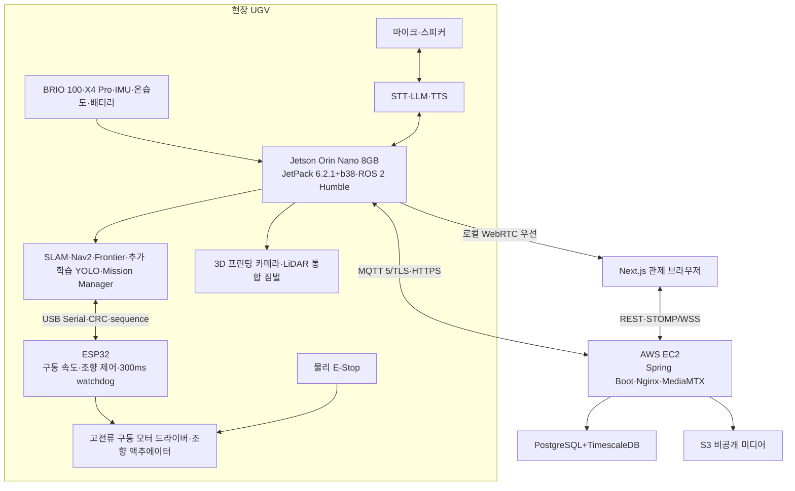

> Sentinel UGV 통합 명세서 v1.1의 일부 — 문서 규칙·버전·변경 이력은 [README](README.md) 참조

# 1. 프로젝트 개요 및 배경 [확정]
## 1.1 프로젝트 정의
Sentinel UGV는 재난·사고 현장과 같이 사람이 즉시 진입하기 어렵거나 통신 상태가 불안정한 공간을 무인으로 탐사하기 위한 소형 자율주행 UGV(Unmanned Ground Vehicle)이다. Jetson Orin Nano는 카메라·LiDAR·AI·SLAM·Nav2·임무 판단을 처리하고, ESP32는 엔코더·모터 속도 제어·300ms watchdog을 담당한다. 로봇은 미지 공간을 탐색하다 사람을 발견하면 탐사를 일시정지하고 안전거리까지 접근해 음성으로 상태를 확인한다. 이후 위치·피해자 수·응답·이벤트 영상을 관제 시스템에 보고한다.

프로젝트는 단순 원격 조종 자동차가 아니라, 온디바이스 AI 추론, 2D LiDAR SLAM, 자율 탐사, 저지연 영상 관제, 시계열 데이터 관리, 클라우드 기반 임무 이력 조회가 하나의 시연 흐름으로 연결되는 통합 AIoT 시스템을 목표로 한다.

## 1.2 해결하려는 문제
- 재난 현장에서는 구조 인력이 진입하기 전 내부 구조와 장애물, 사람의 위치를 빠르게 파악하기 어렵다.
- 네트워크 연결이 끊기면 클라우드 의존형 로봇은 판단과 제어를 지속하기 어렵다.
- 카메라 영상만으로는 거리·지도·이동 가능 영역을 안정적으로 판단하기 어렵다.
- 센서, AI, 주행, 관제, 로그가 분리되어 있으면 최종 시연에서 통합 오류가 발생하기 쉽다.
- 단순 기능 구현만으로는 기술 선택 이유와 시스템 안전성을 설명하기 어렵다.

## 1.3 핵심 가치
| **가치**        | **설명**                                                                                            |
|-----------------|-----------------------------------------------------------------------------------------------------|
| **로컬 자율성** | 관제 서버 연결이 끊겨도 Jetson에서 탐사·장애물 회피·안전 정지를 수행한다.                           |
| **실시간성**    | 카메라·LiDAR·모터 제어의 핵심 경로를 로봇 내부에서 처리해 네트워크 지연을 배제한다.                 |
| **안전성**      | 물리/소프트웨어 E-Stop, 명령 타임아웃, 센서 상태 검사, Collision Monitor를 다중 안전 계층으로 둔다. |
| **통합성**      | AI 결과가 지도 좌표·알림·이벤트 영상·주행 상태로 연결된다.                                          |
| **관측 가능성** | 온습도, 배터리, 위치, 속도, Jetson 자원 사용량을 실시간·과거 그래프로 조회한다.                     |
| **설명 가능성** | 기술 변경 이유, 장단점, 구현 난이도, 대체안을 문서화해 발표와 포트폴리오에 활용한다.                |

## 1.4 대상 환경과 전제
- 주 시연 환경: 실내 평탄 복도 및 교실/회의실 수준의 장애물 코스
- 보조 시연 환경: 얇은 매트, 낮은 턱, 케이블 보호대 등 인위적인 경미한 노면 변화
- 주 네트워크 환경: Jetson과 관제 브라우저가 동일 Wi-Fi에 연결
- 원격 확장 환경: 브라우저와 Jetson이 다른 네트워크에 있으며 EC2 중계 사용
- 탐사 시간: 기본 7분, 5~10분 범위에서 설정 가능
- GPS: 실내 중심 프로젝트이므로 사용하지 않음

## 1.5 프로젝트 팀
팀명은 “역삼역역무실관제센터”이며 총 6명으로 구성한다.

| 팀원 | 담당 영역 |
|---|---|
| 김호준 | AI·백엔드 |
| 도영훈 | AI·프론트엔드·PM |
| 이원빈 | 백엔드·프론트엔드 |
| 박종화 | Embedded SW·ROS 2 |
| 김민석 | Embedded SW·PM |
| 박찬혁 | 백엔드·PM |

역할은 주 담당 영역을 뜻하며, 통합 시험·문서화·GitLab 운영은 팀 공통 작업으로 관리한다.

# 2. 목표, 범위 및 성공 기준 [확정]
## 2.1 최종 목표
> **최종 목표** 미지의 실내 공간에서 로봇이 지도를 생성하고 미탐사 영역을 탐색하며, 사람을 탐지하면 안전하게 접근해 음성으로 상태를 확인하고 위치·인원·응답·이벤트 영상을 보고한 뒤 탐사를 재개해 출발 위치로 복귀하는 통합 시스템을 완성한다.

## 2.2 MVP 필수 기능
| **ID**     | **기능**                                                      |
|------------|---------------------------------------------------------------|
| **MVP-01** | Jetson에서 카메라·LiDAR·AI·ROS 2·임무 판단, ESP32에서 저수준 주행 제어 통합 실행 |
| **MVP-02** | YDLIDAR X4 Pro 기반 실시간 SLAM 지도 생성                     |
| **MVP-03** | Nav2 기반 목표점 이동과 장애물 회피                           |
| **MVP-04** | Frontier 기반 미지 영역 자동 탐사                             |
| **MVP-05** | 현장 데이터를 추가 학습한 YOLO26n Detect 기반 person 탐지      |
| **MVP-06** | 사람을 추적·그룹화하고 지도 위치를 추정해 encounter 생성       |
| **MVP-07** | 같은 로컬망에서 WebRTC 저지연 영상 스트리밍                   |
| **MVP-08** | 게임패드 기반 수동 조종과 자율/수동 모드 전환                 |
| **MVP-09** | 온습도·배터리·Jetson 상태 실시간 표시                         |
| **MVP-10** | Spring Boot·Next.js 기반 통합 관제 및 임무 이력 조회          |
| **MVP-11** | PostgreSQL+TimescaleDB+S3 연계 저장                           |
| **MVP-12** | 물리 E-Stop, Jetson·ESP32 300ms watchdog, 센서 오류 안전 정지  |
| **MVP-13** | 탐사 종료 또는 명령 시 출발 위치 자동 복귀                    |
| **MVP-14** | GitLab 제공 Runner로 lint·test·build 수행, EC2 배포는 수동 승인 |
| **MVP-15** | 피해자 안전 접근·STT-LLM-TTS 상호작용·구조화 보고             |
| **MVP-16** | 확정 전 3초+상호작용 전체+종료 후 3초 이벤트 영상 저장        |

## 2.3 선택 기능
- EC2 MediaMTX를 통한 외부 네트워크 원격 WebRTC 스트리밍
- 로컬 스트림 실패 시 원격 스트림 자동 전환
- 탐지 결과를 WebSocket 메타데이터로 전송해 브라우저 Canvas 오버레이
- 배터리 전류·누적 소비량 측정
- 짐벌 OBSERVE 모드 원격 조작
- GitLab 수동 승인 Job을 통한 Jetson 배포
- Continuous Aggregate 기반 임무 간 통계 대시보드

## 2.4 확장 기능
- 기존 지도 재사용 및 Localization 모드
- 복수 UGV 관제
- 열화상·가스·연기 센서
- 피해자 정밀 재식별·개인별 장시간 대화
- 3D SLAM 또는 RGB-D 카메라
- 현장 통신용 LTE/5G 라우터
- 탐사 커버리지 최적화 및 정보 이득 기반 Frontier 점수화

## 2.5 MVP 제외 범위
- 회원가입·소셜 로그인·프로필·비밀번호 찾기·역할 세분화 관리 (관리자가 사전 등록하는 운영자 로그인은 구현)
- GPS 기반 실외 자율주행
- 완전한 험지·자갈·계단 주행
- 안전 인증 수준의 산업용 기능 안전
- 다수 사람의 정밀 재식별
- 전체 임무 영상의 상시 장시간 녹화
- Kubernetes 기반 운영
- Raspberry Pi 5의 차량 탑재

## 2.6 정량 성공 기준
| **항목**           | **목표**                                         | **검증 방법**                  |
|--------------------|--------------------------------------------------|--------------------------------|
| 통합 시연          | 전체 시나리오 3회 연속 성공                      | 체크리스트 및 영상 기록        |
| 로컬 영상 지연     | 체감 조종 가능한 수준, 목표 500ms 이하           | 화면 타임코드/LED 촬영 비교    |
| 조이스틱 안전 정지 | 유효 명령 중단 후 300ms 이내 ESP32 PWM 0         | 로직 분석 로그·고속 촬영       |
| 사람 탐지          | 출현 10회 중 9회 이상을 2초 내 확정 (FR-005와 동일 기준) | 정답 시나리오 반복             |
| 장애물 회피        | 정적 장애물을 충돌 없이 우회 또는 정지           | 표준 장애물 코스               |
| 지도 생성          | 복도 벽 구조가 중복·왜곡 없이 식별 가능          | 저장 지도 검토                 |
| 자동 복귀          | home pose까지 허용 오차 내 복귀                  | 지도 좌표 및 실제 위치 확인    |
| 이력 저장          | 임무·센서·이벤트·미디어 조회 가능                | 과거 임무 페이지 검증          |
| 서버 장애          | EC2 단절 시 로컬 자율 탐사 유지                  | 네트워크 차단 테스트           |
| 로컬 핵심 장애     | LiDAR/모터 오류 시 안전 정지                     | 노드 종료·케이블 분리 테스트   |
| 피해자 encounter   | 탐지·접근·질문·보고·영상 저장 흐름 완료          | 단일·다중 인원 반복 시나리오   |

# 3. 최신 확정 구조와 설계 결정 [확정]

| **영역** | **최신 결정** | **확정 상태와 남은 확인** |
|---|---|---|
| 차체 | BMW M7 유아전동차 구동 베이스 활용 | 후륜 RS540 모터 확인. 조향 링크·감속기·차축 구조는 분해 확인 후 확정 |
| 기구 | 기존 구동부를 살리고 차체 상부·센서 브래킷·카메라-LiDAR 짐벌을 3D 프린팅 | 센서 헤드 무게·서보 토크·진동 시험 필요 |
| 컴퓨팅 | Jetson Orin Nano 8GB 고수준 컴퓨팅 + ESP32 저수준 제어 | Raspberry Pi 5 차량 미사용 |
| 저수준 제어 | ESP32가 모터 PWM·조향·엔코더·DHT11·초음파·300ms watchdog 담당 | ESP-IDF 사용. 정확한 보드·엔코더·초음파·고전류 드라이버 모델은 TBD |
| 관제 | AWS EC2의 Spring Boot·Next.js·PostgreSQL/TimescaleDB·S3 | Docker Compose 배포, 운영자 로그인 구현(회원가입·소셜 로그인 제외) |
| 자율주행 | ROS 2 Humble·SLAM Toolbox·Nav2·Frontier Exploration | 엔코더·IMU·LiDAR 융합과 실제 조향 운동학 튜닝 필요 |
| AI | YOLO26n Detect를 현장 데이터로 추가 학습해 person 탐지 | Detect가 MVP. Pose는 사람이 3프레임 이상 연속 감지된 동안만 약 2FPS 조건부 실행 (25.6) |
| 음성 | BRIO 100 내장 마이크 → STT → LLM → TTS → 블루투스 스피커 응답 | 실행 위치는 전부 Jetson 온디바이스 확정(33-5). 모델 선정·동시 적재 실측은 TBD-AUD-002, 메모리 부족 시 33-8 축소안 적용 |
| 영상 | Jetson GStreamer·MediaMTX → 동일 Wi-Fi 브라우저 WebRTC | 원격 EC2 중계는 확장 기능 |
| 이벤트 저장 | 탐지 확정 전 3초 + 접근·상호작용 전체 + 종료 후 3초 | MP4·메타데이터를 S3·DB에 연결 |
| 개발 운영 | GitLab 모노레포·GitLab CI/CD·Docker | 전체 clone 후 Jetson은 `jetson/` 중심, EC2는 `frontend/`·`backend/` 실행 |

## 3.1 핵심 설계 원칙
- 영상·LiDAR·AI·주행 판단은 Jetson에서, 모터·엔코더·통신 watchdog은 ESP32에서, 관제·명령·이력은 EC2에서 처리한다.
- DHT11과 전방 초음파는 ESP32가 직접 읽는다. 초음파 근거리 정지는 Jetson 응답을 기다리지 않고 ESP32에서 우선 적용한다.
- Jetson↔ESP32는 유선 USB Serial을 사용하고 ESP32 Wi-Fi/Bluetooth는 안전 제어 경로에서 비활성화한다.
- 영상 경로와 제어/텔레메트리 경로를 분리한다.
- 네트워크가 끊겨도 안전 조건이 충족된 자율 탐사는 로컬에서 유지할 수 있으나, 수동 조종 연결이 끊기면 ESP32가 300ms 이내 정지한다.
- AI 탐지는 장애물 충돌 회피의 단일 안전 근거로 사용하지 않는다. 충돌 안전은 LiDAR·초음파·로컬 제한 로직이 담당한다.
- 기능 개수보다 전체 시연 흐름의 안정성과 복구 가능성을 우선한다.
- 모든 모듈은 실제 하드웨어 없이도 테스트 데이터·시뮬레이션으로 독립 개발할 수 있어야 한다.

# 4. 사용자·시연 시나리오 [확정]
## 4.1 사용자 유형
| **사용자** | **권한/역할**                                                                 |
|------------|-------------------------------------------------------------------------------|
| **운영자** | 탐사 시작·일시정지·재개·복귀·E-Stop·조이스틱 수동 조작                        |
| **관찰자** | 영상·지도·상태·과거 임무 조회. MVP에서는 별도 계정 구분 없이 단일 운영자 사용 |
| **개발자** | Jetson 노드 실행, 로그 확인, 배포, 파라미터 조정, 하드웨어 테스트             |

## 4.2 핵심 시연 시퀀스
1.  관제 페이지에 접속하고 Jetson·LiDAR·카메라·배터리·E-Stop 상태를 확인한다.
2.  로컬 WebRTC 영상과 조이스틱 연결 상태를 확인한다.
3.  운영자가 탐사 시작을 요청한다.
4.  Jetson은 새 임무와 빈 SLAM 지도를 생성하고 현재 위치를 home pose로 저장한다.
5.  Frontier 탐색기가 다음 미탐사 목표를 선택하고 Nav2가 경로를 생성한다.
6.  UGV는 장애물을 회피하며 이동하고, 지도와 위치를 관제 화면에 실시간 반영한다.
7.  YOLO와 ByteTrack이 한 명 이상의 사람을 약 1초간 안정적으로 확인하면 encounter를 생성하고 탐사를 일시정지한다.
8.  카메라 방향·LiDAR 거리·TF를 결합해 사람별 map 좌표와 그룹 위치를 계산한다.
9.  그룹 전체가 보이는 안전 관측 위치까지 저속 접근하고 음성으로 인원·응답·이동 가능 여부를 확인한다.
10. 확정 전 3초부터 상호작용 전체, 종료 후 3초까지 하나의 이벤트 영상을 저장하고 관제에 위치·사람 수·응답·미디어를 보고한다.
11. 보고가 로컬에 안전하게 저장된 후 탐사를 재개한다.
12. 중간에 운영자가 게임패드 수동 모드로 전환해 조작한 뒤 명시적으로 자율 탐사를 재개한다.
13. Frontier 소진, 7분 경과, 사용자 종료 또는 배터리 부족 시 신규 탐사를 중단한다.
14. UGV는 home pose로 자동 복귀한다.
15. 임무 종료 후 과거 임무 페이지에서 지도, 이동 경로, 온습도·배터리 그래프, encounter 영상을 조회한다.
16. E-Stop 및 네트워크·Jetson-ESP32 단절 대응을 별도 시연한다.

## 4.3 대체 시나리오
| **상황**            | **시스템 동작**                                                            |
|---------------------|----------------------------------------------------------------------------|
| Frontier 탐색 실패  | 관제 지도에서 운영자가 수동 목표점을 지정해 Nav2 목표 주행을 계속한다.     |
| 자동 복귀 경로 실패 | PAUSED로 전환하고 운영자가 복귀 목표를 재지정하거나 수동 조종한다.         |
| 로컬 WebRTC 실패    | 원격 EC2 스트림 또는 Jetson이 박스를 합성한 단일 영상으로 전환한다.          |
| S3 연결 실패        | 이벤트 파일을 Jetson pending_uploads에 저장하고 연결 복구 후 재업로드한다. |
| EC2 연결 단절       | 로컬 자율 탐사를 유지하고 텔레메트리와 이벤트를 로컬 큐에 저장한다.        |
| 조이스틱 연결 해제  | 즉시 0 속도 명령, MANUAL 종료, PAUSED 전환, 경고 표시                      |
| 온습도 센서 실패    | 보조 센서 경고만 표시하고 탐사는 계속한다.                                 |

# 5. 전체 시스템 아키텍처 [확정]
## 5.1 데이터 흐름


데이터 흐름은 다음 네 경로로 분리한다.

1. **자율주행 경로:** 센서 → Jetson SLAM·Nav2·Safety Gate → ESP32 → 모터
2. **사람 구조 경로:** 카메라 → 추가 학습 YOLO·ByteTrack → 안전 접근 → STT·LLM·TTS → encounter 보고
3. **관제 경로:** Jetson → MQTT → Spring Boot → WSS → Next.js
4. **미디어 경로:** Jetson → 로컬 WebRTC → 브라우저, 이벤트 파일 → Presigned HTTPS → S3

## 5.2 장치별 책임
| **구성요소**           | **주요 책임**                                                                     | **하지 않는 일**                               |
|------------------------|-----------------------------------------------------------------------------------|------------------------------------------------|
| Jetson Orin Nano       | 카메라·LiDAR 입력, AI, SLAM, Nav2, 탐사, 목표 속도·짐벌 명령, 음성 파이프라인 조정, 로컬 안전, 스트리밍 | 직접 모터 PWM 생성, 회원 관리, 장기 데이터 조회 |
| ESP32                  | 구동 엔코더 계수, 속도 폐루프, 조향 액추에이터 제어, 브레이크, 300ms watchdog, fault    | 경로 계획, 객체 인식, 클라우드 통신             |
| 모터 드라이버          | 구동 모터 전력 제어와 enable                                                      | 속도 계획, 조향 제어, 안전 정책, 객체 인식      |
| AWS EC2                | API, MQTT broker 연동, WSS 중계, 임무·이력, 원격 스트림                           | 실시간 충돌 회피, 최종 모터 제어                |
| Next.js 브라우저       | 영상·지도·상태 표시, 게임패드 입력, 운영 명령, 과거 임무 조회                     | 로컬 주행 안전 판단                            |
| PostgreSQL/TimescaleDB | 관계 데이터 및 시계열 저장·집계                                                   | 대용량 영상 원본 저장                          |
| S3                     | 스냅샷·이벤트 영상·지도·rosbag 저장                                               | 관계형 조회와 실시간 제어                      |

## 5.3 로컬/원격 영상 이중 경로
| **모드** | **경로**                              | **장점**                         | **주의사항**                           |
|----------|---------------------------------------|----------------------------------|----------------------------------------|
| LOCAL    | Jetson MediaMTX → 동일 Wi-Fi 브라우저 | 최저 지연, 수동 조종 시연에 적합 | HTTPS 혼합 콘텐츠, 로컬 IP/인증서 설정 |
| REMOTE   | Jetson → EC2 MediaMTX → 외부 브라우저 | 외부 관제, 동일 URL 제공         | 인터넷 업로드·왕복 지연, EC2 포트 설정 |
| AUTO     | 로컬 연결 시도 후 실패하면 원격 전환  | 사용 편의성                      | 전환 상태와 지연 차이를 UI에 표시      |

## 5.4 네트워크 원칙
- Jetson은 공유기 내부에 있어도 연결할 수 있도록 EC2의 MQTT broker와 HTTPS endpoint로 아웃바운드 연결을 시작한다.
- 제어 명령에는 sequence, commandId, timestamp, TTL을 포함한다.
- 영상은 WebRTC, Jetson 상태·명령은 MQTT, 웹 실시간 화면은 WSS, 이력 CRUD는 REST를 기본으로 한다.
- DB와 Spring Boot 내부 포트는 EC2 외부에 직접 공개하지 않는다.
- 로컬 제어 안전은 서버 ACK와 무관하게 Jetson Safety Gate와 ESP32 watchdog이 이중으로 보장한다.

# 7. 소프트웨어 기술 스택 및 실행 환경
## 7.1 Jetson 실행 환경 [확정]
| **구분**       | **선택**                              | **용도/주의**                                    |
|----------------|---------------------------------------|--------------------------------------------------|
| OS/SDK         | JetPack `6.2.1+b38`, Jetson Linux 36.4.4, Ubuntu 22.04 | 실제 Jetson에서 확인한 기준선. 임의 업그레이드 금지 |
| ROS 2          | Humble                                | Ubuntu 22.04 공식 deb 기준, SLAM·Nav2·센서 통합    |
| AI             | 추가 학습 YOLO26n Detect, PyTorch/TensorRT | COCO 가중치에서 시작해 현장 person 데이터로 파인튜닝. Pose는 사람 3프레임 연속 감지 시에만 약 2FPS 조건부 실행(25.6 확정) |
| Voice AI       | STT·LLM·TTS                          | 전부 Jetson 온디바이스 실행 확정(33-5). 모델 선정·메모리 실측은 TBD-AUD-002 후 동결 |
| Vision         | OpenCV, GStreamer                     | 카메라 캡처, 프레임 분기, 이벤트 스냅샷          |
| Streaming      | MediaMTX, WebRTC/WHEP                 | 로컬·원격 저지연 영상                            |
| Device service | Python, systemd                       | ROS2 launch 및 텔레메트리/업로드 서비스          |
| Build          | colcon, rosdep, Python venv           | 재현 가능한 설치 스크립트                        |

CUDA·TensorRT·cuDNN·PyTorch 세부 버전은 설치 이미지에 따라 실제 명령으로 확인해 부록 K에 기록한다. 팀원이 각자 최신 패키지를 설치하는 대신, 동일한 lockfile·컨테이너·설치 스크립트를 사용한다.

## 7.2 서버·프론트·인프라 [확정]
| **영역**       | **기술**                 | **역할**                                                 |
|----------------|--------------------------|----------------------------------------------------------|
| Backend        | Java Spring Boot         | REST, WebSocket, 임무·이벤트·파일 메타데이터, 제어권     |
| Frontend       | Next.js                  | 실시간 관제, WebRTC, Gamepad API, 지도·그래프, 이력 조회 |
| Reverse proxy  | Nginx                    | HTTPS, 정적 파일, API/WebSocket 프록시                   |
| Database       | PostgreSQL + TimescaleDB | 관계 데이터와 시계열 데이터 통합                         |
| Object storage | AWS S3                   | 스냅샷, 이벤트 영상, 지도, rosbag                        |
| Media relay    | MediaMTX                 | 원격 WebRTC 중계                                         |
| Deployment     | Docker Compose on EC2    | 단일 EC2 MVP 구성                                        |
| CI/CD          | GitLab CI/CD             | 제공 Runner 기반 테스트·이미지 빌드, EC2 수동 승인 배포   |

## 7.3 성능 측정 우선 원칙
- 카메라 입력 FPS
- YOLO 추론 FPS와 프레임당 지연
- SLAM/Navigation 주기
- 영상 end-to-end 지연
- WebSocket 명령 왕복 시간
- CPU/GPU/메모리 사용량
- Jetson 온도와 전력 모드
- 네트워크 업로드 대역폭
- 프레임 드롭과 rosbag 저장 부하

> **최적화 순서** 측정 없이 모델·해상도·전체 구조를 교체하지 않는다. 먼저 병목을 수치로 확인하고, FPS 감소 → 해상도 감소 → 추론 주기 분리 → TensorRT 변환 → 프로세스 분리 순으로 최적화한다.

# 15. 저장소·배포·CI/CD [확정]
## 15.1 모노레포 구조
```text
sentinel-ugv/
├─ esp32/
│ ├─ Core/
│ ├─ Drivers/
│ ├─ protocol/
│ └─ tests/
├─ jetson/
│ ├─ ros2_ws/src/
│ │ ├─ sentinel_bringup/
│ │ ├─ sentinel_drive/
│ │ ├─ sentinel_perception/
│ │ ├─ sentinel_exploration/
│ │ ├─ sentinel_safety/
│ │ └─ sentinel_bridge/
│ ├─ streaming/
│ ├─ models/
│ ├─ config/
│ └─ tests/
├─ backend/
│ ├─ src/
│ ├─ db/migration/
│ ├─ tests/
│ ├─ Dockerfile
│ ├─ compose.local.yaml
│ └─ compose.prod.yaml
├─ frontend/
│ ├─ app/
│ ├─ components/
│ ├─ features/
│ └─ tests/
├─ common/
│ ├─ protocol/
│ ├─ schemas/
│ └─ samples/
├─ scripts/
│ ├─ setup_jetson.sh
│ ├─ gen_stream_cert.sh
│ ├─ start_sentinel.sh
│ ├─ stop_sentinel.sh
│ └─ ci/validate_repository.sh
├─ hardware/
│ ├─ cad/
│ ├─ wiring/
│ └─ bom/
├─ docs/
├─ .gitlab-ci.yml
└─ README.md
```

배포 구성은 각 모듈이 자체 디렉터리의 Docker Compose 파일로 관리한다. 백엔드는 `backend/compose.local.yaml`(로컬 개발용)과 `backend/compose.prod.yaml`(EC2 배포용)을 제공하며, 프런트엔드·Jetson 등 다른 모듈의 배포 구성은 각 모듈이 추가한다. 모노레포는 장치마다 같은 저장소를 clone하므로 Jetson에도 `frontend/`와 `backend/` 파일이 존재할 수 있다. 다만 Jetson에서는 `jetson/`과 필요한 `common/`만 실행하고, EC2에서는 `frontend/`와 `backend/`를 실행한다.

## 15.2 브랜치 전략
| **브랜치** | **용도**                  |
|------------|---------------------------|
| main       | 시연 가능 상태. 배포 기준 |
| develop    | 통합 개발                 |
| feature/\* | 기능 단위 개발            |
| fix/\*     | 버그 수정                 |
| release/\* | 통합 시연 후보 안정화     |

- Merge Request에 관련 Jira 이슈, 테스트 방법, 하드웨어 영향, 롤백 방법을 작성한다.
- 모터·E-Stop·전원 변경은 최소 1명의 임베디드 담당 리뷰를 필수로 한다.

## 15.3 GitLab CI/CD 파이프라인
팀 공용 PC가 없으므로 자체 호스팅 Runner를 필수 전제로 두지 않는다. SSAFY GitLab 제공 Runner에서 실행 가능한 lint·test·build를 우선 사용하고, 배포는 수동 승인 경계를 유지한다.

```yaml
stages:
1. lint          # runner 확인, 리포 구조, compose 문법, shellcheck, 커밋 메시지
2. test          # 프런트엔드 타입 검사·빌드
3. package       # 백엔드 Docker 이미지 빌드·push
4. deploy_ec2    # EC2 compose 배포, 프런트엔드 Vercel 배포
```

> **빈 stage를 선언해 두지 않는다**(S15P11A301-125). GitLab은 job이 없는 stage를
> 조용히 건너뛰므로, 예약만 해두면 파이프라인은 초록불인데 그 단계가 검사를
> 하고 있다고 오해하게 된다. `build`·`smoke_test`·`deploy_jetson_manual`이 그런
> 상태로 남아 있어 삭제했다. 필요해지면 job과 함께 추가한다.
>
> `deploy_jetson_manual`은 애초에 불가능한 경로였다. SSAFY 망이 인바운드를 막아
> GitLab Runner가 Jetson에 SSH로 붙을 수 없다.

| **대상**       | **자동 검사**                              | **배포**                   |
|----------------|--------------------------------------------|----------------------------|
| Backend        | Gradle test, static analysis, Docker build | 수동 승인 Job 또는 문서화된 수동 배포 |
| Frontend       | lint, typecheck, test, build               | 수동 승인 Job 또는 문서화된 수동 배포 |
| DB migration   | Flyway validate                            | 승인된 EC2 배포 시 적용    |
| MediaMTX/Nginx | 설정 파일 검증                             | 승인 후 Docker Compose     |
| Jetson ROS2    | Python lint, unit test, config validation  | 젯슨에서 직접 build·실행. SSAFY 망이 인바운드를 막아 Runner가 SSH로 붙을 수 없다 |
| ESP32 firmware | host protocol test, CRC vector, build      | 실기기 flash 수동 승인     |
| AI model       | 파일/해시/입력 테스트                      | 모델 교체 스크립트 수동    |

## 15.4 EC2 배포 흐름
```text
main merge
→ GitLab Runner 테스트
→ Backend/Frontend Docker 이미지 빌드
→ GitLab Container Registry push
→ 운영자 수동 승인
→ EC2 SSH 기반 배포 Job 또는 문서화된 수동 명령
→ docker compose pull
→ Flyway migration
→ docker compose up -d
→ /health 및 WebSocket smoke test
→ 실패 시 이전 이미지 태그로 rollback
```

## 15.5 Jetson 배포 흐름

> **현황(2026-07-28, S15P11A301-125)** 아래 10단계는 착수 시점의 구상이며 단일
> `deploy_jetson.sh` 하나로 묶여 있었다. 실제 개발에서는 한 번도 쓰이지 않았고,
> 테스트가 0개인 `colcon test`가 항상 통과하며 "tests passed"를 출력하는 거짓
> 신호였으므로 스크립트를 삭제했다. E-Stop 확인은 빌드가 아니라 실제 주행
> 시작에 걸려야 하는 게이트다. **systemd 서비스는 MVP 범위 외로 결정했다**
> (TBD-OPS-001, 37-3).

현재 실제 흐름은 다음과 같다.

```bash
./scripts/setup_jetson.sh                      # 툴체인·필수 패치·MediaMTX
cd jetson/ros2_ws && colcon build --symlink-install
./scripts/start_sentinel.sh                    # 중복 검사 후 센서·스트리밍
```

젯슨이 재부팅되면 마지막 명령을 사람이 다시 실행한다(37-8 Runbook).

미확정 항목은 다음과 같다.

1. 차량 정지 및 E-Stop 확인 게이트를 어디에 걸지 (주행 시작 시점)
2. LiDAR·카메라·모터 통합 health check

## 15.6 시크릿 관리
- AWS 키를 Jetson 코드나 저장소에 직접 저장하지 않는다.
- S3는 Presigned URL 방식으로 업로드하고 버킷을 private으로 유지한다.
- EC2의 DB 비밀번호·배포 환경 접근 토큰·도메인 인증서는 GitLab CI 변수 또는 `.env` 배포 파일로 관리한다.
- `.env`, 모델 라이선스 파일, SSH 키는 Git에 커밋하지 않는다.

# 17. 일정 및 역할 분배 [확정]
## 17.1 3주 일정 (2026-07-17 착수, 2026-08-07 종료)
| **주차** | **기간** | **임베디드·ROS2**                                        | **AI**                                           | **Backend·Frontend·DevOps**                       | **통합 완료 조건**                                             |
|----------|----------|----------------------------------------------------------|--------------------------------------------------|---------------------------------------------------|----------------------------------------------------------------|
| 1주차    | 07-17 ~ 07-23 | ESP32 기본 구동·watchdog, LiDAR/카메라, 전원·TF 확정      | YOLO person 실행, FPS, ROS 메시지 정의            | EC2·Spring·Next·DB·Docker, MQTT·WSS 연결           | 사람 탐지, /scan, ESP32 안전 정지, 웹 상태·DB 저장             |
| 2주차    | 07-24 ~ 07-31 | 엔코더 PID, odom, IMU, SLAM, Nav2 기본 주행, Frontier 착수 | LiDAR 거리 결합, ByteTrack, 사람 위치·그룹화, 조건부 Pose | 관제·게임패드·임무/encounter API·로컬 WebRTC       | 목표 주행·장애물 회피, 사람 알림, 실시간 그래프                 |
| 3주차    | 08-01 ~ 08-07 | Frontier 완성, home 복귀, 짐벌, 사람 안전 접근·안전 계층, 파라미터 고정 | 3초 버퍼, 음성 상호작용 연동, 오탐·미탐 개선, 성능 수치 수집 | S3·Outbox·임무 이력·CI/CD, 배포 안정화, 발표 데이터 | 탐사·접근·대화·보고·재개·복귀 전체 흐름, 전체 시연 3회 연속, fallback 검증 |

> 기존 4주 계획의 4주차(기구 보강·장애 주입·안정화) 항목은 3주차 후반에 압축 수행하며, 일정 부족 시 18.1장의 기능 축소 우선순위를 즉시 적용한다.

## 17.2 권장 역할 분배
| **역할**        | **주 담당**                            | **보조/공통**        |
|-----------------|----------------------------------------|----------------------|
| ROS2·주행 A     | LiDAR, SLAM, Nav2, Frontier            | TF·파라미터·rosbag   |
| 임베디드·기구 B | ESP32, 모터, 엔코더, 전원, 짐벌, E-Stop | CAD·배선·벤치 테스트 |
| AI A            | YOLO 추론, 모델 최적화                 | 카메라 파이프라인    |
| AI B            | 사람 위치·추적·그룹화, 이벤트 버퍼·음성 | 센서 융합·성능 측정  |
| Backend         | Spring Boot, MQTT·WSS, DB, S3          | 프로토콜·API 문서    |
| Frontend/DevOps | Next.js, Gamepad, WebRTC, GitLab CI/CD | EC2·Nginx·통합 지원  |

## 17.3 통합 운영 규칙
- 매일 최소 1회 15분 통합 스탠드업: 전날 완료, 오늘 목표, 막힘, 인터페이스 변경
- 공통 JSON/ROS 메시지는 common 디렉터리에서 버전 관리
- 실물 하드웨어 점유 시간을 공유 캘린더로 예약
- 각 모듈은 실제 센서 대신 샘플 데이터로 실행 가능하게 유지
- 금요일마다 전체 시나리오 또는 부분 통합 데모 수행
- 기능 완료는 코드 merge가 아니라 재현 가능한 실행 명령과 검증 결과까지 포함

# 18. 위험 관리와 대체안 [확정]
| **ID** | **위험**                     | **발생** | **영향** | **대응/대체안**                                                      | **담당**    |
|--------|------------------------------|----------|----------|----------------------------------------------------------------------|-------------|
| R-01   | BMW M7 조향 구조 미확정·백래시·최소 회전반경 | 높음 | 높음 | 조향 기구 분해 확인, 영점·한계 실측, 실차 운동학에 맞는 planner 선정 | 임베디드/ROS2 |
| R-02   | 엔코더/조향 기반 오도메트리 부정확 | 높음  | 높음     | IMU·LiDAR SLAM 융합, 바퀴 거리·휠베이스·조향각 보정, 속도 제한       | ROS2        |
| R-03   | 통합 짐벌이 SLAM 왜곡        | 중       | 높음     | NAV_LOCK 고정, Yaw 금지, 카메라만 짐벌 대체                          | 기구/ROS2   |
| R-04   | Jetson 영상 인코딩 부하      | 중       | 높음     | 720p 15FPS, 단일 인코딩, 오버레이 메타데이터, TensorRT               | AI/스트리밍 |
| R-05   | Frontier 패키지 불안정       | 중       | 높음     | 가까운 Frontier 단순 구현, 수동 지도 클릭 목표 fallback              | ROS2        |
| R-06   | 자동 복귀 실패               | 중       | 중       | home pose 저장 검증, 재목표, 수동 복귀                               | ROS2/FE     |
| R-07   | EC2/인터넷 장애              | 중       | 중       | 로컬 자율성, 로컬 WebRTC, pending 큐                                 | Backend     |
| R-08   | S3 업로드 중복/실패          | 중       | 중       | idempotency key, 상태 머신, 재시도 백오프                            | Backend/AI  |
| R-09   | 배터리 부족·전압 강하        | 높음     | 높음     | 전원 분리, 퓨즈, 전류 측정, 유선 개발, 저전압 복귀                   | 임베디드    |
| R-10   | 일정 부족                    | 높음     | 높음     | MVP 우선, 선택 기능 feature flag, 3주차 전체 시나리오 확보           | 전원        |
| R-11   | Jetson-ESP32 프로토콜 오류    | 중       | 높음     | CRC·sequence·host test·300ms watchdog·버전 handshake                 | 임베디드    |
| R-12   | STT·LLM·TTS 지연·소음·무응답 | 높음     | 중       | VAD, schema 검증, 재시도, 사전 질문·키워드 fallback, 운영자 확인      | AI/FE       |

## 18.1 기능 축소 우선순위
| **축소 순서** | **제거/단순화**           | **유지할 핵심**         |
|---------------|---------------------------|-------------------------|
| 1             | 원격 EC2 영상 자동 전환   | 로컬 WebRTC와 상태 관제 |
| 2             | 브라우저 Canvas 오버레이  | Jetson 박스 합성 영상   |
| 3             | 능동 짐벌                 | 중앙 고정 센서 헤드     |
| 4             | 정보량 최적 Frontier      | 가장 가까운 Frontier    |
| 5             | Continuous Aggregate 통계 | 원본 시계열 임무 상세   |
| 6             | 배터리 퍼센트 정밀 추정   | 전압과 경고 임계값      |

# 19. 최종 시연 계획 [확정]
## 19.1 시연장 구성
- 실내 복도 또는 직사각형 코스
- 상자·의자·가방 등 정적 장애물
- 경미한 노면 변화 구간
- 사람 1~3명 구조 대상 역할과 스피커·마이크
- Jetson·관제 PC 동일 Wi-Fi
- 관제 화면 프로젝터 또는 대형 모니터
- 물리 E-Stop 담당자 지정

## 19.2 시연 스크립트
| **순서** | **화면/로봇 동작**           | **발표 포인트**                 |
|----------|------------------------------|---------------------------------|
| 1        | 시스템 상태 점검             | 온디바이스와 클라우드 역할 분리 |
| 2        | 로컬 WebRTC와 상태 카드 표시 | 저지연 로컬 스트림              |
| 3        | 탐사 시작, 새 지도 생성      | 사전 지도 없는 미지 공간        |
| 4        | Frontier 목표 자동 선택      | 사람 위치를 몰라도 체계적 탐사  |
| 5        | 장애물 우회                  | LiDAR/Nav2 기반 안전 주행       |
| 6        | 사람 탐지·그룹화·위치 표시   | YOLO+ByteTrack+LiDAR+TF          |
| 7        | 안전 접근·음성 확인          | encounter 상태 머신·구조 정보   |
| 8        | 이벤트 영상·보고·탐사 재개   | 전3초+상호작용+후3초·S3/DB      |
| 9        | 게임패드 수동 전환·재개      | Gamepad API와 제어권·deadman    |
| 10       | 자동 복귀                    | home pose와 Nav2                |
| 11       | 임무 상세 페이지             | TimescaleDB와 S3 활용           |
| 12       | E-Stop/통신 단절             | 안전 계층과 로컬 자율성         |

## 19.3 시연 전 체크리스트
- □ 배터리 충전 및 전압
- □ Jetson 냉각·전력 모드
- □ LiDAR와 카메라 장치 경로
- □ 모터 방향·속도 제한
- □ E-Stop 물리 동작
- □ 로컬/원격 스트림 URL
- □ EC2 컨테이너 health
- □ DB migration
- □ S3 업로드
- □ 게임패드 버튼 매핑
- □ home pose 저장
- □ fallback 수동 목표점
- □ 발표용 과거 임무 데이터

# 20. 완료 기준 및 KPI [확정]
## 20.1 Definition of Done
| **영역**  | **완료 기준**                                               |
|-----------|-------------------------------------------------------------|
| 하드웨어  | BMW M7 후륜 구동·전륜 조향부가 반복 주행하고 배선·전원이 안전하게 고정됨 |
| ESP32     | 구동 엔코더 PID·조향 제어·CRC·sequence·300ms watchdog·부팅 안전값 검증 |
| ROS2      | 한 개 launch로 센서·SLAM·Nav2·탐사·안전 노드 실행           |
| AI        | person 탐지·ByteTrack·다중 인원 encounter가 실시간 동작      |
| 센서 융합 | 탐지 위치가 지도에 표시되고 실패 상태도 처리                |
| 스트리밍  | 로컬 WebRTC가 관제 화면에서 안정적으로 재생                 |
| 수동 제어 | 게임패드 연결·deadman·해제 정지·제어권 동작                 |
| 관제      | 실시간 상태, 제어, 지도, 이벤트 알림 표시                   |
| 데이터    | 임무·시계열·S3 미디어가 과거 페이지에서 조회                |
| 상호작용  | 안전 접근·STT-LLM-TTS·무응답 처리·구조화 보고가 동작       |
| 안전      | E-Stop·watchdog·센서 장애 정지 검증                         |
| 배포      | EC2 재배포와 Jetson 배포 스크립트 문서화                    |
| 문서      | README, 실행법, 회로/기구, API, 테스트 결과, 변경 이력 완료 |

## 20.2 발표용 KPI
| **KPI**                              | **수집 방법**       |
|--------------------------------------|---------------------|
| 평균/최대 YOLO 추론 FPS              | Jetson 로그         |
| 로컬/원격 영상 지연                  | 타임코드 촬영       |
| 평균 주행 속도·총 이동 거리          | robot_pose 시계열   |
| 탐사 시간·복귀 시간                  | missions            |
| 사람 후보·encounter·중복 억제 수      | encounters/observations |
| 응답자·무응답자 수와 상호작용 완료율  | encounter_victims/interactions |
| 최대 CPU/GPU/메모리·온도             | robot_metrics       |
| 장애물 급정지 횟수                   | safety_events       |
| 네트워크 단절 후 누락 업로드 복구 수 | media_assets 상태   |
| 전체 시나리오 성공률                 | 리허설 체크리스트   |

## 20.3 최종 산출물
- 동작 가능한 Sentinel UGV 실물
- GitLab 모노레포와 이슈·MR 기록
- EC2 관제 웹 서비스
- PostgreSQL/TimescaleDB/S3 데이터 구조
- ROS2 launch·파라미터·배포 스크립트
- 3D 프린팅 CAD/STL 및 BOM
- 프로젝트 README와 사용자 매뉴얼
- 테스트 결과·성능 그래프·시연 영상
- 최종 발표자료와 본 종합 명세서 Final 버전
