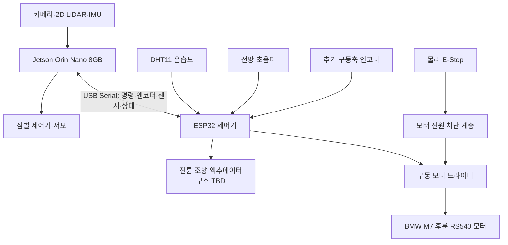

> Sentinel UGV 통합 명세서 v1.1의 일부 — 문서 규칙·버전·변경 이력은 [README](README.md) 참조

# 6. 하드웨어 및 기구 설계

> **이 장은 요약이다.** 하드웨어의 규범(상세) 설계는 **21장**(인터페이스·전원·배선), **34장**(ESP32 저수준 주행 제어·안전 통신), **35장**(센서·짐벌·엔코더 캘리브레이션)을 따르고, 미확정 항목은 **부록 H**(단일 TBD 대장), 부품·전력 목록은 **부록 I**(BOM·전력 예산 템플릿)에서 관리한다.

**핵심 결정**

| 결정 | 내용 | 상세 |
|---|---|---|
| 차체 플랫폼 | BMW M7 유아전동차 donor + 후륜 RS540 FD-12V RPM14000 구동 유지, 상부 3D 프린팅 | 6.3, 부록 I |
| 컴퓨팅·제어 분담 | Jetson Orin Nano 8GB 고수준 / ESP32 저수준(모터·엔코더·watchdog), Raspberry Pi 5 차량 미탑재 | 21장, 34장 |
| ESP32 연결 | 유선 USB Serial, ESP-IDF 기반 제어. Wi-Fi/Bluetooth는 안전 제어에 미사용 | 21.3, 34장 |
| 짐벌 | 안 C(카메라+LiDAR 통합 2축 능동 수평 유지) 확정 | 6.4, 35-8 |
| 조향 | 전륜 조향 기구 분해 확인 후 확정 | TBD-HW-008(부록 H) |
| 독립 안전 | 물리 E-Stop이 소프트웨어와 무관하게 모터 전원을 직접 차단 | 21.4, 21.6 |
| 전원 아키텍처 | 도메인 분리 원칙만 확정, 배터리·DC-DC 구성은 TBD | 6.6, TBD-HW-003 |

## 6.1 최신 부품 활용 상태
| **부품**                       | **판정**        | **활용**                                    |
|--------------------------------|-----------------|---------------------------------------------|
| Jetson Orin Nano Developer Kit | 필수            | 차량 메인 컴퓨팅                            |
| ESP32 제어 보드                | 필수            | 모터·조향·엔코더·DHT11·초음파·watchdog. 정확한 모델 TBD |
| YDLIDAR X4 Pro                 | 실기기 확인     | `/dev/ttyUSB0`, 128000bps, ROS 2 `/scan` 약 11.03Hz |
| Logitech BRIO 100              | 실기기 확인     | `/dev/video0`, 1280×720 MJPEG 약 29.93 FPS. ROS 2 연동은 다음 단계 |
| BMW M7 유아전동차 구동 베이스  | 필수            | 기존 후륜 구동부와 바퀴 활용                 |
| RS540 FD-12V RPM14000 DC 모터  | 실기기 확인     | 12V 후륜 구동 모터. 감속비·정지 전류는 추가 측정 |
| 전륜 조향 기구·액추에이터      | 확인 필요       | 기존 링크 재사용 가능 여부와 제어 방식 분해 확인 |
| Motor Driver HAT               | 초기 시험       | 정격 확인 전까지 최종 적용 보류             |
| MG996R 및 소형 서보            | 짐벌 프로토타입 | 통합 센서 헤드 하중 시험                    |
| 서보모터 드라이버              | 사용            | 짐벌 Roll/Pitch PWM 생성                    |
| 온습도 센서                    | MVP 사용        | 환경 텔레메트리                             |
| 초음파 센서                    | MVP 사용        | 전방 최소 1개, ESP32 독립 근거리 안전 정지 보조 |
| 게임패드                       | 필수            | 관제 PC 수동 조종                           |
| Battery Shield V9/리튬 셀      | 시험            | 정격 확인 후 전원 활용 범위 결정            |
| LED/LCD/버튼/브레드보드        | 선택            | 상태 표시와 회로 실험                       |
| Raspberry Pi 5 세트            | 차량 미사용     | 보조 테스트 장비로만 활용 가능              |

## 6.2 추가 필요 부품 [TBD]
| **우선순위** | **부품**                        | **필요 이유**                          | **선정 기준**                               |
|--------------|---------------------------------|----------------------------------------|---------------------------------------------|
| 필수         | 구동축 엔코더                    | 이동 거리·속도 기반 오도메트리         | RS540 구동계 장착 가능성, PPR, 2채널 quadrature |
| 필수         | 고전류 구동 모터 드라이버       | RS540 정·역회전과 충분한 전류 공급     | 12V 정지 전류 이상, 제동, 보호, timeout     |
| 필수         | 조향 액추에이터 및 링크         | 전륜 조향각 제어                       | 기존 기구 호환, 토크, 응답, 백래시, 한계, 전원 |
| 권장         | 조향각 피드백 센서              | 명령각과 실제 조향각 차이 보정          | 포텐셔미터/엔코더, 장착성, 반복 정밀도      |
| 필수         | 차체 IMU                        | 엔코더·조향 오차 보정과 자세 추정       | ROS2 드라이버, 자이로 안정성, I2C/USB       |
| 필수         | 물리 E-Stop                     | 소프트웨어와 무관한 모터 전원 차단     | 래칭 스위치, 모터 전원 경로 차단            |
| 필수         | DC-DC 및 퓨즈·스위치            | Jetson/모터/서보 전원 분리             | 입출력 전압, 최대 전류, 노이즈              |
| 권장         | NVMe SSD 256GB 이상             | Docker, 모델, 이벤트 파일, rosbag 저장 | Jetson 호환 M.2 규격                        |
| 권장         | 전압·전류 센서                  | 배터리 잔량·소비량 추정                | I2C, 측정 범위, 절연/분압                   |
| 짐벌 시      | 짐벌 IMU·고토크 서보 추가       | 수평 유지와 실제 각도 피드백           | 총 하중, 토크 여유, 백래시                  |

## 6.3 BMW M7 4륜 구조·후륜 구동 [부분 확정]

BMW M7 유아전동차를 donor platform으로 사용하고, 확인된 후륜 RS540 FD-12V RPM14000 DC 모터를 유지하며, 상부 차체와 센서 장착 구조는 3D 프린팅으로 제작한다. 전륜 조향이 bicycle/Ackermann 모델로 제어 가능한지는 조향 링크와 기존 액추에이터를 분해한 뒤 확정하므로, 현재 단계에서 `구동 모터 1개 + 조향 액추에이터 1개`를 확정 사양으로 단정하지 않는다. 전륜 조향으로 확정되면 Nav2는 최소 회전반경을 지키는 Smac Hybrid-A*·Regulated Pure Pursuit를 우선 검증한다(24장). 실측이 필요한 값(감속비·바퀴 지름·정지 전류·조향각·휠베이스·윤거·최소 회전반경 등)은 TBD-HW-001/008(부록 H)로 관리한다.

## 6.4 짐벌 구성 [확정 - 안 C 채택]

**안 C — 카메라+LiDAR 통합 2축 능동 수평 유지**를 확정 구조로 한다. fallback 체계는 1차가 CENTER_LOCK 고정(안 B: 통합 헤드를 주행 중 고정), 2차가 안 A(카메라만 2축 짐벌, LiDAR 차체 고정)이다.

> **짐벌 운영 원칙** NAV_LOCK에서는 Yaw를 고정하고 Roll/Pitch를 제한된 속도와 각도로 보정한다. OBSERVE에서는 로봇 정차 후 센서 헤드를 움직일 수 있다. 능동 수평 유지가 SLAM을 불안정하게 만들면 즉시 CENTER_LOCK(중앙 고정, 안 B 동작)으로 전환한다. 모드 상세는 35-8장을 따른다.
>
> **안 C 확정의 전제 조건** LiDAR가 짐벌 위에 있으므로 짐벌-LiDAR 동적 TF 정확도가 SLAM 품질의 전제가 된다. 이에 따라 NAV_LOCK·CENTER_LOCK·fallback(FR-024)은 선택이 아닌 **필수** 요구사항이며, 35-8장 짐벌 영점·동적 TF 검증이 SLAM 튜닝(35-9장)보다 먼저 합격해야 한다.

## 6.5 센서 배치 원칙

- LiDAR 스캔면은 가림이 없도록 최대한 높게 두고, 통합 짐벌에서는 LiDAR 중심을 회전축에 가깝게 배치해 위치 이동 오차를 줄인다.
- 카메라-LiDAR 외부 파라미터는 실측해 TF에 반영하고(35장), 차체 IMU는 진동이 적은 무게중심 부근에 단단히 고정한다.
- 온습도 센서는 모터·Jetson 배기 열을 피한 외부 공기 유입 위치에 두고, 배선은 회전축 여유 길이·스트레인 릴리프·커넥터 고정을 확보한다.
- 전방 초음파는 차체 중앙을 기본으로 하되 범퍼·바퀴가 음장을 가리지 않게 설치한다. 코너 사각이 크면 좌·우 센서를 추가하고 센서 간 간섭을 막기 위해 순차 trigger한다.

## 6.6 전원 아키텍처 [TBD]

전원 도메인 구성과 전력 예산의 상세는 21.4·21.5장을 따른다. 이 절의 확정 원칙은 다음과 같다.

- 모터 전원은 `배터리 → 퓨즈 → 물리 E-Stop → 모터 드라이버` 경로로 독립 차단하고, Jetson·서보 레일과 분리한다.
- LiDAR·카메라 등 센서는 Jetson USB 또는 안정화된 5V 레일로 급전한다. 신호 기준 GND는 공통으로 연결하되 모터 전력 노이즈가 Jetson 전원에 유입되지 않도록 분리한다.
- 조향과 짐벌 서보를 하나의 DC-DC로 통합할지, 별도 레일로 분리할지는 조향 액추에이터 실측(정지 전류·순간 피크) 후 결정한다. → TBD-HW-003 (부록 H)
- 모터와 서보를 Jetson 5V 핀에서 직접 구동하지 않고, 배터리 전압은 Jetson GPIO에 직접 연결하지 않으며 분압과 ADC 또는 전용 센서를 사용한다. 모터 테스트 전 차량을 바닥에서 띄우고 물리 E-Stop 동작을 먼저 확인한다.

## 6.7 하드웨어 TBD 목록

모든 TBD는 **부록 H의 단일 TBD 대장**에서 관리한다. 본문에는 TBD 대장을 중복 기재하지 않는다. 하드웨어 관련 항목은 TBD-HW-001~010, TBD-CAM-001이며 담당자·확정 조건·기한은 부록 H를 참조한다.

인터페이스 할당·전원 도메인·조립 인수 기준은 21장, ESP32 제어·안전 통신은 34장, 짐벌 영점·동적 TF·캘리브레이션 합격 기준은 35장, 배선도·핀맵은 부록 J를 참조한다.

# 21. 하드웨어 인터페이스·전원·배선 상세 설계

## 21.1 목적과 적용 범위

이 장은 6장의 구성 원칙을 실제 조립 가능한 인터페이스 수준으로 구체화한다. 최종 하드웨어는 **Jetson Orin Nano 8GB가 고수준 컴퓨팅**, **ESP32가 저수준 모터·엔코더·watchdog 제어**를 담당하며 Raspberry Pi 5는 차량에 탑재하지 않는다.

## 21.2 최종 하드웨어 블록



| 계층 | 장치 | 책임 | 고장 시 기본 동작 |
|---|---|---|---|
| 고수준 | Jetson Orin Nano | ROS 2, SLAM, Nav2, YOLO, Mission Manager, 영상, 서버 통신 | ESP32 명령 중단, 주행 자동 재개 금지 |
| 저수준 | ESP32 | 구동 엔코더 계수, 100Hz 속도 제어, 조향 액추에이터 제어, DHT11·초음파 수집, 통신 watchdog | 구동 PWM 0, driver disable 또는 제동 |
| 구동 | 모터 드라이버 | 모터 전력 스위칭 | enable LOW 시 출력 차단 |
| 독립 안전 | 물리 E-Stop | 모터 구동 전원 직접 차단 | 소프트웨어 상태와 무관하게 정지 |
| 보조 구동 | 짐벌 서보 | 센서 헤드 자세 안정화 | 중앙 또는 기계적 안전각 유지 |

## 21.3 인터페이스 할당

| 연결 | 권장 인터페이스 | 데이터 | 주의사항 |
|---|---|---|---|
| Jetson ↔ ESP32 | USB Serial 우선(native USB CDC 또는 보드 내 USB-UART) | 구동 속도·조향각 목표, 엔코더, 센서, fault, E-Stop | udev 별칭 `/dev/sentinel_mcu`, 케이블 고정 |
| Jetson ↔ LiDAR | USB Serial | `/scan` 약 11.03Hz 확인 | 실측 `/dev/ttyUSB0`, udev 별칭 사용, 모터 전원선과 분리 |
| Jetson ↔ 카메라 | USB 3.x | 720p MJPEG 약 29.93 FPS 확인 | 실측 `/dev/video0`, 단일 프로세스만 장치 open |
| Jetson ↔ IMU | USB 또는 I2C | 각속도·가속도 | 3.3V 논리 확인, 축 방향 기록 |
| ESP32 ↔ DHT11 | 3.3V GPIO 단선 통신 | 온도·습도 | 0.5~1Hz, checksum 검증, 모터 제어 태스크와 분리 |
| ESP32 ↔ 전방 초음파 | GPIO trigger + timer input capture | 근거리 장애물 거리 | 5V ECHO는 분압/레벨 변환, 여러 센서는 순차 trigger |
| Jetson ↔ 짐벌 | PWM 제어기 또는 MCU | 목표 pitch/roll | 모터 노이즈와 전원 분리 권장 |
| ESP32 ↔ 구동 엔코더 | Timer Encoder/Interrupt | 구동축 tick | 5V 출력이면 레벨 변환 필요 |
| ESP32 ↔ 드라이버 | PWM, DIR, ENABLE | 구동 신호 | 외부 pull-down으로 부팅 시 OFF |
| ESP32 ↔ 조향 액추에이터 | PWM/DIR/릴레이 등 TBD, 선택적 angle feedback | 목표 조향각 또는 조향 상태 | 실물 분해 후 전압·전류·제어 방식 확정 |

핀 번호는 보드와 부품 모델이 확정되기 전에는 단정하지 않는다. 부록 J의 핀맵은 데이터시트와 실제 도통 시험을 통과한 값만 기록한다.

## 21.4 전원 도메인

```text
배터리
├─ 퓨즈·메인 스위치
│  ├─ E-Stop·모터 전원 차단 → 모터 드라이버 → 구동 모터
│  ├─ DC-DC A → Jetson 전원
│  ├─ DC-DC B → ESP32·보조 센서 (LiDAR·카메라는 Jetson USB 급전이 기본, 6.6 참조)
│  └─ DC-DC C → 조향·짐벌 서보
│      ※ 조향/짐벌 서보 레일의 통합·분리는 조향 액추에이터 실측 후 결정 → TBD-HW-003 (부록 H)
└─ 전압·전류 센서 → ESP32 또는 Jetson → 관제
```

- 모터와 서보를 Jetson 또는 ESP32의 GPIO 전원으로 직접 구동하지 않는다.
- ESP32 GPIO는 3.3V 전용으로 취급한다. 5V 엔코더·초음파 ECHO 신호는 직접 입력하지 않고 레벨 변환한다.
- 모터·서보 전원과 컴퓨팅 전원은 분리하되 신호 기준 GND는 설계에 맞게 공통화한다.
- 배터리, DC-DC, 퓨즈, 배선 굵기는 평균 전류가 아니라 **모터 정지 전류와 동시 기동 피크**를 기준으로 선정한다.
- E-Stop은 Jetson 전원을 끄는 버튼이 아니라 모터 구동 에너지를 빠르게 제거하는 회로로 설계한다.
- 첫 구동 시험은 구동 바퀴를 바닥에서 띄운 상태에서 수행한다.

## 21.5 전력 예산 산정

| 항목 | 입력 전압 | 평균 전력 | 피크 전력 | 측정 방법 | 상태 |
|---|---:|---:|---:|---|---|
| Jetson Orin Nano | TBD | TBD | TBD | 전력 모드별 실측 | TBD |
| 구동 모터 | 12V | TBD | RS540 정지 전류 기준 | 전류계·데이터시트 | 모델 확인·전류 TBD |
| 조향 액추에이터 | TBD | TBD | stall 전류 기준 | 전류계·데이터시트 | TBD |
| LiDAR·카메라·IMU | 5V 계열 | TBD | TBD | USB 전력 측정 | TBD |
| 짐벌 서보 | TBD | TBD | 동시 stall 고려 | 전류계 | TBD |
| ESP32·보조 센서 | 3.3/5V | TBD | TBD | 벤치 전원 | TBD |

예상 운용시간은 `배터리 유효 Wh ÷ 시스템 평균 W`로 계산하되, 배터리 정격 용량 전부를 사용하지 않고 저전압 차단과 DC-DC 효율을 반영한다.

## 21.6 조립 인수 기준

- 전원 인가 직후 모터 PWM은 0이고 driver enable은 비활성이다.
- 물리 E-Stop을 누르면 Jetson·ESP32 상태와 무관하게 모터 출력이 차단된다.
- 모든 USB·전원 케이블에는 장력 완화 처리와 커넥터 라벨이 있다.
- 모터 최대 부하에서 Jetson 재부팅이나 USB 장치 재연결이 발생하지 않는다.
- 퓨즈·DC-DC·모터 드라이버 온도가 허용 범위를 넘지 않는다.

# 부록 I. 최종 BOM·전력 예산 템플릿

| 분류 | 부품·모델 | 수량 | 정격·인터페이스 | 공급처 | 확정 상태 |
|---|---|---:|---|---|---|
| 컴퓨팅 | Jetson Orin Nano 8GB | 1 | JetPack 6.2.1+b38 | 제공 | 확정 |
| 제어 | ESP32 보드 | 1 | ESP-IDF, USB Serial, PCNT/PWM/watchdog, 정확한 모델 TBD | 제공/구매 | TBD-HW-009 |
| 차체 | BMW M7 유아전동차 구동 베이스 | 1 | 4륜 구조·후륜 구동, 상부 3D 프린팅 | 보유 | 확정 |
| 센서 | YDLIDAR X4 Pro | 1 | USB Serial, 128000bps, 약 11.03Hz | 제공 | 동작 확인 |
| 센서 | Logitech BRIO 100 | 1 | USB, 720p MJPEG 약 29.93 FPS | 제공 | 캡처 확인 |
| 센서 | DHT11 온습도 | 1 | ESP32 3.3V GPIO, 0.5~1Hz | 보유/TBD | MVP 사용 |
| 센서 | 전방 초음파 | 1 이상 | ESP32 GPIO·input capture, 모델·배치 TBD | 보유/구매 | TBD-HW-010 |
| 구동 | RS540 FD-12V RPM14000 DC 모터 | 1 | 12V 후륜 구동, 감속비·stall current TBD | BMW M7 기존 | 모델 확인 |
| 구동 | 구동축 엔코더 | 1식 | 2채널 quadrature 권장, PPR TBD | 구매/제작 | 확인 필요 |
| 구동 | 고전류 모터 드라이버 | 1 | 12V, 연속·피크·stall current 기준 | 구매/TBD | 확인 필요 |
| 조향 | 전륜 조향 액추에이터·링크 | 1식 | 종류·전압·제어 신호·각도 TBD | BMW M7 기존/추가 | 분해 확인 필요 |
| 조향 | 조향각 센서 | 1 | 포텐셔미터/엔코더 | TBD | 권장 |
| 전원 | 배터리·퓨즈·DC-DC | 각 1 | 전압·용량·효율 | TBD | 미확정 |
| 안전 | 물리 E-Stop | 1 | 모터 전원 차단 정격 | TBD | 미확정 |
| 음성 | 마이크: BRIO 100 내장 | - | 카메라 내장, 짐벌 탑재 | 제공 | 잠정 확정 (품질 검증 TBD-AUD-001) |
| 음성 | 블루투스 스피커 | 1 | Bluetooth A2DP 출력 전용, 모델 TBD | 구매 | 방식 확정·모델 미정 |

최종 BOM에는 단가뿐 아니라 데이터시트 링크, 무게, 공급 리드타임, 대체품, 실제 측정 전류를 기록한다.

# 부록 J. 배선도·핀맵 확정표

| From | To | 신호/전원 | 커넥터·핀 | 전압 | 검증자·일자 |
|---|---|---|---|---:|---|
| Jetson | ESP32 | USB Serial | `/dev/sentinel_mcu` | USB | TBD-HW-009 |
| ESP32 | 구동축 엔코더 | A/B | TBD | TBD | TBD |
| ESP32 | 모터 드라이버 | PWM/DIR/ENABLE | TBD | 3.3V 논리 확인 | TBD |
| ESP32 | 조향 액추에이터 | PWM/DIR/릴레이 등 TBD | TBD | 실물 전압·전류·신호 확인 | TBD |
| 조향각 센서 | ESP32 | ADC/Encoder | TBD | TBD | TBD |
| DHT11 | ESP32 | DATA + pull-up | TBD | 3.3V | TBD-HW-009 |
| 전방 초음파 | ESP32 | TRIG/ECHO + input capture | TBD | 3.3V, 5V ECHO면 레벨 변환 | TBD-HW-010 |
| E-Stop | 모터 전원 계층 | 전력 차단 | TBD | 배터리 전압 | TBD |
| DC-DC | Jetson | 전원 | 공식 전원 입력 | TBD | TBD |
| DC-DC | 서보 | 전원 | 별도 분기 | TBD | TBD |

배선도는 실제 핀을 확인하기 전까지 추정값을 넣지 않으며, 최종본에는 퓨즈·공통 GND·커넥터 방향·케이블 라벨까지 표시한다.
