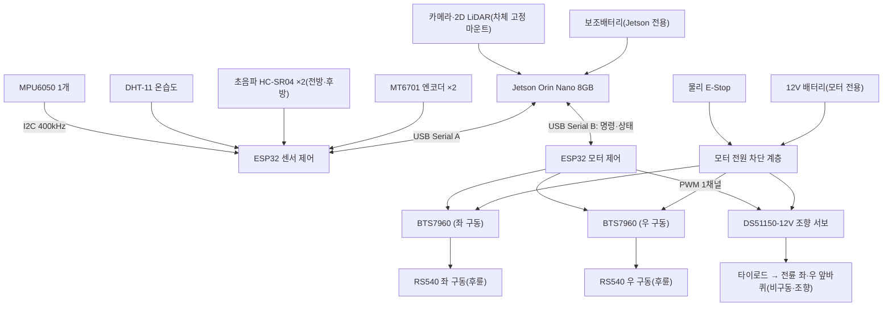

> Sentinel UGV 통합 명세서 v2.0의 일부 — 문서 규칙·버전·변경 이력은 [README](README.md) 참조

# 6. 하드웨어 및 기구 설계

> **이 장은 요약이다.** 하드웨어의 규범(상세) 설계는 **21장**(인터페이스·전원·배선), **34장**(ESP32 저수준 주행 제어·안전 통신), **35장**(센서·엔코더 캘리브레이션)을 따르고, 미확정 항목은 **부록 H**(단일 TBD 대장), 부품·전력 목록은 **부록 I**(BOM·전력 예산 템플릿)에서 관리한다.

**핵심 결정**

| 결정 | 내용 | 상세 |
|---|---|---|
| 차체 플랫폼 | BMW M7 유아전동차 donor + 후륜 좌·우 개별 구동(RS540 FD-12V RPM14000 ×2), 전륜은 기존 조향 앞바퀴 2개를 복구해 DS51150-12V 서보모터로 조향, 상부 3D 프린팅 | 6.3, 부록 I |
| 컴퓨팅·제어 분담 | Jetson Orin Nano 8GB 고수준 / ESP32 WROOM-32 2개 저수준(모터 제어용·센서 제어용 분리), Raspberry Pi 5 차량 미탑재 | 21장, 34장 |
| ESP32 연결 | ESP32마다 독립된 유선 USB Serial, ESP-IDF 기반 제어. Wi-Fi/Bluetooth는 안전 제어에 미사용 | 21.3, 34장 |
| 짐벌 | **미사용 확정** — 카메라·LiDAR는 차체 고정 마운트, 정적(static) TF만 사용 | 6.4 |
| 주행·조향 | **전진·후진은 후륜 DC 모터 2개, 조향은 전륜 서보모터 1개로 분담 확정**(2026-08-06). 서보가 타이로드에 직결되어 좌·우 앞바퀴를 동시에 조향하며, 서보 제어는 모터 ESP32가 담당한다. 조향 기하가 생겼으므로 **제자리 회전은 불가능**하고 최소 회전반경 제약이 부활한다 | 6.3, 34-2 |
| 독립 안전 | 물리 E-Stop이 소프트웨어와 무관하게 BTS7960 2개의 모터 전원과 **조향 서보 전원**을 함께 직접 차단 | 21.4, 21.6 |
| 전원 아키텍처 | 모터 전원(유아전동차 내장 12V 배터리)과 Jetson 전원(대용량 보조배터리) 완전 분리 확정. 조향 서보는 모터 계통의 E-Stop 하류에서 급전, DC-DC 세부는 TBD | 6.6, TBD-HW-003 |

> **하드웨어 반영 상태(2026-08-09)** 후방 HC-SR04는 센서 ESP32의 `TRIG=GPIO5`, `ECHO=GPIO36`에 연결됐고 전방 센서와 순차 측정한다. `PROXIMITY_STATE.rear_min_distance_mm`과 `/range/rear`까지 구현됐으며 URDF 위치도 실측 반영됐다. 후방은 정지 판정에 포함하지 않고, 전방도 빈 공간 오측 때문에 `PROXIMITY_STOP_ENABLED=false`로 발동을 꺼 현재 두 방향 모두 관측 전용이다.
>
> **하드웨어 변경 이력(2026-08-06)** 프레임 앞부분의 수동 캐스터 바퀴 2개를 제거하고, **유아전동차 기존 조향 앞바퀴 2개를 복구**했다. 앞바퀴 타이로드에 **DS51150-12V 서보모터**를 직결해 좌우로 회전시켜 조향하며, 서보 제어는 모터 제어용 ESP32가 담당한다. 전진·후진은 후륜 좌·우 RS540 DC 모터 2개(BTS7960 2개)를 그대로 사용한다. 즉 **구동과 조향이 다시 분리**되어 운동학이 차동 구동에서 **전륜 조향(자전거·Ackermann 근사)** 으로 돌아간다. 이에 따라 최소 회전반경 제약과 조향각 파라미터가 부활하고, **`v≈0`에서 각속도만 주는 제자리 회전은 더 이상 실행할 수 없다.** MT6701 엔코더는 후륜 2개를 유지하며(서보는 내부 폐루프이므로 외부 각도 피드백을 두지 않는다), 폐기했던 TBD-HW-008을 「전륜 서보 조향 기하」로 부활시켰다.
>
> **직전 이력(2026-08-01)** 조향 모터(WW MOTOR RS380SP-12V)와 조향 앞바퀴를 제거하고 수동 캐스터 2개를 부착해 후륜 차동 구동으로 전환했다. 위 2026-08-06 변경이 이 결정을 되돌린 것이며, 차동 구동을 전제로 한 서술(제자리 회전, 캐스터 슬립, 트랙폭 기반 회두)은 모두 폐기했다.

## 6.1 최신 부품 활용 상태
| **부품**                       | **판정**        | **활용**                                    |
|--------------------------------|-----------------|---------------------------------------------|
| Jetson Orin Nano Developer Kit | 확정            | 차량 메인 컴퓨팅                            |
| ESP32 WROOM-32 (모터 제어용)   | 확정            | BTS7960 2개와 연결해 후륜 좌/우 구동 모터 제어 + 조향 서보 PWM 1채널 출력 |
| ESP32 WROOM-32 (센서 제어용)   | 구현            | MT6701 ×2·MPU6050·DHT-11·HC-SR04 ×2 연결·수집 |
| YDLIDAR X4 Pro                 | 실기기 확인     | `/dev/ttyUSB0`, 128000bps, ROS 2 `/scan` 약 11.03Hz, 차체 고정 마운트 |
| Logitech BRIO 100              | 실기기 확인     | `/dev/video0`, 1280×720 MJPEG 약 29.93 FPS, 차체 고정 마운트 |
| BMW M7 유아전동차 구동 베이스  | 확정            | 기존 후륜 구동부와 바퀴 + **기존 전륜 조향부(앞바퀴·타이로드) 복구 활용**, 짐벌 없이 차체 고정 센서 마운트 |
| RS540 FD-12V RPM14000 DC 모터 ×2 | 확정          | 후륜 좌·우 개별 구동으로 **전진·후진 전담**(조향은 서보가 담당). 감속비·정지 전류는 추가 측정 |
| DS51150-12V 서보모터 ×1        | 확정            | 전륜 타이로드 직결 조향 액추에이터. 모터 ESP32의 PWM 1채널으로 제어, 12V 모터 계통 E-Stop 하류 급전. 신호 규격·엔드포인트·stall 전류는 TBD-HW-008 |
| ~~수동 캐스터 바퀴 ×2~~        | **폐기**        | **2026-08-06 제거 — 전륜 조향 복구.** 기존 조향 앞바퀴 2개로 대체했다 |
| BTS7960 모터 드라이버 ×2       | 확정            | 후륜 구동 좌·우 각 1개                      |
| MT6701 자기식 엔코더 ×2        | 확정            | 후륜 구동 좌·우 각도/속도 피드백 각 1개     |
| HC-SR04 초음파 센서 ×2         | 구현·장착 확인  | 전방 `GPIO18/39`, 후방 `GPIO5/36`, 약 15Hz 순차 측정. `/range/front`·`/range/rear` 관측은 구현됐고 보호 정지는 전방 오측으로 발동 비활성 |
| DHT-11 온습도 센서             | 확정            | 환경 텔레메트리                             |
| 12V 배터리 (유아전동차 내장)   | 확정            | 모터 전원 전용                              |
| 대용량 보조배터리              | 확정            | Jetson 전원 전용                            |
| 게임패드                       | 필수            | 관제 PC 수동 조종                           |
| LED/LCD/버튼/브레드보드        | 선택            | 상태 표시와 회로 실험                       |
| Raspberry Pi 5 세트            | 차량 미사용     | 보조 테스트 장비로만 활용 가능              |

## 6.2 추가 필요 부품 [TBD]
모델·수량이 확정된 엔코더·모터 드라이버·조향 서보·짐벌 관련 항목은 6.1로 이관했다. 남은 미확정 항목은 다음과 같다.

| **우선순위** | **부품**                        | **필요 이유**                          | **선정 기준**                               |
|--------------|---------------------------------|----------------------------------------|---------------------------------------------|
| 필수         | MPU6050 차체 IMU                | 엔코더 오차 보정과 자세 추정            | ESP32 I2C 드라이버, bias·진동 재계측         |
| 필수         | 물리 E-Stop                     | 소프트웨어와 무관한 모터·조향 전원 차단 | 래칭 스위치, BTS7960 2개 + 조향 서보 공통 전원 경로 차단 |
| 필수         | DC-DC 및 퓨즈·스위치            | ESP32 2개·저전압 센서 레일 전원 분리   | 입출력 전압, 최대 전류, 노이즈              |
| 필수         | 조향 링키지 체결 부품           | 서보 혼과 기존 타이로드의 직결 고정     | 유격(backlash) 최소화, 서보 토크 전달, 풀림 방지 |
| 권장         | NVMe SSD 256GB 이상             | Docker, 모델, 이벤트 파일, rosbag 저장 | Jetson 호환 M.2 규격                        |
| ~~권장~~ **미장착** | 전압·전류 센서       | ~~배터리 잔량·소비량 추정~~            | **v2.0: 장착하지 않았다.** 이에 따라 배터리 기반 안전·종료 기능을 폐기했다(04장 14.6) |

## 6.3 BMW M7 후륜 구동·전륜 서보 조향 [확정]

BMW M7 유아전동차를 donor platform으로 사용하며, **기존 전륜 조향부(앞바퀴 2개와 타이로드)를 복구해 그대로 활용한다.** 후륜은 좌·우 바퀴를 RS540 FD-12V RPM14000 모터로 각각 독립 구동해(BTS7960 2개) **전진·후진만** 담당한다. 조향은 타이로드에 직결한 **DS51150-12V 서보모터 1개**가 좌우로 회전하며 좌·우 앞바퀴를 동시에 꺾는 방식으로 수행하고, 서보 제어는 **모터 제어용 ESP32**가 담당한다(34-2). 앞바퀴는 비구동이며 상부 차체와 센서 장착 구조는 3D 프린팅으로 제작한다.

즉 구동과 조향이 서로 다른 액추에이터로 분리되어, 운동학은 **전륜 조향(자전거 모델·Ackermann 근사)** 이다.

```text
δ_target = atan(L × ω / v)                 # L=휠베이스, v≠0
δ_target = clamp(δ_target, -δ_max, +δ_max)
R_min    = L / tan(δ_max)                  # 최소 회전반경
|ω| ≤ |v| / R_min                          # 각속도 상한이 선속도에 종속된다
```

**`v≈0`이고 `ω≠0`인 명령은 실행할 수 없다.** 조향각을 최대로 꺾어도 차체가 전진하지 않으면 회두가 생기지 않기 때문이며, 차동 구동에서 가능했던 제자리 회전은 폐기한다. 이 제약은 하드웨어 특성이므로 상위 계층(Nav2 rotation shim·정체 복구 spin·게임패드 좌우 스틱)이 모두 영향을 받는다 — 처리 규칙은 34-2, Nav2 구성 영향은 24.1이다.

후륜 차축에는 기계식 차동장치가 없다. 선회 시 내·외측 후륜의 회전 반경이 달라지므로 원칙적으로는 좌·우 속도를 나눠 주어야 하지만, **초기 구성에서는 좌·우에 동일한 목표 속도를 주고** 조향 중 타이어 스크럽·편향을 실측한 뒤 필요하면 전자 차동(electronic differential) 보정을 추가한다(TBD-CAL-002). 조향 링크가 있는 상태에서 좌·우 속도 차로 회두를 보조하지는 않는다 — 서보가 정한 조향각과 다투면 타이어·링키지에 무리가 간다.

서보는 내부 폐루프로 목표 각도를 유지하고 외부로 각도를 출력하지 않으므로, **조향각 피드백은 두지 않고 조향은 개루프로 운용한다.** MT6701 엔코더는 후륜 좌·우 2개를 유지한다. 조향 실패는 전기적으로 감지할 수 없어 IMU yaw rate와 기대 yaw rate의 불일치로 간접 판정한다(34-9).

Nav2는 **최소 회전반경 제약이 있는 로봇**으로 설정했다. rotation shim과 spin 복구를 제거했고, 현재 NavFn + RPP를 사용한다. 휠베이스 `L=0.683m`, 최대 바퀴 조향각 `δ_max=22°`, 계산상 `R_min≈1.69m`, 바퀴 지름 `0.250m`를 반영했다. 남은 항목은 원주행 `R_min`, 감속비·정지 전류, 조향 링키지 유격과 서보-바퀴 비 확인이다.

## 6.4 짐벌 미사용 [확정]

짐벌은 프로젝트 범위에서 완전히 제외한다. 카메라(BRIO 100)와 LiDAR(YDLIDAR X4 Pro)는 차체에 고정 마운트하며, 관련 좌표계는 정적(static) TF로만 관리한다(8.3·22.3·35-2). 능동 자세 제어가 없으므로 기존 NAV_LOCK/CENTER_LOCK/OBSERVE 모드, 짐벌 영점·동적 TF 캘리브레이션(구 35-8장), FR-024 요구사항은 모두 폐기한다.

고정 마운트에서는 주행 진동과 설치 각도가 곧바로 LiDAR scan·카메라 왜곡으로 이어지므로, 마운트 강성·높이·수평 확보가 6.5 센서 배치 원칙과 35-7 외부 파라미터 검증의 핵심이 된다.

## 6.5 센서 배치 원칙

- LiDAR 스캔면은 차체·범퍼에 가리지 않도록 최대한 높고 수평으로 고정하며, 회전축이 없으므로 장착 직후 수평도를 직접 실측한다.
- 카메라-LiDAR 외부 파라미터는 고정 마운트 상태로 실측해 TF에 반영하고(35장), 차체 IMU 1개는 진동이 적은 무게중심 부근에 단단히 고정한다. 짐벌용 head IMU는 사용하지 않는다.
- 온습도 센서는 모터·Jetson 배기 열을 피한 외부 공기 유입 위치에 두고, 배선은 스트레인 릴리프·커넥터 고정을 확보한다.
- 전방 초음파는 차체 중앙을 기본으로 하되 범퍼·앞바퀴·조향 링키지가 음장을 가리지 않게 설치한다. **앞바퀴가 최대로 꺾인 상태에서도 음장에 들어오지 않는지 확인한다.** 현재 보호 정지는 꺼져 있지만 거리 오측 원인을 제거하고 다시 활성화하려면 음장 간섭부터 통과해야 한다. 코너 사각이 크면 좌·우 센서를 추가하고 센서 간 간섭을 막기 위해 순차 trigger한다.
- 후방 HC-SR04는 차체 중앙 후방에 장착했고 URDF 기준 위치 `(−0.130, 0, 0.215)`, yaw `π`를 반영했다. 센서 ESP32가 전방 측정을 마친 뒤 후방을 순차 trigger하며 `/range/rear`를 발행한다. 유효 거리·후진 정지 임계는 전방과 독립적으로 실측해야 하며, 현재는 보호 정지에 사용하지 않는다.

## 6.6 전원 아키텍처 [부분 확정]

모터 전원과 컴퓨팅 전원을 완전히 분리하는 2계통 구조로 확정한다. 전원 도메인 구성과 전력 예산의 상세는 21.4·21.5장을 따른다.

- **모터 전원**: 유아전동차에 내장되어 있던 12V 배터리 1개가 `배터리 → 퓨즈 → 물리 E-Stop → BTS7960 드라이버 2개(구동 좌·우) + 조향 서보 1개` 경로로 급전한다. **조향 서보를 E-Stop 하류에 두는 이유**는 차단점을 하나로 유지해 배선·검증이 단순해지기 때문이다. 그 대가로 E-Stop 시 서보가 무여자되어 조향이 자유로워지므로, 정지 직전의 조향각이 유지된다는 보장이 없다(구동 전원도 동시에 끊기므로 남는 것은 관성 주행뿐이다 — 21.6).
- **Jetson 전원**: 별도의 대용량 보조배터리가 Jetson Orin Nano만 전담 급전한다. LiDAR·카메라는 Jetson USB 급전을 기본으로 한다.
- 두 배터리 계통은 전력을 공유하지 않으며, 모터 전력 노이즈가 Jetson 전원에 유입되지 않도록 분리한다. 신호 기준 GND는 설계에 맞게 공통화한다.
- ESP32 2개(모터 제어용·센서 제어용)와 MT6701 2개·차체 IMU·DHT11·HC-SR04 등 저전압 센서는 별도 DC-DC 레일로 급전하며, 어느 배터리 계통에서 분기할지와 정확한 DC-DC 사양은 TBD-HW-003(부록 H)이다. **조향 서보는 이 저전압 레일에 올리지 않는다** — 12V 직접 구동이며 stall 전류가 커서 ESP32·센서와 레일을 공유하면 조향 순간에 논리 전원이 흔들린다.
- 모터를 Jetson·ESP32 GPIO에서 직접 구동하지 않고, 배터리 전압은 분압과 ADC 또는 전용 센서로 측정한다. 모터 테스트 전 차량을 바닥에서 띄우고 물리 E-Stop 동작을 먼저 확인한다.

## 6.7 하드웨어 TBD 목록

모든 TBD는 **부록 H의 단일 TBD 대장**에서 관리한다. 본문에는 TBD 대장을 중복 기재하지 않는다. 짐벌 제외로 구 TBD-HW-005를 폐기했고, **2026-08-06 전륜 서보 조향 전환으로 TBD-HW-008을 「전륜 서보 조향 기하」로 부활**시켰다(2026-08-01 차동 구동 전환 때 폐기했던 항목이다). 하드웨어 관련 항목은 TBD-HW-001~004·006~012, TBD-CAM-001이며 담당자·확정 조건·기한은 부록 H를 참조한다.

인터페이스 할당·전원 도메인·조립 인수 기준은 21장, ESP32 제어·안전 통신은 34장, 엔코더·캘리브레이션 합격 기준은 35장, 배선도·핀맵은 부록 J를 참조한다.

# 21. 하드웨어 인터페이스·전원·배선 상세 설계

## 21.1 목적과 적용 범위

이 장은 6장의 구성 원칙을 실제 조립 가능한 인터페이스 수준으로 구체화한다. 최종 하드웨어는 **Jetson Orin Nano 8GB가 고수준 컴퓨팅**, **ESP32 2개(모터 제어용·센서 제어용)가 저수준 모터·엔코더·watchdog 제어**를 담당하며 Raspberry Pi 5는 차량에 탑재하지 않는다.

## 21.2 최종 하드웨어 블록



| 계층 | 장치 | 책임 | 고장 시 기본 동작 |
|---|---|---|---|
| 고수준 | Jetson Orin Nano | ROS 2, SLAM, Nav2, YOLO, Mission Manager, 영상, 서버 통신 | 두 ESP32 명령 중단, 주행 자동 재개 금지 |
| 저수준(모터) | ESP32 모터 제어 | BTS7960 2개 PWM/DIR 제어(전진·후진), **조향 서보 PWM 생성·슬루레이트 제한**, 통신 watchdog | 구동 PWM 0, driver disable 또는 제동. **조향각은 마지막 값 유지**(34-7) |
| 저수준(센서) | ESP32 센서 제어 | MT6701 2개 엔코더·차체 IMU·DHT-11·HC-SR04 ×2(전방·후방) 수집, 측정 시각·sequence를 붙여 Jetson 전달 | 통신 watchdog으로 상태만 STALE 처리(직접 구동하는 액추에이터 없음) |
| 구동 | BTS7960 ×2 | 모터 전력 스위칭 | enable LOW 시 출력 차단 |
| 조향 | DS51150-12V 서보 ×1 | 전륜 타이로드 구동, 내부 폐루프로 목표 각도 유지 | 전원 차단 시 무여자(조향 자유), 각도 피드백 없음 |
| 독립 안전 | 물리 E-Stop | 모터 구동 전원 + 조향 서보 전원 직접 차단 | 소프트웨어 상태와 무관하게 정지 |

## 21.3 인터페이스 할당

| 연결 | 권장 인터페이스 | 데이터 | 주의사항 |
|---|---|---|---|
| Jetson ↔ ESP32 모터 제어 | USB Serial(온보드 USB-UART bridge) | 좌/우 목표 구동 속도, **목표 조향각·조향 속도 제한**, fault, E-Stop 상태 | udev 별칭 `/dev/sentinel_mcu_motor`, 케이블 고정 |
| Jetson ↔ ESP32 센서 제어 | USB Serial(온보드 USB-UART bridge) | 엔코더 ×2, IMU 원시값, DHT-11, HC-SR04, fault | udev 별칭 `/dev/sentinel_mcu_sensor`, 케이블 고정 |
| Jetson ↔ LiDAR | USB Serial | `/scan` 약 11.03Hz 확인 | 실측 `/dev/ttyUSB0`, udev 별칭 사용, 모터 전원선과 분리 |
| Jetson ↔ 카메라 | USB 3.x | 720p MJPEG 약 29.93 FPS 확인 | 실측 `/dev/video0`, 단일 프로세스만 장치 open |
| ESP32(센서) ↔ MPU6050(GY-521) | I2C 400kHz (`SDA=GPIO21`, `SCL=GPIO22`, `AD0=GND`, 주소 `0x68`) | 각속도·가속도·센서 상태 | 3.3V, MT6701과 버스 공유, REP-103 축 확인 완료 |
| ESP32(센서) ↔ DHT-11 | 3.3V GPIO 단선 통신 | 온도·습도 | 0.5~1Hz, checksum 검증 |
| ESP32(센서) ↔ HC-SR04 ×2(전방·후방) | GPIO trigger + timer input capture(센서별 독립 TRIG/ECHO 핀 쌍) | 근거리 장애물 거리(전방·후방 각각) | 5V ECHO는 분압/레벨 변환. 두 센서를 동시에 trigger하면 서로의 echo를 오독하므로 순차 측정(TBD-HW-010) |
| ESP32(센서) ↔ MT6701 ×2 | I2C 400kHz, 주소 `0x06`/`0x46` | 구동 좌·우 각도/속도 | 14-bit 절대각, 기어비 82 |
| ESP32(모터) ↔ BTS7960 ×2 | PWM, RPWM/LPWM, ENABLE | 좌·우 구동 신호 | 외부 pull-down으로 부팅 시 OFF |
| ESP32(모터) ↔ DS51150 서보 | PWM 1채널(LEDC) | 목표 조향각 | 3.3V 논리로 구동 가능한지 확인하고 필요하면 레벨 변환. **신호선만 연결하고 서보 전원은 12V 계통에서 받는다**(ESP32 5V 레일에서 급전하지 않는다). GND는 공통, 신호 규격은 표준 RC PWM(약 50Hz·500~2500µs) 가정이며 데이터시트 확인은 TBD-HW-008 |

엔코더(MT6701)와 차체 IMU는 센서 제어용 ESP32에, 모터 드라이버(BTS7960)와 조향 서보는 모터 제어용 ESP32에 분리 연결되며 두 ESP32 사이에는 직접 배선이 없다. 센서 ESP32는 엔코더와 IMU를 같은 monotonic 시계로 측정하고 원시값을 전달하며, Jetson이 wheel odometry와 IMU yaw rate를 EKF로 융합한다. 좌·우 구동 속도 폐루프는 Jetson이 센서 ESP32의 엔코더 데이터와 모터 ESP32의 명령 채널을 결합해 계산하는 것으로 잠정 확정하며, 통신 지연이 문제가 되면 두 ESP32 간 직접 링크(UART) 추가를 대체안으로 검토한다(TBD-HW-011, 34-2). **조향은 이 폐루프에 들어가지 않는다** — 서보가 내부적으로 각도를 유지하고 외부 피드백이 없으므로 두 보드를 오갈 신호가 없다.

핀 번호는 보드와 부품 모델이 확정되기 전에는 단정하지 않는다. 부록 J의 핀맵은 데이터시트와 실제 도통 시험을 통과한 값만 기록한다.

## 21.4 전원 도메인

```text
12V 배터리(모터 전용, 유아전동차 내장)
├─ 퓨즈·메인 스위치
└─ 물리 E-Stop ┬─ BTS7960 ×2(좌 구동·우 구동) → RS540 ×2(후륜)
               └─ DS51150-12V 조향 서보 ×1 → 타이로드 → 전륜

보조배터리(Jetson 전용, 대용량)
└─ Jetson Orin Nano 8GB (LiDAR·카메라는 Jetson USB 급전이 기본)

DC-DC(계통·사양 TBD-HW-003) → ESP32 모터 제어·ESP32 센서 제어·MT6701 ×2·차체 IMU·DHT-11·HC-SR04
전압·전류 센서 → ESP32 또는 Jetson → 관제
```

- 모터 전원(12V 배터리)과 Jetson 전원(보조배터리)은 완전히 분리된 별도 계통이다.
- ESP32 2개와 저전압 센서를 어느 배터리 계통에서 분기할지, 정확한 DC-DC 사양은 TBD-HW-003(부록 H)이다.
- ESP32 GPIO는 3.3V 전용으로 취급한다. 5V 엔코더·초음파 ECHO 신호는 직접 입력하지 않고 레벨 변환한다.
- 배터리, DC-DC, 퓨즈, 배선 굵기는 평균 전류가 아니라 **모터 정지 전류와 동시 기동 피크**를 기준으로 선정한다. **조향 서보의 stall 전류를 이 피크에 더한다** — 급조향과 급가속이 겹치는 순간이 최악 조건이고, 서보가 링키지 끝에 눌려 있으면 그 전류가 계속 흐른다.
- E-Stop은 Jetson 전원을 끄는 버튼이 아니라 BTS7960 2개와 조향 서보로 가는 12V 에너지를 빠르게 제거하는 회로로 설계한다.
- 첫 구동 시험은 구동 바퀴를 바닥에서 띄운 상태에서 수행한다. **조향 시험은 앞바퀴도 띄운 상태에서 먼저 하고**, 서보가 링키지의 기계적 한계를 넘겨 밀지 않는지(엔드포인트 클램프) 확인한 뒤에 바닥에 내린다.

## 21.5 전력 예산 산정

| 항목 | 입력 전압 | 평균 전력 | 피크 전력 | 측정 방법 | 상태 |
|---|---:|---:|---:|---|---|
| Jetson Orin Nano | 보조배터리 출력 | TBD | TBD | 전력 모드별 실측 | TBD |
| 구동 모터 ×2(좌/우) | 12V | TBD | RS540 정지 전류 기준(좌·우 동시 기동) | 전류계·데이터시트 | 모델 확정·전류 TBD |
| 조향 서보 ×1 | 12V | TBD | DS51150 stall 전류(엔드포인트 유지·급조향) | 전류계·데이터시트 | 모델 확정·전류 TBD-HW-008 |
| LiDAR·카메라 | 5V 계열(Jetson USB) | TBD | TBD | USB 전력 측정 | TBD |
| ESP32 ×2·MT6701 ×2·차체 IMU·DHT-11·HC-SR04 | 3.3/5V | TBD | TBD | 벤치 전원 | TBD |

예상 운용시간은 모터 전원(12V 배터리)과 Jetson 전원(보조배터리)을 계통별로 각각 `유효 Wh ÷ 평균 W`로 계산하되, 배터리 정격 용량 전부를 사용하지 않고 저전압 차단과 DC-DC 효율을 반영한다.

## 21.6 조립 인수 기준

- 전원 인가 직후 모터 PWM은 0이고 BTS7960 2개 모두 driver enable이 비활성이다.
- 전원 인가 직후 조향 서보는 **중립(δ=0)** 목표로 초기화되며, 부팅 중 서보 신호선이 부유해 임의 각도로 튀지 않는다(외부 pull-down 또는 부팅 후 신호 개시).
- 물리 E-Stop을 누르면 Jetson·ESP32 상태와 무관하게 2개 드라이버의 모터 출력과 조향 서보 전원이 모두 차단된다. **E-Stop 후 조향각이 유지된다고 가정하지 않는다** — 서보가 무여자되어 앞바퀴가 노면 반력에 따라 움직일 수 있다.
- 조향 서보가 좌·우 엔드포인트에서 링키지의 기계적 한계를 밀지 않는다(소프트웨어 `δ_max` 클램프가 기계 한계보다 안쪽이다).
- 모든 USB·전원 케이블에는 장력 완화 처리와 커넥터 라벨이 있다. **조향 서보 신호선은 BTS7960 전력선과 분리 배선한다.**
- 모터 최대 부하와 급조향이 겹친 조건에서 Jetson 재부팅이나 USB 장치 재연결이 발생하지 않는다.
- 퓨즈·DC-DC·BTS7960·조향 서보 온도가 허용 범위를 넘지 않는다.

# 부록 I. 최종 BOM·전력 예산 템플릿

| 분류 | 부품·모델 | 수량 | 정격·인터페이스 | 공급처 | 확정 상태 |
|---|---|---:|---|---|---|
| 컴퓨팅 | Jetson Orin Nano 8GB | 1 | JetPack 6.2.1+b38 | 제공 | 확정 |
| 제어 | ESP32 WROOM-32 (모터 제어용) | 1 | ESP-IDF, USB Serial, PWM/watchdog, BTS7960 ×2 + 조향 서보 1개 연결 | 제공/구매 | 확정(모델) |
| 제어 | ESP32 WROOM-32 (센서 제어용) | 1 | USB Serial, I2C/timer, MT6701 ×2·MPU6050·DHT-11·HC-SR04 ×2 연결 | 제공/구매 | 구현 |
| 차체 | BMW M7 유아전동차 구동 베이스 | 1 | 후륜 좌·우 구동 + **기존 전륜 조향부 복구**, 상부 3D 프린팅, 짐벌 미사용 | 보유 | 확정 |
| 센서 | YDLIDAR X4 Pro | 1 | USB Serial, 128000bps, 약 11.03Hz, 차체 고정 마운트 | 제공 | 동작 확인 |
| 센서 | Logitech BRIO 100 | 1 | USB, 720p MJPEG 약 29.93 FPS, 차체 고정 마운트 | 제공 | 캡처 확인 |
| 센서 | MPU6050(GY-521) 차체 IMU | 1 | 센서 ESP32 I2C 400kHz, 주소 `0x68`, 약 90Hz 전송, `imu_link` 실측 마운트 | 보유·장착 | 모델·핀·축·오프셋 확정 |
| 센서 | DHT-11 온습도 | 1 | 센서 ESP32 3.3V GPIO, 0.5~1Hz | 보유 | 확정 |
| 센서 | HC-SR04 초음파(전방) | 1 | `TRIG=GPIO18`, `ECHO=GPIO39`, 5V ECHO 레벨 변환 필요 | 보유·장착 | 관측 구현, 보호 정지 코드는 유지하되 발동 비활성 |
| 센서 | HC-SR04 초음파(후방) | 1 | `TRIG=GPIO5`, `ECHO=GPIO36`, 전방과 순차 trigger, 5V ECHO 레벨 변환 필요 | 보유·장착 | 관측 구현, 후방 보호 정지 미구현 |
| 구동 | RS540 FD-12V RPM14000 DC 모터 | 2 | 12V 후륜 좌/우 개별 구동, **전진·후진 전담**, 감속비·stall current TBD | BMW M7 기존 | 확정(모델) |
| 조향 | DS51150-12V 서보모터 | 1 | 전륜 타이로드 직결, 모터 ESP32 PWM 1채널, 12V E-Stop 하류 급전, 신호 규격·엔드포인트·stall 전류 TBD-HW-008 | 구매/보유 | 확정(모델) |
| 차체 | 전륜 조향 바퀴·타이로드 | 2 | 유아전동차 기존 부품 복구, 비구동·서보 조향. 휠베이스 `L`·최대 조향각 `δ_max`·유격 실측 TBD-HW-008 | BMW M7 기존 | 확정(구성) |
| ~~차체~~ | ~~수동 캐스터 바퀴~~ | ~~2~~ | **2026-08-06 폐기 — 전륜 조향 복구로 제거** | — | 폐기 |
| 구동 | MT6701 자기식 엔코더 | 2 | 후륜 구동 좌·우 각 1개, 출력 모드(I2C/ABZ) 설정 TBD | 구매 | 확정(모델) |
| 구동 | BTS7960 모터 드라이버 | 2 | 후륜 구동 좌·우 각 1개, 연속·피크 전류 실측 TBD | 구매 | 확정(모델) |
| 전원 | 12V 배터리 (모터용) | 1 | 유아전동차 내장, 용량·상태 실측 TBD | 보유 | 확정(구성) |
| 전원 | 대용량 보조배터리 (Jetson용) | 1 | Jetson 전용 급전, 용량·출력 실측 TBD | 보유/구매 | 확정(구성) |
| 전원 | DC-DC·퓨즈·스위치 | 각 1 이상 | ESP32·센서 레일 전원, 전압·용량·효율 TBD | TBD | TBD-HW-003 |
| 안전 | 물리 E-Stop | 1 | BTS7960 2개 + 조향 서보 공통 12V 전원 차단 정격 | TBD | 미확정(TBD-HW-007) |
| 음성 | 마이크: BRIO 100 내장 | - | 차체 고정 카메라 내장 | 제공 | 잠정 확정 (품질 검증 TBD-AUD-001) |
| 음성 | 블루투스 스피커 | 1 | Bluetooth A2DP 출력 전용, 모델 TBD | 구매 | 방식 확정·모델 미정 |
| 기타 | 게임패드 | 1 | USB/Bluetooth, 관제 PC 수동 조종 | 보유 | 확정 |

최종 BOM에는 단가뿐 아니라 데이터시트 링크, 무게, 공급 리드타임, 대체품, 실제 측정 전류를 기록한다.

# 부록 J. 배선도·핀맵 확정표

| From | To | 신호/전원 | 커넥터·핀 | 전압 | 검증자·일자 |
|---|---|---|---|---:|---|
| Jetson | ESP32(모터 제어) | USB Serial | `/dev/sentinel_mcu_motor` | USB | TBD-HW-009 |
| Jetson | ESP32(센서 제어) | USB Serial | `/dev/sentinel_mcu_sensor` | USB | TBD-HW-009 |
| ESP32(모터) | BTS7960 L(좌 구동) | PWM/RPWM/LPWM/ENABLE | TBD | 3.3V 논리 확인 | TBD |
| ESP32(모터) | BTS7960 R(우 구동) | PWM/RPWM/LPWM/ENABLE | TBD | 3.3V 논리 확인 | TBD |
| ESP32(모터) | DS51150 서보 | PWM 신호(LEDC) | TBD | 3.3V 논리 확인, 필요 시 레벨 변환 | TBD-HW-008 |
| BTS7960 L | RS540(좌) | 모터 전력 | TBD | 12V | TBD |
| BTS7960 R | RS540(우) | 모터 전력 | TBD | 12V | TBD |
| E-Stop 하류 12V | DS51150 서보 | 서보 전원(+/−) | TBD | 12V | TBD-HW-008 |
| MT6701(좌 구동) | ESP32(센서) | I2C 400kHz | `SDA=GPIO21`, `SCL=GPIO22`, 주소 `0x06` | 3.3V | 14-bit 절대각 |
| MT6701(우 구동) | ESP32(센서) | I2C 400kHz | `SDA=GPIO21`, `SCL=GPIO22`, 주소 `0x46` | 3.3V | 14-bit 절대각 |
| MPU6050(GY-521) | ESP32(센서) | I2C 400kHz | `SDA=GPIO21`, `SCL=GPIO22`, `AD0=GND`, 주소 `0x68` | 3.3V | MT6701과 공유 |
| DHT-11 | ESP32(센서) | DATA + pull-up | TBD | 3.3V | TBD-HW-009 |
| HC-SR04(전방) | ESP32(센서) | TRIG/ECHO | `GPIO18` / `GPIO39` | 5V ECHO 레벨 변환 | 순차 측정 |
| HC-SR04(후방) | ESP32(센서) | TRIG/ECHO | `GPIO5` / `GPIO36` | 5V ECHO 레벨 변환 | 순차 측정, 관측 전용 |
| E-Stop | 모터 전원 계층 | 전력 차단(BTS7960 ×2 + 조향 서보 공통) | TBD | 12V 배터리 전압 | TBD |
| 12V 배터리(모터) | BTS7960 ×2 + 조향 서보 | 모터·조향 전원 | TBD | 12V | TBD |
| 보조배터리 | Jetson | 전원 | 공식 전원 입력 | TBD | TBD |
| DC-DC | ESP32 ×2·MT6701 ×2·차체 IMU·DHT-11·HC-SR04 | 전원 | 별도 분기 | TBD | TBD |

배선도는 실제 핀을 확인하기 전까지 추정값을 넣지 않으며, 최종본에는 퓨즈·공통 GND·커넥터 방향·케이블 라벨까지 표시한다.
