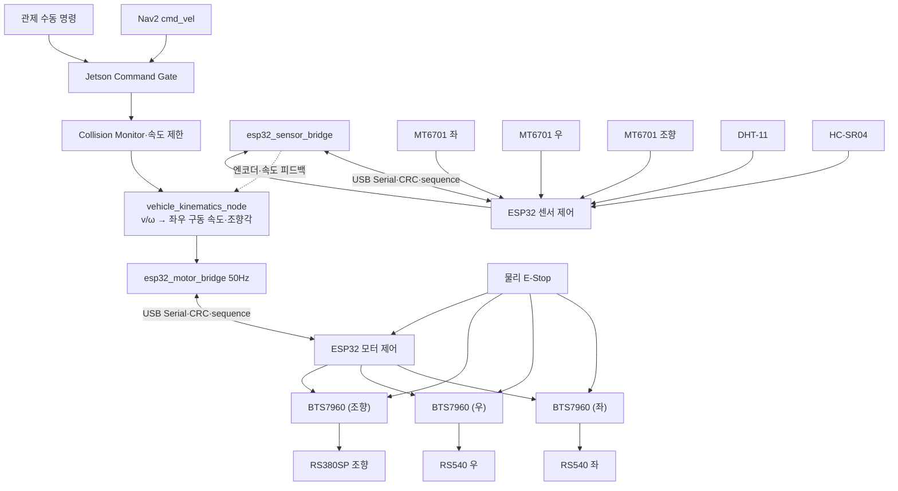

> Sentinel UGV 통합 명세서 v1.1의 일부 — 문서 규칙·버전·변경 이력은 [README](README.md) 참조

# 34. ESP32 저수준 주행 제어·안전 통신 설계

## 34-1. 최신 확정 구조

Sentinel의 최종 제어 구조는 **Jetson 고수준 판단 + ESP32 2개(모터 제어용·센서 제어용) 저수준 실행**으로 분리한다. Raspberry Pi 5는 차량 제어 경로에 포함하지 않는다.



| 구성 요소 | 최종 책임 |
|---|---|
| Jetson | SLAM·Nav2·YOLO·임무 상태, 수동/AUTO 명령 선택, 장애물 안전 제한, 목표 `v/ω`를 좌·우 구동 속도·조향각으로 변환(e-diff, 34-2), 두 ESP32의 엔코더·명령 채널을 결합한 속도 피드백 계산(TBD-HW-011) |
| ESP32 모터 제어 | BTS7960 3개 PWM/DIR 제어, 좌·우 목표 속도·조향각 실행, 통신 watchdog, 오류 시 출력 차단 |
| ESP32 센서 제어 | MT6701 엔코더 3개(좌 구동·우 구동·조향) 계수, 차체 IMU·DHT-11·HC-SR04 수집, 초음파 근거리 감지, 통신 watchdog |
| 모터 드라이버(BTS7960 ×3) | 모터 전력 구동, 과전류·과열 보호, enable/brake 입력 |
| 물리 E-Stop | 소프트웨어 상태와 무관하게 BTS7960 3개의 모터 전원 또는 driver enable을 하드웨어로 차단 |

이 구조는 Linux 프로세스 지연과 CUDA·SLAM 부하가 모터 PWM 생성에 직접 영향을 주지 않게 한다. 두 ESP32 모두 경로를 계획하거나 AI 판단을 하지 않으며, 유효한 목표 값만 안전하게 실행·수집한다.

### ESP32 적용 평가와 제약

ESP32 WROOM-32 2개는 이 프로젝트의 100Hz 제어, MT6701 엔코더 3채널 계수, PWM, 차체 IMU 100Hz 수집, DHT-11·HC-SR04 input capture를 역할별로 나눠 처리할 성능이 충분하다. 구현은 Arduino loop 하나에 모두 넣지 않고 **ESP-IDF·FreeRTOS 기반**으로 제어·통신·센서 태스크를 분리한다.

- WROOM-32는 native USB CDC가 없으므로 온보드 USB-UART bridge(CP2102/CH340 계열 등)를 거쳐 동일 직렬 프로토콜을 유지한다. 정확한 브리지 칩과 GPIO 핀 배정은 TBD-HW-009로 관리한다.
- 두 ESP32 모두 PWM(MCPWM/LEDC), 필요한 3.3V GPIO 수, watchdog, USB 재연결 및 reset 동작을 실측한다. 모터 ESP32는 3채널 PWM/RPWM·LPWM/ENABLE, 센서 ESP32는 I2C 또는 ABZ 입력과 GPIO input capture를 확보해야 한다.
- Wi-Fi/Bluetooth는 두 ESP32 모두 모터 명령, E-Stop, watchdog 경로에 사용하지 않으며 제어 펌웨어에서는 기본 비활성화한다.
- ESP32의 boot strapping 핀과 부팅 중 상태가 변할 수 있는 핀에는 driver enable, brake, 방향 출력을 배정하지 않는다.
- ESP32는 교육용 프로토타입 제어기이며 안전 인증 제어기가 아니다. 물리 E-Stop과 외부 pull-down은 계속 독립적으로 유지한다.

---

## 34-2. 목표 차량 인터페이스와 운동학 확정 절차

관제와 Nav2 구간에서는 표준 Twist의 선속도 `v`와 각속도 `ω`를 사용한다. Jetson의 차량 운동학 변환 계층(`vehicle_kinematics_node`)은 이를 ESP32 모터 제어용 **좌·우 목표 구동 속도**와 **목표 조향각**으로 변환한다. BMW M7 후륜 차축에는 기계식 차동장치가 없으므로 좌·우 속도 차이(소프트웨어 e-diff)로 저속 선회를 보조하며, 실제 회두는 전륜 조향(WW MOTOR RS380SP + MT6701 피드백)이 담당하는 Ackermann 기준을 유지한다.

| 구간 | 최종 표현 |
|---|---|
| 관제·ROS 2 | `linearVelocityMps`, `angularVelocityRadps` |
| Jetson → ESP32 모터 제어 | `targetDriveLeftMmps`, `targetDriveRightMmps`, `targetSteeringAngleMdeg` |
| ESP32 센서 제어 → Jetson | 좌/우 구동 엔코더 tick·속도, 조향 각도(MT6701), 차체 IMU 원시 gyro·accel·측정 시각, DHT-11, HC-SR04 |
| ESP32 모터 제어 → Jetson | 적용 PWM(좌/우/조향), 목표/측정 조향각, fault |
| 차량 기하 | 실물 확인 후 휠베이스 `L`, 트랙폭 `W`, 조향각 `δ`, 최소 회전반경 `R_min` |

관제 명령은 정규화된 `linear`, `angular`를 보내고 Jetson이 차량 한계값으로 변환한다.

```json
{
  "linear": 0.35,
  "angular": -0.20,
  "deadman": true,
  "ttlMs": 250
}
```

Jetson은 물리 단위의 좌·우 구동 속도와 조향각을 계산해 ESP32 모터 제어에 전달한다.

```text
δ = atan(L × ω / max(|v|, v_epsilon))
v_left  = v - ω × W / 2
v_right = v + ω × W / 2
target_drive_left  = clamp(v_left,  -v_max, v_max)
target_drive_right = clamp(v_right, -v_max, v_max)
target_steering_angle = clamp(δ, δ_min, δ_max)
```

`L`(휠베이스)과 `W`(트랙폭)는 실측값을 사용한다. `|v|`가 거의 0인데 `ω`만 존재하는 명령은 제자리 회전으로 보내지 않는다. 좌·우 목표 속도 차이는 조향각과 함께 산출하는 보조 신호일 뿐, 스키드 스티어(제자리 급회전) 목적으로 사용하지 않는다. Nav2가 실차에서 실행 가능한 곡률을 생성하도록 설정하고, 안전 변환 계층은 비현실적인 조향 요구를 제한하거나 정지시킨다.

---

## 34-3. Jetson 안전 명령 체인

최종 모터 명령은 다음 우선순위를 따른다.

```text
1. 물리 E-Stop
2. ESP32 내부 FAULT / watchdog
3. Jetson 소프트웨어 E-Stop
4. Collision Monitor 정지
5. 센서·오도메트리 핵심 오류 정지
6. 수동 deadman·TTL 검사
7. AUTO/MANUAL 명령 선택
8. 속도·가속도 제한
9. 좌·우 구동 속도·조향각 목표를 ESP32 모터 제어로 전송
```

Jetson의 ROS2 노드 흐름:

```text
/cmd_vel_nav ─┐
              ├→ command_mux_node
/cmd_vel_manual┘
→ velocity_smoother
→ collision_monitor
→ safety_gate_node
→ /cmd_vel_safe
→ vehicle_kinematics_node (e-diff·조향각 변환)
→ esp32_motor_bridge_node
```

비상 정지와 Collision Monitor의 정지 출력은 완만한 감속 설정보다 우선하여 즉시 0 속도와 브레이크 플래그를 전달한다.

### 명령 수락 조건

ESP32 모터 제어로 가는 명령은 다음을 모두 만족해야 한다.

- 패킷 CRC가 유효하다.
- 프로토콜 버전과 길이가 일치한다.
- `sequence`가 최근 정상 명령보다 새롭다.
- E-Stop 입력이 해제되어 있다.
- 모터 드라이버 fault가 없다.
- 명령 속도가 설정된 물리 한계 안에 있다.
- Jetson과 ESP32 모터 제어 handshake가 완료되었다.

조건을 벗어난 값은 그대로 실행하지 않고 포화 제한하거나 거부하며 오류 코드를 반환한다. 센서 ESP32와의 통신이 끊겨 엔코더·IMU·환경·근접 데이터가 상실되어도 모터 ESP32의 자체 정지 능력에는 영향이 없지만, Jetson은 이를 오도메트리 상실로 처리해 AUTO를 `PAUSED`로 전환한다(14.5).

---

## 34-4. Jetson ↔ ESP32 물리 연결

MVP의 1순위 연결은 **유선 USB Serial 2계통**이다. 모터 제어용 ESP32와 센서 제어용 ESP32는 각각 독립된 USB 포트로 Jetson과 연결되며, WROOM-32의 온보드 USB-UART bridge를 사용한다.

| 방식 | 장점 | 단점 | 판단 |
|---|---|---|---|
| USB Serial ×2 | 배선 단순, 장치 식별 쉬움, 노트북에서도 시험 가능, 두 보드 독립 장애 격리 | 포트 2개 필요, 재연결 처리를 보드별로 구현 | MVP 확정 |
| 3.3V UART | 지연과 구현이 단순 | 커넥터·GND·전압·포트 충돌 주의 | USB 문제 시 대안 |
| CAN | 노이즈와 오류 검출에 강함 | 트랜시버·구현 부담 | 향후 확장 |

USB 장치는 udev 규칙으로 `/dev/sentinel_mcu_motor`, `/dev/sentinel_mcu_sensor` 별칭을 만든다. USB 케이블에는 스트레인 릴리프를 적용하고 모터 전원선에서 떨어뜨려 배선한다.

USB의 5V는 개발 보드 전원으로 사용할 수 있지만 최종 전원 구성은 역급전 여부를 확인한다. Jetson USB와 외부 5V를 동시에 연결하는 보드는 전원 OR-ing 또는 제조사 회로를 확인한 뒤 사용한다.

두 ESP32 사이에는 직접 배선이 없다(21.3). 속도 폐루프에 두 보드 간 직접 링크가 필요하다고 판단되면 UART 추가를 대체안으로 TBD-HW-011에서 검토한다.

UART 대안을 사용할 때는 Jetson과 ESP32 모두 **3.3V 논리 레벨**인지 확인하고 5V UART 신호를 Jetson 핀에 직접 연결하지 않는다. 전원 GND와 신호 기준 GND는 공통으로 연결하되, 모터 전류 경로가 신호 GND를 통과하지 않게 배선한다.

---

## 34-5. 직렬 프로토콜

두 ESP32 모두 동일한 프레이밍을 사용하되 메시지 종류로 채널을 구분한다. 직렬 스트림 경계를 안전하게 찾기 위해 COBS 프레이밍과 `0x00` 구분자를 사용하고, 프레임 전체에 CRC-16을 적용한다.

```text
[protocolVersion u8]
[messageType u8]
[sequence u16]
[payloadLength u16]
[senderUptimeMs u32]
[payload N bytes]
[crc16 u16]
→ COBS encode
→ 0x00 delimiter
```

- 바이트 순서: little-endian
- Baudrate: 온보드 USB-UART bridge는 921600bps 초기값
- 최대 payload: 128 bytes
- 잘못된 CRC·길이·버전 패킷은 실행하지 않음
- `senderUptimeMs`는 TTL 판단 보조와 재부팅 탐지에 사용
- 안전 정지는 통신 ACK를 기다리지 않고 로컬에서 실행

### 메시지 종류

| 코드 | 이름 | 방향 | 채널 | 주기·조건 |
|---:|---|---|---|---|
| `0x01` | `HELLO` | Jetson → ESP32 | 모터/센서 각각 | 연결·재연결 시 |
| `0x02` | `HELLO_ACK` | ESP32 → Jetson | 모터/센서 각각 | 버전·장치 정보 응답 |
| `0x10` | `DRIVE_COMMAND` | Jetson → ESP32 모터 | 모터 | 50Hz |
| `0x11` | `STOP_COMMAND` | Jetson → ESP32 모터 | 모터 | 즉시, 3회 반복 전송 |
| `0x12` | `ESTOP_COMMAND` | Jetson → ESP32 모터 | 모터 | 즉시, latch |
| `0x20` | `DRIVE_STATE` | ESP32 모터 → Jetson | 모터 | 50Hz |
| `0x21` | `DIAGNOSTIC` | ESP32 → Jetson | 모터/센서 | 5Hz 또는 오류 즉시 |
| `0x22` | `COMMAND_ACK` | ESP32 모터 → Jetson | 모터 | 모드·정지 명령 |
| `0x23` | `ENVIRONMENT_STATE` | ESP32 센서 → Jetson | 센서 | 0.5~1Hz |
| `0x24` | `PROXIMITY_STATE` | ESP32 센서 → Jetson | 센서 | 10~20Hz |
| `0x25` | `ENCODER_STATE` | ESP32 센서 → Jetson | 센서 | 50Hz |
| `0x26` | `IMU_STATE` | ESP32 센서 → Jetson | 센서 | 50~100Hz |
| `0x30` | `CONFIG_GET/SET` | 양방향 | 모터/센서 | 정지·정비 모드에서만 |

### `DRIVE_COMMAND` payload (Jetson → ESP32 모터)

```text
mode                     u8   # SAFE_IDLE=0, MANUAL=1, AUTO=2
flags                    u8   # ENABLE, BRAKE, CLEARABLE_STOP
target_drive_left_mmps   i16
target_drive_right_mmps  i16
target_steering_mdeg     i16
max_accel_mmps2          u16
max_steering_rate_mdps   u16
command_timeout_ms       u16  # 최대 300
```

### `DRIVE_STATE` payload (ESP32 모터 → Jetson)

```text
applied_sequence         u16
state                    u8
fault_flags              u16
drive_pwm_left_permille  i16
drive_pwm_right_permille i16
target_steering_mdeg     i16
steering_actuator_cmd    i16 # 실물 확인 후 normalized/PWM/DIR 상태 의미를 프로토콜 버전에 명시
estop_active             u8
driver_enabled           u8
```

### `ENCODER_STATE` payload (ESP32 센서 → Jetson)

```text
drive_encoder_ticks_left  i32
drive_encoder_ticks_right i32
drive_speed_left_mmps     i16
drive_speed_right_mmps    i16
measured_steering_mdeg    i16 # MT6701, 무효 시 INVALID sentinel
sample_age_ms             u16
```

### `IMU_STATE` payload (ESP32 센서 → Jetson)

```text
sample_time_us       u64  # 센서 ESP32 monotonic 측정 시각
gyro_x_radps         f32  # rad/s, REP-103 x축
gyro_y_radps         f32  # rad/s, REP-103 y축
gyro_z_radps         f32  # rad/s, REP-103 z축
accel_x_mps2         f32  # m/s²
accel_y_mps2         f32  # m/s²
accel_z_mps2         f32  # m/s²
temperature_centi_c  i16  # 선택, 미지원 시 INVALID sentinel
status_flags         u16  # VALID, CALIBRATING, RANGE_ERROR, BUS_ERROR
```

프레임의 `sequence`와 payload의 `sample_time_us`를 함께 사용한다. Jetson serial
수신 시각을 IMU 측정 시각으로 대신하지 않는다. ESP32는 원시 각속도·가속도와
상태만 전달하고 자세 추정·wheel odometry 융합은 Jetson의
`robot_localization` EKF가 담당한다.

Jetson bridge는 handshake에서 ESP32 monotonic 시계와 ROS clock의 offset을
구하고 `sample_time_us`를 ROS timestamp로 변환한다. ESP32 재부팅·uptime 감소를
감지하면 기존 offset과 대기 샘플을 폐기하고 다시 동기화한다. 이 변환이 끝나기
전의 IMU 샘플은 EKF에 넣지 않는다.

### `ENVIRONMENT_STATE` payload

```text
temperature_deci_c    i16  # 253 = 25.3°C
humidity_deci_pct     u16  # 612 = 61.2%RH
status_flags          u8   # VALID, CHECKSUM_ERROR, TIMEOUT
sample_age_ms          u16
```

### `PROXIMITY_STATE` payload

```text
front_min_distance_mm u16
valid_sensor_mask     u8
protective_stop       u8
sample_age_ms         u16
```

DHT-11 실패는 `DEGRADED` 환경 텔레메트리로 처리하고 주행을 바로 중단하지 않는다. HC-SR04 임계거리 진입 시 센서 ESP32는 직렬 송신이나 Jetson 응답을 기다리지 않고 로컬 판단으로 즉시 `PROXIMITY_STATE.protective_stop`을 세우고 이를 보고한다. 다만 모터 드라이버는 센서 ESP32가 아니라 모터 ESP32에 연결되어 있어 두 보드 간 직접 배선이 없으므로, 실제 모터 정지는 **Jetson이 `protective_stop`을 받아 즉시 모터 ESP32에 `STOP_COMMAND`를 중계**하는 경로로 동작한다. 이 중계 지연이 안전 목표(300ms watchdog, 24.3)를 해치지 않는지는 실측 후 확정하며, 최종 근거리 안전은 물리 E-Stop과 모터 ESP32 자체 fault 판정으로 보완한다(TBD-HW-011).

배터리 전압·전류는 전용 센서 위치에 따라 어느 ESP32가 읽어도 되며, 관제 메시지의 단위와 필드명은 동일하게 유지한다.

---

## 34-6. 연결·시동 handshake

두 ESP32는 전원 인가와 리셋 직후 다음 상태로 시작한다.

```text
PWM = 0(모터 ESP32) / 해당 없음(센서 ESP32)
모터 방향 = 중립
driver enable = LOW
상태 = SAFE_IDLE(모터) / BOOT(센서)
watchdog = active
```

시동 순서:

1. 두 ESP32가 GPIO와 타이머를 안전값으로 초기화한다.
2. ESP-IDF interrupt/task watchdog(IWDT/TWDT)과 통신 watchdog을 각자 시작한다.
3. Jetson이 `/dev/sentinel_mcu_motor`와 `/dev/sentinel_mcu_sensor`를 각각 열고 `HELLO`를 보낸다.
4. 두 ESP32가 펌웨어·프로토콜 버전과 fault 상태를 응답한다.
5. Jetson이 버전·E-Stop·엔코더·드라이버 상태를 확인한다(두 채널 모두 preflight 필수, 14.3).
6. 운영자가 임무 또는 수동 모드를 명시적으로 시작할 때만 모터 ESP32를 `ENABLE`한다.

USB가 재연결되어도 이전 AUTO/MANUAL 상태를 자동 복원하지 않는다. 모터 ESP32는 항상 `SAFE_IDLE`에서 새 handshake와 운영자 명령을 기다린다.

---

## 34-7. watchdog과 정지 정책

### 이중 watchdog

| 감시 위치 | 조건 | 동작 |
|---|---|---|
| Jetson `safety_gate_node` | 유효한 상위 명령이 300ms 이상 없음 | `/cmd_vel_safe=0`, 모터 ESP32 STOP |
| ESP32 모터 통신 watchdog | 정상 `DRIVE_COMMAND`가 300ms 이상 없음 | PWM=0(좌/우/조향), 브레이크, driver disable 선택 |
| ESP32 모터 IWDT/TWDT | interrupt 또는 제어 태스크가 정해진 시간 안에 watchdog을 갱신하지 못함 | MCU reset, 출력 초기 안전값 |
| ESP32 센서 통신 watchdog | Jetson 요청/ACK가 300ms 이상 없음 | 로컬 액추에이터가 없어 정지 동작은 없음, `STALE` 플래그만 보고 |
| 관제 Control Session | 브라우저 heartbeat 6초 이상 없음 | 서버 STOP 발행, Jetson TTL이 먼저 정지 |

모터 ESP32의 300ms 통신 watchdog이 실제 모터 정지를 보장하므로 MQTT나 서버의 OFFLINE 판단 속도, 그리고 센서 ESP32 상태에 의존하지 않는다. 센서 ESP32가 끊기면 엔코더·IMU·환경·근접 데이터가 사라지지만, 모터 ESP32는 독립적으로 마지막 명령 기준 300ms watchdog을 유지한다.

### 정지 방식

- 일반 속도 0: 설정된 감속도로 정지
- 명령 TTL 초과: 빠른 제동 또는 PWM 0
- Collision Monitor 정지: 즉시 제동
- 소프트웨어 E-Stop: 모터 ESP32 latch, 명시적 reset 절차 필요
- 물리 E-Stop: 모터 전원 또는 driver enable 하드웨어 차단, 수동 해제 필요

물리 E-Stop을 해제했다고 차량이 자동으로 움직이면 안 된다. 모터 ESP32와 Jetson 양쪽에서 `E_STOP_RESET`과 새로운 운전 시작 명령을 확인한 뒤에만 enable한다.

---

## 34-8. ESP32 제어 루프

### 모터 ESP32 권장 주기

| 작업 | 주기 |
|---|---:|
| 좌/우 구동·조향 목표 적용(PWM) | 100Hz |
| 조향 목표·변화율·한계 적용 | 100Hz |
| Jetson 명령 적용 | 50Hz |
| `DRIVE_STATE` 송신 | 50Hz |
| 통신 watchdog 검사 | 1kHz 또는 고우선순위 제어 태스크 |

### 센서 ESP32 권장 주기

| 작업 | 주기 |
|---|---:|
| 구동 엔코더 하드웨어 카운터 읽기(좌/우) | 1kHz 또는 타이머 연속 계수 |
| 조향 엔코더(MT6701) 읽기 | 100Hz |
| `ENCODER_STATE` 송신 | 50Hz |
| 차체 IMU I2C/SPI 읽기 | 100Hz 권장 |
| `IMU_STATE` 송신 | 50~100Hz |
| 전방 초음파 측정·보호 판단 | 10~20Hz |
| DHT-11 측정 | 0.5~1Hz |
| 통신 watchdog 검사 | 1kHz |

모터 ESP32가 좌·우 구동 각각 독립적으로 엔코더 기반 속도 폐루프를 구성하려면 엔코더 데이터가 필요하지만, 엔코더는 센서 ESP32에 연결되어 있다. MVP는 **Jetson이 센서 ESP32의 `ENCODER_STATE`를 받아 좌·우 속도 오차를 계산하고, 보정된 목표값을 모터 ESP32에 갱신 전송하는 Jetson 경유 폐루프**로 동작한다(50Hz 명령 갱신 한도 내). 모터 ESP32 자체는 목표값 추종을 위한 로컬 제어와 안전 한계만 담당한다. USB 왕복 지연이 문제가 되면 두 ESP32 간 직접 링크를 추가하는 대체안을 TBD-HW-011로 검토한다.

구동 모터는 엔코더 기반 속도 PID를 사용한다. 초기에는 P 또는 PI 제어부터 시작하고, 공중 무부하 값이 아니라 바닥에 놓은 저속 직진 시험으로 조정한다. 조향은 RS380SP DC 기어모터를 MT6701 각도 피드백으로 폐루프 위치 제어한다. 좌·우 끝단, 최대 변화율과 기계 충돌 방지 한계를 적용하고, 명령각과 측정각의 차이가 지속되면 fault를 발생시킨다.

100Hz 제어와 통신 watchdog, IMU 수집은 각 보드의 고우선순위 태스크에 두고, DHT-11과 초음파는 센서 ESP32의 별도 저우선순위 태스크에서 타이머/input capture를 사용한다. 저주기 센서 응답을 기다리는 busy-wait 또는 긴 critical section으로 IMU·엔코더 수집 태스크를 막지 않는다.

```text
error = target_speed - measured_speed
u = Kp × error + Ki × integral + feedforward(target_speed)
u = clamp(u, -max_pwm, +max_pwm)
```

다음 보호를 포함한다.

- 목표 속도 포화 제한
- PWM 변화율 제한
- 센서 ESP32 통신 두절로 엔코더 데이터가 갱신되지 않는데 모터 ESP32 PWM만 큰 상태 감지
- 조향 목표·실제각 편차 또는 모터 무응답 경고
- 모터 드라이버 fault 입력 즉시 차단
- 전류 센서가 있다면 stall 전류 지속 시 정지
- 방향 전환 전 짧은 중립·감속 구간

---

## 34-9. 상태와 오류 코드

모터 ESP32 상태:

```text
BOOT
SAFE_IDLE
READY
MANUAL_ACTIVE
AUTO_ACTIVE
STOPPING
ESTOP_LATCHED
FAULT_LATCHED
```

센서 ESP32 상태(액추에이터가 없어 단순화):

```text
BOOT
STREAMING
DEGRADED   # 센서 일부 실패(예: DHT-11 checksum 오류)
COMM_LOST  # Jetson과 통신 두절
```

주요 fault bit(모터·센서 ESP32 공통 정의, 보고 채널로 소유 보드 구분):

| Bit | 코드 | 보고 채널 | 의미 |
|---:|---|---|---|
| 0 | `COMM_TIMEOUT_MOTOR` | 모터 | Jetson↔모터 ESP32 명령 300ms 초과 |
| 1 | `CRC_ERROR_RATE_HIGH` | 모터/센서 | 해당 채널 직렬 프레임 오류율 초과 |
| 2 | `DRIVE_ENCODER_FAULT` | 센서 | 좌/우 구동 엔코더 무응답·비정상 |
| 3 | `STEERING_ENCODER_FAULT` | 센서 | 조향 엔코더(MT6701) 무응답 또는 한계 초과 |
| 4 | `DRIVER_FAULT` | 모터 | BTS7960 3개 중 1개 이상 fault 입력 |
| 5 | `OVERCURRENT` | 모터 | 전류 임계값 초과 |
| 6 | `UNDERVOLTAGE` | 모터 | 구동 전원 저전압 |
| 7 | `ESTOP_ACTIVE` | 모터 | 물리 E-Stop 입력 |
| 8 | `CONFIG_INVALID` | 모터/센서 | PPR·PID·한계값 오류 |
| 9 | `INTERNAL_WATCHDOG_RESET` | 모터/센서 | IWDT/TWDT 재부팅 이력(해당 보드) |
| 10 | `PROXIMITY_SENSOR_FAULT` | 센서 | 초음파 timeout·비정상값 지속 |
| 11 | `ENVIRONMENT_SENSOR_FAULT` | 센서 | DHT-11 checksum·timeout 지속, 주행은 DEGRADED 허용 |
| 12 | `COMM_TIMEOUT_SENSOR` | 센서 | Jetson↔센서 ESP32 통신 300ms 초과(엔코더·IMU·초음파 데이터 상실) |
| 13 | `IMU_SENSOR_FAULT` | 센서 | IMU bus 오류, NaN·범위 초과, sample timestamp 정지 |

구동 엔코더 또는 조향 계통에 치명적 오류가 생기면 자동 주행을 중지한다. 수동 강제 이동이 필요하면 운영자가 위험을 확인한 `RECOVERY_MANUAL` 모드에서 매우 낮은 속도로만 허용한다. `RECOVERY_MANUAL` 모드는 시연 기본 기능에는 포함하지 않는다.

---

## 34-10. 물리 E-Stop·전원 안전

```text
모터 배터리(12V, 유아전동차 내장)
→ 퓨즈
→ 래칭형 NC E-Stop
→ BTS7960 3개(좌 구동·우 구동·조향) 전원/contactor
→ RS540 ×2·RS380SP ×1

Jetson 전원(보조배터리, 별도 계통)
→ E-Stop과 무관하게 유지 가능
→ Jetson·두 ESP32 논리 전원은 유지 가능
→ E-Stop 상태와 오류를 관제에 보고
```

- 모터를 Jetson·ESP32 GPIO에서 직접 구동하지 않는다.
- 두 ESP32의 reset 핀과 출력 핀의 부팅 순간 상태를 측정한다.
- driver enable·방향·brake에는 ESP32 boot strapping 핀을 사용하지 않고, GPIO가 high-impedance인 부팅 구간에도 안전한 외부 pull-down/up을 둔다.
- driver enable에는 외부 pull-down을 두어 MCU 핀이 부유해도 모터가 켜지지 않게 한다.
- E-Stop 부품은 BTS7960 3개의 합산 최대 전류를 직접 감당하거나 적절한 contactor/relay를 제어해야 한다.
- 퓨즈와 배선 굵기는 모터 정지 전류와 드라이버 정격을 확인한 뒤 확정한다.
- 모터 시험은 구동 바퀴를 바닥에서 띄운 상태에서 시작하고 E-Stop 시험을 가장 먼저 수행한다.

---

## 34-11. 구현 구조

```text
jetson/ros2_ws/src/
├─ sentinel_control/
│  ├─ command_mux_node
│  ├─ vehicle_kinematics_node   # v/ω → 좌우 구동 속도·조향각(e-diff)
│  ├─ safety_gate_node
│  └─ control_limits.yaml
└─ esp32_bridge/
   ├─ esp32_motor_bridge_node
   ├─ esp32_sensor_bridge_node
   ├─ serial_transport
   ├─ packet_codec
   └─ diagnostics

esp32/
├─ esp32_motor/
│  ├─ CMakeLists.txt
│  ├─ sdkconfig.defaults
│  ├─ main/
│  │  ├─ protocol/
│  │  ├─ motor_control/
│  │  ├─ steering_control/
│  │  ├─ safety/
│  │  └─ app_main.c
│  └─ test/
├─ esp32_sensor/
│  ├─ CMakeLists.txt
│  ├─ sdkconfig.defaults
│  ├─ main/
│  │  ├─ protocol/
│  │  ├─ encoder/
│  │  ├─ sensors/
│  │  └─ app_main.c
│  └─ test/
└─ README.md

common/protocol/
├─ esp32_protocol.md
├─ message_ids.h
├─ fault_codes.h
└─ test_vectors/
```

프로토콜 상수와 CRC test vector는 Jetson과 두 ESP32 펌웨어 CI에서 동일하게 검증한다.

---

## 34-12. 검증 항목과 합격 기준

| ID | 시험 | 합격 기준 |
|---|---|---|
| CTRL-01 | 두 ESP32 부팅·리셋 | 출력 PWM 0, driver disable 유지 |
| CTRL-02 | USB 케이블 분리(모터 채널) | 300ms 이내 목표 PWM 0·정지 상태 전환 |
| CTRL-03 | Jetson 모터 bridge 강제 종료 | 모터 ESP32 watchdog으로 300ms 이내 정지 |
| CTRL-04 | 모터 ESP32 제어 태스크 고의 정지 | IWDT/TWDT reset 후 모터 출력 안전값 |
| CTRL-05 | CRC 오류 패킷 100개 | 잘못된 명령 실행 0회 |
| CTRL-06 | 오래된 sequence 재전송 | 실행 거부·진단 카운터 증가 |
| CTRL-07 | 좌/우 구동 엔코더·조향 엔코더 방향 | 전진 tick 부호(좌/우 개별)와 좌·우 조향 명령 방향이 정의와 일치 |
| CTRL-08 | 물리 E-Stop | Jetson·ESP32 상태와 무관하게 모터 전력 차단 |
| CTRL-09 | E-Stop 해제 | 자동 재출발하지 않고 SAFE_IDLE 유지 |
| CTRL-10 | 20분 저속 주행 | 통신 끊김·비정상 reset 없음, 온도·전류 한계 이내 |
| CTRL-11 | 좌/우 구동 엔코더 중 1개 분리 | 자동 주행 정지와 해당 채널 fault 정확히 보고 |
| CTRL-12 | AUTO/MANUAL 동시 입력 | 상태 우선순위에 따라 하나만 실행 |
| CTRL-13 | 전진 중 즉시 후진 명령 | 가속 제한·중립 구간 적용, 드라이버 fault·과전류 없음 |
| CTRL-14 | 조향 한계 초과 명령 | 설정된 기계 한계에서 포화되고 링크 충돌·모터 과부하 없음 |
| CTRL-15 | 0m/s+각속도 명령 | 제자리 회전을 시도하지 않고 안전하게 거부 또는 정지 |
| CTRL-16 | 전원 인가·reset·flash mode 진입 | driver enable LOW, PWM 0, 의도하지 않은 모터 동작 0회 |
| CTRL-17 | Wi-Fi/Bluetooth 스캔·연결 시도 | 제어 펌웨어에서 비활성, 제어 주기와 안전 경로에 무선 의존 0건 |
| CTRL-18 | 초음파 임계거리 진입 | 센서 ESP32가 즉시 `protective_stop` 보고, Jetson 중계로 모터 ESP32가 정지, 왕복 지연 실측·기록(TBD-HW-011) |
| CTRL-19 | DHT-11/초음파 timeout 반복 | 센서 ESP32 수집 루프 지연이 모터 ESP32의 100Hz 제어 주기에 영향 없음, 센서별 fault·DEGRADED 정책 적용 |
| CTRL-20 | 센서 ESP32만 USB 분리 | 모터 ESP32는 로컬 watchdog으로 계속 안전 동작, Jetson은 엔코더·IMU·환경·근접 데이터 상실을 감지해 AUTO를 PAUSED 전환 |
| CTRL-21 | 모터 ESP32만 USB 분리 | 300ms 이내 모터 ESP32 자체 정지, 센서 데이터 수신 여부와 무관하게 자동 재출발 없음 |
| CTRL-22 | IMU 10초 정지 측정 | 50~100Hz 주기, sequence 연속, NaN 없음, 자이로 bias 재현 |
| CTRL-23 | IMU 분리·I2C/SPI 오류 | `IMU_SENSOR_FAULT`, 오래된 샘플 EKF 입력 차단, AUTO PAUSED 또는 명시적 축소 운용 |

정지 시간은 명령 생성 시각, ESP32 수신 시각, PWM 0 시각을 로직 애널라이저 또는 ESP32 로그 핀으로 측정한다. 화면상의 관제 표시만으로 300ms를 판정하지 않는다.

---

## 34장 최종 확정안

> Sentinel UGV는 Jetson이 생성한 선속도·각속도를 e-diff와 Ackermann 조향 기준의 좌·우 구동 속도·조향각으로 변환해 유선 USB Serial로 모터 제어용 ESP32에 50Hz 전송한다. 모터 제어용 ESP32는 ESP-IDF 기반으로 BTS7960 3개(좌 구동·우 구동·조향)를 구동하고 통신·내부 watchdog을 담당하며, 센서 제어용 ESP32는 별도 USB Serial로 MT6701 엔코더 3개·차체 IMU 1개·DHT-11·HC-SR04를 수집해 측정 시각·sequence와 함께 Jetson에 전달한다. Jetson은 `/imu/data_raw`를 발행하고 wheel odometry와 IMU yaw rate를 EKF로 융합한다. 두 ESP32 사이에는 직접 배선이 없으므로 속도 폐루프와 초음파 근거리 정지는 Jetson이 두 채널을 중계해 계산·실행하는 구조로 잠정 확정하며, 통신 지연이 문제가 되면 ESP32 간 직접 링크 추가를 TBD-HW-011로 검토한다. 유효 명령이 300ms 동안 없으면 모터 ESP32가 서버나 Jetson 프로세스와 무관하게 구동 모터를 정지하며, 물리 E-Stop은 모든 소프트웨어와 독립적으로 3개 드라이버의 구동 전원을 차단한다.

---

# 35. 센서·엔코더 캘리브레이션 및 튜닝

## 35-1. 목적과 순서

캘리브레이션은 센서 값과 차량 실제 움직임의 관계를 측정해 설정값으로 고정하는 작업이다. Sentinel은 다음 순서를 바꾸지 않는다.

```text
전원·모터 방향
→ 엔코더 방향·PPR(좌 구동·우 구동·조향)
→ 바퀴 이동 거리·휠베이스·트랙폭
→ 조향 영점·조향각·최소 회전반경
→ 차체 IMU
→ LiDAR·카메라·차체 TF(고정 마운트)
→ SLAM
→ Nav2·Collision Monitor
→ YOLO·ByteTrack
→ 전체 시나리오
```

앞 단계가 틀린 상태에서 Nav2 파라미터를 먼저 만지면 원인을 구분할 수 없다. 모든 결과는 날짜·장소·차량 중량·타이어 상태·조향 링크 상태와 함께 YAML과 측정표로 남긴다.

---

## 35-2. 좌표계 기준

권장 TF 트리(짐벌 미사용, 6.4 확정):

```text
map
└─ odom
   └─ base_footprint
      └─ base_link
         ├─ imu_link
         ├─ rear_left_wheel_link
         ├─ rear_right_wheel_link
         ├─ front_left_wheel_link
         ├─ front_right_wheel_link
         ├─ lidar_link
         └─ camera_link
```

`odom → base_footprint → base_link` 순서는 ROS 표준 관례(REP-105/120)이며 8.3·22.3장과 동일하다. 좌표축은 ROS REP-103 관례를 따른다.

```text
+X: 차량 전방
+Y: 차량 좌측
+Z: 차량 위쪽
Yaw: +Z축 기준 반시계 방향
```

고정 센서 위치는 URDF/Xacro에 기록한다. 짐벌이 없으므로 `lidar_link`·`camera_link`는 모두 **static TF**이며 동적 관절각을 발행하지 않는다.

---

## 35-3. 엔코더·바퀴·BMW M7 조향 보정

### 방향·PPR 확인

1. 구동 바퀴를 바닥에서 띄운다.
2. 좌측 구동 모터를 낮은 PWM으로 전진시켜 좌측 엔코더 누적값이 정의된 양의 방향인지 확인한다. 우측도 동일하게 반복한다.
3. 조향 모터를 중앙→좌→중앙→우→중앙으로 움직이며 조향 엔코더(MT6701) 방향을 확인한다.
4. 모터축·출력축·구동 바퀴 1회전당 tick을 좌·우 각각 측정한다.
5. MT6701의 출력 모드(I2C 절대각 vs ABZ 증분)와 감속비를 구분한다.

출력축 1회전당 유효 tick(좌·우 각각):

```text
ticks_per_output_rev
= encoder_pulses_per_motor_rev
× quadrature_multiplier(또는 MT6701 분해능)
× gear_ratio
```

### e-diff 좌·우 대칭성 확인

후륜에 기계식 차동장치가 없으므로 직진 시 좌·우 목표 속도가 동일해도 실제 바퀴 반경·타이어 마찰 차이로 편향(drift)이 발생할 수 있다. 3m 직진 시험에서 좌·우 편차가 크면 좌·우 개별 `effective_meters_per_tick` 보정계수를 분리 적용하고, 필요하면 목표 속도에 좌·우 트림(bias)을 추가한다.

### 거리 스케일

바퀴의 이론 이동 거리는 유효 지름과 원주로 구하지만 실제 하중에서는 타이어 눌림과 미끄럼이 발생한다. 3m 직진 시험을 좌·우 각각 5회 수행하여 다음 스케일을 구한다.

```text
distance_scale = actual_distance / odom_distance
effective_meters_per_tick
= nominal_meters_per_tick × distance_scale
```

정방향과 역방향 스케일을 비교하고, 좌·우 스케일 차이가 크면 타이어, 구동계 백래시, 엔코더 방향, PID부터 점검한다.

### 휠베이스·트랙폭·조향 영점·최소 회전반경

1. 앞바퀴를 기계적으로 직진에 맞추고 조향 모터의 중앙 명령값을 기록한다.
2. 좌·우 끝단 직전의 안전 PWM과 실제 내측·외측 바퀴 각도를 측정한다.
3. 서로 다른 조향 명령으로 일정한 원을 저속 주행해 실제 회전반경을 좌·우 각 5회 측정한다.
4. 명령 조향각과 실제 곡률의 매핑을 테이블 또는 보정식으로 저장하고, 트랙폭 `W`(e-diff 계산용)를 실측한다.

```text
R_measured = traveled_distance / measured_yaw_rad
δ_effective = atan(wheelbase / R_measured)
```

좌·우 회전반경이 다르면 링크 비대칭, 액추에이터 중앙, 타이어 간섭과 백래시를 먼저 점검한다. 제자리 회전 시험은 하지 않으며, Nav2의 `minimum_turning_radius`에는 실측한 가장 보수적인 값을 사용한다.

합격 기준:

- 좌·우 각각 3m 직진 5회 평균 거리 오차 ±5% 이내, 좌·우 편차 ±3%p 이내
- 일정 반경 원주행 종료 시 yaw 오차 ±10° 이내
- 조향 중앙 복귀 후 직진 3m 횡방향 이탈 15cm 이내
- 같은 조건 반복 결과 표준편차가 평균의 5% 이내

---

## 35-4. ESP32 구동 속도·조향 튜닝

튜닝 전 배터리 전압과 차량 중량을 기록한다. 좌·우 구동은 각각 독립 채널로 튜닝하며, 최종적으로 동일 목표 속도에서 좌·우 응답이 비슷하도록 게인을 맞춘다. 34-8에서 정한 대로 속도 폐루프는 Jetson이 센서 ESP32의 엔코더 데이터와 모터 ESP32의 명령을 결합해 계산하므로, USB 왕복 지연을 포함한 폐루프 주기를 실측하고 기록한다.

1. `Ki=0`, `Kd=0`에서 작은 `Kp`로 시작한다.
2. 0.05, 0.10, 0.20m/s 계단 입력을 준다.
3. 목표에 느리게 못 미치면 `Kp`를 올린다.
4. 지속 오차가 남을 때만 `Ki`를 조금 추가한다.
5. 진동·소음·속도 헌팅이 생기면 gain과 가속 제한을 낮춘다.
6. 정방향과 역방향 deadband가 다르면 feedforward 표를 좌·우 별도로 관리한다.

조향은 RS380SP DC 기어모터를 MT6701 각도 피드백으로 폐루프 위치 제어한다. 목표각 계단 입력에서 overshoot·정정시간·좌우 비대칭을 측정하고, 기계 백래시가 크면 데드밴드 보상을 추가한다.

측정 항목:

- rise time
- overshoot
- steady-state error
- PWM·전류·배터리 전압
- 명령 0 이후 정지 거리
- 좌·우 구동 응답 편차
- USB 왕복 지연(센서 ESP32 → Jetson → 모터 ESP32)
- 조향 중앙 오차·좌우 한계·명령-실제각 오차
- 조향 변화율과 모터 전류·온도

재난 탐사 MVP는 빠른 응답보다 저속 안정성과 정지 거리를 우선한다.

---

## 35-5. IMU 보정

차체 상태 추정용 IMU 1개(`imu_link`)만 센서 ESP32의 I2C 또는 SPI에 연결한다. 짐벌이 없으므로 별도의 head IMU는 사용하지 않는다. 센서 ESP32는 원시 gyro·accel과 monotonic 측정 시각을 전달하고, Jetson의 sensor bridge가 `sensor_msgs/Imu` `/imu/data_raw`로 변환한다.

보정 절차:

1. 모터를 끄고 10초 이상 완전히 정지한다.
2. 자이로 각 축 평균을 bias로 저장한다.
3. 센서를 여섯 방향으로 놓아 가속도 축 방향과 scale을 확인한다.
4. 자력계는 실내 모터·철제 차체 간섭이 크므로 검증 전 yaw에 사용하지 않는다.
5. 모터 OFF/ON 상태의 진동과 bias 변화를 비교한다.
6. ESP32 `sample_time_us`가 재부팅·wrap·역순 없이 증가하고 USB 지연과 분리되는지 확인한다.
7. Jetson 변환 뒤 단위가 rad/s·m/s², `frame_id=imu_link`이며 timestamp와 covariance가 ROS 메시지에 올바르게 들어가는지 확인한다.
8. DHT-11·초음파 timeout 중에도 IMU 50~100Hz 주기와 sequence가 유지되는지 확인한다.

오래되거나 역순인 샘플, NaN, 비정상 범위, serial 단절 데이터는 EKF에 넣지 않는다. 정지 상태에서 yaw drift가 크면 소프트웨어 필터를 세게 하기 전에 고정 상태, 전원 노이즈, 샘플링 주기를 점검한다.

---

## 35-6. 카메라 보정

카메라 내부 파라미터는 checkerboard 또는 Charuco 보드로 구한다.

- 초점과 해상도를 실제 운용값으로 고정한다.
- 화면 중앙·모서리·거리별로 20장 이상 촬영한다.
- `camera_matrix`, `distortion_coefficients`를 YAML로 저장한다.
- 해상도나 디지털 줌이 바뀌면 다시 보정한다.
- 평균 reprojection error뿐 아니라 왜곡 보정 영상의 직선 형태를 눈으로 확인한다.

YOLO 바운딩 박스 중심을 LiDAR 방향과 결합하려면 카메라 내부 파라미터와 `camera_link ↔ lidar_link` 외부 파라미터가 모두 필요하다.

---

## 35-7. LiDAR·카메라·차체 외부 파라미터

### 1차 물리 측정

`base_link` 원점에서 센서 중심까지 X·Y·Z 거리와 Roll·Pitch·Yaw를 측정해 URDF에 입력한다. 짐벌이 없으므로 이 값은 고정값이며 마운트를 물리적으로 바꾸지 않는 한 재측정하지 않는다.

### LiDAR 검증

- 평평한 바닥에서 차량을 정지시킨 상태로 확인한다.
- RViz에서 긴 평면 벽이 휘거나 두 겹으로 보이지 않는지 확인한다.
- 최소 반경 저속 선회 후 같은 벽과 코너가 겹치는지 확인한다.

### 카메라-LiDAR 검증

거리와 각도가 다른 평면 표적을 사용해 LiDAR 점을 카메라 영상에 투영한다. 중앙 한 지점만 맞추지 말고 화면 좌우와 1m·2m·3m 거리에서 확인한다.

초기 합격 기준:

- 2m 거리 표적에서 투영 중심 오차 10cm 또는 20px 이내
- 정지 상태 5회 반복 시 위치 오차 변화 5cm 이내

---

## 35-8. (해당 없음 — 짐벌 미사용)

짐벌은 6.4장에서 프로젝트 범위 밖으로 확정했다. 카메라·LiDAR는 차체 고정 마운트이며 정적 TF만 사용하므로 영점·동적 TF 캘리브레이션 절차가 없다. 관련 검증은 35-7(외부 파라미터)로 충분하다.

---

## 35-9. SLAM·Nav2 튜닝

순서는 SLAM 지도 품질을 먼저 확보한 뒤 Nav2를 조정한다.

### SLAM 확인

- 낮은 속도로 수동 주행하며 loop closure 전후 지도를 비교한다.
- 직선 복도 왕복 후 시작점 오차를 측정한다.
- 엔코더만, 엔코더+IMU, LiDAR SLAM 융합 결과를 rosbag으로 재생한다.

### Nav2 초기 제한값

| 항목 | 보수적 초기값 | 확정 방법 |
|---|---:|---|
| 최대 선속도 | 0.25m/s | 정지 거리·영상 안정성 |
| 최대 각속도 | 0.6rad/s | 최소 회전반경·조향 한계·SLAM 품질 |
| 선가속도 | 0.25m/s² | 전류·기구 흔들림 |
| 각가속도 | 0.6rad/s² | 회전 overshoot |
| 사람 접근 속도 | 0.10m/s 이하 | 안전거리 시험 |
| 목표 사람 정지거리 | 1.5~2.0m | LiDAR·카메라 시야 |

정확한 footprint는 조향된 앞바퀴의 최대 돌출 범위와 센서·범퍼를 포함한다. `robot_radius`로 단순 대체하지 말고 다각형 footprint를 사용한다.

Collision Monitor 구역은 최소 두 단계로 둔다.

```text
SLOWDOWN zone → 속도 비율 제한
STOP zone     → 즉시 0 속도
```

구역 크기는 최고 속도에서의 실제 정지 거리와 LiDAR 갱신 지연을 고려하되, 모터 ESP32 300ms timeout보다 앞서 동작하도록 시험으로 정한다.

---

## 35-10. YOLO·ByteTrack 기준 보정

초기 기준:

```text
person confidence ≥ 0.60
최근 1초 동안 서로 다른 5개 이상 프레임 탐지
→ PERSON_CONFIRMED

track lost buffer = 2~3초
같은 프레임의 서로 다른 track_id
→ 별도 사람
```

현장별로 다음 표를 수집한다.

- 거리 1m, 2m, 3m, 5m
- 정면·측면·앉음·누움
- 한 명·여러 명·부분 가림
- 밝음·어두움·역광

confidence를 올려 오탐을 줄이면 누워 있거나 가려진 사람을 놓칠 수 있다. 단일 숫자만 보고 결정하지 않고 precision·recall과 이벤트 생성률을 함께 본다.

---

## 35-11. 설정 파일과 변경 관리

```text
config/
├─ robot_geometry.yaml
├─ encoder.yaml
├─ esp32_motor.yaml
├─ esp32_sensor.yaml
├─ vehicle_kinematics.yaml
├─ imu.yaml
├─ camera_intrinsics.yaml
├─ sensor_extrinsics.yaml
├─ nav2.yaml
├─ collision_monitor.yaml
└─ perception.yaml
```

각 임무는 다음 식별자를 저장한다.

```json
{
  "configVersion": "sentinel-config-2026.07.23.1",
  "firmwareVersion": "esp32-0.3.0",
  "modelVersion": "yolo26n-person-trt-001",
  "calibrationDate": "2026-07-23",
  "vehicleMassKg": null
}
```

파라미터 변경 시 이전값, 새값, 이유, 시험 결과를 Git 커밋과 캘리브레이션 기록에 남긴다. 시연 당일에는 승인된 기준 파일을 복사해 임의 수정하지 않는다.

---

## 35-12. 통합 캘리브레이션 합격 기준

| ID | 항목 | 합격 기준 |
|---|---|---|
| CAL-01 | 엔코더 거리 | 좌·우 각각 3m 평균 오차 ±5% 이내, 좌·우 편차 ±3%p 이내 |
| CAL-02 | 일정 반경 선회 | 원주행 종료 yaw 오차 ±10° 이내 |
| CAL-03 | 직진성 | 3m에서 횡방향 이탈 15cm 이내 |
| CAL-04 | 조향 영점·한계·최소 반경 | 중앙 복귀 직진성과 좌우 안전 한계, 실측 `R_min`·트랙폭 `W` 기록 |
| CAL-05 | IMU 정지 안정성 | 10초 측정 bias 재현, 비정상 spike 없음 |
| CAL-06 | TF | RViz frame jump·끊김 없음 |
| CAL-07 | 카메라-LiDAR | 2m 표적 10cm 또는 20px 이내 |
| CAL-08 | ~~짐벌 중앙 복귀~~ | **폐기 — 짐벌 미사용 확정(6.4)** |
| CAL-09 | ~~NAV_LOCK 지도~~ | **폐기 — 짐벌 미사용 확정(6.4)** |
| CAL-10 | Nav2 정지 | STOP zone 침범 전 정지, 충돌 0회 |
| CAL-11 | 사람 접근 | 1.5~2.0m 범위 정지 5회 중 5회 |
| CAL-12 | 다중 인원 | 3명을 개별 track으로 유지하고 encounter 1개 생성 |

CAL-08·CAL-09는 짐벌 미사용 확정에 따라 폐기했으며 ID는 결번으로 유지한다(38-3 FR-024 참조).

---

## 35장 최종 확정안

> 캘리브레이션은 ESP32 좌·우 구동 엔코더·속도 제어와 조향 영점·한계부터 시작해 차체 IMU, 센서 TF, SLAM, Nav2, YOLO 순서로 진행한다. 바퀴 이동 스케일은 좌·우 각각 보정하고, 트랙폭·휠베이스·조향각 매핑과 최소 회전반경은 실험값으로 보정한다. 짐벌은 사용하지 않으므로 카메라·LiDAR 외부 파라미터는 고정 마운트 기준으로 한 번만 확정하면 된다. 모든 보정값은 버전이 있는 YAML로 관리하고 각 임무에 펌웨어·모델·캘리브레이션 버전을 함께 저장한다.

---
