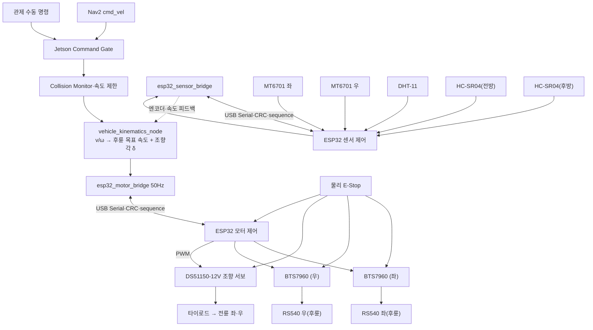

> Sentinel UGV 통합 명세서 v1.1의 일부 — 문서 규칙·버전·변경 이력은 [README](README.md) 참조

# 34. ESP32 저수준 주행 제어·안전 통신 설계

## 34-1. 최신 확정 구조

Sentinel의 최종 제어 구조는 **Jetson 고수준 판단 + ESP32 2개(모터 제어용·센서 제어용) 저수준 실행**으로 분리한다. Raspberry Pi 5는 차량 제어 경로에 포함하지 않는다.



| 구성 요소 | 최종 책임 |
|---|---|
| Jetson | SLAM·Nav2·YOLO·임무 상태, 수동/AUTO 명령 선택, 장애물 안전 제한, 목표 `v/ω`를 **후륜 목표 속도와 전륜 조향각 `δ`로 변환**(전륜 조향, 34-2), 두 ESP32의 엔코더·명령 채널을 결합한 속도 피드백 계산(TBD-HW-011) |
| ESP32 모터 제어 | BTS7960 2개 PWM/DIR 제어(전진·후진), **조향 서보 PWM 생성·엔드포인트 클램프·슬루레이트 제한**, 통신 watchdog, 오류 시 출력 차단 |
| ESP32 센서 제어 | MT6701 엔코더 2개(후륜 좌·우) 계수, 차체 IMU·DHT-11·HC-SR04 ×2(전방·후방, 후방은 2026-08-08 착수 S15P11A301-324·TBD-HW-010) 수집, 초음파 근거리 감지, 통신 watchdog |
| 모터 드라이버(BTS7960 ×2) | 후륜 모터 전력 구동, 과전류·과열 보호, enable/brake 입력 |
| 조향 서보(DS51150-12V) | 전륜 타이로드 구동. 내부 폐루프로 목표 각도 유지, **외부 각도 피드백·fault 출력 없음** |
| 물리 E-Stop | 소프트웨어 상태와 무관하게 BTS7960 2개의 모터 전원 또는 driver enable과 **조향 서보 전원**을 하드웨어로 차단 |

이 구조는 Linux 프로세스 지연과 CUDA·SLAM 부하가 모터 PWM 생성에 직접 영향을 주지 않게 한다. 두 ESP32 모두 경로를 계획하거나 AI 판단을 하지 않으며, 유효한 목표 값만 안전하게 실행·수집한다.

### ESP32 적용 평가와 제약

ESP32 WROOM-32 2개는 이 프로젝트의 100Hz 제어, MT6701 엔코더 2채널 계수, PWM, 차체 IMU 100Hz 수집, DHT-11·HC-SR04 input capture를 역할별로 나눠 처리할 성능이 충분하다. 구현은 Arduino loop 하나에 모두 넣지 않고 **ESP-IDF·FreeRTOS 기반**으로 제어·통신·센서 태스크를 분리한다.

- WROOM-32는 native USB CDC가 없으므로 온보드 USB-UART bridge(CP2102/CH340 계열 등)를 거쳐 동일 직렬 프로토콜을 유지한다. 정확한 브리지 칩과 GPIO 핀 배정은 TBD-HW-009로 관리한다.
- 두 ESP32 모두 PWM(MCPWM/LEDC), 필요한 3.3V GPIO 수, watchdog, USB 재연결 및 reset 동작을 실측한다. 모터 ESP32는 구동용 2채널 PWM/RPWM·LPWM/ENABLE **+ 조향 서보용 저주파 PWM 1채널**, 센서 ESP32는 I2C 또는 ABZ 입력과 GPIO input capture를 확보해야 한다. 서보 채널은 구동 PWM(수~수십 kHz)과 주파수 대역이 전혀 다르므로(약 50Hz) **별도 LEDC 타이머를 배정한다** — 같은 타이머를 공유하면 한쪽 주파수를 바꿀 때 다른 쪽이 함께 흔들린다.
- Bluetooth는 두 ESP32 모두 쓰지 않는다. **Wi-Fi 는 모터 ESP32에서 수동 조종 채널 전용으로 켠다**(S15P11A301-298) — 폰이 자기 핫스팟 위에서 이 보드에 직결하는 것이 확정 토폴로지이고, 젯슨은 폰에 도달할 수 없어 다른 경로가 없다. 다음 셋을 지킨다.
  - *자율* 명령·E-Stop·watchdog 경로에는 무선 의존이 **0건**이다. 그 경로는 전부 USB 직렬(921600, COBS+CRC16)이다.
  - WiFi/lwIP 와 웹 태스크는 **core 0**, 100Hz 제어와 시리얼은 **core 1** 로 물리적으로 분리한다.
  - 수동 채널은 무선이 끊기는 것을 정상 사건으로 다룬다 — 자체 TTL(250ms)과 폰의 deadman 이 그때 바퀴를 세운다. 이것이 CTRL-17 의 재작성 근거다.
  - 센서 ESP32 는 무선을 쓰지 않는다.
- ESP32의 boot strapping 핀과 부팅 중 상태가 변할 수 있는 핀에는 driver enable, brake, 방향 출력, **조향 서보 신호**를 배정하지 않는다. 부팅 중 신호선이 부유하면 서보가 임의 각도로 튄다.
- ESP32는 교육용 프로토타입 제어기이며 안전 인증 제어기가 아니다. 물리 E-Stop과 외부 pull-down은 계속 독립적으로 유지한다.

---

## 34-2. 목표 차량 인터페이스와 운동학 확정 절차

관제와 Nav2 구간에서는 표준 Twist의 선속도 `v`와 각속도 `ω`를 사용한다. Jetson의 차량 운동학 변환 계층(`vehicle_kinematics_node`)은 이를 ESP32 모터 제어용 **후륜 목표 구동 속도와 전륜 목표 조향각**으로 변환한다. 구동은 후륜 RS540 2개, 조향은 전륜 타이로드에 직결된 DS51150-12V 서보가 담당하므로 운동학은 **전륜 조향(자전거 모델·Ackermann 근사)** 이다.

| 구간 | 최종 표현 |
|---|---|
| 관제·ROS 2 | `linearVelocityMps`, `angularVelocityRadps` |
| Jetson → ESP32 모터 제어 | `targetDriveLeftMmps`, `targetDriveRightMmps`, `targetSteeringMdeg`, `maxSteeringRateMdps` |
| ESP32 센서 제어 → Jetson | 후륜 좌/우 엔코더 tick·속도, 차체 IMU 원시 gyro·accel·측정 시각, DHT-11, HC-SR04 |
| ESP32 모터 제어 → Jetson | 적용 PWM(좌/우), 적용 조향 목표·서보 지령값, fault |
| 차량 기하 | 실물 확인 후 **휠베이스 `L`**(전·후 차축 간격), **최대 조향각 `δ_max`**, 최소 회전반경 `R_min`, 최대 각속도 `ω_max`. 후륜 트랙폭 `W`는 전자 차동 검토·오도메트리 검증용으로 계속 실측한다 |

관제 명령은 정규화된 `linear`, `angular`를 보내고 Jetson이 차량 한계값으로 변환한다.

```json
{
  "linear": 0.35,
  "angular": -0.20,
  "deadman": true,
  "ttlMs": 250
}
```

Jetson은 물리 단위의 후륜 목표 속도와 조향각을 계산해 ESP32 모터 제어에 전달한다.

```text
v_cmd   = clamp(v, -v_max, v_max)
δ_raw   = atan(L × ω / v_cmd)                  # v_cmd ≠ 0
δ_cmd   = clamp(δ_raw, -δ_max, +δ_max)
target_steering_mdeg = round(δ_cmd × 1000)     # 밀리도 단위

target_drive_left  = v_cmd                     # 초기 구성: 좌·우 동일
target_drive_right = v_cmd
```

`L`(휠베이스)과 `δ_max`는 실측값을 사용한다(TBD-HW-008). 조향각이 물리 한계에 걸리면 실제 각속도가 명령보다 작아지므로, **각속도 상한을 선속도에 종속시켜 미리 제한한다.**

```text
R_min = L / tan(δ_max)
ω_max(v) = min(ω_max, |v| / R_min)
```

### `v≈0`이고 `ω≠0`인 명령은 실행할 수 없다

전륜 조향 차량은 정지 상태에서 회두하지 못한다. 이 조합은 상위 계층에서 실제로 발생하므로(Nav2 rotation shim, `behavior_server`의 spin 복구, 게임패드 좌우 스틱 단독 입력) 변환 계층에서 명시적으로 처리한다.

| 명령 | 처리 |
|---|---|
| `abs(v) ≥ v_min`, `ω` 임의 | 위 식으로 `δ` 산출·클램프해 정상 실행 |
| `abs(v) < v_min`, `ω ≠ 0` | **거부한다.** 구동 목표 0을 유지하고 조향각도 바꾸지 않으며, 진단 카운터와 `/diagnostics` 경고를 올린다 |
| `abs(v) < v_min`, `ω = 0` | 정지 명령으로 실행(조향각은 마지막 값 유지) |

**정지 중 조향을 움직이지 않는 이유**는 셋이다. ① 정지 상태 조향은 타이어를 비틀어 노면에 문지르는 동작이라 링키지·타이어에 부담이 크고 서보 stall 전류가 최악이 된다. ② 회두가 생기지 않으므로 명령을 이행하는 것도 아니다. ③ 다음 전진이 시작될 때 예상하지 못한 방향으로 튀어나간다.

거부를 **조용히 하지 않는다.** 상위가 제자리 회전을 계속 시도하면 로봇은 멈춘 채 아무 일도 일어나지 않는데, 진단이 없으면 "왜 안 움직이나"를 매번 다시 조사하게 된다. Nav2 쪽에서 이 명령이 아예 나오지 않게 막는 것이 정공법이며(rotation shim·spin 비활성, 24.1) 이 규칙은 마지막 방어선이다.

### 조향 변화율 제한

`maxSteeringRateMdps`(밀리도/초)로 서보 목표의 변화율을 제한한다. 서보는 명령을 받으면 자기 최대 속도로 움직이므로, 조향각 계단 입력이 그대로 가면 주행 중 급조향이 되어 차체가 튄다. 제한은 모터 ESP32에서 적용해 **통신이 끊겨도 마지막 목표를 향해 완만하게 수렴하도록** 한다.

Nav2는 **최소 회전반경 제약이 있는 로봇**으로 설정한다(24.1).

---

## 34-3. Jetson 안전 명령 체인

최종 모터 명령은 다음 우선순위를 따른다.

```text
1. 물리 E-Stop
2. ESP32 내부 FAULT / watchdog
3. Jetson 소프트웨어 E-Stop
4. Collision Monitor 정지
5. 센서·오도메트리 핵심 오류 정지
6. 수동 deadman·TTL 검사
7. AUTO/MANUAL 명령 선택
8. 속도·가속도 제한, 최소 회전반경 기반 각속도 제한
9. 후륜 속도 목표와 조향각 목표를 ESP32 모터 제어로 전송
```

Jetson의 ROS2 노드 흐름:

```text
/cmd_vel_nav ─┐
              ├→ command_mux_node   → /cmd_vel_muxed
/cmd_vel_manual┘
→ velocity_smoother  → /cmd_vel_smoothed
→ collision_monitor  → /cmd_vel_safe
→ safety_gate_node   → /cmd_vel
→ vehicle_kinematics_node (전륜 조향 변환: 후륜 속도 + 조향각)
→ esp32_motor_bridge_node
```

`/cmd_vel_safe` 는 **collision_monitor 의 출력**이고 safety_gate 의 입력이다.
종전 이 그림은 safety_gate 가 `/cmd_vel_safe` 를 낸다고 적었는데 그러면 층이
하나 사라진다. 최종 토픽은 `/cmd_vel` 이며 `vehicle_kinematics` 가 그것을
구독한다(S15P11A301-234). 8.2 노드 표가 같은 토픽을 `/cmd_vel_final` 로
적은 것도 이 티켓에서 정정했다 — 그 이름은 코드에 존재하지 않는다.

비상 정지와 Collision Monitor의 정지 출력은 완만한 감속 설정보다 우선하여 즉시 0 속도와 브레이크 플래그를 전달한다.

### 명령 수락 조건

ESP32 모터 제어로 가는 명령은 다음을 모두 만족해야 한다.

- 패킷 CRC가 유효하다.
- 프로토콜 버전과 길이가 일치한다.
- `sequence`가 최근 정상 명령보다 새롭다.
- E-Stop 입력이 해제되어 있다.
- 모터 드라이버 fault가 없다.
- 명령 속도가 설정된 물리 한계 안에 있다.
- 목표 조향각이 `±δ_max` 안에 있다(넘으면 클램프하고 진단에 기록한다).
- Jetson과 ESP32 모터 제어 handshake가 완료되었다.

조건을 벗어난 값은 그대로 실행하지 않고 포화 제한하거나 거부하며 오류 코드를 반환한다. 센서 ESP32와의 통신이 끊겨 엔코더·IMU·환경·근접 데이터가 상실되어도 모터 ESP32의 자체 정지 능력에는 영향이 없지만, Jetson은 이를 오도메트리 상실로 처리해 AUTO를 `PAUSED`로 전환한다(14.5).

---

## 34-4. Jetson ↔ ESP32 물리 연결

MVP의 1순위 연결은 **유선 USB Serial 2계통**이다. 모터 제어용 ESP32와 센서 제어용 ESP32는 각각 독립된 USB 포트로 Jetson과 연결되며, WROOM-32의 온보드 USB-UART bridge를 사용한다.

| 방식 | 장점 | 단점 | 판단 |
|---|---|---|---|
| USB Serial ×2 | 배선 단순, 장치 식별 쉬움, 노트북에서도 시험 가능, 두 보드 독립 장애 격리 | 포트 2개 필요, 재연결 처리를 보드별로 구현 | MVP 확정 |
| 3.3V UART | 지연과 구현이 단순 | 커넥터·GND·전압·포트 충돌 주의 | USB 문제 시 대안 |
| CAN | 노이즈와 오류 검출에 강함 | 트랜시버·구현 부담 | 향후 확장 |

USB 장치는 udev 규칙으로 `/dev/sentinel_mcu_motor`, `/dev/sentinel_mcu_sensor` 별칭을 만든다. USB 케이블에는 스트레인 릴리프를 적용하고 모터 전원선에서 떨어뜨려 배선한다.

USB의 5V는 개발 보드 전원으로 사용할 수 있지만 최종 전원 구성은 역급전 여부를 확인한다. Jetson USB와 외부 5V를 동시에 연결하는 보드는 전원 OR-ing 또는 제조사 회로를 확인한 뒤 사용한다.

두 ESP32 사이에는 직접 배선이 없다(21.3). 속도 폐루프에 두 보드 간 직접 링크가 필요하다고 판단되면 UART 추가를 대체안으로 TBD-HW-011에서 검토한다.

UART 대안을 사용할 때는 Jetson과 ESP32 모두 **3.3V 논리 레벨**인지 확인하고 5V UART 신호를 Jetson 핀에 직접 연결하지 않는다. 전원 GND와 신호 기준 GND는 공통으로 연결하되, 모터 전류 경로가 신호 GND를 통과하지 않게 배선한다.

---

## 34-5. 직렬 프로토콜

두 ESP32 모두 동일한 프레이밍을 사용하되 메시지 종류로 채널을 구분한다. 직렬 스트림 경계를 안전하게 찾기 위해 COBS 프레이밍과 `0x00` 구분자를 사용하고, 프레임 전체에 CRC-16을 적용한다.

```text
[protocolVersion u8]
[messageType u8]
[sequence u16]
[payloadLength u16]
[senderUptimeMs u32]
[payload N bytes]
[crc16 u16]
→ COBS encode
→ 0x00 delimiter
```

- 바이트 순서: little-endian
- Baudrate: 온보드 USB-UART bridge는 921600bps 초기값
- 최대 payload: 128 bytes
- 잘못된 CRC·길이·버전 패킷은 실행하지 않음
- `senderUptimeMs`는 TTL 판단 보조와 재부팅 탐지에 사용
- 안전 정지는 통신 ACK를 기다리지 않고 로컬에서 실행

> **모터 링크는 S15P11A301-321부터 위 프레이밍을 쓰지 않는다.** 센서 ESP32↔Jetson은
> 위 내용(COBS+CRC16+길이+uptime) 그대로다 - 잘 동작 중이라 건드리지 않았다.
> 모터 ESP32↔Jetson만 훨씬 단순한 고정 프레이밍으로 교체했다:
>
> ```text
> [sync0 u8 = 0xA5][sync1 u8 = 0x5A][messageType u8][sequence u8]
> [payload 22 bytes, 짧은 메시지는 뒤를 0으로 채움]
> [crc8 u8]
> ```
>
> - 길이·버전·uptime 필드가 없다 - 메시지 타입마다 payload 길이가 이미 고정이라
>   전송할 필요가 없고(아래 표 그대로 유지), `protocolVersion`은 `HELLO_ACK`
>   payload의 기존 필드로 옮겼다(모터 전용 값 2 - 센서가 쓰는 위 버전 1과 겹치지
>   않는 값공간).
> - CRC-16/COBS 대신 CRC-8 + 고정 길이. 프레임 유실·재동기는 27바이트 슬라이딩
>   윈도우가 담당한다(델리미터 불필요) - 동기 워드 불일치·CRC 불일치 시 다음
>   바이트로 1바이트씩 밀며 재정렬한다.
> - `DIAGNOSTIC`(모터 전용, 0x21) payload에 `link_silence_ms`(u16) 한 필드가
>   늘었다 - Jetson으로부터 받은 마지막 유효 프레임(HELLO 포함) 이후 경과
>   시간이다. 아래 `mode_arbiter`의 300ms 워치독(`DRIVE_COMMAND` 수신 빈도만
>   봄)과 다른 축으로, "링크 자체가 죽었다"와 "상위 파이프라인이 명령을 잠깐
>   안 준다"를 이 값으로 가른다.
> - 그 계기로 모터 브리지 노드에도 센서와 같은 keepalive(`keepalive_period_s`,
>   기본 0.15s)를 추가했다 - 이전에는 핸드셰이크 성공 후 `DRIVE_COMMAND`가
>   끊기면 이 노드가 만드는 트래픽이 하나도 없었다.
>
> 상세: `hardware/esp32/motor/esp32_motor_comm/motor_protocol.h`,
> `jetson/ros2_ws/src/esp32_bridge/esp32_bridge/motor_packet_codec.py`.

### 메시지 종류

| 코드 | 이름 | 방향 | 채널 | 주기·조건 |
|---:|---|---|---|---|
| `0x01` | `HELLO` | Jetson → ESP32 | 모터/센서 각각 | 연결·재연결 시 |
| `0x02` | `HELLO_ACK` | ESP32 → Jetson | 모터/센서 각각 | 버전·장치 정보 응답 |
| `0x10` | `DRIVE_COMMAND` | Jetson → ESP32 모터 | 모터 | 50Hz |
| `0x11` | `STOP_COMMAND` | Jetson → ESP32 모터 | 모터 | 즉시, 3회 반복 전송 |
| `0x12` | `ESTOP_COMMAND` | Jetson → ESP32 모터 | 모터 | 즉시, latch |
| `0x13` | `SET_MODE` | Jetson → ESP32 모터 | 모터 | 모드 전환 시 1회 |
| `0x20` | `DRIVE_STATE` | ESP32 모터 → Jetson | 모터 | 50Hz |
| `0x21` | `DIAGNOSTIC` | ESP32 → Jetson | 모터/센서 | 5Hz 또는 오류 즉시 |
| `0x22` | `COMMAND_ACK` | ESP32 모터 → Jetson | 모터 | 모드·정지 명령 |
| `0x23` | `ENVIRONMENT_STATE` | ESP32 센서 → Jetson | 센서 | 0.5~1Hz |
| `0x24` | `PROXIMITY_STATE` | ESP32 센서 → Jetson | 센서 | 10~20Hz |
| `0x25` | `ENCODER_STATE` | ESP32 센서 → Jetson | 센서 | 50Hz |
| `0x26` | `IMU_STATE` | ESP32 센서 → Jetson | 센서 | 50~100Hz |
| `0x30` | `CONFIG_GET/SET` | 양방향 | 모터/센서 | 정지·정비 모드에서만 |

### `DRIVE_COMMAND` payload (Jetson → ESP32 모터) — 14 bytes

```text
mode                     u8   # SAFE_IDLE=0, MANUAL=1, AUTO=2
                              # 보드 상태를 **설정하는 필드가 아니다.** 수동 래치 중에는
                              # 워치독 갱신 외에 무시되며, 젯슨이 "지금 어느 모드라고
                              # 알고 있는지"를 알리는 assertion 이다. 래치를 풀 수 있는
                              # 유일한 트리거는 SET_MODE(0x13)다 (S15P11A301-298).
flags                    u8   # ENABLE, BRAKE, CLEARABLE_STOP
target_drive_left_mmps   i16
target_drive_right_mmps  i16
target_steering_mdeg     i16  # 목표 조향각(밀리도). +=좌회전(반시계, REP-103)
max_accel_mmps2          u16
max_steering_rate_mdps   u16  # 조향 변화율 상한(밀리도/초), 0=제한 없음
command_timeout_ms       u16  # 최대 300
```

### `SET_MODE` payload (Jetson → ESP32 모터) — 2 bytes

```text
requested_mode           u8   # MANUAL=1, AUTO=2. 그 밖의 값은 REJECTED_STATE
flags                    u8   # 예약, 0. 수신 측은 값을 보지 않는다
```

`0`(SAFE_IDLE)은 **정의하지 않는다.** `DRIVE_COMMAND.mode` 와 인코딩은 같지만
`SET_MODE` 로 SAFE_IDLE 을 요청하는 주체가 없고, 0 은 거부값이다.

이 명령의 유일한 책무는 **수동 래치를 푸는 것**이다. 20Hz `DRIVE_COMMAND.mode` 는
래치 해제 트리거가 아니므로, 사람이 폰으로 조종을 시작해 보드가 래치를 잡으면
관제 「자율」 버튼이 보내는 이 원샷 명령만이 그것을 되돌릴 수 있다.

> **S15P11A301-345 이후 이 명령은 래치를 푸는 쪽과 거는 쪽 **양쪽**의 유일한 창구다.**
> `SET_MODE(MANUAL)` 이 수동 권한을 넘기는 유일한 경로이고, 폰 입력은 더 이상 스스로
> 래치를 걸지 못한다(장부에만 기록된다). 종전에는 deadman 2패킷·100ms 가 그대로
> 래치를 걸어, 폰 조종 페이지를 열어 둔 사람 하나가 자율 주행을 세울 수 있었고 그
> 사실이 관제·젯슨 어느 화면에도 보이지 않았다. 예외는 **젯슨 링크가 5초 이상 침묵할
> 때의 폴백**뿐이며(그때만 실제 조종 입력이 래치를 건다), 발동 사실은
> `DRIVE_STATE.authority_flags` bit 0 으로 래치되어 보고된다. 해제는 여전히
> `SET_MODE(AUTO)` 하나뿐이고 자동 복귀는 없다.

**재전송하지 않는다.** 누름당 프레임 하나다. `STOP_COMMAND` 를 3회 보내는 것은
멱등이기 때문이고 `SET_MODE` 는 아니다 — 3프레임이면 3ACK 이고 관제 쪽에서는
3전이가 된다. 손실은 젯슨의 500ms 타임아웃(`MOTOR_BOARD_NO_ACK`)과 운영자 재시도가
덮는다.

`COMMAND_ACK`(0x22)로 회신하며, 거부 사유는 **새 ack-result 코드 없이
`board_state` 로 구분한다**:

| 요청 | 조건 | 결과 | 결과 상태 |
|---|---|---|---|
| any | `ESTOP_LATCHED`/`FAULT_LATCHED` | `REJECTED_STATE` | 불변 |
| `requested_mode ∉ {1,2}` | — | `REJECTED_STATE` | 불변 |
| `AUTO` | 최근 500ms 내 수동 입력 | `REJECTED_STATE` | `MANUAL_ACTIVE` 유지 |
| `AUTO` | 그 외 | `ACCEPTED` | `AUTO_ACTIVE`, 래치 해제 |
| `MANUAL` | 그 외 | `ACCEPTED` | `MANUAL_ACTIVE`, 래치 설정 |

즉 `REJECTED_STATE` + `board_state=MANUAL_ACTIVE` 는 「500ms 신선도 가드에
걸렸다」는 뜻이고, 그것이 「자율」이 거부되는 유일한 정상 사유다(관제는
`MANUAL_INPUT_ACTIVE` 로 표시한다).

### `DRIVE_STATE` payload (ESP32 모터 → Jetson) — 16 bytes

```text
applied_sequence         u16
state                    u8
fault_flags              u16
drive_pwm_left_permille  i16
drive_pwm_right_permille i16
target_steering_mdeg     i16  # 슬루레이트 제한 후 실제 추종 중인 목표
steering_actuator_cmd    i16  # 서보에 내보낸 지령값(µs 펄스폭 또는 내부 단위)
estop_active             u8
driver_enabled           u8
authority_flags          u8   # bit 0 = MANUAL_FALLBACK (S15P11A301-345)
```

> **`authority_flags` 는 15바이트 뒤에 덧붙인 것이다** (S15P11A301-345). 모터 링크는
> payload 를 22바이트로 0 패딩해 보내고 수신 측은 자기가 아는 접두 바이트만 읽으므로,
> 이 확장은 **구 디코더에 아무 영향이 없다** — 폴백이 아닐 때 값이 0 이라 종전 패딩과
> 구분되지도 않는다. 필드를 중간에 끼워 넣으면 그 성질이 깨지므로 앞으로도 뒤에만
> 붙일 것. 이 확장은 **모터 링크 전용**이며 센서 채널의 프레이밍·코덱과 무관하다.
>
> bit 0(`MANUAL_FALLBACK`)은 「지금 수동 권한이 관제 승인이 아니라 링크 침묵 폴백으로
> 잡혀 있다」는 뜻이고 **래치**다. 폴백은 정의상 젯슨이 침묵하는 동안 발동하므로 순간
> 플래그로 보내면 그 프레임을 받을 사람이 없다 — 관제는 링크 복구 **후에** 이 사실을
> 알아야 한다. 내려가는 것은 `SET_MODE(AUTO)` 수락 하나뿐이며, E-Stop 도 지우지
> 않는다(권한을 벗기는 것과 「발동했었다」는 사실은 다른 층이다).

### `ENCODER_STATE` payload (ESP32 센서 → Jetson) — 16 bytes

```text
drive_encoder_ticks_left  i32
drive_encoder_ticks_right i32
drive_speed_left_mmps     i16
drive_speed_right_mmps    i16
measured_steering_mdeg    i16  # 미사용(항상 0) — 서보에 외부 각도 피드백이 없다
sample_age_ms             u16
```

> **와이어 포맷은 바뀌지 않았다.** 위 조향 필드 넷은 2026-08-01 차동 구동 전환 때
> 프로토콜 호환을 위해 **예약으로 남겨 둔 자리**이고(`protocol.h`의 14/15/16 bytes),
> 2026-08-06 전륜 서보 조향 전환으로 다시 의미를 갖게 됐다. 즉 펌웨어·브리지가
> 값을 채우고 읽기 시작하면 되며 프레임 길이·CRC test vector는 그대로다.
> 종전 이 문서의 payload 표에는 그 예약 필드가 빠져 있어 코드(14 bytes)와
> 어긋나 있었고, 여기서 함께 정정했다.
>
> `measured_steering_mdeg`는 자리만 유지한다. 서보가 내부 폐루프로 각도를
> 유지하고 외부로 출력하지 않으므로 **조향은 개루프**이며, 실제 조향각을 재는
> 수단이 없다. 이 자리를 쓰려면 별도 각도 센서를 앞바퀴 킹핀 또는 타이로드에
> 달아야 하고 그것은 현재 구성에 없다.

### `IMU_STATE` payload (ESP32 센서 → Jetson)

```text
sample_time_us       u64  # 센서 ESP32 monotonic 측정 시각
gyro_x_radps         f32  # rad/s, REP-103 x축
gyro_y_radps         f32  # rad/s, REP-103 y축
gyro_z_radps         f32  # rad/s, REP-103 z축
accel_x_mps2         f32  # m/s²
accel_y_mps2         f32  # m/s²
accel_z_mps2         f32  # m/s²
temperature_centi_c  i16  # 선택, 미지원 시 INVALID sentinel
status_flags         u16  # VALID, CALIBRATING, RANGE_ERROR, BUS_ERROR
```

프레임의 `sequence`와 payload의 `sample_time_us`를 함께 사용한다. Jetson serial
수신 시각을 IMU 측정 시각으로 대신하지 않는다. ESP32는 원시 각속도·가속도와
상태만 전달하고 자세 추정·wheel odometry 융합은 Jetson의
`robot_localization` EKF가 담당한다.

Jetson bridge는 handshake에서 ESP32 monotonic 시계와 ROS clock의 offset을
구하고 `sample_time_us`를 ROS timestamp로 변환한다. ESP32 재부팅·uptime 감소를
감지하면 기존 offset과 대기 샘플을 폐기하고 다시 동기화한다. 이 변환이 끝나기
전의 IMU 샘플은 EKF에 넣지 않는다.

### `ENVIRONMENT_STATE` payload

```text
temperature_deci_c    i16  # 253 = 25.3°C
humidity_deci_pct     u16  # 612 = 61.2%RH
status_flags          u8   # VALID, CHECKSUM_ERROR, TIMEOUT
sample_age_ms          u16
```

### `PROXIMITY_STATE` payload

```text
front_min_distance_mm u16
rear_min_distance_mm  u16   # TBD-HW-010: 후방 HC-SR04 추가(S15P11A301-324), 필드 자리만 예약
valid_sensor_mask     u8    # 비트별 유효성 — 후방 추가로 비트 배정 갱신 필요(TBD-HW-010)
protective_stop       u8
sample_age_ms         u16
```

**후방 필드는 배선·캘리브레이션이 끝나기 전까지 값이 정의되지 않는다** — 자리만 예약해 두며, 실제 프레임 크기·바이트 배치는 후방 GPIO 핀이 정해진 뒤 확정한다(부록 J, TBD-HW-010). `valid_sensor_mask` 비트에 후방 유효 비트를 추가할지, `protective_stop`을 방향별로 분리할지도 이때 함께 결정한다(TBD-HW-011).

DHT-11 실패는 `DEGRADED` 환경 텔레메트리로 처리하고 주행을 바로 중단하지 않는다. HC-SR04 임계거리 진입 시 센서 ESP32는 직렬 송신이나 Jetson 응답을 기다리지 않고 로컬 판단으로 즉시 `PROXIMITY_STATE.protective_stop`을 세우고 이를 보고한다. 다만 모터 드라이버는 센서 ESP32가 아니라 모터 ESP32에 연결되어 있어 두 보드 간 직접 배선이 없으므로, 실제 모터 정지는 **Jetson이 `protective_stop`을 받아 즉시 모터 ESP32에 `STOP_COMMAND`를 중계**하는 경로로 동작한다. 이 중계 지연이 안전 목표(300ms watchdog, 24.3)를 해치지 않는지는 실측 후 확정하며, 최종 근거리 안전은 물리 E-Stop과 모터 ESP32 자체 fault 판정으로 보완한다(TBD-HW-011).

#### 중계 구현 (S15P11A301-237)

중계는 `esp32_motor_bridge_node` 가 `/proximity/protective_stop` 을 직접 구독해
수행한다(`protective_relay.ProtectiveStopRelay`). **`safety_gate` 를 거치지
않는다** — 홉이 늘면 300ms 목표에서 그만큼을 잃고, 게이트가 죽어도 보호정지는
전달돼야 한다. 게이트는 같은 신호로 `/cmd_vel` 을 0 으로 만들며, 두 경로는
중복이 아니라 서로 다른 것을 막는다.

| 경로 | 막는 것 |
|---|---|
| `safety_gate` → `/cmd_vel=0` | 상위가 계속 명령해도 주행이 재개되지 않는다 |
| `esp32_motor_bridge` → `STOP_COMMAND` | 브레이크·driver disable 로 관성 주행을 줄인다 |

**상승 엣지에서 3회 연속 보낸다** — 위 메시지 표의 "즉시, 3회 반복 전송" 이 그것이며,
정지는 ACK 를 기다리지 않고 로컬 실행이므로 재전송이 유실에 대한 유일한 보장이다.
`PROXIMITY_STATE` 가 10~20Hz 로 오므로 매 프레임 중계하면 50Hz `DRIVE_COMMAND` 와
시리얼을 다툰다. 그래서 엣지 기반이다.

눌린 동안에는 200ms마다 1회 다시 보낸다. 이것은 유실 대비가 아니라(그것은 3회
버스트가 한다) **눌린 채로 ESP32가 재부팅하는 경우**를 위한 것이다 — 보드가 정지
상태를 잊는데 상승 엣지는 이미 지나가 다시 오지 않는다.

신호 자체가 끊기면 이 중계는 아무것도 하지 않는다. 그 경우는 `safety_gate` 가
`PROXIMITY_STALE` 로 막는다(04장 24.1) — 막는 층이 다르다.

**왕복 지연은 아직 실측되지 않았다.** 중계 코드는 단위 시험 15개로 판정 로직을
고정했지만, `protective_stop` 발생부터 PWM 0 까지의 실제 시간은 두 ESP32 보드가
붙은 실차에서만 잴 수 있다(TBD-HW-011, CTRL-18).

#### 이 중계가 막는 것은 접촉 직전이다 (S15P11A301-272)

임계가 **실측 0.15~0.18m** 이고 센서의 신뢰 범위가 20cm 급이다(04장 22.2 실측표).
로봇 반경이 0.20m 이므로 이 신호가 뜨는 시점에는 물체가 이미 차체 외곽선 안에 있다.

**주 방어는 LiDAR·`collision_monitor`**(전방 0.40m 정지 구역, 04장 24.1)이고 이 중계는
그 뒤에 오는 층이다. 정상 상황에서는 라이다가 먼저 멈추므로 이 경로가 발동할 일이
없다. 발동했다면 라이다가 놓친 것이며, 목적은 충돌을 없애는 것이 아니라 **충격을
줄이는 것**이다. 최종 근거리 안전은 물리 E-Stop 과 모터 ESP32 자체 fault 판정이
받는다.

배터리 전압·전류는 전용 센서 위치에 따라 어느 ESP32가 읽어도 되며, 관제 메시지의 단위와 필드명은 동일하게 유지한다.

---

## 34-6. 연결·시동 handshake

두 ESP32는 전원 인가와 리셋 직후 다음 상태로 시작한다.

```text
PWM = 0(모터 ESP32) / 해당 없음(센서 ESP32)
모터 방향 = 중립
driver enable = LOW
조향 목표 = 중립(δ=0), 서보 신호는 GPIO 초기화 완료 후 개시
상태 = SAFE_IDLE(모터) / BOOT(센서)
watchdog = active
```

부팅 시 조향을 중립으로 두는 것은 34-7의 「정지 시 조향각 유지」와 상충하지 않는다. 재부팅 직후에는 **믿을 수 있는 마지막 값이 없기 때문**이며(RAM이 지워졌고 실제 앞바퀴 각도를 읽을 수단이 없다), 중립이 유일하게 정의된 안전 상태다.

시동 순서:

1. 두 ESP32가 GPIO와 타이머를 안전값으로 초기화한다.
2. ESP-IDF interrupt/task watchdog(IWDT/TWDT)과 통신 watchdog을 각자 시작한다.
3. Jetson이 `/dev/sentinel_mcu_motor`와 `/dev/sentinel_mcu_sensor`를 각각 열고 `HELLO`를 보낸다.
4. 두 ESP32가 펌웨어·프로토콜 버전과 fault 상태를 응답한다.
5. Jetson이 버전·E-Stop·엔코더·드라이버 상태를 확인한다(두 채널 모두 preflight 필수, 14.3).
6. 운영자가 임무 또는 수동 모드를 명시적으로 시작할 때만 모터 ESP32를 `ENABLE`한다.

USB가 재연결되어도 이전 AUTO/MANUAL 상태를 자동 복원하지 않는다. 모터 ESP32는 항상 `SAFE_IDLE`에서 새 handshake와 운영자 명령을 기다린다.

**수동 래치는 이 규칙의 예외다** (S15P11A301-298). 위 규칙은 *젯슨이 준 모드*에 대한 것이고, 수동 래치는 **관제가 승인했거나 젯슨이 죽어 폴백으로 잡힌 것**이라(S15P11A301-345) 젯슨 재접속으로 풀리지 않는다. `HELLO` 는 래치를 건드리지 않으며, 그렇게 하는 이유는 젯슨 프로세스 재시작이 조작 중인 사람에게서 바퀴를 빼앗아선 안 되기 때문이다.

규칙의 취지는 그대로 지켜진다 — **진짜 보드 리부트는 RAM 이 날아가 래치가 함께 사라지므로** 「스테일 래치」 상태는 존재할 수 없다. USB 재열거만 일어난 경우에는 보드가 계속 살아 있었던 것이고, 그 사이에도 사람은 계속 조종하고 있었을 수 있다.

---

## 34-7. watchdog과 정지 정책

### 이중 watchdog

| 감시 위치 | 조건 | 동작 |
|---|---|---|
| Jetson `safety_gate_node` | 유효한 상위 명령이 300ms 이상 없음 | `/cmd_vel=0` 을 **20Hz 로 계속 발행**, 모터 ESP32 STOP |
| ESP32 모터 통신 watchdog | 정상 `DRIVE_COMMAND`가 300ms 이상 없음 | PWM=0(좌/우), 브레이크, driver disable 선택. **조향각은 마지막 목표를 유지** |
| ESP32 수동 채널 TTL | 폰의 `/manual/drive` 패킷이 `ttlMs`(기본 250ms) 이상 없음 | PWM=0. **모드는 `MANUAL_ACTIVE` 유지**, 자율 재개 없음 |
| ESP32 모터 IWDT/TWDT | interrupt 또는 제어 태스크가 정해진 시간 안에 watchdog을 갱신하지 못함 | MCU reset, 출력 초기 안전값 |
| ESP32 센서 통신 watchdog | Jetson 요청/ACK가 300ms 이상 없음 | 로컬 액추에이터가 없어 정지 동작은 없음, `STALE` 플래그만 보고 |
| 관제 Control Session | 브라우저 heartbeat 6초 이상 없음 | 서버 STOP 발행, Jetson TTL이 먼저 정지 |

모터 ESP32의 300ms 통신 watchdog이 실제 모터 정지를 보장하므로 MQTT나 서버의 OFFLINE 판단 속도, 그리고 센서 ESP32 상태에 의존하지 않는다. 센서 ESP32가 끊기면 엔코더·IMU·환경·근접 데이터가 사라지지만, 모터 ESP32는 독립적으로 마지막 명령 기준 300ms watchdog을 유지한다.

### 수동 래치 중에는 젯슨 watchdog이 출력을 끊지 않는다

`MANUAL_ACTIVE` 에서 젯슨 링크가 300ms 끊기면 fault 비트(`COMM_TIMEOUT_MOTOR`)는 **사실대로 올리되 수동 출력은 끊지 않는다** (S15P11A301-298). 그 구간의 정지 보장은 위 표의 수동 채널 TTL(250ms)과 폰의 deadman 이 담당한다.

이 구분이 없으면 사람이 로봇을 조종하는 중에 젯슨이 죽었다는 이유로 바퀴가 서고, 조작자는 원인을 알 수 없다. 반대로 **젯슨의 300ms 는 죽은 *젯슨*을 막고 죽은 *폰*은 막지 못한다** — 폰 상실 보호는 전적으로 보드 자체의 수동 TTL 이다.

같은 이유로 액추에이션이 거부된 `DRIVE_COMMAND` 도 링크 신선도 타임스탬프는 갱신한다. 액추에이션 거부는 **통신 실패가 아니다.**

### 정지 방식

- 일반 속도 0: 설정된 감속도로 정지
- 명령 TTL 초과: 빠른 제동 또는 PWM 0
- Collision Monitor 정지: 즉시 제동
- 소프트웨어 E-Stop: 모터 ESP32 latch, 명시적 reset 절차 필요
- 물리 E-Stop: 모터 전원과 조향 서보 전원 하드웨어 차단, 수동 해제 필요

### 정지 시 조향각은 유지한다

모든 소프트웨어 정지 경로에서 **조향 서보를 중립으로 되돌리지 않는다.** 이유는 정지가 곧 정차가 아니기 때문이다 — 급정지 명령이 나간 순간에도 차량은 관성으로 몇 십 cm를 더 간다. 그때 조향을 중립으로 꺾으면 **의도한 궤적과 다른 방향으로 밀려 나가고**, 회피 중이었다면 피하려던 장애물 쪽으로 돌아설 수 있다. 조향각을 그대로 두면 최소한 예측 가능한 궤적으로 멈춘다.

예외는 둘이다.

| 상황 | 조향 처리 | 이유 |
|---|---|---|
| 부팅·리셋 직후 | 중립(δ=0) | 신뢰할 수 있는 마지막 값이 없다(34-6) |
| `SAFE_IDLE` 진입 후 운영자 확인 | 중립으로 복귀 | 다음 임무를 알려진 상태에서 시작한다. 차량이 완전히 정차한 뒤에만 수행한다 |

**물리 E-Stop에서는 이 정책이 성립하지 않는다.** 서보 전원이 함께 끊겨 무여자되므로(6.6) 앞바퀴가 노면 반력에 따라 움직일 수 있다. 즉 E-Stop 후의 조향각은 정의되지 않으며, 이것은 차단점을 하나로 유지하기로 한 결정의 대가다(21.4).

물리 E-Stop을 해제했다고 차량이 자동으로 움직이면 안 된다. 모터 ESP32와 Jetson 양쪽에서 `E_STOP_RESET`과 새로운 운전 시작 명령을 확인한 뒤에만 enable하며, 이때 조향은 중립부터 시작한다.

---

## 34-8. ESP32 제어 루프

### 모터 ESP32 권장 주기

| 작업 | 주기 |
|---|---:|
| 좌/우 구동 목표 적용(PWM) | 100Hz |
| 조향 목표 슬루레이트 적용·서보 PWM 갱신 | 50~100Hz (서보 신호 자체는 약 50Hz) |
| Jetson 명령 적용 | 50Hz |
| `DRIVE_STATE` 송신 | 50Hz |
| 통신 watchdog 검사 | 1kHz 또는 고우선순위 제어 태스크 |

### 센서 ESP32 권장 주기

| 작업 | 주기 |
|---|---:|
| 후륜 구동 엔코더 하드웨어 카운터 읽기(좌/우, MT6701) | 1kHz 또는 타이머 연속 계수 |
| `ENCODER_STATE` 송신 | 50Hz |
| 차체 IMU I2C/SPI 읽기 | 100Hz 권장 |
| `IMU_STATE` 송신 | 50~100Hz |
| 전방 초음파 측정·보호 판단 | 10~20Hz |
| 후방 초음파 측정·보호 판단(TBD-HW-010, 순차 trigger로 전방과 대역 공유) | 10~20Hz(잠정, 실측 전) |
| DHT-11 측정 | 0.5~1Hz |
| 통신 watchdog 검사 | 1kHz |

모터 ESP32가 좌·우 구동 각각 독립적으로 엔코더 기반 속도 폐루프를 구성하려면 엔코더 데이터가 필요하지만, 엔코더는 센서 ESP32에 연결되어 있다. MVP는 **Jetson이 센서 ESP32의 `ENCODER_STATE`를 받아 좌·우 속도 오차를 계산하고, 보정된 목표값을 모터 ESP32에 갱신 전송하는 Jetson 경유 폐루프**로 동작한다(50Hz 명령 갱신 한도 내). 모터 ESP32 자체는 목표값 추종을 위한 로컬 제어와 안전 한계만 담당한다. USB 왕복 지연이 문제가 되면 두 ESP32 간 직접 링크를 추가하는 대체안을 TBD-HW-011로 검토한다.

구동 모터는 좌·우 각각 엔코더 기반 속도 PID를 사용한다. 초기에는 P 또는 PI 제어부터 시작하고, 공중 무부하 값이 아니라 바닥에 놓은 저속 직진 시험으로 조정한다.

**조향에는 제어 루프가 없다.** 서보가 내부적으로 목표 각도를 추종하고 외부 피드백이 없으므로 모터 ESP32가 하는 일은 목표 각도를 서보 지령값으로 매핑하고(중립·엔드포인트 캘리브레이션 표, 35-3), 변화율을 제한하고, `±δ_max`로 클램프하는 것뿐이다. 조향각 오차를 PID로 줄일 수단이 없으므로 **매핑 정확도가 곧 조향 정확도**다.

100Hz 제어와 통신 watchdog, IMU 수집은 각 보드의 고우선순위 태스크에 두고, DHT-11과 초음파는 센서 ESP32의 별도 저우선순위 태스크에서 타이머/input capture를 사용한다. 저주기 센서 응답을 기다리는 busy-wait 또는 긴 critical section으로 IMU·엔코더 수집 태스크를 막지 않는다.

```text
error = target_speed - measured_speed
u = Kp × error + Ki × integral + feedforward(target_speed)
u = clamp(u, -max_pwm, +max_pwm)
```

다음 보호를 포함한다.

- 목표 속도 포화 제한
- PWM 변화율 제한
- 조향각 `±δ_max` 클램프와 변화율 제한(엔드포인트를 기계 한계보다 안쪽에 둔다)
- `abs(v) < v_min`에서 조향 목표 변경 금지(34-2)
- 센서 ESP32 통신 두절로 엔코더 데이터가 갱신되지 않는데 모터 ESP32 PWM만 큰 상태 감지
- 좌·우 구동 모터 무응답 또는 좌·우 속도 편차 지속 경고
- 모터 드라이버 fault 입력 즉시 차단
- 전류 센서가 있다면 stall 전류 지속 시 정지
- 방향 전환 전 짧은 중립·감속 구간

---

## 34-9. 상태와 오류 코드

모터 ESP32 상태:

```text
BOOT           # ordinal 0. 실제로는 이 값이 보고되지 않는다 — 부팅 직후 SAFE_IDLE 이다
SAFE_IDLE      # 1
READY          # 2. 아직 할당하는 코드가 없다
MANUAL_ACTIVE  # 3
AUTO_ACTIVE    # 4
STOPPING       # 5
ESTOP_LATCHED  # 6
FAULT_LATCHED  # 7
```

**`MANUAL_ACTIVE` 의 의미는 「움직이는 중」이 아니라 「수동 채널이 액추에이션 권한을 보유한다」다** (S15P11A301-298). 바퀴가 0 이어도 — 손을 뗐어도, TTL 이 만료됐어도, 관제 `STOP_COMMAND` 를 받은 뒤에도 — 이 상태는 유지된다.

그렇게 정한 이유는 `DRIVE_STATE` 에 여분 필드가 없고 젯슨의 계약이 「보고된 상태를 따른다」이기 때문이다. 래치를 쥔 채 `STOPPING` 으로 넘어가면 젯슨이 「권한이 풀렸다」로 읽고 자율 스트리밍을 시작한다. 실제로 움직이는지는 기존 `drive_pwm_left/right_permille`·`driver_enabled` 로 읽는다 — **이것이 와이어 포맷 변경이 필요 없는 이유다.**

> **단, 「권한이 어디서 왔는가」는 상태 하나로 표현되지 않는다** (S15P11A301-345).
> `MANUAL_ACTIVE` 는 관제가 승인한 수동과 링크 침묵 폴백으로 잡힌 수동을 구분하지
> 못하고, 그 둘은 관제가 취해야 할 행동이 다르다(전자는 정상, 후자는 「젯슨이 죽어
> 있었다」는 사고 보고다). 그래서 이 티켓은 상태 enum 을 늘리는 대신 `DRIVE_STATE`
> 뒤에 `authority_flags` 1바이트를 덧붙였다 — 상태 번호는 젯슨 `_MOTOR_STATE_NAMES`
> 와 순서가 묶여 있어 값을 늘리는 쪽이 오히려 더 위험하다.

`BOOT`·`READY` 는 여전히 이름만 있다. 상태 번호는 젯슨 `_MOTOR_STATE_NAMES` 와 순서가 일치해야 하므로 중간에 값을 끼워 넣지 말 것.

센서 ESP32 상태(액추에이터가 없어 단순화):

```text
BOOT
STREAMING
DEGRADED   # 센서 일부 실패(예: DHT-11 checksum 오류)
COMM_LOST  # Jetson과 통신 두절
```

주요 fault bit(모터·센서 ESP32 공통 정의, 보고 채널로 소유 보드 구분):

| Bit | 코드 | 보고 채널 | 의미 |
|---:|---|---|---|
| 0 | `COMM_TIMEOUT_MOTOR` | 모터 | Jetson↔모터 ESP32 명령 300ms 초과 |
| 1 | `CRC_ERROR_RATE_HIGH` | 모터/센서 | 해당 채널 직렬 프레임 오류율 초과 |
| 2 | `DRIVE_ENCODER_FAULT` | 센서 | 후륜 좌/우 구동 엔코더(MT6701) 무응답·비정상 |
| 3 | `WHEEL_SPEED_MISMATCH` | 센서 | 좌·우 구동 속도가 명령 대비 지속적으로 크게 어긋남 |
| 4 | `DRIVER_FAULT` | 모터 | BTS7960 2개 중 1개 이상 fault 입력 |
| 5 | `OVERCURRENT` | 모터 | 전류 임계값 초과 |
| 6 | `UNDERVOLTAGE` | 모터 | 구동 전원 저전압 |
| 7 | `ESTOP_ACTIVE` | 모터 | 물리 E-Stop 입력 |
| 8 | `CONFIG_INVALID` | 모터/센서 | PPR·PID·한계값 오류 |
| 9 | `INTERNAL_WATCHDOG_RESET` | 모터/센서 | IWDT/TWDT 재부팅 이력(해당 보드) |
| 10 | `PROXIMITY_SENSOR_FAULT` | 센서 | 초음파 timeout·비정상값 지속 |
| 11 | `ENVIRONMENT_SENSOR_FAULT` | 센서 | DHT-11 checksum·timeout 지속, 주행은 DEGRADED 허용 |
| 12 | `COMM_TIMEOUT_SENSOR` | 센서 | Jetson↔센서 ESP32 통신 300ms 초과(엔코더·IMU·초음파 데이터 상실) |
| 13 | `IMU_SENSOR_FAULT` | 센서 | IMU bus 오류, NaN·범위 초과, sample timestamp 정지 |
| 14 | `STEERING_COMMAND_INVALID` | 모터 | 목표 조향각이 `±δ_max`를 넘어 클램프됨, 또는 `abs(v) < v_min`에서 회두 명령 수신(34-2) |
| 15 | `STEERING_RESPONSE_MISMATCH` | 모터/Jetson | **간접 판정.** 조향각과 선속도로 계산한 기대 yaw rate와 IMU 실측 yaw rate가 지속적으로 크게 어긋남 |

### 조향 실패는 직접 감지할 수 없다

서보는 fault 출력도 각도 출력도 없으므로 **링키지가 빠지거나 서보가 죽어도 전기적으로는 정상으로 보인다.** 이것이 이 구성의 가장 큰 진단 공백이며, 감지 수단은 하나뿐이다 — 조향을 넣었는데 차체가 돌지 않는 것을 IMU로 보는 것이다.

```text
ω_expected = v_measured × tan(δ_target) / L
mismatch   = abs(ω_expected - ω_imu)
```

`mismatch`가 임계를 넘은 상태로 일정 시간 지속되면 `STEERING_RESPONSE_MISMATCH`를 세우고 자동 주행을 중지한다. 이 판정은 **직진 중에는 쓸 수 없다**(`δ≈0`이면 양쪽 모두 0이라 구별되지 않는다) — 즉 조향 고장을 알아채는 시점은 처음 선회를 시도할 때다. 임계·지속 시간은 IMU bias(23.2의 −4.85°/분)와 저속 잡음을 고려해 실측으로 정한다.

> **이 판정은 명세이며 아직 구현되지 않았다.** `L`·`δ_max` 실측(TBD-HW-008)과 실차 yaw rate 데이터가 선행이다.

좌·우 구동 엔코더 또는 구동 계통에 치명적 오류가 생기면 자동 주행을 중지한다. 수동 강제 이동이 필요하면 운영자가 위험을 확인한 `RECOVERY_MANUAL` 모드에서 매우 낮은 속도로만 허용한다. `RECOVERY_MANUAL` 모드는 시연 기본 기능에는 포함하지 않는다.

---

## 34-10. 물리 E-Stop·전원 안전

```text
모터 배터리(12V, 유아전동차 내장)
→ 퓨즈
→ 래칭형 NC E-Stop
→ ┬ BTS7960 2개(좌 구동·우 구동) 전원/contactor → RS540 ×2(후륜)
  └ DS51150-12V 조향 서보 → 타이로드 → 전륜 좌·우

Jetson 전원(보조배터리, 별도 계통)
→ E-Stop과 무관하게 유지 가능
→ Jetson·두 ESP32 논리 전원은 유지 가능
→ E-Stop 상태와 오류를 관제에 보고
```

- 모터를 Jetson·ESP32 GPIO에서 직접 구동하지 않는다.
- 두 ESP32의 reset 핀과 출력 핀의 부팅 순간 상태를 측정한다.
- driver enable·방향·brake에는 ESP32 boot strapping 핀을 사용하지 않고, GPIO가 high-impedance인 부팅 구간에도 안전한 외부 pull-down/up을 둔다.
- driver enable에는 외부 pull-down을 두어 MCU 핀이 부유해도 모터가 켜지지 않게 한다.
- 조향 서보 신호선에도 외부 pull-down을 두어 부팅 구간에 유효한 펄스가 만들어지지 않게 한다. 서보 전원은 ESP32 5V/3.3V 레일에서 받지 않는다.
- E-Stop 부품은 BTS7960 2개와 조향 서보의 합산 최대 전류를 직접 감당하거나 적절한 contactor/relay를 제어해야 한다.
- 퓨즈와 배선 굵기는 모터 정지 전류, 드라이버 정격, **서보 stall 전류**를 확인한 뒤 확정한다.
- 모터 시험은 구동 바퀴를 바닥에서 띄운 상태에서 시작하고 E-Stop 시험을 가장 먼저 수행한다. 조향 시험도 앞바퀴를 띄운 상태에서 엔드포인트를 먼저 확인한다.

---

## 34-11. 구현 구조

**실제 트리에 맞춰 정정했다** (S15P11A301-298). 종전 이 절은 존재하지 않는
ESP-IDF `main/` 컴포넌트 트리를 그리고 있었다 — 펌웨어는 Arduino 스케치이고
`jetson/` 쪽 패키지 이름도 달랐다.

```text
jetson/ros2_ws/src/
├─ sentinel_safety/
│  ├─ command_mux_node / mux.py        # controlMode 로 자율/수동 선택(수동은 발행자 없음)
│  ├─ safety_gate_node / gate.py
│  └─ protective_relay.py
├─ sentinel_drive/
│  ├─ vehicle_kinematics_node          # v/ω → 후륜 속도 + 조향각 δ(전륜 조향)
│  └─ kinematics.py                    # 순수 역운동학 + mode_byte()
├─ sentinel_mission/
│  ├─ mission_manager_node             # 26.1 단일 권한. 모드 신호도 여기로 모인다
│  ├─ mission_state.py                 # 상태기계(MANUAL 포함)
│  └─ mode_gateway.py                  # 운영자 의도 → 보드 왕복·타임아웃·거부 분류
└─ esp32_bridge/
   ├─ esp32_motor_bridge_node          # ~/drive_command, ~/set_mode 중계
   ├─ esp32_sensor_bridge_node
   ├─ serial_transport / packet_codec / protocol_constants
   └─ diagnostics

hardware/esp32/
├─ jetson-comm/                        # Arduino 라이브러리. 두 보드가 공유한다
│  ├─ src/{message_ids.h, protocol.h, protocol.cpp, fault_codes.h}
│  └─ test/test_protocol.cpp           # 호스트 g++
├─ motor/esp32_motor_comm/             # 모터 보드 운영 스케치 (유일)
│  ├─ esp32_motor_comm.ino             # 태스크 3개 생성
│  ├─ comm_task.*                      # 시리얼. 목표만 기록하고 액추에이션하지 않는다
│  ├─ control_task.*                    # 100Hz. **유일한 액추에이터**
│  ├─ mode_arbiter.*                   # 중재 상태기계. Arduino.h 미포함(호스트 시험)
│  ├─ steering_limits.h                # δ_max·v_min. 수동/자율이 같은 값을 본다
│  ├─ manual_web.* / manual_web_config.h / control_page.h   # 폰 직결 HTTP 채널
│  ├─ board_state.* / safety_stub.* / steering.*
│  └─ test/test_mode_arbiter.cpp       # 호스트 g++
├─ motor/{motor_test, double_motor_test, triple_motor_test, steering_servo_test}/  # 벤치
└─ sensor/esp32_sensor_comm/

common/
├─ protocol/     # 사람이 읽는 프로토콜 기술
├─ schemas/      # 서버·젯슨·관제가 공유하는 JSON Schema
└─ samples/      # 예제 메시지. CI 가 스키마로 검증한다
```

`motor/tank_drive/` 는 S15P11A301-298 에서 `esp32_motor_comm` 에 병합하고 삭제했다.
두 스케치가 같은 핀·같은 LEDC 채널을 쓰는 배타 스케치였고, 남겨 두면 잘못 굽는
순간 강직된 전륜 링키지를 거슬러 차동 선회를 시도한다.

프로토콜 상수와 CRC test vector는 Jetson과 두 ESP32 펌웨어 CI에서 동일하게 검증한다.
실행 가능한 벡터는 `hardware/esp32/jetson-comm/test_vectors/`(사람이 읽는 근거)와
양쪽 테스트 코드에 함께 있다.

---

## 34-12. 검증 항목과 합격 기준

| ID | 시험 | 합격 기준 |
|---|---|---|
| CTRL-01 | 두 ESP32 부팅·리셋 | 출력 PWM 0, driver disable 유지 |
| CTRL-02 | USB 케이블 분리(모터 채널) | **권한을 가진 채널이 끊기면** 300ms(자율)/250ms(수동) 이내 목표 PWM 0. 자율이면 정지 상태 전환, 수동이면 `MANUAL_ACTIVE` 유지 |
| CTRL-03 | Jetson 모터 bridge 강제 종료 | 자율 주행 중이면 모터 ESP32 watchdog으로 300ms 이내 정지. **수동 주행 중이면 fault 비트만 오르고 바퀴는 계속 돈다**(CTRL-30) — 그 구간의 정지 보장은 수동 TTL 이다 |
| CTRL-04 | 모터 ESP32 제어 태스크 고의 정지 | IWDT/TWDT reset 후 모터 출력 안전값 |
| CTRL-05 | CRC 오류 패킷 100개 | 잘못된 명령 실행 0회 |
| CTRL-06 | 오래된 sequence 재전송 | 실행 거부·진단 카운터 증가 |
| CTRL-07 | 후륜 좌/우 구동 엔코더 방향 | 전진 tick 부호(좌/우 개별)가 정의와 일치, 후진 시 양쪽 부호가 반대로 뒤집힘 |
| CTRL-08 | 물리 E-Stop | Jetson·ESP32 상태와 무관하게 모터 전력과 조향 서보 전원이 함께 차단. 서보 무여자 후 앞바퀴가 자유로워지는 것을 확인·기록(정의된 거동, 34-7) |
| CTRL-09 | E-Stop 해제 | 자동 재출발하지 않고 SAFE_IDLE 유지 |
| CTRL-10 | 20분 저속 주행 | 통신 끊김·비정상 reset 없음, 온도·전류 한계 이내 |
| CTRL-11 | 후륜 좌/우 구동 엔코더 중 1개 분리 | 자동 주행 정지와 해당 채널 fault 정확히 보고 |
| CTRL-12 | AUTO/MANUAL 동시 입력 | **모터 ESP32 가 중재하고 수동이 이긴다.** 젯슨 명령은 기록만 되고 바퀴에 닿지 않으며, 거부는 `COMMAND_ACK(0x10, REJECTED_STATE)` **정확히 1회**(엣지 게이팅)와 `DRIVE_STATE.state=MANUAL_ACTIVE` 로 보고된다 |
| CTRL-13 | 전진 중 즉시 후진 명령 | 가속 제한·중립 구간 적용, 드라이버 fault·과전류 없음 |
| CTRL-14 | 각속도 한계 초과 명령 | 조향각이 `±δ_max`에서 포화되고 `STEERING_COMMAND_INVALID` 보고, 서보가 기계 한계를 밀지 않음 |
| CTRL-15 | 0m/s+각속도(구 제자리 회전) 명령 | **거부되고 조향·구동 출력이 바뀌지 않으며 진단 경고가 발생**(34-2). 전륜 조향 차량은 제자리 회전을 할 수 없다 |
| CTRL-16 | 전원 인가·reset·flash mode 진입 | driver enable LOW, PWM 0, 의도하지 않은 모터 동작 0회 |
| CTRL-17 | WiFi 접속 + 20Hz HTTP + 921600 시리얼 동시 부하 | **재작성됨(S15P11A301-298).** WiFi 는 수동 채널 전용이고 core 0 에 고정된다. *자율* 명령·안전 경로에는 무선 의존 0건이며, 수동 채널은 자체 TTL(250ms)+deadman 을 갖는다. 합격 기준은 실측이다: `control_task` 100Hz 주기 지터와 `DRIVE_STATE` 간격, `crcErrorCount`/`droppedFrameCount` 가 10분간 평탄 |
| CTRL-18 | 초음파 임계거리 진입 | 센서 ESP32가 즉시 `protective_stop` 보고, Jetson 중계로 모터 ESP32가 정지, 왕복 지연 실측·기록(TBD-HW-011). **중계는 구현됐고(S15P11A301-237) 판정 로직만 단위 시험으로 고정된 상태다 — 왕복 지연은 미실측.** 임계는 **실측 0.15~0.18m**(S15P11A301-272) 이므로 이 시험은 접촉 직전 방어만 판정한다. **후방 초음파(TBD-HW-010, S15P11A301-324) 배선·캘리브레이션이 끝나면 이 시험을 후방 방향으로도 반복한다** — 임계값은 전방과 별도로 실측한다 |
| CTRL-19 | DHT-11/초음파 timeout 반복 | 센서 ESP32 수집 루프 지연이 모터 ESP32의 100Hz 제어 주기에 영향 없음, 센서별 fault·DEGRADED 정책 적용 |
| CTRL-20 | 센서 ESP32만 USB 분리 | 모터 ESP32는 로컬 watchdog으로 계속 안전 동작, Jetson은 엔코더·IMU·환경·근접 데이터 상실을 감지해 AUTO를 PAUSED 전환 |
| CTRL-21 | 모터 ESP32만 USB 분리 | 300ms 이내 모터 ESP32 자체 정지, 센서 데이터 수신 여부와 무관하게 자동 재출발 없음 |
| CTRL-22 | IMU 10초 정지 측정 | 50~100Hz 주기, sequence 연속, NaN 없음, 자이로 bias 재현 |
| CTRL-23 | IMU 분리·I2C/SPI 오류 | `IMU_SENSOR_FAULT`, 오래된 샘플 EKF 입력 차단, AUTO PAUSED 또는 명시적 축소 운용 |
| CTRL-24 | 조향 서보 스윕(앞바퀴 띄움) | 중립 → 좌 `δ_max` → 중립 → 우 `δ_max` → 중립. 링키지 간섭·기계 한계 접촉 없음, 좌·우 스트로크 대칭, 서보 전류가 정격 이내 |
| CTRL-25 | 조향 슬루레이트 제한 | 조향각 계단 명령에서 실제 각도 변화가 `max_steering_rate_mdps` 이내, 급조향으로 인한 전압 강하·Jetson 재부팅 없음 |
| CTRL-26 | 주행 중 조향 명령 후 통신 단절 | 구동은 300ms 이내 정지, **조향각은 마지막 목표를 유지**하고 중립으로 튀지 않음(34-7) |
| CTRL-27 | 조향 링키지 강제 이탈(서보 혼 분리) | `STEERING_RESPONSE_MISMATCH` 발생 후 자동 주행 중지. **선회를 시도해야 판정되며 직진 중에는 감지되지 않음**을 함께 기록(34-9) |
| CTRL-28 | deadman 1패킷 / 100ms·2패킷 홀드 | **젯슨 링크가 침묵(>5초)일 때만** 후자가 `MANUAL_ACTIVE` 로 승격하고 PWM 이 `lin` 을 추종한다. 링크가 살아 있으면 둘 다 PWM 0·상태 불변이다(S15P11A301-345) |
| CTRL-29 | 20Hz 자율 스트림을 유지한 채 수동 승격 | PWM 은 수동만 따르고, `COMMAND_ACK(0x10, REJECTED_STATE)` **정확히 1회**, `appliedSequence` 동결, `COMM_TIMEOUT_MOTOR` **미설정**, `jetsonRefusedCount` 증가 |
| CTRL-30 | deadman 해제 + 자율 스트림 유지 | 1패킷(50ms) 안에 PWM 0, 상태 `MANUAL_ACTIVE` 유지, 차량 미이동. **자율이 재개되지 않음** |
| CTRL-31 | 주행 중 폰 화면 잠금 / WiFi 차단 | `ttlMs`+10ms 내 PWM 0(실측), `MANUAL_ACTIVE` 유지, 자율 재개 없음 |
| CTRL-32 | 500ms 창 내/외 `SET_MODE(AUTO)` | 각각 `REJECTED_STATE`+`MANUAL_ACTIVE`, `ACCEPTED`+`AUTO_ACTIVE`(자율 PWM 재개) |
| CTRL-33 | 수동 주행 중 `STOP_COMMAND`(관제·초음파 중계 양쪽) | 즉시 PWM 0, 누른 채로는 재시작 안 함, 뗐다 누르면 됨. **연속 유지 시 누름당 ≤200ms 동작을 기록한다**(아래 한계 참고) |
| CTRL-34 | 수동 주행 중 `ESTOP_COMMAND` | `ESTOP_LATCHED`, 수동 재시작 불가, `HELLO` 후 `SAFE_IDLE` 이며 `/manual/drive` 는 새 세션까지 403 |
| CTRL-35 | 수동 전진 → 후진 | 500ms 비블로킹 데드타임 관측, 페이지에 「방향 전환 대기」, 드라이버 fault 없음, **대기 후 역전이 실제로 일어남**(`g_driveStoppedAtMs` 회귀 가드) |
| CTRL-36 | 정지 중 좌/우 단독 → 주행 중 좌/우 | 정지: 서보 펄스 불변·`STEERING_COMMAND_INVALID` **미설정**·「조향 불가」 표시. 주행: ±δ_max 내, 슬루 ≤ `MANUAL_STEERING_RATE_MDPS` |
| CTRL-37 | 자율 주행 중 폰 조종 페이지를 열고 스틱을 계속 민다 | **주행이 끊기지 않는다.** `AUTO_ACTIVE` 유지, PWM 은 젯슨 목표를 따르고, `/manual/drive` 는 200 이지만 `lat=0`·PWM 0 이다. 폰 화면에 「관제 승인 필요」가 뜬다(S15P11A301-345) |
| CTRL-38 | 젯슨 브리지 정지 후 5초 경과 → 폰 스틱 홀드 | 2패킷·100ms 로 `MANUAL_ACTIVE` 승격, `authority_flags` bit 0 설정. **재접속 1사이클(2.5초)만 끊고 다시 살린 경우에는 승격하지 않는다** |
| CTRL-39 | 폴백 발동 후 젯슨 링크 복구 | 자동 복귀 없음(`MANUAL_ACTIVE` 유지), 복구 직후 첫 `DRIVE_STATE` 부터 `authority_flags` bit 0 이 **여전히** 서 있고, `SET_MODE(AUTO)` 수락 시점에만 내려간다 |
| WEB-1 | 폰 핫스팟 20Hz 왕복, 1m 및 벽 하나 건너 10m | ESP 측 도착 간격 p50/p95/max, 연속 손실 수 → 최종 `ttlMs` 결정. **p95 gap > 250ms 면 TTL 을 올리지 말고 WebSocket 전송으로 격상한다** |
| WEB-2 | 10분 연속 수동 주행 | `DIAGNOSTIC.freeHeapBytes` 안정(연결 churn 누수 없음), TWDT 리셋 없음 |

> **수동 중 protective stop 의 알려진 한계 (S15P11A301-298).** `protective_relay` 가
> 200ms 마다 `STOP_COMMAND` 를 재전송하고 ESP 는 keep-alive 와 새 운영자 정지를
> 구분할 수 없다(둘 다 0x11). 따라서 protective stop 이 **연속 유지되는 동안**
> 운영자는 누름당 ≤200ms 의 주행만 얻는다 — 조금씩 후진하기에는 충분하지만 UX 는
> 나쁘다.
>
> 올바른 수정은 한 층 위다: `protective_relay` 가 `DRIVE_STATE.state ==
> MANUAL_ACTIVE` 인 동안 200ms keep-alive 를 억제하고 3연발 상승 엣지만 남긴다.
> 후속 티켓으로 등록한다. **펌웨어에서 grace window 로 「고치면」 진짜 두 번째
> 관제 정지를 삼킨다.**
>
> `tank_drive` 는 2.5Hz·1500ms 타임아웃으로 돌았다. 20Hz·250ms TTL 은 Arduino
> `WebServer`(견고한 keep-alive 가 없다) 위에서 연결 churn 8배 증가다. **WEB-1 이
> 전송 방식의 go/no-go 이고 이것을 돌리기 전에는 완료라고 부르지 않는다.**

정지 시간은 명령 생성 시각, ESP32 수신 시각, PWM 0 시각을 로직 애널라이저 또는 ESP32 로그 핀으로 측정한다. 화면상의 관제 표시만으로 300ms를 판정하지 않는다.

---

## 34장 최종 확정안

> Sentinel UGV는 Jetson이 생성한 선속도·각속도를 **전륜 조향 기준의 후륜 목표 속도와 조향각**으로 변환해 유선 USB Serial로 모터 제어용 ESP32에 50Hz 전송한다. 전진·후진은 후륜 좌·우 RS540 2개가, 조향은 전륜 타이로드에 직결된 DS51150-12V 서보 1개가 담당하므로 최소 회전반경 제약이 있고 제자리 회전은 할 수 없다. 모터 제어용 ESP32는 ESP-IDF 기반으로 BTS7960 2개(좌 구동·우 구동)와 조향 서보 PWM을 구동하고 통신·내부 watchdog을 담당하며, 센서 제어용 ESP32는 별도 USB Serial로 MT6701 엔코더 2개·차체 IMU 1개·DHT-11·HC-SR04를 수집해 측정 시각·sequence와 함께 Jetson에 전달한다. Jetson은 `/imu/data_raw`를 발행하고 wheel odometry와 IMU yaw rate를 EKF로 융합한다. 두 ESP32 사이에는 직접 배선이 없으므로 속도 폐루프와 초음파 근거리 정지는 Jetson이 두 채널을 중계해 계산·실행하는 구조로 잠정 확정하며, 통신 지연이 문제가 되면 ESP32 간 직접 링크 추가를 TBD-HW-011로 검토한다. 유효 명령이 300ms 동안 없으면 모터 ESP32가 서버나 Jetson 프로세스와 무관하게 구동 모터를 정지하며, 물리 E-Stop은 모든 소프트웨어와 독립적으로 2개 드라이버의 구동 전원과 조향 서보 전원을 함께 차단한다.

---

# 35. 센서·엔코더 캘리브레이션 및 튜닝

## 35-1. 목적과 순서

캘리브레이션은 센서 값과 차량 실제 움직임의 관계를 측정해 설정값으로 고정하는 작업이다. Sentinel은 다음 순서를 바꾸지 않는다.

```text
전원·모터 방향
→ 엔코더 방향·PPR(후륜 좌·우)
→ 바퀴 이동 거리
→ 조향 중립·서보 각도 매핑·δ_max
→ 휠베이스 L·최소 회전반경·각속도 스케일
→ 차체 IMU
→ LiDAR·카메라·차체 TF(고정 마운트)
→ SLAM
→ Nav2·Collision Monitor
→ YOLO·ByteTrack
→ 전체 시나리오
```

앞 단계가 틀린 상태에서 Nav2 파라미터를 먼저 만지면 원인을 구분할 수 없다. **조향 중립을 잡기 전에 직진성을 논하지 않는다** — 중립이 틀어져 있으면 좌·우 구동 게인을 아무리 맞춰도 차량이 한쪽으로 간다. 모든 결과는 날짜·장소·차량 중량·타이어 상태·**조향 링키지 유격 상태**와 함께 YAML과 측정표로 남긴다.

---

## 35-2. 좌표계 기준

권장 TF 트리(짐벌 미사용, 6.4 확정):

```text
map
└─ odom
   └─ base_footprint
      └─ base_link
         ├─ imu_link
         ├─ rear_drive_wheel_link
         ├─ front_left_wheel_link      # 조향 바퀴(비구동)
         ├─ front_right_wheel_link     # 조향 바퀴(비구동)
         ├─ ultrasonic_front_link
         ├─ ultrasonic_rear_link       # TBD-HW-010: 후방 HC-SR04 추가(S15P11A301-324), 장착 오프셋 미실측
         ├─ lidar_link
         └─ camera_link → camera_optical_frame
```

`odom → base_footprint → base_link` 순서는 ROS 표준 관례(REP-105/120)이며 8.3·22.3장과 동일하다. 좌표축은 ROS REP-103 관례를 따른다.

**링크 이름을 `sentinel.urdf` 실제 값으로 맞췄다** (2026-08-06). 종전 이 트리는 후륜을 `rear_left_wheel_link`·`rear_right_wheel_link` 둘로, 전륜을 `front_*_caster_link` 로 적었으나 URDF 에는 후륜이 `rear_drive_wheel_link` 하나이고 전륜은 처음부터 `front_left_wheel_link`·`front_right_wheel_link` 였다 — 캐스터로 이름을 바꾼 적이 없다. 「URDF 가 이 트리와 일치한다」고 적혀 있었으나 이 부분은 일치하지 않았다.

**조향각은 TF 에 반영하지 않는다.** 앞바퀴 조인트는 `fixed` 로 두며, 이는 ① 실제 조향각을 읽을 수단이 없고(서보 개루프, 34-5) ② 앞바퀴에 센서가 붙어 있지 않아 이 링크가 하중을 받는 변환 체인이 아니기 때문이다. 조인트를 `revolute` 로 바꾸려면 `joint_state` 발행자와 각도 소스가 함께 있어야 하며, 목표각을 실제각처럼 발행하는 것은 없는 측정을 있는 것처럼 만드는 일이다. 시각화 목적이 생기면 그때 목표각 기반 `joint_state` 를 **별도 표시임을 명시해** 추가한다.

짐벌 링크 정리(2026-08-05, S15P11A301-279) 이후 라이다·카메라가 `base_link` 직결인 것은 그대로다. 종전에는 그렇지 않았다 — 짐벌이 v1.1-r4 에서 제외됐는데 `sentinel.urdf` 에만 링크 3개가 남아 라이다와 카메라가 거기 매달려 있었다.

```text
종전   base_link → gimbal_base_link → gimbal_roll_link → gimbal_pitch_link → lidar_link
                                                                           → camera_link
지금   base_link → lidar_link
                 → camera_link → camera_optical_frame
```

세 짐벌 조인트가 **모두 항등**(xyz `0 0 0`, rpy `0 0 0`)이었으므로 재부모화하며
origin 을 그대로 두어 **기하가 바뀌지 않았다.** 실측으로 확인했다:

| 변환 | 정리 전 | 정리 후 |
|---|---|---|
| `base_link → lidar_link` | `[0, 0, 0.020]` | **같음** |
| `base_link → camera_link` | `[0, 0, 0]` | **같음** |
| `base_link → camera_optical_frame` | `[0,0,0]` RPY `[-90, 0, -90]` | **같음** |

정리한 이유는 SLAM 이 `lidar_link` 로 스캔을 base 에 옮기기 때문이다. 하중을 받는
체인에 쓰이지 않는 링크가 끼어 있으면 나중에 누가 그 조인트를 만졌을 때 지도가
**조용히** 틀어진다. Foxglove 3D 에 없는 부품의 프레임이 그려지는 것도 함께 사라졌다.

> **~~`lidar_link`·`camera_link` 오프셋은 여전히 미실측이다.~~ 2026-08-08 에 전부
> 실측했다(S15P11A301-344).** 라이다 `(0.350, 0, 0.502)`, 카메라 `(0.770, 0.010,
> 0.428)` + 광축 위로 12.3°, IMU `(0.233, -0.010, 0.215)` + 장착 기울기 pitch
> 9.3°·roll −2.3°. 위 표는 344 **이전**의 정리 작업 기록이므로 그대로 둔다 —
> 그때 기하가 바뀌지 않았다는 것이 요점이고, 값은 그 뒤에 채워졌다.

> **조인트가 지워져도 URDF 는 아무 오류를 내지 않는다 (2026-08-08,
> S15P11A301-349).** 344 의 마지막 커밋이 주석 블록을 다시 쓰면서 닫는 `-->` 로
> 그 아래 `base_link_to_camera_link` 조인트 4줄을 삼켰다. 링크 선언
> (`<link name="camera_link"/>`)은 남아 있어 파일을 훑어보면 정상으로 보였고,
> XML 로서도 유효해 develop 까지 갔다.
>
> **끊어진 트리는 기동을 막지 않는다.** `robot_state_publisher` 는 그대로 뜨고
> `base_link → camera_optical_frame` 조회만 조용히 실패한다. 그러면 사람
> 방위각→지도 좌표 변환(04장 25.3)이 성립하지 않는데, **카메라 화면도 지도도
> 멀쩡해 보인다** — 위에서 짐벌 링크를 걷어낼 때 경계한 「조용히 틀어진다」와
> 같은 부류다.
>
> 그래서 **루트가 하나인지**를 CI 에서 검사한다(`validate:urdf-tree`,
> `scripts/ci/validate_urdf_tree.py`). 로봇도 rclpy 도 없이 도는 검사다.

```text
+X: 차량 전방
+Y: 차량 좌측
+Z: 차량 위쪽
Yaw: +Z축 기준 반시계 방향
```

고정 센서 위치는 URDF/Xacro에 기록한다. 짐벌이 없으므로 `lidar_link`·`camera_link`는 모두 **static TF**이며 동적 관절각을 발행하지 않는다.

---

## 35-3. 엔코더·바퀴·조향 보정

### 방향·PPR 확인

1. 구동 바퀴를 바닥에서 띄운다.
2. 좌측 구동 모터를 낮은 PWM으로 전진시켜 좌측 엔코더 누적값이 정의된 양의 방향인지 확인한다. 우측도 동일하게 반복한다.
3. 양쪽을 함께 후진시켜 두 엔코더 부호가 모두 반대로 뒤집히는지 확인한다.
4. 모터축·출력축·구동 바퀴 1회전당 tick을 좌·우 각각 측정한다.
5. MT6701의 출력 모드(I2C 절대각 vs ABZ 증분)와 감속비를 구분한다.

### 조향 중립·각도 매핑 (신설, 2026-08-06)

조향은 개루프이므로 **이 표의 정확도가 조향 정확도의 상한**이다. 앞바퀴를 띄운 상태에서 시작한다.

1. 서보 지령을 데이터시트 중앙값 부근에서 조금씩 움직여 **앞바퀴가 차체 종축과 평행한 지령값**을 찾아 `steering_neutral`로 고정한다. 육안이 아니라 긴 직선자 또는 바닥 기준선으로 좌·우 바퀴를 함께 맞춘다.
2. 좌·우 각각 지령을 늘려 가며 **링키지가 기계 한계에 닿기 직전**의 값을 찾고, 여기서 여유를 뺀 값을 `steering_endpoint_left`·`steering_endpoint_right`로 고정한다. 이 지점의 실제 바퀴 각도가 `δ_max`다.
3. 중립과 양 엔드포인트 사이를 5점 이상 나눠 **지령값 ↔ 실제 바퀴 각도** 표를 만든다. 각도는 바퀴 림에 각도기 또는 레이저 포인터를 붙여 잰다.
4. 좌·우 `δ_max`가 다르면(링키지 비대칭·중립 오차) **작은 쪽에 맞춰 대칭으로 클램프**한다. 큰 쪽만 쓰면 좌·우 선회 반경이 달라져 경로 추종이 한쪽으로 치우친다.
5. 지령을 좌 끝 → 우 끝 → 좌 끝으로 왕복시켜 **히스테리시스(유격)** 를 측정한다. 크면 링키지 체결을 먼저 잡는다 — 소프트웨어로 보상할 값이 아니다.

```text
δ_max        = min(|δ_max_left|, |δ_max_right|)
R_min        = L / tan(δ_max)
steering_cmd = interp(δ_target, 위 5점 표)     # 선형 보간
```

**서보 지령 단위는 펄스폭(µs)으로 기록한다.** 라이브러리 각도 단위로 적으면 라이브러리·펌웨어 버전에 따라 매핑이 바뀐다.

#### 링키지 비 — 서보 각과 바퀴 각은 같지 않다 (2026-08-08, S15P11A301-341)

**이 매핑을 1:1로 가정하면 조용히 틀린다.** 실측 쌍:

| 항목 | 실측 |
| --- | --- |
| 서보 중립 | 145° |
| 서보 최대 오프셋 | ±55° (90~200, **기계적 한계 그 자체**) |
| 그때 앞바퀴 조향각 `δ_max` | 22° |
| **링키지 비** | **55 / 22 = 2.5** (서보 2.5도당 바퀴 1도) |

펌웨어는 이 비를 두 끝값의 몫으로 계산한다 — 그래서 **실측 쌍만 넣으면 비가 저절로 나온다.**

```text
servoDegPerSteeringDeg() = servoMaxOffsetDeg / (STEERING_MAX_MDEG / 1000)
```

**어느 층이 어느 각을 다루는지 헷갈리면 안 된다.** ROS(`vehicle_kinematics`)의 `max_steering_deg`는 **앞바퀴가 실제로 꺾이는 각**이고, 서보 각으로의 변환은 펌웨어의 몫이다. ROS 쪽에 서보 각(55)을 넣으면 자전거 모델이 틀린 `δ`로 `R_min`을 계산한다.

**틀렸을 때 증상은 「경로를 못 따라간다」이고 오류 로그는 없다.** 2026-08-08 실기동에서 펌웨어가 30/30 = 1:1이었고, ROS가 22°를 지령해도 실제로는 8.8°만 꺾여 `R_min`이 1.69m가 아니라 **4.41m**였다. 컨트롤러는 1.69m 곡률을 계속 요구했고 `vehicle_kinematics`의 `steering_clamp_count`가 **7224**까지 올라갔다 — 조향이 상한에 붙은 채 넓은 호로 벌어져 목표에 수렴하지 못했다. 오도메트리 문제로 오래 오해했던 증상의 실제 원인이다.

**개루프라 사후 보정 수단이 없다.** 서보가 외부로 각도를 출력하지 않으므로(02장) 이 비가 틀리면 알아챌 방법이 각도기 실측뿐이다. 그래서 위 5점 매핑 표를 **바퀴 각도로** 재는 것이 중요하다 — 서보 각도로 재면 이 오류를 그대로 통과시킨다.

### 휠베이스·최소 회전반경 실측

1. 전·후 차축 중심 간 거리(휠베이스 `L`)를 실측한다. 전륜 조향 운동학의 핵심 파라미터다.
2. 조향을 `δ_max`로 고정하고 저속으로 **원을 한 바퀴 돌려 바닥에 궤적을 표시**한다. 원의 지름을 재서 `R_min`을 구한다. 좌·우 각각 5회 수행한다.
3. `R_min_measured`와 `L / tan(δ_max)`를 비교한다. 크게 다르면 각도 매핑(위 3단계) 또는 `L` 측정을 먼저 다시 본다 — 타이어 슬립각 때문에 실측값이 약간 큰 것은 정상이다.
4. Nav2 `minimum_turning_radius`에는 **실측값에 여유를 더한 값**을 넣는다(24.1). 계산값을 그대로 넣으면 플래너가 차량이 못 도는 경로를 만든다.

합격 기준:

- 좌·우 `R_min` 대칭 오차 ±10% 이내
- 같은 조건 5회 반복 `R_min` 표준편차가 평균의 5% 이내
- 조향 왕복 히스테리시스가 `δ_max`의 5% 이내

출력축 1회전당 유효 tick(좌·우 각각):

```text
ticks_per_output_rev
= encoder_pulses_per_motor_rev
× quadrature_multiplier(또는 MT6701 분해능)
× gear_ratio
```

### 직진 편향과 후륜 좌·우 대칭성

후륜에 기계식 차동장치가 없으므로 직진 시 좌·우 목표 속도가 동일해도 실제 바퀴 반경·타이어 마찰 차이로 편향(drift)이 발생할 수 있다. 3m 직진 시험에서 좌·우 편차가 크면 좌·우 개별 `effective_meters_per_tick` 보정계수를 분리 적용하고, 필요하면 목표 속도에 좌·우 트림(bias)을 추가한다.

**직진 편향의 원인을 조향 중립과 구분한다.** 조향 중립이 틀어져 있어도 증상은 똑같이 "차량이 한쪽으로 간다"이며, 좌·우 게인을 만져서 그것을 덮으면 선회 특성이 좌·우 비대칭으로 남는다. 순서는 조향 중립 고정(위) → 직진 편향 보정이다. 구분 방법은 **후진 시험**이다 — 조향 중립 오차는 전·후진에서 반대 방향으로 밀리고, 좌·우 구동 게인 차이는 같은 쪽으로 밀린다.

### 조향 기하 오차와 후륜 스크럽이 오도메트리 yaw 를 갉아먹는다

직진 편향보다 **회전 오차가 더 크다.** 이 구조에서 엔코더로 yaw 를 얻는 방법은 둘이고 둘 다 신뢰할 수 없다.

| 방법 | 왜 틀리나 |
|---|---|
| 좌·우 후륜 속도 차로 계산 | 조향 링크가 회두를 정하고 후륜은 같은 속도로 구동되므로, 선회 중 내·외측 후륜이 노면에 **스크럽**한다. 속도 차가 기하와 맞지 않으며 부호만 겨우 맞는 수준이다 |
| 조향각으로 계산(`ω = v·tanδ/L`) | 조향각 자체가 개루프 목표값이고(34-5) 타이어 슬립각·유격이 더해진다. 목표대로 꺾였다는 가정에 기댄다 |

그래서 **yaw 의 주 소스는 IMU 자이로다.** 이것이 `ekf_node`(엔코더 `vx` + IMU `vyaw`)가 **선택이 아니라 필수**인 이유이며, 23.2 가 엔코더 `vyaw` 를 공분산 가중이 아니라 **아예 입력에서 뺀** 근거가 이 구조에서 더 강해졌다 — 캐스터 슬립일 때는 회전 방향으로 치우친 계통 오차였고, 지금은 애초에 계산 근거가 없다.

`slam_toolbox` 가 `map → odom` 을 보정하지만 그것은 지도 기준 위치만 맞추는 것이고, Nav2 의 local costmap 과 컨트롤러는 `odom` 프레임의 **국소 매끄러움**에 의존한다. 그 층에서 튀면 선회 중 경로 추종이 흔들린다.

측정 방법: `δ_max` 원주행을 한 바퀴 시켜 **엔코더 기반 yaw · 조향각 기반 yaw · IMU 적분 yaw · 실제 회전량(360°)** 네 값을 비교한다. EKF 를 끄고 켠 두 경우를 같은 기동으로 재고 개선을 수치로 남긴다. 제자리 360° 회전은 이제 할 수 없으므로 이 원주행이 대체 기동이다. 이 값은 TBD-CAL-001 과 함께 기록한다.

### 거리 스케일

바퀴의 이론 이동 거리는 유효 지름과 원주로 구하지만 실제 하중에서는 타이어 눌림과 미끄럼이 발생한다. 3m 직진 시험을 좌·우 각각 5회 수행하여 다음 스케일을 구한다.

```text
distance_scale = actual_distance / odom_distance
effective_meters_per_tick
= nominal_meters_per_tick × distance_scale
```

정방향과 역방향 스케일을 비교하고, 좌·우 스케일 차이가 크면 타이어, 구동계 백래시, 엔코더 방향, PID부터 점검한다.

#### 이 측정에는 선행 조건이 둘 있다 (2026-08-07, S15P11A301-339)

**둘 중 하나만 어긋나도 나온 숫자가 무의미하다.** 2026-08-07에 그것을 모르고 재서
「주행 구간의 스케일이 2배 틀렸다」는 잘못된 결론을 냈다.

- **스택이 한 벌만 떠 있어야 한다.** 두 벌이면 `esp32_sensor_bridge` 둘이 같은
  시리얼을 읽어 프레임을 서로 훔친다. `demo_up.sh`가 기동 지점에서 막지만
  (S15P11A301-338) 그 앞에 뜬 잔여가 있을 수 있으므로 `demo_down.sh --dry-run`으로
  확인한다.
- **주행 중 센서 보드 재부팅이 0이어야 한다.** 재부팅을 감지하면 브리지가
  `reset_encoder_origin()`을 부르고 **그 구간의 이동량이 버려진다.** 2026-08-07
  측정에서는 73초 동안 **29회**(약 2.5초마다) 감지됐다. 판정은 브리지 로그의
  「센서 ESP32 재부팅 감지」를 세는 것이다.

**재부팅 원인은 특정됐다 — 전원이 아니라 시리얼 중복 열기였다**(2026-08-08).
센서 ESP32는 젯슨 USB 급전이고 모터 드라이버는 별도 5V 배터리라 전기적 공통
경로가 없다. 실제 원인: 스택 두 벌의 브리지가 같은 tty를 열었고, 재연결할 때마다
pyserial이 DTR을 assert해 보드의 auto-reset 회로를 때렸다(재연결 주기 2.5초 =
관측된 재부팅 주기). 스택 한 벌에서는 재부팅 0회다. 포트 배타 점유는
S15P11A301-340이다.

#### 에일리어싱 — 한 번 기각했다가 실측으로 확정됐다 (2026-08-08, S15P11A301-339)

이 자리에 「에일리어싱은 이 속도 범위에서 원인이 아니다」라고 적혀 있었다.
**그 기각이 틀렸고, 왜 틀렸는지가 이 절의 요점이다.**

기각의 계산 자체는 맞았다 — 100Hz 샘플링이면 모호성 한계가 모터축 50 rev/s라
0.25 m/s(26 rev/s)에 여유가 있다. 틀린 것은 **명목 주기 10ms를 실제 주기로 가정한
것**이다. `sensorTaskFn`의 `vTaskDelay(10ms)`는 **상대** 지연이라 실제 주기 =
10ms + 작업시간이고, I2C 작업(IMU 14바이트 + 엔코더 2채널)이 그것을 지배한다.
실측 역산으로 **실제 주기 ≈ 34ms** — 샘플당 0.89회전으로 한계(0.5회전)를 넘는다.

확정 증거(계측 주행, 사전 등록 예측 적중):

| 방향 | 실측 | 오도메트리 보고 |
| --- | --- | --- |
| 전진 | +2.0 m | **−0.245 m (부호 반대)** |
| 후진 | −3.0 m | **+0.73 m (또 부호 반대)** |

부호 반전은 스케일 오차·기준점 리셋·틱 유실 어느 것으로도 만들 수 없고
`countDelta`의 반 바퀴 감김만이 만든다. 보고 속도가 실제 0.25 m/s 정속 중에
−0.42~+0.44를 널뛰는 것도 같은 서명이다.

**따라서 펌웨어가 수정되기 전에는 주행 속도에서 휠 오도메트리를 쓸 수 없다** — 위
거리 스케일·아래 각속도 스케일 측정 전부가 S15P11A301-339(엔코더 샘플 주기
단축)를 선행으로 갖는다. 손 회전·저속 밀기 검증은 유효하다(감김 없는 구간).

속도를 낮춰 피하는 것은 **기는 속도에서만** 성립한다. 실주기 34ms의 무감김
상한이 약 0.14 m/s인데, 정지 마찰 경계가 PWM 17~25% 사이라(0.10 m/s 명령은
정지, 0.15 명령은 기는 속도로 주행 — 2026-08-08 실측) 그 바로 위의 좁은 창만
상한 아래에 든다. 저속 검증 주행이라는 선택지는 있으나 여유가 없고 부하·배터리에
흔들리므로, 데모 주행 속도(실속도 0.2~0.5)에서는 여전히 감김이 확정이다
(S15P11A301-342).

#### 속도 보고가 약 3.4배 부풀려져 있다 (2026-08-09, S15P11A301-339)

**위 에일리어싱과 다른 결함이고 층도 다르다.** 감김은 `countDelta` 의 문제이고
이것은 나눗셈의 문제다. 둘은 독립이라 하나만 고치면 다른 하나가 남는다.

펌웨어 `sensor_task.cpp` 가 속도를 낼 때 나누는 `dt` 를 **명목값 0.010s 로 고정**해
넘긴다(`SENSOR_TASK_INTERVAL_S = SENSOR_TASK_INTERVAL_MS / 1000.0f`). 실제 주기는
위에서 확인한 대로 약 34ms 이므로, **34ms 동안 움직인 거리를 10ms 로 나눈다.**

```text
speed_mmps = distanceDelta / dt        # dt = 0.010 고정
           = 실제속도 x (34 / 10) ~= 3.4배
```

**틱 누적(거리)은 정확하고 속도만 틀렸다.** 그래서 `meters_per_tick` 로 고치면
안 된다 — 그 상수를 만지면 거리가 반대로 깨진다. S15P11A301-337 에서 상수를 2배로
올렸다 되돌린 것과 같은 함정이며, **원인이 있는 층에서 고쳐야 한다.**

정황이 맞는다: 2026-08-08 `drive_burst.py 0.15 6.7`(명령 기대 약 1.0m, 도구는 뒤에
`drive_measure.py` 로 대체됐다)에서 실제
이동이 **183cm** 였다. 젯슨이 부풀려진 속도를 EKF·오도메트리에 쓰면 「이미 갔다」고
판단하는 방향이다.

**그래서 2026-08-08 의 주행 거리·속도 실측은 전부 이 오염 위에 있다** — 재측정
전까지 근거로 쓰지 않는다. 손 회전·저속 밀기 검증은 여전히 유효하다(감김도 없고,
속도가 아니라 틱 누적을 본 측정이다).

**2026-08-09 에 둘 다 반영했다**(S15P11A301-339, 펌웨어 담당 김민석).

| 결함 | 고친 방법 | 상태 |
| --- | --- | --- |
| 에일리어싱(주기가 밀린다) | `vTaskDelay` → `vTaskDelayUntil` 로 절대 주기 고정 | 반영 |
| 속도 3.4배(dt 가 명목값) | `micros()` 로 실측 `dt` 를 계산해 넘긴다 | 반영 |

`micros()` 는 32비트라 약 71.6분에 감긴다. 부호 없는 뺄셈이라 감기는 순간에도 차이가
맞는데, **어느 한쪽을 signed 로 바꾸면 그 성질이 깨진다** — 주석에 남겼다.

**2026-08-09 실주행으로 확인했다 — 3.4배 부풀림이 사라졌다.**

```text
명령        200 mm/s x 5초  (기대 1.00m)
줄자 실측   38 cm
오도메트리  36.8 cm         <- 실측과 3% 안에서 일치

명령        200 mm/s x 4초  (기대 0.80m)
줄자 실측   32 cm
```

오도메트리는 두 번 반복해 +0.367m / +0.369m 로 재현됐다. 줄자 실측도 5초 38cm ·
4초 32cm 로 **초당 7.6 / 8.0 cm** 라 서로 맞는다. 수정 전 비율이었다면 같은 이동에 약
125cm 를 보고했을 것이다. **`meters_per_tick` 는 건드리지 않았고 건드릴 필요도
없었다** — 거리는 처음부터 맞았고 속도(나눗셈)만 틀렸다는 진단이 맞았다.

따라서 위의 「2026-08-08 실측은 근거로 쓰지 않는다」는 **해제한다.** 다만 그날의
수치 자체는 오염된 상태로 나온 것이므로 다시 쓰지 않고, 필요한 값은 새로 잰다.

**남은 것은 명령 대비 실제 속도다.** 실속도가 명령의 **약 38~40%** 이며 두 측정에서
일관된다(7.6 / 8.0 cm/s).

#### 기본 속도 0.30 확정 — 매핑은 고치지 않는다 (2026-08-09, S15P11A301-342)

저속 부족의 정체를 좁히려 250·300 을 추가 실측했다.

```text
명령   PWM(예측=실측)   줄자        실속도    명령대비   오도메트리(오차)
200    50/255           38.0cm/5s    76 mm/s    38%      36.8cm (-3.2%)
250    59/255          102.5cm/5s   205 mm/s    82%     100.1cm (-2.3%)
300    68/255          148.0cm/5s   296 mm/s    99%     146.7cm (-0.9%)
300 후진               159.0cm/5s   318 mm/s   106%     151.5cm (-4.7%)
```

**직선 매핑은 300 에서 정확하고 저속에서만 정지 마찰로 벗어난다.** 상수를
고치면 잘 맞는 300 쪽이 망가진다. 기본 주행 속도가 0.30 하나로 고정되므로
**매핑은 그대로 두고 운용 대역을 마찰 구간 밖으로 올리는 것으로 닫는다.**

- 자율 탐사 기본·상한: **0.30** (`nav2.yaml` `desired_linear_vel`, `safety.yaml`
  smoother 상한, 24.2)
- 사람 접근: **0.25** (`approach.py`) — 실속도 82%(0.205m/s)로 확실히 움직이는
  최저 대역이면서, 순항보다 한 단 낮아 접근 감속의 의미가 남는다
- 0.20 이하 명령은 쓰지 않는다 — 정지 마찰 구간(실속도 39% 이하)

**저속 무릎(구간별 직선)은 보류한다.** 운용 대역이 0.25~0.30 으로 고정된 이상
쓰지 않는 구간의 보정이고, 저속 대역이 필요해지면 그때 위 표가 출발점이다.

**후진이 전진보다 7% 길었다(148 vs 159cm)** — 각 방향 1회 측정이라 줄자
오차(±2~3cm)·관성 몫과 구분되지 않아 **보정하지 않는다.** 자율 주행에서는
Nav2 폐루프가 흡수한다. 재현 확인이 필요해지면 양방향 3회씩부터다.

오도메트리는 네 측정 전부 줄자와 5% 안이다 — 휠 오도메트리를 EKF 입력으로
믿을 수 있는 상태다. 주행 중 PWM 은 196‰ 로 **연속으로 켜져 있었고**(전환 3회, 즉
끊김 없음) `driver_enabled` 도 참이었다 — 즉 명령이 끊긴 것이 아니라 **mmps→PWM
매핑이 실제 속도와 어긋나 있다.** 그것은 S15P11A301-342 의 몫이다.

#### 측정 도구는 게이트 아래로 쏜다 (2026-08-09, S15P11A301-339)

`drive_burst.py` 를 **`scripts/drive_measure.py` 로 대체했다.** 그쪽은 `/cmd_vel` 에
쏘는 방식이라 상위 층이 언제든 0 으로 덮었다 — 2026-08-09 시험에서 6.7초 발행 중
비영 구간이 **0.60초**뿐인 일이 실제로 벌어졌고, 그 측정은 무효였다.

막은 층이 셋이었고 **끄는 순서가 겹겹이었다.**

| 층 | 성질 |
| --- | --- |
| `esp32_motor_bridge` 의 `STOP_COMMAND` 중계 | `relay_protective_stop` 으로 끌 수 있으나 **기동 시에만 읽는다** — 런타임 변경이 안 먹는다 |
| `safety_gate` 의 `PROTECTIVE_STOP` | **끄는 파라미터가 없다.** 토픽을 끊으면 이번엔 `PROXIMITY_STALE` 로 막는다(침묵도 차단 사유) |
| Nav2·탐사 | 자율 주행 중 같은 토픽에 명령을 실어 측정과 섞인다. 멈추면 `MOVEMENT_NOT_ALLOWED` 가 껴든다 |

그래서 `drive_measure.py` 는 **`~/drive_command` 로 직접 쏜다.** 캘리브레이션은
안전 체인의 판단이 아니라 「명령한 만큼 갔는가」를 보는 작업이라, 중간 층이 값을
바꾸면 측정 자체가 성립하지 않는다. 오도메트리 시작·끝도 스스로 찍어 **보고 거리**를
함께 낸다 — 줄자 실측과 나란히 놓으면 「엔코더가 맞나」와 「로봇이 갔나」가 갈린다.

**안전 체인을 우회하므로 시험 전용이다.** 앞을 비우고 물리 E-Stop 에 손이 닿는
상태에서만 쓴다.

교훈을 명시해 둔다: **한계 계산에 명목값을 넣으면 기각도 명목이다.** 의심을
확정하거나 기각하려면 먼저 실제 최대 샘플 간격을 재야 하고, 그 값을 DIAGNOSTIC에
싣는 것이 339의 완료 기준이다.

### 각속도 스케일

1. 조향각을 여러 단계(예: 0.25·0.5·1.0 × `δ_max`)로 고정하고 저속 정상 선회를 수행한다.
2. 각 단계에서 명령 `ω`, 조향각으로 계산한 기대 yaw rate, IMU 실측 yaw rate를 함께 기록한다.
3. 스케일 오차가 크면 **조향 각도 매핑과 `L`을 먼저 재점검한다** — 이 층이 틀린 상태에서 Nav2 파라미터를 만지면 원인을 구분할 수 없다.
4. 후륜 트랙폭 `W`도 함께 실측한다. 운동학의 필수 파라미터에서는 빠졌지만 전자 차동 검토(TBD-CAL-002)와 스크럽 정량화에 필요하다.

```text
ω_expected = v × tan(δ) / L
steering_scale = ω_imu / ω_expected      # 1.0 에 가까울수록 매핑이 정확하다
```

`steering_scale`이 1보다 일관되게 작으면 실제 바퀴가 목표보다 덜 꺾인 것이다 — 링키지 유격, 서보 토크 부족, 매핑 오차 순으로 본다. 이 값을 소프트웨어 보정계수로 곱해 덮기 전에 기계 쪽을 먼저 확인한다.

합격 기준:

- 좌·우 각각 3m 직진 5회 평균 거리 오차 ±5% 이내, 좌·우 편차 ±3%p 이내
- 일정 조향각 선회 한 바퀴 종료 시 yaw 오차 ±10° 이내
- 좌·우 선회 `R_min` 대칭 오차 ±10% 이내
- 같은 조건 반복 결과 표준편차가 평균의 5% 이내

---

## 35-4. ESP32 구동 속도 튜닝

튜닝 전 배터리 전압과 차량 중량을 기록한다. 좌·우 구동은 각각 독립 채널로 튜닝하며, 최종적으로 동일 목표 속도에서 좌·우 응답이 비슷하도록 게인을 맞춘다. 34-8에서 정한 대로 속도 폐루프는 Jetson이 센서 ESP32의 엔코더 데이터와 모터 ESP32의 명령을 결합해 계산하므로, USB 왕복 지연을 포함한 폐루프 주기를 실측하고 기록한다.

1. `Ki=0`, `Kd=0`에서 작은 `Kp`로 시작한다.
2. 0.05, 0.10, 0.20m/s 계단 입력을 준다.
3. 목표에 느리게 못 미치면 `Kp`를 올린다.
4. 지속 오차가 남을 때만 `Ki`를 조금 추가한다.
5. 진동·소음·속도 헌팅이 생기면 gain과 가속 제한을 낮춘다.
6. 정방향과 역방향 deadband가 다르면 feedforward 표를 좌·우 별도로 관리한다.

### 조향 튜닝

조향에는 게인이 없다(34-8). 튜닝 대상은 **변화율 상한 하나**다.

1. 앞바퀴를 띄운 상태에서 서보의 무부하 최대 각속도를 측정해 상한의 물리 한계를 안다.
2. 바닥에 내려 저속 주행 중 조향 계단 입력을 주고, 차체가 튀거나 타이어가 끌리지 않는 최대 변화율을 찾는다.
3. 급조향 순간의 **배터리 전압 강하와 서보 전류**를 함께 기록한다. 전압이 크게 떨어지면 상한을 낮추거나 배선을 굵힌다.
4. 최종값을 `max_steering_rate_mdps`로 고정한다. 이 값은 24.2 각가속도 상한과 정합해야 한다 — 조향 변화율이 각가속도의 물리적 상한이다.

측정 항목:

- rise time
- overshoot
- steady-state error
- PWM·전류·배터리 전압
- 명령 0 이후 정지 거리
- 좌·우 구동 응답 편차
- USB 왕복 지연(센서 ESP32 → Jetson → 모터 ESP32)
- 조향 계단 입력의 실제 각속도와 정정시간, 급조향 시 전압 강하
- 좌·우 선회 yaw rate 응답 대칭 오차
- 방향 전환(전진↔후진) 데드밴드

재난 탐사 MVP는 빠른 응답보다 저속 안정성과 정지 거리를 우선한다.

---

## 35-5. IMU 보정

차체 상태 추정용 IMU 1개(`imu_link`)만 센서 ESP32의 I2C 또는 SPI에 연결한다. 짐벌이 없으므로 별도의 head IMU는 사용하지 않는다. 센서 ESP32는 원시 gyro·accel과 monotonic 측정 시각을 전달하고, Jetson의 sensor bridge가 `sensor_msgs/Imu` `/imu/data_raw`로 변환한다.

보정 절차:

1. 모터를 끄고 10초 이상 완전히 정지한다.
2. 자이로 각 축 평균을 bias로 저장한다.
3. 센서를 여섯 방향으로 놓아 가속도 축 방향과 scale을 확인한다.
4. 자력계는 실내 모터·철제 차체 간섭이 크므로 검증 전 yaw에 사용하지 않는다.
5. 모터 OFF/ON 상태의 진동과 bias 변화를 비교한다.
6. ESP32 `sample_time_us`가 재부팅·wrap·역순 없이 증가하고 USB 지연과 분리되는지 확인한다.
7. Jetson 변환 뒤 단위가 rad/s·m/s², `frame_id=imu_link`이며 timestamp와 covariance가 ROS 메시지에 올바르게 들어가는지 확인한다.
8. DHT-11·초음파 timeout 중에도 IMU 50~100Hz 주기와 sequence가 유지되는지 확인한다.

오래되거나 역순인 샘플, NaN, 비정상 범위, serial 단절 데이터는 EKF에 넣지 않는다. 정지 상태에서 yaw drift가 크면 소프트웨어 필터를 세게 하기 전에 고정 상태, 전원 노이즈, 샘플링 주기를 점검한다.

---

## 35-6. 카메라 보정

카메라 내부 파라미터는 checkerboard 또는 Charuco 보드로 구한다.

- 초점과 해상도를 실제 운용값으로 고정한다.
- 화면 중앙·모서리·거리별로 20장 이상 촬영한다.
- `camera_matrix`, `distortion_coefficients`를 YAML로 저장한다.
- 해상도나 디지털 줌이 바뀌면 다시 보정한다.
- 평균 reprojection error뿐 아니라 왜곡 보정 영상의 직선 형태를 눈으로 확인한다.

YOLO 바운딩 박스 중심을 LiDAR 방향과 결합하려면 카메라 내부 파라미터와 `camera_link ↔ lidar_link` 외부 파라미터가 모두 필요하다.

---

## 35-7. LiDAR·카메라·차체 외부 파라미터

### 1차 물리 측정

`base_link` 원점에서 센서 중심까지 X·Y·Z 거리와 Roll·Pitch·Yaw를 측정해 URDF에 입력한다. 짐벌이 없으므로 이 값은 고정값이며 마운트를 물리적으로 바꾸지 않는 한 재측정하지 않는다.

### LiDAR 검증

- 평평한 바닥에서 차량을 정지시킨 상태로 확인한다.
- RViz에서 긴 평면 벽이 휘거나 두 겹으로 보이지 않는지 확인한다.
- `R_min` 저속 선회 후 같은 벽과 코너가 겹치는지 확인한다.

### 카메라-LiDAR 검증

거리와 각도가 다른 평면 표적을 사용해 LiDAR 점을 카메라 영상에 투영한다. 중앙 한 지점만 맞추지 말고 화면 좌우와 1m·2m·3m 거리에서 확인한다.

초기 합격 기준:

- 2m 거리 표적에서 투영 중심 오차 10cm 또는 20px 이내
- 정지 상태 5회 반복 시 위치 오차 변화 5cm 이내

---

## 35-8. (해당 없음 — 짐벌 미사용)

짐벌은 6.4장에서 프로젝트 범위 밖으로 확정했다. 카메라·LiDAR는 차체 고정 마운트이며 정적 TF만 사용하므로 영점·동적 TF 캘리브레이션 절차가 없다. 관련 검증은 35-7(외부 파라미터)로 충분하다.

---

## 35-9. SLAM·Nav2 튜닝

순서는 SLAM 지도 품질을 먼저 확보한 뒤 Nav2를 조정한다.

### SLAM 확인

- 낮은 속도로 수동 주행하며 loop closure 전후 지도를 비교한다.
- 직선 복도 왕복 후 시작점 오차를 측정한다.
- 엔코더만, 엔코더+IMU, LiDAR SLAM 융합 결과를 rosbag으로 재생한다.

### Nav2 초기 제한값

| 항목 | 보수적 초기값 | 확정 방법 |
|---|---:|---|
| 최대 선속도 | 0.25m/s | 정지 거리·영상 안정성 |
| 최대 각속도 | 0.6rad/s | 선회 안정성·SLAM 품질. **`v / R_min`을 넘지 못한다**(34-2) |
| 최소 회전반경 `R_min` | 실측값 + 여유 | 35-3 원주행 실측 |
| 최대 조향각 `δ_max` | 실측값 | 35-3 엔드포인트 실측 |
| 선가속도 | 0.25m/s² | 전류·기구 흔들림 |
| 각가속도 | 0.6rad/s² | 회전 overshoot. 조향 변화율 상한과 정합해야 한다(35-4) |
| 사람 접근 속도 | 0.10m/s 이하 | 안전거리 시험 |
| 목표 사람 정지거리 | 1.5~2.0m | LiDAR·카메라 시야 |

정확한 footprint는 **앞바퀴가 최대로 꺾인 상태의 돌출 범위**와 센서·범퍼의 최대 돌출을 포함한다. 조향 시 앞바퀴가 차체 폭 밖으로 나오면 그것이 실제 포락선이다. 제자리 회전을 하지 않으므로 정지 상태 회전 포락선은 고려하지 않되, **최소 회전반경 선회 중 차체 내측이 지나는 영역**을 확인한다. `robot_radius`로 단순 대체하지 말고 다각형 footprint를 사용한다.

**저속 접근에서 각속도 상한이 실질적으로 사라진다.** 사람 접근 0.10m/s에서 `R_min`이 1m라면 가능한 각속도는 0.1rad/s이며, 표의 0.3rad/s는 물리적으로 나오지 않는다. 접근 제어를 설계할 때 이 제약을 전제해야 하고, 좁은 공간에서 사람을 정면으로 보려면 **여러 번의 전·후진 선회(3점 선회)** 가 필요하다.

Collision Monitor 구역은 최소 두 단계로 둔다.

```text
SLOWDOWN zone → 속도 비율 제한
STOP zone     → 즉시 0 속도
```

구역 크기는 최고 속도에서의 실제 정지 거리와 LiDAR 갱신 지연을 고려하되, 모터 ESP32 300ms timeout보다 앞서 동작하도록 시험으로 정한다.

---

## 35-10. YOLO·ByteTrack 기준 보정

초기 기준:

```text
person confidence ≥ 0.60
최근 1초 동안 서로 다른 5개 이상 프레임 탐지
→ PERSON_CONFIRMED

track lost buffer = 2~3초
같은 프레임의 서로 다른 track_id
→ 별도 사람
```

현장별로 다음 표를 수집한다.

- 거리 1m, 2m, 3m, 5m
- 정면·측면·앉음·누움
- 한 명·여러 명·부분 가림
- 밝음·어두움·역광

confidence를 올려 오탐을 줄이면 누워 있거나 가려진 사람을 놓칠 수 있다. 단일 숫자만 보고 결정하지 않고 precision·recall과 이벤트 생성률을 함께 본다.

---

## 35-11. 설정 파일과 변경 관리

```text
config/
├─ robot_geometry.yaml
├─ encoder.yaml
├─ esp32_motor.yaml
├─ esp32_sensor.yaml
├─ steering.yaml            # 중립·엔드포인트·δ_max·지령 매핑 표·변화율 상한
├─ vehicle_kinematics.yaml  # L·R_min·v_min·전자 차동 여부
├─ imu.yaml
├─ camera_intrinsics.yaml
├─ sensor_extrinsics.yaml
├─ nav2.yaml
├─ collision_monitor.yaml
└─ perception.yaml
```

각 임무는 다음 식별자를 저장한다.

```json
{
  "configVersion": "sentinel-config-2026.07.23.1",
  "firmwareVersion": "esp32-0.3.0",
  "modelVersion": "yolo26n-person-trt-001",
  "calibrationDate": "2026-07-23",
  "vehicleMassKg": null
}
```

파라미터 변경 시 이전값, 새값, 이유, 시험 결과를 Git 커밋과 캘리브레이션 기록에 남긴다. 시연 당일에는 승인된 기준 파일을 복사해 임의 수정하지 않는다.

---

## 35-12. 통합 캘리브레이션 합격 기준

| ID | 항목 | 합격 기준 |
|---|---|---|
| CAL-01 | 엔코더 거리 | 좌·우 각각 3m 평균 오차 ±5% 이내, 좌·우 편차 ±3%p 이내 |
| CAL-02 | 일정 조향각 선회 | 원주행 종료 yaw 오차 ±10° 이내 |
| CAL-03 | 직진성 | 조향 중립 고정 후 3m에서 횡방향 이탈 15cm 이내 |
| CAL-04 | 조향 기하 | 휠베이스 `L`·`δ_max`·`R_min` 실측 기록, 좌·우 `R_min` 대칭 오차 ±10% 이내, 조향 히스테리시스 `δ_max`의 5% 이내 |
| CAL-05 | IMU 정지 안정성 | 10초 측정 bias 재현, 비정상 spike 없음 |
| CAL-06 | TF | RViz frame jump·끊김 없음 |
| CAL-07 | 카메라-LiDAR | 2m 표적 10cm 또는 20px 이내 |
| CAL-08 | ~~짐벌 중앙 복귀~~ | **폐기 — 짐벌 미사용 확정(6.4)** |
| CAL-09 | ~~NAV_LOCK 지도~~ | **폐기 — 짐벌 미사용 확정(6.4)** |
| CAL-10 | Nav2 정지 | STOP zone 침범 전 정지, 충돌 0회 |
| CAL-11 | 사람 접근 | 1.5~2.0m 범위 정지 5회 중 5회 |
| CAL-12 | 다중 인원 | 3명을 개별 track으로 유지하고 encounter 1개 생성 |

CAL-08·CAL-09는 짐벌 미사용 확정에 따라 폐기했으며 ID는 결번으로 유지한다(38-3 FR-024 참조).

---

## 35장 최종 확정안

> 캘리브레이션은 ESP32 후륜 좌·우 구동 엔코더·속도 제어부터 시작해 **조향 중립·각도 매핑·`δ_max`**, 휠베이스 `L`·최소 회전반경, 차체 IMU, 센서 TF, SLAM, Nav2, YOLO 순서로 진행한다. 바퀴 이동 스케일은 좌·우 각각 보정하고, 조향각 대비 실제 yaw rate 매핑을 실험값으로 보정한다. 조향은 서보 개루프이므로 **각도 매핑 표의 정확도가 조향 정확도의 상한**이며, 최소 회전반경 제약이 있어 제자리 회전은 시험 항목이 아니다. 짐벌은 사용하지 않으므로 카메라·LiDAR 외부 파라미터는 고정 마운트 기준으로 한 번만 확정하면 된다. 모든 보정값은 버전이 있는 YAML로 관리하고 각 임무에 펌웨어·모델·캘리브레이션 버전을 함께 저장한다.

---
