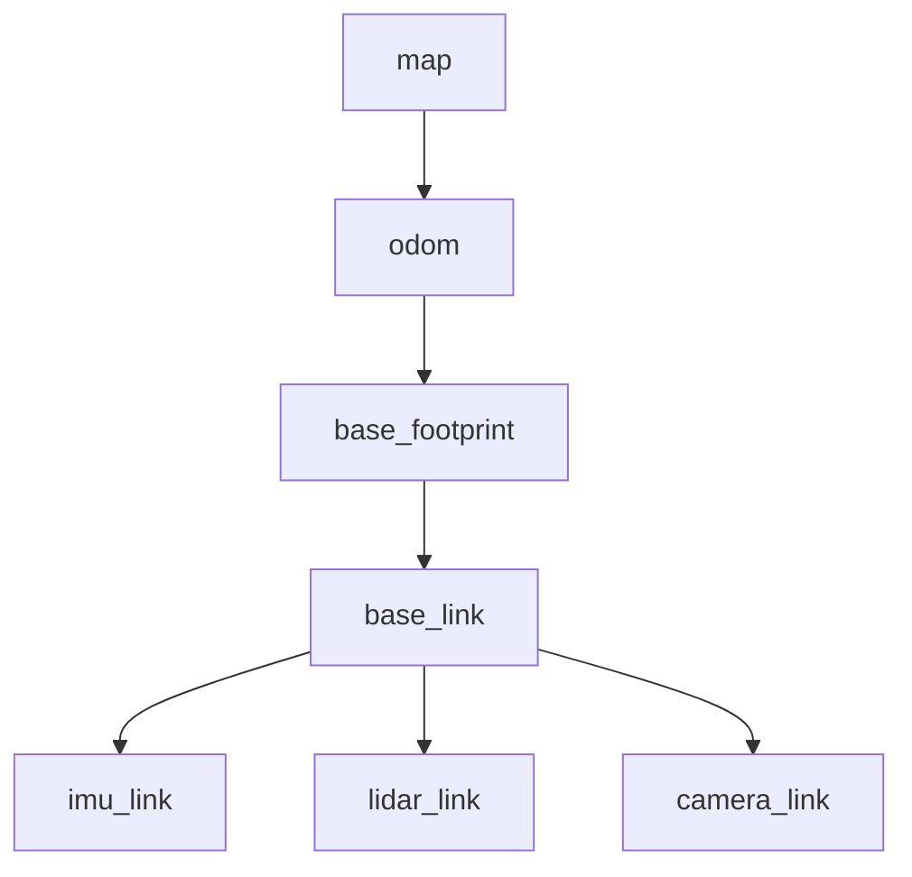
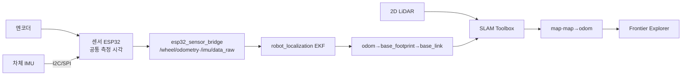
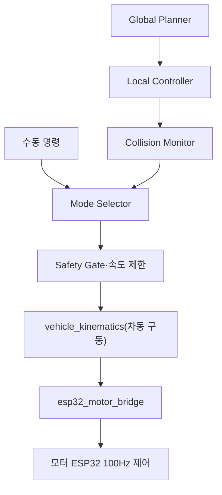
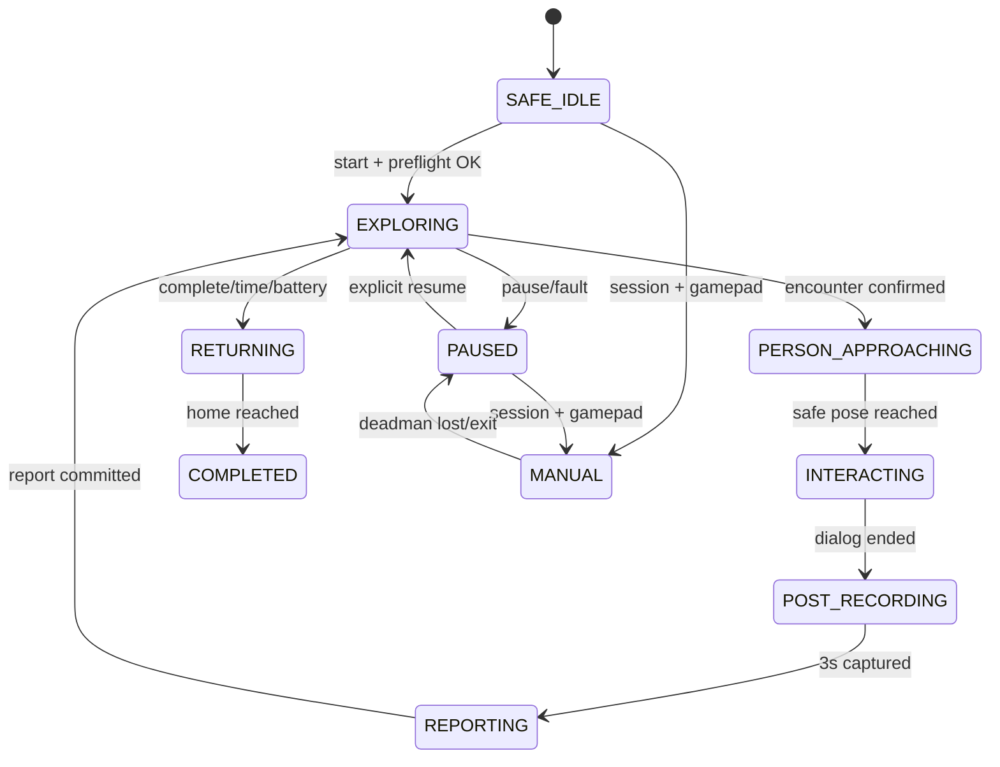
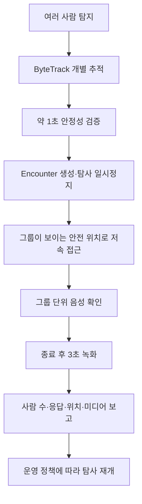
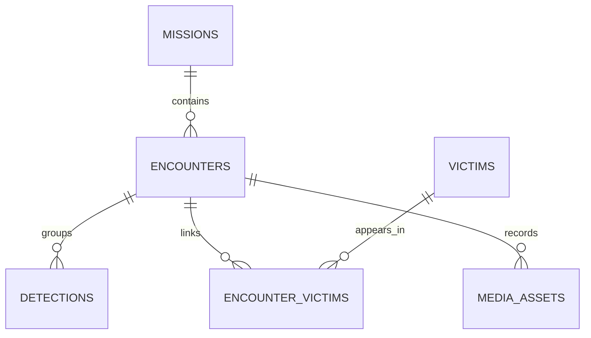
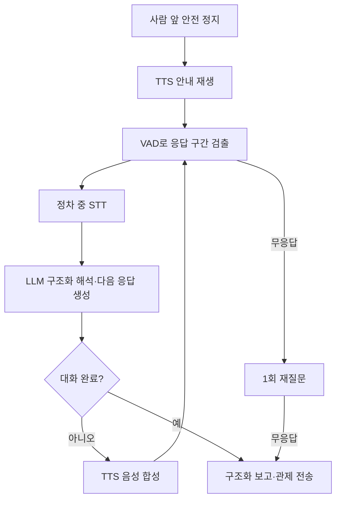

> Sentinel UGV 통합 명세서 v1.1의 일부 — 문서 규칙·버전·변경 이력은 [README](README.md) 참조

# 8. ROS2 자율주행 및 탐사 설계 [확정]

> 이 장은 요약이다. 규범(상세)은 22장(센서 수집·시간 동기화·좌표계), 23장(SLAM·위치 추정·Frontier 탐사), 24장(Nav2 경로 계획·안전 속도), 34장(ESP32 저수준 제어·안전 체인)이다. 단, 8.2 전체 노드 구성 표와 8.3 TF 트리, 아래 탐사 종료·복귀 세부 조건은 문서에서 이 장이 기준이다.

**핵심 결정**

| 항목 | 결정 | 상세 |
|---|---|---|
| 처리 파이프라인 | 센서(camera·/scan·엔코더) → TF → slam_toolbox **[구현]** → EKF·frontier_explorer·Nav2 → 안전 제한(collision_monitor·command_mux·velocity_smoother·safety_gate) → vehicle_kinematics(차동 구동) **[미구현, 8.2]** → BTS7960 ×2(BMW M7 후륜 좌·우 RS540 ×2, 전방 수동 캐스터 ×2) **[구현]**. IMU 는 부품 미확정(TBD-HW-012)이라 `/imu/data_raw` 발행이 없고 EKF 도 아직 붙지 않았다 — 지금은 휠 오도메트리만 쓴다 | 23.1, 34-3, 8.2 |
| Frontier 탐사 | Occupancy Grid에서 자유/미지 경계 셀을 군집화하고, 도달 가능 후보만 남긴 뒤 거리·예상 정보량·장애물 여유·방문 이력으로 점수화해 최고 점수 후보를 Nav2 목표로 전송한다. 사람 위치를 사전에 알 수 없으므로 "사람 찾기"는 접근 가능한 미지 영역을 빠짐없이 관찰하는 탐사 정책으로 구현한다 | 23.3 |
| 탐사 종료·복귀 | 도달 가능한 Frontier가 10초간 발견되지 않으면 일시정지하고, 제자리 회전 또는 짧은 전·후진 재관측 기동으로 LiDAR 재스캔을 수행한다. 재스캔 후에도 Frontier가 없으면 탐사 완료로 판단한다. 최대 탐사 시간 7분과 사용자 종료도 종료 조건이다. **배터리 기반 종료는 v2.0 에서 폐기했다**(14.6 — 계측 센서가 없다). 종료 시 mission_manager가 저장한 home pose를 Nav2 목표로 전송하고, 복귀 경로 생성 실패 시 PAUSED로 전환해 관제에 복구 요청을 표시한다 | 23.4~23.5 |
| 오도메트리·보정 | 후륜 좌·우 RS540 구동계 엔코더와 차체 IMU를 센서 ESP32가 같은 monotonic 시계로 취득해 Jetson에 전달한다. Jetson은 좌·우 바퀴 속도로 차동 구동 wheel odometry를 계산하고 IMU yaw rate와 EKF로 융합한 뒤 LiDAR SLAM의 `map→odom` 보정으로 누적 오차를 줄인다. 트랙폭 `W`와 좌·우 거리 스케일·최대 각속도는 실측 후 확정값으로 사용한다 | 23.2, 35장 |
| 모터 명령 안전 체인 | 자율(Nav2)·수동(게임패드) 명령 모두 collision_monitor → command_mux → velocity_smoother → safety_gate → vehicle_kinematics(차동 구동) → esp32_motor_bridge를 거쳐 모터 ESP32 내부 100Hz 제어(Jetson과는 50Hz 명령·상태 교환)·300ms watchdog로 실행한다. 엔코더 피드백은 센서 ESP32→Jetson 경로로 결합한다(TBD-HW-011) | 34장(규범), 24.1 |

## 8.2 ROS2 노드 구성

**실행 파일 이름은 리포가 근거다** (`jetson/ros2_ws/src/*/setup.py`의 `console_scripts`, `ai/*/src`). v2.0에서 구현 상태 열을 추가하고 실제 이름으로 맞췄다 — 없는 노드를 있는 것처럼 적어 두면 통합 검사에서 "왜 안 뜨나"를 매번 다시 조사한다.

`ai/detection`과 `ai/stt`는 **`ros2_ws` 밖에 있다.** 각자 독립 파이썬 패키지이고 ROS 진입점만 따로 둔다. 이 표에서 ROS 노드처럼 보이지만 패키지 경계가 다르다.

| **노드/실행 파일** | **역할** | **주요 입출력** | **상태** |
|---|---|---|---|
| `ydlidar_ros2_driver_node` | YDLIDAR X4 Pro 드라이버 | `/scan` | 구현 |
| `usb_cam_node` | BRIO 100 단일 오픈·MJPEG 패스스루 | `/camera/image_raw/compressed` | 구현(외부 패키지) |
| `slam_toolbox` (`async_slam_toolbox_node`) | 지도 생성·위치 추정 | `/map`, `/pose`, `/tf` | 구현 |
| `esp32_motor_bridge` | 좌·우 구동 명령 전송, 모터 상태 중계 | `~/drive_command`(JSON String) 수신, `~/drive_state`, `~/command_ack`, `/diagnostics` | 구현 |
| `esp32_sensor_bridge` | 엔코더·초음파·DHT11 상태 중계, 휠 오도메트리 정운동학 | `/wheel/odometry`, `/range/front`, `/proximity/protective_stop`, `/environment/temperature`, `/environment/relative_humidity`, `/diagnostics` | 구현 |
| `mission_manager` | 상태 머신·home pose·종료 조건 | `/mission/status`, `/mission/signal`, `/mission/command_result`, `/perception/encounter` | 구현 |
| `cloud_bridge` | ROS 상태를 EC2로 전달 (presence·state·telemetry) | MQTT/WSS | 구현 |
| `recording_manager` | 3초 링 버퍼·이벤트 녹화 상태 머신 | 로컬 파일 | 구현 |
| `media_uploader` | 미디어 S3 업로드 큐 | `/api/v1/media/uploads` | 구현 |
| `map_saver` / `map_uploader` | 임무 종료 시 지도 저장·업로드 | `/slam_toolbox/save_map`, `/map_uploader/registered` | 구현 |
| `stream_pipeline` | MJPEG 디코딩·x264 인코딩·MediaMTX 송출 | `/camera/image_raw/compressed` → RTSP | 구현 |
| `ai/detection/src/ros_main.py` | 추가 학습 YOLO26n Detect·Pose 기반 사람 탐지 | `/camera/image_raw/compressed` → `/perception/person_candidates` | 구현(`ros2_ws` 밖) |
| `ai/stt` | STT·LLM·TTS 단계 조정과 구조화 결과 생성 | `/interaction/report` | 구현(`ros2_ws` 밖) |
| `foxglove_bridge` | 시각화 WebSocket (TLS·읽기 전용) | `/map`, `/pose`, `/scan`, `/tf`, `/tf_static`, `/robot_description` | 구현(외부 패키지, 8.5) |
| `vehicle_kinematics` | v/ω ↔ 좌·우 구동 속도 변환(차동 구동) | `/cmd_vel` → `esp32_motor_bridge/drive_command` | **미구현** (S15P11A301-234) |
| `command_mux` | 자율/수동/정지 우선순위 처리 | `/cmd_vel_nav`·`/cmd_vel_manual` → `/cmd_vel` | **미구현** (S15P11A301-237) |
| `collision_monitor` | 근거리 충돌 방지 | `/cmd_vel_safe` | **미구현** (S15P11A301-237, `nav2_collision_monitor` 설치됨) |
| `velocity_smoother` | 가감속·최대 속도 제한 | `/cmd_vel_smoothed` | **미구현** (S15P11A301-237, `nav2_velocity_smoother` 설치됨) |
| `safety_gate` | 명령 TTL watchdog·최종 게이트 | `/cmd_vel_final` | **미구현** (S15P11A301-237) |
| `nav2_stack` | 경로 계획·제어·복구 | `/cmd_vel_nav` | **미구현** (S15P11A301-235, `navigation2 1.1.20` 설치됨) |
| `frontier_explorer` | 미탐사 목표 생성 | `NavigateToPose` goal | **미구현** (S15P11A301-172) |
| `ekf_node` | 엔코더+IMU 융합 | `/odometry/filtered` | **미구현** (S15P11A301-236, `robot_localization 3.5.4` 설치됨) |
| `human_localizer` | 카메라 방위각+LiDAR 거리+TF로 map 좌표 계산 | `/human_observations` | **미구현** |

### 미구현 노드가 만드는 갭

**`/cmd_vel`을 소비하는 노드가 하나도 없다.** 워크스페이스 전체에서 `cmd_vel` 언급은 `esp32_bridge/package.xml`의 설명문 1건뿐이고, 거기서 책임을 위임한 `sentinel_drive`·`sentinel_safety`·`sentinel_exploration`은 README만 있는 빈 패키지다.

따라서 현재 로봇은 **자율주행도 관제 웹의 수동 조종도 모터까지 도달하지 못한다.** 관제 START로 `EXPLORING`에 들어가도 움직이지 않는다. 순서상 `vehicle_kinematics`(S15P11A301-234)가 직렬 관문이고, 그 위에서 Nav2·EKF·안전 체인·탐사가 병렬로 진행된다.

### 폐기한 노드 이름

v1.1까지 쓰던 이름 중 실제와 다른 것들이다. 검색 시 혼동을 막기 위해 남긴다.

| v1.1 이름 | v2.0 |
|---|---|
| `ydlidar_node` | `ydlidar_ros2_driver_node` |
| `camera_capture_node` | `usb_cam_node` (외부 패키지) |
| `yolo_inference_node` | `ai/detection` 내부 모듈 (독립 노드가 아니다) |
| `telemetry_bridge_node` | `cloud_bridge` 가 겸한다 |
| `media_recorder_node` | `recording_manager` + `media_uploader` 로 분리됐다 |
| `voice_interaction_node` | `ai/stt` |

## 8.3 TF 트리
TF 운용 규칙(dynamic/static 구분, 시각 지연 검증)의 규범은 22.3장이며, 아래는 휠 링크를 포함한 전체 트리이다.

```text
map
└─ odom
   └─ base_footprint
      └─ base_link
         ├─ imu_link
         ├─ rear_left_wheel_link
         ├─ rear_right_wheel_link
         ├─ front_left_wheel_link
         ├─ front_right_wheel_link
         ├─ lidar_link
         └─ camera_link
```

- `odom → base_footprint → base_link`는 ROS 표준 관례(REP-105/120)를 따른다. `base_footprint`는 지면 투영, `base_link`는 차체 기준이다.
- **v2.0: `imu_link`는 URDF에 있으나 그 링크로 데이터를 내는 노드가 없다.** IMU 부품이 TBD-HW-012에서 미확정이다.
- **v2.0: `odom → base_footprint` 발행자는 정확히 하나여야 한다.** 지금은 `esp32_sensor_bridge`가 내고(`publish_odom_tf`), SLAM 의 정적 대체 발행과 `NotSubstitution` 으로 배타 처리한다(S15P11A301-222). `ekf_node`가 붙으면 EKF 가 내고 브리지 쪽을 끈다.
- **v2.0: `sentinel.urdf`에 시각 형상(visual geometry)이 없다.** 의도된 것이며, 그래서 Foxglove 의 URDF 레이어는 아무것도 그리지 않는다. 차체 치수는 TBD-HW-006 실측 후 반영한다.
- 짐벌은 미사용 확정(6.4)이므로 `lidar_link`·`camera_link`는 `base_link`의 자식이며 **static TF**만 발행한다. 동적 관절각·joint_state는 없다.

**상세 장 포인터**

- 센서별 처리·시간 정책·센서 품질 게이트: 22장
- SLAM 파이프라인·위치 추정 단계·Frontier 점수화·실패 복구: 23장
- Nav2 플래너 선정·속도 정책(자율 0.25m/s, 접근 0.10m/s)·장애물 구역·수동 조작 안전: 24장
- Jetson↔ESP32 안전 명령 체인·명령 수락 조건·watchdog: 34장

## 8.4 ROS 그래프 격리 (v2.0 신설, S15P11A301-218)

**DDS 디스커버리는 같은 LAN 안에서 도메인 ID 단위로 멀티캐스트한다.** 같은 망에 다른 팀의 ROS 2 그래프가 있으면 서로의 노드·토픽이 그대로 섞인다. 실제로 외부 노드 37개가 우리 그래프에 보였고, 그 상태에서는 `ros2 node list`로 우리 노드 생존을 판정할 수 없다.

격리 값은 **`scripts/ros_env.sh` 한 곳에만** 둔다. 스크립트마다 복사하면 두 곳이 어긋나고, 어긋나면 노드들이 서로를 못 본 채 조용히 돈다 — 화면에는 "토픽이 안 온다"만 남는다.

```bash
export ROS_LOCALHOST_ONLY=1   # 물리적 격리. 같은 기기 안에서만 통신한다
export ROS_DOMAIN_ID=97       # 규약적 격리. 0~101 범위여야 한다
```

- `ROS_LOCALHOST_ONLY=1`이 **물리적 격리**다. 도메인 ID는 규약일 뿐이라 남이 같은 번호를 쓰면 다시 섞인다.
- 도메인 ID는 **0~101**을 쓴다. 그 위 값은 리눅스 ephemeral 포트 범위와 충돌한다.
- 젯슨과 노트북을 나눠 쓰는 구성으로 바꿀 때는 `ROS_LOCALHOST_ONLY`를 끄고 도메인 ID만 남긴다. 그때 격리 강도가 내려가는 것을 인지해야 한다.

## 8.5 시각화 경로 (v2.0 신설, S15P11A301-216·221·224·233)

RViz 대신 **`foxglove_bridge`**를 쓴다. 젯슨에 디스플레이가 없고, 브릿지는 WebSocket 하나만 열면 노트북 브라우저에서 바로 본다. RViz를 쓰려면 X 전달이나 원격 데스크톱이 필요하다.

```text
접속       wss://jetson.sentinel-ugv.xyz:8765
연결 유형   Foxglove WebSocket   (Rosbridge 를 고르면 핸드셰이크가 깨진다)
서브프로토콜 foxglove.sdk.v1     (foxglove.websocket.v1 은 HTTP 400)
```

**`ws://`가 아니다.** TLS를 켜 두었으므로 평문으로 붙으면 서버가 핸드셰이크를 기다리다 끊고, Foxglove에는 `No details provided`만 남는다 — 원인이 어디에도 적히지 않는다. 켜고 끄는 절차와 3D 패널 설정은 `scripts/README.md`가 규범이다.

### 노출 범위와 수락한 위험

| 항목 | 설정 |
|---|---|
| TLS | `tls: true`, `~/.config/sentinel/certs/server.{crt,key}` |
| 쓰기 | 차단. `capabilities: [connectionGraph]` — 파라미터 변경·서비스 호출 불가 |
| 토픽 | `/map` `/pose` `/scan` `/tf` `/tf_static` `/robot_description` 6개 화이트리스트 |
| 읽기 인증 | **없다** |

젯슨이 **공인 IP**에 있어 LAN과 인터넷이 같은 인터페이스다. "LAN에서만 열기"라는 선택지가 없으므로, 위 6개 토픽은 브릿지가 떠 있는 동안 인터넷에서 누구나 읽을 수 있다. **명시적으로 수락한 위험**이며, 그래서 볼 때만 켜고 보고 나면 `viz_down.sh`로 끈다. 외부에 아예 열지 않으려면 `viz_up.sh --local`로 켜고 SSH 터널로 본다(그 경우만 `ws://`다 — 인증서가 도메인 이름으로 발급되어 `wss://localhost`는 이름이 맞지 않는다).

## 8.6 관제 웹의 실시간 지도 (v2.0 신설, S15P11A301-227)

**v1.1의 전제가 깨졌다.** v1.1은 "점유격자를 실시간으로 관제까지 보내는 계약이 없다"를 전제로 지도를 임무 종료 후 PGM 조회로만 규정했다. 그러나 경로가 이미 있었다 — `foxglove_bridge`가 `/map`·`/pose`를 WebSocket으로 내보내고 있었고, 관제 웹이 거기에 **직접** 붙는다.

```text
젯슨 slam_toolbox  →  foxglove_bridge (wss)  →  관제 웹 브라우저
                                                (백엔드를 거치지 않는다)
```

백엔드를 거치지 않는 이유는 telemetry 스키마에 격자 필드가 없고 지도 조회 API는 임무 종료 후 PGM뿐이어서, 그 둘로는 실시간이 되지 않기 때문이다.

- 브라우저가 CDR을 직접 디코딩한다(`frontend/lib/cdr.ts`, `occupancyGrid.ts`, `robotPose.ts`). `@foxglove/ws-protocol`은 쓰지 않는다 — 서브프로토콜이 다르다.
- 값 체계가 임무 이력 지도와 다르다. 라이브는 nav2 `int8`(−1 미탐색, 0~100 확률), 저장본은 PGM 바이트(0 점유, 254 자유, 205 미탐색)다. **판정 함수는 따로 두고 색과 좌표 변환은 공유한다**(`palette.ts`, `gridGeometry.ts`) — 규칙이 갈라지면 두 화면의 로봇 위치가 서로 반대로 찍힌다.
- **같은 네트워크에서만 보인다.** 영상(WHEP)이 이미 같은 제약이고 시연을 LAN 기준으로 정했다.


# 9. AI 인식 및 센서 융합 [확정]

> 이 장은 요약이다. 사람 탐지·추적·위치 추정과 조건부 Pose의 규범(상세)은 25장이고, 카메라 파이프라인 구현 상세는 32-3장이다.

**핵심 결정**

| 결정 | 내용 | 상세 |
|---|---|---|
| AI 역할 분리 | 사람 탐지는 추가 학습 YOLO26n Detect(상시 약 15FPS), 자세 보조 판정은 YOLO26n Pose 조건부 실행(사람 3프레임 이상 연속 감지 시 활성, 약 2FPS, 동일 자세 약 1.5초 유지 시 이벤트, 3초 미감지 시 중단). 일반 객체 분류는 YOLO COCO 클래스로 핵심 MVP가 아니며 필요 클래스만 유지한다 | 25.6 |
| AI 비의존 안전 | 물리 장애물 회피는 LiDAR/Nav2가, 급정지는 Collision Monitor/초음파가 담당해 AI 추론 실패와 무관하게 로컬 안전을 확보한다. COCO에 없는 물체도 거리 기반으로 처리한다 | — |
| 사람 탐지 이벤트 판정 | person confidence ≥ threshold AND ByteTrack 약 1초 안정 관측 → 탐사 일시정지·encounter 후보 생성 → 사람 중심 방향각 계산 → 동일 방향 LiDAR 거리 탐색 → lidar_link→map TF 변환 → 기존 victim·encounter와 공간·시간 중복 검사 → 안전 접근·음성 상호작용 상태 머신 시작 | 25.1~25.2 |
| 중복 이벤트 제거 | 기존 위치 1m 이내 AND 최근 15초 이내 재탐지는 동일 구조 대상 이벤트로 판단한다. 동일 trackId 지속 시 last_seen·최대 confidence·관측 횟수를 갱신하고, 위치 추정 실패가 반복되면 새 이벤트를 남발하지 않고 미확정 관측 수만 증가시킨다. 15초 이후 또는 1m 초과면 새 이벤트 후보를 생성한다 | 25.4 |
| AI 성능 목표 | 카메라 입력 1280×720 MJPEG 29.93FPS 확인(ROS 2·LiDAR 동시 구동 검증), 추론 입력 640 계열(필요 시 512/416으로 축소), 추론 주기 Detect 상시 약 15FPS·Pose 조건부 약 2FPS(활성 시 추론 부하 약 20~30% 추가, 주행 부하에 따라 frame skip), 관제 영상 캡처 29.93FPS·인코딩 출력 15FPS 목표(CPU 부하 시 15FPS 우선), 모델은 추가 학습 YOLO26n Detect·Pose로 학습 가중치와 TensorRT 엔진을 비교한다 | 25.5 |
| 신뢰도 threshold | 초기값 0.60(35-10장). 복도 오탐/미탐 균형으로 최종값 실험 확정 → TBD-CAL-001 | 35-10장 |

## 9.3 지도상 사람 위치 추정
Bounding Box 중심 x좌표와 카메라 수평 시야각을 이용해 카메라 기준 방위각을 계산한다. 같은 방위각 주변의 LiDAR 거리값 중 유효한 값을 선택하고, lidar_link 좌표를 생성한 후 TF2를 사용해 map 좌표로 변환한다. 복도 시연에서는 사람 다리 또는 몸통 높이에서 2D LiDAR가 반사되는 것을 전제로 한다.

- 위치 품질 라벨은 3단계로 통일한다: **MEASURED**(LiDAR 직접 측정 성공), **ESTIMATED**(직접 측정 실패, bbox 크기 등 간접 추정치만 존재), **UNKNOWN**(추정 불가, 영상 알림만 제공). 25.3장도 동일 체계를 사용한다.
- 여러 물체가 겹치면 중앙값·최소값·클러스터 기반 거리 선택을 비교한다.
- 정확도보다 "지도에서 대략적인 구조 대상 위치를 표시"하는 MVP 목표를 우선한다.

광선 계산·인접 beam median·covariance(quality) 저장·ESTIMATED 위치 갱신 등 절차 상세는 25.3장을 따른다.

## 9.6 카메라 단일 오픈 원칙
AI 프로세스와 스트리밍 프로세스가 BRIO 100을 각각 직접 열지 않는다. `usb_cam` 노드가 카메라를 한 번만 열고 디코딩 없이 MJPEG를 `/camera/image_raw/compressed`로 발행하며, YOLO 추론·WebRTC 스트리밍·이벤트 버퍼는 이 토픽을 구독해 각자 NVJPG 하드웨어로 디코딩한다. 이는 장치 점유 충돌과 비압축 프레임의 DDS 전송 부하를 줄이기 위한 원칙이다. 분기 구조와 큐 정책 등 구현 상세는 32-3장을 따른다.

사람 탐지 확정 규칙·거리 추정 절차·다중 인원 처리·성능 측정 지표·조건부 Pose 실행 구조의 규범은 25장(조건부 Pose는 25.6장)을 따른다.

# 14. 상태 머신 및 안전 정책 [확정]

> 이 장은 요약이다. 임무 상태 정의(14.1)와 상태 전이(14.2)의 규범(상세)은 **26장(Mission Manager·임무 상태 머신 상세 설계)** 이다. 단, 14.3~14.7(시작 전 점검·안전 우선순위·장애별 정책·배터리 정책[폐기]·종료 안전)은 이 장이 고유 규범이다.

핵심 결정:

- 임무 상태는 12개로 확정한다(26.2): `SAFE_IDLE`, `EXPLORING`, `PERSON_APPROACHING`, `INTERACTING`, `POST_RECORDING`, `REPORTING`, `PAUSED`, `MANUAL`, `RETURNING`, `COMPLETED`, `ESTOP`, `ERROR`.
- `OFFLINE`은 서버가 관측한 연결 상태이며 Jetson 내부 임무 상태로 사용하지 않는다.
- MANUAL 진입은 SAFE_IDLE 또는 PAUSED에서만 허용하고, 주행 중 수동 전환은 PAUSED를 자동 경유한다(14.2, 26.3).
- 안전 우선순위 최상위는 물리 E-Stop이며(14.4), watchdog 300ms(14.7)를 적용한다. **배터리 정책은 v2.0 에서 폐기했다**(14.6).

## 14.1 로봇 상태

상태 정의의 규범은 **26.2**다. 12개 상태명은 다음과 같다.

`SAFE_IDLE`(초기화 완료, 명시적 시작 대기) · `EXPLORING`(Frontier 기반 탐사) · `PERSON_APPROACHING`(피해자 그룹 관측 위치로 저속 접근) · `INTERACTING`(피해자 음성 확인, 정지) · `POST_RECORDING`(상호작용 종료 후 3초 녹화) · `REPORTING`(encounter·피해자·미디어 로컬 저장·보고) · `PAUSED`(탐사/복귀 일시정지) · `MANUAL`(게임패드 수동 조종, deadman) · `RETURNING`(home pose 복귀) · `COMPLETED`(임무 정상 종료) · `ESTOP`(비상 정지 latch) · `ERROR`(핵심 센서·제어 오류)

각 상태의 설명·이동(모터) 허용 조건은 26.2 표를 따른다.

## 14.2 상태 전환

전이도의 규범은 **26.3**(mermaid 전이도)이다. 요약 수준에서 지켜야 할 핵심 규칙:

- MANUAL 진입은 **SAFE_IDLE 또는 PAUSED에서만** 허용한다. 주행 중(EXPLORING) 수동 전환 요청은 자동 일시정지(→PAUSED)를 거친 뒤 MANUAL로 진입한다. UI의 "수동" 버튼 하나가 이 2단 전이를 내부적으로 처리한다.
- MANUAL 종료(수동종료·조이스틱 해제) 시 항상 PAUSED로 복귀하며, 탐사 재개는 반드시 운영자의 명시적 재개 명령으로만 이루어진다(자동 재출발 금지, SR-008과 동일 원칙). 26.3과 동일 규칙이다.
- 모든 상태에서 E-Stop은 ESTOP으로 전환하고, ESTOP 해제는 안전 확인 후 SAFE_IDLE 또는 PAUSED로 복귀한다.
- REPORTING(로컬 저장 완료) 후 EXPLORING 또는 PAUSED로 복귀하고, RETURNING 경로 실패 시 PAUSED/ERROR로 전환한다.

## 14.3 시작 전 점검
| **분류** | **항목**                                                                 | **실패 시**            |
|----------|--------------------------------------------------------------------------|------------------------|
| 필수     | Jetson, ESP32 handshake(모터·센서 2채널), LiDAR, 카메라, 모터 드라이버, 엔코더, 전방 초음파, SLAM, E-Stop | 바닥 자율 탐사 시작 차단 |
| 보조     | 온습도, EC2, S3, 원격 스트림                                             | 경고 후 로컬 탐사 가능 |

> **v2.0: 필수 목록에서 배터리·차체 IMU·Nav2 를 뺐다.**
>
> - 배터리 — 계측 센서가 없어 점검 자체가 불가능하다(14.6 폐기)
> - 차체 IMU — 부품이 미확정이고(TBD-HW-012) `/imu/data_raw` 발행이 없다. 붙으면 다시 넣는다
> - Nav2 — 아직 구성되지 않았다(8.2). 구성 후 다시 넣는다
>
> 점검 목록에 없는 것을 두면 시작 차단 로직이 영원히 통과하지 못하거나, 반대로
> 점검을 건너뛰게 만든다. **점검할 수 있는 것만 필수에 둔다.**

## 14.4 안전 우선순위
| **우선순위** | **제어원**                           |
|--------------|--------------------------------------|
| 1            | 물리 E-Stop 및 모터 전원 차단        |
| 2            | ESP32 fault·통신 watchdog·IWDT/TWDT  |
| 3            | 모터 드라이버 오류/하드웨어 fault    |
| 4            | Collision Monitor·초음파 근거리 정지 |
| 5            | 소프트웨어 E-Stop                    |
| 6            | 수동 게임패드 명령                   |
| 7            | 피해자 접근·자동 복귀·자율 탐사      |

## 14.5 장애별 정책
| **장애**        | **자율 탐사**                | **수동 조종**            | **저장/알림** |
|-----------------|------------------------------|--------------------------|---------------|
| EC2 연결 단절   | 계속                         | 즉시 정지                | 로컬 큐 저장  |
| S3 연결 단절    | 계속                         | 계속                     | pending 파일  |
| 로컬 영상 실패  | 계속                         | 조종 제한 검토           | REMOTE 전환   |
| LiDAR 단절      | 즉시 정지                    | 저속 수동만 또는 금지    | 치명 오류     |
| 오도메트리 이상 | PAUSED/ERROR                 | 저속 수동 가능 검토      | 오류 이벤트   |
| ESP32/모터 응답 없음 | 300ms 내 정지·ERROR/ESTOP | 불가                     | 치명 오류     |
| 전방 초음파 단절 | PAUSED 또는 검증된 제한 속도 | 저속 수동만 검토 | 안전 센서 경고 |
| 카메라 단절     | 탐사 가능하나 사람 탐지 중단 | 영상 없는 수동 금지 권장 | 경고          |
| 온습도 단절     | 계속                         | 계속                     | 경고          |
| Jetson 과열     | 감속/복귀/정지               | 정지                     | 임계값 기록   |

## 14.6 배터리 정책 [v2.0 폐기]

**배터리 기반 안전·종료 기능을 프로젝트에서 제외한다.**

계측 경로가 하드웨어에 없다. 모터 전원(유아전동차 내장 12V)과 Jetson 전원(대용량 보조배터리)이 완전히 분리돼 있고(21.4) 어느 쪽에도 전압·전류 센서가 붙어 있지 않다. 02장의 전압·전류 센서는 **권장** 항목이며 장착하지 않았다.

센서가 없으면 잔량을 알 수 없고, 알 수 없는 값으로 주행을 중단시키는 판정은 만들 수 없다. 임계값만 문서에 적어 두면 **없는 안전장치를 있다고 믿게 된다** — 이것이 폐기하는 이유다.

폐기 범위:

| 폐기 항목 | 원래 규정 |
|---|---|
| 잔량 30% 경고 / 20% RETURNING / 10% 안전 정지 | 14.6 |
| 배터리 20% 이하 탐사 종료 조건 | 8.1 탐사 종료·복귀, 23.4 |
| `/battery_state` 토픽 (1~2Hz) | 22.2 센서 수집 |
| 관제 화면 배터리 표시 | 11.5 (S15P11A301-223 에서 이미 제거) |
| 저전압 복귀 (R-09 완화책) | 01장 위험 관리 |

**탐사 종료 조건은 둘로 줄어든다** — 도달 가능한 Frontier 소진(재관측 기동 후에도 없음), 그리고 최대 탐사 시간 7분 또는 운영자 종료. 시연이 7분 안에 끝나고 배터리는 시연 전에 충전하는 운영으로 대체한다(38장 시연 체크리스트의 "배터리 충전 및 전압" 항목).

**과열 보호는 남는다.** Jetson 온도는 실제로 읽을 수 있고(`/sys/devices/virtual/thermal`) telemetry 에 이미 실려 있다. 14.5 의 과열 대응(감속/복귀/정지)은 유효하다.

되살리려면 전압 센서 장착이 선행이다(TBD-HW-003). 그때 이 절을 다시 쓴다.

## 14.7 프로그램 종료 안전
- 모든 모터 제어 코드는 try/except/finally와 SIGINT/SIGTERM 종료 처리를 포함한다.
- 노드 종료 시 마지막 명령과 관계없이 0 속도를 전송한다.
- Jetson Safety Gate와 ESP32 통신 watchdog은 각각 300ms 동안 유효 명령이 없으면 정지한다.
- ESP32 부팅·재부팅 중 PWM 0과 모터 드라이버 비활성화를 기본 상태로 둔다.
- E-Stop 해제는 주변 안전 확인 팝업과 물리 상태 확인 후 수행한다.

임무 상태 머신의 단일 권한 원칙·상태 정의·전이도·명령 멱등성·이벤트 우선순위 상세는 26장을 따른다.

# 22. 센서 수집·시간 동기화·좌표계 상세 설계

## 22.1 핵심 원칙

SLAM, 사람 위치 추정, 영상 이벤트를 같은 사건으로 연결하려면 센서 데이터의 **좌표계와 시각**이 일치해야 한다. 모든 데이터는 ROS 2 timestamp를 포함하고, 기록용 wall clock과 제어용 monotonic clock을 구분한다.

## 22.2 센서별 처리

| 센서 | ROS 2 출력 | 권장 주기 | 핵심 검증 | 실패 영향 |
|---|---|---:|---|---|
| 2D LiDAR | `/scan` | 약 11.03Hz 실측 | X4 Pro, 128000bps, 약 1222~1231 points/scan, `lidar_link`, 0.1~12.0m, drop | 자율주행 중단 |
| 카메라 | `/camera/image_raw` 또는 공유 프레임 버스 | 29.93 FPS 캡처 실측 | 1280×720 MJPEG, ROS 2 동시 구동·지연·단일 open | 사람 탐지·수동 영상 제한 |
| 차체 IMU(센서 ESP32 경유) | `/imu/data_raw` | 50~100Hz | `imu_link`, rad/s·m/s², bias, ESP32 측정 timestamp·sequence, stale/NaN | 오도메트리 품질 저하 또는 AUTO 중지 |
| 구동 엔코더(좌·우) | `/wheel/odometry` | 50Hz 이상 | 좌·우 부호·tick·overflow·속도 | 위치 추정 실패 |
| 전방 초음파 | `/range/front` | 10~20Hz | 유효 거리·timeout·실차 정지거리 | ESP32 보호 정지, 단절 시 PAUSED/제한 |
| DHT11 온습도 | `/environment` | 0.5~1Hz | checksum·범위·센서 끊김 | 경고만 발생 |
| ~~배터리~~ | ~~`/battery_state`~~ | — | — | **v2.0 폐기 (14.6).** 전압·전류 센서를 장착하지 않았다 |

## 22.3 TF 좌표계



- `map → odom`: SLAM Toolbox가 전역 보정을 제공한다.
- `odom → base_footprint`: 엔코더·IMU EKF가 연속적인 로컬 자세를 제공한다.
- 짐벌은 미사용 확정(6.4장)이므로 `lidar_link`·`camera_link`는 `base_link`의 자식이며 **static TF**만 사용한다.
- 고정 센서(IMU 등)도 static TF를 사용한다.
- TF가 미래 시각이거나 허용 지연을 넘으면 사람 map 좌표 확정을 보류한다.

## 22.4 시간 정책

| 목적 | 시계 | 이유 |
|---|---|---|
| 이벤트·영상·DB 정렬 | UTC wall clock | Jetson·EC2 간 비교 가능 |
| 명령 TTL·watchdog | monotonic clock | NTP 보정이나 시간 점프 영향 방지 |
| 파일명·로그 | UTC + missionId | 시간대 혼동과 충돌 방지 |

Jetson은 chrony/NTP로 시각을 동기화한다. 메시지에는 `occurredAt`과 서버의 `receivedAt`을 분리해 기록하며, 시간 오차가 임계값을 넘으면 관제에 경고한다.

## 22.5 센서 품질 게이트

센서 메시지가 존재한다는 이유만으로 정상으로 판정하지 않는다.

```text
최근 수신 시각
+ 실제 주기
+ 값 범위
+ frame_id
+ timestamp 지연
+ 변화량/고정값 여부
→ OK / DEGRADED / FAILED
```

LiDAR, 엔코더, ESP32(모터·센서), E-Stop, TF가 FAILED이면 자율 임무를 시작할 수 없다. 카메라가 FAILED이면 사람 탐지와 영상 기반 수동 조종을 차단하되 저속 지도 탐사 허용 여부는 운영자가 결정한다.

# 23. SLAM·위치 추정·미지 영역 탐사 상세 설계

## 23.1 권장 파이프라인



## 23.2 위치 추정 단계

1. 센서 ESP32가 구동축 좌·우 엔코더 tick·속도, 차체 IMU 원시 gyro·accel을 공통 monotonic 측정 시각과 sequence로 제공한다.
2. Jetson이 차동 구동 운동학(좌·우 바퀴 속도와 트랙폭 `W`)으로 wheel odometry를 계산한다.
3. Jetson sensor bridge가 `/imu/data_raw`(`sensor_msgs/Imu`, `frame_id=imu_link`)를 발행하고, EKF가 wheel odometry와 IMU yaw rate를 융합한다.
4. SLAM Toolbox가 LiDAR scan matching으로 누적 오차를 보정한다.
5. Mission Manager는 TF 연속성과 covariance를 감시한다.

차동 구동은 좌·우 바퀴 속도만으로 오도메트리를 구하므로 조향각 상태가 필요 없다. 직선 거리 스케일(좌·우 개별), 트랙폭 `W`, 명령 각속도 대비 실제 yaw rate 스케일을 실측해 보정한다. 제자리 회전·저속에서 바퀴 미끄럼이 크면 wheel odometry covariance를 보수적으로 설정하고 IMU yaw rate 가중을 높인다.

## 23.3 Frontier 선택

Frontier는 탐색된 자유 공간과 미탐색 공간의 경계다. 후보는 다음 기준으로 점수화한다.

```text
score = 정보이득 가중치 × 예상 신규 면적
      - 이동비용 가중치 × 경로 길이
      - 위험도 가중치 × 좁은 통로·장애물 근접도
      - 실패이력 가중치 × 최근 실패 횟수
```

| 필터 | 규칙 |
|---|---|
| 크기 | 너무 작은 Frontier 제거 |
| 접근성 | Nav2 global plan 생성 불가 후보 제거 |
| 안전거리 | 벽·장애물 inflation 영역 내부 제거 |
| 반복 실패 | 동일 후보 N회 실패 시 cooldown |
| 사람 상호작용 | encounter 진행 중 신규 선택 중단 |

## 23.4 탐사 종료 조건

- 유효 Frontier가 더 이상 없다.
- 임무 제한 시간이 끝났다.
- 운영자가 복귀 또는 종료를 요청했다.
- 핵심 센서·위치 추정이 복구 불가능한 상태다.

정상 종료와 시간 종료는 `RETURNING`으로 전환한다. 위치를 잃어 home 경로를 생성할 수 없으면 정지 후 수동 회수를 요청한다.

> **v2.0: 배터리 복귀 임계값 조건을 뺐다.** 전압 센서를 장착하지 않아 잔량을 알 수 없다(14.6).

## 23.5 실패 복구

| 실패 | 1차 처리 | 2차 처리 | 최종 처리 |
|---|---|---|---|
| 목표 경로 생성 실패 | 후보 재샘플링 | 다른 Frontier 선택 | 운영자 목표점 |
| local planner 정체 | Nav2 recovery | 제자리 회전 또는 전·후진 선회 복구 | PAUSED |
| 지도 중복·왜곡 | 정지 후 scan/TF 점검 | 저속 재시도 | 수동 모드 |
| localization lost | 즉시 정지 | 최근 신뢰 pose 재초기화 | ERROR |

## 23.6 복귀 3단 (v2.0 신설)

v1.1은 복귀를 한 단으로 규정했다 — home pose를 Nav2 목표로 보내고, 경로 생성이 실패하면 `PAUSED`로 전환해 관제에 복구를 요청한다. 즉 **포기한다.**

그 사이에 한 단을 넣는다.

| 단계 | 방법 | 성격 |
|---|---|---|
| 1 | home pose를 Nav2 목표로 전송 | 최단·빠름 |
| 2 | 실패 시 **빵조각 역추적** — 주행 중 기록한 pose를 역순으로 따라간다 | 느리지만 통행 가능이 보장됨 |
| 3 | 그것도 실패 시 `PAUSED` | 관제 개입 |

2단의 근거는 **이미 지나온 길이라 통행 가능이 실측으로 보장된다**는 것이다. 플래너가 지도만 보고 "지나갈 수 있을 것 같다"고 판단하는 것보다 강한 근거이며, 지도가 덜 차서 경로를 못 찾는 상황에서도 쓸 수 있다.

### 구현 시 반드시 지킬 것

**재생만 하면 안 된다.** 빵조각을 어느 프레임에 기록하느냐에 따라 다른 방식으로 틀린다.

| 기록 프레임 | 실패 양상 |
|---|---|
| `map` | 루프 클로저(`do_loop_closing: true`)가 포즈 그래프를 다시 풀면 과거 점이 통째로 어긋난다. 화면에는 로봇이 지도를 가로질러 순간이동한 직선으로 나온다 |
| `odom` | 수동 캐스터 슬립으로 드리프트가 누적된다. 몇 분 주행 뒤 기록된 출발점은 실제와 미터 단위로 어긋나고, 그대로 재생하면 벽으로 간다 |

어느 쪽이든 매 지점에서 현재 위치를 다시 확인하며 "다음 지점으로 간다"를 반복해야 하고, 그것이 `nav2_waypoint_follower`다. **역추적은 Nav2의 대안이 아니라 Nav2의 기능이다.**

**후진하지 않는다.** 라이다는 360°(`angle_min: -180`, `angle_max: 180`)지만 **초음파는 전방만**이고(03장 03-352) 그것이 Jetson 응답을 기다리지 않는 가장 빠른 보호 정지 층이다. 후진하면 그 층이 눈을 감는다. 제자리 회전 후 앞으로 역순 주행한다.

**1단을 먼저 시도하는 이유.** Frontier 탐사 경로는 최단이 아니다. 같은 방을 여러 번 들를 수 있고, 그것을 역순으로 되짚으면 복귀에 탐사와 같은 시간이 든다. 플래너는 최단 경로를 준다.

# 24. Nav2 경로 계획·장애물 회피·안전 속도 설계

## 24.1 제어 명령 체인



자동·수동 명령은 모두 Safety Gate를 통과한다. E-Stop, watchdog, 센서 실패, 오래된 명령은 어떤 모드보다 우선한다.

차동 구동 로봇이므로 global planner는 최소 회전반경 제약이 없는 NavFn 또는 Smac 2D를 우선 검증한다. local controller는 **Regulated Pure Pursuit + rotation shim**으로 확정한다(v2.0). 제자리 회전이 가능하므로 목표 heading 정렬용 rotation shim을 활성화하고, 경로와 recovery에 제자리 회전과 전·후진 선회를 모두 활용한다.

### v2.0: Nav2 채택 확정 (TBD-NAV-001)

가능성 확인이 끝났다. 젯슨에 이미 설치돼 있다.

```text
navigation2                             1.1.20
robot_localization                      3.5.4
nav2_regulated_pure_pursuit_controller  설치됨
nav2_collision_monitor                  설치됨
nav2_velocity_smoother                  설치됨
nav2_smac_planner / nav2_navfn_planner  설치됨
```

우리 구성(2D 라이다 YDLIDAR X4 Pro + `slam_toolbox` + 차동 구동)이 Nav2의 표준 구성이다.

**반응형 주행으로 대체할 수 없다.** 명세가 Nav2를 하중 받는 자리 세 곳에 쓰고 있다.

| 자리 | Nav2 없이는 |
|---|---|
| 23.3 Frontier 도달성 판정 ("Nav2 global plan 생성 불가 후보 제거") | 판정 자체가 불가능하다. 벽 뒤의 미지 영역을 목표로 잡고 계속 실패한다 |
| 23.5 정체 복구 ("Nav2 recovery") | 대체 구현이 필요하다 |
| 23.6 복귀 1·2단 | 전역 경로가 없으면 방 하나만 넘어가도 갇힌다. U자 공간에서 무한 왕복한다(local minima) |

**DWB 대신 Regulated Pure Pursuit 인 이유.** 전방 수동 캐스터 2개가 회전 시 슬립을 만들어 오도메트리 yaw 를 갉아먹는다. DWB 는 궤적 시뮬레이션이 오도메트리 품질에 더 민감하다. RPP + rotation shim 은 "제자리에서 방향을 맞추고 직진"에 가까워 슬립에 관용적이다. EKF(8.2, S15P11A301-236)로 gyro 를 융합하면 개선되지만, 컨트롤러 선택으로 먼저 완화한다.

**축소판을 남긴다.** 시연까지 Frontier 점수화가 준비되지 않으면 목표 선택기만 사전 정의 순찰 시퀀스로 갈아끼운다. 목표 선택기를 인터페이스로 분리해 두면 "EXPLORING 이면 움직이고 아니면 멈춘다"는 동일하다. 그 판단은 S15P11A301-172 에서 한다.

**자원 계측이 선행이다.** Nav2 + `slam_toolbox` + YOLO + WebRTC 동시 구동은 계측해야 한다. 탐지가 이미 통합 상태에서 10.80 FPS 로 목표 15 에 못 미친다(25.7 3차 실측). 그래서 `demo.launch.py` 의 `enable_nav2` 기본값을 **false** 로 둔다.

## 24.2 기본 속도 정책

초기값은 실제 정지거리 시험 전의 보수적 시작값이며 최종값은 35장의 튜닝 절차로 확정한다.

| 상황 | 선속도 상한 | 각속도 상한 | 비고 |
|---|---:|---:|---|
| 자율 탐사 | 0.25m/s | 0.6rad/s | 복도 기준 시작값 |
| 피해자 접근 | 0.10m/s | 0.3rad/s | 안전거리 내 저속 |
| 수동 조종 | 0.30m/s | 0.7rad/s | deadman 필수 |
| 영상·위치 불안정 | 0 또는 0.10m/s | 제한 | 품질에 따라 정지 |
| E-Stop·watchdog | 0 | 0 | 즉시 출력 차단/제동 |

## 24.3 장애물 구역

| 구역 | 의미 | 동작 |
|---|---|---|
| 경고 구역 | 경로 주변 장애물 접근 | 감속 |
| 정지 구역 | 예상 정지거리 이내 | 목표 속도 0 |
| 물리 접촉 위험 | 초근거리·범퍼·초음파 | 센서 ESP32 감지 → Jetson 중계 → 모터 ESP32 보호 정지 |

정지 구역은 고정 숫자만 사용하지 않고 현재 속도, 센서 갱신 지연, 300ms watchdog, 실제 제동거리를 포함해 결정한다.

초음파(HC-SR04) 임계거리 진입은 센서 ESP32가 Nav2 응답을 기다리지 않고 즉시 감지해 보고하지만, 모터 드라이버는 모터 ESP32에 연결되어 있어 두 보드 간 직접 배선이 없다(34-5). 따라서 실제 정지는 **Jetson이 센서 ESP32의 `protective_stop`을 받아 모터 ESP32로 중계**하는 경로로 수행되며, 이는 소프트웨어 기반 보호 정지로 물리 E-Stop을 대체하거나 `ESTOP_LATCHED`로 오인하지 않는다. 중계 지연이 300ms watchdog 목표 내에 드는지는 실측 후 확정한다(TBD-HW-011). 정확한 경고·정지 거리는 최고 속도에서의 실차 제동 시험으로 TBD-CAL-001에 확정한다.

## 24.4 수동 조작 안전

- 조이스틱 deadman을 누르는 동안만 DRIVE 명령을 생성한다.
- 브라우저 명령 TTL은 250ms이며 만료된 명령은 폐기한다.
- Jetson이 유효한 상위 명령을 300ms 동안 받지 못하면 0 속도를 생성한다.
- 모터 ESP32가 유효한 `DRIVE_COMMAND`를 300ms 동안 받지 못하면 독립 정지한다.
- 유효한 control session이 없는 브라우저의 명령은 서버와 Jetson 양쪽에서 거부한다.
- 수동 종료 후 자율 탐사를 자동 재개하지 않고 운영자에게 재개 여부를 묻는다.

## 24.5 합격 기준

- 표준 장애물 코스에서 충돌 없이 우회하거나 안전 정지한다.
- 게임패드·브라우저·MQTT·USB 중 어느 한 경로를 끊어도 300ms 이내에 모터 ESP32 PWM이 0이 된다.
- 전방 초음파 임계거리 진입 시 센서 ESP32가 즉시 감지·보고하고, Jetson 중계를 거쳐 모터 ESP32가 정지한다(모터 ESP32 자체 통신이 끊긴 경우는 300ms watchdog으로 독립 정지).
- E-Stop 해제 후 새 enable 절차 없이는 움직이지 않는다.
- 사람 접근 중 안전거리보다 가까워지면 Nav2 목표와 무관하게 정지한다.

# 25. 사람 탐지·추적·위치 추정 상세 설계

## 25.1 처리 흐름


## 25.2 탐지 확정 규칙

단일 프레임의 박스는 이벤트로 확정하지 않는다. 초기 기준은 다음과 같다.

- class가 `person`이다.
- confidence가 설정값 이상이다.
- 동일 track이 약 1초 동안 최소 관측 횟수를 만족한다.
- 박스 크기·위치가 비정상적으로 급변하지 않는다.
- 카메라 timestamp와 TF를 조회할 수 있다.
- 이미 활성 encounter에 포함된 track인지, 또는 공간적으로 중복되는지 검사한다.

COCO 가중치를 초기값으로 사용하되, 실제 시연 복장·조명·거리의 person 데이터를 수집해 YOLO26n Detect를 추가 학습한다. confidence와 관측 횟수는 학습 데이터와 분리한 시연 환경 검증셋으로 조정하며, 학습 가중치·데이터셋 버전·평가 결과를 함께 고정한다.

## 25.3 거리·지도 위치 추정

1. bounding box 중심 또는 하단 중심에서 카메라 광선을 계산한다.
2. 같은 방위의 LiDAR 유효 거리 후보를 탐색한다.
3. 인접 beam median과 유효 범위 검사를 적용한다.
4. `camera_link` 또는 `lidar_link` 좌표를 `map`으로 변환한다.
5. 위치 covariance 또는 quality 등급을 함께 저장한다.

위치 품질 라벨은 9.3장과 동일한 3단계 체계를 사용한다: LiDAR 직접 측정에 성공하면 `MEASURED`, 직접 거리를 얻지 못해 bbox 크기 등 간접 추정치만 있으면 `ESTIMATED`, 추정 자체가 불가하면 `UNKNOWN`. LiDAR와 카메라 높이·시야가 달라 직접 거리를 얻지 못하면 사람 주변의 지면/벽 반사를 잘못 선택할 수 있다. 따라서 `ESTIMATED` 위치는 로봇 접근 과정의 추가 관측으로 갱신한다.

### v2.0: 카메라는 기하가 아니라 의미를 공급한다

위 절차가 **카메라 방위각 + LiDAR 거리** 융합인 이유를 명시한다. 반복해서 나오는 질문이다.

**Logitech BRIO 100은 단안이다.** 깊이도 스테레오도 없다. 그래서 다음이 전부 불가능하다.

| 하고 싶은 것 | 왜 안 되는가 |
|---|---|
| Nav2 costmap 의 장애물 소스로 카메라 사용 | obstacle/voxel layer 는 `LaserScan` 또는 `PointCloud2` 를 받고, 둘 다 미터 단위 깊이가 있어야 나온다. 단안 영상에는 픽셀만 있고 스케일이 없다. bbox 가 크다고 가까운 것도 아니다 — 아이와 성인이 같은 크기로 찍힌다 |
| RGB-D SLAM (rtabmap) | 깊이 카메라가 필요하다 |
| 스테레오 SLAM | 카메라 2대가 필요하다. 1대다 |
| 단안 visual SLAM (ORB-SLAM3 mono) | 스케일이 없어 미터 단위 지도가 안 나온다. IMU 로 복원하려면 VIO 초기화·하드웨어 시각 동기가 필요한데 차체 IMU 는 ESP32 경유 원시 데이터이고 카메라와 동기되지 않는다(22장). 그리고 YOLO 와 동시에 Orin Nano 에서 돌지 않는다 — 통합 상태 탐지가 이미 10.80 FPS 이고 병목이 LPDDR5 공유 대역폭이다 |

**따라서 기하(장애물·지도)는 LiDAR 가, 의미(사람 발견 → 접근 목표)는 카메라가 담당한다.** 9장의 "AI 비의존 안전" 원칙과 같은 취지이며, 그 원칙이 옳은 이유가 여기에 있다 — 재난 현장 장애물(무너진 콘크리트·쓰러진 캐비닛·파이프)은 COCO 80종에 없다. 탐지가 못 보는 것을 LiDAR 는 본다.

거리를 얻는 값싼 대안도 있다. **방위만으로 접근**(bearing-only) — 그 방향으로 정렬하고 초음파·LiDAR 가 임계 거리라고 할 때까지 0.10 m/s 로 전진한다. Nav2 목표조차 필요 없고 24.2 의 접근 속도와 24.3 의 "사람 접근 중 안전거리보다 가까워지면 목표와 무관하게 정지"와 그대로 맞는다. `ESTIMATED` 위치만 있을 때의 대비책으로 쓴다.

## 25.4 다중 인원과 중복 제거

- 사람은 ByteTrack `trackId` 단위로 개별 추적한다.
- 같은 시각·같은 공간의 여러 track은 하나의 `encounter`로 묶는다.
- 하나의 encounter는 여러 `victim` 후보와 다대다 관계를 가진다.
- 짧은 가림으로 trackId가 바뀌면 시간·위치·외형의 단순 조건으로 병합하되 정밀 재식별은 범위에서 제외한다.
- 이미 보고한 위치 근처의 재탐지는 새 피해자 등록이 아니라 기존 후보 갱신을 우선한다.

## 25.5 성능 측정

| 지표 | 의미 |
|---|---|
| inference FPS | YOLO 처리 속도 |
| end-to-end latency | 프레임 획득부터 관제 표시까지 |
| track continuity | 가림 전후 ID 유지율 |
| event precision | 확정 이벤트 중 실제 사람 비율 |
| miss rate | 시연 사람을 놓친 비율 |
| position error | 지도상 마커와 실제 위치 오차 |

## 25.6 조건부 Pose 실행 구조 [확정]

평소에는 사람 탐지(Detect)만 수행하고, 사람이 발견됐을 때만 자세 분석(Pose) 모델을 잠시 실행한다. Detect가 사람 발견을 책임지고 Pose는 자세 정보만 보조한다. 평상시 부하는 Detect 단독과 거의 같고, 사람이 발견된 동안에만 추론 부하가 약 20~30% 추가된다.

```text
카메라 영상
    ↓
YOLO26n Detect 상시 실행 (약 15 FPS)
    ↓
사람이 3프레임 이상 연속 감지됐는가?
    ├─ 아니요 → Detect만 계속 실행
    └─ 예
        ↓
YOLO26n Pose 조건부 실행 (약 2 FPS, 전체 화면 분석)
        ↓
관절 좌표 + 박스 형태 + 지속시간 분석
        ↓
pose_status: NORMAL / FALLEN   (+ fallenScore, signalCount)
```

**핵심 동작 규칙**

- Detect는 항상 실행해 사람 위치와 추적 ID(ByteTrack)를 관리한다.
- 사람이 3프레임 이상 연속 감지되면 Pose를 활성화한다. (encounter 확정 기준인 "confidence ≥ 0.60 + 약 1초/5프레임 안정 관측"과는 별개의, 더 이른 트리거다.)
- Pose는 전체 화면을 초당 약 2회 분석한다.
- 관절이 검출되면 상체 기울기와 신장비를 함께 쓴다. **관절이 가려져도 판정을 포기하지 않고** 박스 형태와 부동 시간으로 계속 판정한다(아래 이진 분류 참고).
- **같은 자세가 약 1.5초 이상 유지될 때만** 자세 이벤트를 발생시킨다.
- 사람이 3초 이상 사라지면 Pose 실행을 중단한다.
- Pose 추론 오류가 발생해도 사람 탐지와 주행 시스템은 계속 동작한다(격리 실행).

**상태 체계 (2계층)** — 2026-08-03 개정

| 계층 | 상태 | 조건 |
|---|---|---|
| 파이프라인 단계 | `PERSON_DETECTED` | 사람은 발견했지만 Pose 분석 결과가 아직 없음 |
| Pose 결과 (`pose_status`) | `NORMAL` | 쓰러짐 점수가 임계값 미만. 서 있든 앉아 있든 포함한다 |
| Pose 결과 (`pose_status`) | `FALLEN` | 쓰러짐 점수가 임계값 이상. **누워 있는 형태**를 뜻하며 직전 자세와 무관하다 |

DB·이벤트에는 `pose_status` 2값만 저장하며, `PERSON_DETECTED`는 파이프라인 진행 단계 표시로만 사용한다. `FALLEN`은 encounter 우선순위 상향과 관제 강조 표시에 사용하고, **의료적 판정으로 사용하지 않는다.**

> **3값에서 2값으로 바꾼 이유.** 이전 체계의 `POSE_UNKNOWN`이 관측의 약 21%를 차지했다. 재난 탐색에서 관제가 필요한 답은 "쓰러졌나 아닌가" 하나인데 다섯 중 하나는 답을 내지 못했다. 게다가 관절이 부족하면 이미 계산해둔 박스 형태 신호까지 버렸다. 문헌은 **누운 자세가 원근 단축 왜곡과 가림 때문에 pose 추정이 가장 어려운 구간**이라고 지적한다. 즉 관절에만 의존하면 가장 필요한 순간에 가장 약한 신호를 쓰게 된다.
>
> `POSSIBLE_FALLEN` → `FALLEN` 개명은 의미를 강화한 것이 아니다. 확신도는 라벨이 아니라 아래 `fallenScore`로 싣는다.

**판정 방식 — 4신호 가중 점수**

각 신호를 임계값 기준으로 0~1 점수에 매핑해 가중 평균하고, 임계값을 넘으면 `FALLEN`이다. 이산 투표에서는 54도와 10도가 똑같이 "표 없음"이었지만 점수는 이를 구분한다.

| 신호 | 내용 | 관절 필요 |
|---|---|---|
| 상체 기울기 | 좌우(이미지 2D)와 앞뒤(어깨 폭 대비 상체 단축률) 중 큰 값 | ✅ |
| 수직 신장비 | 어깨-엉덩이 y 차이를 사람 크기로 정규화 | ✅ |
| 박스 형태 | bbox 가로/세로 비 | ❌ |
| **부동 시간** | 정지 지속 시간. 문헌의 "바닥에 머문 시간"에 해당 | ❌ |

**부동은 단독으로 `FALLEN`을 만들지 않는다.** 가만히 서 있는 사람도 부동이므로 가중치를 낮게 두어 형상이 수평일 때 확신을 올리는 보조로만 쓴다.

**이벤트 페이로드에 함께 싣는 값**

| 필드 | 내용 |
|---|---|
| `poseStatus` | `NORMAL` / `FALLEN` |
| `fallenScore` | 0~1 점수. **보정된 확률이 아니다** |
| `signalCount` | 판정에 실제로 쓴 신호 수(1~4). 작으면 관절 없이 형상·부동만으로 판정했다는 뜻 |

라벨이 이진이라 확신도가 사라지는 것을 이 두 필드가 막는다. 관제는 `signalCount`로 "확실함 / 참고만"을 구분한다.

> **임계값과 가중치는 아직 실측 근거가 없다.** 라벨 데이터 확보 후 로지스틱 회귀로 교체할 자리이며, 그때 `fallenScore`가 보정된 확률이 된다. 현재 값을 "검증됨"으로 보고하지 않는다.

## 25.7 Jetson Orin Nano Detection 실행 Runbook [구현 기준]

이 절은 `ai/detection` 객체탐지 파이프라인을 Jetson Orin Nano 8GB에서 실행·검증하기 위한 기준이다. 이전에 `docs/ai/detection/jetson_runbook.md`로 분리해 두었던 상세 절차는 2026-07-30에 이 절로 통합했다(문서 이중화 해소).

현재 구현은 두 가지 실행 방식을 지원한다. **USB 카메라 직접 오픈 단독 검증**(`src.main`)과, 9.6장·32-3장 원칙에 따라 `usb_cam` ROS2 노드가 발행하는 `/camera/image_raw/compressed`를 구독하는 **토픽 구독 실행**(`src.ros_main`)이다. 토픽 구독 실행은 카메라 장치를 점유하지 않으므로 영상 스트리밍과 동시에 구동할 수 있다.

### 전제 조건

- Jetson에는 JetPack 버전에 맞는 PyTorch, Ultralytics, OpenCV, PyYAML, LAP 등 실행 라이브러리가 이미 설치되어 있어야 한다.
- PC용 `ai/detection/requirements.txt`를 Jetson에 그대로 설치하지 않는다. Jetson은 NVIDIA 배포 PyTorch와 JetPack 호환성이 우선이다.
- `torch.cuda.is_available()`는 반드시 `True`여야 한다.
- 실행 위치는 저장소의 `ai/detection` 디렉터리다.

```bash
cd ~/S15P11A301/ai/detection
python -c "import torch; print(torch.__version__, torch.cuda.is_available())"
python -c "import ultralytics, cv2, yaml, lap; print('ok')"
```

표준 JetPack 구성에서는 ByteTrack이 쓰는 `lap`만 누락된 경우가 많다. `lap`은 순수 pip 설치로 해결된다(aarch64 wheel 제공, 실측 0.5.13).

```bash
pip install lap
```

### 모델 파일 위치

모델 파일은 `ai/detection/models/` 아래에 둔다. 모델 가중치는 Git에 커밋하지 않는다.

```text
ai/detection/models/yolo26n.pt
ai/detection/models/yolo26n-pose.pt
```

인터넷이 되는 Jetson에서는 Ultralytics가 최초 실행 시 가중치 자동 다운로드를 시도할 수 있다. 네트워크가 제한된 환경에서는 위 경로에 모델 파일을 직접 배치한다.

### USB 카메라 확인

USB 카메라는 보통 `/dev/video0` 또는 `/dev/video1`로 잡힌다.

```bash
ls /dev/video*
```

OpenCV에서 접근 가능한 카메라 번호는 다음처럼 확인한다.

```bash
python - <<'PY'
import cv2

for idx in range(4):
    cap = cv2.VideoCapture(idx, cv2.CAP_V4L2)
    ok, frame = cap.read()
    cap.release()
    if ok:
        print(f"camera {idx}: OK {frame.shape[1]}x{frame.shape[0]}")
    else:
        print(f"camera {idx}: not available")
PY
```

### 기본 실행 명령

USB 카메라 0번을 사용해 Jetson 프로파일로 실행한다.

```bash
python -m src.main \
  --config configs/pipeline.jetson.yaml \
  --source 0 \
  --device 0 \
  --output runs/jetson
```

화면 미리보기가 필요하면 `--show`를 추가한다.

```bash
python -m src.main \
  --config configs/pipeline.jetson.yaml \
  --source 0 \
  --device 0 \
  --show \
  --output runs/jetson
```

모델 경로를 명시할 때는 다음처럼 실행한다.

```bash
python -m src.main \
  --config configs/pipeline.jetson.yaml \
  --source 0 \
  --device 0 \
  --model models/yolo26n.pt \
  --pose-model models/yolo26n-pose.pt \
  --show \
  --output runs/jetson
```

### ROS2 토픽 구독 실행

스트리밍 스택(`ros2 launch sentinel_bringup sensors.launch.py`)이 카메라를 점유한 상태에서는 위 직접 오픈 방식 대신 토픽 구독으로 실행한다.

```bash
source /opt/ros/humble/setup.bash
python -m src.ros_main \
  --config configs/pipeline.jetson.yaml \
  --device 0 \
  --max-seconds 45 \
  --output runs/ros2
```

- 구독 QoS는 BEST_EFFORT·depth=1로, 추론이 프레임보다 느리면 항상 최신 프레임만 처리한다.
- 결과 산출물(events.jsonl·이벤트 이미지)은 직접 오픈 방식과 동일하다.
- 확정 후보(25.2 기준 약 1초 안정 관측)는 `/perception/person_candidates`로 발행한다(S15P11A301-133 계약, `common/schemas/person-candidates.schema.json`). 후보가 없어도 빈 배열을 5Hz로 계속 발행해 mission_manager가 "사람 없음"과 "탐지 노드 죽음"을 구별할 수 있게 한다. 추론이 멈추면 오래된 후보 대신 빈 배열을 보낸다. 벤치 검증에서 발행을 끄려면 `--no-candidates`를 쓴다.
- encounter는 발행하지 않는다(26.1, Mission Manager 단일 권한).
- `ros2 launch sentinel_bringup detection.launch.py`로도 실행할 수 있다. launch가 `.venv` 파이썬으로 wrapper를 감싸며 `camera_topic`·`config`·`device`·`output` 인자를 받는다.
- `sentinel_perception`의 `person_detector_node`(S15P11A301-136)는 ai/detection 완성 전의 임시 통합 구현이었다. person_candidates 발행 역할이 이 wrapper로 이관되었고(S15P11A301-153), mission_manager 연동 검증 후 패키지는 저장소에서 제거되었다(S15P11A301-155). 메인 인식 로직은 항상 ai/detection이다.
- mission_manager 엔드투엔드 실측(2026-07-30, S15P11A301-155): wrapper 후보 발행 기준으로 EXPLORING → `CONFIRMED`(personCount 4, 검증 영상 인원과 일치) → PERSON_APPROACHING → 후보 소실 3초 후 `LOST` → POST_RECORDING → 3초 후 REPORTING 전이를 확인했다. encounter 스키마(encounter.schema.json) 위반 0건, encounterId 단일 발급 유지.
- Jetson 실기기 실측(2026-07-30): 스트리밍 스택 동시 구동 상태에서 라이브 토픽 기준 평균 11.15~11.31FPS, 디코딩 실패 0, 사람 탐지·이벤트 기록·후보 발행(5.02Hz, 133 스키마 위반 0건) 정상.

### 결과 산출물

실행 결과는 `runs/jetson/YYYYMMDD_HHMMSS/` 아래에 저장된다.

```text
runs/jetson/YYYYMMDD_HHMMSS/
├── events.jsonl
└── events/
    └── *.jpg
```

`events.jsonl`은 31-5 공통 JSON 봉투 형식의 이벤트 로그다. 이벤트 트리거는 자세가 아니라 **사람을 약 1초 안정적으로 관측한 것**이며, 자세는 `poseStatus`·`fallenScore`·`signalCount` 속성으로 기록한다.

### Jetson 프로파일 기본값

Jetson 기본 설정 파일은 `configs/pipeline.jetson.yaml`이다.

```yaml
camera:
  backend: v4l2      # Linux/Jetson USB 카메라 표준 경로
  width: 1280
  height: 720
  fourcc: MJPG       # 720p 이상에서 무압축(YUY2)은 USB 대역폭 한계로 FPS가 급락한다

detector:
  model: models/yolo26n.pt
  tracker: configs/tracker_jetson.yaml
  imgsz: 640
  quantize: 16       # FP16. Jetson 실측 결과 .pt 경로에서는 효과 없음(Pose에만 영향)

pose:
  model: models/yolo26n-pose.pt
  imgsz: 320         # crop 입력이라 640은 과하다

pose_trigger:
  max_fps: 2.0
  global_budget: true
```

Jetson 기본 트래커는 전체 프로젝트 명세와 자원 제약을 우선해 ReID를 끈다.

```yaml
with_reid: False
proximity_thresh: 0.5
```

개발 PC 실험용 `configs/tracker_sentinel.yaml`은 ReID를 켠 설정이므로 Jetson 기본 실행에는 사용하지 않는다. 카메라 팬 이후 ID 유지 실험이 필요할 때만 별도 벤치 조건으로 활성화한다.

### 성능 조정 순서

Jetson Orin Nano 8GB는 SLAM, Nav2, 카메라, AI 추론이 자원을 공유한다. **추측으로 설정을 바꾸지 않는다.** 계측 → A/B → 판정 순서를 따른다.

#### 실측으로 확정된 결론 (2026-07-31)

**TensorRT 엔진을 쓴다. 이것이 유일하게 유의미한 지렛대다.** 나머지 축은 실측으로 효과가 없거나 조정 여지가 없음이 확인되었다. 상세 수치는 아래 "실기기 검증 결과"를 참고한다.

| 축 | 결론 |
|---|---|
| TensorRT `.engine` | **채택.** FPS +26.6%, detect 72.4ms → 52.5ms, 탐지력 손실 없음 |
| FP16 (`quantize`) | 효과 없음. `.pt` 경로에서 detect 커널에 영향을 주지 못한다 |
| 전원 모드 | 조정 불가. 15W가 Orin Nano 8GB의 상한이다 |
| Pose 예산 | 이미 명세 하한. Jetson 비중이 7%뿐이라 여지가 없다 |
| 해상도 축소 | 미착수. 위 항목으로 부족할 때만 |

**1단계 — 병목 확인.** 실행이 끝나면 통계에 단계별 소요 시간이 나온다.

```json
"stage_ms_per_frame": {"detect": 73.3, "pose": 5.2, "post": 0.4},
"stage_share":        {"detect": 0.93, "pose": 0.07, "post": 0.005}
```

**Jetson 실측 기준 Detect가 93%다**(개발 PC는 81%로 편중이 덜하다). Pose 쪽 조정의 여지는 거의 없고 Detect가 사실상 전부다.

**2단계 — A/B 벤치.** `ai/detection/scripts/bench_jetson.py`가 설정 조합을 순차 실행하고 표로 비교한다.

```bash
PYTHONPATH=/usr/lib/python3.10/dist-packages \
  .venv/bin/python scripts/bench_jetson.py \
  --source bench_pedestrians_720p_600f.mp4 \
  --config configs/pipeline.jetson.yaml \
  --models models/yolo26n.pt models/yolo26n.engine \
  --warmup 30
```

- **고정 영상 파일로만 돌린다.** 카메라는 매번 조건이 달라 A/B가 성립하지 않는다(스크립트가 카메라 입력을 거부한다).
- `--warmup`으로 모델 워밍업을 제외한 `steady_fps`를 본다. `avg_fps`로 비교하면 안 된다.
- `.engine`을 비교 대상에 넣으면 `PYTHONPATH`가 필요하다(아래 TensorRT 절 참고).
- 비교 축: `--models`, `--imgsz`, `--fp16`, `--pose-budget`.

**3단계 — 판정.** FPS만 보지 않는다.

| 조건 | 판정 |
|---|---|
| `detections`가 1% 이상 감소 | **기각.** FPS 이득과 상쇄되지 않는다 |
| `detections` 유지 + FPS 상승 | 채택 |
| 변동이 ±3% 이내 | 차이 없음. 런 간 편차 범위다 |

사람을 놓치는 변경은 아무리 빨라도 채택하지 않는다. 재난 탐색에서 person false negative가 최우선 리스크다.

**런 간 편차는 약 ±3%다.** 동일 설정 2회 측정에서 12.45 / 12.82 FPS가 나왔다. 이보다 작은 차이를 개선으로 보고하지 않는다.

#### TensorRT 엔진 빌드

**엔진은 Jetson에서 직접 구워야 한다.** 크로스 빌드가 불가능하고 장치·드라이버 버전에 종속된다. 엔진 파일은 `.gitignore`가 막고 있으니 커밋하지 않는다.

> **필수 전제 — `PYTHONPATH`.** TensorRT 10.3.0은 JetPack에 이미 설치되어 있지만, 프로젝트 `.venv`가 `include-system-site-packages = false`라 보이지 않는다. 이 전제 없이 export하면 `ModuleNotFoundError: No module named 'tensorrt'`로 실패한다. venv를 열면 numpy 등이 시스템 패키지와 섞여 위험하므로, **venv 설정을 바꾸지 말고 `PYTHONPATH`로 경로만 빌린다.**

```bash
cd ~/S15P11A301/ai/detection
PYTHONPATH=/usr/lib/python3.10/dist-packages \
  .venv/bin/yolo export model=models/yolo26n.pt format=engine half=True device=0
# 소요 약 425초, 산출물 models/yolo26n.engine 약 7.1MB
```

빌드한 엔진을 쓸 때도 같은 `PYTHONPATH`가 필요하다.

**설정 기본값은 `.pt`를 유지하고 엔진은 실행 인자로 넘긴다.**

```bash
PYTHONPATH=/usr/lib/python3.10/dist-packages \
  .venv/bin/python -m src.main \
  --config configs/pipeline.jetson.yaml \
  --model models/yolo26n.engine \
  --source 0 --device 0 --output runs/jetson
```

`pipeline.jetson.yaml`의 `detector.model`을 `.engine`으로 박지 않는 이유는, 엔진이 커밋되지 않으므로 **엔진을 굽지 않은 기기에서 clone 직후 실행이 깨지기 때문이다.** 배포 이미지가 고정되면 그때 기본값으로 올린다.

엔진에는 `half=True`로 FP16이 이미 구워져 있다. 따라서 `.engine` 사용 시 `detector.quantize`는 Detect에 영향을 주지 않고 Pose에만 적용된다.

#### 기준 벤치 영상

성능 A/B는 고정 영상으로만 재현된다. 150번 검증에 쓴 원본은 기기·저장소 어디에도 없으므로, JetPack 기본 제공 영상으로 **결정적 재생성 절차**를 쓴다. 어느 Jetson에서도 같은 파일이 나온다.

```bash
ffmpeg -y -stream_loop 2 -i /opt/nvidia/vpi3/samples/assets/pedestrians.mp4 \
  -vf "scale=1280:720:flags=bicubic,fps=30" -frames:v 600 \
  -c:v libx264 -preset veryslow -crf 18 -pix_fmt yuv420p -an \
  bench_pedestrians_720p_600f.mp4
# 1280x720 · 600프레임 · 약 4.1MB · sha256 62243545...
```

이 영상 기준 수치는 150번의 절대 수치(2,400 detections)와 직접 비교되지 않는다. Pose 예산 수정으로 어차피 기준선을 새로 잡아야 하므로 문제되지 않는다.

#### 남은 조정 수단

**해상도 축소** — `detector.imgsz` 640 → 512 → 416. 25.5가 허용한 범위지만 TensorRT로도 부족할 때만 손댄다. 한 단계씩 내리며 매번 `detections` 회귀를 확인한다.

`pose.imgsz`는 이미 320이고 `pose_trigger.max_fps`는 명세 하한 2.0이라 더 내리지 않는다.

#### 조건부 Pose 실행 예산 [구현 기준]

사람이 3프레임 연속 감지될 때 Pose를 활성화하고, 사람이 3초 이상 사라지면 Pose 캐시를 중단한다. 매 프레임 Pose를 실행하지 않는다.

25.6의 "약 2FPS"는 **파이프라인 전체 예산**으로 구현한다(`pose_trigger.global_budget: true`). 사람이 몇 명이든 총 Pose 실행이 `max_fps`로 묶이며, 자격을 갖춘 track들에 라운드로빈으로 배분해 특정 한 명만 갱신되고 나머지가 굶는 일을 막는다.

> **2026-07-30 수정 이력.** 그 전에는 track별 예산만 있어 사람 N명일 때 초당 2N회가 실행됐다. 아래 실기기 검증의 `Pose 300회`가 그 상태의 수치다(명세 기대 약 127회). 전역 예산 적용 후 동일 영상 기준 개발 PC 검증에서 **Pose 30회 → 10회, `detections`는 571로 동일**(탐지력 손실 없음)을 확인했다. **Jetson 재측정 시 Pose 실행 횟수가 이전 기록보다 크게 줄어드는 것이 정상이다.**

25.6은 Pose를 "전체 화면 분석"으로 규정하지만, 구현은 person bbox를 crop해 사람별로 실행한다. 전체 화면 Pose는 멀리 있는 작은 사람의 keypoint 품질이 떨어져 person false negative 위험을 키우기 때문이다. **예산(약 2FPS)은 지키고 입력 방식만 crop을 쓴다.** `global_budget: false`로 두면 이전 동작으로 되돌아가며, A/B 비교 목적 외에는 사용하지 않는다.

### 흔한 오류

**`ModuleNotFoundError: No module named src`**

실행 위치가 `ai/detection`이 아니거나 `python src/main.py`로 실행한 경우다. 상대 임포트를 쓰므로 반드시 모듈 실행 형태여야 한다.

```bash
cd ~/S15P11A301/ai/detection
python -m src.main --config configs/pipeline.jetson.yaml --source 0 --device 0
```

**카메라를 열 수 없음**

다른 프로세스가 카메라를 이미 열고 있을 수 있다. 어떤 프로세스가 점유 중인지 먼저 확인한다.

```bash
fuser -v /dev/video0
```

같은 Jetson에서 스트리밍 스택(`ros2 launch sentinel_bringup sensors.launch.py`)이 돌고 있으면 `usb_cam_node_exe`가 `/dev/video0`을 점유한다. 이 경우 단독 검증 동안 해당 launch를 내리거나, **토픽 구독 실행(`src.ros_main`)을 쓴다.** 이것이 9.6장 카메라 단일 오픈 원칙이 실기기에서 그대로 나타나는 사례다.

카메라 번호를 바꿔 시도할 수도 있다. BRIO 100은 `/dev/video0`(영상)과 `/dev/video1`(메타데이터) 두 노드로 잡히며, `/dev/video1`이 열리지 않는 것은 정상이다.

```bash
python -m src.main --config configs/pipeline.jetson.yaml --source 1 --device 0 --show
```

**`CUDA error: CUBLAS_STATUS_ALLOC_FAILED` 또는 `NvMapMemHandleAlloc: error 12`**

GPU 메모리 할당 실패다. Jetson은 GPU가 시스템 RAM을 공유하므로 다른 프로세스가 메모리를 크게 점유하면 CUDA 초기화부터 실패한다.

```bash
free -h
ps aux --sort=-%mem | head
```

가용 메모리를 확보한 뒤 다시 실행한다. 실측 기준 가용 메모리 700MB 이하에서 이 오류가 재현됐고, 5GB 확보 후 정상 실행됐다.

**`torch.cuda.is_available()`가 False**

Jetson용 PyTorch가 제대로 설치되지 않은 상태다. PC용 `requirements.txt`를 Jetson에 그대로 설치하면 안 된다. JetPack 버전에 맞는 NVIDIA 배포 PyTorch를 사용해야 한다.

**`ModuleNotFoundError: No module named 'tensorrt'`**

TensorRT 엔진 export 또는 `.engine` 실행 시 나온다. TensorRT는 JetPack에 설치되어 있지만 프로젝트 `.venv`가 `include-system-site-packages = false`로 차단한다. **venv 설정을 바꾸지 말고**(numpy 등이 시스템 패키지와 섞여 위험하다) `PYTHONPATH`로 경로만 빌린다.

```bash
PYTHONPATH=/usr/lib/python3.10/dist-packages .venv/bin/yolo export ...
PYTHONPATH=/usr/lib/python3.10/dist-packages .venv/bin/python -m src.main ...
```

### 실기기 검증 결과 (2026-07-30, S15P11A301-150)

**환경**

| 항목 | 값 |
|---|---|
| 보드 | Jetson Orin Nano 8GB, 전원 모드 15W |
| L4T / JetPack | R36.4.7 (JetPack 6.x) |
| Python / PyTorch | 3.10.12 / 2.8.0 (`torch.cuda.is_available()` True) |
| Ultralytics / OpenCV / lap | 8.4.107 / 4.11.0 / 0.5.13 (lap은 pip으로 신규 설치) |
| 모델 | yolo26n.pt, yolo26n-pose.pt (Ultralytics 자동 다운로드로 `models/`에 배치) |

**확인된 항목**

- USB 카메라(BRIO 100) `/dev/video0` OpenCV V4L2 오픈과 1280x720 MJPG 설정 정상.
- `pipeline.jetson.yaml` 프로파일 GPU(`--device 0`) 실행 정상: Detect → ByteTrack → 조건부 Pose → 자세 판정 → 이벤트 기록 전 체인 동작.
- 보행자 4명이 포함된 1280x720 검증 영상 600프레임 처리: 전 프레임 사람 탐지(2,400 detections), 조건부 Pose 300회, `ENCOUNTER_CONFIRMED` 이벤트 3건(15초 중복 제거 규칙과 일치), 이벤트 스냅샷 저장 정상.
- `events.jsonl`이 31-5 공통 JSON 봉투 형식(schemaVersion, messageType, encounterId, persons[].poseStatus 등)으로 기록됨.
- 평균 처리량 **9.45 FPS** (워밍업 포함, 사람 4명 상시 등장으로 Pose 활성이 잦은 조건, 스트리밍 스택 동시 구동 상태). 목표 약 15FPS 대비 부족하므로 위 성능 조정 순서가 실제로 필요하다.

> **이 측정은 Pose 전역 예산 적용 전 값이다.** `Pose 300회`와 `9.45 FPS`는 사람 수에 비례해 Pose가 실행되던 상태의 수치다. 재측정 시 Pose 실행 횟수가 크게 줄고 FPS가 오르는 것이 정상이며, 두 값을 직접 비교하려면 `--pose-budget`으로 같은 영상에서 A/B해야 한다.

**발견되어 흔한 오류 절에 반영한 문제**

- 표준 JetPack 구성에 `lap` 누락 → `pip install lap`으로 해결.
- 가용 RAM 700MB 이하에서 `CUBLAS_STATUS_ALLOC_FAILED` 재현 → 메모리 확보 후 정상.
- 스트리밍 스택의 `usb_cam_node_exe`가 `/dev/video0` 점유 시 카메라 오픈 실패 → 단독 검증과 스트리밍은 카메라를 동시에 쓸 수 없다(9.6장 원칙 실증).

**기준 벤치 영상** — 위 "보행자 4명 1280x720 600프레임" 원본은 기기·저장소 어디에도 없다. 2026-07-31에 결정적 재생성 절차로 대체했다(위 "기준 벤치 영상" 절).

### 2차 실기기 실측 — TensorRT A/B (2026-07-31)

재생성 기준 영상(1280x720, 600프레임), Jetson Orin Nano 8GB **15W**, **AI 단독 구동** 조건이다.

| case | steady_fps | detections | detect_ms | 판정 |
|---|---|---|---|---|
| `.pt` (FP32) | 12.45 | 3399 | 73.3 | 기준 |
| `.pt` (FP16) | 12.54 | 3400 | 72.0 | 차이 없음 |
| `.pt` (재측정) | 12.82 | 3400 | 72.4 | 기준 |
| **`.engine`** | **16.23** | **3422** | **52.5** | **채택** |

**TensorRT 채택.** FPS +26.6%, detect 단계 72.4ms → 52.5ms. `detections`는 +0.6%로 손실이 없다. 이 미세 증가는 개선이 아니라 FP16 수치 차이로 경계 박스 판정이 흔들린 결과로 본다.

**FP16(`quantize: 16`)은 효과가 없다.** 개발 PC(x86)에서 4배 느렸던 현상은 Jetson에서 재현되지 않으며, 빨라지지도 않는다(+0.7%, 잡음 수준). `.pt` 경로에서는 `quantize`가 detect 커널에 실질 영향을 주지 못한다. Pose만 5.2 → 2.8ms로 줄지만 전체 비중이 7%라 총 FPS에 나타나지 않는다. **켜도 꺼도 무해하다.**

**전원 모드는 이미 상한이다.** 15W(mode 0, CPU 6코어 online, GPU power gating 해제)가 Orin Nano 8GB의 최대이며 상위 모드가 없다. 위 측정치는 전부 이 조건에서 나온 값이므로 전원 상향으로 추가 여유를 얻을 수 없다.

**Pose 전역 예산 수정 확인.** 1차에서 고친 전역 예산이 실기기에서 Pose 38회로 명세 기대치와 부합했다. 다만 Jetson은 Pose 비중이 7%라 FPS 개선 폭 자체는 작다. 이 수정의 값어치는 성능이 아니라 명세 정합성에 있다.

> **아직 "목표 15FPS 달성"이 아니다.** 16.23 FPS는 **AI 단독** 수치다. 실제 운용에서는 스트리밍(x264enc, CPU 74%)·SLAM·이벤트 녹화와 자원을 나눠 쓴다. S15P11A301-131에서 그 경합으로 오디오 38%를 잃은 전례가 있다. **통합 상태 재측정이 필요하며**, 그 수치가 나오기 전까지 목표 달성으로 보고하지 않는다.

### 3차 실기기 실측 — 통합 상태 TensorRT (2026-08-03, S15P11A301-225)

위 절이 요구한 **통합 상태 재측정**이다. `demo_up.sh` 전체 스택(스트리밍·SLAM·이벤트 녹화·cloud_bridge 동시 구동)에서 라이브 토픽 기준으로 측정했다.

| case | 라이브 중위 FPS | 판정 |
|---|---|---|
| PyTorch `.pt` | 5.80 | 기준 |
| **TensorRT `.engine`** | **10.80** | **+86.2%, 채택** |

**목표 15 FPS 미달이다.** 통합 상태에서 단독 대비 3분의 2가 깎인다(16.23 → 10.80). 병목은 GPU 연산이 아니라 **LPDDR5 공유 대역폭**으로 본다 — Orin Nano는 CPU와 GPU가 같은 메모리 대역을 쓰고, x264enc(CPU)와 추론이 동시에 그것을 당긴다. 전원 모드는 이미 상한(15W)이라 여유가 없다.

**측정 조건을 혼동하지 않는다.** 세 가지 수치가 서로 다른 것을 재고 있다.

| 수치 | 조건 | 출처 |
|---|---|---|
| 16.23 | 고정 파일, AI 단독 | `bench_jetson.py`, 2차 A/B |
| 12.45 ~ 12.82 | 고정 파일, AI 단독, `.pt` | 2차 A/B 기준선 |
| 5.80 → 10.80 | 라이브 토픽, 전체 스택 | 3차, `ros_main.py` |

비교는 **`steady_fps` 기준**이다. `avg_fps`는 워밍업이 섞여 같은 설정에서도 흔들린다. 런 간 편차는 약 ±3%이므로 그보다 작은 차이를 개선으로 보고하지 않는다.

**엔진 파일은 커밋하지 않는다.** `.gitignore`가 막고 있으며, 엔진은 기기·TensorRT 버전에 종속되어 다른 기기에서 로드되지 않는다.

**엔진이 없으면 조용히 PyTorch로 되돌아가지 않는다.** `detection.launch.py`가 엔진 부재를 크게 경고한다. 예전에는 `--model`만 주면 노드가 `ModuleNotFoundError: tensorrt`로 반복 사망해 PyTorch 폴백보다 나빴다 — venv 가 `include-system-site-packages = false`라 시스템 TensorRT 10.3.0이 가려졌기 때문이다. `PYTHONPATH=/usr/lib/python3.10/dist-packages`를 **뒤에 덧붙여**(앞에 두면 venv numpy 가 밀린다) 해결했다.

### 최종 로봇 통합 주의

최종 통합 구조는 다음 흐름을 따른다.

```text
BRIO 100
→ usb_cam 노드
→ /camera/image_raw/compressed
→ AI detection ROS2 wrapper (src/ros_main.py)
→ cloud_bridge_node
→ MQTT
→ Spring Boot
```

`sensor_msgs/CompressedImage`를 구독하는 wrapper는 `src/ros_main.py`로 구현되어 있고, 확정 후보를 `/perception/person_candidates`(133 계약)로 발행해 mission_manager와 연결된다. encounter 생성 권한은 Mission Manager에 있으므로(26.1) wrapper가 직접 encounter를 발행하지 않는 원칙을 유지한다. 남은 통합 과제는 지도 좌표 추정(25.3, position 필드)과 cloud_bridge 경로 연결이다.

# 26. Mission Manager·임무 상태 머신 상세 설계

## 26.1 단일 권한 원칙

Mission Manager는 임무 상태를 변경하는 유일한 로봇 측 권한자다. Nav2, AI, 음성, 관제 명령이 각자 모터와 상태를 직접 바꾸지 않고 이벤트를 Mission Manager에 전달한다.

## 26.2 최종 상태

| 상태 | 설명 | 이동 허용 |
|---|---|---|
| `SAFE_IDLE` | 부팅·점검 완료 전 또는 임무 대기 | 아니오 |
| `EXPLORING` | Frontier 탐사 | 예 |
| `PERSON_APPROACHING` | 사람 그룹 안전 접근 | 저속 |
| `INTERACTING` | 음성 확인 | 아니오 |
| `POST_RECORDING` | 종료 후 3초 영상 확보 | 아니오 |
| `REPORTING` | 이벤트·피해자·미디어 저장 | 아니오 |
| `PAUSED` | 운영자 또는 오류로 일시정지 | 아니오 |
| `MANUAL` | 단일 control session 수동 조작 | deadman 시 |
| `RETURNING` | home pose 복귀 | 예 |
| `COMPLETED` | 정상 종료 | 아니오 |
| `ESTOP` | 비상 정지 latch | 아니오 |
| `ERROR` | 핵심 기능 복구 불가 | 아니오 |

`OFFLINE`은 서버가 보는 연결 상태이며 Jetson 내부 주행 상태와 혼동하지 않는다.

## 26.3 상태 전이



모든 이동 상태에서 E-Stop은 `ESTOP`으로, 핵심 센서 실패는 `PAUSED` 또는 `ERROR`로 우선 전환한다. Mermaid 도식에 표시되지 않은 비상 전이는 이 규칙을 따른다.

## 26.4 명령 멱등성과 재시작

- 모든 외부 명령은 `commandId`, `issuedAt`, `expiresAt`을 가진다.
- 이미 처리한 commandId는 결과 ACK만 재전송하고 다시 실행하지 않는다.
- Jetson 또는 서버 재시작 후 진행 중이던 임무를 자동 주행으로 복구하지 않는다.
- 로컬 checkpoint를 읽어 `RECOVERY_REQUIRED` 상태를 표시하고 운영자가 재개·복귀·종료를 선택한다.
- encounter 보고가 중단되면 동일 encounterId로 재시도한다.

## 26.5 이벤트 우선순위

```text
물리 E-Stop
> ESP32 fault/watchdog
> 소프트웨어 E-Stop
> Collision stop
> 핵심 센서·위치 오류
> 수동 deadman/control session
> 피해자 encounter
> 복귀
> 자율 탐사
```

# 30. 피해자 발견·접근·상호작용 오케스트레이션

## 30.1 목표

사람 탐지를 단순 알림으로 끝내지 않고, 안전한 접근·음성 확인·이벤트 영상·구조 정보 보고까지 하나의 **encounter**로 관리한다. 사람은 개별 추적하되 현장 접근과 대화·영상은 그룹 단위로 처리한다.

## 30.2 최종 흐름



## 30.3 안전 접근

접근 목표는 사람 좌표 자체가 아니라 사람으로부터 안전거리만큼 떨어진 자유 공간의 관측 pose다.

1. 사람 그룹의 대표 위치와 분산을 계산한다.
2. costmap 자유 공간에서 후보 관측 pose를 만든다.
3. LiDAR 시야와 카메라 프레임에 그룹이 들어오는지 평가한다.
4. Nav2 경로 생성 가능성과 최소 장애물 거리를 확인한다.
5. 접근 속도를 0.10m/s 이하의 보수적 값으로 제한한다.
6. 사람이 움직이거나 경로가 막히면 즉시 정지하고 목표를 재평가한다.

접근이 불가능하면 현재 안전 위치에서 음성을 송출하고 `APPROACH_FAILED`를 보고한다. 사람을 향해 무리하게 직진하지 않는다.

## 30.4 상호작용 범위

MVP 질문은 구조 판단에 필요한 최소 항목으로 제한한다.

- “제 목소리가 들리시나요?”
- “몇 분이 함께 계신가요?”
- “움직일 수 있나요?”
- “다친 곳이나 도움이 필요한 분이 있나요?”

응답은 확정 의료 진단이 아니라 `RESPONSIVE`, `NO_RESPONSE`, `UNCERTAIN`, `MOBILITY_YES/NO/UNKNOWN` 같은 구조화 상태로 저장한다. 상세 VAD·STT·TTS와 실패 처리는 33장에서 정의한다.

## 30.5 종료·재개 조건

encounter는 다음 중 하나로 종료한다.

- 필수 질문이 완료되었다.
- 최대 상호작용 시간이 지났다.
- 무응답 재시도 횟수를 소진했다.
- 운영자가 종료했다.
- 안전 장애 또는 E-Stop이 발생했다.

종료 후 3초 영상 확보와 로컬 보고 저장까지 완료한 뒤 탐사를 재개한다. 안전 장애·미디어 저장 실패·Mission Manager 오류가 있으면 자동 재개하지 않고 `PAUSED`를 유지한다.

## 30.6 이벤트 영상 및 다중 인원 데이터 구조

### 30.6.1 기존 요구사항 변경

Sentinel UGV는 일반 주행 영상을 장시간 연속 저장하지 않고, 사람 발견과 상호작용을 중심으로 이벤트 영상을 저장한다.

> Jetson은 카메라 영상을 상시 H.264로 인코딩하면서 최근 3초를 순환 버퍼에 유지한다. 사람 탐지가 확정되면 탐지 이전 3초부터 녹화를 시작하고, 피해자 접근 및 음성 상호작용을 계속 기록한다. 상호작용 종료 후 3초를 추가 녹화한 뒤 하나의 이벤트 클립으로 저장한다.

```text
상시 H.264 인코딩
→ 최근 3초 Ring Buffer
→ 사람 탐지 확정
→ 탐지 이전 3초부터 이벤트 녹화
→ 접근·정지·음성 상호작용 기록
→ 상호작용 종료 후 3초 추가 기록
→ 이벤트 MP4 저장
→ S3 업로드
```

### 변경 이유

- 사람 발견과 구조 정보 수집이 핵심이므로 일반 주행 영상 전체를 장기간 저장할 필요가 없다.
- 탐지 이전 상황까지 남겨 오탐 여부와 접근 과정을 확인할 수 있다.
- EC2 및 S3로 전송하는 데이터량과 저장 비용을 크게 줄일 수 있다.
- 과거 이력 화면에서 중요한 장면을 바로 재생할 수 있다.

### 장단점 및 현실성

| 항목 | 1분 단위 지속 저장 | 이벤트 기반 저장 |
|---|---|---|
| 저장공간·업로드량 | 큼 | 작음 |
| 중요 장면 탐색 | 여러 파일을 확인해야 함 | 이벤트 단위로 즉시 조회 가능 |
| 탐지 이전 장면 | 우연히 포함될 수 있음 | 3초를 명시적으로 보장 |
| 오탐 영향 | 별도 영향 없음 | 오탐 클립이 생성될 수 있음 |
| 구현 난이도 | 낮음 | 중간 |
| Sentinel 적합성 | 보통 | 높음 |

GStreamer 분기 파이프라인을 사용하면 프로젝트 기간 내 구현 가능하다. 단 Orin Nano에는 H.264 하드웨어 인코더(NVENC)가 없어 인코딩은 `x264enc`(CPU)로 한 번만 수행한다. MJPEG 디코딩만 NVJPG 하드웨어가 담당한다. 구체적인 파이프라인과 WebRTC 연동은 32장에서 정의한다.

---

### 30.6.2 녹화 상태

```text
BUFFERING
→ PERSON_CANDIDATE
→ PERSON_CONFIRMED
→ RECORDING
→ INTERACTION
→ POST_RECORDING
→ FINALIZING
→ SAVED 또는 UPLOAD_PENDING
```

| 상태 | 처리 내용 |
|---|---|
| `BUFFERING` | 최근 3초의 인코딩 영상을 순환 보관 |
| `PERSON_CANDIDATE` | 사람 후보를 추적하지만 아직 이벤트를 생성하지 않음 |
| `PERSON_CONFIRMED` | 연속 탐지 조건 충족 후 발견 이벤트 생성 |
| `RECORDING` | 사전 버퍼를 포함하여 접근·정지 과정 녹화 |
| `INTERACTION` | 음성 상호작용 구간을 영상과 함께 기록 |
| `POST_RECORDING` | 상호작용 종료 후 3초 추가 녹화 |
| `FINALIZING` | MP4 컨테이너 마무리 및 체크섬 계산 |
| `SAVED` | 로컬 파일 정상 저장 및 S3 업로드 완료 |
| `UPLOAD_PENDING` | 네트워크 문제로 로컬에 보관하고 재업로드 대기 |

초기 사람 확정 조건은 다음과 같이 설정하고 실제 카메라 시험 후 조정한다.

```text
최근 1초 동안 서로 다른 5개 이상의 프레임에서 탐지
+ 평균 confidence 0.60 이상
→ PERSON_CONFIRMED
```

단일 프레임 탐지는 후보로만 처리하여 오탐 영상 생성을 줄인다.

### 녹화 종료 예외

- 상호작용 종료 후 3초 동안 사람 재탐지 또는 음성 입력이 발생하면 종료를 취소하고 녹화를 연장한다.
- 음성 종료 신호가 누락되면 30초 무응답 타임아웃을 적용한다.
- 하나의 이벤트 영상은 최대 5분으로 제한하며, 초과 시 현재 파일을 안전하게 종료하고 필요하면 다음 조각으로 이어서 저장한다.
- 녹화 도중 전원이 차단되어도 복구 가능하도록 fragmented MP4 또는 짧은 임시 조각 저장 방식을 사용한다.

---

### 30.6.3 한 화면에 여러 사람이 등장하는 경우

다중 인원은 다음 원칙으로 처리한다.

> 사람은 개별 피해자 후보로 관리하고, 같은 시공간에서 발생한 접근·대화·영상은 하나의 발견 이벤트로 묶는다.

```text
YOLO: 사람 3명 탐지
→ ByteTrack: track 12, 13, 14로 개별 추적
→ 하나의 encounter 생성
→ 피해자 후보 3명 생성
→ 그룹 전체가 보이는 안전 위치에서 정지
→ 그룹 단위 음성 확인
→ 이벤트 영상 1개 저장
→ encounter와 피해자 3명을 연결
```

### 다중 인원 판정 규칙

- 같은 프레임에서 분리된 바운딩 박스와 `track_id`를 가진 사람은 가까이 있어도 서로 다른 사람으로 본다.
- 가림 때문에 사람이 일시적으로 사라져도 2~3초 동안 기존 트랙의 복원을 시도한다.
- 기존 이벤트가 진행 중일 때 같은 장면에 새 사람이 확인되면 동일 `encounter`에 추가한다.
- 시간이 지난 뒤 다시 발견한 사람은 지도 위치, 시간, 추적 특징을 이용해 중복 후보로 표시한다.
- 중복 여부가 불확실하면 자동 병합하지 않고 관제자가 확인하도록 한다.

### 주행 및 상호작용

1. 여러 사람이 확정되면 자율 탐사를 일시 중지한다.
2. LiDAR 장애물 거리와 카메라 내 전체 인원 영역을 확인한다.
3. 그룹 중앙 방향을 바라보되 가장 가까운 사람과 1.5~2.0m 안전거리를 확보한다.
4. 그룹 단위 질문으로 발견 인원과 응답 인원을 확인한다.
5. 단일 마이크(BRIO 100 내장)로 화자를 정확히 구분하기 어려우므로 MVP에서는 개인별 발화 귀속을 강제하지 않는다.

초기 보고 예시는 다음과 같다.

```json
{
  "encounterId": "8b7b90dc-c0fb-4e57-9359-c30fb0528d75",
  "detectedPersonCount": 3,
  "responsivePersonCount": 2,
  "unresponsivePersonCount": 1,
  "summary": "3명 발견, 2명 음성 응답, 1명 응답 미확인"
}
```

개인별 상태 확인은 다음 확장 단계에서 관제자의 바운딩 박스 선택 또는 순차 질문 방식으로 추가한다.

---

### 30.6.4 데이터베이스 수정

여러 피해자가 하나의 영상을 공유할 수 있으므로 `encounters`와 연결 테이블을 추가한다.

### `encounters`

한 번의 현장 발견·접근·상호작용을 나타낸다.

```text
id                        UUID PK   -- 13.2의 encounters.id와 동일 컬럼
mission_id                UUID FK
map_id                    UUID FK
status                    VARCHAR
map_x                     DOUBLE PRECISION
map_y                     DOUBLE PRECISION
map_yaw                   DOUBLE PRECISION
detected_person_count     INTEGER
responsive_person_count   INTEGER
unresponsive_person_count INTEGER
interaction_summary       TEXT
started_at                TIMESTAMPTZ
interaction_started_at    TIMESTAMPTZ
interaction_ended_at      TIMESTAMPTZ
ended_at                  TIMESTAMPTZ
termination_reason        VARCHAR
created_at                TIMESTAMPTZ
```

`termination_reason` 예시:

```text
NORMAL
NO_RESPONSE_TIMEOUT
MAX_DURATION
MANUAL_STOP
MISSION_ABORTED
FAULT
```

### `encounter_victims`

발견 이벤트와 개별 피해자를 다대다로 연결한다.

```text
encounter_id              UUID FK
victim_id                 UUID FK
track_id                  INTEGER
response_status           VARCHAR
first_seen_at             TIMESTAMPTZ
last_seen_at              TIMESTAMPTZ
PRIMARY KEY (encounter_id, victim_id)
```

### `detections` 수정

```text
encounter_id              UUID FK NULL
pose_status               VARCHAR NULL   -- NORMAL | FALLEN (25.6, 2026-08-03 개정)
```

한 사람에 대한 여러 탐지 결과는 `victim_id`로 묶고, 같은 장면의 사람들은 `encounter_id`로 묶는다. `pose_status`는 모든 관측에 기록된다(관절이 없어도 형상·부동으로 판정하므로). 판정 근거의 두께는 이벤트 페이로드의 `signalCount`로 전달한다.

### `media_assets` 수정

```text
encounter_id              UUID FK NULL
triggered_at              TIMESTAMPTZ
interaction_started_at    TIMESTAMPTZ
interaction_ended_at      TIMESTAMPTZ
pre_buffer_sec            REAL DEFAULT 3
post_buffer_sec           REAL DEFAULT 3
termination_reason        VARCHAR
```

이벤트 영상은 피해자 한 명에 직접 귀속하지 않고 `encounter_id`에 연결한다.

```text
missions/{missionId}/encounters/{encounterId}/event.mp4
missions/{missionId}/encounters/{encounterId}/thumbnail.jpg
```

수정된 핵심 관계는 다음과 같다.



---

# 33. 피해자 음성 상호작용 설계

## 33-1. 범위와 추천 결론

피해자 음성 기능은 사용자가 확정한 **STT → LLM → TTS** 파이프라인으로 구현한다. LLM은 자유롭게 주행을 명령하거나 의료 판단을 내리지 않고, 피해자 응답을 정해진 구조로 정리하고 다음 질문·안내 문장을 생성하는 제한된 대화 계층으로 사용한다.



추천 구현은 다음과 같다.

- 음성 활동 감지(VAD)는 로컬에서 수행한다.
- STT는 로봇이 정지한 상호작용 구간에만 실행한다.
- STT 텍스트는 LLM에 전달하고, LLM은 사전에 정의한 JSON 스키마 안에서 응답 상태·이동 가능 여부·긴급 키워드·다음 질문을 반환한다.
- LLM이 만든 안내 문장은 TTS로 합성해 스피커로 전달한다.
- STT·LLM·TTS를 Jetson과 EC2 중 어디에서 실행할지는 확정하지 않는다. Jetson 8GB 부하, 응답 지연, 네트워크 단절 시험 후 배치한다.
- STT 실패가 사람의 무응답을 의미하지 않도록 `음성 감지 여부`와 `문장 해석 성공 여부`를 분리한다.
- 다중 인원은 그룹 단위로 질문하고 개별 화자 자동 식별을 하지 않는다.

이 기능은 의료 진단이나 구조 우선순위 판정을 자동 수행하지 않는다. 현장 응답을 관제자에게 전달하는 보조 수단으로 제한한다.

---

## 33-2. 하드웨어와 오디오 경로 [확정]

확정 하드웨어:

- **마이크 입력: Logitech BRIO 100 내장 마이크** (차체 고정 카메라에 내장되어 전방 피해자를 향하므로 추가 부품 불필요). 1주차에 주행 소음 환경 녹음 품질을 검증하고, STT 인식률 미달 시 USB 마이크로 전환한다 → TBD-AUD-001 (부록 H)
- **스피커 출력: 블루투스 스피커 1개** (Jetson 내장 Bluetooth + BlueZ/A2DP 페어링). 부팅 시 자동 재연결을 systemd 서비스로 구성하고, 페어링 실패·지연이 반복되면 유선(3.5mm/USB) 스피커로 폴백한다.
- 블루투스는 **출력 전용(A2DP)**으로만 사용한다. 마이크 겸용(HFP) 모드는 음질 저하로 STT 정확도를 떨어뜨리므로 사용하지 않는다.
- 스피커 출력이 마이크로 재입력되는 것을 줄일 수 있도록 물리적 거리와 방향을 고려해 배치한다.

```text
BRIO 100 내장 마이크
→ ALSA 입력
→ high-pass/noise gate
→ VAD
→ 응답 WAV 임시 파일
→ STT
→ 제한된 LLM 구조화 해석
→ 다음 질문·안내 문장
→ TTS
→ ALSA/BlueZ 출력
→ 블루투스 스피커 (폴백: 유선 스피커)

LLM 또는 네트워크 실패
→ 사전 정의 질문·키워드 파서 fallback
```

MVP에서는 반이중 방식으로 운용한다. 질문을 재생하는 동안 STT 입력을 열지 않고, 재생 종료 후 300ms 뒤부터 응답을 듣는다. 반이중 방식은 완전한 에코 제거보다 구현이 단순하고 시연 안정성이 높다. 블루투스 출력은 100~300ms 수준의 재생 지연이 있으므로, 재생 종료 판정은 ALSA sink 기준이 아니라 블루투스 지연을 더한 보정값으로 계산한다(실측 후 고정).

오디오 기준값:

| 항목 | 초기값 |
|---|---:|
| 샘플레이트 | 16kHz |
| 채널 | mono |
| PCM 형식 | signed 16-bit |
| 질문 후 대기 | 최대 8초 |
| 재질문 | 질문당 최대 1회 |
| 발화 종료 판단 | 1.0초 무음 |
| 전체 상호작용 목표 | 60초 이내 |
| 강제 종료 | 5분 이벤트 제한과 연동 |

---

## 33-3. 대화 상태 머신

### 질문 순서

| 단계 | 안내 문구 예시 | 저장 필드 | 실패 시 |
|---|---|---|---|
| `INTRO` | “탐사 로봇입니다. 대답할 수 있는 분은 말씀해 주세요.” | `anyResponseDetected` | 1회 반복 후 무응답 표시 |
| `COUNT` | “현재 응답 가능한 인원 수를 숫자로 말씀해 주세요.” | `reportedResponsiveCount` | `UNKNOWN` |
| `MOBILITY` | “스스로 이동할 수 있습니까? 예 또는 아니오로 답해 주세요.” | `mobilityStatus` | `UNKNOWN` |
| `URGENT` | “심한 출혈이나 호흡 곤란이 있습니까?” | `urgentConditionReported` | `UNKNOWN` |
| `CLOSING` | “정보를 관제실에 전달했습니다. 구조 요청을 기다려 주세요.” | 종료 시각 | 항상 재생 시도 |

질문 순서는 안전한 최소 정보 수집을 위한 기본 흐름이다. LLM은 문장을 자연스럽게 이어 주되 질문 목적과 출력 필드를 바꾸지 않는다. 부상 정도를 자동 진단하지 않으며, 긴급 표현은 화면에 우선 경고만 표시한다.

### 상태

```text
NOT_STARTED
→ PROMPTING
→ LISTENING
→ TRANSCRIBING
→ LLM_INTERPRETING
→ TTS_RESPONDING 또는 RETRYING
→ COMPLETED

어느 상태에서든
→ ABORTED_MANUAL / ABORTED_SAFETY / FAILED_AUDIO
```

### 무응답과 실패 구분

| VAD | STT | 판정 |
|---|---|---|
| 음성 없음 | 실행 안 함 | `NO_VOICE_DETECTED` |
| 음성 있음 | 텍스트 없음 | `VOICE_DETECTED_STT_FAILED` |
| 음성 있음 | 텍스트 있으나 LLM/파서 해석 실패 | `RESPONSE_UNRECOGNIZED` |
| 음성 있음 | LLM schema 검증 성공 | `ANSWER_STRUCTURED` |

`VOICE_DETECTED_STT_FAILED`를 무의식 또는 무응답으로 기록하면 안 된다. 관제 화면에는 음성 파형·재생 버튼과 함께 확인 필요 상태로 표시한다.

---

## 33-4. 다중 인원 처리

마이크 한 개(BRIO 100 내장)로는 누가 말했는지 신뢰성 있게 구분하기 어렵다. 따라서 다음 원칙을 적용한다.

- `responseScope=GROUP`으로 저장한다.
- 동시에 보이는 사람 수는 YOLO·ByteTrack 결과로 기록한다.
- 응답 가능한 인원 수는 발화자가 말한 숫자를 `reportedResponsiveCount`로 별도 저장한다.
- 숫자 인식 신뢰도가 낮거나 탐지된 인원 수보다 큰 값이면 `OPERATOR_REVIEW_REQUIRED`로 표시한다.
- 특정 피해자의 `mobilityStatus`나 부상 상태로 자동 귀속하지 않는다.
- 개인별 정보가 필요하면 관제자가 바운딩 박스를 선택하고 순차 질문하는 기능을 확장한다.

따라서 `responsivePersonCount`는 확정값이 아니라 다음 중 하나로 관리한다.

```text
CONFIRMED_BY_OPERATOR
SELF_REPORTED_GROUP_COUNT
UNKNOWN
```

---

## 33-5. STT·LLM·TTS 정책 [v2.0 정정 — STT·TTS 온디바이스, LLM 클라우드]

**STT 와 TTS 는 Jetson 온디바이스, LLM 은 GMS 클라우드다.**

v1.1 은 "전부 온디바이스 확정"으로 적고 있었으나 구현과 다르다. 근거는 S15P11A301-199 의 결정(2026-08-03)이다.

| 단계 | 배치 | 실제 |
|---|---|---|
| STT | **온디바이스** | `faster-whisper`, 기본 `small` (`SENTINEL_STT_MODEL`) |
| LLM | **GMS 클라우드** | `ai/stt/sentinel_voice/llm.py` 가 `openai` 클라이언트로 `GMS_BASE_URL` 호출, 기본 `gpt-5.4-mini`. 구조화 해석 전용 |
| TTS | 온디바이스 | MeloTTS 계열. 고정 질문은 사전 합성 우선(추론 부하 0) |

### STT 를 로컬로 유지한 근거 (S15P11A301-199, 미채택 결정)

클라우드 STT(`whisper-1`) 전환을 검토했고 **미채택**했다. 조용한 방 비교에서는 클라우드가 8승 1패였지만, 실소음 6종 보강 실측에서 이득이 사라졌다.

- 소음 SNR0 정확도 로컬 CER 0.792 대 whisper-1 0.803 — 동등하다
- 약한 발화 복구가 둘 다 실패했다. 전환의 실질 기대효과가 성립하지 않는다
- 지연 avg 2.24초, 콜드 스타트 9.83초. 턴마다 붙는다
- GMS 가 개통한 모델이 `whisper-1` 하나뿐이라 더 큰 모델로 올라갈 여지가 없다
- **요구조자 음성이 제3자로 나간다.** 자체 서버 업로드도 프라이버시 합의가 끝나지 않은 상태에서 외부 반출은 더 무겁다

### 네트워크 단절 시 무엇이 남는가

**STT 가 로컬이라는 점이 이 설계의 핵심이다.** 단절되면 LLM 의 구조화 해석은 멈추지만 음성→텍스트는 계속 나오므로, 33-8 의 축소안(LLM → 키워드 파서)에 넣을 입력이 남는다. STT 까지 클라우드였다면 폴백에 넣을 텍스트 자체가 없다.

TTS 도 로컬이고 고정 질문은 사전 합성이라 안내 음성은 그대로 나간다.

### 함께 유효한 관측 (S15P11A301-199 가 남긴 자산)

로컬 유지와 무관하게 유효하며 현행 임계값의 근거다.

- 무음 17건에 17건 환각. `rawRms=0.00002` 에도 유창한 문장을 만든다. **아무도 없는 방에 구조 요청이 발신될 수 있다** — 33-3 이 금지하는 오분류 중 가장 무겁다
- whisper 세 지표 중 판별력이 있는 것은 `no_speech_prob` 하나다(임계 0.6 유지). `avg_logprob` 은 실발화 −0.978 < 환각 −0.851 로 역전된다
- `SILENCE_RMS` 레벨 게이트는 현장 소음에서 무력하다(소음만 폐기 4/12). 내용 기반(Silero VAD, `no_speech_prob`)만 12/12 로 걸러낸다

- STT: 온디바이스 경량 모델(Whisper small 계열 등), 짧은 발화 단위 실행
- LLM: 온디바이스 소형 모델, 아래 스키마 구조화 해석 전용
- TTS: 온디바이스 합성 또는 사전 합성 질문 오디오 재생(고정 질문은 사전 합성 우선 — 추론 부하 0)

> **메모리 전제** Jetson Orin Nano 8GB에서 YOLO Detect·Pose와 음성 모델을 동시 적재하므로, 1주차 벤치에서 동시 적재 메모리·지연을 실측한다. 부족하면 33-8의 축소안(LLM→키워드 파서, TTS→사전 합성 전용)을 순서대로 적용한다. 모델 선정·배치 실측값은 TBD-AUD-002 (부록 H)에 기록한다.

LLM은 다음 스키마 외의 행동을 출력하지 않으며, 주행 명령·의료 진단·구조 우선순위 결정을 생성할 수 없다.

```text
responseStatus: RESPONSIVE | NO_RESPONSE | UNCERTAIN
reportedResponsiveCount: integer | null
mobilityStatus: YES | NO | UNKNOWN
urgentKeywords: string[]
operatorReviewRequired: boolean
nextPrompt: string
conversationDone: boolean
```

JSON 스키마 검증 실패, 충돌하는 응답, 낮은 STT 신뢰도, LLM timeout은 자동 확정하지 않는다. 원문 텍스트와 오디오 구간을 관제자에게 보여주고 `REVIEW_REQUIRED`로 둔다. LLM을 사용할 수 없을 때는 예·아니오·숫자·긴급어 키워드 파서를 fallback으로 사용한다.

Jetson 자원 경쟁을 줄이기 위해 상호작용 중 다음 정책을 적용한다.

- 차량은 정지 상태를 유지한다.
- SLAM과 장애물 감지는 유지한다.
- YOLO는 그룹 이탈 감시를 위해 5 FPS 수준으로 낮출 수 있다.
- STT·LLM·TTS는 발화 단위로 실행하고 계속 스트리밍 추론하지 않는다.
- CUDA 메모리 부족 시 33-8의 축소안(키워드 파서·사전 합성 TTS)을 적용하고, 영상·주행 안전 기능을 우선한다.
- LLM 응답은 반드시 JSON schema 검증과 금지 행동 검사를 통과한 뒤 TTS에 전달한다.
- TTS 문장 길이와 상호작용 총 시간을 제한한다.

---

## 33-6. 데이터 구조

### `interaction_sessions`

```text
interaction_id           UUID PK
encounter_id             UUID FK UNIQUE
status                   VARCHAR
response_scope           VARCHAR DEFAULT 'GROUP'
any_response_detected    BOOLEAN
reported_responsive_count INTEGER NULL
count_confidence         REAL NULL
mobility_status          VARCHAR
urgent_condition_reported VARCHAR
operator_review_required BOOLEAN
started_at               TIMESTAMPTZ
ended_at                 TIMESTAMPTZ
termination_reason       VARCHAR
summary                  TEXT
```

### `interaction_turns`

```text
turn_id                   UUID PK
interaction_id            UUID FK
turn_index                INTEGER
question_code             VARCHAR
prompt_started_at         TIMESTAMPTZ
listening_started_at      TIMESTAMPTZ
voice_detected             BOOLEAN
transcript                TEXT NULL
stt_confidence            REAL NULL
llm_model_version         VARCHAR NULL
llm_schema_valid          BOOLEAN
parsed_value              VARCHAR NULL
parse_status              VARCHAR
tts_text                  TEXT NULL
retry_count               INTEGER
audio_media_id            UUID NULL
```

보고 메시지 예시:

```json
{
  "encounterId": "8b7b90dc-c0fb-4e57-9359-c30fb0528d75",
  "interactionId": "6a92cc77-588c-49ce-9d28-80f5e621a857",
  "responseScope": "GROUP",
  "detectedPersonCount": 3,
  "anyResponseDetected": true,
  "reportedResponsiveCount": 2,
  "reportedCountStatus": "SELF_REPORTED_GROUP_COUNT",
  "mobilityStatus": "NO",
  "urgentConditionReported": "UNKNOWN",
  "operatorReviewRequired": true,
  "terminationReason": "NORMAL"
}
```

---

## 33-7. 녹화·임무 상태 연동

```text
PERSON_CONFIRMED
→ 이벤트 RECORDING 시작
→ PERSON_APPROACHING
→ 안전 정지
→ INTERACTING + 음성 세션 시작
→ interaction COMPLETED/FAILED
→ POST_RECORDING 3초
→ REPORTING
→ 탐사 재개 또는 운영자 지시 대기
```

다음 조건에서는 탐사를 자동 재개하지 않는다.

- 긴급 상태가 보고됨
- 운영자 확인이 필요한데 관제 연결이 살아 있음
- 사람이 로봇의 진행 경로 안에 남아 있음
- LiDAR·카메라·구동 안전 오류가 발생함
- E-Stop이 활성화됨

일반 완료이며 안전 조건이 충족되면 `REPORTING` 이후 기존 Frontier 탐사를 재개한다.

---

## 33-8. 장애 처리와 축소안

| 장애 | 처리 |
|---|---|
| 마이크 미인식 | 음성 기능 비활성화, 영상·위치 보고와 관제자 수동 확인 |
| 스피커 실패 | 관제 화면 경고, 상호작용을 `FAILED_AUDIO_OUTPUT`으로 종료 |
| VAD 오탐 | 질문 중 입력 무시, 최소 발화 길이 적용 |
| STT 지연 | 5초 초과 시 `STT_TIMEOUT`, 원본 응답 보존 |
| STT 실패 | 음성 감지 사실만 보고, 관제자 재생 확인 |
| LLM 지연·schema 실패 | 키워드 파서와 사전 정의 질문으로 전환, `REVIEW_REQUIRED` |
| TTS 실패 | 사전 생성 비상 안내 음원 재생 또는 관제자 확인 요청 |
| 주변 소음 | 1회 재질문, 입력 gain·VAD 임계값 현장 프로파일 사용 |
| GPU 메모리 부족 | 음성 모델 축소(키워드 파서·사전 합성 TTS, 33-5 축소 순서) 적용, 주행·영상 우선 |
| 네트워크 단절 | **v2.0 정정 (33-5).** LLM 이 GMS 클라우드이므로 구조화 해석이 멈추고 33-8 의 축소안(LLM → 키워드 파서)으로 내려간다. STT·TTS 는 온디바이스라 음성 인식과 안내 재생은 정상이며, 그래서 키워드 파서에 넣을 텍스트가 남는다(S15P11A301-199). 보고서는 Outbox 에 보관 |
| 사람이 화면에서 사라짐 | LiDAR 안전 확인 후 상호작용 종료, `PERSON_LOST` 기록 |

MVP 축소 순서는 `LLM 자연어 응답 축소 → 사전 정의 질문+키워드 파서 → VAD 기반 응답 유무만 유지`다. STT-LLM-TTS 정상 경로와 축소 경로를 모두 상태에 명시한다.

---

## 33-9. 검증 항목과 합격 기준

| ID | 시험 | 합격 기준 |
|---|---|---|
| VOI-01 | 사람 앞 정지 후 시작 | 2초 이내 첫 안내 재생 |
| VOI-02 | 조용한 환경 예/아니오 20회 | VAD 검출률 95% 이상, 파싱 정확도 90% 이상 |
| VOI-03 | 무응답 | 1회 재질문 후 `NO_VOICE_DETECTED`로 종료 |
| VOI-04 | 음성은 있으나 STT 실패 | 무응답으로 오분류하지 않고 `REVIEW_REQUIRED` 표시 |
| VOI-05 | 화면 내 3명 | `responseScope=GROUP`, 개인별 발화 자동 귀속 없음 |
| VOI-06 | Wi-Fi 차단 | 온디바이스 모델로 상호작용 정상 완료·보고서 Outbox 저장 |
| VOI-07 | 스피커 재생 중 마이크 입력 | 자기 질문을 피해자 응답으로 저장하지 않음 |
| VOI-08 | 상호작용 전체 | 이벤트 영상에 질문·응답·종료 후 3초 포함 |
| VOI-09 | 전체 소요 시간 | 정상 4단계 질문이 60초 이내 완료 |
| VOI-10 | LLM 비정형·금지 출력 | JSON schema에서 거부되고 주행·의료 판단으로 전달되지 않음 |

---

## 33장 최종 확정안

> 피해자 음성 상호작용은 정차 상태에서 BRIO 100 내장 마이크로 VAD·STT 발화를 받고, 제한된 LLM이 구조화 해석과 다음 안내를 생성하며, TTS가 블루투스 스피커(A2DP 출력 전용, 유선 폴백)로 응답하는 흐름으로 구성한다. STT·LLM·TTS는 전부 Jetson 온디바이스로 실행한다. LLM 출력은 JSON schema와 금지 행동 검사를 통과해야 하며 주행 명령이나 의료 판단으로 연결하지 않는다. 모델 선정은 1주차 메모리·지연 벤치 후 동결하고, 자원 부족·실패 시 사전 질문·키워드 파서로 축소한다. 결과는 encounter 이벤트 영상과 연결해 관제 서버에 전송한다.

---
