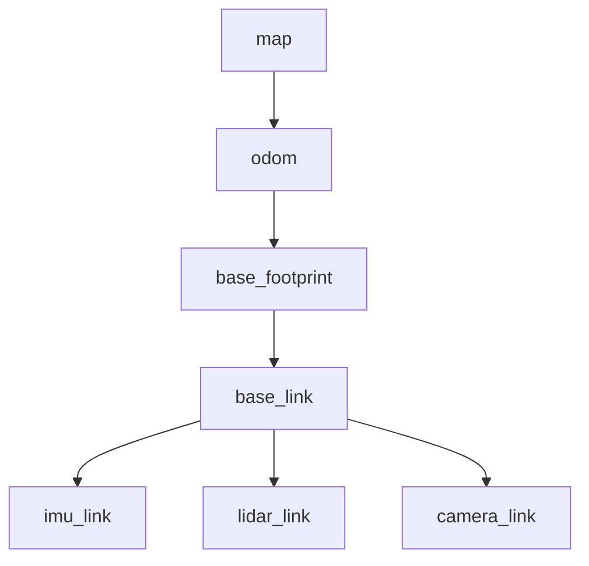
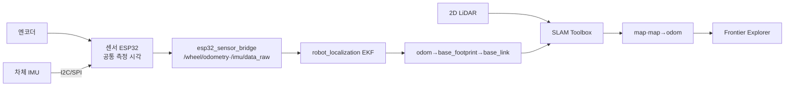
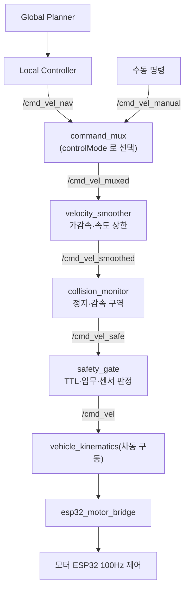
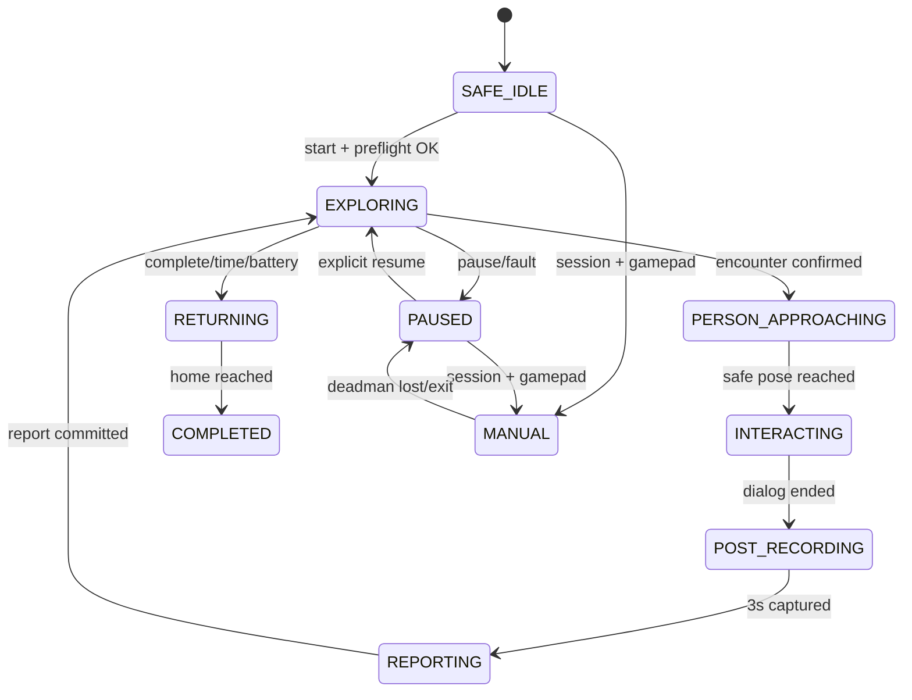

> Sentinel UGV 통합 명세서 v2.0의 일부 — 문서 규칙·버전·변경 이력은 [README](README.md) 참조
>
> **v2.0-r1: AI 장(9·25·30·33)을 [07-AI-탐지-음성.md](07-AI-탐지-음성.md)로 분리했다(S15P11A301-245).**
> AI(객체탐지·음성)는 거의 완료된 참조 문서이고 자율주행은 착수 단계의 작업 문서라,
> 한 파일에 두면 자율주행 변경마다 완료된 장이 diff 에 섞인다. 장 번호는 문서
> 전체에서 전역이므로(README 장별 안내) 번호 참조는 그대로 유효하다.

# 8. ROS2 자율주행 및 탐사 설계 [확정]

> 이 장은 요약이다. 규범(상세)은 22장(센서 수집·시간 동기화·좌표계), 23장(SLAM·위치 추정·Frontier 탐사), 24장(Nav2 경로 계획·안전 속도), 34장(ESP32 저수준 제어·안전 체인)이다. 단, 8.2 전체 노드 구성 표와 8.3 TF 트리, 아래 탐사 종료·복귀 세부 조건은 문서에서 이 장이 기준이다.

**핵심 결정**

| 항목 | 결정 | 상세 |
|---|---|---|
| 처리 파이프라인 | 센서(camera·/scan·엔코더·IMU) → EKF **[구현]** → TF → slam_toolbox **[구현]** → frontier_explorer·Nav2 → 안전 제한(command_mux·velocity_smoother·collision_monitor·safety_gate) **[구현, 24.1]** → vehicle_kinematics(차동 구동) **[미구현, 8.2]** → BTS7960 ×2(BMW M7 후륜 좌·우 RS540 ×2, 전방 수동 캐스터 ×2) **[구현]**. IMU 는 MPU6050 으로 확정돼 `/imu/data_raw` 가 90Hz 로 오고 EKF 도 붙었다(S15P11A301-244·236). 다만 **기판 장착 방향이 미확정**이라 기본은 꺼짐이며, 그때는 휠 오도메트리만 쓴다 | 23.1, 34-3, 8.2 |
| Frontier 탐사 | Occupancy Grid에서 자유/미지 경계 셀을 군집화하고, 도달 가능 후보만 남긴 뒤 거리·예상 정보량·장애물 여유·방문 이력으로 점수화해 최고 점수 후보를 Nav2 목표로 전송한다. 사람 위치를 사전에 알 수 없으므로 "사람 찾기"는 접근 가능한 미지 영역을 빠짐없이 관찰하는 탐사 정책으로 구현한다 | 23.3 |
| 탐사 종료·복귀 | 도달 가능한 Frontier가 10초간 발견되지 않으면 일시정지하고, 제자리 회전 또는 짧은 전·후진 재관측 기동으로 LiDAR 재스캔을 수행한다. 재스캔 후에도 Frontier가 없으면 탐사 완료로 판단한다. 최대 탐사 시간 7분과 사용자 종료도 종료 조건이다. **배터리 기반 종료는 v2.0 에서 폐기했다**(14.6 — 계측 센서가 없다). 종료 시 mission_manager가 저장한 home pose를 Nav2 목표로 전송하고, 복귀 경로 생성 실패 시 PAUSED로 전환해 관제에 복구 요청을 표시한다 | 23.4~23.5 |
| 오도메트리·보정 | 후륜 좌·우 RS540 구동계 엔코더와 차체 IMU를 센서 ESP32가 같은 monotonic 시계로 취득해 Jetson에 전달한다. Jetson은 좌·우 바퀴 속도로 차동 구동 wheel odometry를 계산하고 IMU yaw rate와 EKF로 융합한 뒤 LiDAR SLAM의 `map→odom` 보정으로 누적 오차를 줄인다. 트랙폭 `W`와 좌·우 거리 스케일·최대 각속도는 실측 후 확정값으로 사용한다 | 23.2, 35장 |
| 모터 명령 안전 체인 | 자율(Nav2)·수동(게임패드) 명령 모두 command_mux → velocity_smoother → collision_monitor → safety_gate → vehicle_kinematics(차동 구동) → esp32_motor_bridge를 거쳐 모터 ESP32 내부 100Hz 제어(Jetson과는 50Hz 명령·상태 교환)·300ms watchdog로 실행한다. **순서는 34장이 규범이며 이 순서다** — 종전 이 표와 8.1 은 collision_monitor 를 맨 앞에 적었는데 틀렸다(smoother 를 뒤에 두면 급정지가 감가속 제한에 걸려 천천히 멈춘다). 엔코더 피드백은 센서 ESP32→Jetson 경로로 결합한다(TBD-HW-011) | 34장(규범), 24.1 |

## 8.2 ROS2 노드 구성

**실행 파일 이름은 리포가 근거다** (`jetson/ros2_ws/src/*/setup.py`의 `console_scripts`, `ai/*/src`). v2.0에서 구현 상태 열을 추가하고 실제 이름으로 맞췄다 — 없는 노드를 있는 것처럼 적어 두면 통합 검사에서 "왜 안 뜨나"를 매번 다시 조사한다.

`ai/detection`과 `ai/stt`는 **`ros2_ws` 밖에 있다.** 각자 독립 파이썬 패키지이고 ROS 진입점만 따로 둔다. 이 표에서 ROS 노드처럼 보이지만 패키지 경계가 다르다.

| **노드/실행 파일** | **역할** | **주요 입출력** | **상태** |
|---|---|---|---|
| `ydlidar_ros2_driver_node` | YDLIDAR X4 Pro 드라이버 | `/scan` | 구현 |
| `usb_cam_node` | BRIO 100 단일 오픈·MJPEG 패스스루 | `/camera/image_raw/compressed` | 구현(외부 패키지) |
| `slam_toolbox` (`async_slam_toolbox_node`) | 지도 생성·위치 추정 | `/map`, `/pose`, `/tf` | 구현 |
| `esp32_motor_bridge` | 좌·우 구동 명령 전송, 모터 상태 중계 | `~/drive_command`(JSON String) 수신, `~/drive_state`, `~/command_ack`, `/diagnostics` | 구현 |
| `esp32_sensor_bridge` | 엔코더·초음파·DHT11 상태 중계, 휠 오도메트리 정운동학 | `/wheel/odometry`, `/range/front`, `/proximity/protective_stop`, `/environment/temperature`, `/environment/relative_humidity`, `/diagnostics` | 구현 |
| `mission_manager` | 상태 머신·home pose·종료 조건 | `/mission/status`, `/mission/signal`, `/mission/command_result`, `/perception/encounter` | 구현 |
| `cloud_bridge` | ROS 상태를 EC2로 전달 (presence·state·telemetry) | MQTT/WSS | 구현 |
| `recording_manager` | 3초 링 버퍼·이벤트 녹화 상태 머신 | 로컬 파일 | 구현 |
| `media_uploader` | 미디어 S3 업로드 큐 | `/api/v1/media/uploads` | 구현 |
| `map_saver` / `map_uploader` | 임무 종료 시 지도 저장·업로드 | `/slam_toolbox/save_map`, `/map_uploader/registered` | 구현 |
| `stream_pipeline` | MJPEG 디코딩·x264 인코딩·MediaMTX 송출 | `/camera/image_raw/compressed` → RTSP | 구현 |
| `ai/detection/src/ros_main.py` | 추가 학습 YOLO26n Detect·Pose 기반 사람 탐지 | `/camera/image_raw/compressed` → `/perception/person_candidates` | 구현(`ros2_ws` 밖) |
| `ai/stt` | STT·LLM·TTS 단계 조정과 구조화 결과 생성 | `/interaction/report` | 구현(`ros2_ws` 밖) |
| `foxglove_bridge` | 시각화 WebSocket (TLS·읽기 전용) | `/map`, `/pose`, `/scan`, `/tf`, `/tf_static`, `/robot_description` | 구현(외부 패키지, 8.5) |
| `command_mux` | 자율/수동 중재(`controlMode` 로 선택, 모르면 차단) | `/cmd_vel_nav`·`/cmd_vel_manual` → `/cmd_vel_muxed` | 구현 (S15P11A301-237) |
| `velocity_smoother` | 가감속·최대 속도 제한 | `/cmd_vel_muxed` → `/cmd_vel_smoothed` | 구현 (S15P11A301-237, `nav2_velocity_smoother` 에 파라미터만 준다. **lifecycle 노드**) |
| `collision_monitor` | 근거리 충돌 방지(정지·감속 2구역) | `/cmd_vel_smoothed` → `/cmd_vel_safe` | 구현 (S15P11A301-237, `nav2_collision_monitor` 에 파라미터만 준다. **lifecycle 노드**) |
| `safety_gate` | 명령 TTL watchdog·최종 게이트 | `/cmd_vel_safe` → `/cmd_vel` | 구현 (S15P11A301-237) |
| `vehicle_kinematics` | v/ω ↔ 좌·우 구동 속도 변환(차동 구동) | `/cmd_vel` → `esp32_motor_bridge/drive_command` | 구현 (S15P11A301-234) |
| `nav2_stack` | 경로 계획·제어·복구 | `/cmd_vel_nav` | **미구현** (S15P11A301-235, `navigation2 1.1.20` 설치됨) |
| `frontier_explorer` | 미탐사 목표 생성 | `NavigateToPose` goal | **미구현** (S15P11A301-172) |
| `ekf_node` | 엔코더 vx + IMU yaw 각속도 융합, `odom→base_footprint` TF | `/wheel/odometry`·`/imu/data_raw` → `/odometry/filtered` | 구현 (S15P11A301-236, `enable_ekf` 기본 false) |
| `human_localizer` | 카메라 방위각+LiDAR 거리+TF로 map 좌표 계산 | `/human_observations` | **미구현** |

### 미구현 노드가 만드는 갭

**`/cmd_vel`을 소비하는 노드가 하나도 없다.** 워크스페이스 전체에서 `cmd_vel` 언급은 `esp32_bridge/package.xml`의 설명문 1건뿐이고, 거기서 책임을 위임한 `sentinel_drive`·`sentinel_safety`·`sentinel_exploration`은 README만 있는 빈 패키지다.

따라서 현재 로봇은 **자율주행도 관제 웹의 수동 조종도 모터까지 도달하지 못한다.** 관제 START로 `EXPLORING`에 들어가도 움직이지 않는다. 순서상 `vehicle_kinematics`(S15P11A301-234)가 직렬 관문이고, 그 위에서 Nav2·EKF·안전 체인·탐사가 병렬로 진행된다.

### 폐기한 노드 이름

v1.1까지 쓰던 이름 중 실제와 다른 것들이다. 검색 시 혼동을 막기 위해 남긴다.

| v1.1 이름 | v2.0 |
|---|---|
| `ydlidar_node` | `ydlidar_ros2_driver_node` |
| `camera_capture_node` | `usb_cam_node` (외부 패키지) |
| `yolo_inference_node` | `ai/detection` 내부 모듈 (독립 노드가 아니다) |
| `telemetry_bridge_node` | `cloud_bridge` 가 겸한다 |
| `media_recorder_node` | `recording_manager` + `media_uploader` 로 분리됐다 |
| `voice_interaction_node` | `ai/stt` |

## 8.3 TF 트리
TF 운용 규칙(dynamic/static 구분, 시각 지연 검증)의 규범은 22.3장이며, 아래는 휠 링크를 포함한 전체 트리이다.

```text
map
└─ odom
   └─ base_footprint
      └─ base_link
         ├─ imu_link
         ├─ rear_left_wheel_link
         ├─ rear_right_wheel_link
         ├─ front_left_wheel_link
         ├─ front_right_wheel_link
         ├─ lidar_link
         └─ camera_link
```

- `odom → base_footprint → base_link`는 ROS 표준 관례(REP-105/120)를 따른다. `base_footprint`는 지면 투영, `base_link`는 차체 기준이다.
- **`imu_link` 로 `/imu/data_raw` 가 온다**(MPU6050, 90Hz, S15P11A301-244). URDF 의 `base_link → imu_link` 오프셋은 아직 전부 0이다 — 기판을 차체에 고정한 뒤 실측해 채운다(TBD-HW-012).
- **`odom → base_footprint` 발행자는 정확히 하나여야 한다.** 낼 수 있는 곳이 **셋**(브리지 휠 오도메트리 · SLAM static identity · EKF)이고, `demo.launch.py` 가 `enable_esp32`·`enable_ekf` 조합 네 가지 전부에서 하나만 남도록 구조로 묶는다(S15P11A301-222 의 2자 배타를 236 에서 3자로 확장). 배타표는 23.2 「EKF 융합」.
- **v2.0: `sentinel.urdf`에 시각 형상(visual geometry)이 없다.** 의도된 것이며, 그래서 Foxglove 의 URDF 레이어는 아무것도 그리지 않는다. 차체 치수는 TBD-HW-006 실측 후 반영한다.
- 짐벌은 미사용 확정(6.4)이므로 `lidar_link`·`camera_link`는 `base_link`의 자식이며 **static TF**만 발행한다. 동적 관절각·joint_state는 없다.

**상세 장 포인터**

- 센서별 처리·시간 정책·센서 품질 게이트: 22장
- SLAM 파이프라인·위치 추정 단계·Frontier 점수화·실패 복구: 23장
- Nav2 플래너 선정·속도 정책(자율 0.25m/s, 접근 0.10m/s)·장애물 구역·수동 조작 안전: 24장
- Jetson↔ESP32 안전 명령 체인·명령 수락 조건·watchdog: 34장

## 8.4 ROS 그래프 격리 (v2.0 신설, S15P11A301-218)

**DDS 디스커버리는 같은 LAN 안에서 도메인 ID 단위로 멀티캐스트한다.** 같은 망에 다른 팀의 ROS 2 그래프가 있으면 서로의 노드·토픽이 그대로 섞인다. 실제로 외부 노드 37개가 우리 그래프에 보였고, 그 상태에서는 `ros2 node list`로 우리 노드 생존을 판정할 수 없다.

격리 값은 **`scripts/ros_env.sh` 한 곳에만** 둔다. 스크립트마다 복사하면 두 곳이 어긋나고, 어긋나면 노드들이 서로를 못 본 채 조용히 돈다 — 화면에는 "토픽이 안 온다"만 남는다.

```bash
export ROS_LOCALHOST_ONLY=1   # 물리적 격리. 같은 기기 안에서만 통신한다
export ROS_DOMAIN_ID=97       # 규약적 격리. 0~101 범위여야 한다
```

- `ROS_LOCALHOST_ONLY=1`이 **물리적 격리**다. 도메인 ID는 규약일 뿐이라 남이 같은 번호를 쓰면 다시 섞인다.
- 도메인 ID는 **0~101**을 쓴다. 그 위 값은 리눅스 ephemeral 포트 범위와 충돌한다.
- 젯슨과 노트북을 나눠 쓰는 구성으로 바꿀 때는 `ROS_LOCALHOST_ONLY`를 끄고 도메인 ID만 남긴다. 그때 격리 강도가 내려가는 것을 인지해야 한다.

## 8.5 시각화 경로 (v2.0 신설, S15P11A301-216·221·224·233)

RViz 대신 **`foxglove_bridge`**를 쓴다. 젯슨에 디스플레이가 없고, 브릿지는 WebSocket 하나만 열면 노트북 브라우저에서 바로 본다. RViz를 쓰려면 X 전달이나 원격 데스크톱이 필요하다.

```text
접속       wss://jetson.sentinel-ugv.xyz:8765
연결 유형   Foxglove WebSocket   (Rosbridge 를 고르면 핸드셰이크가 깨진다)
서브프로토콜 foxglove.sdk.v1     (foxglove.websocket.v1 은 HTTP 400)
```

**`ws://`가 아니다.** TLS를 켜 두었으므로 평문으로 붙으면 서버가 핸드셰이크를 기다리다 끊고, Foxglove에는 `No details provided`만 남는다 — 원인이 어디에도 적히지 않는다. 켜고 끄는 절차와 3D 패널 설정은 `scripts/README.md`가 규범이다.

### 노출 범위와 수락한 위험

| 항목 | 설정 |
|---|---|
| TLS | `tls: true`, `~/.config/sentinel/certs/server.{crt,key}` |
| 쓰기 | 차단. `capabilities: [connectionGraph]` — 파라미터 변경·서비스 호출 불가 |
| 토픽 | `/map` `/pose` `/scan` `/tf` `/tf_static` `/robot_description` 6개 화이트리스트 |
| 읽기 인증 | **없다** |

젯슨이 **공인 IP**에 있어 LAN과 인터넷이 같은 인터페이스다. "LAN에서만 열기"라는 선택지가 없으므로, 위 6개 토픽은 브릿지가 떠 있는 동안 인터넷에서 누구나 읽을 수 있다. **명시적으로 수락한 위험**이며, 그래서 볼 때만 켜고 보고 나면 `viz_down.sh`로 끈다. 외부에 아예 열지 않으려면 `viz_up.sh --local`로 켜고 SSH 터널로 본다(그 경우만 `ws://`다 — 인증서가 도메인 이름으로 발급되어 `wss://localhost`는 이름이 맞지 않는다).

## 8.6 관제 웹의 실시간 지도 (v2.0 신설, S15P11A301-227)

**v1.1의 전제가 깨졌다.** v1.1은 "점유격자를 실시간으로 관제까지 보내는 계약이 없다"를 전제로 지도를 임무 종료 후 PGM 조회로만 규정했다. 그러나 경로가 이미 있었다 — `foxglove_bridge`가 `/map`·`/pose`를 WebSocket으로 내보내고 있었고, 관제 웹이 거기에 **직접** 붙는다.

```text
젯슨 slam_toolbox  →  foxglove_bridge (wss)  →  관제 웹 브라우저
                                                (백엔드를 거치지 않는다)
```

백엔드를 거치지 않는 이유는 telemetry 스키마에 격자 필드가 없고 지도 조회 API는 임무 종료 후 PGM뿐이어서, 그 둘로는 실시간이 되지 않기 때문이다.

- 브라우저가 CDR을 직접 디코딩한다(`frontend/lib/cdr.ts`, `occupancyGrid.ts`, `robotPose.ts`). `@foxglove/ws-protocol`은 쓰지 않는다 — 서브프로토콜이 다르다.
- 값 체계가 임무 이력 지도와 다르다. 라이브는 nav2 `int8`(−1 미탐색, 0~100 확률), 저장본은 PGM 바이트(0 점유, 254 자유, 205 미탐색)다. **판정 함수는 따로 두고 색과 좌표 변환은 공유한다**(`palette.ts`, `gridGeometry.ts`) — 규칙이 갈라지면 두 화면의 로봇 위치가 서로 반대로 찍힌다.
- **같은 네트워크에서만 보인다.** 영상(WHEP)이 이미 같은 제약이고 시연을 LAN 기준으로 정했다.

# 14. 상태 머신 및 안전 정책 [확정]

> 이 장은 요약이다. 임무 상태 정의(14.1)와 상태 전이(14.2)의 규범(상세)은 **26장(Mission Manager·임무 상태 머신 상세 설계)** 이다. 단, 14.3~14.7(시작 전 점검·안전 우선순위·장애별 정책·배터리 정책[폐기]·종료 안전)은 이 장이 고유 규범이다.

핵심 결정:

- 임무 상태는 12개로 확정한다(26.2): `SAFE_IDLE`, `EXPLORING`, `PERSON_APPROACHING`, `INTERACTING`, `POST_RECORDING`, `REPORTING`, `PAUSED`, `MANUAL`, `RETURNING`, `COMPLETED`, `ESTOP`, `ERROR`.
- `OFFLINE`은 서버가 관측한 연결 상태이며 Jetson 내부 임무 상태로 사용하지 않는다.
- MANUAL 진입은 SAFE_IDLE 또는 PAUSED에서만 허용하고, 주행 중 수동 전환은 PAUSED를 자동 경유한다(14.2, 26.3).
- 안전 우선순위 최상위는 물리 E-Stop이며(14.4), watchdog 300ms(14.7)를 적용한다. **배터리 정책은 v2.0 에서 폐기했다**(14.6).

## 14.1 로봇 상태

상태 정의의 규범은 **26.2**다. 12개 상태명은 다음과 같다.

`SAFE_IDLE`(초기화 완료, 명시적 시작 대기) · `EXPLORING`(Frontier 기반 탐사) · `PERSON_APPROACHING`(피해자 그룹 관측 위치로 저속 접근) · `INTERACTING`(피해자 음성 확인, 정지) · `POST_RECORDING`(상호작용 종료 후 3초 녹화) · `REPORTING`(encounter·피해자·미디어 로컬 저장·보고) · `PAUSED`(탐사/복귀 일시정지) · `MANUAL`(게임패드 수동 조종, deadman) · `RETURNING`(home pose 복귀) · `COMPLETED`(임무 정상 종료) · `ESTOP`(비상 정지 latch) · `ERROR`(핵심 센서·제어 오류)

각 상태의 설명·이동(모터) 허용 조건은 26.2 표를 따른다.

## 14.2 상태 전환

전이도의 규범은 **26.3**(mermaid 전이도)이다. 요약 수준에서 지켜야 할 핵심 규칙:

- MANUAL 진입은 **SAFE_IDLE 또는 PAUSED에서만** 허용한다. 주행 중(EXPLORING) 수동 전환 요청은 자동 일시정지(→PAUSED)를 거친 뒤 MANUAL로 진입한다. UI의 "수동" 버튼 하나가 이 2단 전이를 내부적으로 처리한다.
- MANUAL 종료(수동종료·조이스틱 해제) 시 항상 PAUSED로 복귀하며, 탐사 재개는 반드시 운영자의 명시적 재개 명령으로만 이루어진다(자동 재출발 금지, SR-008과 동일 원칙). 26.3과 동일 규칙이다.
- 모든 상태에서 E-Stop은 ESTOP으로 전환하고, ESTOP 해제는 안전 확인 후 SAFE_IDLE 또는 PAUSED로 복귀한다.
- REPORTING(로컬 저장 완료) 후 EXPLORING 또는 PAUSED로 복귀하고, RETURNING 경로 실패 시 PAUSED/ERROR로 전환한다.

## 14.3 시작 전 점검
| **분류** | **항목**                                                                 | **실패 시**            |
|----------|--------------------------------------------------------------------------|------------------------|
| 필수     | Jetson, ESP32 handshake(모터·센서 2채널), LiDAR, 카메라, 모터 드라이버, 엔코더, 전방 초음파, SLAM, E-Stop | 바닥 자율 탐사 시작 차단 |
| 보조     | 온습도, EC2, S3, 원격 스트림                                             | 경고 후 로컬 탐사 가능 |

> **v2.0: 필수 목록에서 배터리·차체 IMU·Nav2 를 뺐다.**
>
> - 배터리 — 계측 센서가 없어 점검 자체가 불가능하다(14.6 폐기)
> - 차체 IMU — 부품이 미확정이고(TBD-HW-012) `/imu/data_raw` 발행이 없다. 붙으면 다시 넣는다
> - Nav2 — 아직 구성되지 않았다(8.2). 구성 후 다시 넣는다
>
> 점검 목록에 없는 것을 두면 시작 차단 로직이 영원히 통과하지 못하거나, 반대로
> 점검을 건너뛰게 만든다. **점검할 수 있는 것만 필수에 둔다.**

## 14.4 안전 우선순위
| **우선순위** | **제어원**                           |
|--------------|--------------------------------------|
| 1            | 물리 E-Stop 및 모터 전원 차단        |
| 2            | ESP32 fault·통신 watchdog·IWDT/TWDT  |
| 3            | 모터 드라이버 오류/하드웨어 fault    |
| 4            | Collision Monitor·초음파 근거리 정지 |
| 5            | 소프트웨어 E-Stop                    |
| 6            | 수동 게임패드 명령                   |
| 7            | 피해자 접근·자동 복귀·자율 탐사      |

## 14.5 장애별 정책
| **장애**        | **자율 탐사**                | **수동 조종**            | **저장/알림** |
|-----------------|------------------------------|--------------------------|---------------|
| EC2 연결 단절   | 계속                         | 즉시 정지                | 로컬 큐 저장  |
| S3 연결 단절    | 계속                         | 계속                     | pending 파일  |
| 로컬 영상 실패  | 계속                         | 조종 제한 검토           | REMOTE 전환   |
| LiDAR 단절      | 즉시 정지                    | 저속 수동만 또는 금지    | 치명 오류     |
| 오도메트리 이상 | PAUSED/ERROR                 | 저속 수동 가능 검토      | 오류 이벤트   |
| ESP32/모터 응답 없음 | 300ms 내 정지·ERROR/ESTOP | 불가                     | 치명 오류     |
| 전방 초음파 단절 | PAUSED 또는 검증된 제한 속도 | 저속 수동만 검토 | 안전 센서 경고 |
| 카메라 단절     | 탐사 가능하나 사람 탐지 중단 | 영상 없는 수동 금지 권장 | 경고          |
| 온습도 단절     | 계속                         | 계속                     | 경고          |
| Jetson 과열     | 감속/복귀/정지               | 정지                     | 임계값 기록   |

## 14.6 배터리 정책 [v2.0 폐기]

**배터리 기반 안전·종료 기능을 프로젝트에서 제외한다.**

계측 경로가 하드웨어에 없다. 모터 전원(유아전동차 내장 12V)과 Jetson 전원(대용량 보조배터리)이 완전히 분리돼 있고(21.4) 어느 쪽에도 전압·전류 센서가 붙어 있지 않다. 02장의 전압·전류 센서는 **권장** 항목이며 장착하지 않았다.

센서가 없으면 잔량을 알 수 없고, 알 수 없는 값으로 주행을 중단시키는 판정은 만들 수 없다. 임계값만 문서에 적어 두면 **없는 안전장치를 있다고 믿게 된다** — 이것이 폐기하는 이유다.

폐기 범위:

| 폐기 항목 | 원래 규정 |
|---|---|
| 잔량 30% 경고 / 20% RETURNING / 10% 안전 정지 | 14.6 |
| 배터리 20% 이하 탐사 종료 조건 | 8.1 탐사 종료·복귀, 23.4 |
| `/battery_state` 토픽 (1~2Hz) | 22.2 센서 수집 |
| 관제 화면 배터리 표시 | 11.5 (S15P11A301-223 에서 이미 제거) |
| 저전압 복귀 (R-09 완화책) | 01장 위험 관리 |

**탐사 종료 조건은 둘로 줄어든다** — 도달 가능한 Frontier 소진(재관측 기동 후에도 없음), 그리고 최대 탐사 시간 7분 또는 운영자 종료. 시연이 7분 안에 끝나고 배터리는 시연 전에 충전하는 운영으로 대체한다(38장 시연 체크리스트의 "배터리 충전 및 전압" 항목).

**과열 보호는 남는다.** Jetson 온도는 실제로 읽을 수 있고(`/sys/devices/virtual/thermal`) telemetry 에 이미 실려 있다. 14.5 의 과열 대응(감속/복귀/정지)은 유효하다.

되살리려면 전압 센서 장착이 선행이다(TBD-HW-003). 그때 이 절을 다시 쓴다.

## 14.7 프로그램 종료 안전
- 모든 모터 제어 코드는 try/except/finally와 SIGINT/SIGTERM 종료 처리를 포함한다.
- 노드 종료 시 마지막 명령과 관계없이 0 속도를 전송한다.
- Jetson Safety Gate와 ESP32 통신 watchdog은 각각 300ms 동안 유효 명령이 없으면 정지한다.
- ESP32 부팅·재부팅 중 PWM 0과 모터 드라이버 비활성화를 기본 상태로 둔다.
- E-Stop 해제는 주변 안전 확인 팝업과 물리 상태 확인 후 수행한다.

임무 상태 머신의 단일 권한 원칙·상태 정의·전이도·명령 멱등성·이벤트 우선순위 상세는 26장을 따른다.

# 22. 센서 수집·시간 동기화·좌표계 상세 설계

## 22.1 핵심 원칙

SLAM, 사람 위치 추정, 영상 이벤트를 같은 사건으로 연결하려면 센서 데이터의 **좌표계와 시각**이 일치해야 한다. 모든 데이터는 ROS 2 timestamp를 포함하고, 기록용 wall clock과 제어용 monotonic clock을 구분한다.

## 22.2 센서별 처리

| 센서 | ROS 2 출력 | 권장 주기 | 핵심 검증 | 실패 영향 |
|---|---|---:|---|---|
| 2D LiDAR | `/scan` | 약 11.03Hz 실측 | X4 Pro, 128000bps, 약 1222~1231 points/scan, `lidar_link`, 0.1~12.0m, drop | 자율주행 중단 |
| 카메라 | `/camera/image_raw` 또는 공유 프레임 버스 | 29.93 FPS 캡처 실측 | 1280×720 MJPEG, ROS 2 동시 구동·지연·단일 open | 사람 탐지·수동 영상 제한 |
| 차체 IMU(센서 ESP32 경유) | `/imu/data_raw` | **90Hz 실측** (펌웨어 100Hz, 송신 주기 합병으로 조금 낮다) | MPU6050 I2C `0x68`, `imu_link`, rad/s·m/s², bias, ESP32 측정 timestamp·sequence, stale/NaN | 오도메트리 품질 저하 또는 AUTO 중지 |
| 구동 엔코더(좌·우) | `/wheel/odometry` | **50Hz 실측** | 좌·우 부호·tick·overflow·속도 | 위치 추정 실패 |
| 전방 초음파 | `/range/front` | **15.1Hz 실측** | 유효 거리·timeout·실차 정지거리. **탐지 가능 범위가 20cm 급이다 — 아래 실측 참고** | ESP32 보호 정지(접촉 직전 한정), 단절 시 PAUSED/제한 |
| DHT11 온습도 | `/environment/temperature`·`/relative_humidity` | 0.5Hz (펌웨어 `DHT_INTERVAL_MS=2000`) | **유효 범위 습도 20~90%(±5%)·온도 0~50°C(±2°C)**, checksum·timeout·센서 끊김. 읽기 실패 시 브리지가 **발행을 건너뛴다** — 보드가 마지막 정상값을 들고 있어 그대로 내보내면 오래된 값이 새 측정처럼 보인다. 실패는 `/diagnostics` 의 `ENVIRONMENT_SENSOR_FAULT`(연속 3회)로만 드러난다 | 경고만 발생 |

> **DHT11 읽기 실패율 18.5% 는 수용한다** (2026-08-04 실측: 130초·고유 읽기 65회 중
> TIMEOUT 12회, 최대 연속 실패 1회, 읽기 주기 0.499Hz 로 펌웨어 설정과 일치).
> 1-wire 타이밍이 원래 이렇고 고칠 대상이 아니라는 판단이다. 근거 셋.
>
> * 센서 자체는 정상이다 — 성공 읽기값이 온도 24.3~24.4°C·습도 60~61% 로 안정적이다
> * **화면이 틀리지 않는다.** 브리지가 실패 시 발행을 건너뛰므로 오래된 값이 새
>   측정으로 보이는 일이 없다
> * 실효 갱신율이 0.5Hz → 0.41Hz 로 떨어질 뿐이다. 온습도 표시에서 이 차이는 의미가
>   없고, 명세도 보조 센서(경고만 발생, 탐사 계속)로 규정한다
>
> 이 조건(센서 장착·간헐 실패)에서는 연속 실패가 최대 1회라
> `ENVIRONMENT_SENSOR_FAULT`(임계 3)가 뜨지 않는다. 간헐 실패의 흔적이 진단에
> 남지 않는 것을 알고 수용하는 것이다.
>
> **다만 이것은 "이 플래그가 안 뜬다" 는 뜻이 아니다.** 같은 날 온습도 센서를
> 분리한 상태에서 **정상 발화를 확인했다**(S15P11A301-258).
>
> | 조건 | `ENVIRONMENT_SENSOR_FAULT` | `/environment/*` |
> |---|---|---|
> | 센서 장착, 간헐 실패 18.5% (연속 최대 1회) | 0 — 안 뜬다 | 0.41Hz 로 계속 나온다 |
> | 센서 분리 (연속 실패 계속) | **1** — `board_state=DEGRADED` | **발행 없음** |
>
> 분리 상태에서 같은 보드의 IMU 는 90.6Hz, CRC 오류 0, 프레임 유실 0, 핸드셰이크
> 안정이었다. 즉 fault 가 통신 문제로 번지지 않고 DHT11 경로만 짚었다. 화면에
> 값이 사라지는 것이 **설계대로 맞는 동작**이다 — 보드가 마지막 정상값을 들고
> 있으므로 발행을 계속하면 낡은 값이 새 측정으로 보인다. 주행은 `DEGRADED` 를
> 허용하므로 센서 없이도 탐사가 계속된다.
>
> 플래그는 sticky 가 아니다. `sensor_task.cpp` 가 **성공 읽기 한 번에 해제**한다
> (`else if (dhtResult == OK)`). 센서를 다시 물리면 재부팅도 스택 재기동도 없이
> 2초 안에 복구되고, `ros2 topic hz /environment/temperature` 가 0.5Hz 를 내면
> 복구된 것이다. 반대로 플래그가 1 로 남아 있다는 것은 임계(연속 3회, 2s 주기라
> 6초 이상) 이후 **성공 읽기가 단 한 번도 없었다**는 뜻이다 — 간헐 실패와
> 완전 불통을 이 한 값으로 구별할 수 있다.
>
> 다시 재려면 **`sample_age_ms` 가 감소하는 순간만** 세야 한다. `comm_task` 가 마지막
> 상태를 재전송하므로 프레임을 그대로 세면 같은 읽기가 중복 집계된다(처음에 그렇게
> 세어 30% 로 잘못 보고했다).
| ~~배터리~~ | ~~`/battery_state`~~ | — | — | **v2.0 폐기 (14.6).** 전압·전류 센서를 장착하지 않았다 |

### 환경값 판정 임계 (v2.0-r3 신설, S15P11A301-214)

명세는 온습도를 "보조 센서, 경고만 발생"까지만 규정하고 임계값을 두지 않았다.
관제 화면이 쓰는 값을 여기서 확정한다. 구현은
`frontend/features/telemetry/environmentThresholds.ts` 이며 DOM 없이 시험한다.

| 항목 | 임계 | 근거 |
|---|---|---|
| 습도 상한 | **80%** | 데이터시트 상한 90 에서 오차 ±5 와 포화 여유를 뺀 값. 종전 85 는 경고 구간(85~90)이 오차 폭과 같아 실측이 그 구간에 있는지 판단할 수 없었다 |
| 온도 상한 | 40°C | 상한 50 에서 여유 10 (오차 ±2 의 5배). 화재 근처를 알리는 목적 |
| 온도 하한 | 5°C | 하한 0 에서 여유 5 |

#### 임계값만으로는 범위 밖이 침묵한다

DHT11 은 습도 90% 를 넘으면 그 값을 읽지 못한다. 실제로 95% 여도 90 근처를
보고하거나 읽기에 실패하므로, 임계값만 두면 화면이 "90.0%" 를 **정상 측정값처럼**
보여주고 보는 사람은 그것이 상한이라는 사실을 모른다.

그래서 판정을 두 단계로 둔다.

1. **포화** — 값이 유효 범위 끝에서 오차 폭 안에 들면 `≥90` 처럼 **부등호로**
   표시하고, "DHT11 측정 한계 — 실제는 더 극단일 수 있습니다" 를 함께 적는다.
   부등호만 있으면 배선 문제로 오해한다.
2. **경고** — 범위 안에서 위 임계를 넘는다.

**포화는 그 자체로 경고다.** 습도 하한에서 이것이 특히 중요하다 — 경고가 상한만
보므로(>80), 포화 절이 없으면 건조 극단(≤22%)이 조용히 지나간다.

2026-08-04 실측(정지·실내): 온도 24.3°C, 습도 61.0~62.0%. 두 값 모두 경고
구간에서 멀어, 평상 조건에서 경고가 뜨지 않는 것을 확인했다.

### 전방 초음파 실측 — 20cm 급 근접 센서다 (S15P11A301-272)

2026-08-05, 실내·물체 고정·발행 15.1Hz. 임계값은 센서 ESP32 펌웨어가 로컬로
판정하며 이 측정이 **첫 확인**이다(TBD-CAL-001 이 비워 두었던 값).

| 항목 | 실측 |
|---|---|
| `protective_stop` 발동 거리 | **0.15~0.18m** |
| 측정 유효 범위(실측) | 0.028~2.994m |
| 신호 유지 | 8~10cm 고정 9초간 연속 `True`, 전환은 진입·이탈 2회뿐, `inf` 0개 |

**거리에 따라 탐지율이 무너진다.** 초당 유효 표본 수를 세었다(정상이면 15개):

| 거리 | 초당 유효 표본 | 탐지율 |
|---|---|---|
| 0.08~0.11m | **15/15** | 100% |
| 0.43~0.65m | 3~7/15 | 20~45% |
| 1.39~1.41m | 1~4/15 | 7~27% |

1.4m 에서 여덟 번 중 일곱 번을 놓친다. HC-SR04 를 이 위치에 이 각도로 붙인
결과이며, **이 센서는 20cm 미만에서만 신뢰할 수 있다.**

**임계값은 올리지 않는다.** 0.43m 에서 이미 탐지율이 20~45% 이므로, 임계를 그쪽으로
올리면 놓치는 비율이 그대로 오판이 된다. 없는 보호를 있다고 믿는 것보다 좁은 보호를
정확히 아는 쪽이 낫다는 판단이다.

따라서 역할은 이렇게 갈린다. 이 구분을 흐리면 초음파가 제공하지 않는 보호를
기대하게 된다.

| 층 | 담당 | 거리 |
|---|---|---|
| **주 방어** | LiDAR → `collision_monitor` 정지 구역 | 전방 0.40m (24.1) |
| **접촉 직전 방어** | 초음파 → `protective_stop` → `STOP_COMMAND` 중계 | 0.15~0.18m |

정상 상황에서는 라이다가 먼저 멈추므로 초음파가 발동할 일이 없다. 발동했다면
**라이다가 놓친 것**(반사가 약한 표면, 스캔 평면 밖의 낮은 장애물)이며 이미 로봇
반경 0.20m 안쪽이다. 0.25m/s 에서 0.15m 는 0.6초이고 거기에 중계 지연과 감속이
더해지므로, 이 층은 충돌을 없애는 것이 아니라 **충격을 줄이는 것**이 목적이다.

## 22.3 TF 좌표계



- `map → odom`: SLAM Toolbox가 전역 보정을 제공한다.
- `odom → base_footprint`: 엔코더·IMU EKF가 연속적인 로컬 자세를 제공한다.
- 짐벌은 미사용 확정(6.4장)이므로 `lidar_link`·`camera_link`는 `base_link`의 자식이며 **static TF**만 사용한다.
- 고정 센서(IMU 등)도 static TF를 사용한다.
- TF가 미래 시각이거나 허용 지연을 넘으면 사람 map 좌표 확정을 보류한다.

## 22.4 시간 정책

| 목적 | 시계 | 이유 |
|---|---|---|
| 이벤트·영상·DB 정렬 | UTC wall clock | Jetson·EC2 간 비교 가능 |
| 명령 TTL·watchdog | monotonic clock | NTP 보정이나 시간 점프 영향 방지 |
| 파일명·로그 | UTC + missionId | 시간대 혼동과 충돌 방지 |

Jetson은 chrony/NTP로 시각을 동기화한다. 메시지에는 `occurredAt`과 서버의 `receivedAt`을 분리해 기록하며, 시간 오차가 임계값을 넘으면 관제에 경고한다.

## 22.5 센서 품질 게이트

센서 메시지가 존재한다는 이유만으로 정상으로 판정하지 않는다.

```text
최근 수신 시각
+ 실제 주기
+ 값 범위
+ frame_id
+ timestamp 지연
+ 변화량/고정값 여부
→ OK / DEGRADED / FAILED
```

LiDAR, 엔코더, ESP32(모터·센서), E-Stop, TF가 FAILED이면 자율 임무를 시작할 수 없다. 카메라가 FAILED이면 사람 탐지와 영상 기반 수동 조종을 차단하되 저속 지도 탐사 허용 여부는 운영자가 결정한다.

# 23. SLAM·위치 추정·미지 영역 탐사 상세 설계

## 23.1 권장 파이프라인



## 23.2 위치 추정 단계

1. 센서 ESP32가 구동축 좌·우 엔코더 tick·속도, 차체 IMU 원시 gyro·accel을 공통 monotonic 측정 시각과 sequence로 제공한다.
2. Jetson이 차동 구동 운동학(좌·우 바퀴 속도와 트랙폭 `W`)으로 wheel odometry를 계산한다.
3. Jetson sensor bridge가 `/imu/data_raw`(`sensor_msgs/Imu`, `frame_id=imu_link`)를 발행하고, EKF가 wheel odometry와 IMU yaw rate를 융합한다.
4. SLAM Toolbox가 LiDAR scan matching으로 누적 오차를 보정한다.
5. Mission Manager는 TF 연속성과 covariance를 감시한다.

### EKF 융합 (S15P11A301-236)

파라미터는 `sentinel_bringup/config/ekf.yaml`, 실행은 `launch/ekf.launch.py` 다.
`demo.launch.py` 의 `enable_ekf` 는 **기본 false** — 기판 장착 방향이 확정되기
전에는 켜지 않는다(아래 「켜기 전 확인」).

**목적은 하나다 — 캐스터 슬립이 갉아먹는 yaw 를 자이로로 보정한다.**

#### 무엇을 입력으로 쓰는가

| 입력 | 쓰는 성분 | 뺀 것과 이유 |
|---|---|---|
| `/wheel/odometry` (50Hz) | `vx` 만 | **위치(x·y·yaw)** — 브리지가 이미 적분한 값이다. EKF 가 하려는 적분을 입력으로 받으면 같은 오차를 두 번 믿는다. **`vyaw`** — 이것이 바로 캐스터 슬립에 오염된 값이다 |
| `/imu/data_raw` (90Hz) | `vyaw` 만 | **절대 yaw** — MPU6050 에 지자기계가 없어 절대 방위를 모른다. 브리지도 `orientation_covariance[0] = -1`(자세 추정 없음)로 표시한다. **선가속도** — 적분하면 오차가 제곱으로 커진다. 휠 오도메트리가 훨씬 낫다 |

**엔코더 `vyaw` 를 공분산 가중으로 낮추는 대신 아예 뺀 것이 요점이다.** 슬립은
백색 잡음이 아니라 회전 방향으로 치우친 계통 오차라, 가중을 낮춰도 평균이 편향된
채 남는다.

`two_d_mode: true` 로 z·roll·pitch 를 0 에 고정한다. 켜지 않으면 IMU 노이즈가
pitch 로 새어 평지에서도 로봇이 기울어진 것으로 추정된다.

#### odom TF 3자 배타

이 TF 를 낼 수 있는 곳이 셋이라 `demo.launch.py` 가 구조로 하나만 남긴다.
`_effective_ekf = enable_ekf AND enable_esp32` 를 만들어, 보드 없이 EKF 만 켜는
조합을 걸러낸다(입력이 없으면 EKF 가 0 만 내고 그것이 TF 로 나가 로봇이 영원히
원점에 있는 것으로 보인다).

| `enable_esp32` | `enable_ekf` | 발행자 | 근거 |
|---|---|---|---|
| false | false | SLAM static identity | 보드 없음 — identity 로 SLAM 유지 |
| false | true | SLAM static identity | EKF 가 안 뜬다. 입력이 없으니 켜도 0 만 낸다 |
| true | false | `esp32_sensor_bridge` | 휠 오도메트리 단독 |
| true | true | **EKF** | 브리지 `publish_odom_tf` 가 꺼진다 |

`enable_esp32` 는 **사람이 기억할 값이 아니다.** `scripts/demo_up.sh` 가
`/dev/sentinel_mcu_sensor`(udev 별칭, S15P11A301-214) 존재로 판단해 붙인다
(S15P11A301-256). 인자로 명시하면 감지를 이긴다 — 보드 없이 켜서 아래 실패를
재현하는 것도 정당한 사용이다.

기본값을 `false` 로 둔 것과 감지를 넣은 것은 **같은 하나의 실패**를 막는다.
`enable_esp32:=true` 인데 보드가 없으면 static identity 가 꺼진 채로 브리지가
데이터를 못 받아 **위 표의 어느 행도 성립하지 않는다** — odom TF 발행자가 0개가
되고 `slam_toolbox` 가 "Failed to compute odom pose" 를 반복하며 지도를 만들지
않는다. 브리지는 죽지 않고 1초마다 재접속을 재시도하므로 프로세스도 토픽도
정상으로 보이고, 증상은 "지도가 안 나온다" 하나뿐이다. 반대로 보드가 있는데
`false` 면 `/environment/*` 가 조용히 안 나온다(S15P11A301-213 이 telemetry
값을 못 받던 원인). 어느 쪽이든 로그에 이유가 남지 않아서, 판단을 사람에서
장치로 옮겼다. 감지 결과는 기동 로그에 한 줄로 찍는다 — 조용히 달라지면
같은 종류의 오진이 된다.

감지가 못 막는 것이 하나 남는다. **주행 중** USB 재열거로 보드가 빠지면
static identity 는 이미 꺼져 있고 브리지는 TF 를 멈추므로 지도가 그 자리에서
얼어붙는다. 기동 시점 판단으로는 닿지 않는 런타임 문제다.

**이것은 아직 막히지 않았다.** S15P11A301-237 안전 체인이 함께 잡을 것으로 적혀
있었으나, 구현된 `safety_gate` 의 정지 조건은 명령 TTL·임무 상태·초음파·`/scan`
신선도 넷이고 **TF 끊김은 없다**(24.1). `collision_monitor` 도 못 막는다 — `/scan`
자체는 계속 오므로 그쪽 판정은 통과한다. 지도가 얼어붙은 채로 낡은 costmap 을 보고
주행하는 구간이 남아 있으며, 이 조건을 어느 층에 넣을지는 미정이다.

#### 실측 (2026-08-04, 정지·미장착 조건)

| 항목 | 값 |
|---|---|
| EKF 출력 주기 | 30Hz, 프레임 `odom → base_footprint`, `z=0` |
| EKF `vyaw` 추종 | −0.00164 rad/s (IMU −0.00151) — IMU 를 따라간다 |
| gyro 잡음 | 표준편차 0.00715 rad/s → 분산 5.1e-05 |
| **잔여 gyro bias** | **−0.00141 rad/s = −4.85°/분** |
| bias 이동 (12초) | 0.00011 rad/s |

**잔여 bias 가 yaw 표류로 그대로 간다.** `robot_localization` 의 15상태 모델에는
IMU bias 상태가 없어서 EKF 가 bias 를 추정하지 못한다. 펌웨어가 부팅 시 2초간
bias 를 재지만(200샘플) 온도에 따라 이후 이동한다 — 7분 임무면 약 −34° 다.

절대 방위는 `slam_toolbox` 의 `map→odom` 보정이 잡으므로 지도상 위치는 맞는다.
Nav2 의 local costmap·컨트롤러가 쓰는 `odom` 프레임에서는 **느린 일정 표류**가
남는데, 이는 슬립이 만드는 **불규칙한 튐**보다 추종에 훨씬 덜 해롭다. 그래서
EKF 를 켠 쪽이 낫다.

#### 켜기 전 확인 (장착 후)

기판 장착 방향이 확정되면 이 순서로 검증한다.

1. 정지 상태에서 `accel ≈ (0, 0, +9.8)` — 아니면 기판이 눕지 않았거나 축이 다르다
2. 로봇을 손으로 **반시계로** 제자리 회전 → `gyro_z > 0` 이어야 한다(REP-103).
   음수면 펌웨어의 `IMU_AXIS_SIGN[2]` 를 `-1.0f` 로 바꾼다
3. 360° 회전 후 EKF yaw 와 실제를 비교, 엔코더 단독과 나란히 기록 (S15P11A301-248)

축 부호가 뒤집힌 채 켜면 **EKF 가 회전을 반대로 융합하고, 그 오류는 SLAM 이
`map→odom` 으로 덮어서 화면에 드러나지 않는다.** 회전할 때 위치가 밀리는 것으로만
보인다.

차동 구동은 좌·우 바퀴 속도만으로 오도메트리를 구하므로 조향각 상태가 필요 없다. 직선 거리 스케일(좌·우 개별), 트랙폭 `W`, 명령 각속도 대비 실제 yaw rate 스케일을 실측해 보정한다. 제자리 회전·저속에서 바퀴 미끄럼이 크면 wheel odometry covariance를 보수적으로 설정하고 IMU yaw rate 가중을 높인다.

## 23.3 Frontier 선택

Frontier는 탐색된 자유 공간과 미탐색 공간의 경계다. 후보는 다음 기준으로 점수화한다.

```text
score = 정보이득 가중치 × 예상 신규 면적
      - 이동비용 가중치 × 경로 길이
      - 위험도 가중치 × 좁은 통로·장애물 근접도
      - 실패이력 가중치 × 최근 실패 횟수
```

| 필터 | 규칙 |
|---|---|
| 크기 | 너무 작은 Frontier 제거 |
| 접근성 | Nav2 global plan 생성 불가 후보 제거 |
| 안전거리 | 벽·장애물 inflation 영역 내부 제거 |
| 반복 실패 | 동일 후보 N회 실패 시 cooldown |
| 사람 상호작용 | encounter 진행 중 신규 선택 중단 |

## 23.4 탐사 종료 조건

- 유효 Frontier가 더 이상 없다.
- 임무 제한 시간이 끝났다.
- 운영자가 복귀 또는 종료를 요청했다.
- 핵심 센서·위치 추정이 복구 불가능한 상태다.

정상 종료와 시간 종료는 `RETURNING`으로 전환한다. 위치를 잃어 home 경로를 생성할 수 없으면 정지 후 수동 회수를 요청한다.

> **v2.0: 배터리 복귀 임계값 조건을 뺐다.** 전압 센서를 장착하지 않아 잔량을 알 수 없다(14.6).

## 23.5 실패 복구

| 실패 | 1차 처리 | 2차 처리 | 최종 처리 |
|---|---|---|---|
| 목표 경로 생성 실패 | 후보 재샘플링 | 다른 Frontier 선택 | 운영자 목표점 |
| local planner 정체 | Nav2 recovery | 제자리 회전 또는 전·후진 선회 복구 | PAUSED |
| 지도 중복·왜곡 | 정지 후 scan/TF 점검 | 저속 재시도 | 수동 모드 |
| localization lost | 즉시 정지 | 최근 신뢰 pose 재초기화 | ERROR |

## 23.6 복귀 3단 (v2.0 신설)

v1.1은 복귀를 한 단으로 규정했다 — home pose를 Nav2 목표로 보내고, 경로 생성이 실패하면 `PAUSED`로 전환해 관제에 복구를 요청한다. 즉 **포기한다.**

그 사이에 한 단을 넣는다.

| 단계 | 방법 | 성격 |
|---|---|---|
| 1 | home pose를 Nav2 목표로 전송 | 최단·빠름 |
| 2 | 실패 시 **빵조각 역추적** — 주행 중 기록한 pose를 역순으로 따라간다 | 느리지만 통행 가능이 보장됨 |
| 3 | 그것도 실패 시 `PAUSED` | 관제 개입 |

2단의 근거는 **이미 지나온 길이라 통행 가능이 실측으로 보장된다**는 것이다. 플래너가 지도만 보고 "지나갈 수 있을 것 같다"고 판단하는 것보다 강한 근거이며, 지도가 덜 차서 경로를 못 찾는 상황에서도 쓸 수 있다.

### 구현 시 반드시 지킬 것

**재생만 하면 안 된다.** 빵조각을 어느 프레임에 기록하느냐에 따라 다른 방식으로 틀린다.

| 기록 프레임 | 실패 양상 |
|---|---|
| `map` | 루프 클로저(`do_loop_closing: true`)가 포즈 그래프를 다시 풀면 과거 점이 통째로 어긋난다. 화면에는 로봇이 지도를 가로질러 순간이동한 직선으로 나온다 |
| `odom` | 수동 캐스터 슬립으로 드리프트가 누적된다. 몇 분 주행 뒤 기록된 출발점은 실제와 미터 단위로 어긋나고, 그대로 재생하면 벽으로 간다 |

어느 쪽이든 매 지점에서 현재 위치를 다시 확인하며 "다음 지점으로 간다"를 반복해야 하고, 그것이 `nav2_waypoint_follower`다. **역추적은 Nav2의 대안이 아니라 Nav2의 기능이다.**

**후진하지 않는다.** 라이다는 360°(`angle_min: -180`, `angle_max: 180`)지만 **초음파는 전방만**이고(03장 03-352) 그것이 Jetson 응답을 기다리지 않는 가장 빠른 보호 정지 층이다. 후진하면 그 층이 눈을 감는다. 제자리 회전 후 앞으로 역순 주행한다.

**1단을 먼저 시도하는 이유.** Frontier 탐사 경로는 최단이 아니다. 같은 방을 여러 번 들를 수 있고, 그것을 역순으로 되짚으면 복귀에 탐사와 같은 시간이 든다. 플래너는 최단 경로를 준다.

# 24. Nav2 경로 계획·장애물 회피·안전 속도 설계

## 24.1 제어 명령 체인



자동·수동 명령은 모두 Safety Gate를 통과한다. E-Stop, watchdog, 센서 실패, 오래된 명령은 어떤 모드보다 우선한다.

**수동 명령은 collision_monitor 뒤가 아니라 앞에서 합류한다.** 종전 이 그림은
수동을 collision_monitor **뒤**에 붙였는데, 그러면 수동 조작이 충돌 방지를 건너뛴다.
합류 지점이 체인의 맨 앞(`command_mux`)이어야 자율·수동이 같은 보호를 받는다
(24.4 가 요구하는 것이 이것이다).

**`velocity_smoother` 가 `collision_monitor` 앞이다.** 뒤에 두면 급정지 출력이
감가속 제한(`max_decel` −0.5m/s²)에 걸려 **천천히** 멈춘다. 비상 정지가 완만해지는
것은 안전 기능의 실패이므로 34-7 의 순서(이 순서)가 규범이다. 8.1 요약표와 03장
노드 흐름이 서로 다른 순서로 적혀 있었고 S15P11A301-237 에서 넷을 이 순서로 통일했다.

### planner 와 controller 의 역할

둘이 답하는 질문이 다르다. 내비게이션 앱에 견주면 planner 가 **경로 안내**이고
controller 가 **운전자**다.

| | planner_server | controller_server |
|---|---|---|
| 답하는 것 | "어느 길로 가나" | "지금 이 순간 바퀴를 어떻게 굴리나" |
| 입력 | 지도 + 현재 위치 + 목표 | planner 가 준 경로 + 현재 자세 |
| 출력 | 경로(점의 열) | 속도 명령 `cmd_vel`(v, ω) |
| 주기 | 1Hz 급 | 10Hz |

**나누어 둔 이유**는 두 질문의 변화 속도가 다르기 때문이다. 갈 길은 잘 바뀌지
않으니 무거운 전역 탐색을 드물게 하고, "지금 어떻게"는 바퀴 미끄러짐·지도 오차·
갑자기 지나가는 사람 때문에 계속 바뀌니 가볍게 자주 돈다. 로봇은 경로 선을
정확히 밟지 못하며, 그 편차를 메우는 것이 controller 의 일이다.

`behavior_server`(정체 시 제자리 회전·후진), `bt_navigator`(셋을 지휘),
`waypoint_follower`(경유지 순차 — 23.6 복귀 2단이 쓴다)가 함께 `lifecycle_manager`
아래 뜬다.

### 구성 확정 (S15P11A301-235)

파라미터는 `sentinel_bringup/config/nav2.yaml` 한 곳이고 `launch/nav2.launch.py`
가 띄운다. `demo.launch.py` 의 `enable_nav2` 는 **기본 false** 다(자원 계측
S15P11A301-249 선행).

| 항목 | 확정 | 근거 |
|---|---|---|
| global planner | **NavFn** | 공간이 방 두세 개(105m 커버리지 상한)라 A\*(Smac 2D)의 탐색 효율 이득이 무의미하고, 파라미터가 적어 튜닝 표면이 작다 |
| local controller | **rotation shim → RPP** | 아래 "DWB 대신 RPP" |
| `allow_unknown` | **false** | 아래 "도달성 판정의 근거" |
| `controller_frequency` | 10Hz | 0.25m/s 에서 주기당 2.5cm 로 충분하다. Jetson 은 YOLO·SLAM·인코딩과 메모리 대역폭을 나눠 쓴다(8.1 LPDDR5) |
| `lookahead_dist` | 0.4m | RPP 가 경로 위 40cm 앞 점을 향해 간다 |
| `angular_dist_threshold` | 45° | 목표 방향이 이보다 틀어지면 shim 이 먼저 제자리 회전한다 |
| 속도 상한 | 0.25m/s · 0.6rad/s | 24.2 자율 탐사 행. **사람 접근 0.10m/s 는 여기 두지 않는다** — 접근 노드(S15P11A301-247)와 안전 체인(237)의 몫이고, 두 곳에 두면 언젠가 한쪽만 바뀐다 |
| `robot_radius` | 0.20m 잠정 | TBD-HW-006 실측 전 |

#### `allow_unknown: false` 는 도달성 판정의 근거다

23.3 의 Frontier 접근성 필터가 "Nav2 global plan 생성 불가 후보 제거"다. 즉 탐사가
**플래너의 거부를 판정으로 쓴다.** `allow_unknown` 을 true 로 바꾸면 플래너가 미지
영역을 통과하는 경로를 만들어 주므로 **벽 뒤 후보까지 도달 가능으로 답하고**, 탐사는
갈 수 없는 목표를 계속 고른다.

증상은 "탐사가 이상한 곳으로 가려다 실패를 반복한다"로만 보인다. 이 한 줄을 바꿀
때는 23.3 의 필터를 함께 다시 설계해야 한다.

#### costmap 은 둘이다

| | global | local |
|---|---|---|
| 프레임 | `map` | `odom` |
| 소스 | `slam_toolbox` 의 `/map` (static layer) | `/scan` (obstacle layer) |
| 범위 | 지도 전체 | 3×3m 롤링 창 |
| 쓰는 곳 | planner | controller·behaviors |

static layer 는 `map_subscribe_transient_local: true` 여야 한다. `/map` 이
latched 발행이라, 이것을 켜지 않으면 **로봇이 정지해 있는 동안(지도 갱신이 없을
때) costmap 이 영영 비어 있다.** 같은 QoS 함정을 탐사 노드에서 먼저 밟았다
(S15P11A301-172).

#### cmd_vel 은 `/cmd_vel_nav` 로 나간다

24.1 체인이 Nav2 출력이 안전 체인을 거쳐 `/cmd_vel` 이 되기를 요구한다. 체인은
S15P11A301-237 에서 구현됐지만(`safety.launch.py`), `demo.launch.py` 의
`enable_safety` 는 **기본 false** 다. 즉 기본 구성에서는 `/cmd_vel_nav` 를 아무도
소비하지 않고 로봇은 움직이지 않는다 — 그것이 의도다. 트랙폭·바퀴 지름이
미실측이라(TBD-CAL-002) 지령과 실제 속도의 관계가 확정되지 않았고, 체인을 켜는 순간
바퀴가 돌 수 있는 상태가 되므로 실차 캘리브레이션(S15P11A301-248) 전까지는 사람이
명시적으로 켠다.

체인 없이 Nav2 만 단독 검증할 때는 `nav2_cmd_vel_topic:=/cmd_vel` 로
`vehicle_kinematics` 에 직결하지만, 그때는 충돌 방지·TTL·임무 판정이 **전부 빠진다.**
그 구성이 "일단 되니까" 로 굳는 것을 막으려고 기본값으로 두지 않는다.

**`cmd_vel` 을 내는 노드가 둘이다** — controller 와 behaviors(spin·backup)다.
한쪽만 remap 하면 recovery 회전이 안전 체인을 우회해 모터로 직행한다. 둘 다
remap 한다.

#### 시연 시작 위치에는 클리어런스가 필요하다

실기동에서 로봇 0.2m 안의 물건 때문에 시작 셀이 inscribed cost(99)로 막혀 **로봇
기점 계획이 전부 거부됐다.** `robot_radius` 안쪽이 점유로 찍히면 플래너는 출발조차
못 한다.

시연 시작 위치는 **주변 20cm 이상을 비운다**(38장 체크리스트·S15P11A301-250).
`robot_radius` 실측이 확정되면 이 값도 함께 갱신한다.

### v2.0: Nav2 채택 확정 (TBD-NAV-001)

가능성 확인이 끝났다. 젯슨에 이미 설치돼 있다.

```text
navigation2                             1.1.20
robot_localization                      3.5.4
nav2_regulated_pure_pursuit_controller  설치됨
nav2_collision_monitor                  설치됨
nav2_velocity_smoother                  설치됨
nav2_smac_planner / nav2_navfn_planner  설치됨
```

우리 구성(2D 라이다 YDLIDAR X4 Pro + `slam_toolbox` + 차동 구동)이 Nav2의 표준 구성이다.

**반응형 주행으로 대체할 수 없다.** 명세가 Nav2를 하중 받는 자리 세 곳에 쓰고 있다.

| 자리 | Nav2 없이는 |
|---|---|
| 23.3 Frontier 도달성 판정 ("Nav2 global plan 생성 불가 후보 제거") | 판정 자체가 불가능하다. 벽 뒤의 미지 영역을 목표로 잡고 계속 실패한다 |
| 23.5 정체 복구 ("Nav2 recovery") | 대체 구현이 필요하다 |
| 23.6 복귀 1·2단 | 전역 경로가 없으면 방 하나만 넘어가도 갇힌다. U자 공간에서 무한 왕복한다(local minima) |

**DWB 대신 Regulated Pure Pursuit 인 이유.** DWB 는 매 주기 수십 개 궤적을 시뮬레이션해 최적을 고르는데, 그 시뮬레이션은 "이 속도를 주면 로봇이 여기 간다"는 예측에 기댄다. 전방 수동 캐스터 2개가 회전 시 미끄러져 그 예측이 어긋나면 DWB 는 계속 헛돈다. RPP 는 경로 위 앞쪽 한 점을 향해 가는 단순 추종이라 예측을 하지 않고, rotation shim 이 "먼저 돌고 그다음 직진"으로 만들어 슬립 자체를 줄인다. EKF(8.2, S15P11A301-236)로 gyro 를 융합하면 오도메트리가 개선되지만, 컨트롤러 선택으로 먼저 완화한다.

파라미터·costmap·remap 등 구성 상세는 위 「구성 확정」이다.

**축소판을 남긴다.** 시연까지 Frontier 점수화가 준비되지 않으면 목표 선택기만 사전 정의 순찰 시퀀스로 갈아끼운다. 목표 선택기를 인터페이스로 분리해 두면 "EXPLORING 이면 움직이고 아니면 멈춘다"는 동일하다. 그 판단은 S15P11A301-172 에서 한다.

**자원 계측이 선행이다.** Nav2 + `slam_toolbox` + YOLO + WebRTC 동시 구동은 계측해야 한다. 탐지가 이미 통합 상태에서 10.80 FPS 로 목표 15 에 못 미친다(25.7 3차 실측 — [07-AI-탐지-음성.md](07-AI-탐지-음성.md)). 그래서 `demo.launch.py` 의 `enable_nav2` 기본값을 **false** 로 둔다.

### 안전 체인 구현 확정 (S15P11A301-237)

`sentinel_safety` 패키지(`command_mux`·`safety_gate`)와 `sentinel_bringup/config/safety.yaml`
(nav2 두 층의 파라미터), `launch/safety.launch.py` 가 띄운다. **가운데 두 층은 만들지
않았다** — `nav2_velocity_smoother`·`nav2_collision_monitor` 1.1.20 이 이미 설치돼 있고,
직접 만들면 같은 일을 하는 코드가 둘 생긴다. 양 끝단만 우리 것이며 그 둘은 이
프로젝트 고유 판정(`controlMode`, 임무 상태·초음파·`/scan` 신선도)이 들어가기 때문이다.

**이 launch 가 없으면 바퀴가 돌지 않았다.** Nav2(235)는 `/cmd_vel_nav` 로 내고
`vehicle_kinematics`(234)는 `/cmd_vel` 을 구독하는데, 둘 다 머지된 상태에서 **이어 주는
것이 없었다.**

관통 실측(2026-08-05, 단독 구동·부하 0.5/6코어. 입력 `/cmd_vel_nav` 20Hz, `linear.x=0.10`·`angular.z=0.20`):

| 단계 | 토픽 | 실측 |
|---|---|---:|
| command_mux 출력 | `/cmd_vel_muxed` | 19.999Hz |
| velocity_smoother 출력 | `/cmd_vel_smoothed` | 19.995Hz |
| collision_monitor 출력 | `/cmd_vel_safe` | 19.999Hz |
| safety_gate 출력 | `/cmd_vel` | 19.996Hz |

`/cmd_vel` 에 `linear.x=0.1`·`angular.z=0.2` 가 그대로 도착했고(값이 실려 간다는 확인 —
20Hz 의 0 은 Hz 만으로는 구별되지 않는다), 게이트는 `blocked: false, reasons: []`,
`/cmd_vel` 발행자 수는 **1** 이었다.

상류를 끊으면 `/cmd_vel` 이 0 으로 떨어지면서 **20.000Hz 로 계속 발행된다**(침묵이
아니다 — 하류가 "명령 없음" 과 "정지 명령" 을 구별할 수 있어야 한다는 것이 이 체인
전체의 방침이다). 게이트는 `COMMAND_STALE` 등 이유를 `/safety/gate_state` 로 낸다.

**nav2 두 층은 lifecycle 노드다.** 띄우기만 하면 `unconfigured` 에서 "Waiting on external
lifecycle transitions to activate" 로 멈추고, 그 상태에서는 입력을 받아도 아무것도 내지
않는다 — 체인이 **가운데서 끊긴다**(2026-08-04 실측: 양 끝단은 20Hz 인데 사이 두 토픽이
침묵). 그래서 `lifecycle_manager_safety` 가 필요하고, 이름은 `nav2.launch.py` 의
`lifecycle_manager_navigation` 과 **달라야 한다**(같으면 두 관리자가 같은 서비스 이름을
다투고 승자가 기동 순서에 달린다).

관리자를 **3초 늦게** 띄운다. 다섯을 동시에 올렸을 때 `velocity_smoother` 가 configure 를
끝냈는데도 응답이 시각 안에 못 가 관리자가 실패로 보고 activate 를 보내지 않았다
(`failed to send response to /velocity_smoother/change_state`, 2026-08-04). 같은 기동에서
`collision_monitor` 는 `active` 였다 — 순서 운에 달린 경합이다. 원인은 CPU 포화
(로드 14/6코어, S15P11A301-249). 위 실측은 부하 0.5 에서 둘 다 `active [3]` 이었으므로
**지연이 충분하다는 것은 저부하에서만 확인된 것이다.** 시연 부하에서는 기동 후
`ros2 lifecycle get /velocity_smoother` 로 확인해야 한다.

`collision_monitor` 의 `base_shift_correction` 은 **끈다.** 켜면 스캔 시각 기준으로
`odom → base_footprint` 를 조회하는데 휠 오도메트리 TF 가 스캔보다 수십 ms 늦어
조회가 계속 실패했고, 그 상태에서 이 노드는 **아무것도 발행하지 않았다**(2026-08-04:
입력 18.33Hz 인데 출력 0.00Hz). 끄는 대가는 계산해서 받아들였다 — 보정 대상인 로봇
이동량이 체인 주기 50ms + TF 지연 20ms ≈ 70ms 에 0.25m/s 로 **1.75cm** 이고, 정지 구역
전방 0.40m 가 로봇 반경 0.20m 보다 20cm 여유가 있어 그 안에 든다. **속도 상한을 올리면
이 계산을 다시 해야 한다.**

`/scan` 이 낡으면 `collision_monitor` 는 그 소스를 **건너뛴다** — 즉 라이다가 죽으면
"장애물 없음" 과 똑같이 통과시킨다. `source_timeout` 을 줄여도 이 구멍은 막히지 않으므로
`/scan` 신선도는 `safety_gate` 가 따로 본다(`SCAN_STALE`). 막는 층이 다르다.

**초음파 보호정지는 이 체인 밖에도 경로가 하나 더 있다.** 게이트가 같은 신호로
`/cmd_vel` 을 0 으로 만들지만, 그것만으로는 브레이크·driver disable 이 걸리지
않는다. 명세 03-276 이 요구하는 `STOP_COMMAND` 중계는 `esp32_motor_bridge` 가
`/proximity/protective_stop` 을 **직접 구독해** 수행한다(S15P11A301-237). 게이트를
거치지 않는 이유는 지연(홉을 늘리지 않는다)과 독립성(게이트가 죽어도 보호정지는
전달돼야 한다)이며, 상세는 03장 「중계 구현」이다.

구역·속도 값은 제동거리·트랙폭 실측(TBD-CAL-001·TBD-CAL-002) 전 **잠정**이며 보수적으로
크게 잡았다. 실측이 오면 `safety.yaml` 만 고친다.

## 24.2 기본 속도 정책

초기값은 실제 정지거리 시험 전의 보수적 시작값이며 최종값은 35장의 튜닝 절차로 확정한다.

| 상황 | 선속도 상한 | 각속도 상한 | 비고 |
|---|---:|---:|---|
| 자율 탐사 | 0.25m/s | 0.6rad/s | 복도 기준 시작값 |
| 피해자 접근 | 0.10m/s | 0.3rad/s | 안전거리 내 저속 |
| 수동 조종 | 0.30m/s | 0.7rad/s | deadman 필수 |
| 영상·위치 불안정 | 0 또는 0.10m/s | 제한 | 품질에 따라 정지 |
| E-Stop·watchdog | 0 | 0 | 즉시 출력 차단/제동 |

## 24.3 장애물 구역

| 구역 | 의미 | 동작 |
|---|---|---|
| 경고 구역 | 경로 주변 장애물 접근 | 감속 |
| 정지 구역 | 예상 정지거리 이내 | 목표 속도 0 |
| 물리 접촉 위험 | 초근거리·범퍼·초음파 | 센서 ESP32 감지 → Jetson 중계 → 모터 ESP32 보호 정지 |

정지 구역은 고정 숫자만 사용하지 않고 현재 속도, 센서 갱신 지연, 300ms watchdog, 실제 제동거리를 포함해 결정한다.

초음파(HC-SR04) 임계거리 진입은 센서 ESP32가 Nav2 응답을 기다리지 않고 즉시 감지해 보고하지만, 모터 드라이버는 모터 ESP32에 연결되어 있어 두 보드 간 직접 배선이 없다(34-5). 따라서 실제 정지는 **Jetson이 센서 ESP32의 `protective_stop`을 받아 모터 ESP32로 중계**하는 경로로 수행되며, 이는 소프트웨어 기반 보호 정지로 물리 E-Stop을 대체하거나 `ESTOP_LATCHED`로 오인하지 않는다. 중계 지연이 300ms watchdog 목표 내에 드는지는 실측 후 확정한다(TBD-HW-011). 정확한 경고·정지 거리는 최고 속도에서의 실차 제동 시험으로 TBD-CAL-001에 확정한다.

## 24.4 수동 조작 안전

- 조이스틱 deadman을 누르는 동안만 DRIVE 명령을 생성한다.
- 브라우저 명령 TTL은 250ms이며 만료된 명령은 폐기한다.
- Jetson이 유효한 상위 명령을 300ms 동안 받지 못하면 0 속도를 생성한다.
- 모터 ESP32가 유효한 `DRIVE_COMMAND`를 300ms 동안 받지 못하면 독립 정지한다.
- 유효한 control session이 없는 브라우저의 명령은 서버와 Jetson 양쪽에서 거부한다.
- 수동 종료 후 자율 탐사를 자동 재개하지 않고 운영자에게 재개 여부를 묻는다.

## 24.5 합격 기준

- 표준 장애물 코스에서 충돌 없이 우회하거나 안전 정지한다.
- 게임패드·브라우저·MQTT·USB 중 어느 한 경로를 끊어도 300ms 이내에 모터 ESP32 PWM이 0이 된다.
- 전방 초음파 임계거리 진입 시 센서 ESP32가 즉시 감지·보고하고, Jetson 중계를 거쳐 모터 ESP32가 정지한다(모터 ESP32 자체 통신이 끊긴 경우는 300ms watchdog으로 독립 정지). **임계는 실측 0.15~0.18m 이며 접촉 직전 방어다**(22.2) — 이 항목으로 0.40m 급 보호를 판정하지 않는다.
- E-Stop 해제 후 새 enable 절차 없이는 움직이지 않는다.
- 사람 접근 중 안전거리보다 가까워지면 Nav2 목표와 무관하게 정지한다. **이것은 초음파가 아니라 LiDAR·사람 탐지 기반 접근 제어의 몫이다** — SR-009 가 요구하는 안전거리는 1.5~2.0m(06장)인데 초음파는 그 거리에서 탐지율이 7~27%다(22.2). 초음파를 이 판정에 쓰면 여덟 번 중 일곱 번을 놓친다.

# 26. Mission Manager·임무 상태 머신 상세 설계

## 26.1 단일 권한 원칙

Mission Manager는 임무 상태를 변경하는 유일한 로봇 측 권한자다. Nav2, AI, 음성, 관제 명령이 각자 모터와 상태를 직접 바꾸지 않고 이벤트를 Mission Manager에 전달한다.

## 26.2 최종 상태

| 상태 | 설명 | 이동 허용 |
|---|---|---|
| `SAFE_IDLE` | 부팅·점검 완료 전 또는 임무 대기 | 아니오 |
| `EXPLORING` | Frontier 탐사 | 예 |
| `PERSON_APPROACHING` | 사람 그룹 안전 접근 | 저속 |
| `INTERACTING` | 음성 확인 | 아니오 |
| `POST_RECORDING` | 종료 후 3초 영상 확보 | 아니오 |
| `REPORTING` | 이벤트·피해자·미디어 저장 | 아니오 |
| `PAUSED` | 운영자 또는 오류로 일시정지 | 아니오 |
| `MANUAL` | 단일 control session 수동 조작 | deadman 시 |
| `RETURNING` | home pose 복귀 | 예 |
| `COMPLETED` | 정상 종료 | 아니오 |
| `ESTOP` | 비상 정지 latch | 아니오 |
| `ERROR` | 핵심 기능 복구 불가 | 아니오 |

`OFFLINE`은 서버가 보는 연결 상태이며 Jetson 내부 주행 상태와 혼동하지 않는다.

## 26.3 상태 전이



모든 이동 상태에서 E-Stop은 `ESTOP`으로, 핵심 센서 실패는 `PAUSED` 또는 `ERROR`로 우선 전환한다. Mermaid 도식에 표시되지 않은 비상 전이는 이 규칙을 따른다.

## 26.4 명령 멱등성과 재시작

- 모든 외부 명령은 `commandId`, `issuedAt`, `expiresAt`을 가진다.
- 이미 처리한 commandId는 결과 ACK만 재전송하고 다시 실행하지 않는다.
- Jetson 또는 서버 재시작 후 진행 중이던 임무를 자동 주행으로 복구하지 않는다.
- 로컬 checkpoint를 읽어 `RECOVERY_REQUIRED` 상태를 표시하고 운영자가 재개·복귀·종료를 선택한다.
- encounter 보고가 중단되면 동일 encounterId로 재시도한다.

## 26.5 이벤트 우선순위

```text
물리 E-Stop
> ESP32 fault/watchdog
> 소프트웨어 E-Stop
> Collision stop
> 핵심 센서·위치 오류
> 수동 deadman/control session
> 피해자 encounter
> 복귀
> 자율 탐사
```
