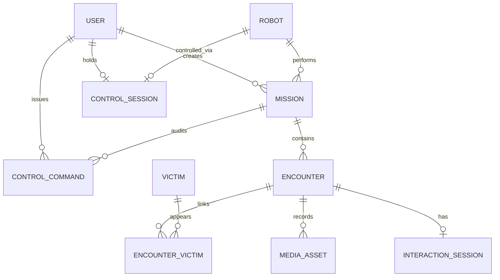
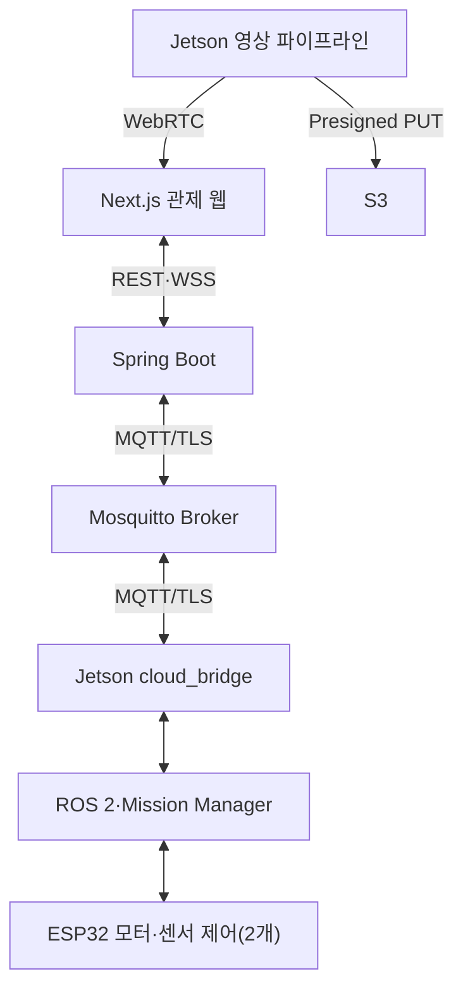
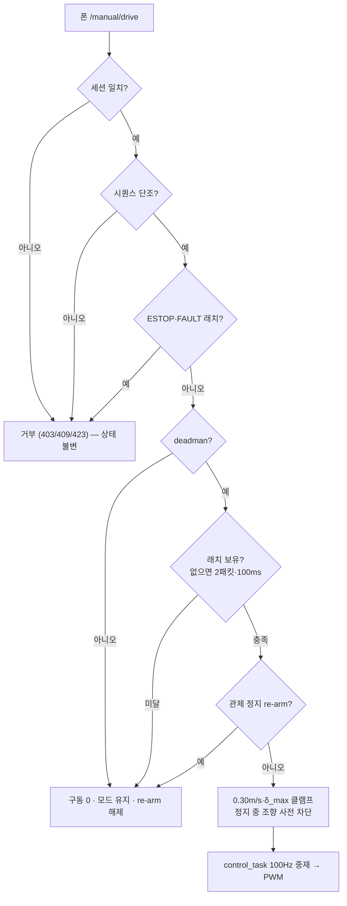
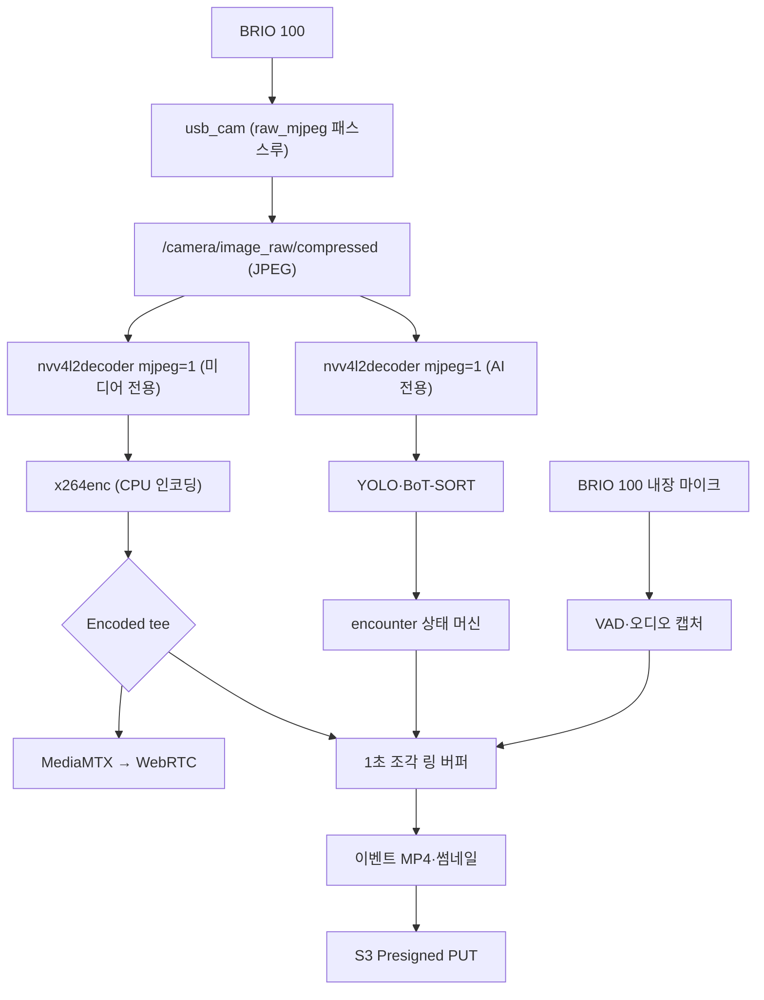
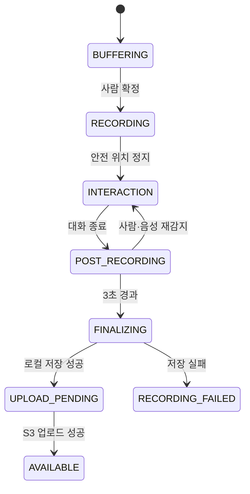

> Sentinel UGV 통합 명세서 v2.1의 일부 — 문서 규칙·버전·변경 이력은 [README](README.md) 참조

# 10. 영상 스트리밍 및 이벤트 녹화 [확정]

> 이 장은 요약이다. 스트리밍 파이프라인·3초 링 버퍼·녹화 상태 머신의 규범(상세)은 **32장 「영상 스트리밍·3초 링 버퍼·이벤트 녹화 설계」**다.

핵심 결정은 다음과 같다.

| **항목** | **결정** | **상세** |
|----------|----------|----------|
| 카메라 단일 오픈 | `usb_cam` 노드만 BRIO 100을 열고(MJPEG 패스스루), `/camera/image_raw/compressed` 토픽 하나로 AI·WebRTC·이벤트 녹화에 분기한다 | 32-3 |
| 스트리밍 경로 | 로컬은 Jetson MediaMTX → 동일 Wi-Fi 브라우저 WHEP(WebRTC), 원격(Jetson → EC2 MediaMTX → 외부 브라우저)은 선택 기능이며 자동 전환 없이 운영자가 경로를 선택한다 | 32-4 |
| AI 오버레이 | **미구현으로 종료했다.** 설계는 「bbox 메타데이터를 WebSocket 별도 전달 → 투명 Canvas 합성, `frameId`/`capturedAt` 동기화, 실패 시 젯슨 합성 영상 fallback」이었으나 어느 것도 구현하지 않았다 — 프런트에 canvas·bbox 렌더링이 없고(`VideoPanel.tsx` 는 텍스트 오버레이 한 줄), 탐지 박스를 나르는 STOMP 목적지도 없다. 화면의 탐지 정보는 텍스트로 대체했다 | 32-8 |
| 이벤트 링 버퍼 | 1초 단위 H.264 조각을 순환 보관(최소 8개)하고, encounter 확정 시 `확정 전 3초 + 접근·음성 상호작용 전체 + 종료 후 3초`를 MP4 remux + thumbnail.jpg로 만들어 S3 업로드 또는 로컬 pending 저장한다. 영상 길이는 고정 15초가 아니다 | 32-5 |
| encounter 단위 | 여러 사람은 하나의 encounter 영상에 기록하되 사람별 track과 응답 상태는 개별 저장하고, 같은 encounter가 지속되면 새 파일을 반복 생성하지 않고 기존 녹화 세션을 유지한다 | 32-6 |
| 일반 장애물 우회 | 영상 저장 대상에서 제외하고 TimescaleDB에 횟수만 기록한다 | 10.5 |

## 10.1 BRIO 100 입력 검증
```bash
sudo apt update
sudo apt install -y v4l-utils
v4l2-ctl --list-devices
v4l2-ctl --device=/dev/video0 --list-formats-ext
```

실측 결과(`/dev/video0`, 1280×720 MJPEG 약 29.93 FPS)는 6.1 부품 활용 상태 표를 따른다. ROS 2 카메라 토픽과 X4 Pro `/scan`의 동시 구동, HW MJPEG 디코딩 10분 연속 검증은 완료했다(PoC-A). PoC-B와 통합 부하 시험으로 x264 인코딩을 15FPS·1500kbps로 확정했다.

> **실측·PoC 기준선**: 파이프라인 엘리먼트 선택과 측정 결과의 1차 기록은 [`jetson/streaming_poc/README.md`](../jetson/streaming_poc/README.md)다. 32장의 설계값과 실측이 어긋나면 실측을 우선하고 32장을 갱신한다.

## 10.5 저장 대상

MVP의 이벤트 영상 녹화 대상은 **PERSON_ENCOUNTER 하나**다. E-Stop·충돌 정지의 영상 저장은 32장 녹화 상태 머신에 별도 경로 설계가 필요하므로 확장 기능으로 분류한다.

| **이벤트**          | **스냅샷** | **영상**      | **DB 기록**              |
|---------------------|------------|---------------|--------------------------|
| PERSON_ENCOUNTER    | 예         | 예 (MVP)      | 인원·위치·응답·상호작용  |
| E_STOP              | 선택       | 확장          | 발생 주체·상태·해제 시각 |
| COLLISION_STOP      | 선택       | 확장          | 최소 거리·속도           |
| SENSOR_DISCONNECTED | 아니오     | 아니오        | 센서 종류·복구 시각      |
| NORMAL_AVOIDANCE    | 아니오     | 아니오        | 횟수 또는 시계열 상태만  |

스트리밍·링 버퍼·녹화 상태 머신의 상세 설계와 장애 처리, 검증 항목(VID-01~VID-13)은 32장을 규범으로 한다.

# 11. 통합 관제 웹 시스템 [확정]

> 이 장은 요약이다. 관제 화면 구조·표시 우선순위·영상/지도 동기화·위험 조작 보호의 규범(상세)은 **28장(Next.js 관제 화면 상세 설계)** 을 따른다. 이 장에는 페이지·입력 매핑 등 고유 확정 사항과, 다른 장이 참조하는 제어권 세션(11.4)·버튼 활성화 조건(11.5)·MVP 접근 범위(11.6)만 남긴다.

핵심 결정은 다음과 같다.

- **페이지 구성 (v2.0 정정)**: `/`(메인 관제: 실시간 영상, 실시간 SLAM 지도, 운행 모드, 임무 상태·명령, 센서), `/blackbox`(임무 이력: 임무 목록, 임무 지도·궤적·발견 마커, 시계열 그래프, 이벤트 영상). **관제 화면은 이 둘이다.** 라우트는 하나 더 있으나(`/blackbox-experiment`) 목 데이터로 도는 참조 구현이며 관제 경로가 아니다. 화면별 핵심 정보·행동은 28.1을 따른다.

  v1.1은 `/control`·`/missions`·`/missions/{id}`·`/settings` 4개를 규정했다. 관제 화면을 간소화하기로 결정해 `/`와 `/blackbox` 둘로 합쳤다(S15P11A301-196·197·200·212·223·227). `/settings`는 만들지 않았다 — 조정할 값(탐사 시간·속도 제한·게임패드 보정)이 전부 로봇 쪽 판단이거나 폐기됐다.
- **실시간 관제 레이아웃 (v2.0 정정)**: 상단 바(연결 표시등·시계·임무 이력 링크) → 본문 좌측 메인 패널(WebRTC 실시간 영상 또는 실시간 SLAM 지도, 서로 교체 가능) → 우측 사이드바(작은 패널 = 메인의 반대쪽, 운행 모드 토글, 임무 상태·명령 버튼, 센서 온습도) 순으로 구성한다. 표시 우선순위는 28.2를 따른다.

  v1.1 레이아웃에서 뺀 것과 근거다.

  | 뺀 것 | 근거 |
  |---|---|
  | 조이스틱 | 조종 수단이 모바일 앱으로 정해져 관제 웹에 조종 입력이 없다(S15P11A301-196·197) |
  | 배터리 | `/battery_state` 계측 경로가 없다. 근거 없는 값을 표시하지 않는다(S15P11A301-223) |
  | 경과 시간·잔여 탐사 시간 | 서버에 없는 프런트엔드 상수(7분)를 근거로 화면이 상태를 만들어 내고 있었다(S15P11A301-223) |
  | CPU/GPU·지연·전압 스트립 | telemetry에 있으나 관제자의 판단을 돕지 않는다. 임무 이력의 시계열 그래프로 옮겼다 |
  | 이벤트 타임라인 | 탐지 알람을 영상 오버레이 한 줄로 대체했다(S15P11A301-200) |
  | 구성요소 상태 표시 | 노출되는 상태가 실제 노드 생존과 무관했다(S15P11A301-223) |
  | **속도·각속도** | **v2.0-r3 확정(S15P11A301-214).** 실측값이 오게 됐지만(#205 가 `linearVelocity`·`angularVelocity` 를 노출) 넣지 않는다 — 관제자의 행동을 바꾸지 않는다. 로봇이 움직이는지는 실시간 지도의 화살표로 보이고(#227), 속도 상한은 로봇이 강제하며(24.2) 관제자에게 조절 수단이 없고, 비정상 감속·정지는 임무 상태로 드러난다. 배터리·방위각을 뺀 것과 같은 기준이다. **DB·임무 이력 그래프에는 남긴다** — 사후 주행 품질 분석(S15P11A301-248)에 쓰는 값이다 |

  남긴 것 중 **탐지 표시는 영상 오버레이로 통일했다** — 영상·지도·탐지가 같은 형식(`OverlayLine`)을 쓴다. 같은 종류의 정보를 다른 모양으로 보여주지 않기 위한 것이다(S15P11A301-200).
- **게임패드 제어 — 폐기됨(S15P11A301-298).** 아래 매핑은 관제 웹에 조종 입력이 있다고 전제했으나 그 UI 는 삭제됐고(28장), 조종 수단은 폰 → 모터 ESP32 직결로 확정됐다. 남겨 두는 것은 이력이며 **구현 대상이 아니다.** 특히 `B=일반 정지` 는 이제 모바일 페이지의 ■정지 버튼이고, 그것은 바퀴만 세울 뿐 **MANUAL 을 벗어나지 않는다**; `연결 해제=수동 종료` 도 성립하지 않는다 — 수동을 벗어나는 길은 관제 「자율」 하나뿐이다(04장 14.2). 실제 조종 계약은 31-13 의 HTTP 엔드포인트 표다.
  <details><summary>폐기된 원문</summary>

  이 게임패드 매핑은 폐기됐다. 현재 주행 입력은 폰이 모터 ESP32의 모바일 페이지에 Wi-Fi로 직결해 보내고, 관제 웹은 MANUAL/AUTO 권한 전환만 담당한다.
  </details>

> **전륜 서보 조향에서는 모바일 스틱을 좌우로만 밀어도 로봇이 회전하지 않는다.** 모터 ESP32는 전진·후진 성분이 최소값보다 작으면 조향 입력을 무효화한다. 모바일 페이지는 이 경계를 같은 상수 사본으로 표시하며, 펌웨어 상수를 바꾸면 페이지의 `MANUAL_MAX_DRIVE_MMPS`·`STEERING_MAX_MDEG`·`STEERING_MIN_DRIVE_MMPS`도 함께 갱신한다.

## 11.4 제어권 세션
Spring Boot에는 `POST/DELETE /api/v1/control-sessions`와 `control_sessions` 테이블이 구현돼 있고 세션 TTL은 Java 상수 10분이다. 그러나 현재 프런트엔드는 이 API를 사용하지 않으며 임무 명령 API도 세션 ID를 검증하지 않는다. 실제 모바일 수동 조종은 백엔드를 우회하고 모터 ESP32의 로컬 `sid`·250ms TTL로 단일 접속을 제한한다. 따라서 Control Session은 **존재하지만 현재 주행 제어권을 강제하지 않는 미연결 기능**이다.

## 11.5 버튼 활성화 조건
| **버튼**    | **활성 조건**              | **결과 상태**              |
|-------------|----------------------------|----------------------------|
| 탐사 시작   | SAFE_IDLE + 핵심 장치 정상 | EXPLORING                  |
| 일시정지    | EXPLORING 또는 RETURNING   | PAUSED                     |
| 탐사 재개   | PAUSED + 핵심 장치 정상    | EXPLORING                  |
| 수동 전환   | **진행 중 임무 존재** + ESTOP·ERROR 아님 | MANUAL (주행 중이면 PAUSED 자동 경유, 14.2) |
| 자율        | **진행 중 임무 존재** + ESTOP·ERROR 아님 | PAUSED (탐사 재개는 명시적 재개 버튼으로만). **보드가 500ms 안에 수동 입력을 봤으면 거부되고 `MANUAL_INPUT_ACTIVE` 가 회신된다** |
| ~~복귀~~    | 현재 버튼 없음             | 자동 복귀 미구현           |
| 임무 종료   | 진행 중 임무 존재          | STOP 전송 후 COMPLETED     |
| E-Stop 상태 | 상태 표시만                | 소프트웨어 latch 상태만 표시한다. 물리 E-Stop 은 미도입(03장 34-10) |

「수동 종료」를 **「자율」로 개명**했다(S15P11A301-298). 그 버튼이 하는 일은 수동을 끝내는 것이 아니라 **자율 권한을 되찾는 것**이고, 되찾기에 실패할 수 있다.

활성 조건에서 「게임패드 연결」이 빠진 것은 그 장치가 경로에 없기 때문이다. 대신 **진행 중 임무**를 요구한다 — 모드 전환은 임무를 만들지 않으며, 임무가 없으면 보낼 곳이 없다. 두 버튼은 조건을 못 맞춰도 **숨기지 않고 비활성으로 둔다**: 「자율」은 수동을 벗어나는 유일한 길이라 사라지면 조작자가 무엇을 눌러야 할지 알 수 없다.

수동 중에는 「탐사 시작」·「탐사 종료」 같은 임무 버튼을 내지 않는다. 수동 중 「탐사 종료」는 젯슨을 `COMPLETED` 로 보내지만 모터 보드는 여전히 래치를 쥐고 있어 폰이 계속 로봇을 굴린다 — 화면에는 「완료」가 떠 있는데 로봇이 달리는 상태이며, 버튼이 없는 것보다 나쁜 불일치다.

## 11.6 MVP 접근 범위
현재 로그인·사용자 테이블·애플리케이션 인증은 구현하지 않았다. `/api/**`, `/ws/**`, Swagger와 actuator 경로는 `permitAll()`이며 CORS와 배포 네트워크 경계에 의존한다. S3 객체는 직접 공개하지 않고 10분 presigned URL로 업로드·조회한다. 공개 배포 전에 Security Group·프록시 접근 제한과 36장 보안 조치를 적용해야 한다.

상세 설계는 28장을 따른다: 현재 2개 화면 구조(28.1), 실시간 표시 우선순위(28.2), 영상·지도 동기화(28.3), 폐기된 게임패드 경계와 모바일 수동 조종 안내(28.4~28.5), 실패 표현(28.6).

# 12. 통신 프로토콜 및 API [확정]

> **규범 선언** 이 장은 요약이다. 통신 계약(REST 경로·MQTT 토픽·메시지 스키마·ACK·오류 코드)의 유일한 규범(상세)은 **31장**이며, 본 장과 31장이 다르면 31장을 따른다.

핵심 결정은 다음과 같다.

- 모든 REST 경로는 `/api/v1` 접두를 사용하고, MQTT·WebSocket 메시지는 `messageType`/`data` 공통 봉투를 사용한다 (31-5, 31-7).
- 소프트웨어 E-Stop 채널 이름은 `cmd/estop`과 `/app/robots/{robotId}/estop`으로 설계돼 있으나 **현재 생산자·구독자·관제 버튼이 없어 미사용**이다. 실제 차단은 모터 ESP32 fault·watchdog 경로와 `collision_monitor` 가 담당한다(물리 E-Stop 은 미도입 — 03장 34-10).
- 시계열 텔레메트리는 REST 조회가 아니라 MQTT/STOMP 실시간 스트림과 TimescaleDB 조회 API(27장)로 제공한다.
- 모바일 수동 주행의 `lin`·`ang`은 **-1000~1000 정규화 정수**이며 모터 ESP32가 속도·바퀴 조향각 상한으로 매핑한다. Jetson과 백엔드는 이 패킷을 거치지 않는다.
- 백엔드 Control Session은 중복 예약만 막는 미연결 기능이고, 실제 단일 모바일 접속은 모터 ESP32의 로컬 `sid`가 제한한다. 둘 다 사용자 인증은 아니다.

## 12.1 통신 채널
| **채널**         | **용도**                                 | **특성**                  |
|------------------|------------------------------------------|---------------------------|
| MQTT 5 over TLS  | Jetson↔EC2 상태, 이벤트, 명령, ACK      | QoS·retain·LWT·재연결     |
| REST/HTTPS       | 임무·이력 조회, 미디어 업로드 준비       | 요청-응답, 멱등성         |
| STOMP over WSS   | Next.js↔Spring 실시간 상태·제어 중계     | 브라우저 구독·heartbeat   |
| WebRTC/WHEP      | 영상 스트리밍                            | 저지연, 영상 경로 분리    |
| S3 Presigned URL | Jetson의 파일 직접 업로드/브라우저 조회  | AWS 키 비노출, 제한 시간  |
| ROS2 DDS         | Jetson 내부 노드 간 통신                 | 토픽·서비스·액션          |
| USB Serial ×2    | Jetson↔ESP32 모터 제어(좌·우 목표 속도·fault), Jetson↔ESP32 센서 제어(엔코더·IMU·DHT11·초음파) | native CDC/USB-UART, CRC·sequence·300ms timeout |

## 12.2 상세 규범 포인터
계약별 전체 표·JSON 스키마·예시는 31장 해당 절만 참조한다.

| **항목**                  | **요약**                                                                                   | **규범 절** |
|---------------------------|--------------------------------------------------------------------------------------------|-------------|
| REST API 전체 표          | `/api/v1` 임무·경로·이벤트·encounter·제어권·미디어 엔드포인트. 임무 명령(START/PAUSE/RESUME/RETURN/STOP)과 모드 전환(MANUAL/AUTO)은 `202 Accepted` 후 ACK로 완결 | 31-7        |
| 메시지 공통 봉투          | `messageType`·`messageId`·`schemaVersion`·`robotId`·`missionId`·`sequence`·`sentAt`·`data` | 31-5        |
| MQTT 토픽·QoS·retain·LWT  | 토픽 규칙과 연결 상태 관리                                                                 | 31-4        |
| 수동 주행 명령            | **구현자 없음.** 폰이 모터 ESP32 에 HTTP 로 직결한다(S15P11A301-298)                        | 31-13       |
| 명령 ACK                  | `COMMAND_ACK` — `ACCEPTED/EXECUTED/REJECTED/EXPIRED/FAILED`                                 | 31-6        |
| 관제 웹 WebSocket(STOMP)  | 브라우저 구독·발행 목적지                                                                  | 31-8        |

## 12.3 오류 코드
| **코드**             | **의미**                | **처리**                 |
|----------------------|-------------------------|--------------------------|
| DEVICE_OFFLINE       | Jetson 연결 끊김        | 제어 비활성화, 상태 경고 |
| LIDAR_UNAVAILABLE    | LiDAR 데이터 없음       | 자율주행 중단·정지       |
| LOCALIZATION_LOST    | 위치 신뢰도 저하        | PAUSED 또는 ERROR        |
| MOTOR_NO_RESPONSE    | 모터 드라이버 응답 없음 | ESTOP                    |
| ~~GAMEPAD_DISCONNECTED~~ | 폐기된 관제 게임패드 코드 | 사용하지 않음. 모바일 입력 중단은 보드 250ms TTL이 처리 |
| CONTROL_SESSION_DENIED | 다른 세션이 제어권 보유 | 조회 전용                |
| S3_UPLOAD_PENDING    | 파일 업로드 대기        | 로컬 보관 후 재시도      |
| STREAM_LOCAL_FAILED  | 로컬 스트림 실패        | 경고 표시 후 운영자가 LOCAL/REMOTE 선택 |

REST 오류 응답 봉투(`code`·`message`·`traceId`·`occurredAt`)는 27.5를 따른다.

# 13. 데이터베이스·시계열·S3 설계 [확정]

> 이 장은 요약이다. 저장소 책임·핵심 관계·데이터 무결성·Outbox 전송·시계열 보존·S3 key 규칙의 규범(상세)은 29장을 따른다. 테이블 필드 상세는 `encounters`·`encounter_victims`·`detections`가 30.6.4, `interaction_sessions`·`interaction_turns`가 33-6이다.

핵심 결정:

- 하나의 PostgreSQL 인스턴스에 TimescaleDB 확장을 설치해 일반 테이블과 hypertable을 함께 사용한다. 별도 제품 이중 운영이 아니다 (29.1).
- 영상·지도·rosbag 같은 대용량 파일은 S3에 저장하고 DB에는 경로와 메타데이터만 저장한다.
- 모든 일반 테이블의 PK는 UUID를 사용하며, QoS 1 중복은 서버에서 멱등 처리한다 (29.3).
- 미디어 파일 상태는 `media_assets.storage_status` 단일 컬럼으로 관리한다 (13.6).
- 시계열은 **조회 시점의 `time_bucket` 구간 집계**로 계산하고 일반 테이블과 JOIN해 이벤트 시점의 센서 상태를 조회한다. **Continuous Aggregate 는 미적용이고 retention·다운샘플 정책도 DB 에 설정하지 않았다**(29.5 는 정책값이며 집행은 수동이다).

## 13.2 PostgreSQL 일반 테이블
| **테이블**       | **주요 필드**                                                         | **용도**                |
|------------------|-----------------------------------------------------------------------|-------------------------|
| users            | id, username, password_hash, display_name, role, last_login_at, created_at | 관제 운영자 계정·인증 — **미생성** |
| robots           | id, name, status, last_seen_at, `control_mode`                        | 로봇 등록과 현재 상태. `control_mode`(V10, S15P11A301-350)는 **임무와 무관한** 자율·수동이며 `NULL` 은 「모름」이다 — 04장 26.3 |
| missions         | id, robot_id, created_by_user_id, status, started_at, ended_at, home_pose, end_reason | 임무 생명주기           |
| mission_results  | mission_id, duration_sec, distance_m, coverage, detection_count       | 임무 요약               |
| events           | id, mission_id, message_id, type, severity, occurred_at, payload_json  | **현재 유일한 적재원은 음성 상호작용 보고 원문**(`InteractionReportWriter`). E-Stop·오류 적재 경로는 없다 |
| encounters       | id, mission_id, map_id, status, map_x, map_y, map_yaw, detected/responsive/unresponsive_person_count, interaction_summary, started_at, interaction_started_at, interaction_ended_at, ended_at, termination_reason, voice_encounter_pose·additional_person_reports(V7) | 사람 그룹 발견 단위     |
| victims          | id, latest_status, first_seen_at                                       | 피해자 후보             |
| detections       | id, mission_id, encounter_id, victim_id, track_id, class, confidence, map_x, map_y, position_quality, pose_status, observed_at | AI 관측 원본 (pose_status는 `NORMAL`·`FALLEN` 2값, 25.6) |
| encounter_victims| encounter_id, victim_id, track_id, response_status, first_seen_at, last_seen_at | encounter-피해자 연결   |
| interaction_sessions | id, encounter_id(UNIQUE), status, response_scope, any_response_detected, reported_responsive_count, count_confidence, mobility_status, urgent_condition_reported, operator_review_required, started_at, ended_at, termination_reason, summary | 음성 상호작용 세션 — **미생성** |
| interaction_turns| id, session_id, turn_index, question_code, transcript, stt_confidence, llm_schema_valid, parsed_value, parse_status, tts_text, retry_count, audio_media_id | 질문·응답 기록 — **미생성** |
| control_commands | id, mission_id, issued_by_user_id, command_id, type, requested_at, result, sequence, reason_code(V6) | 제어 감사 로그          |
| maps             | id, mission_id, s3_key_pgm, s3_key_yaml, created_at                   | 저장 지도               |
| media_assets     | id, mission_id, encounter_id, type, s3_key, storage_status, duration_ms, triggered_at, interaction_started_at, interaction_ended_at, pre_buffer_sec, post_buffer_sec, termination_reason, created_at, sha256·size_bytes(V3) | S3 미디어 메타데이터    |
| control_sessions | robot_id, user_id, session_id, expires_at                             | 단일 제어권             |

- 모든 일반 테이블의 PK는 UUID를 사용한다. `encounters`·`media_assets` 필드 상세 정의는 30.6.4, `interaction_sessions`·`interaction_turns`는 33-6을 따른다.
- `interaction_sessions.encounter_id`는 UNIQUE이며, encounter당 음성 세션은 0..1개다(32-6 참조).
- `users`는 관제 운영자 계정 테이블이다. `role`은 `ADMIN`·`OPERATOR`이며 `password_hash`는 단방향 해시로 저장한다. 제어권과 제어 명령은 `control_sessions.user_id`·`control_commands.issued_by_user_id`로 조작 주체를 식별한다.

> **v2.0: `users`·`interaction_sessions`·`interaction_turns` 세 테이블은 생성되지 않았다.**
> `V1__init_schema.sql` 둘째 줄이 이 셋을 MVP 범위 밖으로 명시적으로 제외한다. 나머지
> 17개 테이블은 **전부 `V1__init_schema.sql` 하나에** 있고, V2~V10 은 컬럼 추가와 제약 완화다.
>
> 그 결과 인증이 없고(36-4), 음성 상호작용 결과는 DB 대신 `/interaction/report` 토픽과
> encounter 요약으로만 남는다. 정의는 향후 설계로 유지하되 **미생성임을 표기한다** —
> 있다고 읽고 조회 쿼리를 짜면 런타임에서야 없는 것을 알게 된다.
- `detections`는 매 프레임 시계열이 아니라 encounter 판정에 사용되는 선별 관측 로그이므로 hypertable이 아닌 일반 테이블로 둔다. 설계는 Jetson 생성 UUID 를 `id`(PK)로 써 QoS 1 중복을 멱등 처리하고 `encounter_id`·`victim_id` 로 연결하는 것이었다. **현재 상태: 테이블은 생성됐지만 적재 경로가 없어 항상 0행이다** — 백엔드에 쓰기 코드가 없고(`EncounterQueryService` 가 MVP 범위 밖으로 명시), MQTT 핸들러에 탐지 messageType 도 없다. 탐지 결과는 젯슨 로컬 `events.jsonl` 에만 남는다(07장 25.6).

## 13.3 TimescaleDB hypertable
| **테이블**             | **주기**    | **주요 필드**                                                  | **용도**         |
|------------------------|-------------|----------------------------------------------------------------|------------------|
| robot_pose             | 2~5Hz       | time, mission_id, x, y, yaw, linear_velocity, angular_velocity | 경로와 이동 거리 |
| robot_metrics          | 1Hz         | battery, voltage, cpu, gpu, memory, jetson_temp, state, mcu_connected(V5), recorder_ok·recorder_last_failure(V8), motor_link_ok(V9) | 시스템 상태      |
| environment_metrics    | 0.2~0.5Hz   | temperature, humidity                                          | 환경 이력        |
| network_metrics        | 1Hz         | latency_ms, packet_loss, connection_state, stream_mode         | 통신 품질        |
| safety_events          | 이벤트      | min_distance, cmd_vel_linear, cmd_vel_angular, stop_reason     | 안전 정지 분석   |

시계열 활용·보존·다운샘플의 상세는 29.5를 따른다.

## 13.5 S3 객체 구조
버킷은 `s3://sentinel-ugv-assets/`를 사용하며 `missions/{missionId}/` 하위에 encounters·maps 를 둔다(지도는 `maps/{mapId}/map.pgm` 로 한 단계 더 들어간다). **`rosbags/`·`reports/`·`transcript.json` 은 생성 코드가 없다.** object key 규칙의 규범은 29.6이다.

> **note: S3 호환 스토리지로 MinIO를 사용한다.** EC2에 자체 호스팅하며 `https://s3.sentinel-ugv.xyz`(Nginx TLS)로 접근한다. 버킷명·object key 규칙·Presigned URL 등 본 설계는 그대로 유지하고, 클라이언트는 path-style 접근(`forcePathStyle=true`)을 사용한다. 구성 절차는 `docs/private-docs/minio-s3-setup.md` 참조.

## 13.6 업로드 상태 머신
| **상태**   | **의미**                       | **다음 동작**             |
|------------|--------------------------------|---------------------------|
| PENDING    | DB 이벤트 생성, 파일 로컬 존재 | Presigned URL 요청        |
| ~~UPLOADING~~ | **서버가 쓰지 않는다** — PUT 이 원자적이라 관측 불가 | — |
| AVAILABLE  | S3 업로드 완료                 | 조회 URL 발급 가능        |
| FAILED     | 업로드 실패                    | 백오프 후 재시도          |
| ~~LOCAL_ONLY~~ | **서버가 쓰지 않는다** — 젯슨 로컬 `pending` 개념이며 DB 값이 아니다 | — |

상태 컬럼명은 `media_assets.storage_status`로 통일한다 (31-7·32장과 동일). 전송·재시도 흐름은 29.4를 따른다.

## 13.7 보존 정책
원본 시계열과 장기 집계의 보존·다운샘플 기준은 29.5를 따른다. 시계열 외 데이터의 보존은 다음과 같다.

| **데이터**              | **보존**                    |
|-------------------------|-----------------------------|
| 임무·안전 이벤트·제어 명령 | 프로젝트 기간, 종료 후 정책에 따라 삭제 |
| 피해자 영상·음성·대화      | 시연 목적 최소 기간 후 삭제                 |
| 일반 rosbag             | 필요 임무만 수동 보관       |
| Jetson pending 파일     | 업로드 완료 후 자동 삭제    |

# 27. Spring Boot 관제 백엔드·도메인·API 상세 설계

## 27.1 책임 경계

Spring Boot는 로봇을 실시간 폐루프로 제어하지 않는다. 임무·운영자·명령 이력·실시간 관제 전달·데이터 저장을 담당하며, 안전 판단과 최종 모터 권한은 Jetson·ESP32에 남긴다.

## 27.2 모듈 구조

```text
backend/
├─ mission/          # 임무 생성·상태·요약
├─ robot/            # 등록·presence·health
├─ control/          # 제어 세션·명령·ACK·감사 로그
├─ encounter/        # 피해자 발견·응답·미디어 연결
├─ telemetry/        # TimescaleDB 쓰기·조회
├─ media/            # S3 Presigned URL·상태
├─ realtime/         # STOMP/WebSocket 브로드캐스트
├─ messaging/        # MQTT 구독·발행·멱등 처리
├─ ~~security/~~      # **미구현 — 인증·권한·감사 없음.** `SecurityConfig` 는 `common/config/` 에 있고 `/api/**` 를 permitAll 한다(11.6·36-4)
└─ common/           # 오류·시간·ID·검증
```

## 27.3 핵심 도메인 규칙

- 한 로봇에는 동시에 하나의 활성 임무만 존재한다.
- 한 로봇에는 동시에 하나의 유효 control session만 존재한다.
- 로봇이 보낸 임무 상태와 서버 명령 상태를 분리해 저장한다.
- 이벤트는 `messageId` 또는 도메인 id의 unique constraint로 중복 삽입을 막는다.
- S3 업로드 성공 전에도 DB 이벤트는 `PENDING` 으로 조회 가능하다(서버가 쓰는 상태는 `PENDING`·`AVAILABLE`·`FAILED` 셋이다 — 13.6).
- 서버가 임의로 `COMPLETED`를 만들지 않고 로봇의 종료 결과와 증빙을 확인한다.

## 27.4 REST API 기준

| Method | Endpoint | 목적 |
|---|---|---|
> **REST API 전체 표의 규범은 31-7 이다.** v1.1 에서 이 자리에 있던 표가 31-7 과 달라(`/trajectory` 유무 등) 어느 쪽이 맞는지 알 수 없었으므로, 표를 중복해 두지 않고 31-7 하나만 둔다. v2.0 이 이 포인터를 「27.4가 규범」으로 적었는데 27.4 는 헤더만 있는 빈 표여서 두 절이 서로를 규범이라 가리키고 있었다.

제어 API가 HTTP 202를 반환한 것은 로봇이 동작을 완료했다는 뜻이 아니다. 응답 `data` 에 `commandId` 와 `status: PENDING` 을 담아 반환하고(`ApiResponse` 봉투 안이다 — 27.5), 실제 수락·실행 결과는 ACK 상태로 갱신한다.

## 27.5 오류 응답

```json
{
  "status": "CONTROL-001",
  "message": "다른 운영자가 제어권을 보유 중입니다.",
  "data": null
}
```

봉투는 `ApiResponse<T>` 의 `status`·`message`·`data` 3필드이며, 실패 시 `status` 에 `ErrorCode` 의 코드(`CONTROL-001` 형태)가 들어간다. **`traceId`·`occurredAt` 은 구현하지 않았다** — v1.1 이 규정했으나 코드에 없다.

내부 예외·AWS 키·SQL 문장은 클라이언트에 노출하지 않는다.

## 27.6 백엔드 인수 기준

- MQTT QoS 1 중복 메시지를 2회 받아도 DB 행과 웹 이벤트는 1회만 생성된다.
- 명령 요청부터 ACK까지 상태가 추적된다.
- Control Session 중복 발급과 만료 정리가 동작한다. 단, 현재 임무·수동 명령 강제에는 연결되지 않았음을 함께 확인한다.
- 임무 상세에서 경로·시계열·encounter·미디어를 함께 조회할 수 있다.
- DB·S3 일부 장애가 다른 API 전체를 무한 대기시키지 않는다.

# 28. Next.js 관제 화면 상세 설계

> **v2.0: 장 제목에서 "조이스틱 UX"를 뺐다.** 조종 수단이 모바일 앱으로 정해져 관제 웹에는 조종 입력이 없다(S15P11A301-196·197). **두 파일은 이미 삭제됐다** — `frontend/features/control/` 디렉터리 자체가 없다(S15P11A301-298 에서 확인. 종전 이 문장은 「파일로는 남아 있다」고 주장하는 스테일 기술이었다). 모바일 앱이 ESP32로 직접 신호를 보내는 경로이므로 관제 웹의 역할은 관측과 임무 명령(START/PAUSE/RESUME/RETURN/STOP), 그리고 **모드 전환(MANUAL/AUTO)** 까지다. 모드 전환은 조종이 아니라 **누가 바퀴를 소유하는가**를 바꾸는 것이며, 특히 「자율」은 관제만이 가진 권한이다 — 폰에는 수동을 벗어나는 버튼이 없다.

## 28.1 화면 구조

| 화면 | 핵심 정보 | 핵심 행동 |
|---|---|---|
| `/` 실시간 관제 | 영상, 실시간 지도, 임무·MCU·녹화 상태, 온습도, 탐지 오버레이 | 시작·일시정지·재개·종료, MANUAL/AUTO 모드 전환 |
| `/blackbox` 임무 이력 | 임무 목록·경로·encounter·미디어·주행/환경 시계열 | 임무 선택, 증빙 재생·조회 |

## 28.2 실시간 관제 우선순위

운영자는 화면을 읽기 전에 위험을 알아야 한다. 상단 고정 영역에 다음을 항상 표시한다.

- `ROBOT STATE`와 서버 연결 상태를 분리 표시
- E-Stop 상태(임무 상태 `ESTOP` 하나로 표시한다. **물리 E-Stop 은 미도입이고 소프트웨어 채널은 미사용**이라 이 값은 실제로 세워지지 않는다 — 03장 34-10, 아래 11.5)
- MCU·녹화 상태와 온습도 신선도
- 모바일 수동 조종 중임을 알리는 MANUAL/AUTO 모드
- 영상 지연·스트림 모드(LOCAL/REMOTE)

## 28.3 영상·지도 동기화

- **영상 위 AI 박스는 미구현이다**(10장). 탐지 정보는 영상 위 텍스트 한 줄로 대체했으므로 `frameId`/`capturedAt` 동기화·만료 폐기 규칙도 적용 대상이 없다.
- 실시간 지도는 격자와 로봇 pose 화살표를, 임무 이력 지도는 궤적과 encounter 마커를 그린다. **home 과 현재 Frontier 는 표시하지 않는다.**
- encounter 마커를 클릭하면 피해자 수·응답 상태·스냅샷·영상을 연다.

## 28.4 게임패드 UX [폐기]

관제 웹의 Gamepad Provider와 조종 컴포넌트는 삭제됐다. 현재 관제는 MANUAL/AUTO 모드만 전환하고 실제 주행 입력은 모터 ESP32가 제공하는 모바일 페이지에서 받는다. 모바일 페이지는 누르고 있는 동안 20Hz deadman 패킷을 보내며, 입력 중단 시 보드의 250ms TTL이 구동을 멈춘다.

## 28.5 위험 조작 보호

| 조작 | 보호 방식 |
|---|---|
| 탐사 시작 | preflight 결과 확인 |
| 수동 전환 | 진행 중 임무와 정상 상태를 확인하고 MANUAL 전송. 실제 조종은 모바일 페이지임을 안내 |
| 자율 전환 | 최근 모바일 입력이 있으면 보드가 `MANUAL_INPUT_ACTIVE`로 거부. 성공해도 PAUSED에 착지 |
| 임무 종료 | STOP 확인 후 COMPLETED. 자동 복귀로 표현하지 않음 |
| E-Stop | 관제는 상태만 표시. **물리 버튼은 미도입**이므로 실제 차단은 모터 ESP32 fault·watchdog 과 `collision_monitor` 가 담당하고, 하드웨어 차단은 12V 배터리 연결 분리뿐이다(03장 34-10) |

## 28.6 접근성과 실패 표현

색상만으로 상태를 표현하지 않고 텍스트·아이콘을 함께 사용한다. 네트워크가 끊겼을 때 마지막 상태가 정상처럼 보이지 않도록 `STALE`과 마지막 수신 시각을 표시한다. 로딩·데이터 없음·권한 없음·장애를 서로 다른 화면 상태로 처리한다.

**「없음」을 한 가지로 뭉치지 않는다.** 데이터가 없는 이유가 다르면 대응도 다르다 — 영상 없는 발견을 실패·업로드 전·판정 근거 없음으로 나눠 말하는 규칙이 그 사례이며 32-5에 있다(S15P11A301-311). 특히 `null`을 「정상」으로 그리지 않는다. 값이 없다는 것은 판정할 근거가 없다는 뜻이고, 그것을 정상으로 보여 주면 화면이 조용히 거짓말한다.

## 28.7 글꼴 [확정 — S15P11A301-302]

본문은 **Asta Sans**(42dot, OFL 1.1), 고정폭은 **D2Coding**(NAVER, OFL 1.1)이다. 종전
Pretendard·JetBrains Mono 를 대체하고 CDN `@import` 를 자체 호스팅으로 옮겼다.

**D2Coding 에서 한글을 뺀 것이 이 절의 핵심이다.** 서브셋에 `U+AC00-D7A3` 을 넣지
않았으므로 `font-mono` 스팬 안의 한글은 스택 다음 자리의 Asta Sans 로 폴백한다.
"데이터 스트립만 고정폭"이라는 규칙이 개발자 규율이 아니라 폰트 스택 자체로
강제된다 — 이 UI 는 `font-mono` 를 78곳에서 쓰고 그중 16곳이 순수 한글 문장이라,
손으로 지키는 방식은 유지되지 않는다. **`frontend/scripts/build-fonts.sh` 의
`D2_RANGES` 에 한글 범위를 추가하면 이 보장이 조용히 깨진다.**

종전 상태가 이미 어긋나 있었다. `--font-mono` 가 정의되지 않아 JetBrains Mono 를
5굵기 받아 놓고 한 번도 쓰지 않았고, `font-mono` 는 Tailwind 기본 스택으로
떨어졌다. 그 스택에 한글이 없어서 한글 16곳이 OS 폰트로 갈렸다(Windows·macOS
불일치).

| 항목 | 값 | 근거 |
|---|---|---|
| Asta Sans 한글 | `U+AC00-D7A3` 11,172자 전부 | 폰트 파일 cmap 실측. 한자와 조합형 자모(`U+1100-11FF`)는 없다 |
| 숫자 정렬 | 기본 488~610/1000 → `tnum` 적용 시 593 | `tabular-nums` 가 실제로 동작하는 근거 |
| 자체 호스팅 | `frontend/public/fonts/` | CSS `@import` 는 렌더를 막고, 이 GCS 는 외부망 없는 로컬 시연에서 돈다 |
| 가변 vs 정적 | 가변 채택 | 이 UI 는 굵기 4개를 쓴다. 정적이면 384KB × 4 ≈ 1.5MB, 가변은 하나로 300~800 전부를 덮어 914KB |

실측 woff2 크기: Asta 한글 913.6KB / Asta 라틴 53.5KB / D2Coding 14.4KB(Bold
15.0KB), 합계 996.5KB. 종전 Pretendard 는 `unicode-range` 없이 9굵기를 통짜로
선언해 굵기당 748KB 였다.

`tabular-nums` 를 붙이는 자리는 **sans 문맥의 수치뿐이다.** 고정폭 스팬은 이미
자릿수가 맞아 중복이다. 현재 대상은 임무 목록의 시간·거리·탐지 수 한 줄이며,
임무 요약 스트립은 `font-mono` 라 대상이 아니다.

한글 서브셋은 `preload` 하지 않는다 — 914KB 가 첫 페인트 대역을 잡아먹는다.
라틴 서브셋과 D2Coding 만 `preload` 하고 한글은 `font-display: swap` 에 맡긴다.

**미확인:** 이 UI 는 `text-[9px]`·`text-[10px]` 한글을 많이 쓴다. Asta Sans 는
브랜드 서체라 그 크기에서 읽히는지는 실기 확인이 필요하다. 프런트 담당이 판단한다.

# 29. PostgreSQL·TimescaleDB·S3·Outbox 상세 설계

## 29.1 저장 책임

| 저장소 | 데이터 | 이유 |
|---|---|---|
| PostgreSQL | 로봇·임무·명령·encounter·피해자·미디어 메타데이터 | 관계·무결성·트랜잭션 |
| TimescaleDB 확장 | pose·환경·시스템·네트워크 시계열 | 시간 범위·집계 쿼리 |
| S3 | 영상·스냅샷·지도·선택 rosbag·보고서 | 대용량 객체 저장 |
| Jetson SQLite Outbox | 미전송 이벤트·메타데이터 | 네트워크 단절 복구 |
| Jetson 로컬 파일 | 업로드 대기 영상·지도 | S3 장애 복구 |

TimescaleDB는 별도 DB 서버가 아니라 PostgreSQL 인스턴스에 설치하는 확장으로 사용한다.

> **note:** "S3"는 S3 호환 스토리지 MinIO로 구현하며 `https://s3.sentinel-ugv.xyz`로 접근한다. S3 API·object key·Presigned 설계는 동일하다(13.5 note 참조).

## 29.2 핵심 관계



`USER`는 관제 운영자 계정이며, 조작 주체는 `MISSION.created_by_user_id`(임무 생성자), `CONTROL_COMMAND.issued_by_user_id`(명령 발행자), `CONTROL_SESSION.user_id`(제어권 보유자)로 식별한다. `CONTROL_SESSION`은 로봇 1대당 활성 1건으로 현재 제어권 보유자를 나타낸다.

시계열 행은 `mission_id`, `robot_id`, `time`을 공통으로 가진다. 임무 종료 후에는 요약 테이블을 계산한다.

## 29.3 데이터 무결성

- UUID는 생성 주체와 무관하게 충돌하지 않도록 사용한다.
- `message_id`, `command_id`, `encounter_id`, S3 object key에 unique constraint를 둔다.
- 임무·이벤트 시간은 UTC로 저장하고 UI에서 로컬 시간대로 표시한다.
- 미디어 DB 행과 S3 객체 상태를 `media_assets.storage_status`로 `PENDING → AVAILABLE/FAILED` 로 관리한다 (13.6·31-7·32장과 동일). **서버가 쓰는 상태는 이 셋뿐이다** — `UPLOADING` 은 PUT 이 원자적이라 관측할 수 없고 `LOCAL_ONLY` 는 젯슨 로컬 개념이다.
- DB 행을 삭제할 때 S3 객체 삭제 결과를 추적하는 tombstone 또는 삭제 job을 사용한다.

## 29.4 Outbox 전송

```text
로컬 사건 발생
→ SQLite 트랜잭션으로 event + outbox 저장
→ MQTT/REST 전송
→ 서버 ACK와 id 확인
→ outbox 행 삭제(전송 성공 = 삭제, SENT 상태 없음)
→ 미디어 Presigned 업로드
→ 서버 AVAILABLE 확인
→ 보존 유예 후 로컬 파일 삭제
```

**미전송분 재시도는 5초 주기 배치(최대 20건) flush 이고 지수 백오프가 아니다.** Outbox 스키마에 상태·`next_attempt_at`·dead-letter 컬럼이 없고 `message_id` 하나로 중복을 막는다. 지수 백오프(1→30초)는 **MQTT 재접속에만** 적용된다(31-10). QoS 1 의 중복 가능성을 전제로 서버는 멱등 처리하며, 업로드 성공 여부가 불명확하면 같은 object key 를 조회한 후 재전송한다. 미디어 업로드는 이 Outbox 를 타지 않는다 — `upload_worker` 가 자체 attempt-state 백오프로 재시도한다(32장).

## 29.5 시계열 보존·다운샘플

| 데이터 | 원본 주기 | 원본 보존 | 장기 집계 |
|---|---:|---|---|
| pose | 2Hz 관제 저장 | 프로젝트 기간 또는 30일 | 1s/5s |
| 시스템·주행 지표 | 1~2Hz | 프로젝트 기간 | 1m 평균·최대 |
| 온습도 | 0.2~0.5Hz | 프로젝트 기간 | 1m 평균 |
| 네트워크 | 1Hz | 30일 | 1m 평균·p95 |
| AI 관측 원본 | 이벤트 주변 | 필요 기간 | encounter 요약 |

보존 기간은 36장의 개인정보 정책이 우선하며 시연 참가자 데이터는 필요 이상 장기 보관하지 않는다.

## 29.6 S3 key 규칙

```text
missions/{missionId}/
├─ encounters/{encounterId}/thumbnail.jpg
├─ encounters/{encounterId}/event.mp4
├─ encounters/{encounterId}/transcript.json
├─ maps/map.pgm
├─ maps/map.yaml
├─ rosbags/mission_YYYYMMDD_HHMMSS.tar.gz   # 필요 임무만 수동 보관 (13.5·13.7)
└─ reports/summary.json
```

경로 변수 표기는 `{missionId}`·`{encounterId}`(camelCase)로 통일한다.

파일명에 사람 이름·음성 원문·토큰을 포함하지 않는다.

# 31. Jetson - Spring Boot - 관제 웹 통신 설계

## 31-1. 추천 결론

Sentinel UGV의 통신은 하나의 프로토콜로 통합하지 않고 데이터 성격에 따라 나눈다.

| 구간 | 프로토콜 | 주요 용도 |
|---|---|---|
| Jetson ↔ EC2 | MQTT 5 over TLS | 차량 상태, 이벤트, 명령, ACK, 연결 상태 |
| Jetson ↔ Spring Boot | HTTPS REST | 이벤트 영상 업로드 준비, 메타데이터 등록, 재전송 배치 |
| Next.js ↔ Spring Boot | HTTPS REST | 임무 생성, 이력·지도·탐지 결과 조회 |
| Next.js ↔ Spring Boot | STOMP over WSS | 실시간 상태·이벤트 수신 (조종 명령은 없다 — 28장) |
| Jetson ↔ 브라우저 | WebRTC | 저지연 실시간 영상·음성 |
| Jetson 내부 | ROS 2 DDS | SLAM, Nav2, YOLO, Mission Manager 노드 통신 |
| Jetson ↔ ESP32 ×2 | 유선 USB Serial 우선(모터·센서 채널 분리) | 좌·우 구동 속도 목표·오류·E-Stop 상태(모터), 좌·우 엔코더·차체 IMU·DHT11·초음파(센서) |

ROS 2 DDS를 인터넷 구간까지 직접 확장하지 않는다. ROS 토픽은 크기와 주기가 다양하고 네트워크 설정이 복잡하므로, Jetson의 `cloud_bridge_node`가 관제에 필요한 데이터만 JSON 메시지로 변환한다.



---

## 31-2. 통신 방식 선택 근거

- 재연결 후 구독 복구와 여러 종류의 메시지 분배가 필요하다.
- 차량 명령, 센서 상태, 사람 탐지 이벤트의 신뢰도 요구가 서로 다르다.
- 브라우저가 TCP 소켓에 직접 연결하기 어렵다.
- 파일과 영상은 메시지 브로커를 거치지 않고 별도 업로드해야 한다.
- 네트워크 단절 시 차량을 즉시 정지하고 중요 이벤트를 나중에 재전송해야 한다.

### 대안 비교

| 방식 | 장점 | 단점 | 판단 |
|---|---|---|---|
| 순수 TCP 소켓 | 지연이 낮고 단순한 시험이 쉬움 | 프레이밍·재연결·구독·ACK·다중 클라이언트를 직접 구현 | 학습용 또는 Jetson-ESP32 외에는 비추천 |
| REST만 사용 | 구현과 디버깅이 쉬움 | 실시간 양방향 상태 수신에 부적합 | 조회·등록용으로 사용 |
| WebSocket만 사용 | 브라우저 양방향 통신에 적합 | 차량 오프라인 처리·QoS·메시지 영속성을 직접 구현 | 웹 실시간 구간에 사용 |
| MQTT만 사용 | 경량 Pub/Sub, QoS, LWT, 재연결에 유리 | 파일 전송과 일반 웹 조회에 부적합 | 차량 메시지의 중심으로 사용 |
| MQTT + REST + WebSocket | 각 데이터에 맞는 역할 분리 | 구성 요소가 늘어남 | Sentinel 최종 추천 |

구현 난이도는 중간 수준이다. 다만 MQTT는 `cloud_bridge`, REST는 파일·이력, WebSocket은 관제 화면으로 책임이 명확하여 팀이 병렬 개발하기 쉽고 4~6주 내 구현 가능성이 높다.

---

## 31-3. 서버 구성

EC2에는 다음 컨테이너를 둔다.

```text
Nginx (compose 밖 — EC2 호스트 수동 구성)
├─ HTTPS REST /api/* → Spring Boot
├─ WSS /ws          → Spring Boot STOMP
└─ WSS /mqtt        → Mosquitto WebSocket

Next.js 프런트엔드는 Vercel에서 별도 배포

Spring Boot
├─ Mission API
├─ MQTT Gateway
├─ WebSocket Gateway
├─ Telemetry·Event 저장
├─ Control Session 관리
└─ S3 Presigned URL 발급

Mosquitto
├─ Jetson MQTT 연결
└─ Spring Boot MQTT 연결

PostgreSQL + TimescaleDB
S3
```

초기에는 Spring의 단순 STOMP 브로커를 사용한다. 관제 서버가 한 대이므로 RabbitMQ나 Kafka를 추가하지 않는다.

> **현재 배포 실태**: `backend/compose.prod.yaml` 의 서비스는 **postgres·backend·mosquitto·minio 4개뿐이고 Nginx 는 없다** — 위 프록시는 EC2 호스트에서 손으로 구성한다(레포에 vhost 설정 파일이 없다). 더 중요한 것은 **backend 가 `8080:8080` 으로 전 인터페이스에 평문 공개된다**는 점이다(minio·mosquitto 는 `127.0.0.1:` 바인딩인데 backend 만 아니다). 즉 「외부 공개는 443 하나」라는 전제는 성립하지 않으며, 8080 차단은 EC2 Security Group 에만 의존한다(36-6·31-11).

### 권장 클라이언트

| 구성 요소 | 권장 구현 |
|---|---|
| Jetson | Python `paho-mqtt` MQTT 5 클라이언트 |
| Spring Boot | Eclipse Paho MQTT v5 비동기 클라이언트를 감싼 `MqttGateway` |
| 웹 | `@stomp/stompjs` |
| MQTT Broker | Eclipse Mosquitto |

---

## 31-4. MQTT 토픽 규칙

기본 형식:

```text
sentinel/v1/robots/{robotId}/{channel}
```

| 토픽 | 발행 → 구독 | QoS | Retain | 주기·조건 |
|---|---|---:|---:|---|
| `presence` | Jetson → Spring | 1 | O | 접속·종료·LWT |
| `state` | Jetson → Spring | 1 | O | 상태 변경 및 1초 heartbeat |
| `telemetry` | Jetson → Spring | 0 | X | **상시 2Hz**(임무 밖에서도 발행하며 그때는 `missionId=null` — V2 가 이 때문에 제약을 풀었다) |
| `events` | Jetson → Spring | 1 | X | 탐지·오류·상태 전환 즉시 |
| `acks` | Jetson → Spring | 1 | X | 명령 수락·거부·완료 시 |
| `cmd/mission` | Spring → Jetson | 1 | X | 시작·일시정지·재개·종료 |
| ~~`cmd/mode`~~ | — | — | — | 미사용. MANUAL·AUTO도 `cmd/mission`으로 전달 |
| ~~`cmd/drive`~~ | — | — | — | 미사용. 모바일 → 모터 ESP32 직결 |
| ~~`cmd/stop`~~ | — | — | — | 미사용. 모바일 `/manual/stop` 또는 임무 STOP 사용 |
| ~~`cmd/estop`~~ | — | — | — | 설계만 있고 미구현 |

현재 MQTT QoS 0은 반복 telemetry에만 사용한다. QoS 1은 최소 한 번 전달되므로 이벤트와 `cmd/mission`에 사용하되 중복 도착을 고려한다. 임무 명령은 `commandId`로 멱등 처리한다.

### Retain 규칙

- 현재 연결·운영 상태인 `presence`, `state`만 Retain을 사용한다.
- 과거 명령이 재연결 직후 실행되는 것을 막기 위해 모든 `cmd/*` 토픽은 Retain을 금지한다.
- Jetson은 재연결 후 `SAFE_IDLE/STOP` 또는 현재 로컬 안전 상태를 서버와 동기화하며 자동 주행을 재개하지 않는다.

### 연결 상태

Jetson은 MQTT Last Will을 다음처럼 등록한다.

```json
{
  "robotId": "SENTINEL-01",
  "status": "OFFLINE",
  "reason": "MQTT_CONNECTION_LOST"
}
```

정상 접속 후에는 같은 `presence` 토픽에 `ONLINE`을 Retain 메시지로 발행한다. MQTT 연결 감지는 관제 표시용이며 모터 안전 정지에는 사용하지 않는다. 모터는 Jetson과 모터 ESP32의 300ms 로컬 watchdog으로 더 빠르게 정지한다.

---

## 31-5. 공통 JSON 봉투

MQTT와 WebSocket의 모든 메시지는 공통 필드를 사용한다.

```json
{
  "schemaVersion": "1.0",
  "messageId": "89b15463-af53-41e9-8aed-e16ae1721d2e",
  "messageType": "ROBOT_TELEMETRY",
  "robotId": "SENTINEL-01",
  "missionId": "4a43f45c-779f-4df5-ac04-1695724829a4",
  "sequence": 10231,
  "sentAt": "2026-07-22T06:30:15.123Z",
  "data": {}
}
```

| 필드 | 설명 |
|---|---|
| `schemaVersion` | 메시지 호환성 버전 |
| `messageId` | 중복 저장 방지용 UUID |
| `messageType` | 메시지 종류 |
| `robotId` | 차량 식별자 |
| `missionId` | 임무 외 상태이면 `null` 가능 |
| `sequence` | 같은 발행자 내 순서 확인용 증가 번호 |
| `sentAt` | Jetson에서 생성한 UTC 시각 |
| `data` | 메시지별 본문 |

Jetson과 EC2는 NTP로 시간을 동기화한다. 서버는 별도로 `receivedAt`을 기록하여 전송 지연과 시계 오차를 확인한다.

### 31-5-1. 봉투의 `missionId`는 누가 정하는가 (2026-08-06, S15P11A301-307)

**telemetry의 임무 귀속은 `mission_manager`의 상태 머신이 소유한다.** `cloud_bridge`는
`/mission/status`의 `missionId`를 그대로 싣지 않고 `MISSION_ACTIVE_BY_STATE`로 활성 상태일
때만 싣는다(S15P11A301-190). 상태가 곧 판정 근거이므로 **그 값의 수명이 상태와 어긋나면
조용히 오염된다.**

| 시점 | `mission_id` | 근거 |
|---|---|---|
| `MISSION_START` | 관제가 준 값으로 교체 | 임무의 시작이다 |
| 임무 중 | 유지 | — |
| `COMPLETED` 상태 메시지 | **유지** | 지도 저장이 이 값으로 임무별 디렉터리와 `maps` 행을 만든다(S15P11A301-171) |
| `COMPLETED`를 떠날 때 | **만료(null)** | 아래 |
| `MISSION_START`로 떠날 때 | 새 값 | 새 임무가 값을 들고 온다 |

마지막 두 줄이 이 절의 요점이다. `COMPLETED`가 값을 들고 있는 것은 **종료 보고를 위해서**이고
그 상태를 떠나는 순간 만료된다. 만료시키지 않으면 `PAUSED`·`ESTOP`·`EXPLORING`이 전부 활성
상태이므로 **PAUSE 한 번으로 끝난 임무의 궤적이 다시 자란다.**

실측(2026-08-05, 실기기 저널 + 운영 API):

```text
12:17:26  START  b251f573        SAFE_IDLE → EXPLORING
12:17:31  STOP                   EXPLORING → COMPLETED      (6초짜리 임무)
12:20~38  START  93d6f70b        네 번 거부 (당시 COMPLETED 에서 시작 불가, -274 이전)
12:38:54  PAUSE                  COMPLETED → PAUSED         ← 귀속 부활
12:40:09  RESUME                 PAUSED → EXPLORING         ← 이후 전부 b251f573 로 발행

결과  b251f573  6초 임무에 궤적 9,574점 / 101분
      93d6f70b  앞 78분이 비어 있다 (그 구간이 위로 갔다)
```

**증상이 화면에 그럴싸하게 보인다는 것이 이 항목의 요점이다.** 궤적은 매끄럽게 그려지고
서버 오류도 없다. 임무 목록의 소요 시간(6초)과 대조하기 전에는 드러나지 않는다.

`COMPLETED`에서 새 encounter가 생기지 않는다는 것(`observe_candidates`)이 -171이 값을 남겨도
안전하다고 본 근거였다. **그 근거는 encounter에만 해당하고 telemetry 귀속에는 해당하지
않았다** — 한쪽 값이 다른 곳의 판정 근거일 때 생기는 전형적인 어긋남이다.

곁들여 고친 것: 진행 중 임무가 있을 때 **다른** 임무의 `START`는 `INVALID_STATE`로 거부한다.
종전에는 「이미 `EXPLORING`」으로 무시하면서 `reasonCode` 없이 `EXECUTED`를 회신했고, 백엔드는
그것으로 새 임무의 `started_at`을 채웠다 — 로봇과 관제가 서로 다른 임무를 진행 중이라고
믿는 상태가 된다. 같은 임무의 재요청(버튼 두 번)은 지금처럼 성공이다.

#### 반대 방향 — 젯슨 재시작은 귀속을 끊는다 (2026-08-07, S15P11A301-322)

위가 **과잉 귀속**이라면 이쪽은 **귀속 단절**이다. 젯슨이 재시작하면 상태 머신이
`SAFE_IDLE`·`missionId=null`로 시작하므로(26.4가 자동 복구를 금지한다) 이후 telemetry 봉투에
`missionId`가 없다. 그런데 **서버의 임무는 `STOP` 없이는 닫히지 않는다** — 그래서 「열려
있는데 아무것도 붙지 않는 임무」가 남는다.

실측(2026-08-07 09:40): 임무 `c493c9ff`가 전날 21:02부터 `EXPLORING`으로 열려 있고,
`GET /missions/c493c9ff/telemetry?from=최근60초`가 **0버킷**인 동안 `GET /telemetry/latest`는
24.7℃/60.0%를 현재 시각으로 주고 있었다. ROS `/environment/temperature`도 흐르고 있었다.

**이 상태가 관제에서 「센서가 죽었다」로 보였다.** 프런트가 활성 임무를 이어받은 뒤 그 임무의
telemetry만 보고, 비면 결측(—)을 세우고 끝냈기 때문이다. 그래서 온습도·MCU·주행 지표가 모두
비었고, 원인 조사가 DHT-11 배선과 센서 보드 펌웨어까지 갔다.

고친 쪽은 **화면**이다: 임무 버킷이 비면 `/telemetry/latest`로 내려간다. 근거는 이 값들이
**임무 귀속과 무관한 관측값**이라는 것이다 — 센서 패널은 「지금 로봇 주변이 어떤가」이지
「이 임무의 기록」이 아니고, 임무가 없을 때 이미 같은 API를 쓴다. 고장을 감추지도 않는다:
로봇이 실제로 죽으면 최신값도 60초 신선도 규칙에 걸려 결측이 된다.

**이력의 단절은 그대로 남는다.** 그 구간의 궤적·telemetry는 어느 임무에도 붙지 않는다.
재시작 후 열린 임무의 `missionId`를 이어받을지는 별개 결정이며(26.4가 금지한 것은 자동
*주행* 복구이지 식별자 승계가 아니다) 아직 미결이다.

---

## 31-6. 주요 MQTT 메시지

### Telemetry

```json
{
  "schemaVersion": "1.0",
  "messageId": "f4053b8f-6070-4395-b931-a68019337254",
  "messageType": "ROBOT_TELEMETRY",
  "robotId": "SENTINEL-01",
  "missionId": "4a43f45c-779f-4df5-ac04-1695724829a4",
  "sequence": 10231,
  "sentAt": "2026-07-22T06:30:15.123Z",
  "data": {
    "pose": {"x": 4.31, "y": 1.82, "yaw": 0.74, "mapId": "4f87365c-c914-4ba5-8e47-34417cd38c52"},
    "motion": {"linearVelocityMps": 0.24, "angularVelocityRadps": 0.05},
    "battery": null,
    "environment": {"temperatureC": 28.4, "humidityPercent": 55.1},
    "compute": {"cpuPercent": 47.2, "gpuPercent": 63.0, "memoryPercent": 58.3, "jetsonTempC": 61.0},
    "health": {"mcuConnected": true, "lidarOk": true, "cameraOk": true, "motorLinkOk": true, "recorderOk": true, "recorderLastFailure": null},
    "missionState": "EXPLORING"
  }
}
```

`battery` 는 **항상 `null`** 이다 — 전압·전류 센서를 장착하지 않아 계측 경로가 없다(11장·14.6에서 배터리 기반 안전·종료를 폐기했다). 필드 자체는 스키마 호환을 위해 남긴다.

### 다중 인원 발견 이벤트

```json
{
  "schemaVersion": "1.0",
  "messageId": "8130e47a-ad21-4eed-aec4-ab478722b9ae",
  "messageType": "ENCOUNTER_CONFIRMED",
  "robotId": "SENTINEL-01",
  "missionId": "4a43f45c-779f-4df5-ac04-1695724829a4",
  "sequence": 10244,
  "sentAt": "2026-07-22T06:30:21.440Z",
  "data": {
    "encounterId": "8b7b90dc-c0fb-4e57-9359-c30fb0528d75",
    "mapPose": {"x": 5.22, "y": 2.16, "yaw": 0.81, "mapId": "4f87365c-c914-4ba5-8e47-34417cd38c52"},
    "personCount": 3,
    "persons": [
      {"trackId": 12, "confidence": 0.91},
      {"trackId": 13, "confidence": 0.87},
      {"trackId": 14, "confidence": 0.79}
    ],
    "recordingState": "RECORDING",
    "preBufferSec": 3
  }
}
```

### 수동 주행 명령 — **폐기된 설계** (S15P11A301-298)

> **`MANUAL_DRIVE_COMMAND` 는 구현자가 없다.** 이 봉투는 관제 → 서버 → 젯슨 → ESP32
> 경로를 상정했으나, 확정된 토폴로지에서 폰은 **자기 핫스팟 위에서 모터 ESP32 에
> 직결**하고 젯슨과 관제 PC 는 별개 WiFi 망에 있다. 젯슨은 폰에 도달할 수 없으므로
> 이 messageType 을 채우는 주체가 영구히 없다
> (`scripts/ci/validate_schemas.py` 의 `PENDING_TYPES` 사유와 상호참조).
>
> 아래 봉투는 이력으로 남긴다. **실제 조종 계약은 이 절 끝의 HTTP 엔드포인트 표다.**

```json
{
  "schemaVersion": "1.0",
  "messageId": "40ac11fb-4d02-4214-b9ae-6d66f44f1964",
  "messageType": "MANUAL_DRIVE_COMMAND",
  "robotId": "SENTINEL-01",
  "missionId": "4a43f45c-779f-4df5-ac04-1695724829a4",
  "sequence": 884,
  "sentAt": "2026-07-22T06:31:10.200Z",
  "data": {
    "controlSessionId": "a4e1a044-7825-4214-b0c4-1945157bd9c9",
    "linear": 0.35,
    "angular": -0.20,
    "deadman": true,
    "ttlMs": 250
  }
}
```

`linear`와 `angular`는 `-1.0~1.0` 정규화 값이다. Jetson은 차량 설정의 최대 선속도·각속도로 변환하고 안전 제한을 적용한다. `ttlMs`가 지난 명령, 이전 `sequence`, 유효하지 않은 제어 세션의 명령은 거부한다.

**계약은 바뀌지 않았고 실행 결과의 해석이 바뀌었다**(2026-08-06 전륜 서보 조향). `angular` 는 여전히 목표 각속도의 정규화 값이며, Jetson 운동학 계층이 이것을 **조향각 `δ`** 로 변환한다(03장 34-2). 따라서 `linear ≈ 0` 인데 `angular ≠ 0` 인 명령은 **물리적으로 실행할 수 없어 거부된다** — 관제 측에서 이 조합을 보내지 않는 것이 바람직하다. 또한 실제 도달 가능한 각속도가 `|linear| / R_min` 으로 제한되므로, 저속에서 `angular = 1.0` 을 보내도 로봇은 최대 조향각까지만 꺾인다.

### 실제 수동 조종 계약 — 모터 ESP32 HTTP 엔드포인트

폰이 `http://sentinel-manual.local/` (또는 핫스팟이 준 IP)로 붙는다. 전부 `GET` 이며,
위 봉투의 **안전 관련 네 필드가 그대로 보존된다** — 이름과 단위만 바뀌었다.

| 봉투 필드 | HTTP 파라미터 | 단위 |
|---|---|---|
| `linear` | `lin` | −1000..1000 정규화 **밀리** 단위(보드에서 float 파싱 없음) |
| `angular` | `ang` | 같음. CCW = + (REP-103) |
| `deadman` | `dm` | 0/1 |
| `ttlMs` | `ttl` | ms. 100~500 으로 클램프, 기본 250 |

| 경로 | 동작 |
|---|---|
| `GET /` | 조종 페이지 |
| `GET /manual/session` | `sid` 발급. 다른 조종자가 500ms 내 활성이면 409 |
| `GET /manual/drive?sid=&seq=&dm=&lin=&ang=&ttl=` | 조종 패킷. 200/400/403/409/423 |
| `GET /manual/stop?sid=&seq=` | 즉시 구동 0. **세션 불일치에도 수락한다** — 누구의 정지든 존중 |
| `GET /manual/state` | 조회 전용. **부작용이 하나도 없다** |

모든 응답(비-2xx 포함)이 같은 JSON 을 낸다:
`{"st":3,"lat":1,"dm":1,"rearm":0,"dz":0,"nosteer":0,"pwm":128,"sdeg":12000,"ff":0,"ttl":250,"wifi":1,"sid":"1a2b3c4d","res":"ACCEPTED"}`

> **`/manual/state` 가 `lastManualInputMs` 를 갱신하면 관제의 500ms 신선도 창이
> 영구히 닫히지 않아 `SET_MODE(AUTO)` 가 항상 거부되고 로봇을 되찾을 수 없다.**
> 폰이 유휴 상태에서 이 경로를 2Hz 로 폴링하므로 실수하면 즉시 그렇게 된다.

`sid` 는 **로컬** 세션이며 관제의 `controlSessionId` 가 **아니다** — 폰은 자기
핫스팟에서 Spring 에 도달할 수 없다. 단일 조종자만 강제하며 신원이 아니고,
인증 경계는 핫스팟 WPA2 가 전부다(06장 보호 공백 표).

**폰에는 「자동 전환」·「수동 종료」 버튼이 없다.** 폰의 유일한 모드 효과는 암시적
승격(deadman 2패킷·100ms)이고, 수동을 벗어나는 것은 관제 「자율」 하나다.

### 명령 ACK

```json
{
  "schemaVersion": "1.0",
  "messageId": "e38b2ce8-bc86-472c-88ed-71448e266009",
  "messageType": "COMMAND_ACK",
  "robotId": "SENTINEL-01",
  "missionId": "4a43f45c-779f-4df5-ac04-1695724829a4",
  "sequence": 10250,
  "sentAt": "2026-07-22T06:31:10.231Z",
  "data": {
    "commandId": "40ac11fb-4d02-4214-b9ae-6d66f44f1964",
    "status": "ACCEPTED",
    "reasonCode": null,
    "message": null
  }
}
```

ACK 상태:

```text
ACCEPTED
EXECUTED
REJECTED
EXPIRED
FAILED
```

현재 MQTT 명령은 `cmd/mission` 하나이며 START·PAUSE·RESUME·RETURN·STOP·MANUAL·AUTO가 모두 개별 `COMMAND_ACK`를 보낸다. 폐기된 `cmd/drive`에는 생산자와 구독자가 없다.

---

## 31-7. REST API

REST는 이력 조회, 임무 관리 요청, 파일 업로드 절차에 사용한다.

| Method | URI | 기능 | **상태** |
|---|---|---|---|
| `POST` | `/api/v1/missions` | 임무 생성 | 구현 |
| `GET` | `/api/v1/missions` | 과거 임무 목록 | 구현 |
| `GET` | `/api/v1/missions/{missionId}` | 임무 요약 조회 | 구현 |
| `POST` | `/api/v1/missions/{missionId}/commands` | START·PAUSE·RESUME·RETURN·STOP·MANUAL·AUTO 요청 | 구현 |
| `GET` | `/api/v1/missions/{missionId}/commands` | 명령 ACK 처리 결과 조회 | 구현 |
| `GET` | `/api/v1/missions/{missionId}/trajectory` | 지도 위 주행 경로 조회 (`maxPoints` 균등 표본) | 구현 |
| `GET` | `/api/v1/missions/{missionId}/telemetry` | 시계열 범위 조회 (`time_bucket` 집계) | 구현 |
| `GET` | `/api/v1/missions/{missionId}/encounters` | 발견 이벤트와 피해자 목록 | 구현 |
| `GET` | `/api/v1/missions/{missionId}/map` | 임무 지도 조회 (PGM presigned URL + 전정밀 메타데이터) | 구현 |
| `GET` | `/api/v1/encounters/{encounterId}` | 영상·탐지·대화 요약 조회 | 구현 |
| `GET` | `/api/v1/telemetry/latest` | 최신 텔레메트리 조회(**파라미터 없음** — robotId 로 가르지 않는 전역 최신값) | 구현 |
| `POST` | `/api/v1/control-sessions` | 세션 예약(현재 명령 강제에는 미연결) | 구현 |
| `DELETE` | `/api/v1/control-sessions/{sessionId}` | 세션 예약 해제 | 구현 |
| `POST` | `/api/v1/media/uploads` | S3 업로드 URL 발급 | 구현 |
| `POST` | `/api/v1/media/uploads/{mediaId}/complete` | 업로드 완료·체크섬 등록 | 구현 |
| `GET` | `/api/v1/media/{mediaId}/view-url` | 브라우저 조회용 Presigned URL 발급 | 구현 |
| `POST` | `/api/v1/maps/uploads` | 지도 업로드 URL 발급 | 구현 |
| `POST` | `/api/v1/maps/uploads/{mapId}/complete` | 지도 업로드 완료·메타데이터 등록 | 구현 |
| `GET` | `/api/v1/missions/{missionId}/path` | — | **폐기.** `/trajectory`로 대체 |
| `GET` | `/api/v1/missions/{missionId}/events` | — | **폐기 (v2.0).** 이벤트 타임라인을 화면에서 뺐다(S15P11A301-200) — 소비자가 없다 |
| `POST` | `/api/v1/control-sessions/{id}/heartbeat` | — | **미구현.** 세션 TTL만 쓴다 |

> **v2.0: 이 표가 REST API의 유일한 규범이다.** v1.1에서는 31-7과 27.4에 표가 둘 있었고 서로 달랐다(`/path` 대 `/trajectory`, `/events`·`heartbeat` 유무). 31-7 표는 이 표를 가리키는 포인터로 바꿨다. 근거는 `backend/src/main/java/.../*Controller.java`의 매핑이다.

### 임무 명령 응답

Spring Boot가 MQTT 명령을 발행했다는 것은 실제 실행 완료를 의미하지 않는다. REST는 `202 Accepted`를 반환하고, 최종 결과는 WebSocket과 MQTT ACK로 전달한다.

```json
{
  "status": "SUCCESS",
  "message": "명령을 수락했다",
  "data": {
    "commandId": "73512533-b3cf-419e-8420-9493a4709a56",
    "status": "PENDING"
  }
}
```

> 본문은 `ApiResponse` 봉투 안에 들어간다(27.5). `requestedAt` 은 응답에 없다 — DB `control_commands.requested_at` 에만 남는다.

### 이벤트 영상 업로드

1. Jetson이 이벤트 MP4를 로컬에 안전하게 마무리한다.
2. `POST /api/v1/media/uploads`로 파일명, 크기, 체크섬, `encounterId`를 보낸다.
3. Spring Boot가 짧은 유효기간의 S3 Presigned PUT URL을 반환한다.
4. Jetson이 Spring Boot를 거치지 않고 S3에 직접 업로드한다.
5. 완료 API를 호출하면 `media_assets.storage_status`를 `AVAILABLE`로 변경한다.
6. 실패하면 `storage_status` 를 `FAILED` 로 두고 파일은 젯슨 `pending` 에 남긴다. 재시도는 `upload_worker` 의 자체 attempt-state 백오프가 맡는다 — **MQTT Outbox(29.4)를 타지 않는다.**

Presigned URL은 AWS 자격 증명을 Jetson에 저장하지 않고 특정 객체만 제한적으로 업로드하기 위해 사용한다.

---

## 31-8. 관제 웹 WebSocket

Spring Boot는 STOMP over WebSocket 엔드포인트를 제공한다.

```text
연결 엔드포인트: /ws
애플리케이션 입력 prefix: /app
구독 prefix: /topic, /queue, /user
```

### 브라우저 구독

| Destination | 내용 |
|---|---|
| `/topic/missions/{missionId}/events` | **임무 상태 전이(`MISSION_STATUS`)만.** 사람 탐지·오류·E-Stop 발행자는 없다 |
| `/topic/missions/{missionId}/encounters` | 인원 수, 상호작용 상태, 업로드 상태 |

로봇 최신 상태·텔레메트리는 현재 REST 폴링으로 받고, 실시간 지도는 Spring STOMP가 아니라 Foxglove WebSocket(`NEXT_PUBLIC_MAP_WS_URL`)을 직접 구독한다.

### 브라우저 발행

| Destination | 내용 | 상태 |
|---|---|---|
| `/app/robots/{robotId}/drive` | 주행 값, 20Hz | **미사용** |
| `/app/robots/{robotId}/stop` | 조종 해제 즉시 정지 | **미사용** |
| `/app/robots/{robotId}/estop` | 소프트웨어 E-Stop | **미사용** |

> **v2.0: 이 세 채널을 관제 웹이 쓰지 않는다.** 조종 수단이 모바일 앱으로 정해지면서
> 브라우저에 조종 입력이 사라졌다(28장). 모바일 앱은 이 경로가 아니라 ESP32로 직접
> 신호를 보낸다. 실제 계약은 31-13의 `/manual/session`, `/manual/drive`,
> `/manual/stop`, `/manual/state` HTTP 엔드포인트다.
>
> **채널 정의는 남긴다.** 지우면 나중에 웹 조종을 되살릴 때 제어권 세션·deadman·TTL
> 설계를 다시 만들어야 한다. 다만 **구현이 없다는 것을 여기 적어 둔다** — 정의만 보고
> 동작한다고 읽으면 "명령을 보냈는데 로봇이 안 움직인다"의 원인을 못 찾는다.
> `/cmd_vel`의 자율 경로 소비자는 구현돼 있지만 이 세 웹 채널에는 생산자가 없다.

SockJS는 기본으로 사용하지 않는다. 최신 브라우저의 Native WebSocket을 사용하고 연결 실패 시 재연결과 화면 경고를 구현한다.

---

## 31-9. 단일 조종자 제어권과 안전 정지

백엔드 Control Session API는 구현돼 있지만 현재 조종 경로와 연결되지 않았다. heartbeat도
없고 TTL은 10분 고정이며, 만료 세션은 새 발급 시 정리한다. 실제 단일 조종자 제한은
모터 ESP32의 로컬 `sid`가 수행한다. 이는 접속 충돌을 막을 뿐 사용자 신원 인증은 아니다.

### 수동 조작 안전 규칙

**집행 지점이 젯슨에서 모터 ESP32 로 옮겨갔다** (S15P11A301-298). 폰이 보드에 직결하고
젯슨은 폰에 도달할 수 없으므로, 젯슨이 「수락」하거나 「거부」할 대상이 없다.

- 폰은 버튼을 누르는 동안만 `dm=1` 패킷을 20Hz로 보낸다(재전송 50ms).
- 터치 해제, 창 숨김·blur, 탭 종료, Space/Esc 시 즉시 `dm=0` 또는 `/manual/stop`.
- **모터 ESP32 가 수동 채널 TTL(250ms)로 독립 정지한다.** 폰이 죽거나 WiFi 가 끊겨도
  이 시간 안에 바퀴가 선다 — 이것이 폰 상실에 대한 유일한 보호다.
- 젯슨의 300ms 워치독은 **자율 링크**를 본다. 수동 래치 중에 그것이 끊기면 fault 비트만
  오르고 수동 출력은 유지된다(03장 34-7).
- **액추에이션 중재는 보드가 한다.** 수동 래치가 걸린 동안 젯슨의 `DRIVE_COMMAND` 는
  기록만 되고 바퀴에 닿지 않으며, 거부는 `COMMAND_ACK(REJECTED_STATE)` 1회와
  `DRIVE_STATE.state = MANUAL_ACTIVE` 로 보고된다.
- E-Stop 상태에서는 속도 명령과 모드 전환을 **양쪽 모두** 거부한다. 젯슨 `mode_gateway`
  는 임무가 ESTOP/ERROR 면 프레임을 아예 보내지 않고, 보드도 래치 상태의 `SET_MODE` 를
  거부한다.
- 소프트웨어 E-Stop 과 별개로 모터 전원을 직접 차단하는 물리 수단이 있어야 한다. **이 요구는 미충족으로 끝났다**(03장 34-10) — 배터리 연결 분리가 유일한 차단이다.

보드가 실제로 도는 판정은 이렇다.



> **폐기된 설계.** 종전 이 자리의 흐름도(`제어권 유효? → 250ms → MANUAL·E-Stop`)는
> 관제 → 서버 → 젯슨 경로를 전제한 31-13 2단계 설계였다. `제어권 유효?` 에 해당하는
> 관제 control session 은 이 경로에 존재하지 않는다.

---

## 31-10. 재연결, 중복, Outbox 정책

### 메시지별 처리

| 데이터 | 단절 중 처리 | 복구 후 처리 |
|---|---|---|
| 주행 명령 | 저장하지 않고 즉시 폐기 | STOP·IDLE에서 새 명령 대기 |
| 일반 telemetry | 최신값 중심, 긴 backlog 금지 | 최신 상태부터 재개 |
| Mission 이벤트 | SQLite Outbox에 저장 | `messageId` 유지 후 재전송 |
| 탐지·encounter·보고 | SQLite Outbox에 저장 | ACK까지 재시도 |
| 이벤트 영상 | 로컬 파일과 업로드 작업 저장 | Presigned URL 재발급 후 업로드 |

### 중복 처리

MQTT QoS 1은 같은 메시지가 중복 전달될 수 있으므로 서버는 다음 규칙을 적용한다.

```text
events.message_id UNIQUE
detections.id UNIQUE
encounters.id UNIQUE
media_assets.id UNIQUE
control_commands.command_id UNIQUE
```

동일 ID가 다시 도착하면 새 행을 만들지 않고 기존 처리 결과를 ACK한다.

### 재연결 지수 백오프

```text
1초 → 2초 → 4초 → 8초 → 최대 30초
```

재연결에 성공하면 다음 순서로 복구한다.

1. `presence=ONLINE` 발행
2. 현재 `state` 발행
3. 서버와 활성 임무 ID 비교
4. 중요 Outbox 이벤트 재전송
5. 이벤트 영상 업로드 재개
6. 실시간 telemetry 재개

재연결만으로 자율주행이나 수동 주행을 자동 재개하지 않는다. 관제자가 상태를 확인한 뒤 명시적으로 재개해야 한다.

---

## 31-11. 보안과 포트

| 포트 | 용도 | 공개 범위 |
|---:|---|---|
| `443` | Next.js, REST HTTPS, STOMP WSS | 관제 PC 접근 허용 |
| `443` | MQTT over WSS(`/mqtt`) | Jetson 외부 접속. 8883 리스너는 현재 비활성 |
| `8080` | Spring Boot 직접 공개(**평문**) | `compose.prod.yaml` 이 `8080:8080` 으로 전 인터페이스에 연다. 애플리케이션 인증이 없으므로 차단은 EC2 Security Group 에만 의존한다(36-6) |
| `5432` | PostgreSQL | 외부 공개 금지 |
| WebRTC 포트 | Jetson 직접 영상 | 32장에서 시연망 기준 확정 |

### 최소 보안 요구

- MQTT 평문 `1883`을 인터넷에 공개하지 않는다.
- Mosquitto는 익명 접속을 차단하고 차량별 계정과 ACL을 적용한다.
- Jetson 계정은 자신의 `telemetry/state/events/acks`만 발행하고 자신의 `cmd/*`만 구독할 수 있다.
- Spring Boot 서비스 계정만 모든 차량 토픽에 접근한다.
- REST와 WebSocket은 HTTPS/WSS만 사용한다.
- EC2 환경 변수와 Secret 파일에 비밀번호를 저장하고 Git에 올리지 않는다.
- MVP에는 운영자 로그인이 없다. 인터넷 노출은 Security Group·리버스 프록시·CORS로 제한하고, 후속 인증 도입 전 Control Session을 인증 수단으로 간주하지 않는다.
- Presigned URL은 짧은 시간만 유효하게 발급하고 `object_key`와 파일 종류를 서버가 결정한다.

---

## 31-12. 구현 모듈 구조

> **정정(2026-07-28, S15P11A301-128)** 패키지 이름을 `cloud_bridge`에서
> `sentinel_bridge`로 바꿨다. 워크스페이스의 다른 패키지가 모두 `sentinel_`
> 접두어를 쓰므로 하나만 다르면 혼란이 생긴다. 노드 이름은 `cloud_bridge`를
> 그대로 두어 이 절의 나머지 구조와 어긋나지 않게 했다.
>
> 지표 수집을 `system_metrics.py`로 분리했다. Tegra는 NVML이 없어 표준 GPU
> 라이브러리가 동작하지 않으므로 sysfs와 procfs를 직접 읽는다.

```text
jetson/
├─ ros2_ws/src/sentinel_bridge/
│  └─ sentinel_bridge/
│     ├─ cloud_bridge_node.py
│     ├─ mqtt_client.py
│     ├─ message_mapper.py
│     ├─ outbox_repository.py       # MQTT 이벤트 전용 (미디어는 안 탄다)
│     └─ system_metrics.py
├─ ros2_ws/src/sentinel_recorder/sentinel_recorder/
│  ├─ upload_client.py              # (구 jetson/media_uploader/)
│  └─ upload_worker.py
└─ ros2_ws/src/sentinel_bridge/config/
   └─ communication.yaml

backend/
└─ src/main/java/com/sentinel/backend/
   ├─ messaging/                    # (구 mqtt/)
   │  └─ MqttGateway.java           # 디스패치는 이 안의 switch 하나다
   ├─ realtime/                     # (구 websocket/)
   │  ├─ WebSocketConfig.java
   │  └─ RealtimeBroadcaster.java   # 브라우저 발행이 없어 @MessageMapping 은 0개다
   ├─ control/
   │  ├─ ControlSessionService.java
   │  └─ MissionCommandService.java
   ├─ common/                       # ApiResponse·ErrorCode·SecurityConfig
   ├─ mission/
   ├─ telemetry/
   ├─ encounter/
   ├─ media/
   └─ robot/

common/
├─ schemas/                         # 13개
│  ├─ envelope.schema.json
│  ├─ presence.schema.json
│  ├─ state.schema.json
│  ├─ telemetry.schema.json
│  ├─ encounter.schema.json
│  ├─ command-ack.schema.json
│  ├─ mission-command.schema.json
│  ├─ mission-signal.schema.json
│  ├─ mission-status.schema.json
│  ├─ interaction-report.schema.json
│  ├─ media-upload-request.schema.json
│  ├─ media-complete-request.schema.json
│  └─ person-candidates.schema.json
└─ samples/
   └─ *.json                    # CI가 스키마로 검증하는 예제 메시지
```

Python과 Java가 같은 JSON 계약을 사용하도록 `common/schemas`에 JSON Schema를 두고 CI에서 예제 메시지를 검증한다.

**구현(2026-07-28, S15P11A301-128)** CI의 `test:message-contract` job이 두 단계로 검사한다.

```text
scripts/ci/validate_schemas.py    스키마 자체의 유효성 + common/samples 예제
pytest sentinel_bridge/test       코드가 만드는 메시지가 그 스키마를 통과하는지
```

두 번째가 있어야 의미가 있다. 예제 파일만 검사하면 구현이 스키마와 어긋나도
통과한다. 예제는 사람이 쓰고 실제 메시지는 코드가 만들기 때문이다.

`messageType`마다 예제가 하나 이상 있어야 통과한다. 예제가 없는 스키마는 한
번도 검증된 적이 없는 스키마다.

`sentAt`은 `format: date-time`과 `pattern`을 함께 둔다. `format`은 검증기 설정과
선택 의존성에 따라 조용히 건너뛰어질 수 있어 `pattern`이 실제 방어선이다. 실제로
`format`만 두었을 때 `2026-07-28 03:12:00` 같은 값이 통과했다.

---

## 31-13. 구현 및 검증 순서

### 1단계 - MQTT 연결

1. EC2 Mosquitto TLS·계정·ACL 설정
2. Jetson `presence`, `state`, `telemetry` 발행
3. Spring Boot 구독 및 DB 저장
4. Wi-Fi 차단 후 LWT와 자동 재연결 확인

### 2단계 - 명령과 ACK

1. Mission·Mode·Stop 명령 구현
2. `commandId` 중복 방지 구현
3. 명령 만료와 잘못된 상태 거부 확인
4. Jetson·ESP32 300ms watchdog 시험

### 3단계 - 관제 WebSocket

1. MQTT 수신 상태를 STOMP로 브라우저에 전달
2. 지도·임무 상태·MCU·녹화·온습도 실시간 표시
3. ~~Control Session과 단일 조종자 제한~~ — 조종 경로가 관제 웹에 없다. 단일
   조종자 강제는 모터 보드의 로컬 `sid` 가 하며 그것은 신원이 아니다(FR-012 미충족)
4. ~~조이스틱 20Hz·창 종료·연결 끊김 정지 시험~~ — 모바일 페이지 쪽 시험으로
   이동했다(03장 CTRL-28~36, WEB-1·WEB-2)

### 4단계 - 이벤트와 영상

1. 다중 인원 `encounter` 이벤트 전송
2. SQLite Outbox 재전송
3. S3 Presigned PUT 업로드
4. 과거 이력에서 썸네일·이벤트 영상 재생

### 필수 통합 시험

| 시험 | 기대 결과 |
|---|---|
| MQTT 차단 | 300ms 내 모터 정지, 관제 OFFLINE 표시 |
| QoS 1 이벤트 중복 전송 | DB에는 한 번만 저장 |
| ~~오래된 `cmd/drive` 재전송~~ | 채널에 발행자가 없다. 대응 시험은 모터 보드의 시퀀스 거부(`/manual/drive` → 409)다 |
| ~~관제 브라우저 2개 접속~~ | 관제 웹에 조종 입력이 없다. 대응 시험은 폰 2대 → `/manual/session` 409 다 |
| 폰 조종 중 관제 「자율」 | `REJECTED/MANUAL_INPUT_ACTIVE`, 임무 상태 불변 |
| 명령 없는 모바일 승격 | 1Hz `ROBOT_STATE` 하트비트로 ~2초 내 `missions.status=MANUAL` + STOMP push, 반복 시 쓰기·broadcast 모두 없음 |
| 브라우저 강제 종료 | 세션 만료 및 STOP |
| EC2 연결 중 영상 이벤트 발생 | 로컬 보관 후 복구 시 업로드 |
| 한 화면에 사람 3명 | encounter 1개, 피해자 후보 3명, 영상 1개 생성 |

---

## 31-14. 범위 우선순위

### 필수

- MQTT TLS 연결과 자동 재연결
- `presence`, `state`, `telemetry`, `events`, `cmd/mission`, `acks`
- 메시지 UUID 기반 중복 방지
- Jetson·ESP32 300ms watchdog
- REST 임무·이력 조회
- STOMP 실시간 상태 표시
- 이벤트 영상 Presigned PUT 업로드

### 선택

- ~~웹 조이스틱~~ 폐기. Control Session은 API만 구현돼 있고 현재 명령 강제에는 미연결
- MQTT 5 Message Expiry 보조 적용
- telemetry 단절 구간 배치 복원
- 개인별 음성 응답 연결

### 확장

- 차량별 X.509 클라이언트 인증서
- 다중 차량 관제
- 별도 외부 STOMP Broker
- VPN 기반 사설 차량망

---

## 31장 최종 확정안

> Sentinel UGV는 Jetson과 EC2 사이의 실시간 상태·이벤트·명령에 MQTT 5 over WSS 443를 사용하고, 임무 이력 및 미디어 업로드에는 HTTPS REST를 사용한다. 관제 웹은 Spring Boot와 STOMP over WSS로 상태와 명령 결과를 교환하며, 영상은 Jetson에서 브라우저로 WebRTC 전송한다. 수동 주행 명령은 MQTT가 아니라 폰→모터 ESP32 직결 HTTP 채널과 250ms TTL을 사용한다. 중요 임무 명령·이벤트는 QoS 1과 UUID 멱등 처리를 적용하고, 미전송 데이터와 영상은 Jetson SQLite Outbox·로컬 저장소에 보관한 뒤 연결 복구 후 재전송한다.

---

## 기술 참고

- OASIS MQTT 5.0: https://docs.oasis-open.org/mqtt/mqtt/v5.0/mqtt-v5.0.html
- Eclipse Paho Python Client: https://eclipse.dev/paho/files/paho.mqtt.python/html/
- Spring Framework STOMP over WebSocket: https://docs.spring.io/spring-framework/reference/web/websocket/stomp.html
- Amazon S3 Presigned Upload: https://docs.aws.amazon.com/AmazonS3/latest/userguide/PresignedUrlUploadObject.html

# 32. 영상 스트리밍·3초 링 버퍼·이벤트 녹화 설계

## 32-1. 목표와 추천 결론

Sentinel의 카메라는 Jetson에서 한 번만 열고, **디코딩하지 않은 MJPEG 프레임을 압축 토픽 하나로** AI·관제·녹화에 분기한다. 디코딩은 프레임을 실제로 쓰는 소비자가 각자 NVJPG 하드웨어로 수행한다. 관제 영상은 MediaMTX가 WebRTC로 브라우저에 제공하고, 이벤트 녹화는 1초 단위 H.264 조각을 순환 보관하는 방식으로 구현한다.



초기 운영값은 다음과 같다.

| 항목 | 초기값 | 조정 기준 |
|---|---:|---|
| 카메라 출력 | 1280×720, 30 FPS **[확정]** | PoC-A 실측 29.93 FPS로 확정 |
| 카메라 입력 포맷 | MJPEG 패스스루(`raw_mjpeg`) **[확정]** | 카메라 노드에서 디코딩하지 않음 |
| MJPEG 디코딩 | `nvv4l2decoder mjpeg=1` **[확정]** | `nvjpegdec`는 5.09 FPS로 기각(PoC-A) |
| 관제 영상 코덱 | H.264 | 브라우저·MediaMTX 호환성 |
| H.264 인코더 | `x264enc`(CPU) **[확정]** | Orin Nano에 NVENC 미존재 — 선택이 아닌 제약 |
| 관제 인코딩 출력 | 1280×720, 15 FPS **[확정]** | 카메라 캡처는 30FPS를 유지하고 인코딩 분기에서만 절반으로 낮춤 |
| 목표 비트레이트 | 1.5 Mbps **[확정]** | 15FPS와 한 묶음. 실측 출력 약 1.67Mbps, 프레임당 비트는 구 30FPS·2.5Mbps보다 증가 |
| IDR 간격 | 최대 1초 | 이벤트 시작점과 복구 속도 |
| 링 버퍼 조각 | 1초 | 3초 사전 영상 보장 |
| 보관 조각 수 | 최소 8개 | 복사 지연과 디스크 쓰기 여유 |
| 사전·사후 구간 | 각 3초 | 최신 확정 정책 |
| 이벤트 최대 길이 | 5분 | 종료 신호 누락 보호 |
| 로컬 WebRTC 목표 | 중앙값 350ms 이하, P95 500ms 이하 | 동일 Wi-Fi 30회 측정 |

해상도·캡처 프레임레이트·디코더·인코더와 관제 출력 15FPS·1500kbps는 실물 시험으로 확정됐다.

> **Orin Nano 하드웨어 제약**: `nvv4l2h264enc`가 등록되지 않아 H.264 하드웨어 인코딩(NVENC)을 쓸 수 없다. 기존 명세의 "Jetson H.264 HW 인코더" 전제는 폐기하고 `x264enc`(CPU)를 확정 경로로 사용한다. NVJPG(MJPEG 디코딩)는 정상 동작하므로 디코딩만 하드웨어가 담당한다.

---

## 32-2. 이벤트 녹화 방식 선택 이유

- 피해자 발견 전후의 근거 영상이 핵심이며 일반 주행 전체 영상은 우선순위가 낮다.
- 이벤트 단위 파일은 과거 이력에서 즉시 조회하기 쉽다.
- Jetson 디스크, S3 업로드량, 저장 비용을 줄일 수 있다.
- 탐지 이전 3초를 명시적으로 보장할 수 있다.
- 여러 사람이 동시에 보여도 같은 장면을 한 파일로 관리할 수 있다.

링 버퍼와 이벤트 종료 상태를 별도로 구현해야 하고, 오탐으로도 영상 파일이 생성될 수 있다. 단일 탐지 프레임이 아니라 1초간 반복 탐지로 이벤트를 확정하고, 오탐 판정 파일은 관제자가 삭제할 수 있게 하여 보완한다.

---

## 32-3. 카메라 단일 오픈 원칙

카메라를 OpenCV, YOLO 프로세스, MediaMTX가 각각 열지 않는다. `usb_cam` 노드만 `/dev/video*`를 열고, 디코딩 없이 MJPEG 비트스트림을 압축 토픽으로 발행한다. 분기는 ROS 2 토픽 구독으로 이루어진다.

```text
BRIO 100
→ usb_cam (V4L2 MJPEG 입력, raw_mjpeg 패스스루 — 디코딩 없음)
→ /camera/image_raw/compressed  (sensor_msgs/CompressedImage, jpeg, 약 105KB/frame)
   ├─ AI branch    : nvv4l2decoder(mjpeg=1, 독립) → 축소·색공간 변환 → TensorRT
   └─ Media branch : nvv4l2decoder(mjpeg=1) → nvvidconv → x264enc(1회) → h264parse → tee
                        ├─ MediaMTX 발행
                        └─ 이벤트 링 버퍼
```

`/camera/image_raw`(비압축 RGB)는 발행하지 않는다. 720p RGB 30 FPS를 DDS로 뿌리면 약 83MB/s로 불필요한 부하가 생긴다. RViz 등 비압축 토픽을 요구하는 도구는 디버깅 시에만 `image_transport republish`로 별도 생성한다.

이 방식의 장점은 다음과 같다.

- USB 카메라 장치 점유 충돌을 막는다.
- AI·스트리밍·녹화의 프레임 시간이 같은 기준(카메라 `header.stamp`)을 사용한다.
- H.264 인코딩을 한 번만 수행하여 Jetson 부하를 줄인다.
- 카메라 노드에서 디코딩을 하지 않아 캡처 경로의 CPU 비용이 사실상 0이다. 디코딩은 NVJPG 하드웨어가 담당하므로 소비자별 독립 디코딩이 성립한다(PoC-A: 코어당 2~5%).
- 느린 AI나 네트워크가 카메라 캡처를 막지 않도록 각 분기에 독립 `queue`를 둘 수 있다.

디코딩을 소비자마다 반복하는 대신 한 번만 디코딩해 raw 프레임을 공유하는 방안은 채택하지 않았다. 비압축 프레임의 DDS 전송 비용(83MB/s)이 HW 디코딩 비용보다 훨씬 크기 때문이다.

각 분기의 큐 정책은 다음과 같다.

| 분기 | 큐 정책 | 이유 |
|---|---|---|
| AI | 최신 프레임 우선, 가득 차면 오래된 프레임 폐기 | 실시간 인식에 과거 프레임은 가치가 낮음 |
| WebRTC | 짧은 큐, 지연 증가 시 프레임 폐기 | 수동 관제는 최신 영상이 중요 |
| 이벤트 녹화 | 프레임 폐기 금지, 디스크 오류 시 이벤트 경고 | 증빙 영상 연속성 우선 |

미디어 분기의 GStreamer 구성은 다음과 같다. 플러그인 이름은 L4T R36.4.7에서 검증한 값이다.

```text
appsrc(/camera/image_raw/compressed 구독)
→ jpegparse → nvv4l2decoder mjpeg=1
→ nvvidconv → I420
→ x264enc (ultrafast, zerolatency, bframes=0, closed GOP, baseline, key-int-max=30)
→ h264parse → tee
  ├→ queue(leaky=downstream) → MediaMTX publisher
  └→ queue(non-leaky)        → ring segment writer
```

`nvjpegdec`는 사용하지 않는다. PoC-A에서 약 196ms/frame(5.09 FPS)으로 파이프라인 전체를 제한하는 엘리먼트 결함을 확인했다. SW 폴백은 `jpegdec`(29.9 FPS 검증)를 사용한다.

카메라 입력이 끊기면 파이프라인을 무한 재시작하지 않는다. 1초, 2초, 4초, 최대 10초 간격으로 3회 재시도한 뒤 `CAMERA_FAULT`를 발생시키고 자율 탐사를 `PAUSED`로 전환한다.

---

## 32-4. MediaMTX와 로컬 WebRTC

MediaMTX는 Jetson에서 실행하며 GStreamer가 발행한 H.264 스트림을 브라우저용 WebRTC로 변환한다. AI 처리나 영상 파일 생성 책임은 MediaMTX에 두지 않는다.

```text
GStreamer publisher
→ Jetson MediaMTX
→ WHEP/WebRTC signaling
→ ICE 연결
→ 동일 Wi-Fi 관제 브라우저
```

### 네트워크 원칙

- 시연 기본 경로는 Jetson과 관제 PC 사이의 LAN 직접 연결이다.
- LAN 시연에서는 호스트 ICE candidate를 우선하고 STUN/TURN 의존성을 제거한다.
- EC2에서 HTTPS로 열린 관제 페이지가 Jetson의 평문 HTTP 신호 주소에 접근하면 혼합 콘텐츠로 차단될 수 있다.
- 따라서 Jetson WHEP 엔드포인트도 HTTPS를 적용하고 관제 노트북이 신뢰하는 로컬 인증서를 설치한다. **다만 기본 구성은 평문 HTTP 다** — `streaming.launch.py` 의 `webrtc_encryption` 기본값이 `false` 이고 `mediamtx.yml` 의 암호화·인증서 항목은 주석 처리돼 있다. HTTPS 는 `webrtc_encryption:=true` 와 인증서 주입을 함께 줄 때만 켜진다. **MediaMTX path 인증(`publishUser`/`readUser`)은 없어 같은 망의 누구나 `sentinel` 경로를 읽고 발행할 수 있다**(36-6).
- `sentinel.local` 또는 고정 DHCP 주소를 사용하고, 시연 전 실제 접속 주소를 환경변수로 고정한다.
- 외부 인터넷 관제는 선택 기능이며, 필요할 때 EC2 MediaMTX 릴레이와 STUN/TURN을 별도 구성한다.

관제 프론트는 다음 상태를 표시한다.

```text
CONNECTING → LIVE → DEGRADED → RECONNECTING → OFFLINE
```

`DEGRADED` 조건은 최근 5초 평균 지연 증가, 3초 이상 영상 정지, 연속 프레임 손실 등으로 판단한다. 영상이 1초 이상 갱신되지 않으면 수동 조작 화면에 노란 경고를 표시한다. 3초 이상 갱신되지 않으면 빨간 경고를 표시하고 새로운 수동 전진 명령을 차단한다. 이미 전송된 주행 명령은 Jetson의 300ms TTL로 정지한다.

### 로컬·원격 전환

| 모드 | 경로 | MVP 여부 | 실패 시 |
|---|---|---|---|
| `LOCAL` | Jetson → 브라우저 WebRTC | 필수 | 영상 경고 후 재연결 |
| `REMOTE` | Jetson → EC2 MediaMTX → 브라우저 | 선택 | 로컬 경로 안내 |
| `AUTO` | 로컬 우선, 실패 시 원격 | 확장 | 사용자가 명시적으로 경로 선택 |

자동 전환은 지연이 갑자기 달라져 수동 조작 판단을 흐릴 수 있다. 따라서 MVP에서는 자동으로 전환하지 않고 운영자가 경로를 직접 선택한다.

---

## 32-5. 3초 링 버퍼 구현

### 저장 방식

인코딩된 H.264를 1초 단위 MPEG-TS 조각으로 지속 기록하고 최근 8개 이상을 순환 보관한다. MPEG-TS는 조각 단위 복구가 쉽고, 이벤트 종료 후 MP4로 재다중화할 수 있다.

> **구현(2026-07-28, S15P11A301-123)** `splitmuxsink muxer-factory=mpegtsmux`가 tee의
> 녹화 분기에 달린다. 구현 메모는
> [`jetson/ros2_ws/src/sentinel_recorder/README.md`](../jetson/ros2_ws/src/sentinel_recorder/README.md)에 있다.
>
> **`splitmuxsink`는 `max-files`로 파일명을 순환시킨다.** 실측으로 `segmentId`가
> `[0..7]`에서 30초 뒤 `[6,7,0,1,...]`로 바뀌는 것을 확인했다. 그래서 조각
> 메타데이터에 단조 증가하는 `sequence`를 추가했고, 이벤트 디렉터리로 가져올 때는
> `sequence` 기준 이름을 쓴다.
>
> 링 파일명을 그대로 쓰면 서로 다른 조각이 같은 파일을 가리켜 **MP4가 같은 구간을
> 반복하는데 길이와 프레임 수는 정확히 맞는다.** 68조각 이벤트가 67.9초
> 2036프레임(30fps)으로 나와 정상처럼 보였다. 숫자 검증만으로는 잡을 수 없으므로,
> 여러 시점의 프레임 해시를 비교하고 패킷 PTS 단조성을 확인해야 한다.
>
> `send-keyframe-requests`는 **끈다.** 켜면 `splitmuxsink`가 `max-size-time`에
> 도달할 때 상류로 force-keyframe을 보내고 `x264enc`가 즉시 IDR을 만들어 그 지점에서
> 또 쪼갠다. 실측에서 1001ms와 30ms가 번갈아 나왔다. 인코더의 `key-int-max`가 이미
> 1초마다 IDR을 만들므로 요청이 필요 없다.

```text
buffer/
├─ seg_000120.ts
├─ seg_000121.ts
├─ seg_000122.ts
├─ seg_000123.ts
└─ index.json
```

각 조각 메타데이터는 다음 값을 가진다.

```json
{
  "segmentId": 123,
  "startedAt": "2026-07-22T07:30:11.000Z",
  "endedAt": "2026-07-22T07:30:12.000Z",
  "durationMs": 1000,
  "firstPts": 88412000000,
  "firstFrameKey": true,
  "path": "buffer/seg_000123.ts"
}
```

인코더는 적어도 1초마다 IDR 프레임을 생성한다. 조각 시작점이 키프레임이 아니면 이벤트 첫 화면이 깨지거나 재생 시작이 늦어질 수 있기 때문이다.

> **구현이 추가한 필드(2026-07-28, S15P11A301-123)**
>
> | 필드 | 이유 |
> |---|---|
> | `sequence` | `segmentId`가 `max-files`로 순환하므로 순서 판정에 쓸 수 없다 |
> | `muxedPts` | `firstPts`는 입력 스트림 기준이고, 이 값은 `mpegtsmux`를 지난 값이다 |
> | `firstMonotonicNs` | 「시각 기준」이 PTS·monotonic·wall time 3종을 함께 요구한다 |
>
> `firstPts`를 입력 기준으로 둔 이유가 있다. `splitmuxsink`의 `format-location-full`이
> 주는 샘플은 `mpegtsmux`를 지난 것이라 PTS에 **1시간 오프셋**이 붙는다. 실측 3600002초다.
> TS가 음수 PTS를 피하려고 기준을 옮긴다. 그 값을 `firstPts`로 쓰면 32-5가 말하는
> 스트림 PTS가 아니고, 리베이스 전후로 기준이 달라져 연속성 검사가 무의미해진다.
>
> 그래서 파이프라인 노드가 프레임을 밀 때마다 입력 PTS를 링 writer에 알려준다. 조각
> 경계에서 최신 값을 읽으므로 한 프레임(약 33ms) 오차가 있고, 3초 사전 영상을 찾는
> 용도에는 충분하다.

### 저장 매체

6장 하드웨어 표는 NVMe SSD를 "권장"으로만 두었고, **2026-07-27 기준 실제 Jetson은 59.7GB microSD(`/dev/mmcblk0`) 단일 부팅 디스크로 운용 중이며 NVMe가 장착되지 않았다**(루트 파티션 58GB 중 여유 약 13GB). **2026-07-28 이 구성으로 확정했다**(TBD-VID-001).

디스크를 채우는 것은 링 버퍼가 아니라 `pending`이다. 링 버퍼는 1초 조각 8개를 순환하므로 현행 1500kbps 영상과 64kbps 오디오에서 점유량이 약 1.6MB로 **고정**된다. 누적하는 것은 업로드를 기다리는 이벤트 MP4뿐이며, 망이 정상이면 업로드 직후 삭제되므로 거의 비어 있다.

| 항목 | 값 | 근거 |
|---|---|---|
| 링 버퍼 점유 | 약 1.6MB (고정) | 1초 조각 × 8개 × 약 0.196 MB/s(영상 1500kbps+오디오 64kbps, 컨테이너 오버헤드 제외) |
| 이벤트 1건 | 약 11MB (36초 기준) | 전 3초 + 상호작용 30초 + 후 3초 |
| `pending` 보존 상한 | **30분 분량 = 약 580MB+컨테이너 오버헤드** | 녹화 비트레이트 2580kbps 기준(`recorder.yaml` 영상 2500 + 오디오 80). **스트리밍 1564kbps 와 다른 값이라는 것이 요점이다** — 관제로 보내는 영상과 파일로 남기는 영상의 인코더가 별개다. 이벤트 수가 아니라 총 재생 시간으로 제한 |

- 링 버퍼 조각과 `pending` 디렉터리는 같은 볼륨에 두고, 경로를 설정값으로만 참조한다(코드에 절대경로 하드코딩 금지).
- `pending`이 상한을 넘으면 업로드 완료 파일부터 오래된 순으로 삭제한다. 미업로드 파일만으로 상한을 넘으면 「종료 예외」의 `RECORDING_FAILED_DISK_FULL` 경로를 따른다.
- 상한은 `max_pending_seconds` 설정값이므로 저장 매체가 바뀌면 코드 수정 없이 올린다.
- microSD 쓰기 지연 스파이크가 non-leaky 녹화 큐를 막을 위험은 남아 있다. PoC-B에서 조각 연속성은 확인했지만 장시간 노후 microSD 조건의 지연 분포는 측정하지 못했다.
- 남은 제약은 용량이 아니라 microSD의 쓰기 내구성이다. 시연 범위를 넘는 장기 상시 녹화는 NVMe 장착을 전제로 한다.

### 시각 기준

조각 메타데이터의 `startedAt`(wall time)과 `firstPts`(스트림 PTS) 계약, ROS `header.stamp` → GStreamer PTS 변환 규칙, 카메라 재시작 시 PTS 리베이스와 세그먼트 경계 강제는 [`jetson/streaming_poc/README.md`](../jetson/streaming_poc/README.md)의 「타임스탬프 / PTS 계약」을 규범으로 한다.

> **`usb_cam` stamp의 클럭 특성**: `header.stamp`는 V4L2 캡처 시각(`buf.timestamp`, `CLOCK_MONOTONIC`)에 **노드 시작 시점에 한 번 계산한 고정 오프셋**을 더한 값이다(`usb_cam` 0.8.1 `utils.hpp::calc_img_timestamp`, 오프셋은 `const` 멤버). 따라서 진짜 wall clock이 아니며 이후 NTP 보정이나 시각 점프를 따라가지 않는다. PTS는 차분으로 계산하므로 영향이 없지만, **이벤트↔조각의 wall time 매칭은 영향을 받는다.** 카메라 노드는 시각 동기 완료 후에 기동하고, 조각 메타데이터에는 PTS·monotonic·wall time 3종을 함께 기록한다.

### 이벤트 시작

사람이 확정되면 `recording_manager`가 다음 작업을 수행한다.

1. `encounterId`와 `mediaId`를 생성한다.
2. 탐지 확정 시각 직전 3초를 포함하는 완료 조각을 조회한다.
3. 해당 조각을 이벤트 작업 디렉터리에 **원자적 복사**한다. **hard link는 쓰지
   않는다**(S15P11A301-333). `splitmuxsink`가 `max-files`로 파일을 지우고 새로
   만드는 것이 아니라 **같은 inode를 truncate해서 덮어쓰기** 때문에 링크가
   보호되지 않는다. 실증: 링 조각에 링크를 걸고 14초 뒤 확인하니 `nlink=2`인데도
   링크 파일의 내용이 함께 바뀌었다(`sha 6d247d94… → caf99e1c…`). 그 대가로 105초
   이벤트 영상에 **마지막 8초가 13회 반복**됐다(조각 105개, 고유 파일 8개). 파일도
   오디오 트랙도 정상이라 겉보기에는 성공이었다. 복사 비용은 1500 kbps에서 초당
   약 190KB이고 300초 상한까지 약 57MB로 `pending` 상한 580MB 안이다.
4. 현재 작성 중인 조각이 닫히면 같은 이벤트에 포함한다.
5. 이후 생성되는 조각을 `INTERACTION` 종료까지 계속 연결한다.
6. 상호작용 종료 후 3초가 지나면 조각 수집을 닫는다.

동시에 발견된 사람들은 하나의 `encounter`를 사용하므로 같은 영상 조각을 중복 복사하지 않는다.

### 이벤트 종료와 MP4 생성

```text
POST_RECORDING 완료
→ 조각 목록 시각·PTS 순서 검증
→ 누락 조각 검사
→ H.264/AAC 재다중화
→ event.partial.mp4 생성
→ 재생 검사
→ SHA-256 계산
→ event.mp4 원자적 rename
→ thumbnail.jpg 생성
→ UPLOAD_PENDING 등록
```

임시 파일은 `.partial` 확장자를 사용하고 MP4 마무리와 검사에 성공한 후에만 최종 이름으로 바꾼다. 전원 차단 후 부팅하면 `.partial`과 조각 목록을 검사하여 복구하거나 `CORRUPT`로 표시한다.

> **PTS 순서 판정은 `muxedPts`로 하고, 동률은 역행이 아니다** (2026-08-06, S15P11A301-304)
>
> 종전 구현은 `firstPts`를 `<=`로 비교해 **이웃 조각이 같은 값이기만 해도 역행으로
> 판정**했고, 그 이벤트의 MP4를 통째로 버렸다. 실측: 젯슨 `pending` 39건 중 17건이
> `RECORDING_FAILED_PTS_REGRESSION`이었고(2026-08-06 13:23), 같은 임무에서 세 번 중
> 두 번 영상을 잃었다. 남은 것은 썸네일과 보고서뿐이라 **서버에 등록된 진짜 발견에
> 영상 증빙만 없는 상태**가 됐다.
>
> 동률이 정상이기 때문이다. 위 「구현이 추가한 필드」가 적어 둔 대로 `firstPts`는 링
> writer가 조각 경계에서 읽는 **최신 입력 PTS**이고 그 조각의 첫 프레임 값이 아니다.
> 프레임을 미는 것은 ROS 콜백 스레드, 조각을 여는 것은 GStreamer 스트리밍 스레드라
> 사이에 새 프레임이 없으면 두 조각이 같은 값을 기록한다. 실패 로그의 역행 sequence가
> 3 간격의 규칙적 패턴이었고 같은 기간 `PTS 리베이스` 경고는 0건이었다 — 진짜 역행은
> 없었다.
>
> | 항목 | 규칙 | 이유 |
> | --- | --- | --- |
> | 순서 판정 값 | `muxedPts` (모든 조각에 있을 때) | `format-location-full`의 `first_sample`에서 꺼낸 **그 조각의 첫 샘플** 값이라 스레드 시차가 없다 |
> | 하나라도 없으면 | 전부 `firstPts`로 내려간다 | 두 값은 기준점이 달라(1시간 오프셋) 섞으면 가짜 점프·가짜 역행이 난다 |
> | 감소 | 실패(`PTS_REGRESSION`) | 되돌아간 조각을 concat 하면 재생이 깨진다. 검사 자체는 옳다 |
> | 동률 | 통과. `ptsTies`로 보고 | 정상 상황에서 생긴다. 다만 조용히 넘기면 인코더 정체를 놓친다 |
> | 판정할 값 없음 | 통과. `ptsUnknown`으로 보고 | 그만큼 검사가 비었다는 뜻이며 `ok: true`와 구별되어야 한다 |
>
> `firstPts` 자체는 그대로 둔다. 3초 사전 영상을 찾는 데는 입력 기준이 맞고, 그것이
> 32-5가 이 필드를 입력 기준으로 둔 이유다.
>
> 마감 시 판정 근거를 이벤트 디렉터리에 `segments.json`으로 남긴다. 링 버퍼가 조각을
> 8개만 유지하므로 실패 몇 초 뒤에는 원본이 순환돼 사라진다 — 이번 조사에서 실제로
> 막혔고 남은 근거는 로그 한 줄뿐이었다.

> **마감 실패는 텔레메트리로 나간다 (2026-08-06, S15P11A301-309).**
>
> 위 결함이 19건 쌓이는 동안 아무도 알아채지 못한 이유는 판정이 틀렸기 때문만이
> 아니다. **사유가 젯슨 디스크 밖으로 나간 적이 없었다.** `mediaState`는
> `report.json`에만 있었고 그 문자열은 백엔드·프런트 어디에도 없었다.
>
> 표시 누락이 아니라 전송 부재다. `pending_store.ready_for_upload`가
> `has_media and has_checksum`이므로 **`event.mp4`가 없는 실패 이벤트는 업로드가
> 시도조차 되지 않는다.** encounter 자체는 MQTT로 따로 적재되므로 서버에는 미디어가
> 없는 발견만 남고, 관제 화면은 그것을 「아직 업로드 전」과 구별하지 못한다.
>
> 그래서 경로를 텔레메트리 `health`로 만들었다. `recording_manager`의 `~/status`가
> 마감 결과를 싣고, `cloud_bridge`가 그것을 옮긴다.
>
> | 필드 | 값 | 뜻 |
> | --- | --- | --- |
> | `motorLinkOk` | `true`·`false`·`null` | 모터 ESP32 링크(S15P11A301-317). **`mcuConnected`와 다른 보드다** — 그쪽은 엔코더를 내는 센서 보드이고 이 값은 바퀴를 돌리는 모터 보드다. `~/drive_state` 신선도로 판정하며, `null`은 「확인할 수단이 없음」(모터 보드 없는 구성·옛 젯슨)이다 |
> | `recorderOk` | `true`·`false`·`null` | 마지막으로 마감한 이벤트가 영상을 남겼는가. `null`은 이번 기동에 마감한 이벤트가 없다는 뜻이며 「정상」과 다르다 |
> | `recorderLastFailure` | mediaState 문자열·`null` | 마지막 실패 사유. `report.json`의 값을 그대로 쓴다 |
>
> **성공은 `recorderLastFailure`를 지우지 않는다.** 위 결함이 간헐적이었기 때문이다 —
> 같은 임무에서 세 번 중 두 번 잃고 한 번은 정상이었다. 성공 한 번에 지우면 그 정상
> 이벤트가 직전 실패를 덮는다. 「지금 정상인가」는 `recorderOk`가 답하고 「이번 기동에
> 실패가 있었나」는 이쪽이 답하며, 재발을 알아채는 데 필요한 것은 후자다.
>
> `ENVIRONMENT_SENSOR_FAULT`(S15P11A301-258)가 성공 읽기 한 번에 해제되는 것과 반대
> 규칙이다. DHT11은 2초마다 판정되지만 마감은 이벤트가 있을 때만 판정되고 그 간격이
> 몇 분이라, 같은 규칙을 쓰면 거의 항상 정상으로 보인다.
>
> 백엔드 적재는 S15P11A301-310에서 끝났다. `robot_metrics`에 `recorder_ok`·
> `recorder_last_failure` 열이 생겼고(V8), `/api/v1/telemetry/latest`와
> `/api/v1/missions/{id}/telemetry`가 둘을 그대로 내보낸다. 구간 집계는 `recorder_ok`가
> `bool_and`(한 번이라도 실패했으면 false), 사유는 `max()`다 — 래치된 값이라 한 버킷
> 안에서 거의 상수이고, `max()`는 값이 섞이는 드문 경우에도 결정적이다.

> **화면은 「영상 없음」을 세 가지로 나눠 말한다 (2026-08-07, S15P11A301-311).**
>
> 판정 근거가 encounter가 아니라 **임무 시계열**이라는 점이 이 표시의 전부다. 실패한
> 이벤트는 `event.mp4`가 없어 업로드 경로를 아예 타지 않으므로 사유가 미디어 행에
> 실려 올 길이 없다 — 사유는 telemetry `health`로만 온다. 그래서 관제 화면
> (`features/telemetry/recorderStatus.ts`)이 **발견 시각과 텔레메트리 점을 맞춰**
> 귀속시킨다.
>
> | 화면 | 조건 | 뜻 |
> | --- | --- | --- |
> | 녹화 실패 + 사유 | 마감 창의 마지막 판정이 `recorderOk: false` | 영상은 다시 생기지 않는다. 젯슨 `pending`을 봐야 한다 |
> | 업로드 전 | 마감 창의 마지막 판정이 `recorderOk: true` | 마감은 됐다. 기다리면 생긴다 |
> | 판정 근거 없음 | 창 안에 `recorderOk` 판정이 없음(전부 `null`) | 「정상」이 아니다. recorder 없는 구성이거나 보고가 없다 |
>
> **`recorderOk: true`와 사유가 함께 오면 업로드 전이다.** 래치는 성공에 지워지지
> 않으므로 「사유가 있다」만으로 실패를 그리면 한 번 실패한 기동의 **모든** 발견이
> 실패로 보인다. 반대로 사유 변화만 보면 같은 사유가 반복될 때(PTS 동률은 실제로
> 반복됐다) 두 번째 실패를 놓친다. 그래서 판정은 사유가 아니라 `recorderOk`가 하고
> 사유는 설명에만 쓴다.
>
> **마감 창은 발견 종료 뒤 120초**이며, 다음 발견이 그 안에 시작하면 거기서 끊는다.
> 창이 필요한 이유는 `recorderOk`가 「마지막으로 마감한 이벤트」의 결과라서다 — 창이
> 없으면 이후 다른 마감의 결과를 이 발견에 붙인다. 창의 **마지막** 판정을 보는 이유는
> 마감이 POST_RECORDING 3초 뒤에 시작해, 창 앞쪽에는 아직 직전 마감의 결과가 실려
> 있기 때문이다.
>
> **한계 둘.** (1) 래치는 임무 경계에서 지워지지 않으므로 임무 요약의 「녹화기」 칸은
> 「이 임무가 실패했다」가 아니라 「실패 기록이 남아 있다」로 읽어야 한다. 시점을 좁히는
> 것은 발견별 판정이다. (2) 발견 목록은 미디어 유무를 모른다 — `EncounterSummary`에
> 미디어가 없어서, 세 갈래는 발견을 **열어야** 보인다. 목록에서 바로 보이게 하려면
> 서버가 요약에 미디어 유무를 실어야 한다(미구현).
>
> 실측(2026-08-07, 운영 API): 2026-08-06 11:57~12:07의 임무 셋에서 발견 10건이 모두
> 미디어 0건이고 텔레메트리는 전 구간 `recorderOk: false` ·
> `RECORDING_FAILED_NO_SEGMENTS`다. 종전 화면은 이 10건을 전부 「연결된 영상이
> 없습니다」로만 보여 줬다.

### 녹화 상태



> 위 상태는 **녹화 파이프라인 전용 상태 머신**이다. `INTERACTION`(녹화 구간)은 임무 상태 머신(14.1·26.2)의 `INTERACTING`과 이름이 비슷하지만 별개의 상태 공간이며, 서로 치환해 쓰지 않는다. MVP 녹화 트리거는 사람 확정(encounter) 하나이며 E-Stop·충돌 녹화는 확장 기능이다(10.5).

### 종료 예외

- 음성 응답이나 사람 재탐지가 사후 3초 안에 발생하면 `INTERACTION`으로 되돌린다.
- 상호작용 상태 변화가 없을 때의 종료 타임아웃은 **현재 300초**(`max_event_seconds` 와 동일)다. 명세의 30초를 그대로 쓰면 **모든 이벤트가 정확히 30초에 오발화**해 같은 encounter 가 `_2` 로 재녹화되고 s3_key 유니크 위반으로 업로드가 영구 실패한다(S15P11A301-142 실측). 음성 상호작용이 상태 머신에 연결된 뒤 30초로 되돌린다.
- 이벤트가 5분을 넘으면 현재 MP4를 닫고 `MAX_DURATION`으로 종료한다.
  **재탐지로 되돌아갈 때 그 5분 예산을 초기화하지 않는다**(S15P11A301-332).
  초기화하면 사람이 화면에 남아 있는 동안 사후 3초마다 경과 시간이 0이 되어
  상한에 영원히 닿지 않는다. 2026-08-07 리허설에서 대화가 끝난 뒤에도 재탐지
  루프가 이어져 녹화가 105초까지 갔고, 링 버퍼가 8초뿐이라 결과 영상이
  오염됐다. "최대 상호작용 시간"은 한 encounter를 붙잡을 수 있는 **총** 시간이고,
  중간에 사람을 잠깐 놓쳤다고 예산이 새로 생기지는 않는다.
- 디스크 여유가 임계값 아래면 새 이벤트 시작을 차단하지 않고, 오래된 업로드 완료 파일부터 삭제해 공간을 확보한다.
- 공간 확보가 실패하면 썸네일과 JSON 보고서는 남기되 영상 상태를 `RECORDING_FAILED_DISK_FULL`로 기록한다.

---

## 32-6. 음성·다중 인원 이벤트 연동

이벤트 영상은 `encounter` 하나에 연결한다. 사람별 YOLO 바운딩 박스, `trackId`, 지도 위치, 음성 보고서는 같은 타임라인을 공유한다.

```text
encounter
├─ victims 1..N
├─ detections 1..N
├─ interaction session 0..1
├─ media event.mp4 1개
└─ thumbnail 1개 이상
```

마이크 음성을 이벤트 MP4에 포함할 때는 카메라와 마이크의 monotonic timestamp를 기준으로 동기화한다. STT용 음성은 별도 WAV 조각으로 임시 저장할 수 있지만, S3 장기 보관에는 기본적으로 이벤트 MP4와 구조화된 보고서만 사용한다. 원본 WAV 보관 여부는 36장의 개인정보 정책을 따른다.

개별 화자를 확실히 구분할 수 없으므로 영상의 오디오 트랙을 특정 `victim_id`에 자동 귀속하지 않는다. 대화 결과에는 `responseScope=GROUP`을 기록한다.

---

## 32-7. 구현 모듈과 설정

미디어는 **두 패키지·설정 두 파일**로 나뉜다 — 스트리밍(관제로 보내는 영상)과 녹화(파일로
남기는 영상)의 인코더·비트레이트가 별개이기 때문이다(32-6 `pending` 환산 참조).

```text
jetson/ros2_ws/src/
├─ sentinel_streaming/
│  ├─ sentinel_streaming/
│  │  ├─ pipeline_spec.py          # GStreamer 파이프라인 구성
│  │  ├─ ring_buffer.py            # 1초 조각 × 8 순환
│  │  └─ stream_pipeline_node.py
│  └─ config/
│     ├─ media.yaml                # 카메라·디코더·인코더·링 버퍼·MediaMTX
│     └─ mediamtx.yml
└─ sentinel_recorder/
   ├─ sentinel_recorder/
   │  ├─ recording_manager_node.py # 이벤트 녹화 수명
   │  ├─ segment_store.py          # 조각 원자적 복사(hard link 불가 — 32-5)
   │  ├─ event_finalizer.py        # MP4·썸네일 마감
   │  ├─ pending_store.py          # 업로드 대기 보관·상한
   │  ├─ upload_client.py / upload_worker.py
   │  ├─ recording_health.py / state_machine.py
   │  └─ map_saver_node.py / map_store.py / map_upload*.py
   └─ config/
      └─ recorder.yaml             # 녹화 인코더·전후 버퍼·상한
```

설정 항목(값은 실제 파일 기준이며, 아래는 **읽기 편하게 묶어 보인 것이다** — 실제
파일은 평평한 ROS 파라미터다. `media.yaml` 에 `streaming.path`·`local_whep_url` 키는
없다):

```yaml
camera:
  device: /dev/video0
  width: 1280
  height: 720
  fps: 30
  pixel_format: raw_mjpeg      # 카메라 노드는 디코딩하지 않음
  topic: /camera/image_raw/compressed
decoder:
  element: nvv4l2decoder       # mjpeg=1. nvjpegdec 사용 금지
  fallback_element: jpegdec    # SW 폴백
encoder:
  codec: h264
  element: x264enc             # Orin Nano에 NVENC 미존재
  encode_framerate: 15         # 카메라 캡처 30FPS와 별개
  bitrate_kbps: 1500
  keyframe_interval_frames: 15
recording:                     # recorder.yaml — 인코더가 스트리밍과 별개다
  encoder_bitrate_kbps: 2500   # 스트리밍 1500 과 다른 값
  audio_bitrate_kbps: 80
  segment_seconds: 1
  ring_seconds: 8
  pre_seconds: 3
  post_seconds: 3
  max_event_seconds: 300
  max_pending_seconds: 1800    # 망 단절 시 로컬 보존 상한 (약 580MB+오버헤드, 2580kbps 기준)
  buffer_directory: /var/lib/sentinel/media/buffer
  pending_directory: /var/lib/sentinel/media/pending
```

`sentinel` 경로 이름과 WHEP URL 은 `media.yaml` 이 아니라 `mediamtx.yml` 과 프런트 환경
변수(`NEXT_PUBLIC_*`)가 각각 들고 있다. 기본 URL 은 평문 HTTP 다(32-6).

장치 경로는 `/dev/video0` 숫자에만 의존하지 않고 udev 규칙으로 고정 별칭을 만드는 것을 권장한다.

`buffer_directory`와 `pending_directory`는 저장 매체 확정 전까지 설정값으로만 참조한다. 현재 기본 경로는 microSD 루트 파티션 위에 있다(위 「저장 매체」 참조).

---

## 32-8. 장애 처리와 축소안

| 장애 | 즉시 동작 | 복구·대체 |
|---|---|---|
| 카메라 분리 | 자율 탐사 일시정지, `CAMERA_FAULT` | 장치 재탐색 3회 후 운영자 확인 |
| AI branch 지연 | 오래된 AI 프레임 폐기 | 입력 해상도·추론 FPS 감소 |
| WebRTC 실패 | 주행 영상 경고, 수동 전진 차단 | MediaMTX 재시작, 로컬 주소 재확인 |
| 녹화 branch 지연 | 이벤트 오류 기록 | 스트리밍 비트레이트 우선 감소 |
| 디스크 부족 | 업로드 완료 캐시 삭제 | 영상 실패 상태와 썸네일·보고 유지 |
| S3 장애 | 로컬 `UPLOAD_PENDING` 유지 | 백오프로 재업로드 |
| MP4 마무리 실패 | 원본 TS 조각 보존 | 재부팅 후 재다중화 |
| x264 인코딩 지연(CPU 포화) | 비트레이트·해상도 축소 | 720p 15 FPS → 480p 순으로 축소, 녹화 우선 |
| HW MJPEG 디코딩 실패 | `jpegdec`(SW) 폴백 | CPU 여유 부족 시 AI 추론 FPS 우선 감소 |
| 압축 토픽 전송 손실(DDS 단편화) | 프레임 손실 계수 기록 | SHM 전송 복구, 실패 시 UDP 버퍼 튜닝값 적용 |

기능 축소는 `원격 중계 → 오버레이 합성 → 해상도/FPS → 라이브 오디오` 순서로 진행한다. 사람 탐지와 이벤트 원본 저장은 가능한 한 유지한다.

---

## 32-9. 검증 항목과 합격 기준

| ID | 시험 | 합격 기준 |
|---|---|---|
| VID-01 | 동일 Wi-Fi WebRTC 지연 30회 | 중앙값 ≤350ms, P95 ≤500ms |
| VID-02 | 30분 연속 스트리밍 | 비정상 종료 없음, 영상 정지 3초 초과 0회 |
| VID-03 | 사람 탐지 이벤트 | 탐지 확정 전 영상 3초 이상 포함, 허용오차 -0/+1초 |
| VID-04 | 60초 상호작용 | 접근·대화·종료 후 3초가 한 파일에 재생됨 |
| VID-05 | 한 화면 사람 3명 | `encounter` 1개·이벤트 MP4 1개 생성 |
| VID-06 | Wi-Fi 60초 차단 | 로컬 파일 보존, 복구 후 중복 없이 S3 업로드 |
| VID-07 | 녹화 중 프로세스 강제 종료 | 재시작 후 조각 복구 또는 명시적 `CORRUPT` 판정 |
| VID-08 | AI 처리 인위 지연 | 관제 영상과 카메라 캡처가 멈추지 않음 |
| VID-09 | 디스크 임계값 주입 | 업로드 완료 캐시 정리 후 신규 이벤트 처리 또는 명확한 실패 상태 |
| VID-10 | 관제 영상 3초 정지 | 신규 수동 전진 명령 차단, 기존 명령은 300ms TTL로 정지 |
| VID-11 | 압축 토픽 2구독자 동시 수신 | 구독자별 프레임 드롭 0, JPEG 최대 크기 기록, DDS 단편화 손실 없음 |
| VID-12 | 링 버퍼 상시 쓰기 30분 | 쓰기 지연으로 인한 조각 누락 0, 디스크 여유 임계 경보 정상 |
| VID-13 | 시각 동기 점프 주입 | 이벤트↔조각 wall time 매칭 유지 또는 명시적 불일치 보고 |

측정 증빙은 타임코드가 보이는 원본 촬영, GStreamer 로그, 이벤트 메타데이터, S3 객체 목록으로 남긴다.

---

## 32장 최종 확정안

> BRIO 100은 `usb_cam` 노드가 한 번만 열고, 디코딩하지 않은 MJPEG 프레임을 `/camera/image_raw/compressed` 하나로 발행한다. YOLO 분기와 미디어 분기는 이 토픽을 각각 구독해 `nvv4l2decoder`(NVJPG 하드웨어)로 독립 디코딩한다. Orin Nano에는 NVENC가 없으므로 H.264는 `x264enc`(CPU)로 한 번만 인코딩한다. H.264 영상은 MediaMTX를 통해 동일 Wi-Fi 브라우저에 WebRTC로 제공하며, 동시에 1초 조각의 순환 버퍼에 최소 8초를 유지한다. 사람 탐지가 확정되면 직전 3초부터 접근·음성 상호작용·종료 후 3초까지를 하나의 encounter 영상으로 묶어 MP4와 썸네일을 생성하고, 로컬 보존 후 S3에 직접 업로드한다.

---

# 부록 D. 환경 변수 예시
```bash
# frontend
NEXT_PUBLIC_API_BASE_URL=https://api.example.com
NEXT_PUBLIC_LOCAL_STREAM_URL=https://sentinel.local:8889/sentinel/whep
NEXT_PUBLIC_REMOTE_STREAM_URL=https://stream.example.com/sentinel/whep
NEXT_PUBLIC_MAP_WS_URL=wss://jetson.example.com:8765

# STOMP 주소는 NEXT_PUBLIC_API_BASE_URL의 http(s)를 ws(s)로 바꾼 뒤 /ws를 붙여 만든다.
# NEXT_PUBLIC_WS_URL은 현재 코드에서 읽지 않는다.

# backend
SPRING_PROFILES_ACTIVE=local
SPRING_DATASOURCE_URL=jdbc:postgresql://localhost:5432/sentinel_ugv
SPRING_DATASOURCE_USERNAME=sentinel
SPRING_DATASOURCE_PASSWORD=***
CORS_ALLOWED_ORIGINS=http://localhost:3000,https://sentinel.example.com

MQTT_URL=tcp://localhost:1883
MQTT_CLIENT_ID=spring-backend
MQTT_USERNAME=
MQTT_PASSWORD=

S3_ENDPOINT=http://localhost:9000
S3_REGION=us-east-1
S3_BUCKET=sentinel-ugv-assets
S3_ACCESS_KEY=minioadmin
S3_SECRET_KEY=***
```

백엔드 로컬 실행은 `backend/.env.example`을 `backend/.env.local`로 복사해 사용한다.
Jetson의 장치 경로·로봇 ID·녹화 시간·watchdog 값은 환경 변수가 아니라 ROS YAML과
launch 인자에서 관리한다. 기준 예시는 각 모듈 README와
`sentinel_bringup/config`, `esp32_bridge/config`를 따른다. 제어 세션 TTL과 S3 presigned
URL TTL은 현재 Java 코드 상수(각 10분)이며 환경 변수로 노출돼 있지 않다.
