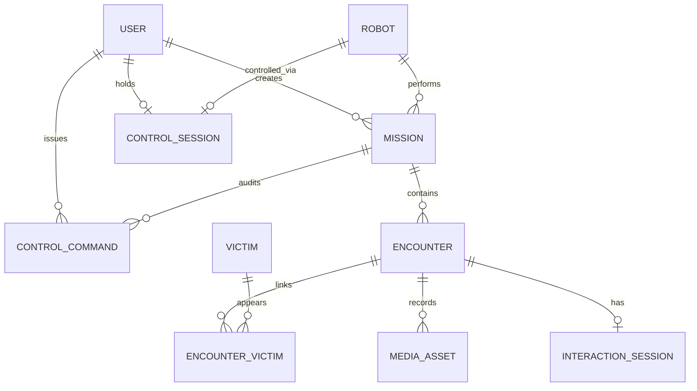
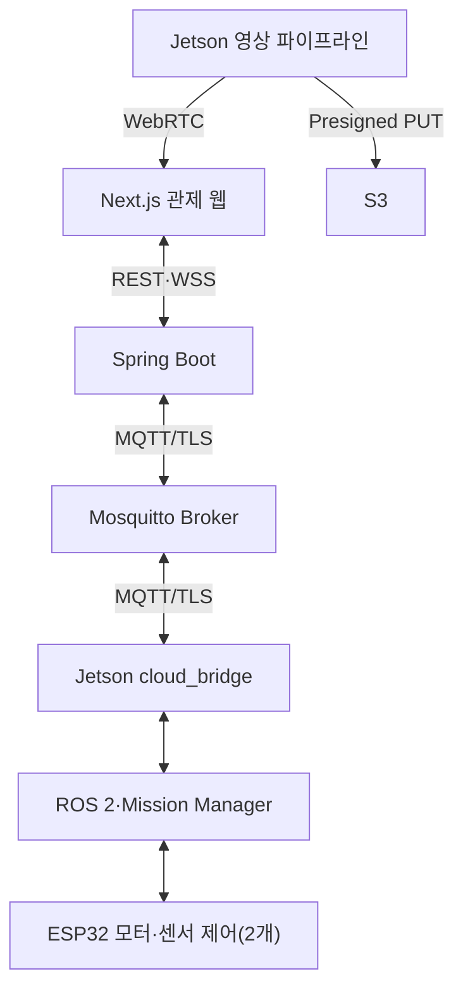
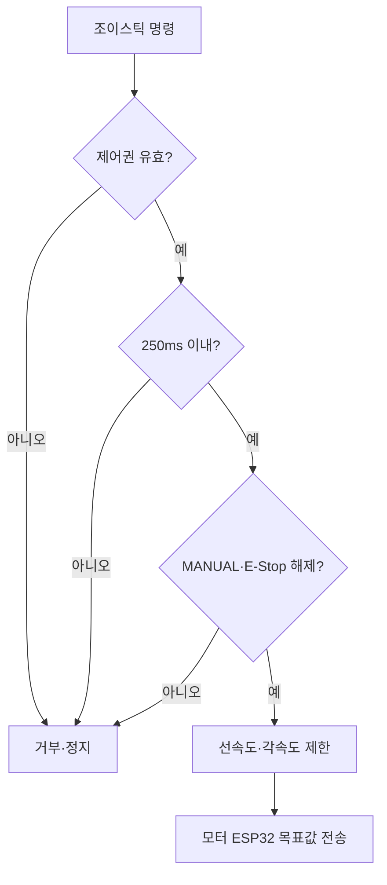
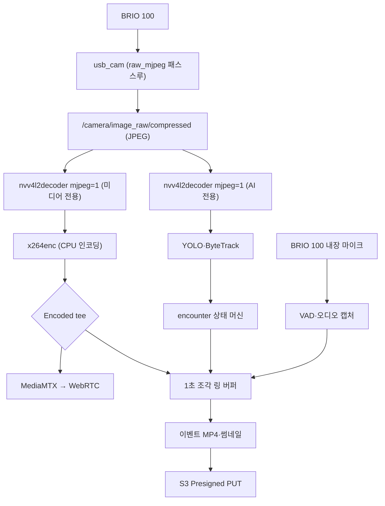
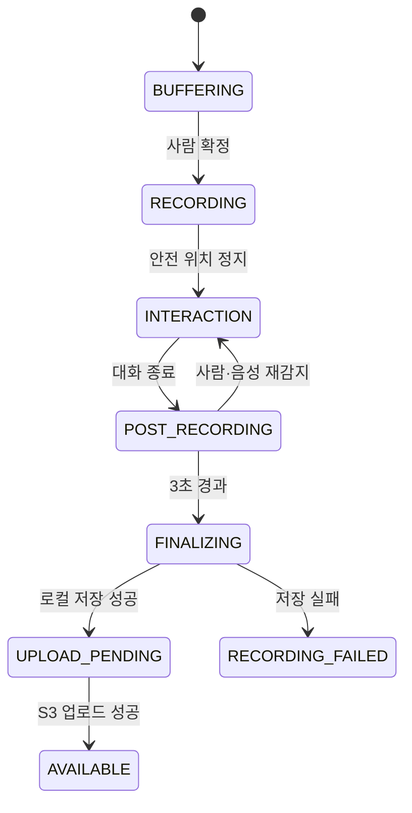

> Sentinel UGV 통합 명세서 v1.1의 일부 — 문서 규칙·버전·변경 이력은 [README](README.md) 참조

# 10. 영상 스트리밍 및 이벤트 녹화 [확정]

> 이 장은 요약이다. 스트리밍 파이프라인·3초 링 버퍼·녹화 상태 머신의 규범(상세)은 **32장 「영상 스트리밍·3초 링 버퍼·이벤트 녹화 설계」**다.

핵심 결정은 다음과 같다.

| **항목** | **결정** | **상세** |
|----------|----------|----------|
| 카메라 단일 오픈 | `usb_cam` 노드만 BRIO 100을 열고(MJPEG 패스스루), `/camera/image_raw/compressed` 토픽 하나로 AI·WebRTC·이벤트 녹화에 분기한다 | 32-3 |
| 스트리밍 경로 | 로컬은 Jetson MediaMTX → 동일 Wi-Fi 브라우저 WHEP(WebRTC), 원격(Jetson → EC2 MediaMTX → 외부 브라우저)은 선택 기능이며 자동 전환 없이 운영자가 경로를 선택한다 | 32-4 |
| AI 오버레이 | 영상 스트림 하나만 전송하고 YOLO Bounding Box 메타데이터를 WebSocket으로 별도 전달해 Next.js의 투명 Canvas에 그린다. 사용자가 켜고 끌 수 있으며 frameId 또는 capturedAt으로 동기화한다. 메타데이터 동기화 실패 시 Jetson에서 탐지 박스를 직접 합성한 단일 영상으로 fallback한다 | 32-8 |
| 이벤트 링 버퍼 | 1초 단위 H.264 조각을 순환 보관(최소 8개)하고, encounter 확정 시 `확정 전 3초 + 접근·음성 상호작용 전체 + 종료 후 3초`를 MP4 remux + thumbnail.jpg로 만들어 S3 업로드 또는 로컬 pending 저장한다. 영상 길이는 고정 15초가 아니다 | 32-5 |
| encounter 단위 | 여러 사람은 하나의 encounter 영상에 기록하되 사람별 track과 응답 상태는 개별 저장하고, 같은 encounter가 지속되면 새 파일을 반복 생성하지 않고 기존 녹화 세션을 유지한다 | 32-6 |
| 일반 장애물 우회 | 영상 저장 대상에서 제외하고 TimescaleDB에 횟수만 기록한다 | 10.5 |

## 10.1 BRIO 100 입력 검증
```bash
sudo apt update
sudo apt install -y v4l-utils
v4l2-ctl --list-devices
v4l2-ctl --device=/dev/video0 --list-formats-ext
```

실측 결과(`/dev/video0`, 1280×720 MJPEG 약 29.93 FPS)는 6.1 부품 활용 상태 표를 따른다. ROS 2 카메라 토픽과 X4 Pro `/scan`의 동시 구동, HW MJPEG 디코딩 10분 연속 검증은 완료했다(PoC-A). x264 인코딩 부하와 풀부하 헤드룸은 PoC-B에서 측정한다.

> **실측·PoC 기준선**: 파이프라인 엘리먼트 선택과 측정 결과의 1차 기록은 [`jetson/streaming_poc/README.md`](../jetson/streaming_poc/README.md)다. 32장의 설계값과 실측이 어긋나면 실측을 우선하고 32장을 갱신한다.

## 10.5 저장 대상

MVP의 이벤트 영상 녹화 대상은 **PERSON_ENCOUNTER 하나**다. E-Stop·충돌 정지의 영상 저장은 32장 녹화 상태 머신에 별도 경로 설계가 필요하므로 확장 기능으로 분류한다.

| **이벤트**          | **스냅샷** | **영상**      | **DB 기록**              |
|---------------------|------------|---------------|--------------------------|
| PERSON_ENCOUNTER    | 예         | 예 (MVP)      | 인원·위치·응답·상호작용  |
| E_STOP              | 선택       | 확장          | 발생 주체·상태·해제 시각 |
| COLLISION_STOP      | 선택       | 확장          | 최소 거리·속도           |
| SENSOR_DISCONNECTED | 아니오     | 아니오        | 센서 종류·복구 시각      |
| NORMAL_AVOIDANCE    | 아니오     | 아니오        | 횟수 또는 시계열 상태만  |

스트리밍·링 버퍼·녹화 상태 머신의 상세 설계와 장애 처리, 검증 항목(VID-01~VID-13)은 32장을 규범으로 한다.

# 11. 통합 관제 웹 시스템 [확정]

> 이 장은 요약이다. 관제 화면 구조·표시 우선순위·영상/지도 동기화·위험 조작 보호의 규범(상세)은 **28장(Next.js 관제 화면 상세 설계)** 을 따른다. 이 장에는 페이지·입력 매핑 등 고유 확정 사항과, 다른 장이 참조하는 제어권 세션(11.4)·버튼 활성화 조건(11.5)·MVP 접근 범위(11.6)만 남긴다.

핵심 결정은 다음과 같다.

- **페이지 구성 (v2.0 정정)**: `/`(메인 관제: 실시간 영상, 실시간 SLAM 지도, 운행 모드, 임무 상태·명령, 센서), `/blackbox`(임무 이력: 임무 목록, 임무 지도·궤적·발견 마커, 시계열 그래프, 이벤트 영상). **두 페이지다.** 화면별 핵심 정보·행동은 28.1을 따른다.

  v1.1은 `/control`·`/missions`·`/missions/{id}`·`/settings` 4개를 규정했다. 관제 화면을 간소화하기로 결정해 `/`와 `/blackbox` 둘로 합쳤다(S15P11A301-196·197·200·212·223·227). `/settings`는 만들지 않았다 — 조정할 값(탐사 시간·속도 제한·게임패드 보정)이 전부 로봇 쪽 판단이거나 폐기됐다.
- **실시간 관제 레이아웃 (v2.0 정정)**: 상단 바(연결 표시등·시계·임무 이력 링크) → 본문 좌측 메인 패널(WebRTC 실시간 영상 또는 실시간 SLAM 지도, 서로 교체 가능) → 우측 사이드바(작은 패널 = 메인의 반대쪽, 운행 모드 토글, 임무 상태·명령 버튼, 센서 온습도) 순으로 구성한다. 표시 우선순위는 28.2를 따른다.

  v1.1 레이아웃에서 뺀 것과 근거다.

  | 뺀 것 | 근거 |
  |---|---|
  | 조이스틱 | 조종 수단이 모바일 앱으로 정해져 관제 웹에 조종 입력이 없다(S15P11A301-196·197) |
  | 배터리 | `/battery_state` 계측 경로가 없다. 근거 없는 값을 표시하지 않는다(S15P11A301-223) |
  | 경과 시간·잔여 탐사 시간 | 서버에 없는 프런트엔드 상수(7분)를 근거로 화면이 상태를 만들어 내고 있었다(S15P11A301-223) |
  | CPU/GPU·지연·전압 스트립 | telemetry에 있으나 관제자의 판단을 돕지 않는다. 임무 이력의 시계열 그래프로 옮겼다 |
  | 이벤트 타임라인 | 탐지 알람을 영상 오버레이 한 줄로 대체했다(S15P11A301-200) |
  | 구성요소 상태 표시 | 노출되는 상태가 실제 노드 생존과 무관했다(S15P11A301-223) |
  | **속도·각속도** | **v2.0-r3 확정(S15P11A301-214).** 실측값이 오게 됐지만(#205 가 `linearVelocity`·`angularVelocity` 를 노출) 넣지 않는다 — 관제자의 행동을 바꾸지 않는다. 로봇이 움직이는지는 실시간 지도의 화살표로 보이고(#227), 속도 상한은 로봇이 강제하며(24.2) 관제자에게 조절 수단이 없고, 비정상 감속·정지는 임무 상태로 드러난다. 배터리·방위각을 뺀 것과 같은 기준이다. **DB·임무 이력 그래프에는 남긴다** — 사후 주행 품질 분석(S15P11A301-248)에 쓰는 값이다 |

  남긴 것 중 **탐지 표시는 영상 오버레이로 통일했다** — 영상·지도·탐지가 같은 형식(`OverlayLine`)을 쓴다. 같은 종류의 정보를 다른 모양으로 보여주지 않기 위한 것이다(S15P11A301-200).
- **게임패드 제어**: 수동 조종은 관제 PC에 연결된 USB 또는 Bluetooth 게임패드만 사용하고, 브라우저 Gamepad API로 입력을 읽으며, 장치가 없으면 수동 모드 버튼을 비활성화하고 연결 안내를 표시한다. 입력 매핑은 왼쪽 스틱 상하=전진/후진(deadzone·최대 속도 제한), 왼쪽 스틱 좌우=좌/우 회전(각속도·각가속도 제한, 제자리 회전 포함), LB=데드맨 스위치(누르고 있을 때만 DRIVE 전송), B=일반 정지(즉시 0 속도), Start=출발지 복귀 요청(확인 후 RETURNING), 연결 해제=수동 종료(300ms 이내 ESP32 정지 후 PAUSED)로 확정한다. UX 절차와 위험 조작 보호는 28.4~28.5를 따른다.

## 11.4 제어권 세션
시연 시 한 명만 조종한다. Spring Boot는 control session(제어 세션)을 발급하고 해당 WebSocket 세션만 DRIVE 명령을 전송할 수 있게 한다. heartbeat가 중단되거나 탭이 닫히면 제어권을 회수하고 로봇을 정지한다. 다른 브라우저는 영상과 상태만 조회할 수 있다. 리소스·테이블·필드 명칭은 `control-sessions`/`control_sessions`/`controlSessionId`로 통일한다.

## 11.5 버튼 활성화 조건
| **버튼**    | **활성 조건**              | **결과 상태**              |
|-------------|----------------------------|----------------------------|
| 탐사 시작   | SAFE_IDLE + 핵심 장치 정상 | EXPLORING                  |
| 일시정지    | EXPLORING 또는 RETURNING   | PAUSED                     |
| 탐사 재개   | PAUSED + 핵심 장치 정상    | EXPLORING                  |
| 수동 전환   | 게임패드 연결 + ESTOP 아님 | MANUAL (주행 중이면 PAUSED 자동 경유, 14.2) |
| 수동 종료   | MANUAL                     | PAUSED (탐사 재개는 명시적 재개 버튼으로만) |
| 복귀        | EXPLORING/PAUSED/MANUAL    | RETURNING                  |
| 탐사 종료   | 진행 중 임무 존재          | RETURNING 또는 COMPLETED   |
| E-Stop      | 항상                       | ESTOP                      |
| E-Stop 해제 | 정지·오류 해소·운영자 확인 | SAFE_IDLE/PAUSED           |

## 11.6 MVP 접근 범위
MVP에는 관리자가 사전 등록한 운영자 로그인 화면을 구현하되 회원가입·소셜 로그인은 구현하지 않는다. 시연은 한 명의 운영자가 통제된 관제 PC에서 수행하며, 연결된 게임패드와 하나의 control session을 가진 브라우저 세션만 DRIVE 명령을 보낼 수 있다. 외부 EC2 접근은 Security Group 허용 IP 또는 배포 환경 토큰으로 제한하고, 이를 사용자 계정 기능으로 확장하지 않는다. S3 객체는 공개하지 않고 단기 Presigned URL로만 조회한다.

상세 설계는 28장을 따른다: 화면 구조(28.1), 실시간 관제 표시 우선순위(28.2), 영상·지도 동기화(28.3), 게임패드 UX(28.4), 위험 조작 보호(28.5), 접근성과 실패 표현(28.6).

# 12. 통신 프로토콜 및 API [확정]

> **규범 선언** 이 장은 요약이다. 통신 계약(REST 경로·MQTT 토픽·메시지 스키마·ACK·오류 코드)의 유일한 규범(상세)은 **31장**이며, 본 장과 31장이 다르면 31장을 따른다.

핵심 결정은 다음과 같다.

- 모든 REST 경로는 `/api/v1` 접두를 사용하고, MQTT·WebSocket 메시지는 `messageType`/`data` 공통 봉투를 사용한다 (31-5, 31-7).
- 소프트웨어 E-Stop은 REST가 아니라 **MQTT `cmd/estop` + WebSocket `/app/robots/{robotId}/estop`**으로만 전달한다 (31-4, 31-8).
- 시계열 텔레메트리는 REST 조회가 아니라 MQTT/STOMP 실시간 스트림과 TimescaleDB 조회 API(27장)로 제공한다.
- 수동 주행 명령의 `linear`·`angular`는 실속도가 아니라 **-1.0~1.0 정규화 값**이며, Jetson이 24.2장의 속도 정책 상한으로 매핑한다 (31-6).
- 제어권은 `/api/v1/control-sessions` 기반 단일 조종자 세션으로만 부여한다 (31-7, 31-9).

## 12.1 통신 채널
| **채널**         | **용도**                                 | **특성**                  |
|------------------|------------------------------------------|---------------------------|
| MQTT 5 over TLS  | Jetson↔EC2 상태, 이벤트, 명령, ACK      | QoS·retain·LWT·재연결     |
| REST/HTTPS       | 임무·이력 조회, 미디어 업로드 준비       | 요청-응답, 멱등성         |
| STOMP over WSS   | Next.js↔Spring 실시간 상태·제어 중계     | 브라우저 구독·heartbeat   |
| WebRTC/WHEP      | 영상 스트리밍                            | 저지연, 영상 경로 분리    |
| S3 Presigned URL | Jetson의 파일 직접 업로드/브라우저 조회  | AWS 키 비노출, 제한 시간  |
| ROS2 DDS         | Jetson 내부 노드 간 통신                 | 토픽·서비스·액션          |
| USB Serial ×2    | Jetson↔ESP32 모터 제어(좌·우 목표 속도·fault), Jetson↔ESP32 센서 제어(엔코더·IMU·DHT11·초음파) | native CDC/USB-UART, CRC·sequence·300ms timeout |

## 12.2 상세 규범 포인터
계약별 전체 표·JSON 스키마·예시는 31장 해당 절만 참조한다.

| **항목**                  | **요약**                                                                                   | **규범 절** |
|---------------------------|--------------------------------------------------------------------------------------------|-------------|
| REST API 전체 표          | `/api/v1` 임무·경로·이벤트·encounter·제어권·미디어 엔드포인트. 임무 명령(START/PAUSE/RESUME/RETURN/STOP)은 `202 Accepted` 후 ACK로 완결 | 31-7        |
| 메시지 공통 봉투          | `messageType`·`messageId`·`schemaVersion`·`robotId`·`missionId`·`sequence`·`sentAt`·`data` | 31-5        |
| MQTT 토픽·QoS·retain·LWT  | 토픽 규칙과 연결 상태 관리                                                                 | 31-4        |
| 수동 주행 명령            | `MANUAL_DRIVE_COMMAND` — `controlSessionId`·`deadman`·`ttlMs` 포함                          | 31-6        |
| 명령 ACK                  | `COMMAND_ACK` — `ACCEPTED/EXECUTED/REJECTED/EXPIRED/FAILED`                                 | 31-6        |
| 관제 웹 WebSocket(STOMP)  | 브라우저 구독·발행 목적지                                                                  | 31-8        |

## 12.3 오류 코드
| **코드**             | **의미**                | **처리**                 |
|----------------------|-------------------------|--------------------------|
| DEVICE_OFFLINE       | Jetson 연결 끊김        | 제어 비활성화, 상태 경고 |
| LIDAR_UNAVAILABLE    | LiDAR 데이터 없음       | 자율주행 중단·정지       |
| LOCALIZATION_LOST    | 위치 신뢰도 저하        | PAUSED 또는 ERROR        |
| MOTOR_NO_RESPONSE    | 모터 드라이버 응답 없음 | ESTOP                    |
| GAMEPAD_DISCONNECTED | 게임패드 연결 해제      | 수동 즉시 정지           |
| CONTROL_SESSION_DENIED | 다른 세션이 제어권 보유 | 조회 전용                |
| S3_UPLOAD_PENDING    | 파일 업로드 대기        | 로컬 보관 후 재시도      |
| STREAM_LOCAL_FAILED  | 로컬 스트림 실패        | REMOTE 전환              |

REST 오류 응답 봉투(`code`·`message`·`traceId`·`occurredAt`)는 27.5를 따른다.

# 13. 데이터베이스·시계열·S3 설계 [확정]

> 이 장은 요약이다. 저장소 책임·핵심 관계·데이터 무결성·Outbox 전송·시계열 보존·S3 key 규칙의 규범(상세)은 29장을 따른다. 테이블 필드 상세는 `encounters`·`encounter_victims`·`detections`가 30.6.4, `interaction_sessions`·`interaction_turns`가 33-6이다.

핵심 결정:

- 하나의 PostgreSQL 인스턴스에 TimescaleDB 확장을 설치해 일반 테이블과 hypertable을 함께 사용한다. 별도 제품 이중 운영이 아니다 (29.1).
- 영상·지도·rosbag 같은 대용량 파일은 S3에 저장하고 DB에는 경로와 메타데이터만 저장한다.
- 모든 일반 테이블의 PK는 UUID를 사용하며, QoS 1 중복은 서버에서 멱등 처리한다 (29.3).
- 미디어 파일 상태는 `media_assets.storage_status` 단일 컬럼으로 관리한다 (13.6).
- 시계열은 time_bucket 구간 집계와 Continuous Aggregate로 임무 요약을 사전 계산하고, 일반 테이블과 JOIN해 이벤트 시점의 센서 상태를 조회한다. 보존·다운샘플 기준은 29.5를 따른다.

## 13.2 PostgreSQL 일반 테이블
| **테이블**       | **주요 필드**                                                         | **용도**                |
|------------------|-----------------------------------------------------------------------|-------------------------|
| users            | id, username, password_hash, display_name, role, last_login_at, created_at | 관제 운영자 계정·인증 — **미생성** |
| robots           | id, name, status, last_seen_at                                        | 로봇 등록과 현재 상태   |
| missions         | id, robot_id, created_by_user_id, status, started_at, ended_at, home_pose, end_reason | 임무 생명주기           |
| mission_results  | mission_id, duration, distance, coverage, detection_count             | 임무 요약               |
| events           | id, mission_id, message_id, type, severity, occurred_at, payload_json  | E-Stop·오류·일반 이벤트 |
| encounters       | id, mission_id, map_id, status, map_x, map_y, map_yaw, detected/responsive/unresponsive_person_count, interaction_summary, started_at, interaction_started_at, interaction_ended_at, ended_at, termination_reason | 사람 그룹 발견 단위     |
| victims          | id, latest_status, first_seen_at                                       | 피해자 후보             |
| detections       | id, mission_id, encounter_id, victim_id, track_id, class, confidence, map_x, map_y, position_quality, pose_status, observed_at | AI 관측 원본 (pose_status는 `NORMAL`·`FALLEN` 2값, 25.6) |
| encounter_victims| encounter_id, victim_id, track_id, response_status, first_seen_at, last_seen_at | encounter-피해자 연결   |
| interaction_sessions | id, encounter_id(UNIQUE), status, response_scope, any_response_detected, reported_responsive_count, count_confidence, mobility_status, urgent_condition_reported, operator_review_required, started_at, ended_at, termination_reason, summary | 음성 상호작용 세션 — **미생성** |
| interaction_turns| id, session_id, turn_index, question_code, transcript, stt_confidence, llm_schema_valid, parsed_value, parse_status, tts_text, retry_count, audio_media_id | 질문·응답 기록 — **미생성** |
| control_commands | id, mission_id, issued_by_user_id, command_id, type, requested_at, result, sequence | 제어 감사 로그          |
| maps             | id, mission_id, s3_key_pgm, s3_key_yaml, created_at                   | 저장 지도               |
| media_assets     | id, mission_id, encounter_id, type, s3_key, storage_status, duration_ms, triggered_at, interaction_started_at, interaction_ended_at, pre_buffer_sec, post_buffer_sec, termination_reason | S3 미디어 메타데이터    |
| control_sessions | robot_id, user_id, session_id, expires_at                             | 단일 제어권             |

- 모든 일반 테이블의 PK는 UUID를 사용한다. `encounters`·`media_assets` 필드 상세 정의는 30.6.4, `interaction_sessions`·`interaction_turns`는 33-6을 따른다.
- `interaction_sessions.encounter_id`는 UNIQUE이며, encounter당 음성 세션은 0..1개다(32-6 참조).
- `users`는 관제 운영자 계정 테이블이다. `role`은 `ADMIN`·`OPERATOR`이며 `password_hash`는 단방향 해시로 저장한다. 제어권과 제어 명령은 `control_sessions.user_id`·`control_commands.issued_by_user_id`로 조작 주체를 식별한다.

> **v2.0: `users`·`interaction_sessions`·`interaction_turns` 세 테이블은 생성되지 않았다.**
> `V1__init_schema.sql` 둘째 줄이 이 셋을 MVP 범위 밖으로 명시적으로 제외한다. 나머지
> 17개 테이블은 마이그레이션 V1~V5에 모두 있다.
>
> 그 결과 인증이 없고(36-4), 음성 상호작용 결과는 DB 대신 `/interaction/report` 토픽과
> encounter 요약으로만 남는다. 정의는 향후 설계로 유지하되 **미생성임을 표기한다** —
> 있다고 읽고 조회 쿼리를 짜면 런타임에서야 없는 것을 알게 된다.
- `detections`는 매 프레임 시계열이 아니라 encounter 판정에 사용되는 선별 관측 로그이므로 hypertable이 아닌 일반 테이블로 둔다. Jetson이 생성한 UUID를 `id`(PK)로 사용해 QoS 1 중복을 멱등 처리하고, `encounter_id`·`victim_id`로 상위 발견 단위와 연결한다. 관측 시각은 `observed_at`으로 저장한다.

## 13.3 TimescaleDB hypertable
| **테이블**             | **주기**    | **주요 필드**                                                  | **용도**         |
|------------------------|-------------|----------------------------------------------------------------|------------------|
| robot_pose             | 2~5Hz       | time, mission_id, x, y, yaw, linear_velocity, angular_velocity | 경로와 이동 거리 |
| robot_metrics          | 1Hz         | battery, voltage, cpu, gpu, memory, jetson_temp, state         | 시스템 상태      |
| environment_metrics    | 0.2~0.5Hz   | temperature, humidity                                          | 환경 이력        |
| network_metrics        | 1Hz         | latency_ms, packet_loss, connection_state, stream_mode         | 통신 품질        |
| safety_events          | 이벤트      | min_distance, cmd_vel, stop_reason                             | 안전 정지 분석   |

시계열 활용·보존·다운샘플의 상세는 29.5를 따른다.

## 13.5 S3 객체 구조
버킷은 `s3://sentinel-ugv-assets/`를 사용하며, `missions/{missionId}/` 하위에 encounters·maps·rosbags·reports를 둔다. object key 규칙의 규범은 29.6이다.

> **note: S3 호환 스토리지로 MinIO를 사용한다.** EC2에 자체 호스팅하며 `https://s3.sentinel-ugv.xyz`(Nginx TLS)로 접근한다. 버킷명·object key 규칙·Presigned URL 등 본 설계는 그대로 유지하고, 클라이언트는 path-style 접근(`forcePathStyle=true`)을 사용한다. 구성 절차는 `docs/private-docs/minio-s3-setup.md` 참조.

## 13.6 업로드 상태 머신
| **상태**   | **의미**                       | **다음 동작**             |
|------------|--------------------------------|---------------------------|
| PENDING    | DB 이벤트 생성, 파일 로컬 존재 | Presigned URL 요청        |
| UPLOADING  | S3 업로드 진행                 | 성공/실패 대기            |
| AVAILABLE  | S3 업로드 완료                 | 조회 URL 발급 가능        |
| FAILED     | 업로드 실패                    | 백오프 후 재시도          |
| LOCAL_ONLY | 네트워크 단절로 Jetson 보관    | 연결 복구 시 PENDING 전환 |

상태 컬럼명은 `media_assets.storage_status`로 통일한다 (31-7·32장과 동일). 전송·재시도 흐름은 29.4를 따른다.

## 13.7 보존 정책
원본 시계열과 장기 집계의 보존·다운샘플 기준은 29.5를 따른다. 시계열 외 데이터의 보존은 다음과 같다.

| **데이터**              | **보존**                    |
|-------------------------|-----------------------------|
| 임무·안전 이벤트·제어 명령 | 프로젝트 기간, 종료 후 정책에 따라 삭제 |
| 피해자 영상·음성·대화      | 시연 목적 최소 기간 후 삭제                 |
| 일반 rosbag             | 필요 임무만 수동 보관       |
| Jetson pending 파일     | 업로드 완료 후 자동 삭제    |

# 27. Spring Boot 관제 백엔드·도메인·API 상세 설계

## 27.1 책임 경계

Spring Boot는 로봇을 실시간 폐루프로 제어하지 않는다. 임무·운영자·명령 이력·실시간 관제 전달·데이터 저장을 담당하며, 안전 판단과 최종 모터 권한은 Jetson·ESP32에 남긴다.

## 27.2 모듈 구조

```text
backend/
├─ mission/          # 임무 생성·상태·요약
├─ robot/            # 등록·presence·health
├─ control/          # 제어 세션·명령·ACK·감사 로그
├─ encounter/        # 피해자 발견·응답·미디어 연결
├─ telemetry/        # TimescaleDB 쓰기·조회
├─ media/            # S3 Presigned URL·상태
├─ realtime/         # STOMP/WebSocket 브로드캐스트
├─ messaging/        # MQTT 구독·발행·멱등 처리
├─ security/         # 인증·권한·감사
└─ common/           # 오류·시간·ID·검증
```

## 27.3 핵심 도메인 규칙

- 한 로봇에는 동시에 하나의 활성 임무만 존재한다.
- 한 로봇에는 동시에 하나의 유효 control session만 존재한다.
- 로봇이 보낸 임무 상태와 서버 명령 상태를 분리해 저장한다.
- 이벤트는 `messageId` 또는 도메인 id의 unique constraint로 중복 삽입을 막는다.
- S3 업로드 성공 전에도 DB 이벤트는 `LOCAL_ONLY/PENDING`으로 조회 가능하다.
- 서버가 임의로 `COMPLETED`를 만들지 않고 로봇의 종료 결과와 증빙을 확인한다.

## 27.4 REST API 기준

| Method | Endpoint | 목적 |
|---|---|---|
> **v2.0: REST API 전체 표는 27.4가 유일한 규범이다.** v1.1에서 이 자리에 있던 표가 27.4와 달라서(`/trajectory` 유무 등) 어느 쪽이 맞는지 알 수 없었다. 표를 중복해 두지 않는다.

제어 API가 HTTP 202를 반환한 것은 로봇이 동작을 완료했다는 뜻이 아니다. 응답에 `commandId`와 `status: PENDING`(31-7 예시와 동일)을 담아 반환하고, 실제 수락·실행 결과는 ACK 상태로 갱신한다.

## 27.5 오류 응답

```json
{
  "code": "CONTROL_SESSION_DENIED",
  "message": "다른 운영자가 제어권을 보유 중입니다.",
  "traceId": "uuid",
  "occurredAt": "2026-07-22T06:30:00Z"
}
```

내부 예외·AWS 키·SQL 문장은 클라이언트에 노출하지 않는다.

## 27.6 백엔드 인수 기준

- MQTT QoS 1 중복 메시지를 2회 받아도 DB 행과 웹 이벤트는 1회만 생성된다.
- 명령 요청부터 ACK까지 상태가 추적된다.
- 비활성·만료 세션의 DRIVE 명령을 거부한다.
- 임무 상세에서 경로·시계열·encounter·미디어를 함께 조회할 수 있다.
- DB·S3 일부 장애가 다른 API 전체를 무한 대기시키지 않는다.

# 28. Next.js 관제 화면 상세 설계

> **v2.0: 장 제목에서 "조이스틱 UX"를 뺐다.** 조종 수단이 모바일 앱으로 정해져 관제 웹에는 조종 입력이 없다(S15P11A301-196·197). `frontend/features/control/Joystick.tsx`와 `GamepadContext.tsx`가 파일로는 남아 있으나 **어느 페이지도 사용하지 않는다.** 모바일 앱이 ESP32로 직접 신호를 보내는 경로이므로 관제 웹의 역할은 관측과 임무 명령(START/PAUSE/RESUME/RETURN/STOP)까지다.

## 28.1 화면 구조

| 화면 | 핵심 정보 | 핵심 행동 |
|---|---|---|
| 실시간 관제 | 영상, 지도, 로봇 상태, 배터리, 온습도, 이벤트 | 시작·정지·복귀·수동·E-Stop |
| 임무 목록 | 시간, 상태, 탐지 수, 거리, 종료 사유 | 필터·상세 이동 |
| 임무 상세 | 경로, encounter, 영상, 센서 그래프 | 증빙 재생·다운로드 |
| 설정 | 속도·탐사 시간·영상 모드 | 관리자만 변경 |

## 28.2 실시간 관제 우선순위

운영자는 화면을 읽기 전에 위험을 알아야 한다. 상단 고정 영역에 다음을 항상 표시한다.

- `ROBOT STATE`와 서버 연결 상태를 분리 표시
- 물리·소프트웨어 E-Stop 상태
- ESP32·LiDAR·카메라·TF health
- 배터리와 예상 복귀 가능 여부
- control session 보유자와 게임패드 연결 상태
- 영상 지연·스트림 모드(LOCAL/REMOTE)

## 28.3 영상·지도 동기화

- 영상 위 AI 박스는 `frameId` 또는 `capturedAt`이 가까운 탐지 데이터만 표시한다.
- 오래된 박스는 자동 제거하고 네트워크 지연으로 뒤늦게 온 데이터는 폐기한다.
- 지도에는 로봇 pose, 이동 경로, home, 현재 Frontier, encounter 마커를 구분한다.
- encounter 마커를 클릭하면 피해자 수·응답 상태·스냅샷·영상을 연다.

## 28.4 게임패드 UX

1. Gamepad API로 연결을 감지한다.
2. 운영자가 제어권을 요청한다.
3. 축 중앙값·deadzone을 확인한다.
4. deadman을 누를 때만 20Hz DRIVE 명령을 전송한다.
5. 탭 비활성, 페이지 종료, 패드 분리, 제어 세션 만료 시 즉시 0 명령을 보내고 수동 모드를 종료한다.

브라우저의 STOP 전송 성공에만 의존하지 않는다. 명령 중단 자체가 Jetson·ESP32 300ms watchdog을 작동시켜야 한다.

## 28.5 위험 조작 보호

| 조작 | 보호 방식 |
|---|---|
| 탐사 시작 | preflight 결과 확인 |
| 수동 전환 | 게임패드 + control session + deadman |
| 복귀 | 확인 대화상자, 현재 상태 표시 |
| E-Stop | 항상 활성, 한 번의 동작으로 실행 |
| E-Stop 해제 | 오류 해소·주변 확인·재enable 분리 |
| 설정 변경 | 임무 중 제한, 감사 로그 |

## 28.6 접근성과 실패 표현

색상만으로 상태를 표현하지 않고 텍스트·아이콘을 함께 사용한다. 네트워크가 끊겼을 때 마지막 상태가 정상처럼 보이지 않도록 `STALE`과 마지막 수신 시각을 표시한다. 로딩·데이터 없음·권한 없음·장애를 서로 다른 화면 상태로 처리한다.

# 29. PostgreSQL·TimescaleDB·S3·Outbox 상세 설계

## 29.1 저장 책임

| 저장소 | 데이터 | 이유 |
|---|---|---|
| PostgreSQL | 로봇·임무·명령·encounter·피해자·미디어 메타데이터 | 관계·무결성·트랜잭션 |
| TimescaleDB 확장 | pose·환경·시스템·네트워크 시계열 | 시간 범위·집계 쿼리 |
| S3 | 영상·스냅샷·지도·선택 rosbag·보고서 | 대용량 객체 저장 |
| Jetson SQLite Outbox | 미전송 이벤트·메타데이터 | 네트워크 단절 복구 |
| Jetson 로컬 파일 | 업로드 대기 영상·지도 | S3 장애 복구 |

TimescaleDB는 별도 DB 서버가 아니라 PostgreSQL 인스턴스에 설치하는 확장으로 사용한다.

> **note:** "S3"는 S3 호환 스토리지 MinIO로 구현하며 `https://s3.sentinel-ugv.xyz`로 접근한다. S3 API·object key·Presigned 설계는 동일하다(13.5 note 참조).

## 29.2 핵심 관계



`USER`는 관제 운영자 계정이며, 조작 주체는 `MISSION.created_by_user_id`(임무 생성자), `CONTROL_COMMAND.issued_by_user_id`(명령 발행자), `CONTROL_SESSION.user_id`(제어권 보유자)로 식별한다. `CONTROL_SESSION`은 로봇 1대당 활성 1건으로 현재 제어권 보유자를 나타낸다.

시계열 행은 `mission_id`, `robot_id`, `time`을 공통으로 가진다. 임무 종료 후에는 요약 테이블을 계산한다.

## 29.3 데이터 무결성

- UUID는 생성 주체와 무관하게 충돌하지 않도록 사용한다.
- `message_id`, `command_id`, `encounter_id`, S3 object key에 unique constraint를 둔다.
- 임무·이벤트 시간은 UTC로 저장하고 UI에서 로컬 시간대로 표시한다.
- 미디어 DB 행과 S3 객체 상태를 `media_assets.storage_status`로 `LOCAL_ONLY → PENDING → UPLOADING → AVAILABLE/FAILED`로 관리한다 (13.6·31-7·32장과 동일).
- DB 행을 삭제할 때 S3 객체 삭제 결과를 추적하는 tombstone 또는 삭제 job을 사용한다.

## 29.4 Outbox 전송

```text
로컬 사건 발생
→ SQLite 트랜잭션으로 event + outbox 저장
→ MQTT/REST 전송
→ 서버 ACK와 id 확인
→ outbox SENT
→ 미디어 Presigned 업로드
→ 서버 AVAILABLE 확인
→ 보존 유예 후 로컬 파일 삭제
```

재시도는 지수 백오프와 최대 간격을 사용한다. QoS 1의 중복 가능성을 전제로 서버는 멱등 처리하며, 업로드 성공 여부가 불명확하면 같은 object key를 조회한 후 재전송한다.

## 29.5 시계열 보존·다운샘플

| 데이터 | 원본 주기 | 원본 보존 | 장기 집계 |
|---|---:|---|---|
| pose | 2Hz 관제 저장 | 프로젝트 기간 또는 30일 | 1s/5s |
| 시스템·배터리 | 1Hz | 프로젝트 기간 | 1m 평균·최대 |
| 온습도 | 0.2~0.5Hz | 프로젝트 기간 | 1m 평균 |
| 네트워크 | 1Hz | 30일 | 1m 평균·p95 |
| AI 관측 원본 | 이벤트 주변 | 필요 기간 | encounter 요약 |

보존 기간은 36장의 개인정보 정책이 우선하며 시연 참가자 데이터는 필요 이상 장기 보관하지 않는다.

## 29.6 S3 key 규칙

```text
missions/{missionId}/
├─ encounters/{encounterId}/thumbnail.jpg
├─ encounters/{encounterId}/event.mp4
├─ encounters/{encounterId}/transcript.json
├─ maps/map.pgm
├─ maps/map.yaml
├─ rosbags/mission_YYYYMMDD_HHMMSS.tar.gz   # 필요 임무만 수동 보관 (13.5·13.7)
└─ reports/summary.json
```

경로 변수 표기는 `{missionId}`·`{encounterId}`(camelCase)로 통일한다.

파일명에 사람 이름·음성 원문·토큰을 포함하지 않는다.

# 31. Jetson - Spring Boot - 관제 웹 통신 설계

## 31-1. 추천 결론

Sentinel UGV의 통신은 하나의 프로토콜로 통합하지 않고 데이터 성격에 따라 나눈다.

| 구간 | 프로토콜 | 주요 용도 |
|---|---|---|
| Jetson ↔ EC2 | MQTT 5 over TLS | 차량 상태, 이벤트, 명령, ACK, 연결 상태 |
| Jetson ↔ Spring Boot | HTTPS REST | 이벤트 영상 업로드 준비, 메타데이터 등록, 재전송 배치 |
| Next.js ↔ Spring Boot | HTTPS REST | 임무 생성, 이력·지도·탐지 결과 조회 |
| Next.js ↔ Spring Boot | STOMP over WSS | 실시간 상태·이벤트 수신 (조종 명령은 없다 — 28장) |
| Jetson ↔ 브라우저 | WebRTC | 저지연 실시간 영상·음성 |
| Jetson 내부 | ROS 2 DDS | SLAM, Nav2, YOLO, Mission Manager 노드 통신 |
| Jetson ↔ ESP32 ×2 | 유선 USB Serial 우선(모터·센서 채널 분리) | 좌·우 구동 속도 목표·오류·E-Stop 상태(모터), 좌·우 엔코더·차체 IMU·DHT11·초음파(센서) |

ROS 2 DDS를 인터넷 구간까지 직접 확장하지 않는다. ROS 토픽은 크기와 주기가 다양하고 네트워크 설정이 복잡하므로, Jetson의 `cloud_bridge_node`가 관제에 필요한 데이터만 JSON 메시지로 변환한다.



---

## 31-2. 통신 방식 선택 근거

- 재연결 후 구독 복구와 여러 종류의 메시지 분배가 필요하다.
- 차량 명령, 센서 상태, 사람 탐지 이벤트의 신뢰도 요구가 서로 다르다.
- 브라우저가 TCP 소켓에 직접 연결하기 어렵다.
- 파일과 영상은 메시지 브로커를 거치지 않고 별도 업로드해야 한다.
- 네트워크 단절 시 차량을 즉시 정지하고 중요 이벤트를 나중에 재전송해야 한다.

### 대안 비교

| 방식 | 장점 | 단점 | 판단 |
|---|---|---|---|
| 순수 TCP 소켓 | 지연이 낮고 단순한 시험이 쉬움 | 프레이밍·재연결·구독·ACK·다중 클라이언트를 직접 구현 | 학습용 또는 Jetson-ESP32 외에는 비추천 |
| REST만 사용 | 구현과 디버깅이 쉬움 | 실시간 양방향 상태 수신에 부적합 | 조회·등록용으로 사용 |
| WebSocket만 사용 | 브라우저 양방향 통신에 적합 | 차량 오프라인 처리·QoS·메시지 영속성을 직접 구현 | 웹 실시간 구간에 사용 |
| MQTT만 사용 | 경량 Pub/Sub, QoS, LWT, 재연결에 유리 | 파일 전송과 일반 웹 조회에 부적합 | 차량 메시지의 중심으로 사용 |
| MQTT + REST + WebSocket | 각 데이터에 맞는 역할 분리 | 구성 요소가 늘어남 | Sentinel 최종 추천 |

구현 난이도는 중간 수준이다. 다만 MQTT는 `cloud_bridge`, REST는 파일·이력, WebSocket은 관제 화면으로 책임이 명확하여 팀이 병렬 개발하기 쉽고 4~6주 내 구현 가능성이 높다.

---

## 31-3. 서버 구성

EC2에는 다음 컨테이너를 둔다.

```text
Nginx
├─ HTTPS REST /api/* → Spring Boot
├─ WSS /ws          → Spring Boot STOMP
└─ Next.js 정적·SSR 요청

Spring Boot
├─ Mission API
├─ MQTT Gateway
├─ WebSocket Gateway
├─ Telemetry·Event 저장
├─ Control Session 관리
└─ S3 Presigned URL 발급

Mosquitto
├─ Jetson MQTT 연결
└─ Spring Boot MQTT 연결

PostgreSQL + TimescaleDB
S3
```

초기에는 Spring의 단순 STOMP 브로커를 사용한다. 관제 서버가 한 대이므로 RabbitMQ나 Kafka를 추가하지 않는다.

### 권장 클라이언트

| 구성 요소 | 권장 구현 |
|---|---|
| Jetson | Python `paho-mqtt` MQTT 5 클라이언트 |
| Spring Boot | Eclipse Paho MQTT v5 비동기 클라이언트를 감싼 `MqttGateway` |
| 웹 | `@stomp/stompjs` |
| MQTT Broker | Eclipse Mosquitto |

---

## 31-4. MQTT 토픽 규칙

기본 형식:

```text
sentinel/v1/robots/{robotId}/{channel}
```

| 토픽 | 발행 → 구독 | QoS | Retain | 주기·조건 |
|---|---|---:|---:|---|
| `presence` | Jetson → Spring | 1 | O | 접속·종료·LWT |
| `state` | Jetson → Spring | 1 | O | 상태 변경 및 1초 heartbeat |
| `telemetry` | Jetson → Spring | 0 | X | 임무 중 2Hz |
| `events` | Jetson → Spring | 1 | X | 탐지·오류·상태 전환 즉시 |
| `acks` | Jetson → Spring | 1 | X | 명령 수락·거부·완료 시 |
| `cmd/mission` | Spring → Jetson | 1 | X | 시작·일시정지·재개·종료 |
| `cmd/mode` | Spring → Jetson | 1 | X | MANUAL·AUTO 전환 |
| `cmd/drive` | Spring → Jetson | 0 | X | 수동 조작 중 20Hz |
| `cmd/stop` | Spring → Jetson | 1 | X | 조이스틱 해제·제어권 상실 |
| `cmd/estop` | Spring → Jetson | 1 | X | 소프트웨어 E-Stop |

MQTT QoS 0은 유실될 수 있지만 다음 속도 명령이 곧 도착하는 `cmd/drive`와 반복 telemetry에 적합하다. QoS 1은 최소 한 번 전달되므로 이벤트와 상태 명령에 사용하되 중복 도착을 고려해야 한다. 모든 명령은 `commandId`로 멱등 처리한다.

### Retain 규칙

- 현재 연결·운영 상태인 `presence`, `state`만 Retain을 사용한다.
- 과거 명령이 재연결 직후 실행되는 것을 막기 위해 모든 `cmd/*` 토픽은 Retain을 금지한다.
- Jetson은 재연결 후 `SAFE_IDLE/STOP` 또는 현재 로컬 안전 상태를 서버와 동기화하며 자동 주행을 재개하지 않는다.

### 연결 상태

Jetson은 MQTT Last Will을 다음처럼 등록한다.

```json
{
  "robotId": "SENTINEL-01",
  "status": "OFFLINE",
  "reason": "MQTT_CONNECTION_LOST"
}
```

정상 접속 후에는 같은 `presence` 토픽에 `ONLINE`을 Retain 메시지로 발행한다. MQTT 연결 감지는 관제 표시용이며 모터 안전 정지에는 사용하지 않는다. 모터는 Jetson과 모터 ESP32의 300ms 로컬 watchdog으로 더 빠르게 정지한다.

---

## 31-5. 공통 JSON 봉투

MQTT와 WebSocket의 모든 메시지는 공통 필드를 사용한다.

```json
{
  "schemaVersion": "1.0",
  "messageId": "89b15463-af53-41e9-8aed-e16ae1721d2e",
  "messageType": "ROBOT_TELEMETRY",
  "robotId": "SENTINEL-01",
  "missionId": "4a43f45c-779f-4df5-ac04-1695724829a4",
  "sequence": 10231,
  "sentAt": "2026-07-22T06:30:15.123Z",
  "data": {}
}
```

| 필드 | 설명 |
|---|---|
| `schemaVersion` | 메시지 호환성 버전 |
| `messageId` | 중복 저장 방지용 UUID |
| `messageType` | 메시지 종류 |
| `robotId` | 차량 식별자 |
| `missionId` | 임무 외 상태이면 `null` 가능 |
| `sequence` | 같은 발행자 내 순서 확인용 증가 번호 |
| `sentAt` | Jetson에서 생성한 UTC 시각 |
| `data` | 메시지별 본문 |

Jetson과 EC2는 NTP로 시간을 동기화한다. 서버는 별도로 `receivedAt`을 기록하여 전송 지연과 시계 오차를 확인한다.

---

## 31-6. 주요 MQTT 메시지

### Telemetry

```json
{
  "schemaVersion": "1.0",
  "messageId": "f4053b8f-6070-4395-b931-a68019337254",
  "messageType": "ROBOT_TELEMETRY",
  "robotId": "SENTINEL-01",
  "missionId": "4a43f45c-779f-4df5-ac04-1695724829a4",
  "sequence": 10231,
  "sentAt": "2026-07-22T06:30:15.123Z",
  "data": {
    "pose": {"x": 4.31, "y": 1.82, "yaw": 0.74, "mapId": "4f87365c-c914-4ba5-8e47-34417cd38c52"},
    "motion": {"linearVelocityMps": 0.24, "angularVelocityRadps": 0.05},
    "battery": {"voltage": 14.7, "percent": 72.0},
    "environment": {"temperatureC": 28.4, "humidityPercent": 55.1},
    "compute": {"cpuPercent": 47.2, "gpuPercent": 63.0, "memoryPercent": 58.3, "jetsonTempC": 61.0},
    "health": {"mcuConnected": true, "lidarOk": true, "cameraOk": true},
    "missionState": "EXPLORING"
  }
}
```

### 다중 인원 발견 이벤트

```json
{
  "schemaVersion": "1.0",
  "messageId": "8130e47a-ad21-4eed-aec4-ab478722b9ae",
  "messageType": "ENCOUNTER_CONFIRMED",
  "robotId": "SENTINEL-01",
  "missionId": "4a43f45c-779f-4df5-ac04-1695724829a4",
  "sequence": 10244,
  "sentAt": "2026-07-22T06:30:21.440Z",
  "data": {
    "encounterId": "8b7b90dc-c0fb-4e57-9359-c30fb0528d75",
    "mapPose": {"x": 5.22, "y": 2.16, "yaw": 0.81, "mapId": "4f87365c-c914-4ba5-8e47-34417cd38c52"},
    "personCount": 3,
    "persons": [
      {"trackId": 12, "confidence": 0.91},
      {"trackId": 13, "confidence": 0.87},
      {"trackId": 14, "confidence": 0.79}
    ],
    "recordingState": "RECORDING",
    "preBufferSec": 3
  }
}
```

### 수동 주행 명령

```json
{
  "schemaVersion": "1.0",
  "messageId": "40ac11fb-4d02-4214-b9ae-6d66f44f1964",
  "messageType": "MANUAL_DRIVE_COMMAND",
  "robotId": "SENTINEL-01",
  "missionId": "4a43f45c-779f-4df5-ac04-1695724829a4",
  "sequence": 884,
  "sentAt": "2026-07-22T06:31:10.200Z",
  "data": {
    "controlSessionId": "a4e1a044-7825-4214-b0c4-1945157bd9c9",
    "linear": 0.35,
    "angular": -0.20,
    "deadman": true,
    "ttlMs": 250
  }
}
```

`linear`와 `angular`는 `-1.0~1.0` 정규화 값이다. Jetson은 차량 설정의 최대 선속도·각속도로 변환하고 안전 제한을 적용한다. `ttlMs`가 지난 명령, 이전 `sequence`, 유효하지 않은 제어 세션의 명령은 거부한다.

### 명령 ACK

```json
{
  "schemaVersion": "1.0",
  "messageId": "e38b2ce8-bc86-472c-88ed-71448e266009",
  "messageType": "COMMAND_ACK",
  "robotId": "SENTINEL-01",
  "missionId": "4a43f45c-779f-4df5-ac04-1695724829a4",
  "sequence": 10250,
  "sentAt": "2026-07-22T06:31:10.231Z",
  "data": {
    "commandId": "40ac11fb-4d02-4214-b9ae-6d66f44f1964",
    "status": "ACCEPTED",
    "reasonCode": null,
    "message": null
  }
}
```

ACK 상태:

```text
ACCEPTED
EXECUTED
REJECTED
EXPIRED
FAILED
```

고주기 `cmd/drive`는 매 메시지마다 ACK를 보내지 않고 최신 적용값을 `state`에 5~10Hz로 반영한다. 임무·모드·정지·E-Stop 명령은 개별 ACK를 보낸다.

---

## 31-7. REST API

REST는 이력 조회, 임무 관리 요청, 파일 업로드 절차에 사용한다.

| Method | URI | 기능 | **상태** |
|---|---|---|---|
| `POST` | `/api/v1/missions` | 임무 생성 | 구현 |
| `GET` | `/api/v1/missions` | 과거 임무 목록 | 구현 |
| `GET` | `/api/v1/missions/{missionId}` | 임무 요약 조회 | 구현 |
| `POST` | `/api/v1/missions/{missionId}/commands` | 시작·일시정지·재개·종료 요청 | 구현 |
| `GET` | `/api/v1/missions/{missionId}/trajectory` | 지도 위 주행 경로 조회 (`maxPoints` 균등 표본) | 구현 |
| `GET` | `/api/v1/missions/{missionId}/telemetry` | 시계열 범위 조회 (`time_bucket` 집계) | 구현 |
| `GET` | `/api/v1/missions/{missionId}/encounters` | 발견 이벤트와 피해자 목록 | 구현 |
| `GET` | `/api/v1/missions/{missionId}/map` | 임무 지도 조회 (PGM presigned URL + 전정밀 메타데이터) | 구현 |
| `GET` | `/api/v1/encounters/{encounterId}` | 영상·탐지·대화 요약 조회 | 구현 |
| `POST` | `/api/v1/control-sessions` | 단일 조종자 제어권 획득 | 구현 |
| `DELETE` | `/api/v1/control-sessions/{sessionId}` | 제어권 반납 | 구현 |
| `POST` | `/api/v1/media/uploads` | S3 업로드 URL 발급 | 구현 |
| `POST` | `/api/v1/media/uploads/{mediaId}/complete` | 업로드 완료·체크섬 등록 | 구현 |
| `GET` | `/api/v1/media/{mediaId}/view-url` | 브라우저 조회용 Presigned URL 발급 | 구현 |
| `POST` | `/api/v1/maps/uploads` | 지도 업로드 URL 발급 | 구현 |
| `POST` | `/api/v1/maps/uploads/{mapId}/complete` | 지도 업로드 완료·메타데이터 등록 | 구현 |
| `GET` | `/api/v1/missions/{missionId}/path` | — | **폐기.** `/trajectory`로 대체 |
| `GET` | `/api/v1/missions/{missionId}/events` | — | **폐기 (v2.0).** 이벤트 타임라인을 화면에서 뺐다(S15P11A301-200) — 소비자가 없다 |
| `POST` | `/api/v1/control-sessions/{id}/heartbeat` | — | **미구현.** 세션 TTL만 쓴다 |

> **v2.0: 이 표가 REST API의 유일한 규범이다.** v1.1에서는 31-7과 27.4에 표가 둘 있었고 서로 달랐다(`/path` 대 `/trajectory`, `/events`·`heartbeat` 유무). 31-7 표는 이 표를 가리키는 포인터로 바꿨다. 근거는 `backend/src/main/java/.../*Controller.java`의 매핑이다.

### 임무 명령 응답

Spring Boot가 MQTT 명령을 발행했다는 것은 실제 실행 완료를 의미하지 않는다. REST는 `202 Accepted`를 반환하고, 최종 결과는 WebSocket과 MQTT ACK로 전달한다.

```json
{
  "commandId": "73512533-b3cf-419e-8420-9493a4709a56",
  "status": "PENDING",
  "requestedAt": "2026-07-22T06:40:00.000Z"
}
```

### 이벤트 영상 업로드

1. Jetson이 이벤트 MP4를 로컬에 안전하게 마무리한다.
2. `POST /api/v1/media/uploads`로 파일명, 크기, 체크섬, `encounterId`를 보낸다.
3. Spring Boot가 짧은 유효기간의 S3 Presigned PUT URL을 반환한다.
4. Jetson이 Spring Boot를 거치지 않고 S3에 직접 업로드한다.
5. 완료 API를 호출하면 `media_assets.storage_status`를 `AVAILABLE`로 변경한다.
6. 실패하면 `UPLOAD_PENDING`으로 두고 SQLite Outbox가 재시도한다.

Presigned URL은 AWS 자격 증명을 Jetson에 저장하지 않고 특정 객체만 제한적으로 업로드하기 위해 사용한다.

---

## 31-8. 관제 웹 WebSocket

Spring Boot는 STOMP over WebSocket 엔드포인트를 제공한다.

```text
연결 엔드포인트: /ws
애플리케이션 입력 prefix: /app
구독 prefix: /topic, /user
```

### 브라우저 구독

| Destination | 내용 |
|---|---|
| `/topic/robots/{robotId}/state` | 연결, 배터리, 센서, 모드, 현재 위치 |
| `/topic/missions/{missionId}/telemetry` | 지도 위 실시간 궤적 |
| `/topic/missions/{missionId}/events` | 사람 탐지, 오류, E-Stop, 임무 상태 |
| `/topic/missions/{missionId}/encounters` | 인원 수, 상호작용 상태, 업로드 상태 |
| `/user/queue/commands` | 해당 조종자가 보낸 명령의 ACK·거부 사유 |
| `/user/queue/control-session` | 제어권 획득·만료 알림 |

### 브라우저 발행

| Destination | 내용 | 상태 |
|---|---|---|
| `/app/robots/{robotId}/drive` | 주행 값, 20Hz | **미사용** |
| `/app/robots/{robotId}/stop` | 조종 해제 즉시 정지 | **미사용** |
| `/app/robots/{robotId}/estop` | 소프트웨어 E-Stop | **미사용** |

> **v2.0: 이 세 채널을 관제 웹이 쓰지 않는다.** 조종 수단이 모바일 앱으로 정해지면서
> 브라우저에 조종 입력이 사라졌다(28장). 모바일 앱은 이 경로가 아니라 ESP32로 직접
> 신호를 보내는 방식으로 논의됐고, 그 계약은 아직 확정되지 않았다.
>
> **채널 정의는 남긴다.** 지우면 나중에 웹 조종을 되살릴 때 제어권 세션·deadman·TTL
> 설계를 다시 만들어야 한다. 다만 **구현이 없다는 것을 여기 적어 둔다** — 정의만 보고
> 동작한다고 읽으면 "명령을 보냈는데 로봇이 안 움직인다"의 원인을 못 찾는다.
> 참고로 지금은 `/cmd_vel` 소비자 자체가 없어서(8.2) 어느 경로로 보내도 모터에 닿지 않는다.

SockJS는 기본으로 사용하지 않는다. 최신 브라우저의 Native WebSocket을 사용하고 연결 실패 시 재연결과 화면 경고를 구현한다.

---

## 31-9. 단일 조종자 제어권과 안전 정지

한 번에 한 명만 차량을 조종할 수 있도록 `Control Session`을 사용한다. 서버가 일정 시간 동안 특정 브라우저 하나에만 조종 권한을 부여하는 방식이다.

```text
조종 시작 버튼
→ Control Session 발급
→ 브라우저가 2초마다 heartbeat
→ 조이스틱 명령에 controlSessionId 포함
→ heartbeat가 6초 이상 끊기면 세션 만료
→ Spring Boot가 STOP 발행
```

### 수동 조작 안전 규칙

- 브라우저는 조이스틱을 누르는 동안만 `deadman=true` 명령을 20Hz로 보낸다.
- 마우스·터치 해제, 창 숨김, 브라우저 종료, WebSocket 종료 시 즉시 `STOP`을 보낸다.
- Jetson은 유효한 주행 명령이 300ms 이상 오지 않으면 목표 속도를 0으로 만든다.
- 모터 ESP32도 Jetson 명령이 300ms 이상 끊기면 독립적으로 모터 출력을 정지한다.
- Mission Manager가 `MANUAL` 모드일 때만 수동 주행 명령을 수락한다.
- E-Stop 상태에서는 속도 명령과 모드 전환을 거부한다.
- 소프트웨어 E-Stop과 별개로 물리 E-Stop이 모터 전원을 직접 차단해야 한다.



---

## 31-10. 재연결, 중복, Outbox 정책

### 메시지별 처리

| 데이터 | 단절 중 처리 | 복구 후 처리 |
|---|---|---|
| 주행 명령 | 저장하지 않고 즉시 폐기 | STOP·IDLE에서 새 명령 대기 |
| 일반 telemetry | 최신값 중심, 긴 backlog 금지 | 최신 상태부터 재개 |
| Mission 이벤트 | SQLite Outbox에 저장 | `messageId` 유지 후 재전송 |
| 탐지·encounter·보고 | SQLite Outbox에 저장 | ACK까지 재시도 |
| 이벤트 영상 | 로컬 파일과 업로드 작업 저장 | Presigned URL 재발급 후 업로드 |

### 중복 처리

MQTT QoS 1은 같은 메시지가 중복 전달될 수 있으므로 서버는 다음 규칙을 적용한다.

```text
events.message_id UNIQUE
detections.id UNIQUE
encounters.id UNIQUE
media_assets.id UNIQUE
control_commands.command_id UNIQUE
```

동일 ID가 다시 도착하면 새 행을 만들지 않고 기존 처리 결과를 ACK한다.

### 재연결 지수 백오프

```text
1초 → 2초 → 4초 → 8초 → 최대 30초
```

재연결에 성공하면 다음 순서로 복구한다.

1. `presence=ONLINE` 발행
2. 현재 `state` 발행
3. 서버와 활성 임무 ID 비교
4. 중요 Outbox 이벤트 재전송
5. 이벤트 영상 업로드 재개
6. 실시간 telemetry 재개

재연결만으로 자율주행이나 수동 주행을 자동 재개하지 않는다. 관제자가 상태를 확인한 뒤 명시적으로 재개해야 한다.

---

## 31-11. 보안과 포트

| 포트 | 용도 | 공개 범위 |
|---:|---|---|
| `443` | Next.js, REST HTTPS, STOMP WSS | 관제 PC 접근 허용 |
| `8883` | MQTT over TLS | Jetson 및 서버 인증 클라이언트 |
| `5432` | PostgreSQL | 외부 공개 금지 |
| WebRTC 포트 | Jetson 직접 영상 | 32장에서 시연망 기준 확정 |

### 최소 보안 요구

- MQTT 평문 `1883`을 인터넷에 공개하지 않는다.
- Mosquitto는 익명 접속을 차단하고 차량별 계정과 ACL을 적용한다.
- Jetson 계정은 자신의 `telemetry/state/events/acks`만 발행하고 자신의 `cmd/*`만 구독할 수 있다.
- Spring Boot 서비스 계정만 모든 차량 토픽에 접근한다.
- REST와 WebSocket은 HTTPS/WSS만 사용한다.
- EC2 환경 변수와 Secret 파일에 비밀번호를 저장하고 Git에 올리지 않는다.
- 운영자 로그인은 구현하되(회원가입 제외), 인터넷 구간의 조종 API는 허용 IP·짧은 배포 환경 토큰·Control Session으로 추가 제한한다.
- Presigned URL은 짧은 시간만 유효하게 발급하고 `object_key`와 파일 종류를 서버가 결정한다.

---

## 31-12. 구현 모듈 구조

> **정정(2026-07-28, S15P11A301-128)** 패키지 이름을 `cloud_bridge`에서
> `sentinel_bridge`로 바꿨다. 워크스페이스의 다른 패키지가 모두 `sentinel_`
> 접두어를 쓰므로 하나만 다르면 혼란이 생긴다. 노드 이름은 `cloud_bridge`를
> 그대로 두어 이 절의 나머지 구조와 어긋나지 않게 했다.
>
> 지표 수집을 `system_metrics.py`로 분리했다. Tegra는 NVML이 없어 표준 GPU
> 라이브러리가 동작하지 않으므로 sysfs와 procfs를 직접 읽는다.

```text
jetson/
├─ ros2_ws/src/sentinel_bridge/
│  └─ sentinel_bridge/
│     ├─ cloud_bridge_node.py
│     ├─ mqtt_client.py
│     ├─ message_mapper.py
│     ├─ outbox_repository.py
│     └─ system_metrics.py
├─ media_uploader/
│  ├─ upload_client.py
│  └─ upload_worker.py
└─ config/
   └─ communication.yaml

backend/
└─ src/main/java/.../
   ├─ mqtt/
   │  ├─ MqttGateway.java
   │  ├─ RobotMessageHandler.java
   │  └─ TopicPolicy.java
   ├─ websocket/
   │  ├─ WebSocketConfig.java
   │  └─ ControlMessageController.java
   ├─ control/
   │  ├─ ControlSessionService.java
   │  └─ CommandService.java
   ├─ mission/
   ├─ telemetry/
   ├─ encounter/
   └─ media/

common/
├─ schemas/
│  ├─ envelope.schema.json      # 2026-07-28 작성
│  ├─ presence.schema.json      # 2026-07-28 작성
│  ├─ state.schema.json         # 2026-07-28 작성
│  ├─ telemetry.schema.json     # 2026-07-28 작성
│  ├─ command.schema.json       # 31-13 2단계 (ESP32 연동 이후)
│  └─ encounter.schema.json     # S15P11A301-123
└─ samples/
   └─ *.json                    # CI가 스키마로 검증하는 예제 메시지
```

Python과 Java가 같은 JSON 계약을 사용하도록 `common/schemas`에 JSON Schema를 두고 CI에서 예제 메시지를 검증한다.

**구현(2026-07-28, S15P11A301-128)** CI의 `test:message-contract` job이 두 단계로 검사한다.

```text
scripts/ci/validate_schemas.py    스키마 자체의 유효성 + common/samples 예제
pytest sentinel_bridge/test       코드가 만드는 메시지가 그 스키마를 통과하는지
```

두 번째가 있어야 의미가 있다. 예제 파일만 검사하면 구현이 스키마와 어긋나도
통과한다. 예제는 사람이 쓰고 실제 메시지는 코드가 만들기 때문이다.

`messageType`마다 예제가 하나 이상 있어야 통과한다. 예제가 없는 스키마는 한
번도 검증된 적이 없는 스키마다.

`sentAt`은 `format: date-time`과 `pattern`을 함께 둔다. `format`은 검증기 설정과
선택 의존성에 따라 조용히 건너뛰어질 수 있어 `pattern`이 실제 방어선이다. 실제로
`format`만 두었을 때 `2026-07-28 03:12:00` 같은 값이 통과했다.

---

## 31-13. 구현 및 검증 순서

### 1단계 - MQTT 연결

1. EC2 Mosquitto TLS·계정·ACL 설정
2. Jetson `presence`, `state`, `telemetry` 발행
3. Spring Boot 구독 및 DB 저장
4. Wi-Fi 차단 후 LWT와 자동 재연결 확인

### 2단계 - 명령과 ACK

1. Mission·Mode·Stop 명령 구현
2. `commandId` 중복 방지 구현
3. 명령 만료와 잘못된 상태 거부 확인
4. Jetson·ESP32 300ms watchdog 시험

### 3단계 - 관제 WebSocket

1. MQTT 수신 상태를 STOMP로 브라우저에 전달
2. 지도·배터리·센서 실시간 표시
3. Control Session과 단일 조종자 제한
4. 조이스틱 20Hz·창 종료·연결 끊김 정지 시험

### 4단계 - 이벤트와 영상

1. 다중 인원 `encounter` 이벤트 전송
2. SQLite Outbox 재전송
3. S3 Presigned PUT 업로드
4. 과거 이력에서 썸네일·이벤트 영상 재생

### 필수 통합 시험

| 시험 | 기대 결과 |
|---|---|
| MQTT 차단 | 300ms 내 모터 정지, 관제 OFFLINE 표시 |
| QoS 1 이벤트 중복 전송 | DB에는 한 번만 저장 |
| 오래된 `cmd/drive` 재전송 | Jetson이 `EXPIRED`로 거부 |
| 관제 브라우저 2개 접속 | 한 명만 Control Session 획득 |
| 브라우저 강제 종료 | 세션 만료 및 STOP |
| EC2 연결 중 영상 이벤트 발생 | 로컬 보관 후 복구 시 업로드 |
| 한 화면에 사람 3명 | encounter 1개, 피해자 후보 3명, 영상 1개 생성 |

---

## 31-14. 범위 우선순위

### 필수

- MQTT TLS 연결과 자동 재연결
- `presence`, `state`, `telemetry`, `events`, `cmd/mission`, `cmd/stop`, `acks`
- 메시지 UUID 기반 중복 방지
- Jetson·ESP32 300ms watchdog
- REST 임무·이력 조회
- STOMP 실시간 상태 표시
- 이벤트 영상 Presigned PUT 업로드

### 선택

- 웹 조이스틱과 Control Session
- MQTT 5 Message Expiry 보조 적용
- telemetry 단절 구간 배치 복원
- 개인별 음성 응답 연결

### 확장

- 차량별 X.509 클라이언트 인증서
- 다중 차량 관제
- 별도 외부 STOMP Broker
- VPN 기반 사설 차량망

---

## 31장 최종 확정안

> Sentinel UGV는 Jetson과 EC2 사이의 실시간 상태·이벤트·명령에 MQTT 5 over TLS를 사용하고, 임무 이력 및 미디어 업로드 절차에는 HTTPS REST를 사용한다. 관제 웹은 Spring Boot와 STOMP over WSS로 실시간 상태와 명령 결과를 교환하며, 실시간 영상은 메시지 서버를 거치지 않고 Jetson에서 브라우저로 WebRTC 전송한다. 고주기 수동 주행 명령은 QoS 0과 250ms TTL을 사용하고, 정지·E-Stop·임무 명령 및 중요 이벤트는 QoS 1과 UUID 기반 멱등 처리를 적용한다. 네트워크 단절 시 Jetson과 ESP32의 300ms watchdog이 차량을 정지시키며, 중요 이벤트와 이벤트 영상은 Jetson의 SQLite Outbox 및 로컬 저장소에 보관한 뒤 연결 복구 후 재전송한다.

---

## 기술 참고

- OASIS MQTT 5.0: https://docs.oasis-open.org/mqtt/mqtt/v5.0/mqtt-v5.0.html
- Eclipse Paho Python Client: https://eclipse.dev/paho/files/paho.mqtt.python/html/
- Spring Framework STOMP over WebSocket: https://docs.spring.io/spring-framework/reference/web/websocket/stomp.html
- Amazon S3 Presigned Upload: https://docs.aws.amazon.com/AmazonS3/latest/userguide/PresignedUrlUploadObject.html

# 32. 영상 스트리밍·3초 링 버퍼·이벤트 녹화 설계

## 32-1. 목표와 추천 결론

Sentinel의 카메라는 Jetson에서 한 번만 열고, **디코딩하지 않은 MJPEG 프레임을 압축 토픽 하나로** AI·관제·녹화에 분기한다. 디코딩은 프레임을 실제로 쓰는 소비자가 각자 NVJPG 하드웨어로 수행한다. 관제 영상은 MediaMTX가 WebRTC로 브라우저에 제공하고, 이벤트 녹화는 1초 단위 H.264 조각을 순환 보관하는 방식으로 구현한다.



초기 운영값은 다음과 같다.

| 항목 | 초기값 | 조정 기준 |
|---|---:|---|
| 카메라 출력 | 1280×720, 30 FPS **[확정]** | PoC-A 실측 29.93 FPS로 확정 |
| 카메라 입력 포맷 | MJPEG 패스스루(`raw_mjpeg`) **[확정]** | 카메라 노드에서 디코딩하지 않음 |
| MJPEG 디코딩 | `nvv4l2decoder mjpeg=1` **[확정]** | `nvjpegdec`는 5.09 FPS로 기각(PoC-A) |
| 관제 영상 코덱 | H.264 | 브라우저·MediaMTX 호환성 |
| H.264 인코더 | `x264enc`(CPU) **[확정]** | Orin Nano에 NVENC 미존재 — 선택이 아닌 제약 |
| 목표 비트레이트 | 2.5 Mbps | PoC-B의 x264 CPU 실측으로 확정 |
| IDR 간격 | 최대 1초 | 이벤트 시작점과 복구 속도 |
| 링 버퍼 조각 | 1초 | 3초 사전 영상 보장 |
| 보관 조각 수 | 최소 8개 | 복사 지연과 디스크 쓰기 여유 |
| 사전·사후 구간 | 각 3초 | 최신 확정 정책 |
| 이벤트 최대 길이 | 5분 | 종료 신호 누락 보호 |
| 로컬 WebRTC 목표 | 중앙값 350ms 이하, P95 500ms 이하 | 동일 Wi-Fi 30회 측정 |

해상도·프레임레이트·디코더·인코더는 실물 시험으로 확정됐다. 비트레이트만 PoC-B의 x264 CPU 실측 후 고정한다.

> **Orin Nano 하드웨어 제약**: `nvv4l2h264enc`가 등록되지 않아 H.264 하드웨어 인코딩(NVENC)을 쓸 수 없다. 기존 명세의 "Jetson H.264 HW 인코더" 전제는 폐기하고 `x264enc`(CPU)를 확정 경로로 사용한다. NVJPG(MJPEG 디코딩)는 정상 동작하므로 디코딩만 하드웨어가 담당한다.

---

## 32-2. 이벤트 녹화 방식 선택 이유

- 피해자 발견 전후의 근거 영상이 핵심이며 일반 주행 전체 영상은 우선순위가 낮다.
- 이벤트 단위 파일은 과거 이력에서 즉시 조회하기 쉽다.
- Jetson 디스크, S3 업로드량, 저장 비용을 줄일 수 있다.
- 탐지 이전 3초를 명시적으로 보장할 수 있다.
- 여러 사람이 동시에 보여도 같은 장면을 한 파일로 관리할 수 있다.

링 버퍼와 이벤트 종료 상태를 별도로 구현해야 하고, 오탐으로도 영상 파일이 생성될 수 있다. 단일 탐지 프레임이 아니라 1초간 반복 탐지로 이벤트를 확정하고, 오탐 판정 파일은 관제자가 삭제할 수 있게 하여 보완한다.

---

## 32-3. 카메라 단일 오픈 원칙

카메라를 OpenCV, YOLO 프로세스, MediaMTX가 각각 열지 않는다. `usb_cam` 노드만 `/dev/video*`를 열고, 디코딩 없이 MJPEG 비트스트림을 압축 토픽으로 발행한다. 분기는 ROS 2 토픽 구독으로 이루어진다.

```text
BRIO 100
→ usb_cam (V4L2 MJPEG 입력, raw_mjpeg 패스스루 — 디코딩 없음)
→ /camera/image_raw/compressed  (sensor_msgs/CompressedImage, jpeg, 약 105KB/frame)
   ├─ AI branch    : nvv4l2decoder(mjpeg=1, 독립) → 축소·색공간 변환 → TensorRT
   └─ Media branch : nvv4l2decoder(mjpeg=1) → nvvidconv → x264enc(1회) → h264parse → tee
                        ├─ MediaMTX 발행
                        └─ 이벤트 링 버퍼
```

`/camera/image_raw`(비압축 RGB)는 발행하지 않는다. 720p RGB 30 FPS를 DDS로 뿌리면 약 83MB/s로 불필요한 부하가 생긴다. RViz 등 비압축 토픽을 요구하는 도구는 디버깅 시에만 `image_transport republish`로 별도 생성한다.

이 방식의 장점은 다음과 같다.

- USB 카메라 장치 점유 충돌을 막는다.
- AI·스트리밍·녹화의 프레임 시간이 같은 기준(카메라 `header.stamp`)을 사용한다.
- H.264 인코딩을 한 번만 수행하여 Jetson 부하를 줄인다.
- 카메라 노드에서 디코딩을 하지 않아 캡처 경로의 CPU 비용이 사실상 0이다. 디코딩은 NVJPG 하드웨어가 담당하므로 소비자별 독립 디코딩이 성립한다(PoC-A: 코어당 2~5%).
- 느린 AI나 네트워크가 카메라 캡처를 막지 않도록 각 분기에 독립 `queue`를 둘 수 있다.

디코딩을 소비자마다 반복하는 대신 한 번만 디코딩해 raw 프레임을 공유하는 방안은 채택하지 않았다. 비압축 프레임의 DDS 전송 비용(83MB/s)이 HW 디코딩 비용보다 훨씬 크기 때문이다.

각 분기의 큐 정책은 다음과 같다.

| 분기 | 큐 정책 | 이유 |
|---|---|---|
| AI | 최신 프레임 우선, 가득 차면 오래된 프레임 폐기 | 실시간 인식에 과거 프레임은 가치가 낮음 |
| WebRTC | 짧은 큐, 지연 증가 시 프레임 폐기 | 수동 관제는 최신 영상이 중요 |
| 이벤트 녹화 | 프레임 폐기 금지, 디스크 오류 시 이벤트 경고 | 증빙 영상 연속성 우선 |

미디어 분기의 GStreamer 구성은 다음과 같다. 플러그인 이름은 L4T R36.4.7에서 검증한 값이다.

```text
appsrc(/camera/image_raw/compressed 구독)
→ jpegparse → nvv4l2decoder mjpeg=1
→ nvvidconv → I420
→ x264enc (ultrafast, zerolatency, bframes=0, closed GOP, baseline, key-int-max=30)
→ h264parse → tee
  ├→ queue(leaky=downstream) → MediaMTX publisher
  └→ queue(non-leaky)        → ring segment writer
```

`nvjpegdec`는 사용하지 않는다. PoC-A에서 약 196ms/frame(5.09 FPS)으로 파이프라인 전체를 제한하는 엘리먼트 결함을 확인했다. SW 폴백은 `jpegdec`(29.9 FPS 검증)를 사용한다.

카메라 입력이 끊기면 파이프라인을 무한 재시작하지 않는다. 1초, 2초, 4초, 최대 10초 간격으로 3회 재시도한 뒤 `CAMERA_FAULT`를 발생시키고 자율 탐사를 `PAUSED`로 전환한다.

---

## 32-4. MediaMTX와 로컬 WebRTC

MediaMTX는 Jetson에서 실행하며 GStreamer가 발행한 H.264 스트림을 브라우저용 WebRTC로 변환한다. AI 처리나 영상 파일 생성 책임은 MediaMTX에 두지 않는다.

```text
GStreamer publisher
→ Jetson MediaMTX
→ WHEP/WebRTC signaling
→ ICE 연결
→ 동일 Wi-Fi 관제 브라우저
```

### 네트워크 원칙

- 시연 기본 경로는 Jetson과 관제 PC 사이의 LAN 직접 연결이다.
- LAN 시연에서는 호스트 ICE candidate를 우선하고 STUN/TURN 의존성을 제거한다.
- EC2에서 HTTPS로 열린 관제 페이지가 Jetson의 평문 HTTP 신호 주소에 접근하면 혼합 콘텐츠로 차단될 수 있다.
- 따라서 Jetson WHEP 엔드포인트도 HTTPS를 적용하고 관제 노트북이 신뢰하는 로컬 인증서를 설치한다.
- `sentinel.local` 또는 고정 DHCP 주소를 사용하고, 시연 전 실제 접속 주소를 환경변수로 고정한다.
- 외부 인터넷 관제는 선택 기능이며, 필요할 때 EC2 MediaMTX 릴레이와 STUN/TURN을 별도 구성한다.

관제 프론트는 다음 상태를 표시한다.

```text
CONNECTING → LIVE → DEGRADED → RECONNECTING → OFFLINE
```

`DEGRADED` 조건은 최근 5초 평균 지연 증가, 3초 이상 영상 정지, 연속 프레임 손실 등으로 판단한다. 영상이 1초 이상 갱신되지 않으면 수동 조작 화면에 노란 경고를 표시한다. 3초 이상 갱신되지 않으면 빨간 경고를 표시하고 새로운 수동 전진 명령을 차단한다. 이미 전송된 주행 명령은 Jetson의 300ms TTL로 정지한다.

### 로컬·원격 전환

| 모드 | 경로 | MVP 여부 | 실패 시 |
|---|---|---|---|
| `LOCAL` | Jetson → 브라우저 WebRTC | 필수 | 영상 경고 후 재연결 |
| `REMOTE` | Jetson → EC2 MediaMTX → 브라우저 | 선택 | 로컬 경로 안내 |
| `AUTO` | 로컬 우선, 실패 시 원격 | 확장 | 사용자가 명시적으로 경로 선택 |

자동 전환은 지연이 갑자기 달라져 수동 조작 판단을 흐릴 수 있다. 따라서 MVP에서는 자동으로 전환하지 않고 운영자가 경로를 직접 선택한다.

---

## 32-5. 3초 링 버퍼 구현

### 저장 방식

인코딩된 H.264를 1초 단위 MPEG-TS 조각으로 지속 기록하고 최근 8개 이상을 순환 보관한다. MPEG-TS는 조각 단위 복구가 쉽고, 이벤트 종료 후 MP4로 재다중화할 수 있다.

> **구현(2026-07-28, S15P11A301-123)** `splitmuxsink muxer-factory=mpegtsmux`가 tee의
> 녹화 분기에 달린다. 구현 메모는
> [`jetson/ros2_ws/src/sentinel_recorder/README.md`](../jetson/ros2_ws/src/sentinel_recorder/README.md)에 있다.
>
> **`splitmuxsink`는 `max-files`로 파일명을 순환시킨다.** 실측으로 `segmentId`가
> `[0..7]`에서 30초 뒤 `[6,7,0,1,...]`로 바뀌는 것을 확인했다. 그래서 조각
> 메타데이터에 단조 증가하는 `sequence`를 추가했고, 이벤트 디렉터리로 가져올 때는
> `sequence` 기준 이름을 쓴다.
>
> 링 파일명을 그대로 쓰면 서로 다른 조각이 같은 파일을 가리켜 **MP4가 같은 구간을
> 반복하는데 길이와 프레임 수는 정확히 맞는다.** 68조각 이벤트가 67.9초
> 2036프레임(30fps)으로 나와 정상처럼 보였다. 숫자 검증만으로는 잡을 수 없으므로,
> 여러 시점의 프레임 해시를 비교하고 패킷 PTS 단조성을 확인해야 한다.
>
> `send-keyframe-requests`는 **끈다.** 켜면 `splitmuxsink`가 `max-size-time`에
> 도달할 때 상류로 force-keyframe을 보내고 `x264enc`가 즉시 IDR을 만들어 그 지점에서
> 또 쪼갠다. 실측에서 1001ms와 30ms가 번갈아 나왔다. 인코더의 `key-int-max`가 이미
> 1초마다 IDR을 만들므로 요청이 필요 없다.

```text
buffer/
├─ seg_000120.ts
├─ seg_000121.ts
├─ seg_000122.ts
├─ seg_000123.ts
└─ index.json
```

각 조각 메타데이터는 다음 값을 가진다.

```json
{
  "segmentId": 123,
  "startedAt": "2026-07-22T07:30:11.000Z",
  "endedAt": "2026-07-22T07:30:12.000Z",
  "durationMs": 1000,
  "firstPts": 88412000000,
  "firstFrameKey": true,
  "path": "buffer/seg_000123.ts"
}
```

인코더는 적어도 1초마다 IDR 프레임을 생성한다. 조각 시작점이 키프레임이 아니면 이벤트 첫 화면이 깨지거나 재생 시작이 늦어질 수 있기 때문이다.

> **구현이 추가한 필드(2026-07-28, S15P11A301-123)**
>
> | 필드 | 이유 |
> |---|---|
> | `sequence` | `segmentId`가 `max-files`로 순환하므로 순서 판정에 쓸 수 없다 |
> | `muxedPts` | `firstPts`는 입력 스트림 기준이고, 이 값은 `mpegtsmux`를 지난 값이다 |
> | `firstMonotonicNs` | 「시각 기준」이 PTS·monotonic·wall time 3종을 함께 요구한다 |
>
> `firstPts`를 입력 기준으로 둔 이유가 있다. `splitmuxsink`의 `format-location-full`이
> 주는 샘플은 `mpegtsmux`를 지난 것이라 PTS에 **1시간 오프셋**이 붙는다. 실측 3600002초다.
> TS가 음수 PTS를 피하려고 기준을 옮긴다. 그 값을 `firstPts`로 쓰면 32-5가 말하는
> 스트림 PTS가 아니고, 리베이스 전후로 기준이 달라져 연속성 검사가 무의미해진다.
>
> 그래서 파이프라인 노드가 프레임을 밀 때마다 입력 PTS를 링 writer에 알려준다. 조각
> 경계에서 최신 값을 읽으므로 한 프레임(약 33ms) 오차가 있고, 3초 사전 영상을 찾는
> 용도에는 충분하다.

### 저장 매체

6장 하드웨어 표는 NVMe SSD를 "권장"으로만 두었고, **2026-07-27 기준 실제 Jetson은 59.7GB microSD(`/dev/mmcblk0`) 단일 부팅 디스크로 운용 중이며 NVMe가 장착되지 않았다**(루트 파티션 58GB 중 여유 약 13GB). **2026-07-28 이 구성으로 확정했다**(TBD-VID-001).

디스크를 채우는 것은 링 버퍼가 아니라 `pending`이다. 링 버퍼는 1초 조각 8개를 순환하므로 점유량이 약 2.5MB로 **고정**된다. 2.5 Mbps는 시간당 약 1.1GB의 쓰기 *처리량*이지 누적량이 아니다. 누적하는 것은 업로드를 기다리는 이벤트 MP4뿐이며, 망이 정상이면 업로드 직후 삭제되므로 거의 비어 있다.

| 항목 | 값 | 근거 |
|---|---|---|
| 링 버퍼 점유 | 약 2.5MB (고정) | 1초 조각 × 8개 × 0.3125 MB/s |
| 이벤트 1건 | 약 11MB (36초 기준) | 전 3초 + 상호작용 30초 + 후 3초 |
| `pending` 보존 상한 | **30분 분량 = 약 560MB** | 이벤트 약 50건. 여유 13GB의 4% |

- 링 버퍼 조각과 `pending` 디렉터리는 같은 볼륨에 두고, 경로를 설정값으로만 참조한다(코드에 절대경로 하드코딩 금지).
- `pending`이 상한을 넘으면 업로드 완료 파일부터 오래된 순으로 삭제한다. 미업로드 파일만으로 상한을 넘으면 「종료 예외」의 `RECORDING_FAILED_DISK_FULL` 경로를 따른다.
- 상한은 `max_pending_seconds` 설정값이므로 저장 매체가 바뀌면 코드 수정 없이 올린다.
- microSD로 운용할 경우 쓰기 지연 스파이크가 non-leaky 녹화 큐를 막을 수 있다. PoC-B에서 상시 쓰기 상태의 지연을 측정한다.
- 남은 제약은 용량이 아니라 microSD의 쓰기 내구성이다. 시연 범위를 넘는 장기 상시 녹화는 NVMe 장착을 전제로 한다.

### 시각 기준

조각 메타데이터의 `startedAt`(wall time)과 `firstPts`(스트림 PTS) 계약, ROS `header.stamp` → GStreamer PTS 변환 규칙, 카메라 재시작 시 PTS 리베이스와 세그먼트 경계 강제는 [`jetson/streaming_poc/README.md`](../jetson/streaming_poc/README.md)의 「타임스탬프 / PTS 계약」을 규범으로 한다.

> **`usb_cam` stamp의 클럭 특성**: `header.stamp`는 V4L2 캡처 시각(`buf.timestamp`, `CLOCK_MONOTONIC`)에 **노드 시작 시점에 한 번 계산한 고정 오프셋**을 더한 값이다(`usb_cam` 0.8.1 `utils.hpp::calc_img_timestamp`, 오프셋은 `const` 멤버). 따라서 진짜 wall clock이 아니며 이후 NTP 보정이나 시각 점프를 따라가지 않는다. PTS는 차분으로 계산하므로 영향이 없지만, **이벤트↔조각의 wall time 매칭은 영향을 받는다.** 카메라 노드는 시각 동기 완료 후에 기동하고, 조각 메타데이터에는 PTS·monotonic·wall time 3종을 함께 기록한다.

### 이벤트 시작

사람이 확정되면 `recording_manager`가 다음 작업을 수행한다.

1. `encounterId`와 `mediaId`를 생성한다.
2. 탐지 확정 시각 직전 3초를 포함하는 완료 조각을 조회한다.
3. 해당 조각을 이벤트 작업 디렉터리에 hard link 또는 원자적 복사한다.
4. 현재 작성 중인 조각이 닫히면 같은 이벤트에 포함한다.
5. 이후 생성되는 조각을 `INTERACTION` 종료까지 계속 연결한다.
6. 상호작용 종료 후 3초가 지나면 조각 수집을 닫는다.

동시에 발견된 사람들은 하나의 `encounter`를 사용하므로 같은 영상 조각을 중복 복사하지 않는다.

### 이벤트 종료와 MP4 생성

```text
POST_RECORDING 완료
→ 조각 목록 시각·PTS 순서 검증
→ 누락 조각 검사
→ H.264/AAC 재다중화
→ event.partial.mp4 생성
→ 재생 검사
→ SHA-256 계산
→ event.mp4 원자적 rename
→ thumbnail.jpg 생성
→ UPLOAD_PENDING 등록
```

임시 파일은 `.partial` 확장자를 사용하고 MP4 마무리와 검사에 성공한 후에만 최종 이름으로 바꾼다. 전원 차단 후 부팅하면 `.partial`과 조각 목록을 검사하여 복구하거나 `CORRUPT`로 표시한다.

### 녹화 상태



> 위 상태는 **녹화 파이프라인 전용 상태 머신**이다. `INTERACTION`(녹화 구간)은 임무 상태 머신(14.1·26.2)의 `INTERACTING`과 이름이 비슷하지만 별개의 상태 공간이며, 서로 치환해 쓰지 않는다. MVP 녹화 트리거는 사람 확정(encounter) 하나이며 E-Stop·충돌 녹화는 확장 기능이다(10.5).

### 종료 예외

- 음성 응답이나 사람 재탐지가 사후 3초 안에 발생하면 `INTERACTION`으로 되돌린다.
- 30초 동안 상호작용 상태 변화가 없으면 `NO_RESPONSE_TIMEOUT`으로 종료한다.
- 이벤트가 5분을 넘으면 현재 MP4를 닫고 `MAX_DURATION`으로 종료한다.
- 디스크 여유가 임계값 아래면 새 이벤트 시작을 차단하지 않고, 오래된 업로드 완료 파일부터 삭제해 공간을 확보한다.
- 공간 확보가 실패하면 썸네일과 JSON 보고서는 남기되 영상 상태를 `RECORDING_FAILED_DISK_FULL`로 기록한다.

---

## 32-6. 음성·다중 인원 이벤트 연동

이벤트 영상은 `encounter` 하나에 연결한다. 사람별 YOLO 바운딩 박스, `trackId`, 지도 위치, 음성 보고서는 같은 타임라인을 공유한다.

```text
encounter
├─ victims 1..N
├─ detections 1..N
├─ interaction session 0..1
├─ media event.mp4 1개
└─ thumbnail 1개 이상
```

마이크 음성을 이벤트 MP4에 포함할 때는 카메라와 마이크의 monotonic timestamp를 기준으로 동기화한다. STT용 음성은 별도 WAV 조각으로 임시 저장할 수 있지만, S3 장기 보관에는 기본적으로 이벤트 MP4와 구조화된 보고서만 사용한다. 원본 WAV 보관 여부는 36장의 개인정보 정책을 따른다.

개별 화자를 확실히 구분할 수 없으므로 영상의 오디오 트랙을 특정 `victim_id`에 자동 귀속하지 않는다. 대화 결과에는 `responseScope=GROUP`을 기록한다.

---

## 32-7. 구현 모듈과 설정

```text
jetson/media/
├─ camera_pipeline/
│  ├─ pipeline_builder.py
│  ├─ frame_publisher.py
│  └─ health_monitor.py
├─ streaming/
│  ├─ mediamtx.yml
│  └─ stream_supervisor.py
├─ recording/
│  ├─ ring_writer.py
│  ├─ recording_manager.py
│  ├─ segment_index.py
│  ├─ finalizer.py
│  └─ recovery.py
└─ config/
   └─ media.yaml
```

`media.yaml` 관리 항목:

```yaml
camera:
  device: /dev/video0
  width: 1280
  height: 720
  fps: 30
  pixel_format: raw_mjpeg      # 카메라 노드는 디코딩하지 않음
  topic: /camera/image_raw/compressed
decoder:
  element: nvv4l2decoder       # mjpeg=1. nvjpegdec 사용 금지
  fallback_element: jpegdec    # SW 폴백
encoder:
  codec: h264
  element: x264enc             # Orin Nano에 NVENC 미존재
  bitrate_kbps: 2500
  keyframe_interval_frames: 30
recording:
  segment_seconds: 1
  ring_seconds: 8
  pre_seconds: 3
  post_seconds: 3
  max_event_seconds: 300
  max_pending_seconds: 1800    # 망 단절 시 로컬 보존 상한 (약 560MB)
  buffer_directory: /var/lib/sentinel/media/buffer
  pending_directory: /var/lib/sentinel/media/pending
streaming:
  path: sentinel
  local_whep_url: https://sentinel.local:8889/sentinel/whep
```

장치 경로는 `/dev/video0` 숫자에만 의존하지 않고 udev 규칙으로 고정 별칭을 만드는 것을 권장한다.

`buffer_directory`와 `pending_directory`는 저장 매체 확정 전까지 설정값으로만 참조한다. 현재 기본 경로는 microSD 루트 파티션 위에 있다(위 「저장 매체」 참조).

---

## 32-8. 장애 처리와 축소안

| 장애 | 즉시 동작 | 복구·대체 |
|---|---|---|
| 카메라 분리 | 자율 탐사 일시정지, `CAMERA_FAULT` | 장치 재탐색 3회 후 운영자 확인 |
| AI branch 지연 | 오래된 AI 프레임 폐기 | 입력 해상도·추론 FPS 감소 |
| WebRTC 실패 | 주행 영상 경고, 수동 전진 차단 | MediaMTX 재시작, 로컬 주소 재확인 |
| 녹화 branch 지연 | 이벤트 오류 기록 | 스트리밍 비트레이트 우선 감소 |
| 디스크 부족 | 업로드 완료 캐시 삭제 | 영상 실패 상태와 썸네일·보고 유지 |
| S3 장애 | 로컬 `UPLOAD_PENDING` 유지 | 백오프로 재업로드 |
| MP4 마무리 실패 | 원본 TS 조각 보존 | 재부팅 후 재다중화 |
| x264 인코딩 지연(CPU 포화) | 비트레이트·해상도 축소 | 720p 15 FPS → 480p 순으로 축소, 녹화 우선 |
| HW MJPEG 디코딩 실패 | `jpegdec`(SW) 폴백 | CPU 여유 부족 시 AI 추론 FPS 우선 감소 |
| 압축 토픽 전송 손실(DDS 단편화) | 프레임 손실 계수 기록 | SHM 전송 복구, 실패 시 UDP 버퍼 튜닝값 적용 |

기능 축소는 `원격 중계 → 오버레이 합성 → 해상도/FPS → 라이브 오디오` 순서로 진행한다. 사람 탐지와 이벤트 원본 저장은 가능한 한 유지한다.

---

## 32-9. 검증 항목과 합격 기준

| ID | 시험 | 합격 기준 |
|---|---|---|
| VID-01 | 동일 Wi-Fi WebRTC 지연 30회 | 중앙값 ≤350ms, P95 ≤500ms |
| VID-02 | 30분 연속 스트리밍 | 비정상 종료 없음, 영상 정지 3초 초과 0회 |
| VID-03 | 사람 탐지 이벤트 | 탐지 확정 전 영상 3초 이상 포함, 허용오차 -0/+1초 |
| VID-04 | 60초 상호작용 | 접근·대화·종료 후 3초가 한 파일에 재생됨 |
| VID-05 | 한 화면 사람 3명 | `encounter` 1개·이벤트 MP4 1개 생성 |
| VID-06 | Wi-Fi 60초 차단 | 로컬 파일 보존, 복구 후 중복 없이 S3 업로드 |
| VID-07 | 녹화 중 프로세스 강제 종료 | 재시작 후 조각 복구 또는 명시적 `CORRUPT` 판정 |
| VID-08 | AI 처리 인위 지연 | 관제 영상과 카메라 캡처가 멈추지 않음 |
| VID-09 | 디스크 임계값 주입 | 업로드 완료 캐시 정리 후 신규 이벤트 처리 또는 명확한 실패 상태 |
| VID-10 | 관제 영상 3초 정지 | 신규 수동 전진 명령 차단, 기존 명령은 300ms TTL로 정지 |
| VID-11 | 압축 토픽 2구독자 동시 수신 | 구독자별 프레임 드롭 0, JPEG 최대 크기 기록, DDS 단편화 손실 없음 |
| VID-12 | 링 버퍼 상시 쓰기 30분 | 쓰기 지연으로 인한 조각 누락 0, 디스크 여유 임계 경보 정상 |
| VID-13 | 시각 동기 점프 주입 | 이벤트↔조각 wall time 매칭 유지 또는 명시적 불일치 보고 |

측정 증빙은 타임코드가 보이는 원본 촬영, GStreamer 로그, 이벤트 메타데이터, S3 객체 목록으로 남긴다.

---

## 32장 최종 확정안

> BRIO 100은 `usb_cam` 노드가 한 번만 열고, 디코딩하지 않은 MJPEG 프레임을 `/camera/image_raw/compressed` 하나로 발행한다. YOLO 분기와 미디어 분기는 이 토픽을 각각 구독해 `nvv4l2decoder`(NVJPG 하드웨어)로 독립 디코딩한다. Orin Nano에는 NVENC가 없으므로 H.264는 `x264enc`(CPU)로 한 번만 인코딩한다. H.264 영상은 MediaMTX를 통해 동일 Wi-Fi 브라우저에 WebRTC로 제공하며, 동시에 1초 조각의 순환 버퍼에 최소 8초를 유지한다. 사람 탐지가 확정되면 직전 3초부터 접근·음성 상호작용·종료 후 3초까지를 하나의 encounter 영상으로 묶어 MP4와 썸네일을 생성하고, 로컬 보존 후 S3에 직접 업로드한다.

---

# 부록 D. 환경 변수 예시
```bash
# frontend
NEXT_PUBLIC_API_BASE_URL=https://sentinel.example.com/api
NEXT_PUBLIC_WS_URL=wss://sentinel.example.com/ws
NEXT_PUBLIC_LOCAL_STREAM_URL=https://sentinel.local:8889/sentinel/whep
NEXT_PUBLIC_REMOTE_STREAM_URL=https://stream.example.com/sentinel/whep
# backend
DB_URL=jdbc:postgresql://postgres:5432/sentinel
DB_USER=sentinel
DB_PASSWORD=***
S3_BUCKET=sentinel-ugv-assets
AWS_REGION=ap-northeast-2
CONTROL_SESSION_TTL_MS=3000
MQTT_BROKER_URL=ssl://mqtt.example.com:8883
# jetson
ROBOT_ID=sentinel-01
MQTT_BROKER_URL=ssl://mqtt.example.com:8883
ESP32_MOTOR_DEVICE=/dev/sentinel_mcu_motor
ESP32_SENSOR_DEVICE=/dev/sentinel_mcu_sensor
EVENT_PRE_SECONDS=3
EVENT_POST_SECONDS=3
MANUAL_CMD_TTL_MS=250
ESP32_WATCHDOG_MS=300
```
