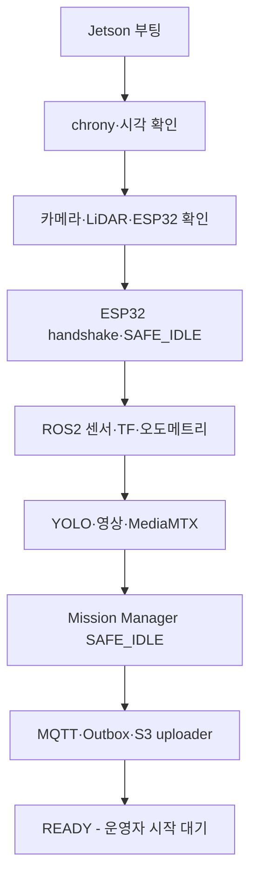

> Sentinel UGV 통합 명세서 v1.1의 일부 — 문서 규칙·버전·변경 이력은 [README](README.md) 참조

# 16. 테스트 및 검증 계획 [확정]

> 이 장은 요약이다. 시험 ID 정의, 정량 합격 기준, 시험 환경(E1~E4), 단계별 인수 Gate(G0~G7), 최종 시나리오(SCN-01~03)와 3회 연속 성공 규칙의 규범(상세)은 38장(요구사항 추적표·최종 인수 시험)이다. 영상 시험의 정량 기준은 32장에도 정의된다.

핵심 결정:

- 단위 → 컴포넌트 → 벤치 → 시뮬레이션/리플레이 → 통합 → 장애 주입 → 성능 → 시연 리허설 순으로 검증 단계를 올린다(16.1).
- 안전 시험은 구동 바퀴를 띄운 벤치(38-6 환경 E1)에서 시작하고, 낮은 속도의 바닥 시험, 실제 시나리오 순으로 올린다. 앞 Gate의 안전 결함이 남은 상태에서 속도·복잡도를 올리지 않는다.
- 개별 시험의 ID·정량 합격 기준·증빙은 38-3(기능)·38-4(비기능)·38-5(안전) 추적표를 단일 기준으로 삼는다. 이 장의 시험 ID 표는 38장으로 통합되었다.
- 요구사항 상태 전이(PLANNED→IMPLEMENTED→VERIFIED→ACCEPTED)와 재시험 규칙은 38-1 판정 원칙을 따른다.
- 최종 인수는 같은 release·firmware·config로 SCN-01 중심 통합 시연을 3회 연속 성공해야 한다(38-9).

## 16.1 테스트 단계
| **단계**            | **목적**                       | **예시**                                 |
|---------------------|--------------------------------|------------------------------------------|
| 단위 테스트         | 알고리즘·변환·API 로직 검증    | Frontier 점수, 좌표 변환, CDR·PGM 디코딩 |
| 컴포넌트 테스트     | 노드/서비스 단독 검증          | YOLO 노드, MQTT bridge, S3 uploader      |
| 벤치 테스트         | 구동 바퀴를 띄운 상태에서 검증 | 좌·우 구동 방향·제자리 회전, watchdog, E-Stop    |
| 시뮬레이션/리플레이 | 실물 없이 반복 검증            | rosbag, 가짜 텔레메트리, 녹화 영상       |
| 통합 테스트         | ROS2-AI-서버-웹 연결           | 탐지 이벤트와 지도 표시                  |
| 장애 주입 테스트    | 안전·복구 확인                 | Wi-Fi 차단, LiDAR 종료, 게임패드 분리    |
| 성능 테스트         | 실시간성·자원 사용량           | FPS, 지연, CPU/GPU, 온도                 |
| 시연 리허설         | 최종 흐름 안정화               | 3회 연속 성공                            |

## 16.2 하드웨어 테스트 체크리스트
차량을 바닥에서 띄운 상태에서 시작한다(38-6 환경 E1). ESP32 부팅 시 PWM 0·enable LOW, USB 분리 후 300ms 이내 정지, E-Stop 시 모터 전원 차단, 프로그램 종료 시 정지는 38장 CTRL 시험군과 G0~G1 Gate에서 검증한다. ESP32 Wi-Fi/Bluetooth는 제어 펌웨어에서 비활성화하고, DHT11·초음파 timeout이 100Hz 제어 태스크를 막지 않는지도 확인한다. 시험 ID가 없는 물리 점검 항목은 다음과 같다.

- □ 좌·우 구동 모터 방향과 제자리 회전(좌·우 역방향) 정상 동작 확인
- □ 전방 캐스터 2개 체결·높이 정렬·자유 선회 확인
- □ 배선 발열·커넥터 이탈 없음(BTS7960 ×2 포함)
- □ Jetson 저전압/재부팅 없음
- □ LiDAR·카메라 고정 마운트 체결 상태와 케이블 여유 확인
- □ LiDAR 스캔을 차체가 가리지 않음

## 16.3 자율주행 테스트
수동 지도 생성, 정적 목표 주행, 장애물 우회, 최소 반경 선회, Frontier 자동 선택·소진, home 복귀, 로컬 센서 장애 시 정지·오류 알림을 검증한다. 시험 ID와 합격 기준은 38-3 추적표의 NAV 시험군과 38-5의 SR-004를 규범으로 한다.

## 16.4 AI·영상 테스트
사람 탐지(정면·측면·부분 가림), 동일 인물 중복 억제, 사람 위치 추정, 다중 인원 encounter, 로컬 WebRTC·원격 EC2 경유 지연, encounter 전후 3초 버퍼, 카메라 단일 오픈(AI와 스트림 동시 안정성), 음성 상호작용(질문·응답·무응답 fallback)을 검증한다. 시험 ID와 측정 기준은 38-3의 AI·VID·VOI 시험군과 32장 VID-01~05 정량 기준을 규범으로 한다.

## 16.5 서버·데이터 테스트
임무 생성부터 종료까지의 상태 일관 저장, MQTT·WSS 재연결 후 최신 상태·pending 이벤트 복구, S3 업로드 실패 시 중복 없는 재시도, Presigned URL 만료·권한, 동일 제어권의 동시 획득 차단은 38-3~38-4의 MIS·NET·MED·SEC·DATA 시험군을 규범으로 한다. 추적표에 없는 점검 항목은 다음과 같다.

- □ TimescaleDB 쿼리가 임무 상세 그래프에 필요한 시간 범위를 반환하는가
- □ EC2 재배포 후 DB 데이터가 유지되는가

## 16.6 성능 로그 형식
```text
timestamp, mission_id, component,
latency_ms, fps, cpu_pct, gpu_pct, memory_mb,
jetson_temp_c, dropped_frames, network_rtt_ms,
state, error_code
```

시험 환경 정의, 인수 Gate, 최종 시나리오(SCN-01~03), 3회 연속 성공 규칙, 증빙 파일 구조, 결함 등급과 재시험 규칙은 38장을 참조한다.

# 36. 보안·개인정보·데이터 보호 정책

## 36-1. 범위와 기본 원칙

Sentinel은 사람의 얼굴·음성·위치·부상 관련 응답을 저장할 수 있으므로 일반 센서 로그보다 높은 보호 수준을 적용한다. 다만 본 시스템은 교육·시연용 프로토타입이며 실제 재난 구조 시스템의 법적·의료적 인증을 받은 제품이 아니다.

기본 원칙:

1. 필요한 이벤트 데이터만 수집한다.
2. 실시간 제어와 장기 저장 권한을 분리한다.
3. 인터넷 구간은 TLS로 보호한다.
4. S3 객체는 공개하지 않는다.
5. Jetson에 장기 AWS Access Key를 저장하지 않는다.
6. **인증은 MVP 범위 밖이다 (v2.0 결정).** 운영자 로그인·접근 토큰을 구현하지 않는다. 접근 경계는 EC2 Security Group 의 허용 IP 와 CORS 이며, 조종 충돌은 Control Session 이 중재한다(인증이 아니다). 근거와 남는 위험은 36-4.
7. 시연 종료 후 보존 기간에 따라 영상·음성을 삭제한다.
8. 비밀번호·토큰·Presigned URL·원문 음성을 일반 로그에 남기지 않는다.

---

## 36-2. 데이터 분류

| 등급 | 데이터 | 예시 | 보호 정책 |
|---|---|---|---|
| `SENSITIVE` | 얼굴·음성·부상 응답·정확한 위치 | 이벤트 MP4, transcript, victim report | 통제된 관제 환경만, 비공개 S3, 최소 보존 |
| `INTERNAL` | 임무·지도·경로·오류 | map, encounter metadata, safety event | 팀 내부 접근, DB 직접 공개 금지 |
| `OPERATIONAL` | 장치 상태·성능 | CPU/GPU, 온도 | 관제·운영 목적, 식별정보 최소화 |
| `PUBLIC` | 발표용 익명 통계 | 평균 지연, FPS, 성공률 | 얼굴·음성·위치 제거 후 공개 가능 |

발표 영상은 별도 편집본을 사용하고, 원본 이벤트 파일의 얼굴·음성을 그대로 외부에 배포하지 않는다. 필요하면 얼굴 모자이크와 음성 제거를 적용한다.

---

## 36-3. 위협 모델

| 위협 | 영향 | 핵심 대응 |
|---|---|---|
| 허용되지 않은 웹 조종 | 충돌·안전사고 | 네트워크 제한·배포 환경 토큰·Control Session·명령 TTL |
| 과거 명령 재전송 | 갑작스러운 주행 | `commandId`, sequence, TTL, Retain 금지 |
| MQTT 계정 탈취 | 상태 위조·명령 주입 | TLS, 차량별 계정·ACL, 키 교체 |
| S3 URL 노출 | 영상 무단 접근 | 짧은 만료, 비공개 버킷, 로그 마스킹 |
| Jetson 분실 | 로컬 영상·자격 증명 노출 | 최소 로컬 보존, 파일 권한, 키 폐기 절차 |
| Git에 비밀값 커밋 | 전체 인프라 노출 | CI secret scan, 환경변수·Secret 파일 |
| 공개 DB·MQTT 포트 | 데이터 탈취·변조 | Security Group 최소 공개, DB 사설 네트워크 |
| 악성·비정상 파일 업로드 | 저장소 오염 | 서버가 object key·형식·크기 결정, checksum |
| 로그를 통한 개인정보 유출 | 2차 노출 | transcript·토큰·URL 로그 금지 |
| 카메라·마이크 무고지 수집 | 개인정보 침해 | 시연 참가자 사전 고지·동의·삭제 일정 |

---

## 36-4. MVP 접근 보호와 제어권

> **v2.0 정정 (2026-08-04): 인증이 구현되지 않았다.** 이 절의 v1.1 내용은 계획이었고
> 실행되지 않았다. 명세가 "보호한다"고 적고 있는데 실제로는 열려 있는 것이 이 문서에서
> 가장 위험한 종류의 불일치이므로 **현재 상태를 그대로 적는다.**

### 실제 상태

`backend/src/main/java/com/sentinel/backend/common/config/SecurityConfig.java`:

```java
.authorizeHttpRequests(auth -> auth
        .requestMatchers("/api/**", "/actuator/**", "/ws/**",
                         "/swagger-ui/**", "/swagger-ui.html", "/v3/api-docs/**")
        .permitAll()
        .anyRequest().authenticated());
```

| 항목 | v1.1 계획 | 실제 |
|---|---|---|
| 운영자 로그인 (UI + `users` 테이블) | 구현한다 | **없다.** `users` 테이블 자체가 없다 — `V1__init_schema.sql` 둘째 줄이 `users`를 MVP 범위 밖으로 명시적으로 제외한다. 로그인 화면도 없다 |
| 허용 IP 제한 | EC2 Security Group | **없다.** 8080 이 `0.0.0.0/0` 이다 (2026-08-04 확인) |
| 배포 환경 접근 토큰 | Nginx/Spring 검증 | **없다** |
| WebSocket Origin·토큰 검증 | 검증한다 | Origin은 CORS로만 제한. 토큰 검증 **없다** |
| 임무 명령 API | 토큰·세션 없이 공개하지 않는다 | **`/api/**` 전체가 `permitAll()`이다** |
| Control Session | 단일 조종자 세션 | 구현됨. 다만 이것은 **애플리케이션 수준 중재**이고 인증이 아니다 |
| 15분 비활성 만료 | 구현 | Control Session TTL로 구현됨 |

즉 **접근 통제가 없다.** CORS 는 브라우저에만 적용되므로 `curl` 한 줄에는 아무 효력이 없고, Control Session 은 동시 조종을 중재하는 애플리케이션 규칙이지 인증이 아니다.

> **인터넷의 누구나 임무를 만들고 로봇에 명령을 보낼 수 있다.** EC2 8080 이
> `0.0.0.0/0` 이고 인증이 없다. 남은 것은 주소를 모른다는 사실뿐이며, 그것은
> 보호가 아니다. 실제 차량이 물리적으로 움직이므로 노출 결과가 데이터에 그치지
> 않는다.

### 젯슨 쪽 노출

같은 성격의 노출이 하나 더 있다. `foxglove_bridge`의 8765 포트는 **읽기 인증이 없고**, 젯슨이 공인 IP에 있어 인터넷에서 닿는다. S15P11A301-224에서 TLS를 켜고 쓰기를 막고(`capabilities: [connectionGraph]`) 토픽을 6개로 좁혔으나 읽기는 열려 있다. 지도·LiDAR 스캔·TF가 그 대상이다.

**명시적으로 수락한 위험**이며, 완화는 "볼 때만 켜고 보고 나면 끈다"(`viz_down.sh`)와 `--local` + SSH 터널이다. 자세한 내용은 04장 8.5.

### v2.0 결정: 인증을 구현하지 않는다

**MVP 범위에서 제외한다.** 교육·시연용 프로토타입이고 시연이 LAN에서 이루어지므로, 남은 기간에 인증을 새로 만드는 것보다 노출 범위를 좁히는 쪽이 값이 크다. 애매하게 "구현한다"고 적어 두는 것보다 **안 한다고 적는 것이 낫다** — 그래야 위험을 알고 운영한다.

이 결정으로 남는 위험과 그 완화는 다음과 같다.

| 남는 위험 | 완화 |
|---|---|
| 인터넷의 누구나 임무 생성·명령 가능 | **완화 없음 (2026-08-04 현재).** 8080 이 `0.0.0.0/0` 이고 인증도 없다. 아래 "즉시 조치" 참조 |
| 동시 조종 충돌 | Control Session 단일 조종자 중재 + TTL(애플리케이션 수준) |
| 젯슨 8765 무인증 읽기 | 시연 중에만 기동(`viz_up.sh`/`viz_down.sh`). 쓰기는 이미 차단 |
| 평문으로 오간 자격증명 | 시연 후 전부 교체 |

### 즉시 조치

인증을 구현하지 않기로 한 결정은 **EC2 Security Group 이 경계라는 전제**에서 나왔다. 확인 결과 그 전제가 성립하지 않는다. 두 가지 중 하나는 반드시 해야 한다.

- [ ] **8080 인바운드를 좁힌다.** 시연 장소 IP 또는 Vercel 출구 IP + 젯슨 IP. 가장 값싸고 확실하다
- [ ] 좁힐 수 없다면(Vercel 출구 IP 가 고정이 아니다) **명령 계열 엔드포인트에만 공유 토큰을 둔다.** `POST /missions`, `POST /missions/{id}/commands`, `POST /control-sessions` 세 곳이다. 조회는 열어 두어도 피해가 데이터에 그친다

두 번째가 현실적일 가능성이 높다 — Vercel 서버리스 출구 IP 는 고정되지 않으므로 IP 제한만으로는 관제 웹이 막힌다. 헤더 하나 검사하는 필터로 충분하며, 로그인·세션·`users` 테이블은 여전히 필요 없다.

운영 시 확인 항목:

- [ ] `foxglove_bridge`를 상시 기동하지 않는다
- [ ] 시연 후 자격증명 교체 (Docker Hub PAT·MinIO·Vercel·MQTT·DB)

추후 다중 사용자 서비스로 확장할 때 로그인·회원가입·역할 권한 세분화를 별도 설계한다. 그때 `users`·`control_sessions.user_id`·`control_commands.issued_by_user_id` 정의를 그대로 쓸 수 있다(13장에 남겨 두었다).

---

## 36-5. MQTT 보안

```text
Jetson cloud_bridge
→ MQTT 5 over TLS :8883
→ Mosquitto
← Spring Boot service account
```

필수 정책:

- 평문 MQTT 1883 인터넷 공개 금지
- 익명 접속 금지
- Jetson 차량별 계정과 긴 무작위 비밀번호 또는 클라이언트 인증서
- Mosquitto ACL로 차량별 토픽 제한
- Spring Boot 계정과 차량 계정 분리
- `cmd/*` Retain 금지
- TLS 인증서 만료일 모니터링
- 접근 토큰 검증 실패와 ACL 거부 로그 수집

예시 ACL 의미:

```text
robot SENTINEL-01
  publish: sentinel/v1/robots/SENTINEL-01/presence|state|telemetry|events|acks
  subscribe: sentinel/v1/robots/SENTINEL-01/cmd/*

backend service
  subscribe: sentinel/v1/robots/+/presence|state|telemetry|events|acks
  publish: sentinel/v1/robots/+/cmd/*
```

차량 자격 증명이 노출되면 해당 계정만 비활성화·교체할 수 있어야 한다. 여러 장치가 하나의 MQTT 계정을 공유하지 않는다.

---

## 36-6. REST·WebSocket·WebRTC 보안

### REST/WSS

- 외부 공개는 Nginx 443만 사용한다.
- Spring Boot, PostgreSQL, TimescaleDB의 내부 포트는 외부에 직접 열지 않는다.
- 입력 JSON은 schema, 길이, 범위, enum을 검증한다.
- 명령 요청에는 접근 토큰, Control Session, `commandId`, TTL을 검증한다.
- 오류 응답에 stack trace, DB 쿼리, 내부 IP를 노출하지 않는다.
- 요청 rate limit을 두되 E-Stop은 유효한 Control Session이 제한 때문에 누락되지 않게 별도 정책을 적용한다.

### WebRTC

- Jetson의 WHEP signaling도 HTTPS를 사용한다.
- 관제 노트북에만 신뢰된 로컬 인증서를 설치한다.
- 스트림 주소를 알기만 하면 누구나 시청할 수 있는 구성을 피한다.
- MediaMTX path 인증 또는 짧은 토큰을 사용한다.
- ICE candidate에 불필요한 외부 인터페이스를 노출하지 않는다.
- 원격 TURN을 도입하면 장기 credential을 프론트 코드에 하드코딩하지 않는다.

라이브 영상 연결 실패 때문에 TLS 검증을 끄거나 브라우저 보안 플래그를 비활성화한 상태를 최종 시연 구성으로 사용하지 않는다.

---

## 36-7. S3·DB 보호

### S3

- Block Public Access 활성화
- 객체 공개 ACL 금지
- HTTPS 전송만 허용
- 기본 서버 측 암호화 사용
- Jetson에는 AWS Access Key를 저장하지 않고 Spring Boot가 짧은 Presigned PUT URL 발급
- 조회도 짧은 Presigned GET URL 사용
- object key는 클라이언트 입력을 그대로 쓰지 않고 서버가 `missionId/encounterId/mediaId`로 생성
- 업로드 완료 시 크기, MIME, SHA-256, `encounterId`를 검증
- Presigned URL 전체를 애플리케이션 로그에 출력하지 않음

권장 만료:

| 용도 | 초기 만료 |
|---|---:|
| 이벤트 업로드 PUT | 10분 |
| 관제 재생 GET | 5분 |
| 썸네일 GET | 5분 |

네트워크 장애로 Presigned URL이 만료되면 기존 URL을 재사용하지 않고 새 URL을 발급한다.

### PostgreSQL·TimescaleDB

- DB는 Docker 내부 또는 사설 네트워크에서만 접근
- 애플리케이션 계정에 필요한 스키마 권한만 부여
- 운영 계정과 migration 계정 분리 권장
- 자동 백업 파일도 같은 수준으로 보호
- transcript 검색을 위해 불필요한 전체 텍스트 인덱스를 만들지 않음
- 직접 DB 조회가 필요하면 팀원별 계정 또는 제한된 읽기 계정 사용

---

## 36-8. Jetson 로컬 데이터·비밀값

로컬 경로 권장:

```text
/etc/sentinel/secrets/       root:sentinel 0640
/var/lib/sentinel/media/     sentinel:sentinel 0750
/var/lib/sentinel/outbox/    sentinel:sentinel 0750
/var/log/sentinel/           sentinel:adm 0750
```

필수 규칙:

- `.env`, 인증서 private key, MQTT 비밀번호를 Git에 올리지 않는다.
- systemd의 `EnvironmentFile` 또는 읽기 제한된 Secret 파일을 사용한다.
- Jetson shell history에 토큰과 Presigned URL을 직접 입력하지 않는다.
- 업로드 완료된 로컬 영상은 보존 정책에 따라 삭제한다.
- 서비스는 root가 아니라 필요한 장치 그룹만 가진 전용 사용자로 실행한다.
- `/dev/video*`, `/dev/tty*`, GPIO 접근 권한은 그룹과 udev 규칙으로 제한한다.

교육용 장비에서 전체 디스크 암호화를 적용하기 어렵다면 물리 접근 통제와 짧은 로컬 보존을 최소 대책으로 사용한다.

---

## 36-9. 보존·삭제 정책

다음은 MVP 기본값이며 지도교수·교육기관 정책이 있으면 그 정책을 우선한다.

| 데이터 | 기본 보존 | 삭제 방식 |
|---|---:|---|
| 이벤트 원본 MP4·오디오 | 30일 | S3 Lifecycle + DB 상태 갱신 |
| 썸네일 | 30일 | 원본 이벤트와 함께 삭제 |
| STT transcript | 30일 | interaction turn에서 삭제·비식별화 |
| 피해자 구조화 보고 | 30일 | encounter·victim 연결과 함께 삭제 |
| 임무 지도·경로 | 90일 | 임무 삭제 요청 시 함께 삭제 |
| 일반 telemetry | 30일 | TimescaleDB retention policy |
| 운영·보안 로그 | 14일 | rotation·retention |
| 발표용 익명 통계 | 프로젝트 종료까지 | 개인 식별 가능 정보 제거 |

임무 삭제 순서:

```text
DELETE_REQUESTED
→ 제어·업로드 작업 중지 확인
→ S3 객체 삭제
→ media_assets DELETED 확인
→ victim·interaction·encounter 삭제 또는 비식별화
→ telemetry·path 삭제
→ mission 삭제
→ 감사 로그에 결과만 기록
```

삭제가 일부 실패하면 `PARTIAL_DELETE` 상태로 두고 재시도한다. DB 행만 먼저 지워서 S3 고아 객체가 남는 상황을 만들지 않는다.

---

## 36-10. 시연 참가자 고지

시연에는 촬영과 음성 저장에 동의한 팀원 또는 역할 참가자만 피해자 역할로 참여한다.

고지 내용:

- 카메라와 마이크가 작동함
- 사람 탐지·위치·음성 응답이 저장될 수 있음
- 데이터 사용 목적은 프로젝트 검증과 발표임
- 보존 기간과 삭제 요청 방법
- 실제 의료 진단·구조 판단 시스템이 아님

관객이 우연히 촬영될 수 있는 공개 공간 대신 통제된 실내 코스를 사용한다. 발표 자료에는 원본보다 사전 동의한 편집 영상을 사용한다.

---

## 36-11. 사고 대응

비밀값 또는 장치 분실 시:

1. 해당 Jetson MQTT 계정 비활성화
2. 배포 환경 접근 토큰 교체
3. 노출된 인증서와 token 폐기
4. Presigned URL은 만료 확인, 필요 시 발급 권한 차단
5. S3·Nginx·Mosquitto 접근 로그 확인
6. 의심 시간대의 명령·다운로드 내역 확인
7. 영향받은 시연 참가자와 팀에 공유
8. 재발 방지 조치와 교체 일자를 기록

Jetson에는 정적 AWS 키를 두지 않으므로 분실 시 S3 전체 권한이 유출되는 구조를 피한다.

---

## 36-12. 보안 인수 시험

| ID | 시험 | 합격 기준 |
|---|---|---|
| SEC-01 | 허용 IP·접근 토큰 없는 REST/WSS 접근 | 401/403 또는 네트워크 차단, 제어 명령 실행 0회 |
| SEC-02 | 두 브라우저 조종 시도 | 하나의 Control Session만 유효 |
| SEC-03 | MQTT 익명·다른 차량 토픽 접근 | broker가 거부 |
| SEC-04 | MQTT 1883 외부 접근 | 연결 불가 |
| SEC-05 | S3 객체 URL 직접 접근 | 공개 접근 거부 |
| SEC-06 | 만료된 Presigned URL | 업로드·조회 거부 |
| SEC-07 | 잘못된 object key·크기·checksum | 완료 처리 거부 |
| SEC-08 | Git secret scan | 실제 비밀번호·private key 검출 0건 |
| SEC-09 | 로그 점검 | 접근 token·Presigned URL·음성 원문 노출 0건 |
| SEC-10 | 임무 삭제 | DB와 S3 대상이 모두 삭제 또는 명시적 실패 상태 |
| SEC-11 | WebSocket Origin 위조 | handshake 거부 |
| SEC-12 | Jetson 계정 폐기 | 폐기 후 MQTT 재연결 불가 |

---

## 36장 최종 확정안

> Sentinel의 얼굴·음성·위치·부상 응답은 민감 데이터로 분류하고 비공개 S3와 제한된 DB에 저장한다. MVP에는 회원가입 기능을 넣지 않고 관리자가 사전 등록한 운영자 로그인만 구현하며, 허용 IP 또는 배포 환경 토큰, HTTPS/WSS, 단일 Control Session으로 시연 접근과 조종 권한을 제한한다. MQTT는 TLS·차량별 계정·ACL을 사용하고, Jetson은 AWS 키 대신 짧은 Presigned URL만 사용한다. 이벤트 데이터는 기본 30일 후 삭제하며 시연 참가자에게 수집 목적과 보존 기간을 사전 고지한다.

---

# 37. 운영·모니터링·장애 복구 설계

## 37-1. 운영 목표

운영 설계의 목표는 장애를 전부 막는 것이 아니라, **어디가 고장 났는지 빠르게 확인하고 차량을 안전 상태로 만든 뒤 재현 가능한 순서로 복구하는 것**이다.

운영 원칙:

- 부팅·재연결 후 자동 주행 재개 금지
- 모터 enable보다 상태 점검을 먼저 수행
- 프로세스 자동 재시작과 임무 자동 재개를 구분
- 영상·이벤트·제어 상태를 각각 health로 관리
- wall clock은 기록 정렬, monotonic clock은 TTL·watchdog에 사용
- 실패를 숨기지 않고 `DEGRADED`, `FAULT`, `PAUSED`로 명시

---

## 37-2. Jetson 부팅 순서



세부 순서:

1. OS, NVMe, 네트워크가 올라온다.
2. `chrony`가 동작하고 시각 이상 여부를 기록한다.
3. ESP32는 독립적으로 `SAFE_IDLE`, PWM 0을 유지한다.
4. udev 별칭으로 카메라·LiDAR·ESP32 장치를 확인한다. IMU는 독립 USB 장치가 아니라 센서 ESP32 뒤에 있으므로 별도 udev 장치를 찾지 않는다.
5. ESP32 handshake와 펌웨어 버전을 확인하고 센서 ESP32의 IMU bus·주기·보정 상태를 확인한다.
6. ROS2 센서 driver, robot_state_publisher, TF, `/imu/data_raw`, odometry를 시작한다.
7. SLAM/Nav2 lifecycle node를 inactive 상태로 준비한다.
8. GStreamer, MediaMTX, YOLO, 녹화 링 버퍼를 시작한다.
9. Mission Manager와 안전 노드를 시작한다.
10. MQTT, Outbox worker, S3 uploader를 시작한다.
11. 모든 필수 health가 정상이면 `READY`를 표시한다.
12. 운영자 명령 전까지 모터 enable을 허용하지 않는다.

온습도, S3, EC2 연결 같은 보조 기능이 실패해도 `DEGRADED_READY`로 시작할 수 있지만 ESP32, E-Stop, 엔코더, LiDAR, TF가 실패하면 자율 임무 시작을 차단한다.

---

## 37-3. systemd 서비스 구조

> **v2.0 정정 (2026-08-04):** 유닛이 **1개 구현돼 있다.**
> `scripts/systemd/sentinel-demo.service`가 S15P11A301-156에서 만들어졌다.
> v1.1의 "구현된 유닛은 없다"는 무효다.
>
> 아래 9개로 쪼개는 구조는 채택하지 않았다. 실제 구조는 **단일 진입점**이다.
>
> ```text
> sentinel-demo.service  →  scripts/demo_up.sh  →  ros2 launch sentinel_bringup demo.launch.py
> ```
>
> 노드별 유닛으로 쪼개지 않은 이유는 launch 파일이 이미 의존 순서와 시작 지연을
> 관리하고 있고, 유닛 9개로 나누면 그 순서를 두 곳에서 관리하게 되기 때문이다.
> 유닛은 **기본 비활성**이며(`systemctl enable`을 하지 않는다) 손으로 올릴 때는
> `./scripts/demo_up.sh`, 내릴 때는 `./scripts/demo_down.sh`를 쓴다.
>
> `demo_down.sh`는 내린 뒤 **다시 훑어서 남은 프로세스가 있으면 0이 아닌 값으로 종료한다.**
> 예전에는 "내렸다"만 출력하고 1601MB짜리 탐지 프로세스가 살아남는 일이 있었다.
>
> MVP가 자동 복구를 구현하지 않으므로 `Restart` 정책의 이점은 여전히 작다. 개발 중에는
> 오히려 방해가 된다(로그가 `journalctl`로 가고, `Restart`가 죽인 프로세스를 되살려
> 디버깅이 꼬인다). 38장 인수 시험에 systemd를 요구하는 항목도 없다.
>
> **안전은 영향받지 않는다.** 아래 정책의 두 번째 항목대로 `esp32-motor-bridge`가 죽어도
> 모터 ESP32 watchdog이 모터를 정지시킨다. systemd는 그 근거가 아니다.

아래는 채택하지 않은 v1.1 설계다. 향후 쪼갤 필요가 생길 때의 참고로만 남긴다.

권장 서비스:

```text
sentinel-esp32-motor-bridge.service
sentinel-esp32-sensor-bridge.service
sentinel-ros-bringup.service
sentinel-media.service
sentinel-perception.service
sentinel-mission.service
sentinel-cloud-bridge.service
sentinel-uploader.service
sentinel-health-agent.service
```

의존 관계:

```text
esp32-motor-bridge
esp32-sensor-bridge
├─ ros-bringup
│  ├─ perception
│  └─ mission
├─ media
└─ cloud-bridge
   └─ uploader
```

정책:

- 비안전 서비스는 `Restart=on-failure`와 지수 백오프를 사용한다.
- `esp32-motor-bridge`가 죽어도 모터 ESP32 watchdog이 모터를 정지한다. `esp32-sensor-bridge`가 죽으면 엔코더·IMU·환경·근접 데이터가 끊겨 Jetson이 AUTO를 PAUSED로 전환한다.
- `ExecStop`과 signal handler는 STOP을 보내되 이것만 안전 근거로 삼지 않는다.
- 반복 실패 횟수가 임계값을 넘으면 무한 재시작 대신 `FAILED`로 남기고 관제에 원인을 표시한다.
- 서비스 파일과 환경변수는 Git에서 template로 관리하고 secret은 분리한다.

프로세스 재시작 후 Mission Manager는 `SAFE_IDLE`(임무 이력 없음) 또는 `PAUSED`(복구된 임무 존재)로 복구한다. 복구 진입 여부는 상태 필드가 아니라 이벤트 로그(`RECOVERED_FROM_RESTART`)로 기록한다. 표준 상태 머신(14.1·26.2)에 없는 별도 상태를 도입하지 않으며, 재부팅 전의 AUTO/MANUAL 동작을 자동으로 이어서 실행하지 않는다.

---

## 37-4. EC2 시작·종료 순서

Docker Compose 시작 순서:

```text
PostgreSQL + TimescaleDB healthy
→ DB migration
→ Mosquitto healthy
→ Spring Boot healthy
→ Next.js/Nginx healthy
→ 선택: EC2 MediaMTX
```

중지 순서:

1. 새로운 임무·제어 세션 생성을 차단한다.
2. 활성 Control Session에 STOP을 보내고 만료시킨다.
3. Spring Boot가 Outbox·DB 작업을 마무리한다.
4. Next.js·Spring Boot·Mosquitto를 중지한다.
5. 마지막에 DB를 중지한다.

배포 중 서버가 잠시 내려가도 Jetson의 현재 자율 임무를 강제로 계속하게 두지 않는다. 최신 안전 정책에 따라 EC2 연결 단절 시 로컬 자율 탐사를 계속할 수 있으나, 수동 조작 중 연결이 끊기면 300ms TTL로 정지하고 `PAUSED`로 전환한다.

---

## 37-5. Health 모델

health는 단순 Boolean이 아니라 다음 상태를 사용한다.

```text
OK
DEGRADED
FAILED
UNKNOWN
```

| 컴포넌트 | 확인 항목 | FAILED 시 |
|---|---|---|
| ESP32 | heartbeat, firmware, fault, E-Stop | 모터 정지, 임무 불가 |
| Encoder | tick 변화·방향·불연속 | AUTO 중지 |
| LiDAR | `/scan` 주기·범위 | AUTO 중지 |
| Camera | frame 주기 | 탐사 일시정지 |
| IMU(센서 ESP32 경유) | `/imu/data_raw` 주기·NaN·bias·sequence·측정 timestamp·stale | 융합 축소 또는 AUTO 중지 |
| SLAM | pose update·scan matching | PAUSED |
| Nav2 | lifecycle·action 상태 | 목표 취소·PAUSED |
| YOLO | inference heartbeat | 탐사는 정책에 따라 일시정지, 사람 탐지 불가 경고 |
| MediaMTX | publisher·viewer·frame age | 수동 영상 경고·전진 차단 |
| Ring buffer | 최근 조각·쓰기 지연 | 녹화 오류 경고 |
| MQTT | 연결·마지막 ACK | 관제 OFFLINE, 로컬 정책 적용 |
| Outbox | pending 개수·최고 age | 업로드 지연 경고 |
| DB/S3 | 요청 성공률·지연 | 로컬 저장·재시도 |

로봇 종합 상태:

```text
READY       = 모든 필수 health OK
DEGRADED    = 보조 기능 실패, 안전 주행 가능
PAUSED      = 임무 진행 불가, 모터 정지
FAULT       = 수동 확인·reset 없이는 복구 불가
ESTOP       = 물리/소프트웨어 E-Stop latch
```

---

## 37-6. 관제 지표와 임계값

초기 운영 임계값:

| 지표 | 경고 | 심각·동작 |
|---|---:|---|
| Jetson CPU | 90% 60초 | 추론 FPS·영상 해상도 축소 검토 |
| Jetson GPU | 95% 60초 | STT·오버레이 우선 축소 |
| Memory | 85% | 95%에서 새 STT 작업 차단 |
| Jetson 온도 | 75°C | 85°C에서 임무 PAUSED·냉각 확인 |
| 디스크 여유 | 10GB 미만 | 5GB 미만 캐시 정리·rosbag 차단 |
| 링 조각 생성 지연 | 2초 초과 | 녹화 `DEGRADED` |
| WebRTC frame age | 1초 | 3초에서 수동 전진 차단 |
| ESP32 heartbeat | 100ms | 300ms에서 ESP32 로컬 정지 |
| MQTT heartbeat | 3초 | 5초에서 관제 OFFLINE |
| Outbox 최고 대기 | 5분 | 30분에서 심각 경고 |
| ~~배터리~~ | — | **v2.0 폐기.** 전압 센서 미장착으로 저전압 복귀·정지를 구현하지 않는다(04장 14.6) |

온도 임계값은 보수적인 프로젝트 정책이며 실제 Jetson 모듈의 전력 모드·냉각·thermal specification을 확인해 최종 고정한다.

---

## 37-7. 로그 정책

공통 로그 필드:

```json
{
  "timestamp": "2026-07-22T08:10:01.123Z",
  "level": "ERROR",
  "component": "esp32_motor_bridge",
  "robotId": "SENTINEL-01",
  "missionId": "...",
  "eventCode": "ESP32_COMM_TIMEOUT",
  "message": "No valid drive state for 320ms",
  "context": {"lastSequence": 1832}
}
```

로그에 넣지 않는 값:

- DB·MQTT 비밀번호
- MQTT credential
- 배포 환경 접근 token
- Presigned URL 전체
- 피해자 음성 원문
- transcript 전체 문장

Jetson은 journald와 파일 rotation을 사용하고, 14일 또는 용량 상한 중 먼저 도달한 기준으로 정리한다. 안전 이벤트와 임무 이벤트는 일반 debug 로그와 별도로 DB에 구조화하여 보존한다.

주요 확인 명령:

```bash
systemctl --failed
journalctl -u sentinel-esp32-motor-bridge -f
journalctl -u sentinel-esp32-sensor-bridge -f
journalctl -u sentinel-media -f
ros2 node list
ros2 topic hz /scan
ros2 topic echo /diagnostics
tegrastats
df -h /var/lib/sentinel
sudo docker compose ps
sudo docker compose logs --since=10m backend
```

---

## 37-8. 장애별 복구 Runbook

| 장애 | 자동 처리 | 운영자 처리 | 재개 조건 |
|---|---|---|---|
| Jetson 앱 crash | ESP32 정지 (systemd 재시작은 MVP 범위 외) | 로그·health 확인, `scripts/start_sentinel.sh` 재실행 | SAFE_IDLE에서 명시적 시작 |
| Jetson OS reboot | ESP32 timeout·정지 | 센서·서비스 전체 점검, `scripts/start_sentinel.sh` 재실행 | READY 확인 후 시작 |
| ESP32 USB 분리 | 300ms 정지, bridge 재탐색 | 케이블·전원 확인 | handshake·엔코더 정상 |
| ESP32 reset | 출력 0, reset reason 보고 | fault 원인 확인 | 새 handshake와 enable |
| LiDAR 분리 | Nav2 취소·PAUSED | USB·전원·driver 확인 | `/scan` 안정 10초 |
| 카메라 분리 | YOLO·영상 중지·PAUSED | 장치·파이프라인 확인 | frame 안정 10초 |
| WebRTC 실패 | 자동 signaling 재시도 | 인증서·IP·MediaMTX 확인 | 지연 시험 통과 |
| MQTT 단절 | Outbox 저장, presence OFFLINE | Wi-Fi·broker 확인 | 상태 동기화 후 명시적 재개 |
| EC2 장애 | 수동 정지, 로컬 저장 | Compose·DB health 확인 | 명령·상태 round-trip 확인 |
| DB 장애 | 요청 실패·Outbox 보존 | DB 로그·디스크·migration 확인 | health·쓰기 시험 통과 |
| S3 장애 | UPLOAD_PENDING | IAM·URL·네트워크 확인 | checksum 포함 업로드 성공 |
| 디스크 부족 | 완료 캐시 정리 | 오래된 rosbag·임시파일 검토 | 10GB 이상 확보 |
| 과열 | 추론 축소 또는 PAUSED | 팬·히트싱크·통풍 확인 | 온도 안정 5분 |
| 저전압 | **자동 대응 없음 (v2.0)** | 배터리·DC-DC 점검 | 시연 전 충전·전압 확인 |

어떤 장애 상황에서도 단순 재연결만으로 모터를 자동 재가동하지 않는다.

---

## 37-9. 시각 동기화

Jetson과 EC2는 chrony/NTP로 UTC 시각을 맞춘다.

- `occurredAt`: 사건이 실제 발생한 Jetson 시각
- `receivedAt`: 서버 수신 시각
- `senderUptimeMs`: 장치 부팅 후 monotonic 시간
- TTL·watchdog: wall clock이 아니라 monotonic clock

시각 오차가 1초를 넘으면 관제에 경고하고, 5초를 넘으면 이벤트 타임라인을 `TIME_UNSYNCED`로 표시한다. 제어 TTL은 시각 동기화가 틀려도 로컬 monotonic 시간으로 안전하게 만료되어야 한다.

---

## 37-10. Outbox와 미디어 복구

SQLite Outbox 항목:

```text
outbox_id
message_id UNIQUE
message_type
payload_json
created_at
attempt_count
next_attempt_at
last_error
status
```

상태:

```text
PENDING → SENDING → ACKED
                └→ RETRY_WAIT
                └→ DEAD_LETTER
```

재시도는 1, 2, 4, 8, 16, 최대 60초 백오프와 작은 jitter를 사용한다. 중요 encounter 보고는 `messageId`를 유지하여 서버가 중복 저장하지 않게 한다.

부팅 시 미디어 복구 순서:

1. `.partial` 파일과 segment manifest 검색
2. 참조 조각 존재 여부 확인
3. 재다중화 가능한 이벤트는 MP4 복구
4. checksum 계산
5. DB/Outbox와 미디어 상태 대조
6. 업로드되지 않은 파일을 `UPLOAD_PENDING`으로 재등록
7. 복구 불가 파일은 `CORRUPT`, 원인과 조각 목록 기록

---

## 37-11. 배포·롤백

### EC2

- Docker image에 `latest`만 사용하지 않고 commit SHA 또는 release tag를 부여한다.
- DB migration은 배포 전에 백업과 하위 호환성을 확인한다.
- health check 실패 시 이전 Compose image tag로 되돌린다.
- migration이 비가역이면 롤백 스크립트 또는 복원 절차를 함께 준비한다.

### Jetson

- ROS2 package, Python venv, MediaMTX binary, config version을 release 단위로 묶는다.
- 현재 동작 버전과 이전 정상 버전을 각각 유지한다.
- 배포 중 모터는 SAFE_IDLE로 두고 구동 바퀴를 바닥에서 띄운다.
- ESP32 firmware와 Jetson protocol version 호환표를 확인한다.
- firmware update 실패 시 ST-Link 등 유선 복구 경로를 문서화한다.

배포 완료는 프로세스가 실행되었다는 사실이 아니라 `ESP32 handshake → 센서 health → 로컬 영상 → 가짜 임무 명령 → STOP` smoke test 통과로 판정한다.

---

## 37-12. 시연 전 백업·점검

시연 전날 고정할 항목:

- Jetson release tag와 ESP32 firmware hash
- 승인된 calibration/config 묶음
- EC2 Compose image tag
- DB schema version
- MediaMTX·GStreamer 설정
- 로컬 인증서와 접속 주소
- 발표용 예비 임무 데이터
- E-Stop·배터리·예비 케이블

시연 당일에는 기능 추가보다 정상 버전 복구 가능성을 우선한다. 온라인 배포가 실패하면 이전 image와 config로 10분 안에 롤백할 수 있어야 한다.

---

## 37-13. 운영 인수 시험

| ID | 시험 | 합격 기준 |
|---|---|---|
| OPS-01 | Jetson cold boot | 모터 0 유지, 서비스 순서대로 READY |
| OPS-02 | 임무 중 Jetson 재부팅 | ESP32 정지, 재부팅 후 자동 주행 재개 없음 |
| OPS-03 | ESP32 reset | 모터 출력 0, reset reason 표시 |
| OPS-04 | LiDAR·카메라 순차 분리 | 정의된 PAUSED·FAULT와 정확한 컴포넌트 표시 |
| OPS-05 | MQTT·EC2 5분 차단 | 중요 이벤트·영상 로컬 보존, 복구 후 재전송 |
| OPS-06 | DB·S3 장애 | 손실 없이 pending 유지, 정상화 후 멱등 처리 |
| OPS-07 | 시각 10초 오차 주입 | 경고 표시, TTL·watchdog 정상 동작 |
| OPS-08 | 디스크 임계값 | 자동 정리 또는 명시적 recording failure |
| OPS-09 | 이전 버전 롤백 | 10분 내 정상 smoke test 완료 |
| OPS-10 | 로그 보안 검사 | secret·URL·음성 원문 노출 0건 |
| OPS-11 | 60분 통합 운전 | 비정상 reset·메모리 고갈·서비스 crash 0회 |

---

## 37장 최종 확정안

> Jetson은 ESP32 SAFE_IDLE과 장치 인식부터 시작해 ROS2, 영상·AI, Mission Manager, 클라우드 연결 순서로 부팅하며 운영자 명령 전에는 모터를 enable하지 않는다. 각 컴포넌트는 OK·DEGRADED·FAILED·UNKNOWN 상태와 정량 임계값을 가지며, 장애 후 서비스는 재시작할 수 있어도 주행은 자동 재개하지 않는다. 중요 이벤트와 영상은 SQLite Outbox와 로컬 조각으로 복구하고, 배포 실패 시 이전 release·firmware·config 묶음으로 롤백한다.

---

# 38. 요구사항 추적표·최종 인수 시험

## 38-1. 목적과 판정 원칙

본 장은 요구사항, 구현 모듈, 시험, 정량 합격 기준, 증빙을 연결한다. 코드가 merge되었거나 한 번 동작했다는 사실만으로 완료 처리하지 않는다.

요구사항 상태:

```text
PLANNED
IMPLEMENTED
VERIFIED
ACCEPTED
DEFERRED
FAILED
```

판정 원칙:

- `IMPLEMENTED`: 실제 하드웨어 또는 지정된 통합 환경에서 기능이 실행됨
- `VERIFIED`: 연결된 시험과 정량 기준을 통과하고 증빙이 있음
- `ACCEPTED`: 전체 시나리오와 회귀 시험까지 통과해 팀이 최종 승인함
- `DEFERRED`: 선택·확장 기능으로 최종 시연 범위에서 제외하고 이유가 기록됨
- 시험 실패 후 코드·배선·파라미터를 바꾸면 영향받는 시험을 다시 수행함
- 3회 연속 시연 중 설정을 바꾸면 연속 성공 횟수를 0으로 초기화함

---

## 38-2. 최신 기능 요구사항 기준선

최신 대화에서 확정된 이벤트·피해자 대응 요구사항은 다음과 같다.

```text
FR-007
탐지 확정 전 3초 + 접근·음성 상호작용 전체 + 종료 후 3초를
하나의 encounter 이벤트 영상으로 저장해야 한다.

FR-008
사람 발견 시 탐사를 일시정지하고 안전거리까지 접근하여 음성 상호작용과 보고를
완료한 뒤, 안전 조건이 충족된 경우에만 탐사를 재개해야 한다.
```

추가 요구사항:

| ID | 요구사항 | 등급 |
|---|---|---|
| `FR-021` | STT-LLM-TTS로 피해자 응답을 해석하고 제한된 안내·구조화 보고를 생성해야 한다. | 필수 |
| `FR-022` | 한 화면의 여러 사람을 개별 추적하되 하나의 encounter로 관리해야 한다. | 필수 |
| `FR-023` | Jetson과 ESP32 2개(모터 제어용·센서 제어용)를 분리하고, 모터 ESP32가 저수준 모터 구동을, 센서 ESP32가 엔코더·차체 IMU·DHT11·초음파 수집·watchdog을 담당해야 한다. | 필수 |
| `FR-024` | ~~짐벌은 NAV_LOCK과 CENTER_LOCK을 제공하고 SLAM 악화 시 fallback해야 한다.~~ **폐기 — 짐벌 미사용 확정(6.4)**, 카메라·LiDAR는 차체 고정 마운트로 대체 | 폐기 |
| `FR-025` | 관제·MQTT·S3 접근은 인증과 암호화 정책을 적용해야 한다. | 필수 |
| `FR-026` | 네트워크 단절 중 이벤트를 로컬 보관하고 복구 후 멱등 재전송해야 한다. | 필수 |
| `FR-027` | 이벤트·대화·피해자·미디어는 encounter 중심 관계로 조회되어야 한다. | 필수 |
| `FR-028` | 부팅·재연결 후 차량은 자동 주행을 재개하지 않아야 한다. | 필수 |

---

## 38-3. 기능 요구사항 추적표

초기 상태는 모두 `PLANNED`이며 실제 구현·시험 후 갱신한다.

> **v2.0 대조 (2026-08-04): 현재 구현 상태로는 통과할 수 없는 항목이 있다.**
> 시험을 돌려 확인한 것이 아니라 **선행 구현의 부재로 구조적으로 막혀 있는 것**만
> 아래에 적는다. 나머지는 여전히 `PLANNED`이며 시험 후 갱신한다.
>
> | ID | 막고 있는 것 |
> |---|---|
> | FR-003 (frontier 3개 순차 선택) | `sentinel_exploration` 소스 0개 (S15P11A301-172). `/cmd_vel` 소비자는 생겼다 — `vehicle_kinematics`(234) 가 구독하고 `safety_gate`(237) 가 발행한다 (04장 8.2·24.1) |
> | FR-004 (충돌 0회, 우회 또는 안전 정지) | 안전 체인은 구현·관통 확인됐다(S15P11A301-237, 04장 24.1). 남은 것은 **실차 검증** — `demo.launch.py` 의 `enable_safety`·`enable_nav2` 가 둘 다 기본 false 이고, 정지 구역 값이 제동거리 미실측 상태의 잠정값이다(TBD-CAL-001) |
> | FR-011 (입력 단절 후 300ms 이내 PWM 0) | ROS 측 `safety_gate` 는 구현됐고 상류 단절 시 `/cmd_vel=0` 을 20Hz 로 유지하는 것까지 확인했다(S15P11A301-237). 남은 것은 **ESP32 까지의 실차 계측** — 300ms 안에 PWM 이 0 이 되는지는 재지 않았다 (TBD-HW-011) |
> | FR-012 (브라우저 2개 중 하나만 조종) | Control Session 은 구현됐으나 조종 경로 자체가 없다 |
> | FR-020 (탐사 종료 후 home 도착) | 복귀 주행 미구현. 3단 설계는 04장 23.6 |
> | FR-023 (IMU 50~100Hz·측정 timestamp) | IMU 부품 미확정(TBD-HW-012), `/imu/data_raw` 발행 없음 |
> | FR-025 (허용되지 않은 제어 없음) | **현재 상태로는 불합격이다.** `/api/**` 가 `permitAll()` 이고 EC2 8080 이 `0.0.0.0/0` 이며 젯슨 8765 는 무인증 읽기다(36-4). 36-4 의 즉시 조치 중 하나를 적용한 뒤 재판정한다 |
>
> FR-015 는 배터리 항목을 뺀 상태로 유효하다(04장 14.6 폐기). FR-024 는 이미 폐기다.
>
> **막힌 7개 중 6개가 `/cmd_vel` 소비자 부재에서 갈라진다.** S15P11A301-234 가 직렬
> 관문인 이유이며, 시연 리허설 전에 이 항목들의 재판정이 필요하다.

| ID | 핵심 구현 모듈 | 연결 시험 | 합격 기준 | 증빙 |
|---|---|---|---|---|
| FR-001 | Mission API, Mission Manager | MIS-01 | 허용된 관제 세션에서 임무 생성·시작 ACK·상태 전환 | API 로그·화면 |
| FR-002 | SLAM bringup, map manager | NAV-01 | 새 map ID와 home pose 생성·저장 | rosbag·DB |
| FR-003 | frontier_explorer | NAV-02 | 목표 입력 없이 frontier 3개 이상 순차 선택 | 지도 영상·로그 |
| FR-004 | Nav2, costmap, Collision Monitor | NAV-03 | 지정 장애물과 충돌 0회, 우회 또는 안전 정지 | 시험 영상 |
| FR-005 | 추가 학습 YOLO26n Detect, TensorRT | AI-01 | 분리된 시험 세트 사람 출현 10회 중 9회 이상 2초 내 확정 | 데이터셋 버전·탐지 로그·영상 |
| FR-006 | human_localizer, event manager | AI-02 | 사람 위치가 지도에 표시되고 timestamp·confidence 저장 | RViz·DB |
| FR-007 | ring writer, recording manager | VID-03/04 | 사전 3초 이상+상호작용 전체+사후 3초 포함 | MP4·manifest |
| FR-008 | Mission Manager, interaction FSM | SCN-01 | 탐사 일시정지→접근→대화→보고→안전 시 재개 | 전체 시연 영상 |
| FR-009 | ByteTrack, dedup service | AI-03 | 동일 인물 연속 관측 중 피해자 중복 생성 0건 | DB·track 로그 |
| FR-010 | — | — | **폐기 (v2.0).** 조종 수단이 모바일 앱으로 바뀌어 관제 웹에 게임패드 입력이 없다(28장). 앱 계약이 확정되면 그 기준으로 새 요구사항을 신설한다 | — |
| FR-011 | deadman, safety gate, ESP32 watchdog | CTRL-02/03 | 입력 단절 후 300ms 이내 PWM 0 | 로직 분석 로그 |
| FR-012 | Control Session | SEC-02 | 브라우저 2개 중 하나만 조종 | 세션·명령 로그 |
| FR-013 | GStreamer, MediaMTX, WHEP | VID-01/02 | 동일 Wi-Fi P95 지연 500ms 이하, 30분 안정 | 지연 측정표 |
| FR-014 | EC2 MediaMTX relay | OPT-VID-01 | 선택 구현 시 외부 브라우저 재생 | 선택 증빙 |
| FR-015 | telemetry, dashboard | TEL-01 | 온습도·Jetson·ESP32 상태 2Hz 표시 (배터리는 v2.0 폐기) | 화면·DB |
| FR-016 | Mission query API, history UI | WEB-01 | 지도·경로·encounter·영상 이력 조회 | 화면 녹화 |
| FR-017 | media uploader, S3, DB | MED-01 | 객체는 S3, metadata는 DB, checksum 일치 | S3·DB 결과 |
| FR-018 | local Mission Manager | NET-01 | EC2 단절 시 AUTO 정책 유지 또는 안전 PAUSED, 수동은 정지 | 장애 주입 영상 |
| FR-019 | MQTT TTL, local safety | CTRL-03 | 제어 연결 단절 후 300ms 이내 정지 | ESP32 로그 |
| FR-020 | home pose, NavigateToPose | NAV-04 | 탐사 종료 후 home 허용 반경 도착 또는 명시적 fallback | 지도·action 로그 |
| FR-021 | VAD/STT/LLM/TTS/schema validator | VOI-01~10 | 안내·구조화 해석·금지 출력 차단·보고가 정의된 기준 통과 | 오디오·DB·영상 |
| FR-022 | ByteTrack, encounter manager | VID-05/AI-04 | 3명 개별 track, encounter 1개, 영상 1개 | DB·MP4 |
| FR-023 | ESP32 firmware ×2(모터·센서), esp32_motor_bridge, esp32_sensor_bridge | CTRL-01~23 | 100Hz 제어, 300ms watchdog, IMU 50~100Hz·측정 timestamp, 부팅 안전값, 초음파 보호 정지(Jetson 중계)·E-Stop 시험 통과 | 펌웨어 로그·rosbag·영상 |
| FR-024 | ~~gimbal controller, dynamic TF~~ | — | **폐기 — 짐벌 미사용 확정(6.4).** 구 CAL-07/08 중 CAL-08(짐벌 중앙 복귀)은 폐기, CAL-07(카메라-LiDAR)은 고정 마운트 검증으로 유지 | — |
| FR-025 | Nginx 접근 제한, Control Session, MQTT ACL, S3 | SEC-01~12 | 허용되지 않은 제어·공개 객체·평문 MQTT 없음 | 보안 시험표 |
| FR-026 | SQLite Outbox, uploader | NET-02 | 5분 단절 후 누락·중복 없이 중요 이벤트 복구 | Outbox·DB·S3 |
| FR-027 | encounter schema/API | DATA-01 | 다중 피해자·대화·미디어 관계가 한 조회로 반환 | API 응답·ERD |
| FR-028 | Mission Manager, ESP32 handshake | OPS-01/02/03 | reboot·reconnect 후 SAFE_IDLE, 자동 이동 0회 | 부팅 영상·로그 |

`FR-018`의 “로컬 자율 탐사 유지”는 안전 조건이 충족될 때만 허용한다. 수동 조작 중 EC2나 관제 연결이 끊기면 무조건 정지하며, AUTO 중에도 핵심 센서·ESP32 상태가 나쁘면 PAUSED로 전환한다.

---

## 38-4. 비기능 요구사항 추적표

| ID | 요구사항 | 시험 | 합격 기준 |
|---|---|---|---|
| NFR-001 | 로컬 영상 저지연 | VID-01 | 중앙값 ≤350ms, P95 ≤500ms |
| NFR-002 | 모듈 독립 시험 | MOD-01 | 센서 mock·recorded data로 주요 노드 단독 실행 |
| NFR-003 | 서버 배포 재현성 | DEP-01 | 새 EC2/VM에서 문서대로 Compose 기동 |
| NFR-004 | 메시지 식별·시각 | MSG-01 | 모든 공통 메시지에 ID·sequence·sentAt |
| NFR-005 | 재연결·재전송 | NET-02 | 중요 이벤트 누락·중복 0건 |
| NFR-006 | 구조화 로그 | LOG-01 | 컴포넌트·level·시각·eventCode 포함 |
| NFR-007 | 장시간 안정성 | OPS-11 | 60분 crash·비정상 reset·OOM 0회 |
| NFR-008 | 설정 재현성 | CFG-01 | 임무에 config·firmware·model version 저장 |
| NFR-009 | 시간 정렬 | OPS-07 | 시각 오류 감지, TTL은 정상 동작 |
| NFR-010 | 장애 가시성 | HLT-01 | 주입 장애의 컴포넌트와 상태가 5초 내 표시 |
| NFR-011 | 데이터 최소화 | SEC-09/10 | secret 로그 0건, 보존·삭제 시험 통과 |
| NFR-012 | 성능 측정 가능 | PERF-01 | FPS·지연·온도·CPU/GPU·메모리 기록 |

---

## 38-5. 안전 요구사항 추적표

| ID | 요구사항 | 시험 | 합격 기준 |
|---|---|---|---|
| SR-001 | 시작·종료·예외 시 모터 정지 | CTRL-01/03 | PWM 0·driver 안전 상태 |
| SR-002 | 물리 E-Stop 독립 차단 | CTRL-08 | Jetson·ESP32 오동작과 무관하게 모터 전력 차단 |
| SR-003 | 명령 TTL 정지 | CTRL-02/03 | 300ms 이내 PWM 0 |
| SR-004 | LiDAR·엔코더 핵심 오류 시 AUTO 중단 | OPS-04/CTRL-11 | 상태 PAUSED/FAULT, 이동 없음 |
| SR-005 | 수동 deadman | MAN-02 | 버튼 해제 후 300ms 이내 정지 |
| SR-006 | 구동 모터·Jetson 전원 분리 | HW-01 | 배선도·정격 검토와 부하 시험 통과 |
| SR-007 | ESP32 reset 안전 | CTRL-04 | reset 직후 PWM 0·enable LOW |
| SR-008 | E-Stop 해제 후 자동 재출발 금지 | CTRL-09 | SAFE_IDLE 유지 |
| SR-009 | 사람 접근 안전거리 | CAL-10 | 1.5~2.0m 범위 5/5회 정지 |
| SR-010 | 영상 상실 시 수동 전진 차단 | VID-10 | frame age 3초 후 신규 전진 명령 거부 |
| SR-011 | 과열·저전압 보호 | THM-01/PWR-01 | 임계값에서 감속·PAUSED·정지 정책 실행 |
| SR-012 | 방향 전환 보호 | CTRL-13 | 전진↔후진 전 중립·감속, 과전류 없음 |

안전 시험은 구동 바퀴를 띄운 벤치 시험에서 시작하고, 낮은 속도의 바닥 시험, 실제 시나리오 순으로 올린다.

---

## 38-6. 시험 환경 정의

### 환경 E1 - 벤치

- 구동 바퀴가 바닥에서 떠 있고 전방 캐스터가 자유롭게 선회하며 장애물과 간섭하지 않는 상태
- 전류 제한 전원 또는 퓨즈 적용
- 로직 애널라이저·멀티미터 사용 가능
- ESP32 watchdog·PWM·엔코더·E-Stop 시험

### 환경 E2 - 실내 주행 코스

- 평탄 복도와 경미한 변형 바닥
- 정적 장애물과 사람 역할 참가자
- Jetson·관제 PC 동일 Wi-Fi
- 코스 길이, 조도, AP 거리, 배터리 상태 기록

### 환경 E3 - 네트워크·서버 장애 주입

- Wi-Fi 차단, MQTT 차단, EC2 Compose 중지
- DB·S3 실패 응답 또는 방화벽 차단
- 복구 후 Outbox·중복·상태 동기화 확인

### 환경 E4 - 최종 시연

- 발표 장소와 동일한 네트워크·화면·코스
- 승인된 release와 config만 사용
- 코드·배선·파라미터 변경 없이 3회 연속 실행

모든 시험 기록에는 다음을 포함한다.

```text
시험 ID / 일시 / 담당자 / 환경 / Git commit
Jetson release / ESP32 firmware / config version
배터리 전압 / 차량 중량 / 네트워크 조건
절차 / 실제 결과 / 합격 여부 / 증빙 경로 / 결함 ID
```

---

## 38-7. 단계별 인수 Gate

| Gate | 통과 조건 | 다음 단계 |
|---|---|---|
| G0 전기 안전 | 극성·정격·퓨즈·E-Stop·PWM 0 확인 | 모터 벤치 시험 |
| G1 저수준 제어 | CTRL 필수 시험, 엔코더·PID·watchdog | 수동 바닥 주행 |
| G2 센서·TF | LiDAR·카메라·IMU·TF 기본 검증(고정 마운트) | SLAM·Nav2 |
| G3 자율주행 | 지도·장애물 회피·복귀·안전 정지 | 사람 인식 통합 |
| G4 AI·이벤트 | 탐지·다중 인원·영상·음성 보고 | 관제·클라우드 |
| G5 관제·데이터 | MQTT·REST·WSS·S3·이력·인증 | 장애 주입 |
| G6 복구·보안 | SEC·OPS·NET 시험 통과 | 최종 시나리오 |
| G7 최종 인수 | 핵심 시나리오 3회 연속, 미해결 치명 결함 0건 | 발표 버전 동결 |

앞 Gate의 안전 결함이 해결되지 않은 상태에서 다음 단계의 속도나 복잡도를 올리지 않는다.

---

## 38-8. 최종 시나리오 시험

### SCN-01 단일 피해자 표준 시나리오

```text
READY
→ 미지 공간 탐사 시작
→ SLAM 지도·Frontier 목표 생성
→ 장애물 회피
→ 사람 1명 탐지
→ 탐사 일시정지
→ 1.5~2.0m 안전거리 접근
→ 음성 질문·응답
→ 사후 3초 녹화
→ encounter 보고·S3 업로드
→ 탐사 재개
→ home 복귀
→ 과거 이력 조회
```

합격:

- 충돌·위험 행동 0회
- 피해자 이벤트·위치·영상·보고 모두 조회 가능
- 영상 사전·상호작용·사후 구간 충족
- 안전 조건 충족 후 탐사 재개
- home 허용 반경 도착 또는 문서화된 수동 fallback 성공

### SCN-02 다중 인원 시나리오

```text
한 화면에 사람 3명
→ 3개 track 유지
→ encounter 1개
→ 그룹 중심 방향·안전거리 정지
→ responseScope=GROUP 음성 질문
→ 영상 1개·피해자 후보 3개 연결
→ 관제자 검토 표시
```

합격:

- 동시에 구분된 3명을 위치가 가깝다는 이유로 1명으로 병합하지 않음
- 화자를 특정 피해자로 자동 귀속하지 않음
- 영상·대화가 동일 encounter에 연결됨

### SCN-03 장애·안전 시나리오

다음 항목을 별도 저속 시험으로 수행한다.

1. 수동 주행 중 게임패드 deadman 해제
2. Jetson-ESP32 USB 분리
3. 물리 E-Stop 작동
4. MQTT/EC2 연결 차단
5. 이벤트 업로드 중 S3 실패
6. 시스템 복구 후 Outbox 재전송

합격:

- 1~3은 정의된 시간·전기 경로로 정지
- 재연결·E-Stop 해제 후 자동 재출발 없음
- 4~5에서 중요 이벤트와 영상 손실 없음
- 6에서 DB와 S3 중복 생성 없음

---

## 38-9. 최종 3회 연속 성공 규칙

최종 인수는 SCN-01을 중심으로 SCN-02 핵심 요소를 포함한 통합 시연을 **같은 release·firmware·config로 3회 연속** 성공해야 한다.

연속 성공을 초기화하는 변경:

- 코드·펌웨어 변경
- Nav2·PID·YOLO 파라미터 변경
- 배선·센서 위치·타이어·캐스터·구동 모터 결합부 변경
- 카메라 해상도·FPS·비트레이트 변경
- 네트워크 구조·인증서·서버 image 변경

단순 배터리 교체, 로그 다운로드, 동일 부품의 케이블 재체결은 기능 변경이 아니지만 기록한다.

성공 기록표:

| 실행 | 일시 | release/config | 소요 시간 | 피해자 수 | 영상 | 복귀 | 안전 | 결과 | 확인자 |
|---:|---|---|---:|---:|---|---|---|---|---|
| 1 |  |  |  |  |  |  |  |  |  |
| 2 |  |  |  |  |  |  |  |  |  |
| 3 |  |  |  |  |  |  |  |  |  |

---

## 38-10. 증빙 파일 구조

```text
evidence/
└─ final-acceptance-YYYYMMDD/
   ├─ manifest.md
   ├─ versions.json
   ├─ test-results.csv
   ├─ logs/
   │  ├─ jetson/
   │  ├─ esp32/
   │  └─ ec2/
   ├─ rosbag/
   ├─ videos/
   │  ├─ SCN-01-run1.mp4
   │  ├─ SCN-01-run2.mp4
   │  └─ SCN-01-run3.mp4
   ├─ screenshots/
   ├─ media-manifests/
   └─ issues/
```

`manifest.md`에는 각 시험 ID와 실제 증빙 파일의 상대 경로를 연결한다. 개인정보가 포함된 원본 증빙은 공개 Git 저장소에 올리지 않고 접근이 제한된 저장소에 보관한다.

---

## 38-11. 결함 등급과 재시험

| 등급 | 예시 | 최종 인수 |
|---|---|---|
| Critical | E-Stop 실패, 무명령 주행, 모터 watchdog 실패 | 0건이어야 함 |
| High | 충돌, 사람 이벤트 손실, 자동 재출발, 인증 우회 | 0건이어야 함 |
| Medium | WebRTC 일시 끊김, STT 오해석, S3 재시도 지연 | 대응·fallback과 재시험 필요 |
| Low | UI 정렬, 비핵심 로그 문구, 발표 외 기능 | 알려진 제한으로 승인 가능 |

Critical·High 결함 수정 후에는 관련 단위 시험뿐 아니라 SCN-03과 최종 3회 연속 시험을 다시 수행한다.

---

## 38-12. 알려진 제한사항

최종 명세서에는 다음을 숨기지 않고 기록한다.

- 실제 붕괴 현장용 안전·방수·방진·의료 인증 장비가 아니다.
- 실내 복도와 경미한 변형 바닥을 대상으로 하며 계단·큰 잔해·자갈·침수 환경은 제외한다.
- 2D LiDAR는 스캔면 위·아래 장애물을 놓칠 수 있다.
- 후륜 차동 구동 베이스는 제자리 회전이 가능하지만, 좌·우 구동 속도 비대칭이 직진성·회전 정확도에 영향을 준다.
- 전방 캐스터의 선회 저항·정렬 상태와 좌·우 바퀴 미끄럼이 오도메트리·경로 추종 품질에 영향을 준다.
- 짐벌은 사용하지 않으므로(6.4) 카메라·LiDAR 고정 마운트의 진동·설치각이 곧바로 scan·영상 품질에 영향을 준다.
- 단일 마이크(BRIO 100 내장)로 다중 화자를 구분하지 않는다.
- STT 결과는 의료 진단이나 구조 우선순위 결정에 사용하지 않는다.
- 로컬 WebRTC 성능은 AP 혼잡과 브라우저 환경에 영향을 받는다.
- ESP32·모터 드라이버·E-Stop 구조는 교육용 프로토타입이며 안전 인증 제어기가 아니다.
- 모터·드라이버·배터리·DC-DC의 모델은 확정했으나(부록 I) 감속비·정지 전류 등 정확한 정격은 실측 전까지 TBD다.
- 원격 EC2 영상 릴레이와 TURN은 선택 기능이다.

---

## 38-13. 최종 승인 체크리스트

### 하드웨어·안전

- [ ] 최종 BOM, 정격, 퓨즈, 전원 계통, 배선도 확정
- [ ] 물리 E-Stop과 ESP32 300ms watchdog 통과
- [ ] 부팅·reset·통신 단절 시 PWM 0 확인
- [ ] 배터리 저전압·전류·온도 한계 확정

### 자율주행·AI

- [ ] 엔코더·IMU·TF 캘리브레이션 버전 고정
- [ ] SLAM·Nav2·Collision Monitor 시험 통과
- [ ] 사람·다중 인원 탐지와 encounter 생성 통과
- [ ] 피해자 접근·음성 상호작용·탐사 재개 통과

### 영상·관제·데이터

- [ ] WebRTC 지연·안정성 목표 통과
- [ ] 3초 사전·상호작용·3초 사후 영상 확인
- [ ] MQTT·REST·WSS·S3·이력 조회 통과
- [ ] EC2/S3 단절과 Outbox 복구 통과

### 보안·운영

- [ ] 운영자 인증·Control Session·MQTT ACL 적용
- [ ] S3 공개 접근 차단과 보존·삭제 정책 확인
- [ ] cold boot·장애 복구·롤백 시험 통과
- [ ] secret·개인정보 로그 노출 0건

### 최종 시연

- [ ] 승인된 release·firmware·config 동결
- [ ] Critical·High 미해결 결함 0건
- [ ] 전체 시나리오 3회 연속 성공
- [ ] 증빙 manifest와 발표용 지표 완성
- [ ] 팀 최종 확인자 승인

---

## 38장 최종 확정안

> Sentinel UGV의 최종 완료는 기능 목록이 아니라 요구사항별 구현 모듈, 정량 시험, 증빙의 연결로 판정한다. ESP32 watchdog·물리 E-Stop·사람 접근·이벤트 영상·음성 상호작용·다중 인원·관제·Outbox·보안 시험을 단계별 Gate로 통과해야 하며, 최종 release·firmware·config를 바꾸지 않은 상태에서 전체 시나리오를 3회 연속 성공해야 v1.0 인수 완료로 본다.

---

# 부록 A. 기능 요구사항 상세
| **ID**     | **요구사항**                                               | **등급** |
|------------|------------------------------------------------------------|----------|
| **FR-001** | 시스템은 관제 화면에서 탐사 임무를 시작할 수 있어야 한다.  | 필수     |
| **FR-002** | 임무 시작 시 새 SLAM 지도와 home pose를 생성해야 한다.     | 필수     |
| **FR-003** | 시스템은 사용자 목표 없이 Frontier를 선택해 탐사해야 한다. | 필수     |
| **FR-004** | Nav2는 정적 장애물을 우회하거나 안전하게 정지해야 한다.    | 필수     |
| **FR-005** | 추가 학습 YOLO26n Detect는 person을 실시간 탐지해야 한다.    | 필수     |
| **FR-006** | 사람별 위치·신뢰도·시간을 encounter 관측으로 생성해야 한다. | 필수     |
| **FR-007** | 확정 전 3초+상호작용 전체+종료 후 3초 영상을 저장해야 한다. | 필수     |
| **FR-008** | 사람 발견 시 접근·음성·보고 후 안전할 때만 탐사를 재개해야 한다. | 필수  |
| **FR-009** | 동일 사람의 반복 이벤트를 억제해야 한다.                   | 필수     |
| **FR-010** | 게임패드 미연결 시 수동 모드를 사용할 수 없어야 한다.      | 필수     |
| **FR-011** | 게임패드 연결 해제 시 즉시 정지해야 한다.                  | 필수     |
| **FR-012** | 한 번에 한 세션만 제어권을 가져야 한다.                    | 필수     |
| **FR-013** | 로컬 WebRTC 영상을 제공해야 한다.                          | 필수     |
| **FR-014** | 원격 EC2 영상 중계를 지원할 수 있어야 한다.                | 선택     |
| **FR-015** | 온습도·배터리·Jetson 상태를 표시해야 한다.                 | 필수     |
| **FR-016** | 임무 이력과 지도·경로·이벤트를 조회해야 한다.              | 필수     |
| **FR-017** | 미디어는 S3, 메타데이터는 DB에 저장해야 한다.              | 필수     |
| **FR-018** | EC2 단절 시 안전 조건에 따라 로컬 AUTO를 유지하거나 PAUSED해야 한다. | 필수 |
| **FR-019** | 수동 제어 연결 단절 시 정지해야 한다.                      | 필수     |
| **FR-020** | 탐사 종료 시 home pose로 복귀해야 한다.                    | 필수     |
| **FR-021** | STT-LLM-TTS로 피해자 응답을 구조화하고 제한된 안내를 생성해야 한다. | 필수 |
| **FR-022** | 여러 사람을 개별 추적하되 한 encounter로 관리해야 한다.    | 필수     |
| **FR-023** | ESP32가 모터·엔코더·차체 IMU·DHT11·초음파·300ms watchdog을 담당해야 한다. | 필수     |
| **FR-024** | ~~짐벌은 NAV_LOCK/CENTER_LOCK과 fallback을 제공해야 한다.~~ **폐기 — 짐벌 미사용 확정(6.4)** | 폐기     |
| **FR-025** | 관제·MQTT·S3에 접근 제한과 암호화를 적용해야 한다.          | 필수     |
| **FR-026** | 단절 중 이벤트를 로컬 보관하고 멱등 재전송해야 한다.        | 필수     |
| **FR-027** | 대화·피해자·미디어를 encounter 중심으로 조회해야 한다.      | 필수     |
| **FR-028** | 부팅·재연결 후 차량은 자동 주행을 재개하지 않아야 한다.     | 필수     |

# 부록 B. 비기능·안전 요구사항
| **ID**      | **요구사항**                                                   |
|-------------|----------------------------------------------------------------|
| **NFR-001** | 로컬 영상은 수동 조종이 가능한 낮은 지연을 제공해야 한다.      |
| **NFR-002** | 각 모듈은 독립 실행·테스트 가능해야 한다.                      |
| **NFR-003** | 서버 배포는 Docker Compose로 재현 가능해야 한다.               |
| **NFR-004** | 모든 메시지는 timestamp와 식별자를 포함해야 한다.              |
| **NFR-005** | 네트워크 재연결과 업로드 재시도를 지원해야 한다.               |
| **NFR-006** | 로그는 컴포넌트·레벨·시간·오류 코드를 포함해야 한다.           |
| **NFR-007** | 기준 설정으로 60분 동안 crash·OOM·비정상 reset 없이 동작해야 한다. |
| **NFR-008** | 임무에 config·firmware·model 버전을 기록해야 한다.             |
| **NFR-009** | 기록 시각을 동기화하고 TTL은 monotonic clock을 사용해야 한다.   |
| **NFR-010** | 장애 컴포넌트와 stale 상태를 관제에서 식별할 수 있어야 한다.    |
| **NFR-011** | 개인정보 최소 수집·보존·삭제 정책을 적용해야 한다.              |
| **NFR-012** | FPS·지연·온도·CPU/GPU·메모리를 측정 가능해야 한다.              |
| **SR-001**  | 프로그램 시작·종료·예외 시 모터는 정지 상태여야 한다.          |
| **SR-002**  | 물리 E-Stop은 소프트웨어와 무관하게 모터 전원을 차단해야 한다. |
| **SR-003**  | 모터 명령 TTL 초과 시 정지해야 한다.                           |
| **SR-004**  | LiDAR·모터·오도메트리 핵심 오류 시 자율주행을 중단해야 한다.   |
| **SR-005**  | 수동 제어에는 deadman 스위치를 사용해야 한다.                  |
| **SR-006**  | 구동 모터 전원은 Jetson 전원과 적절히 분리해야 한다.         |
| **SR-007**  | ESP32 reset 직후 PWM 0과 driver disable을 유지해야 한다.       |
| **SR-008**  | E-Stop 해제 후 자동 재출발을 금지해야 한다.                    |
| **SR-009**  | 사람 접근 시 1.5~2.0m 안전거리를 유지해야 한다.                |
| **SR-010**  | 영상 상실 시 수동 전진을 차단해야 한다.                        |
| **SR-011**  | 과열·저전압 시 보호 동작을 수행해야 한다.                      |
| **SR-012**  | 방향 전환 시 급반전을 방지하는 보호를 적용해야 한다.           |

# 부록 C. 주요 ROS 토픽·액션
| **이름**            | **형식/방향**                   | **설명**        |
|---------------------|---------------------------------|-----------------|
| /scan               | sensor_msgs/LaserScan           | LiDAR           |
| /camera/image_raw   | sensor_msgs/Image               | 카메라 프레임   |
| /detections         | custom/DetectionArray           | YOLO 결과       |
| /human_observations | custom/HumanObservationArray    | 지도 위치 후보  |
| /imu/data_raw       | sensor_msgs/Imu                 | 센서 ESP32 경유 차체 IMU 원시값 |
| /odom               | nav_msgs/Odometry               | 로봇 오도메트리 |
| /map                | nav_msgs/OccupancyGrid          | SLAM 지도       |
| /cmd_vel_nav        | geometry_msgs/Twist             | Nav2 출력       |
| /cmd_vel_manual     | geometry_msgs/Twist             | 수동 입력       |
| /cmd_vel            | geometry_msgs/Twist             | 최종 안전 명령  |
| /esp32/drive_state  | custom/DriveState               | 엔코더·속도·fault |
| /range/front        | sensor_msgs/Range 또는 동등 계약 | 전방 초음파 거리·유효 상태 |
| /environment        | custom/EnvironmentState          | DHT11 온도·습도·유효 상태 |
| /encounters         | custom/Encounter                | 사람 그룹 상태  |
| /interaction/status | custom/InteractionStatus        | 음성 상호작용    |
| /mission/status     | custom/MissionStatus            | 상태 머신       |
| NavigateToPose      | nav2_msgs/action/NavigateToPose | 목표 주행       |

# 부록 E. 초기 실행 순서
1. JetPack `6.2.1+b38`·Ubuntu 22.04·ROS 2 Humble 확인
2. 물리 E-Stop·ESP32 SAFE_IDLE·300ms watchdog 시험
3. BRIO 100·YDLIDAR·ESP32 장치 인식과 udev 별칭 확인, 센서 ESP32에서 IMU bus·stream 확인
4. 차량을 띄운 상태에서 엔코더 방향·IMU `/imu/data_raw` 주기·모터 PID 시험
5. ROS 2 TF와 `/scan`, `/odom` 시각화
6. YOLO26n person·ByteTrack 시험
7. Spring Boot·Next.js·PostgreSQL/TimescaleDB·MQTT·MediaMTX 실행
8. 가짜 텔레메트리와 MQTT/WSS 재연결 확인
9. SLAM 수동 주행 → Nav2 목표점 → Frontier 순으로 검증
10. encounter·안전 접근·음성·이벤트 영상·S3/Outbox 시험
11. 복귀·E-Stop·네트워크/USB 장애 시험
12. 전체 시나리오 3회 연속 수행

# 부록 F. 주요 로그 확인 명령
```bash
# ROS2
ros2 node list
ros2 topic list
ros2 topic hz /scan
ros2 topic echo /mission/status
ros2 run tf2_tools view_frames
# Jetson
tegrastats
v4l2-ctl --device=/dev/video0 --list-formats-ext
dmesg -w
journalctl -u sentinel-bringup -f
journalctl -u sentinel-esp32-motor-bridge -f
journalctl -u sentinel-esp32-sensor-bridge -f
udevadm info /dev/sentinel_mcu_motor
udevadm info /dev/sentinel_mcu_sensor
# EC2
sudo docker compose ps
sudo docker compose logs -f backend
sudo docker compose logs -f mediamtx
curl -f https://sentinel.example.com/health
```

# 부록 K. 소프트웨어 기준선

| 항목 | 기준 | 확인 상태·명령 |
|---|---|---|
| JetPack | `6.2.1+b38` | 실기기 확인 완료 |
| Jetson Linux | 36.4.4 계열 | `cat /etc/nv_tegra_release` |
| Ubuntu | 22.04 | `lsb_release -a` |
| ROS 2 | Humble | `printenv ROS_DISTRO` |
| CUDA | 실기기 값 기록 | `nvcc --version` 또는 `dpkg-query` |
| TensorRT | 실기기 값 기록 | `dpkg-query -W '*nvinfer*'` |
| PyTorch·Ultralytics | lockfile·이미지 태그 기록 | `pip freeze` |
| YOLO | 추가 학습 `yolo26n` 가중치·데이터셋 버전·변환 engine SHA-256 | 학습 산출물 해시 |
| ESP32 firmware | Git commit·protocol version | HELLO_ACK·release manifest |
| Backend·Frontend | Git tag·Docker digest | release manifest |
| PostgreSQL·TimescaleDB·MediaMTX | Docker image digest | `docker inspect` |

시연 직전에는 전체 인수 시험을 재실행하지 않는 한 버전 기준선을 변경하지 않는다.

# 부록 L. 최종 파라미터 동결표

| 영역 | 파라미터 | 초기값 | 최종값 | 시험 증빙 |
|---|---|---:|---:|---|
| 안전 | Jetson command timeout | 300ms | TBD | CTRL-03 |
| 안전 | ESP32 communication watchdog | 300ms | TBD | CTRL-03 |
| 수동 | 브라우저 command TTL | 250ms | TBD | MAN-02 |
| 영상 | encounter pre-buffer | 3s | 3s | VID-03 |
| 영상 | encounter post-buffer | 3s | 3s | VID-03 |
| 주행 | 최대 자율 선속도 | 0.25m/s | TBD | NAV-03 |
| 접근 | 최대 접근 선속도 | 0.10m/s | TBD | SCN-01 |
| 차체 | 엔코더 PPR·바퀴 거리 스케일 | TBD | TBD | CAL-01~03 |
| 차체 | 트랙폭 `W`·좌우 구동 대칭 | TBD | TBD | CAL-04 |
| 차체 | 최대 각속도·제자리 회전 대칭 | TBD | TBD | CAL-04/NAV-04 |
| AI | person confidence·안정 관측 시간 | TBD·약 1s | TBD | AI-01~04 |
| Nav2 | inflation·collision distance | TBD | TBD | NAV-03 |
| ~~짐벌~~ | ~~영점·각도 제한·mode~~ | — | — | 폐기 — 짐벌 미사용 확정(6.4) |
