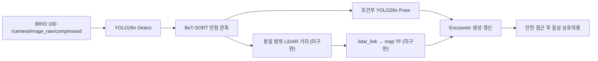
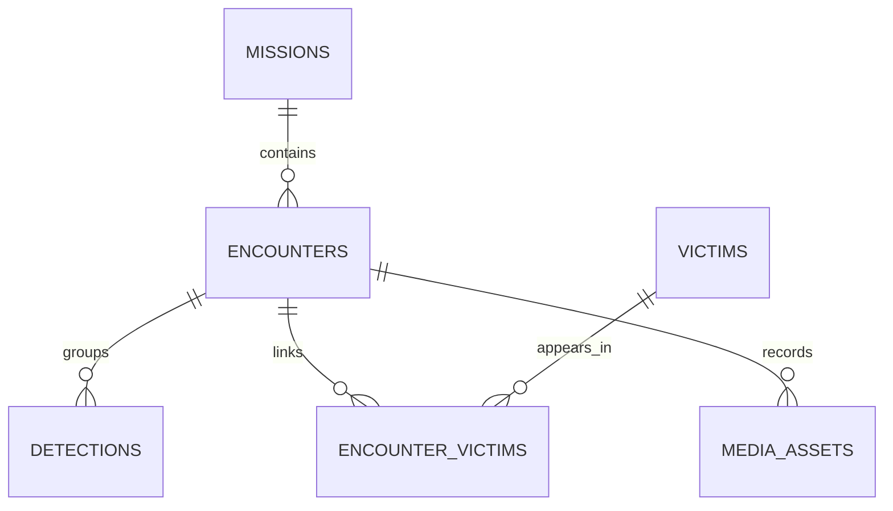
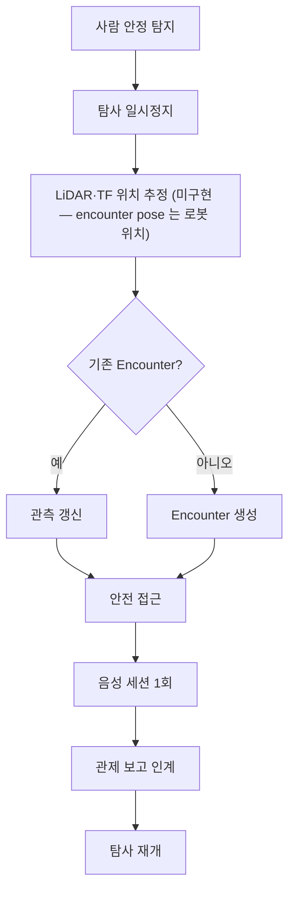

> Sentinel UGV 통합 명세서 v2.1의 일부 — 문서 규칙·버전·변경 이력은 [README](README.md) 참조
>
> **문서 책임:** AI 사람 탐지·추적·위치 추정·자세 판정의 현재 설계와 실측 기록을 한곳에서 관리한다.
> 음성 파이프라인은 [08-AI-음성.md](08-AI-음성.md)를 따른다.

# 9. AI 인식 및 센서 융합 [확정]

## 9.1 최종 운영 구조



| 항목 | 확정안 |
|---|---|
| 사람 탐지 | 추가 학습하지 않은 `yolo26n` 사전학습 가중치 |
| 자세 보조 | 사람을 연속 3프레임 이상 감지했을 때만 Pose 실행 |
| 안전 | 물리 장애물 회피는 LiDAR/Nav2, 급정지는 Collision Monitor/초음파가 담당 |
| 카메라 | `usb_cam`만 장치를 열고 압축 토픽을 탐지·영상 기능이 구독 |
| 위치 | bbox 중심 방위각과 LiDAR를 결합하고 TF2로 `map` 좌표 변환 — **설계만, 미구현**(human_localizer). 후보 페이로드의 `position` 은 항상 `None` 이고(`candidates.py`), encounter 의 `pose` 는 사람이 아니라 **확정 시점 로봇 위치**다 |
| 중복 제거 | 기존 위치 1m 이내이면서 최근 15초 이내면 동일 이벤트 — 위치가 없어(위 행) **1m 기준은 미구현.** 실제는 트랙별 15초 쿨다운(픽셀·bbox 비례 승계)과 활성 encounter 병합(`mission_state.py`) 두 층이다 |
| 음성 연동 | Encounter가 안전 접근 상태에 도달하면 음성 세션을 한 번 시작 |

AI 추론은 주행 안전의 단일 방어선이 아니다. 탐지가 실패해도 로봇의 충돌 방지와 정지는
센서 기반 안전 계층에서 독립적으로 동작해야 한다.

## 9.2 카메라 단일 오픈 원칙

AI 프로세스와 스트리밍 프로세스가 BRIO 100을 각각 직접 열지 않는다. `usb_cam` 노드가
카메라를 한 번만 열고 MJPEG 압축 토픽을 발행한다. YOLO 추론, WebRTC 스트리밍,
이벤트 버퍼는 같은 토픽을 구독한다. 장치 점유 충돌과 비압축 DDS 전송 부하를 피하기
위한 규칙이다.

## 9.3 사람 위치 품질

| 품질 | 의미 |
|---|---|
| `MEASURED` | 같은 방위의 유효 LiDAR 거리로 직접 계산 |
| `ESTIMATED` | LiDAR 직접 측정 실패, bbox 등 간접 정보만 사용 |
| `UNKNOWN` | 위치를 계산할 수 없어 영상 알림만 제공 |

여러 반사점이 겹치면 중앙값·최솟값·클러스터 방식을 비교한다. 위치 정확도보다 지도에서
구조 대상의 대략적 위치를 전달하는 MVP 목표를 우선한다.

> **현재 상태(시연 종료)**: 이 품질 3값은 human_localizer 와 함께 **미구현이다** — 코드
> 어디에도 이 열거값이 없다. 위치 자체가 산출되지 않으므로(9.1 위치 행) 품질 구분도
> 존재하지 않는다.

# 25. 사람 탐지·추적·위치 추정 상세 설계

## 25.1 처리 흐름

1. 압축 카메라 토픽을 구독해 Detect를 실행한다.
2. `person confidence ≥ threshold` 후보를 BoT-SORT 로 연결한다(초안은 ByteTrack 이었으나 GMC 가 없어 전환 — 25.5 `gmc_method`, `tracker_jetson.yaml`).
3. 동일 사람을 약 1초 안정 관측하면 탐사를 일시정지하고 Encounter 후보를 만든다.
4. **(설계 — 미구현)** 사람 중심의 카메라 방위각과 같은 방향의 LiDAR 유효 거리를 찾는다. 방위각+LiDAR 결합은 접근 제어(`sentinel_approach`)에만 존재하며 map 변환·발행이 없다.
5. **(설계 — 미구현)** `lidar_link` 좌표를 `map`으로 변환한다(human_localizer).
6. 최근 Encounter와 공간·시간 중복을 검사한다.
7. 안전 접근 후 조건을 만족하면 음성 상호작용을 시작한다.

위치 추정 실패가 반복될 때 새 이벤트를 남발하지 않는다. 같은 track의 `last_seen`, 최대
confidence, 관측 횟수와 위치 품질만 갱신한다.

## 25.2 조건부 Pose와 자세 판정

Detect는 상시 실행하고 Pose는 사람 후보가 안정됐을 때만 제한적으로 실행한다.

| 설정 | 기준 |
|---|---|
| Detect | 상시 약 15 FPS — **달성**(2026-08-09 젯슨 실기 확인) |
| Pose | 조건부 약 2 FPS 목표 |
| Pose 시작 | 사람 3프레임 이상 연속 감지 |
| 이벤트 | 같은 자세 약 1.5초 유지 |
| Pose 종료 | 사람 3초 미감지 |

> **Detect 목표 달성 판정 (2026-08-09).** 젯슨 담당이 실기 구동에서 목표 충족을
> 확인했다. 종전에 기록돼 있던 **9.45 FPS는 폐기한다** — `global_budget` 적용
> 전(Pose 예산 수정 전) 수치라 현재 구성과 무관하다. 25.5의 조건별 계측
> (사람 없음 19.3 / 사람 있음 13.0)은 **벤치 입력 기준**이므로 실기 라이브 수치와
> 그대로 비교하지 않는다. 조건이 명시된 실측 로그가 나오면 여기에 붙인다.

### Pose 실행 범위 — 전체 화면이 아니라 person crop

**Pose는 프레임 전체가 아니라 person bbox를 crop 해 사람별로 실행한다**(`pose_estimator.py`).
bbox 에 10% 여유를 준 뒤 프레임 범위로 clip 한 영역이 입력이다.

전체 화면 Pose 는 멀리 있는 작은 사람의 keypoint 품질이 떨어진다. person 을 놓치는 것을
최우선 리스크로 두는 원칙(9.1)과 충돌하므로 crop 을 택했다. 2026-08-05 팀 승인 사항이다.

이 선택이 출력 계약에 남기는 조건이 하나 있다. **keypoint 좌표는 crop 기준이 아니라
원본 프레임 좌표계로 복원해 싣는다.** crop 좌표를 그대로 내보내면 소비하는 쪽이 엉뚱한
위치에 그린다. 미검출 keypoint 는 `(0, 0)` 으로 나오며 복원하지 않는다.

**위 표의 「조건부 약 2 FPS」는 사람당이 아니라 파이프라인 전체 예산이다.** `PoseScheduler`
가 track 별 간격과 전역 간격을 함께 걸고, 전역 예산은 가장 오래 갱신되지 않은 track 부터
라운드로빈으로 배분한다. 사람이 몇 명이든 총 실행 횟수가 `max_fps` 로 묶인다.

> 이 구분은 실측으로 드러났다. 전역 예산 이전에는 track 별 간격만 있어 사람 4명 구간에서
> 명세 기대 약 127회 대비 **Pose 300회**가 실행됐다(젯슨, S15P11A301-150). 전역 예산 적용
> 후 동일 영상에서 **Pose 30회 → 10회, detections 는 571로 동일**해 탐지력 손실이 없음을
> 확인했다.

되돌리려면 `pose_trigger.global_budget: false` 로 둔다. 사람 수에 비례하는 종전 동작으로
돌아가며, A/B 비교용이지 기본값이 아니다.

자세 판정은 학습 모델의 자유 판단이 아니라 상체 각도, bbox 형상, 수직 신장비와 부동
신호를 결합한 명시적 규칙이다.

**출력 `poseStatus`는 `NORMAL`과 `FALLEN` 두 값뿐이다**(2026-08-03 개정). 이전의
`POSSIBLE_FALLEN`·`POSE_UNKNOWN` 3값은 쓰지 않는다. 관제 화면은 2값 기준으로 만든다.

판정 근거의 두께는 별도 필드로 싣는다. 관절이 안 잡혀도 형상·부동 신호로 답을 내되,
얼마나 확신하는지를 함께 넘기기 위해서다.

| 필드 | 뜻 |
|---|---|
| `poseStatus` | `NORMAL` / `FALLEN` |
| `fallenScore` | 0.0~1.0 연속 점수 |
| `signalCount` | 판정에 실제로 쓴 신호 수(최대 4) |

`signalCount`가 낮으면 근거가 얇다는 뜻이다. **어느 값도 구조 우선순위의 자동 확정값이나
의료 판정으로 쓰지 않는다.** 최종 판단은 관제의 사람이 한다.

### 이 값을 어디에 쓰는가

**관제 대원이 보는 참고 정보다. 로봇의 행동을 바꾸지 않는다.**

`FALLEN`이 나와도 접근 절차, 음성 질문, 보고 형식이 달라지지 않는다. 요구조자를 발견하면
자세와 무관하게 같은 흐름을 탄다. 판정이 로봇 행동을 바꾸는 곳은 없다(관제 전달은 설계 의도 — 아래 「현재 상태」).

의도적으로 그렇게 뒀다. 로봇이 이 값으로 분기하면 **"NORMAL이니 지나쳐도 된다"**는 판단이
성립하는데, 재난 현장에서 그 오판의 대가가 크다. 서 있거나 앉아 있는 요구조자도 구조
대상이다(25.1). 탐지 실패를 로봇이 스스로 확정하지 않는 원칙(9.1)과 같은 이유다.

값이 실제로 기여하는 곳은 하나다 — **요구조자가 여럿일 때 관제가 먼저 볼 대상을 고르는
근거**다. 그래서 라벨만 주지 않고 `fallenScore`와 `signalCount`를 함께 보낸다. 근거가 얇은
판정을 근거가 두꺼운 판정과 같은 무게로 취급하면 정렬이 왜곡되기 때문이다.

> **현재 상태(시연 종료)**: 값은 생성되지만 소비자는 **로컬 `events.jsonl` 하나뿐이다.**
> `/perception/person_candidates`·`/perception/encounter` 페이로드에 이 값들은 실리지
> 않고(`candidates.py`, `mission_manager_node.py`), backend 에 `detections` 테이블 쓰기
> 코드도 없다(스키마만 존재 — `V1__init_schema.sql`, `EncounterQueryService` 가 MVP 범위
> 밖으로 명시). 관제 전달·DB 저장은 미구현으로 종료했다. 화면을 만들 때 2값 기준으로
> 하고, 정렬에는 `fallenScore`를 쓴다.

### 로컬 `events.jsonl` 은 팀 메시지가 아니다

탐지가 남기는 `events.jsonl` 한 줄은 **봉투 구조가 `ENCOUNTER_CONFIRMED` 와 같다.**
사람이 대조하기 쉬우라고 맞춘 것이지 발행 대기 큐가 아니다. 이 파일은 로봇 밖으로
나가지 않는다 — 팀 토픽으로 나가는 것은 `/perception/person_candidates` 뿐이다.

구조가 같으면 식별자도 같은 것으로 읽힌다. 그래서 **탐지는 `encounterId` 를 만들지
않는다**(2026-08-09). encounter 발급은 Mission Manager 의 몫이고, 로컬 한 줄을 가리키는
식별자는 `_local.localEventId` 로 분리했다.

| | 발급자 | 유효 범위 |
|---|---|---|
| `encounterId` | Mission Manager | ROS 토픽 → 서버 → 관제 |
| `_local.localEventId` | 탐지 파이프라인 | `events.jsonl` 파일 안 |

> 종전에는 탐지가 `encounterId` 를 자체 발급해 이 파일에 적었다. 밖으로 나가지 않아
> 사고는 없었지만, **두 계보를 같은 키로 조인하면 0건이 조용히 나온다.** 이름을 분리해
> 그 오해를 구조적으로 막았다.

### 검증된 임계값

E-FPDS 정답 2,658건과 대조한 결과 자세·형상 신호의 현재 값은 유지한다.

```yaml
torso_horizontal_deg: 55.0
bbox_aspect_ratio: 1.20
vertical_extent_ratio: 0.25
upright_angle_deg: 30.0
fallen_threshold: 0.5
```

| split | 정밀도 | 재현율 | F1 |
|---|---:|---:|---:|
| split1 | 0.946 | 0.980 | 0.963 |
| split10 | 0.992 | 0.911 | 0.950 |
| split2 | 0.853 | 0.920 | 0.885 |
| split3 | 0.797 | 0.888 | 0.840 |

- 쓰러짐 1,653건의 `fallen_score` 중앙값: 0.919
- 비쓰러짐 1,005건의 중앙값: 0.032
- `fallen_threshold=0.5` 부근을 벗어나도 스윕 성능이 개선되지 않았다.
- 소파에 누운 사람은 데이터셋에서는 정상이나 프로젝트 규칙에서는 구조 후보가 될 수 있어,
  데이터셋 정의 차이를 오탐으로 단정하지 않는다.

### 부동 신호 3개는 검증 없이 쓰는 값이다 — 수용된 한계

아래 세 값은 위 자세·형상 값과 달리 **정답과 대조한 적이 없다.** E-FPDS가 정지
이미지라 시간축 신호를 잴 수 없었다. 2026-08-06 팀 판단으로 **알려진 한계로
수용**했고, 더 이상 열린 검증 과제로 두지 않는다.

```yaml
posture:
  inactivity_boost: 0.4
motion:
  still_ratio: 0.06
  full_still_seconds: 3.0
```

수용한 근거는 두 가지다.

- **틀리는 방향이 안전하다.** 부동 점수는 단독으로 `FALLEN`을 만들지 못하고 형상이
  수평일 때 확신을 올리는 배수로만 쓴다(최대 1.4배). 주행 중에는 카메라 이동이
  사람 이동으로 보여 점수가 **낮게** 나오므로, 틀릴 때 오탐이 아니라 미탐 쪽으로
  기운다(`src/motion.py` 모듈 주석).
- **실기에서 오탐이 관측되지 않았다.** 젯슨 실기 구동 기록 2건(`runs/jetson-check`,
  `runs/reid-jetson-check`)에서 사람 7명이 모두 `NORMAL`로 나왔고 `fallenScore`는
  0.035~0.107에 머물렀다. 걸어다니는 사람을 부동 신호가 밀어올리지 않았다.

**남은 미검증은 재현율이다.** 위 기록에 쓰러진 사람이 없어 부동 신호가 실제 누운
사람을 얼마나 끌어올리는지는 모른다. 이를 재려면 UGV에 달린 카메라로 촬영한
영상이 필요하다(25.7 첫 항목).

부분 검증은 지금도 가능하다. `data/pose_test/`의 시간축 클립을 `--frame-log`로
돌리면 `frames.jsonl`의 `signals.inactivity`에 trackId별 시계열이 남는다. 정답
구간만 손으로 표기하면 고정 시점 기준 분리도를 잴 수 있다. 다만 고정 시점 결과는
주행 중으로 그대로 옮겨가지 않으므로 이것만으로 "검증됨"이 되지는 않는다.

오탐·미탐이 생기면 검증된 자세·형상 값보다 위 부동 신호를 먼저 확인한다.

## 25.3 데이터셋 조사와 선택 이력

현재 탐지 대상은 `person` 단일 클래스다. Fire Extinguisher, Exit, Danger Sign은 데이터
확보·라벨링·재학습이 필요한 후속 범위다.

| 후보 | 주요 특징 | 최종 판단 |
|---|---|---|
| AI-Hub 71679 | 공장 안전, 이미지 40만 장, bbox | 일반 person 보강 후보 |
| AI-Hub 159 | 1인칭 보행, 대규모 | 선택 보강 후보 |
| AI-Hub 71850 | 쓰러짐 45건, bbox 없음 | 정답 구간 대조 전용 |
| AI-Hub 71641 | bbox+keypoint | 안심존·IRB 제약으로 제외 |
| AI-Hub 71550 | 실내 전도 807건, bbox+keypoint | 학습·검증 1순위로 조사했으나 파인튜닝은 미채택 |
| E-FPDS | 이동 로봇 76cm 시점, 쓰러짐 라벨 | 임계값·교차 평가 자산으로 유지 |

71850 실제 Validation 영상에서는 이벤트 전 탐지율 99.3%가 쓰러짐 구간에서 32.6%로
하락했고 `FALLEN` 판정은 0건이었다. 다만 세 사람이 겹치고 bbox 폭 중앙값이 52px인
영상이므로 자세, 가림, 크기 원인을 분리할 수 없다. 이 결과만으로 UGV 근거리 성능이
실패한다고 일반화하지 않는다.

데이터를 다시 받을 때는 전체 원천 영상을 받기 전에 수 KB 규모 라벨 샘플부터 확인한다.
71850을 13GB 받은 뒤 bbox가 없음을 발견한 시행착오를 반복하지 않는다. 원본 데이터와
변환 산출물, API 키는 Git에 커밋하지 않는다.

## 25.4 Detect 파인튜닝 평가와 미채택 결정

쓰러진 사람의 탐지율을 높이기 위해 데이터 3종과 학습 방식 4종을 비교했지만, 서로 다른
도메인의 교차 평가에서 사전학습 `yolo26n`을 이긴 조합이 없었다. 운영 모델은 사전학습
가중치를 유지한다.

### 교차 평가 핵심 결과

| 평가셋 | 모델 | mAP50 | mAP50-95 | 재현율 | 정밀도 |
|---|---|---:|---:|---:|---:|
| E-FPDS test | 사전학습 | **0.8992** | **0.6057** | **0.8157** | 0.9342 |
| E-FPDS test | 71550 전체 갱신 | 0.1731 | 0.0615 | 0.2064 | 0.3760 |
| 71550 val | 사전학습 | **0.9682** | 0.7124 | 0.9077 | **0.9529** |
| 71550 val | 71550 전체 갱신 | 0.9638 | **0.7853** | **0.9152** | 0.9314 |

71550 파인튜닝 모델은 자기 도메인에서는 강하지만 E-FPDS에서 mAP50 0.1731로 무너졌다.
재난 현장의 도메인을 고정할 수 없으므로 특정 CCTV 환경에 과적합된 모델을 채택하지 않는다.

### 평가에서 확인한 함정

- 같은 도메인 validation만 보면 과적합을 성공으로 오판할 수 있다.
- 파인튜닝 후 confidence 분포가 달라지므로 고정 confidence의 탐지율로 모델을 비교하지 않는다.
- 시스템은 여러 프레임에서 안정 관측하므로 프레임 단위 재현율만으로 운영 효과를 판단하지 않는다.
- 640→960 해상도 증가는 재현율 +3.4%p 대신 추론 시간을 약 40% 늘려 채택하지 않았다.
- YOLO26 end-to-end 모델은 `augment=True` TTA를 지원하지 않는다.

파인튜닝을 다시 검토하려면 COCO person replay, 영상 기반 운영 지표, 실제 UGV 카메라
배치 환경 영상이 먼저 필요하다.

## 25.5 Jetson 실행과 성능 기준

**실행 주체**: 시연 스택에서 이 파이프라인은 `sentinel_bringup` 의 `detection.launch.py`
(S15P11A301-155)가 `ai/detection` 을 전용 `.venv` 파이썬으로 실행하는 경로 하나다
(`enable_detector:=true`, `/perception/person_candidates` 발행). 초기 임시 통합용이던
`person_detector`(S15P11A301-136, 구 `sentinel_perception`)는 155 에서 제거됐고 흔적은
`demo.launch.py`·`detection.launch.py` 주석에만 남아 있다(CI 의 잔여 참조는
S15P11A301-377 에서 걷었다).

모델과 설정 파일은 저장소의 실제 탐지 코드 경로를 기준으로 실행한다. 실행 전 다음을
확인한다.

1. BRIO 100이 한 프로세스에서만 열리는지 확인한다.
2. ROS 2 압축 카메라 토픽과 LiDAR·TF가 정상인지 확인한다.
3. 모델 파일과 TensorRT 엔진이 현재 JetPack/TensorRT 환경에서 생성됐는지 확인한다.
4. Detect만 실행한 기준선과 Pose 활성 구간을 분리 측정한다.
5. YOLO, SLAM, Nav2, 영상 송출을 동시에 켠 통합 상태를 최종 기준으로 삼는다.

실측 기준선에서 카메라 입력은 1280×720 MJPEG 29.93 FPS다. 관제 인코딩 출력은
15 FPS·1500 kbps다(S15P11A301-328). 추론 입력은 640을 기본으로 한다.

### 부하가 클 때 줄이는 순서

아래 순서는 실측으로 정한 것이며, **추론 입력 축소를 먼저 검토하지 않는다.**
그 방향은 이미 무효로 확인됐다 — S15P11A301-186에서 `imgsz`를 640에서 416으로
낮췄을 때 `detect_ms`는 73.8에서 70.5ms로 3.6%만 줄었는데 탐지 수는 19.9%
감소했다. 연산량이 병목이 아니라 고정 오버헤드(실행·메모리 전송·전처리)가
시간을 다 쓰기 때문이고, 같은 이유로 FP16도 무효였다. 이 워크로드에서 유효했던
지렛대는 TensorRT뿐이다 — 탐지에는 적용돼 있었고, pose는 S15P11A301-329에서
적용했다.

**CPU 최대 소비자는 탐지다.** 통합 부하에서 탐지 프로세스가 코어 2.3~4.3개를
쓰는 반면 영상 경로 전체가 0.3개다(2026-08-07 실측, `top`과 `/proc` 델타 두
방법으로 교차 확인). 그런데 그 탐지에서 줄일 수 있는 것이 많지 않다 — 어디에
얼마가 들어가는지는 아래 [탐지 CPU 내부 분해](#탐지-cpu-내부-분해)에 있다.

그래서 아래 순서는 **큰 것부터가 아니라 줄일 수 있는 것부터**다. 영상 쪽
절감은 절대량이 작지만 화질 손실 없이 가능하고, 시청자 수만큼 곱해진다.

1. **스트리밍 비트레이트** — mediamtx와 네트워크가 줄고 x264enc는 영향받지
   않는다(720p15에서 2500k 13%, 1200k 14%). 시청자 수만큼 곱해져 절감된다.
2. **인코딩 프레임레이트** — x264enc가 프레임 수에 비례한다(720p30 27%,
   720p15 13%). `videorate`가 디코더 앞에 있어 MJPEG 디코딩·NVMM 복사·먹싱도
   함께 줄어든다. `encoder_key_int_max`를 반드시 같이 내린다(링 조각 1초 불변식).
3. **스트리밍 해상도** — `nvvidconv`가 HW 스케일러라 축소 자체는 비용이 없다.
   다만 증빙 영상 화질이 함께 내려가므로 사람 식별 요구사항을 먼저 확정한다.
4. **추론 입력 축소와 frame skip** — 위가 모두 소진된 뒤에만. 효과가 작고
   탐지 수를 직접 잃는다.

### 탐지 CPU 내부 분해

2026-08-07 측정(S15P11A301-329). 벤치 입력은 186이 쓴 파일과 sha256이 같다
(`6224354539d5805f…`, 재생성 명령은 186 본문). 지표는 프레임당 CPU 시간이다 —
벽시계 FPS는 배경 부하에 흔들리지만 자기 프로세스의 `utime+stime`은 견딘다.

**사람이 잡힐 때만 비싸진다.** 실제 스택에서:

| 상황 | 탐지 프로세스 CPU | 스레드 | 탐지 FPS |
| --- | --- | --- | --- |
| 사람 없음 | 74% | 1개 | 19.3 |
| 사람 있음 | 227~431% | 메인 + OpenCV 워커 5개 | 13.0 |

**추론은 이미 싸다.** TensorRT 엔진으로 `predict()` 한 번이 CPU 11.3ms다.
비용은 추론이 아니라 추적과 pose에 있다.

`cProfile`, 250프레임, `gmc_method: none` + `track_buffer: 30` 기준:

| 구간 | 호출 | 누적 | 비중 |
| --- | --- | --- | --- |
| `process_frame` | 250 | 15.97초 | 100% |
| └ `object_detector.detect` (= `model.track`) | 250 | 13.17초 | **82%** |
| └ `pose_estimator.estimate` | 18 | 2.13초 | 13% |
| └ `_detect_obstacles` | 250 | 0.38초 | 2% |

pose가 250프레임에 18회만 돈 것은 `global_budget: true`가 듣고 있다는 뜻이다.

#### `gmc_method`는 프레임당 136ms를 쓰지만 끄지 않는다

추적 설정 A/B(TensorRT 기준, 프레임당 CPU):

| `gmc_method` | `track_buffer` | 프레임당 CPU | 기준 대비 |
| --- | --- | --- | --- |
| `sparseOptFlow` | 300 | 338.9 ms | — |
| **`none`** | 300 | 202.6 ms | **−136.3 (−40%)** |
| `sparseOptFlow` | 30 | 337.1 ms | −1.8 (−0.5%) |
| `none` | 30 | 190.9 ms | −148.0 (−44%) |

`sparseOptFlow`는 매 프레임 `goodFeaturesToTrack` + `calcOpticalFlowPyrLK`를
720p에 돌리고 **OpenCV 스레드 풀**을 쓴다. 사람이 잡힐 때만 워커 5개가 생기는
것이 이것이다(Ultralytics는 추적이 활성일 때만 GMC를 부른다).

**그래도 켜 둔다.** GMC는 카메라가 움직일 때 트랙 위치 예측을 보정한다. 끄면
주행 중 트랙 ID가 더 자주 바뀌고, 그러면 `persistence.py`의 트랙별 15초 이벤트
쿨다운이 새 ID마다 초기화되어 같은 사람에 중복 이벤트가 난다. 위 측정은 **고정
카메라 영상이라 비용만 쟀고 효용은 재지 않았다.** 이 로봇의 시연 시나리오가
정확히 카메라가 움직이는 조건이므로, 검증되지 않은 보호를 CPU 때문에 미리
버리지 않는다. 실주행 검증(모터 보드 복구 후) 뒤에 트랙 ID 스위치와 중복
이벤트를 확인하고 재판단한다.

#### 다시 시도하지 않을 것

- **`track_buffer` 축소.** 300에서 30으로 낮춰도 1.8ms(오차 수준)다. 300은
  기본값의 10배지만 CPU 근거로 내릴 이유가 없다.
- **스레드 상한.** `cv2.setNumThreads`/`torch.set_num_threads`를 1~2로 낮춰도
  `predict` 프레임당 CPU가 9.9 / 10.4 / 9.9ms로 동일하다. `torch`는 기본이 이미
  1이고, 6개를 쓰는 것은 OpenCV다.

이 두 항목은 그럴듯해 보이므로 명시해 둔다. 확인에 각각 한 시간이 든다.

#### 두 모델 모두 TensorRT 엔진만 쓴다

`configs/pipeline.jetson.yaml`이 `require_engine: true`를 두고 두 모델을
`.engine`으로 지정한다. 엔진이 아니거나 파일이 없으면 **굽는 명령을 담아
기동을 거부한다**(`src/model_backend.py`).

이전에는 설정값이 `.pt`였고 엔진은 `--model` 인자로만 들어왔다. 인자를 빼먹으면
**조용히 PyTorch로 떨어지고 프레임당 CPU가 +145ms(43%)** 늘어난다. 경고가 없어
측정과 판단이 함께 틀어진다 — 실제로 329 조사에서 추적 A/B를 한 바퀴 다 돌린 뒤
프로파일의 `torch.conv2d` 28,629회를 보고서야 알았고, 그 회차의 결론 하나가
틀렸다(`track_buffer`가 121.6ms를 절감하는 것처럼 보였는데 엔진으로 다시 재니
1.8ms였다).

엔진은 기기·드라이버 종속이라 커밋되지 않는다. SD카드를 다시 굽거나 JetPack을
올린 뒤에는 다시 구워야 하고, 그때 이 예외가 그 사실과 명령을 알려준다.

장애 격리는 유지된다 — 죽는 것은 탐지 노드 하나이고 스택의 나머지는 계속 돈다
(S15P11A301-172가 `respawn_limit` 스코프를 고쳐 확보한 성질이다). 개발 PC
프로파일(`configs/pipeline.yaml`, `src/main.py`의 기본값)은 이 플래그가 없어
`.pt`로 종전대로 돈다.

pose 엔진은 **`imgsz`를 설정값과 같게 굽는다**(현재 320). 엔진은 입력 크기가
고정이라 어긋나면 매 호출 리사이즈가 붙거나 실패한다.

pose 전환 실측(같은 세션, 60회 호출 평균):

| pose 모델 | 호출당 벽시계 | 호출당 CPU |
| --- | --- | --- |
| `yolo26n-pose.pt` | 33.4 ms | 33.2 ms |
| `yolo26n-pose.engine` | 10.5 ms | **7.3 ms (−78%)** |

파이프라인 전체(300프레임, pedestrians 벤치)에서 `avg_fps` 13.88 → **16.35
(+17.8%)**이고 **`detections`는 1701건으로 동일**하다. pose 판정 8건 중 7건이
완전히 같고, 1건은 `fallenScore` 0.031 → 0.030으로 FP16 반올림 차이다
(`poseStatus`는 양쪽 `NORMAL`이며 임계값 0.5에서 멀다).

Orin Nano에는 **NVENC가 없다.** `/dev/nvhost-msenc`가 없고 `gst-inspect`에
`nvv4l2h264enc`가 나오지 않는다. 하드웨어 인코딩으로 옮겨 CPU를 회수하는
선택지는 존재하지 않으며, `x264enc`는 유일한 경로다.

### 시청자 수가 비용을 곱한다

인코딩은 `tee`로 갈라져 몇 명이 보든 **한 번만** 한다. 그러나 mediamtx의
패킷화·SRTP 암호화와 네트워크 대역폭은 **세션마다 따로** 든다. 같은 PC의 같은
브라우저라도 창마다 별개의 PeerConnection이고, 세션마다 DTLS로 다른 암호화 키를
쓰기 때문에 서버가 결과를 재사용할 수 없다.

| 항목 | 비용 | 시청자 수에 비례 |
| --- | --- | --- |
| x264enc 인코딩 | 27% → (15 FPS) 13% | 아니오 |
| mediamtx 유휴 | 2.6% | 아니오 |
| mediamtx 시청자당 | +1.8~2%p | **예** |
| 대역폭 | 2.70 → 1.67 Mbps | **예** |

단위는 코어 점유율이다. 시청자가 5명을 넘으면 젯슨이 직접 팬아웃하지 말고
서버 릴레이(`StreamPath` `REMOTE`)를 검토한다. 그 아래에서는 릴레이가 지연
한 단계와 장애점 하나를 더할 뿐이다.

시청자 수는 mediamtx API로 조회한다. 자원을 측정할 때는 **이 값을 함께
기록한다** — 249가 이것 없이 측정돼 오염됐다.

```bash
curl -s http://127.0.0.1:9997/v3/paths/list   # items[].readers 의 길이
```

이 API는 루프백에만 열려 있다. 인증이 없고 경로 삭제·연결 킥 같은 쓰기
엔드포인트가 있어 외부에 노출하면 누구나 시연 중 스트림을 끊을 수 있다.

## 25.6 이벤트와 다중 인원

이벤트 영상은 피해자 한 명이 아니라 `encounter_id`에 연결한다.

```text
missions/{missionId}/encounters/{encounterId}/event.mp4
missions/{missionId}/encounters/{encounterId}/thumbnail.jpg
```

한 화면에 여러 사람이 있으면 각각의 track과 탐지 기록은 보존하되, 안전 접근과 음성
상호작용은 Encounter 단위로 조정한다. 화자 자동 분리는 하지 않으며 음성 결과는 그룹
응답으로 보고한다.



## 25.7 남은 검증

- 실제 UGV 높이와 배치 장소에서 서 있음·앉음·누움·가림 영상을 확보한다. 확보되면
  부동 신호 3개의 재현율도 이 영상으로 함께 잰다(25.2 수용된 한계).
- 영상 구간 동안 한 번이라도 안정 관측했는지 측정하는 운영 지표를 추가한다.
- threshold 변경은 데이터셋 정의와 실제 구조 대상 정의를 함께 기록한 뒤 수행한다.

### 통합 자원 계측 (S15P11A301-249, 2026-08-07)

settle 75초 후 90초 샘플. 모터 보드 무응답으로 **바퀴가 정지한 상태**였다.

| 구성 | RAM | GPU | CPU | 탐지 FPS |
| --- | --- | --- | --- | --- |
| A: `enable_esp32` | 5097 MB | 14.1% | 82.5% | 7.6 |
| B: A + `nav2`·`safety`·`exploration` | 5374 MB | 18.2% | 84.5% | 9.0 |

죽은 프로세스와 CUDA 오류는 없었다. 코어는 1728 MHz, 7.6 W, 51 ℃로 스로틀
상태가 아니었다. GPU가 14~18%인데 CPU가 82~85%라는 점이 병목의 위치를 말한다.

**이 측정은 두 가지 이유로 판정 근거가 되지 못한다.**

첫째, 시청자 수를 통제하지 않았다. 로그를 사후 확인한 결과 동시 WebRTC
시청자가 14명이었고, 그 비용이 `mediamtx` 항목의 대부분이었다. 시청자 없이
관측하면 같은 A 구성에서 탐지가 17.5~18.0 FPS였다(표의 7.6).

둘째, 프로세스별 CPU 표가 **탐지를 크게 과소계상했다.** 그 표는 `python`(탐지)
68.2에 `stream_pipeline` 56.5를 적어 영상 경로가 더 크다고 읽히게 했으나,
2026-08-07에 `top`과 `/proc` 델타 두 방법으로 다시 재니 탐지가 227~432%,
`stream_pipeline`이 29~31%, `mediamtx`가 4.5~5.0%였다. 6배 차이라 결론이
뒤집힌다 — **탐지가 압도적 1위이고 영상 경로는 그 1/7이다.** 249의 per-process
수치는 인용하지 않는다.

따라서 `enable_nav2` 기본값은 아직 판정되지 않았다.

남은 일:

- 시청자 수를 0명과 1명으로 고정해 재측정한다. 25.5의 API로 값을 함께 기록한다.
  프로세스별 CPU는 `top` 또는 `/proc` 델타로 재고, 방법을 함께 적는다.
- 그 값으로 `enable_nav2` 기본값을 판정한다.
- 실제 주행(바퀴 구동) 상태에서 다시 측정한다. 위 표는 정지 상태다.

### 참고: 동시 하드웨어 디코더 수 제한

스택이 떠 있는 상태에서 `nvv4l2decoder` 인스턴스를 둘 더 붙이면 NVMM 할당이
실패한다(`NvMapMemAllocInternalTagged: error 12`,
`tegraNvjpgMJPEGDecoderCreate: Allocating ring buffers failed`). 설정 비교용으로
`stream_pipeline`을 여러 개 띄울 때는 이 한계를 감안한다 — RAM 여유에 따라
두 개까지는 붙고 세 개째에서 깨졌다.

## 25.8 데이터 이용 조건

E-FPDS를 결과 보고에 사용할 때 다음 논문을 인용한다.

> Fallen People Detection Capabilities Using Assistive Robot.
> S. Maldonado-Bascón et al., *Electronics*, 2019.

E-FPDS test split은 최종 결과 보고에만 사용하고 학습에 포함하지 않는다. AI-Hub 계정,
신청과 API key는 데이터 이용자가 직접 관리하며 원본 데이터는 저장소에 포함하지 않는다.

## 25.9 이벤트 이미지 보존 상한

탐지 증빙 이미지는 끄지 않고 총량을 제한한다. 1280×720 실물 프레임 12장의 JPEG 크기는
중앙값 165KB(최소 163KB, 최대 168KB)였다. `events_max_bytes=500MB`는 약 3,100장을
보존하며 `events_max_files=5000`은 화질·해상도 변경에 대비한 보조 안전망이다.

오래된 파일부터 제거하고 삭제한 개수와 용량을 로그로 남긴다. 보존 시간을 약속하지 않는다.
트랙별 15초 cooldown 때문에 장면의 인원 수에 따라 생성 속도가 달라지므로 바이트 상한이
주 기준이다.

# 30. 피해자 발견·접근·상호작용 오케스트레이션

## 30.1 최종 흐름



## 30.2 안전 접근과 종료

- 목표점은 사람 위치 자체가 아니라 안전거리를 둔 접근점으로 계산한다.
- LiDAR·Nav2·Collision Monitor의 안전 판단이 음성 상호작용보다 우선한다.
- Encounter 상태와 임무 상태가 허용할 때만 음성 세션을 시작한다.
- 임무 일시정지·종료·센서 실패는 진행 중 Encounter를 마감한다.
- 비상 정지는 원인 조사 영상을 위해 별도 정책을 따른다.
- 같은 Encounter에서는 음성 세션을 중복 시작하지 않는다.
- 보고가 완료되거나 대기열에 인계되면 승인된 종료 안내 후 탐사를 재개한다.

다중 인원은 화면 내 각 track을 보존하되 접근·녹화·음성은 Encounter 단위로 묶는다. 음성
결과는 개인 자동 식별 없이 그룹 응답으로 보고한다. 자세한 음성 계약은
[08-AI-음성.md](08-AI-음성.md)를 따른다.
