# 재난 지역 자율 탐사 UGV - Sentinel UGV

> 통합 프로젝트 명세서 및 개발 운영 계획

| **항목**           | **내용**                                                 |
|--------------------|----------------------------------------------------------|
| **팀명**           | 역삼역역무실관제센터                                     |
| **문서 버전**      | v1.0-rc3 - 전체 대화 최신 결정 기준 재검수본              |
| **작성 기준일**    | 2026-07-23                                               |
| **개발 종료 목표** | 2026-08-07                                            |
| **프로젝트 유형**  | 온디바이스 AIoT 기반 재난 탐사 무인 지상 차량(UGV)       |
| **문서 상태**      | 시스템 구조 확정, 실제 부품 정격·배선·튜닝값은 As-Built 단계 TBD |

> **문서 사용 목적** 본 문서는 기획서, 시스템 명세서, 하드웨어 설계 기준, 소프트웨어 인터페이스 명세, 테스트 계획, 일정 및 위험 관리 계획을 하나로 통합한 프로젝트 종합 문서이다. 팀원 간 개발 기준을 통일하고, 기술 선택 근거와 변경 이력을 발표 및 포트폴리오에 활용하는 것을 목적으로 한다.

# 문서 관리
| **버전** | **일자**   | **상태**  | **주요 변경 내용**                                                    |
|----------|------------|-----------|-----------------------------------------------------------------------|
| v0.1     | 2026-07 초 | 아이디어  | 재난 지역 탐사 로봇 콘셉트 및 Jetson 중심 구조 검토                   |
| v0.5     | 2026-07 중 | 설계      | 짐벌, ROS2, SLAM, Nav2, AWS 관제 구조 검토                            |
| v0.8     | 2026-07-17 | 정책 확정 | 자율 탐사, 수동 조종, 스트리밍, 데이터 저장, 장애 대응 정책 확정      |
| v0.9     | 2026-07-17 | 개발 착수 | 전체 프로젝트 종합 명세서 작성. 모터/전원/짐벌 세부 부품은 TBD로 관리 |
| v1.0-rc1 | 2026-07-22 | 통합 검수 | 1~38장 통합, Jetson+STM32, 피해자 접근·음성·다중 인원, MQTT·이벤트 녹화·보안·인수 시험 반영 |
| v1.0-rc2 | 2026-07-23 | 구동 정정 | 구동계 정정 시도. 실제 donor platform 반영은 rc3에서 재검수 |
| v1.0-rc3 | 2026-07-23 | 대화 재검수 | BMW M7 베이스·RS540·추가 학습 YOLO·STT-LLM-TTS·실측 센서 상태 반영, 폐기 자료 의존 제거 |

## 결정 상태 표기
| **표기**  | **의미**                    | **처리 원칙**                                   |
|-----------|-----------------------------|-------------------------------------------------|
| 확정      | 팀이 해당 방식으로 구현     | 변경 시 팀 합의 및 변경 이력 기록               |
| 잠정 확정 | 추천안을 우선 적용          | 실험 결과에 따라 대체안으로 전환 가능           |
| TBD       | 부품 확인·측정·검증 후 결정 | 담당자와 확정 기한을 반드시 지정                |
| 확장      | MVP 완료 후 추가            | 필수 기능 일정에 영향을 주지 않는 범위에서 수행 |

## 검수 기준

본 문서는 **2026-07-23까지 프로젝트 대화에서 확정되거나 실제 장비로 확인된 최신 결정**을 유일한 설계 기준으로 사용한다. 서로 다른 시점의 결정이 충돌하면 더 나중에 사용자가 직접 확정한 내용을 우선한다.

- 차량은 **BMW M7 유아전동차의 구동 베이스를 활용**한다.
- 고수준 컴퓨팅은 Jetson Orin Nano 8GB, 저수준 주행 제어는 STM32가 담당하며 Raspberry Pi 5는 차량에 탑재하지 않는다.
- 실제 Jetson에서 확인한 `JetPack 6.2.1+b38`과 ROS 2 Humble을 소프트웨어 기준선으로 고정한다.
- 부품 실측 전인 조향 기구·엔코더·모터 드라이버·전원·짐벌 상세값은 확정값처럼 쓰지 않고 TBD로 유지한다.
- 추가 학습 YOLO26n Detect와 STT-LLM-TTS 피해자 상호작용을 목표 구조에 포함한다.

# 목차
- 1. 프로젝트 개요 및 배경
- 2. 목표, 범위 및 성공 기준
- 3. 최신 확정 구조와 설계 결정
- 4. 사용자·시연 시나리오
- 5. 전체 시스템 아키텍처
- 6. 하드웨어 및 기구 설계
- 7. 소프트웨어 기술 스택 및 실행 환경
- 8. ROS2 자율주행 및 탐사 설계
- 9. AI 인식 및 센서 융합
- 10. 영상 스트리밍 및 이벤트 녹화
- 11. 통합 관제 웹 시스템
- 12. 통신 프로토콜 및 API
- 13. 데이터베이스·시계열·S3 설계
- 14. 상태 머신 및 안전 정책
- 15. 저장소·배포·CI/CD
- 16. 테스트 및 검증 계획
- 17. 일정 및 역할 분배
- 18. 위험 관리와 대체안
- 19. 최종 시연 계획
- 20. 완료 기준 및 KPI
- 21. 하드웨어 인터페이스·전원·배선 상세 설계
- 22. 센서 수집·시간 동기화·좌표계 상세 설계
- 23. SLAM·위치 추정·미지 영역 탐사 상세 설계
- 24. Nav2 경로 계획·장애물 회피·안전 속도 설계
- 25. 사람 탐지·추적·위치 추정 상세 설계
- 26. Mission Manager·임무 상태 머신 상세 설계
- 27. Spring Boot 관제 백엔드·도메인·API 상세 설계
- 28. Next.js 관제 화면·조이스틱 UX 상세 설계
- 29. PostgreSQL·TimescaleDB·S3·Outbox 상세 설계
- 30. 피해자 발견·접근·상호작용 오케스트레이션
- 31. Jetson·Spring Boot·관제 웹 통신 설계
- 32. 영상 스트리밍·이벤트 녹화 상세 설계
- 33. 피해자 음성 상호작용 상세 설계
- 34. STM32 저수준 제어·안전 통신 설계
- 35. 캘리브레이션·튜닝
- 36. 보안·개인정보·데이터 보호
- 37. 운영·모니터링·장애 복구
- 38. 요구사항 추적표·최종 인수 시험
- 부록 A~L. 요구사항·인터페이스·TBD·BOM·핀맵·버전·파라미터

# 1. 프로젝트 개요 및 배경 [확정]
## 1.1 프로젝트 정의
Sentinel UGV는 재난·사고 현장과 같이 사람이 즉시 진입하기 어렵거나 통신 상태가 불안정한 공간을 무인으로 탐사하기 위한 소형 자율주행 UGV(Unmanned Ground Vehicle)이다. Jetson Orin Nano는 카메라·LiDAR·AI·SLAM·Nav2·임무 판단을 처리하고, STM32는 엔코더·모터 속도 제어·300ms watchdog을 담당한다. 로봇은 미지 공간을 탐색하다 사람을 발견하면 탐사를 일시정지하고 안전거리까지 접근해 음성으로 상태를 확인한 뒤 위치·피해자 수·응답·이벤트 영상을 관제 시스템에 보고한다.

프로젝트는 단순 원격 조종 자동차가 아니라, 온디바이스 AI 추론, 2D LiDAR SLAM, 자율 탐사, 저지연 영상 관제, 시계열 데이터 관리, 클라우드 기반 임무 이력 조회가 하나의 시연 흐름으로 연결되는 통합 AIoT 시스템을 목표로 한다.

## 1.2 해결하려는 문제
- 재난 현장에서는 구조 인력이 진입하기 전 내부 구조와 장애물, 사람의 위치를 빠르게 파악하기 어렵다.
- 네트워크 연결이 끊기면 클라우드 의존형 로봇은 판단과 제어를 지속하기 어렵다.
- 카메라 영상만으로는 거리·지도·이동 가능 영역을 안정적으로 판단하기 어렵다.
- 센서, AI, 주행, 관제, 로그가 분리되어 있으면 최종 시연에서 통합 오류가 발생하기 쉽다.
- 단순 기능 구현만으로는 기술 선택 이유와 시스템 안전성을 설명하기 어렵다.

## 1.3 핵심 가치
| **가치**        | **설명**                                                                                            |
|-----------------|-----------------------------------------------------------------------------------------------------|
| **로컬 자율성** | 관제 서버 연결이 끊겨도 Jetson에서 탐사·장애물 회피·안전 정지를 수행한다.                           |
| **실시간성**    | 카메라·LiDAR·모터 제어의 핵심 경로를 로봇 내부에서 처리해 네트워크 지연을 배제한다.                 |
| **안전성**      | 물리/소프트웨어 E-Stop, 명령 타임아웃, 센서 상태 검사, Collision Monitor를 다중 안전 계층으로 둔다. |
| **통합성**      | AI 결과가 지도 좌표·알림·이벤트 영상·주행 상태로 연결된다.                                          |
| **관측 가능성** | 온습도, 배터리, 위치, 속도, Jetson 자원 사용량을 실시간·과거 그래프로 조회한다.                     |
| **설명 가능성** | 기술 변경 이유, 장단점, 구현 난이도, 대체안을 문서화해 발표와 포트폴리오에 활용한다.                |

## 1.4 대상 환경과 전제
- 주 시연 환경: 실내 평탄 복도 및 교실/회의실 수준의 장애물 코스
- 보조 시연 환경: 얇은 매트, 낮은 턱, 케이블 보호대 등 인위적인 경미한 노면 변화
- 주 네트워크 환경: Jetson과 관제 브라우저가 동일 Wi-Fi에 연결
- 원격 확장 환경: 브라우저와 Jetson이 다른 네트워크에 있으며 EC2 중계 사용
- 탐사 시간: 기본 7분, 5~10분 범위에서 설정 가능
- GPS: 실내 중심 프로젝트이므로 사용하지 않음

## 1.5 프로젝트 팀
팀명은 “역삼역역무실관제센터”이며 총 6명으로 구성한다.

| 팀원 | 담당 영역 |
|---|---|
| 김호준 | AI·백엔드 |
| 도영훈 | AI·프론트엔드·PM |
| 이원빈 | 백엔드·프론트엔드 |
| 박종화 | Embedded SW·ROS 2 |
| 김민석 | Embedded SW·PM |
| 박찬혁 | 백엔드·PM |

역할은 주 담당 영역을 뜻하며, 통합 시험·문서화·GitLab 운영은 팀 공통 작업으로 관리한다.

# 2. 목표, 범위 및 성공 기준 [확정]
## 2.1 최종 목표
> **최종 목표** 미지의 실내 공간에서 로봇이 지도를 생성하고 미탐사 영역을 탐색하며, 사람을 탐지하면 안전하게 접근해 음성으로 상태를 확인하고 위치·인원·응답·이벤트 영상을 보고한 뒤 탐사를 재개해 출발 위치로 복귀하는 통합 시스템을 완성한다.

## 2.2 MVP 필수 기능
| **ID**     | **기능**                                                      |
|------------|---------------------------------------------------------------|
| **MVP-01** | Jetson에서 카메라·LiDAR·AI·ROS 2·임무 판단, STM32에서 저수준 주행 제어 통합 실행 |
| **MVP-02** | YDLIDAR X4 Pro 기반 실시간 SLAM 지도 생성                     |
| **MVP-03** | Nav2 기반 목표점 이동과 장애물 회피                           |
| **MVP-04** | Frontier 기반 미지 영역 자동 탐사                             |
| **MVP-05** | 현장 데이터를 추가 학습한 YOLO26n Detect 기반 person 탐지      |
| **MVP-06** | 사람을 추적·그룹화하고 지도 위치를 추정해 encounter 생성       |
| **MVP-07** | 같은 로컬망에서 WebRTC 저지연 영상 스트리밍                   |
| **MVP-08** | 게임패드 기반 수동 조종과 자율/수동 모드 전환                 |
| **MVP-09** | 온습도·배터리·Jetson 상태 실시간 표시                         |
| **MVP-10** | Spring Boot·Next.js 기반 통합 관제 및 임무 이력 조회          |
| **MVP-11** | PostgreSQL+TimescaleDB+S3 연계 저장                           |
| **MVP-12** | 물리 E-Stop, Jetson·STM32 300ms watchdog, 센서 오류 안전 정지  |
| **MVP-13** | 탐사 종료 또는 명령 시 출발 위치 자동 복귀                    |
| **MVP-14** | GitLab 제공 Runner로 lint·test·build 수행, EC2 배포는 수동 승인 |
| **MVP-15** | 피해자 안전 접근·STT-LLM-TTS 상호작용·구조화 보고             |
| **MVP-16** | 확정 전 3초+상호작용 전체+종료 후 3초 이벤트 영상 저장        |

## 2.3 선택 기능
- EC2 MediaMTX를 통한 외부 네트워크 원격 WebRTC 스트리밍
- 로컬 스트림 실패 시 원격 스트림 자동 전환
- 탐지 결과를 WebSocket 메타데이터로 전송해 브라우저 Canvas 오버레이
- 배터리 전류·누적 소비량 측정
- 짐벌 OBSERVE 모드 원격 조작
- GitLab 수동 승인 Job을 통한 Jetson 배포
- Continuous Aggregate 기반 임무 간 통계 대시보드

## 2.4 확장 기능
- 기존 지도 재사용 및 Localization 모드
- 복수 UGV 관제
- 열화상·가스·연기 센서
- 피해자 정밀 재식별·개인별 장시간 대화
- 3D SLAM 또는 RGB-D 카메라
- 현장 통신용 LTE/5G 라우터
- 탐사 커버리지 최적화 및 정보 이득 기반 Frontier 점수화

## 2.5 MVP 제외 범위
- 회원가입·소셜 로그인·프로필·비밀번호 찾기·역할 세분화 관리 (관리자가 사전 등록하는 운영자 로그인은 구현)
- GPS 기반 실외 자율주행
- 완전한 험지·자갈·계단 주행
- 안전 인증 수준의 산업용 기능 안전
- 다수 사람의 정밀 재식별
- 전체 임무 영상의 상시 장시간 녹화
- Kubernetes 기반 운영
- Raspberry Pi 5의 차량 탑재

## 2.6 정량 성공 기준
| **항목**           | **목표**                                         | **검증 방법**                  |
|--------------------|--------------------------------------------------|--------------------------------|
| 통합 시연          | 전체 시나리오 3회 연속 성공                      | 체크리스트 및 영상 기록        |
| 로컬 영상 지연     | 체감 조종 가능한 수준, 목표 500ms 이하           | 화면 타임코드/LED 촬영 비교    |
| 조이스틱 안전 정지 | 유효 명령 중단 후 300ms 이내 STM32 PWM 0         | 로직 분석 로그·고속 촬영       |
| 사람 탐지          | 복도 시연 거리에서 연속 3프레임 확인             | 정답 시나리오 반복             |
| 장애물 회피        | 정적 장애물을 충돌 없이 우회 또는 정지           | 표준 장애물 코스               |
| 지도 생성          | 복도 벽 구조가 중복·왜곡 없이 식별 가능          | 저장 지도 검토                 |
| 자동 복귀          | home pose까지 허용 오차 내 복귀                  | 지도 좌표 및 실제 위치 확인    |
| 이력 저장          | 임무·센서·이벤트·미디어 조회 가능                | 과거 임무 페이지 검증          |
| 서버 장애          | EC2 단절 시 로컬 자율 탐사 유지                  | 네트워크 차단 테스트           |
| 로컬 핵심 장애     | LiDAR/모터 오류 시 안전 정지                     | 노드 종료·케이블 분리 테스트   |
| 피해자 encounter   | 탐지·접근·질문·보고·영상 저장 흐름 완료          | 단일·다중 인원 반복 시나리오   |

# 3. 최신 확정 구조와 설계 결정 [확정]

| **영역** | **최신 결정** | **확정 상태와 남은 확인** |
|---|---|---|
| 차체 | BMW M7 유아전동차 구동 베이스 활용 | 후륜 RS540 모터 확인. 조향 링크·감속기·차축 구조는 분해 확인 후 확정 |
| 기구 | 기존 구동부를 살리고 차체 상부·센서 브래킷·카메라-LiDAR 짐벌을 3D 프린팅 | 센서 헤드 무게·서보 토크·진동 시험 필요 |
| 컴퓨팅 | Jetson Orin Nano 8GB 고수준 컴퓨팅 + STM32 저수준 제어 | Raspberry Pi 5 차량 미사용 |
| 저수준 제어 | STM32가 모터 PWM·조향·엔코더·300ms watchdog 담당 | 정확한 STM32 보드·엔코더·고전류 드라이버 모델은 TBD |
| 관제 | AWS EC2의 Spring Boot·Next.js·PostgreSQL/TimescaleDB·S3 | Docker Compose 배포, 운영자 로그인 구현(회원가입·소셜 로그인 제외) |
| 자율주행 | ROS 2 Humble·SLAM Toolbox·Nav2·Frontier Exploration | 엔코더·IMU·LiDAR 융합과 실제 조향 운동학 튜닝 필요 |
| AI | YOLO26n Detect를 현장 데이터로 추가 학습해 person 탐지 | Detect가 MVP. Pose는 쓰러짐 분석이 필요할 때만 조건부 실행 |
| 음성 | 마이크 입력 → STT → LLM → TTS → 스피커 응답 | 실행 위치·모델·오프라인 축소안은 성능 시험 후 확정 |
| 영상 | Jetson GStreamer·MediaMTX → 동일 Wi-Fi 브라우저 WebRTC | 원격 EC2 중계는 확장 기능 |
| 이벤트 저장 | 탐지 확정 전 3초 + 접근·상호작용 전체 + 종료 후 3초 | MP4·메타데이터를 S3·DB에 연결 |
| 개발 운영 | GitLab 모노레포·GitLab CI/CD·Docker | 전체 clone 후 Jetson은 `jetson/` 중심, EC2는 `frontend/`·`backend/` 실행 |

## 3.1 핵심 설계 원칙
- 영상·LiDAR·AI·주행 판단은 Jetson에서, 모터·엔코더·통신 watchdog은 STM32에서, 관제·명령·이력은 EC2에서 처리한다.
- 영상 경로와 제어/텔레메트리 경로를 분리한다.
- 네트워크가 끊겨도 안전 조건이 충족된 자율 탐사는 로컬에서 유지할 수 있으나, 수동 조종 연결이 끊기면 STM32가 300ms 이내 정지한다.
- AI 탐지는 장애물 충돌 회피의 단일 안전 근거로 사용하지 않는다. 충돌 안전은 LiDAR·초음파·로컬 제한 로직이 담당한다.
- 기능 개수보다 전체 시연 흐름의 안정성과 복구 가능성을 우선한다.
- 모든 모듈은 실제 하드웨어 없이도 테스트 데이터·시뮬레이션으로 독립 개발할 수 있어야 한다.

# 4. 사용자·시연 시나리오 [확정]
## 4.1 사용자 유형
| **사용자** | **권한/역할**                                                                 |
|------------|-------------------------------------------------------------------------------|
| **운영자** | 탐사 시작·일시정지·재개·복귀·E-Stop·조이스틱 수동 조작                        |
| **관찰자** | 영상·지도·상태·과거 임무 조회. MVP에서는 별도 계정 구분 없이 단일 운영자 사용 |
| **개발자** | Jetson 노드 실행, 로그 확인, 배포, 파라미터 조정, 하드웨어 테스트             |

## 4.2 핵심 시연 시퀀스
1.  관제 페이지에 접속하고 Jetson·LiDAR·카메라·배터리·E-Stop 상태를 확인한다.
2.  로컬 WebRTC 영상과 조이스틱 연결 상태를 확인한다.
3.  운영자가 탐사 시작을 요청한다.
4.  Jetson은 새 임무와 빈 SLAM 지도를 생성하고 현재 위치를 home pose로 저장한다.
5.  Frontier 탐색기가 다음 미탐사 목표를 선택하고 Nav2가 경로를 생성한다.
6.  UGV는 장애물을 회피하며 이동하고, 지도와 위치를 관제 화면에 실시간 반영한다.
7.  YOLO와 ByteTrack이 한 명 이상의 사람을 약 1초간 안정적으로 확인하면 encounter를 만들고 탐사를 일시정지한다.
8.  카메라 방향·LiDAR 거리·TF를 결합해 사람별 map 좌표와 그룹 위치를 계산한다.
9.  그룹 전체가 보이는 안전 관측 위치까지 저속 접근하고 음성으로 인원·응답·이동 가능 여부를 확인한다.
10. 확정 전 3초부터 상호작용 전체, 종료 후 3초까지 하나의 이벤트 영상을 저장하고 관제에 위치·사람 수·응답·미디어를 보고한다.
11. 보고가 로컬에 안전하게 저장된 후 탐사를 재개한다.
12. 중간에 운영자가 게임패드 수동 모드로 전환해 조작한 뒤 명시적으로 자율 탐사를 재개한다.
13. Frontier 소진, 7분 경과, 사용자 종료 또는 배터리 부족 시 신규 탐사를 중단한다.
14. UGV는 home pose로 자동 복귀한다.
15. 임무 종료 후 과거 임무 페이지에서 지도, 이동 경로, 온습도·배터리 그래프, encounter 영상을 조회한다.
16. E-Stop 및 네트워크·Jetson-STM32 단절 대응을 별도 시연한다.

## 4.3 대체 시나리오
| **상황**            | **시스템 동작**                                                            |
|---------------------|----------------------------------------------------------------------------|
| Frontier 탐색 실패  | 관제 지도에서 운영자가 수동 목표점을 지정해 Nav2 목표 주행을 계속한다.     |
| 자동 복귀 경로 실패 | PAUSED로 전환하고 운영자가 복귀 목표를 재지정하거나 수동 조종한다.         |
| 로컬 WebRTC 실패    | 원격 EC2 스트림 또는 Jetson에서 박스 합성 단일 영상으로 전환한다.          |
| S3 연결 실패        | 이벤트 파일을 Jetson pending_uploads에 저장하고 연결 복구 후 재업로드한다. |
| EC2 연결 단절       | 로컬 자율 탐사를 유지하고 텔레메트리와 이벤트를 로컬 큐에 저장한다.        |
| 조이스틱 연결 해제  | 즉시 0 속도 명령, MANUAL 종료, PAUSED 전환, 경고 표시                      |
| 온습도 센서 실패    | 보조 센서 경고만 표시하고 탐사는 계속한다.                                 |

# 5. 전체 시스템 아키텍처 [확정]
## 5.1 데이터 흐름
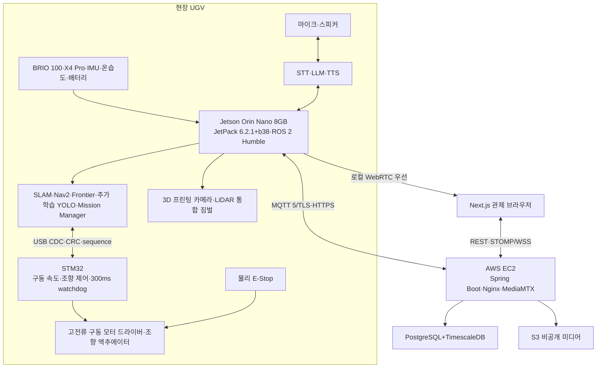

데이터 흐름은 다음 네 경로로 분리한다.

1. **자율주행 경로:** 센서 → Jetson SLAM·Nav2·Safety Gate → STM32 → 모터
2. **사람 구조 경로:** 카메라 → 추가 학습 YOLO·ByteTrack → 안전 접근 → STT·LLM·TTS → encounter 보고
3. **관제 경로:** Jetson → MQTT → Spring Boot → WSS → Next.js
4. **미디어 경로:** Jetson → 로컬 WebRTC → 브라우저, 이벤트 파일 → Presigned HTTPS → S3

## 5.2 장치별 책임
| **구성요소**           | **주요 책임**                                                                     | **하지 않는 일**                               |
|------------------------|-----------------------------------------------------------------------------------|------------------------------------------------|
| Jetson Orin Nano       | 카메라·LiDAR 입력, AI, SLAM, Nav2, 탐사, 목표 속도·짐벌 명령, 음성 파이프라인 조정, 로컬 안전, 스트리밍 | 직접 모터 PWM 생성, 회원 관리, 장기 데이터 조회 |
| STM32                  | 구동 엔코더 계수, 속도 폐루프, 조향 액추에이터 제어, 브레이크, 300ms watchdog, fault    | 경로 계획, 객체 인식, 클라우드 통신             |
| 모터 드라이버          | 구동 모터 전력 제어와 enable                                                      | 속도 계획, 조향 제어, 안전 정책, 객체 인식      |
| AWS EC2                | API, MQTT broker 연동, WSS 중계, 임무·이력, 원격 스트림                           | 실시간 충돌 회피, 최종 모터 제어                |
| Next.js 브라우저       | 영상·지도·상태 표시, 게임패드 입력, 운영 명령, 과거 임무 조회                     | 로컬 주행 안전 판단                            |
| PostgreSQL/TimescaleDB | 관계 데이터 및 시계열 저장·집계                                                   | 대용량 영상 원본 저장                          |
| S3                     | 스냅샷·이벤트 영상·지도·rosbag 저장                                               | 관계형 조회와 실시간 제어                      |

## 5.3 로컬/원격 영상 이중 경로
| **모드** | **경로**                              | **장점**                         | **주의사항**                           |
|----------|---------------------------------------|----------------------------------|----------------------------------------|
| LOCAL    | Jetson MediaMTX → 동일 Wi-Fi 브라우저 | 최저 지연, 수동 조종 시연에 적합 | HTTPS 혼합 콘텐츠, 로컬 IP/인증서 설정 |
| REMOTE   | Jetson → EC2 MediaMTX → 외부 브라우저 | 외부 관제, 동일 URL 제공         | 인터넷 업로드·왕복 지연, EC2 포트 설정 |
| AUTO     | 로컬 연결 시도 후 실패하면 원격 전환  | 사용 편의성                      | 전환 상태와 지연 차이를 UI에 표시      |

## 5.4 네트워크 원칙
- Jetson은 공유기 내부에서도 연결 가능하도록 EC2의 MQTT broker와 HTTPS endpoint로 아웃바운드 연결을 시작한다.
- 제어 명령에는 sequence, commandId, timestamp, TTL을 포함한다.
- 영상은 WebRTC, Jetson 상태·명령은 MQTT, 웹 실시간 화면은 WSS, 이력 CRUD는 REST를 기본으로 한다.
- DB와 Spring Boot 내부 포트는 EC2 외부에 직접 공개하지 않는다.
- 로컬 제어 안전은 서버 ACK와 무관하게 Jetson Safety Gate와 STM32 watchdog이 이중으로 보장한다.

# 6. 하드웨어 및 기구 설계
## 6.1 최신 부품 활용 상태
| **부품**                       | **판정**        | **활용**                                    |
|--------------------------------|-----------------|---------------------------------------------|
| Jetson Orin Nano Developer Kit | 필수            | 차량 메인 컴퓨팅                            |
| YDLIDAR X4 Pro                 | 실기기 확인     | `/dev/ttyUSB0`, 128000bps, ROS 2 `/scan` 약 11.03Hz |
| Logitech BRIO 100              | 실기기 확인     | `/dev/video0`, 1280×720 MJPEG 약 29.93 FPS. ROS 2 연동은 다음 단계 |
| BMW M7 유아전동차 구동 베이스  | 필수            | 기존 후륜 구동부와 바퀴 활용                 |
| RS540 FD-12V RPM14000 DC 모터  | 실기기 확인     | 12V 후륜 구동 모터. 감속비·정지 전류는 추가 측정 |
| 전륜 조향 기구·액추에이터      | 확인 필요       | 기존 링크 재사용 가능 여부와 제어 방식 분해 확인 |
| Motor Driver HAT               | 초기 시험       | 정격 확인 전까지 최종 적용 보류             |
| MG996R 및 소형 서보            | 짐벌 프로토타입 | 통합 센서 헤드 하중 시험                    |
| 서보모터 드라이버              | 사용            | 짐벌 Roll/Pitch PWM 생성                    |
| 온습도 센서                    | MVP 사용        | 환경 텔레메트리                             |
| 초음파 센서                    | 선택            | 전방 근거리 안전 정지 보조                  |
| 게임패드                       | 필수            | 관제 PC 수동 조종                           |
| Battery Shield V9/리튬 셀      | 시험            | 정격 확인 후 전원 활용 범위 결정            |
| LED/LCD/버튼/브레드보드        | 선택            | 상태 표시와 회로 실험                       |
| Raspberry Pi 5 세트            | 차량 미사용     | 보조 테스트 장비로만 활용 가능              |

## 6.2 추가 필요 부품 [TBD]
| **우선순위** | **부품**                        | **필요 이유**                          | **선정 기준**                               |
|--------------|---------------------------------|----------------------------------------|---------------------------------------------|
| 필수         | 구동축 엔코더                    | 이동 거리·속도 기반 오도메트리         | RS540 구동계 장착 가능성, PPR, 2채널 quadrature |
| 필수         | 고전류 구동 모터 드라이버       | RS540 정·역회전과 충분한 전류 공급     | 12V 정지 전류 이상, 제동, 보호, timeout     |
| 필수         | 조향 액추에이터 및 링크         | 전륜 조향각 제어                       | 기존 기구 호환, 토크, 응답, 백래시, 한계, 전원 |
| 권장         | 조향각 피드백 센서              | 명령각과 실제 조향각 차이 보정          | 포텐셔미터/엔코더, 장착성, 반복 정밀도      |
| 필수         | 차체 IMU                        | 엔코더·조향 오차 보정과 자세 추정       | ROS2 드라이버, 자이로 안정성, I2C/USB       |
| 필수         | 물리 E-Stop                     | 소프트웨어와 무관한 모터 전원 차단     | 래칭 스위치, 모터 전원 경로 차단            |
| 필수         | DC-DC 및 퓨즈·스위치            | Jetson/모터/서보 전원 분리             | 입출력 전압, 최대 전류, 노이즈              |
| 권장         | NVMe SSD 256GB 이상             | Docker, 모델, 이벤트 파일, rosbag 저장 | Jetson 호환 M.2 규격                        |
| 권장         | 전압·전류 센서                  | 배터리 잔량·소비량 추정                | I2C, 측정 범위, 절연/분압                   |
| 짐벌 시      | 짐벌 IMU·고토크 서보 추가       | 수평 유지와 실제 각도 피드백           | 총 하중, 토크 여유, 백래시                  |

## 6.3 BMW M7 4륜 구동 구조 [부분 확정]

BMW M7 유아전동차를 donor platform으로 사용하고, 확인된 **후륜 RS540 FD-12V RPM14000 DC 모터**를 유지한다. 상부 차체와 센서 장착 구조는 3D 프린팅으로 제작한다. 전륜 조향이 bicycle/Ackermann 모델로 제어 가능한지는 조향 링크와 기존 액추에이터를 분해한 뒤 확정한다. 따라서 현재 단계에서 `구동 모터 1개 + 조향 액추에이터 1개`를 확정 사양으로 단정하지 않는다.

| 항목 | 적용 기준 | 확인할 값 |
|---|---|---|
| 구동 | 확인된 후륜 RS540 구동계 활용 | 감속비·바퀴 지름·정지 전류·엔코더 장착점 |
| 조향 | 기존 전륜 링크와 액추에이터 조사 후 STM32 제어 | 액추에이터 종류·중앙값·좌우 한계·실제 조향각·백래시 |
| 운동학 | 실측 결과가 전륜 조향이면 bicycle/Ackermann 모델 적용 | 휠베이스·윤거·최소 회전반경 |
| 오도메트리 | 구동 엔코더+조향각+IMU+LiDAR SLAM | 거리 스케일·조향각 스케일·시간 지연 |
| Nav2 | 실차 운동학과 최소 회전반경을 지키는 planner/controller | Smac Hybrid-A*·Regulated Pure Pursuit 우선 검증 |

## 6.4 짐벌 구성 비교 [잠정 확정]
| **안** | **구성**                             | **장점**                              | **위험**                           | **프로젝트 적용**  |
|--------|--------------------------------------|---------------------------------------|------------------------------------|--------------------|
| A      | 카메라만 2축 짐벌, LiDAR 차체 고정   | SLAM 안정, 하중 낮음                  | LiDAR 수평 보정 불가               | 가장 안전한 대체안 |
| B      | 카메라+LiDAR 통합, 주행 중 고정      | 센서 상대 위치 일정, 구현 중간 난이도 | 능동 안정화 효과 제한              | MVP fallback       |
| C      | 카메라+LiDAR 통합 2축 능동 수평 유지 | 영상·스캔 수평 유지, 차별성           | 동적 TF, 스캔 왜곡, 서보 진동·하중 | 목표안             |

> **짐벌 운영 원칙** NAV_LOCK에서는 Yaw를 고정하고 Roll/Pitch를 제한된 속도와 각도로 보정한다. OBSERVE에서는 로봇 정차 후 센서 헤드를 움직일 수 있다. 능동 수평 유지가 SLAM을 불안정하게 만들면 즉시 중앙 고정 방식으로 전환한다.

## 6.5 센서 배치 원칙
- LiDAR 스캔면은 주변 물체와 차체에 가리지 않도록 최대한 높은 위치에 둔다.
- 통합 짐벌 사용 시 LiDAR 중심을 회전축에 가깝게 배치해 위치 이동 오차를 줄인다.
- 카메라와 LiDAR 사이의 외부 파라미터를 측정해 TF에 반영한다.
- 차체 IMU는 진동이 적고 무게중심에 가까운 곳에 단단히 고정한다.
- 온습도 센서는 모터·Jetson 배기 열의 영향을 덜 받는 외부 공기 유입 위치에 둔다.
- 배선은 회전축 여유 길이, 스트레인 릴리프, 커넥터 고정을 고려한다.

## 6.6 전원 아키텍처 [TBD]
```text
[Jetson 전원 경로]
배터리/전용 전원 → 정격 DC-DC 또는 Jetson 권장 입력 → Jetson
[구동 전원 경로]
모터용 배터리 → 퓨즈 → 물리 E-Stop → 모터 드라이버 → 구동 모터
[조향 전원 경로]
배터리 → 별도 정격 DC-DC/BEC → 조향 액추에이터
[서보 전원 경로]
배터리 → 5~6V 고전류 DC-DC → 서보 드라이버 → Roll/Pitch 서보
[센서 전원]
Jetson USB 또는 안정화된 5V 레일 → LiDAR/카메라/센서
제어 신호 기준 GND는 공통으로 연결하되, 모터 전력 노이즈가 Jetson 전원에 유입되지 않도록 분리한다.
```

- 모터와 서보를 Jetson 5V 핀에서 직접 구동하지 않는다.
- 배터리 전압을 Jetson GPIO에 직접 연결하지 않는다. 분압과 ADC 또는 전용 센서를 사용한다.
- 모터 테스트 전 차량을 바닥에서 띄우고 물리 E-Stop 동작을 먼저 확인한다.

## 6.7 하드웨어 TBD 목록
| **ID**      | **항목**           | **확정 조건**                                    | **기한**  |
|-------------|--------------------|--------------------------------------------------|-----------|
| TBD-HW-001  | RS540 구동계 실측  | 감속비·바퀴 지름·정지 전류·목표 속도 확인        | 1주차 초  |
| TBD-HW-002  | 모터 드라이버      | 모터 정지 전류와 채널 정격 비교                  | 1주차 초  |
| TBD-HW-003  | 배터리·DC-DC       | Jetson/모터/서보 소비전력 산정                   | 1주차 중  |
| TBD-HW-004  | 엔코더 PPR         | 선정 모터 사양과 최대 속도 계산                  | 1주차 중  |
| TBD-HW-005  | 짐벌 서보·IMU      | 센서 헤드 실측 중량·토크 시험                    | 1주차 말  |
| TBD-HW-006  | 최종 크기·중량     | 3D 모델과 부품 배치 완료                         | 2주차 초  |
| TBD-HW-007  | E-Stop 부품        | 전원 구조 확정                                   | 1주차 중  |
| TBD-HW-008  | 전륜 조향 구조     | 링크·액추에이터·피드백 유무 분해 확인             | 1주차 초  |
| TBD-CAM-001 | BRIO 100 ROS 2 연동 | 720p MJPEG 캡처와 X4 Pro 동시 구동 검증            | 개발 첫날 |

# 7. 소프트웨어 기술 스택 및 실행 환경
## 7.1 Jetson 실행 환경 [확정]
| **구분**       | **선택**                              | **용도/주의**                                    |
|----------------|---------------------------------------|--------------------------------------------------|
| OS/SDK         | JetPack `6.2.1+b38`, Jetson Linux 36.4.4, Ubuntu 22.04 | 실제 Jetson에서 확인한 기준선. 임의 업그레이드 금지 |
| ROS 2          | Humble                                | Ubuntu 22.04 공식 deb 기준, SLAM·Nav2·센서 통합    |
| AI             | 추가 학습 YOLO26n Detect, PyTorch/TensorRT | COCO 가중치에서 시작해 현장 person 데이터로 파인튜닝. Pose는 조건부 확장 |
| Voice AI       | STT·LLM·TTS                          | 모델과 Jetson/EC2 실행 위치는 성능·네트워크 시험 후 동결 |
| Vision         | OpenCV, GStreamer                     | 카메라 캡처, 프레임 분기, 이벤트 스냅샷          |
| Streaming      | MediaMTX, WebRTC/WHEP                 | 로컬·원격 저지연 영상                            |
| Device service | Python, systemd                       | ROS2 launch 및 텔레메트리/업로드 서비스          |
| Build          | colcon, rosdep, Python venv           | 재현 가능한 설치 스크립트                        |

CUDA·TensorRT·cuDNN·PyTorch 세부 버전은 설치 이미지에 따라 실제 명령으로 확인해 부록 K에 기록한다. 팀원이 각자 최신 패키지를 설치하지 않고 동일 lockfile·컨테이너·설치 스크립트를 사용한다.

## 7.2 서버·프론트·인프라 [확정]
| **영역**       | **기술**                 | **역할**                                                 |
|----------------|--------------------------|----------------------------------------------------------|
| Backend        | Java Spring Boot         | REST, WebSocket, 임무·이벤트·파일 메타데이터, 제어권     |
| Frontend       | Next.js                  | 실시간 관제, WebRTC, Gamepad API, 지도·그래프, 이력 조회 |
| Reverse proxy  | Nginx                    | HTTPS, 정적 파일, API/WebSocket 프록시                   |
| Database       | PostgreSQL + TimescaleDB | 관계 데이터와 시계열 데이터 통합                         |
| Object storage | AWS S3                   | 스냅샷, 이벤트 영상, 지도, rosbag                        |
| Media relay    | MediaMTX                 | 원격 WebRTC 중계                                         |
| Deployment     | Docker Compose on EC2    | 단일 EC2 MVP 구성                                        |
| CI/CD          | GitLab CI/CD             | 제공 Runner 기반 테스트·이미지 빌드, EC2 수동 승인 배포   |

## 7.3 성능 측정 우선 원칙
- 카메라 입력 FPS
- YOLO 추론 FPS와 프레임당 지연
- SLAM/Navigation 주기
- 영상 end-to-end 지연
- WebSocket 명령 왕복 시간
- CPU/GPU/메모리 사용량
- Jetson 온도와 전력 모드
- 네트워크 업로드 대역폭
- 프레임 드롭과 rosbag 저장 부하

> **최적화 순서** 측정 없이 모델·해상도·전체 구조를 교체하지 않는다. 먼저 병목을 수치로 확인하고, FPS 감소 → 해상도 감소 → 추론 주기 분리 → TensorRT 변환 → 프로세스 분리 순으로 최적화한다.

# 8. ROS2 자율주행 및 탐사 설계 [확정]
## 8.1 처리 파이프라인
```text
센서 입력
├─ camera frame
├─ /scan (LiDAR)
├─ wheel encoder
└─ IMU
↓
전처리·상태 추정
├─ wheel odometry
├─ robot_localization EKF
└─ TF tree
↓
SLAM / 위치 추정
├─ slam_toolbox
└─ map → odom → base_link
↓
탐사·경로 계획
├─ frontier_explorer
├─ Nav2 global planner
├─ local controller
└─ behavior tree / recovery
↓
안전 제한
├─ collision_monitor
├─ cmd_vel mux
├─ speed limiter
└─ watchdog
↓
고전류 모터 드라이버·조향 액추에이터 → BMW M7 4륜 구동 베이스
```

## 8.2 ROS2 노드 구성
| **노드**                   | **역할**                                    | **주요 입출력**                  |
|----------------------------|---------------------------------------------|----------------------------------|
| **ydlidar_node**           | YDLIDAR 드라이버                            | /scan                            |
| **camera_capture_node**    | BRIO 100 단일 캡처·프레임 분기              | /camera/image_raw, shared buffer |
| **yolo_inference_node**    | 추가 학습 YOLO26n Detect 기반 person 탐지    | /detections                      |
| **human_localizer_node**   | 카메라 방위각+LiDAR 거리+TF로 map 좌표 계산 | /human_observations              |
| **wheel_driver_node**      | 모터 명령·엔코더 수집                       | /wheel_states, /odom_raw         |
| **imu_node**               | 차체 자세·각속도                            | /imu/data                        |
| **ekf_node**               | 엔코더+IMU 융합                             | /odometry/filtered               |
| **slam_toolbox**           | 지도 생성 및 위치 추정                      | /map, /tf                        |
| **nav2_stack**             | 경로 계획·제어·복구                         | /cmd_vel_nav                     |
| **frontier_explorer_node** | 미탐사 목표 생성                            | NavigateToPose goal              |
| **collision_monitor**      | 근거리 충돌 방지                            | /cmd_vel_safe                    |
| **cmd_vel_mux**            | 자율/수동/정지 우선순위 처리                | /cmd_vel                         |
| **mission_manager_node**   | 상태 머신·home pose·종료 조건               | /mission/status                  |
| **gimbal_controller_node** | NAV_LOCK/OBSERVE 서보 제어                  | /gimbal/state                    |
| **telemetry_bridge_node**  | ROS 상태를 EC2 통신 게이트웨이로 전달       | MQTT/WSS 연계                    |
| **media_recorder_node**    | 링 버퍼·스냅샷·S3 업로드 큐                 | 로컬 파일/S3                     |
| **voice_interaction_node** | STT·LLM·TTS 단계 조정과 구조화 결과 생성    | /interaction/status              |

## 8.3 TF 트리
```text
map
└─ odom
└─ base_link
├─ base_footprint
├─ imu_link
├─ rear_drive_wheel_link
├─ front_left_wheel_link
├─ front_right_wheel_link
└─ gimbal_roll_link
└─ gimbal_pitch_link
├─ laser_frame
└─ camera_link
```

- 짐벌 주행 중 고정 방식이면 laser_frame과 camera_link를 static TF로 단순화할 수 있다.
- 능동 짐벌에서는 joint_state와 실제/추정 각도를 사용해 동적 TF를 발행한다.
- LiDAR 스캔 시간 동안 짐벌이 빠르게 움직이지 않도록 각속도를 제한한다.

## 8.4 Frontier 기반 미지 영역 탐사
Frontier는 지도에서 이미 확인된 자유 공간과 아직 관측되지 않은 미지 공간이 맞닿는 경계이다. 로봇은 도달 가능한 Frontier를 탐사 목표로 선택하고, 해당 위치로 이동하면서 새로운 공간을 지도에 추가한다. 사람의 위치를 사전에 알 수 없으므로, “사람을 찾는 목표”는 특정 사람 좌표로 주어지는 것이 아니라 접근 가능한 미지 영역을 빠짐없이 관찰하는 탐사 정책으로 구현한다.

| **단계** | **동작**                                              |
|----------|-------------------------------------------------------|
| 1        | Occupancy Grid에서 자유/장애물/미지 영역 분류         |
| 2        | 자유 공간과 미지 공간 경계 셀을 군집화                |
| 3        | 로봇이 도달 가능한 후보만 필터링                      |
| 4        | 거리, 예상 정보량, 장애물 여유, 방문 여부로 점수 계산 |
| 5        | 최고 점수 후보를 Nav2 목표로 전송                     |
| 6        | 목표 도달/실패 후 지도 갱신 및 다음 후보 선택         |

## 8.5 탐사 종료와 복귀
- 도달 가능한 Frontier가 10초간 발견되지 않으면 일시정지한다.
- 최소 회전반경을 지키는 저속 선회 또는 짧은 전·후진 재관측 기동으로 LiDAR 재스캔을 수행한다.
- 재스캔 후에도 Frontier가 없으면 탐사 완료로 판단한다.
- 최대 탐사 시간 7분, 사용자 종료, 배터리 20% 이하도 탐사 종료 조건이다.
- 종료 시 mission_manager가 저장한 home pose를 Nav2 목표로 전송한다.
- 복귀 경로 생성 실패 시 PAUSED로 전환하고 관제에 복구 요청을 표시한다.

## 8.6 BMW M7 구동 베이스 오도메트리와 보정
후륜 RS540 구동계에 엔코더를 추가해 이동 거리를 측정한다. 전륜 조향 구조가 bicycle/Ackermann 모델로 확인되면 실제 또는 추정 조향각을 wheel odometry에 적용하고, IMU yaw rate와 EKF로 융합한 뒤 LiDAR SLAM의 `map→odom` 보정으로 누적 오차를 줄인다. 조향 구조 확인 전에는 휠베이스·조향각·최소 회전반경을 확정값으로 사용하지 않는다.

## 8.7 모터 명령 안전 체인
```text
Nav2 / Manual Gamepad
↓
cmd_vel_mux (모드·우선순위)
↓
collision_monitor (위험 감속/정지)
↓
speed_limiter (최대 전진·후진·회전 제한)
↓
watchdog (명령 TTL/heartbeat)
↓
stm32_bridge_node
↓
STM32 100Hz 구동 속도·조향 제어·300ms watchdog
↓
고전류 모터 드라이버·조향 액추에이터
```

# 9. AI 인식 및 센서 융합 [확정]
## 9.1 AI 역할 분리
| **기능**         | **주 담당**              | **설명**                               |
|------------------|--------------------------|----------------------------------------|
| 사람 탐지        | 추가 학습 YOLO26n Detect | 구조 대상 후보 탐지와 관제 표시        |
| 자세 보조 판정   | YOLO26n Pose 조건부 실행 | 쓰러짐 분석을 확장할 때만 낮은 주기로 실행 |
| 일반 객체 분류   | YOLO COCO 클래스         | 핵심 MVP가 아니며 필요 클래스만 유지   |
| 물리 장애물 회피 | LiDAR/Nav2               | COCO에 없는 물체도 거리 기반으로 처리  |
| 급정지           | Collision Monitor/초음파 | AI 추론 실패와 무관하게 로컬 안전 확보 |
| 사람 위치 계산   | YOLO+LiDAR+TF            | 영상 Bounding Box 방향과 거리 결합     |

## 9.2 사람 탐지 이벤트 판정
```text
person confidence ≥ threshold
AND ByteTrack 약 1초 안정 관측
↓
탐사 일시정지·encounter 후보 생성
↓
사람 중심 방향각 계산
↓
동일 방향 LiDAR 거리 탐색
↓
laser_frame → map TF 변환
↓
기존 victim·encounter와 공간·시간 중복 검사
↓
안전 접근·음성 상호작용 상태 머신 시작
```

## 9.3 지도상 사람 위치 추정
Bounding Box 중심 x좌표와 카메라 수평 시야각을 이용해 카메라 기준 방위각을 계산한다. 같은 방위각 주변의 LiDAR 거리값 중 유효한 값을 선택하고, laser_frame 좌표를 생성한 후 TF2를 사용해 map 좌표로 변환한다. 복도 시연에서는 사람 다리 또는 몸통 높이에서 2D LiDAR가 반사되는 것을 전제로 한다.

- LiDAR 거리 후보가 없으면 위치 상태를 UNKNOWN으로 저장하고 영상 알림만 제공한다.
- 여러 물체가 겹치면 중앙값·최소값·클러스터 기반 거리 선택을 비교한다.
- 정확도보다 “지도에서 대략적인 구조 대상 위치를 표시”하는 MVP 목표를 우선한다.

## 9.4 중복 이벤트 제거
| **조건**                             | **처리**                                        |
|--------------------------------------|-------------------------------------------------|
| 기존 위치 1m 이내 AND 최근 15초 이내 | 동일 구조 대상 이벤트로 판단                    |
| 동일 trackId 지속                    | last_seen, 최대 confidence, 관측 횟수 갱신      |
| 위치 추정 실패 반복                  | 새 이벤트를 남발하지 않고 미확정 관측 수만 증가 |
| 15초 이후 또는 1m 초과               | 새 이벤트 후보 생성                             |

## 9.5 AI 성능 목표와 최적화
| **항목**         | **초기값**              | **최적화 방향**             |
|------------------|-------------------------|-----------------------------|
| 카메라 입력      | 1280×720 MJPEG, 29.93FPS 확인 | ROS 2·LiDAR 동시 구동 검증 |
| 추론 입력        | 640 계열                | 필요 시 512/416으로 축소    |
| 추론 주기        | 매 프레임 또는 10~15FPS | 주행 부하에 따라 frame skip |
| 관제 영상        | 720p, 15~30FPS          | CPU 부하 시 15FPS 우선      |
| 모델             | 추가 학습 YOLO26n Detect | 학습 가중치와 TensorRT 엔진 비교 |
| 신뢰도 threshold | 실험으로 결정           | 복도 오탐/미탐 균형         |

## 9.6 카메라 단일 오픈 원칙
AI 프로세스와 스트리밍 프로세스가 BRIO 100을 각각 직접 열지 않는다. camera_capture_node 또는 GStreamer 파이프라인이 카메라를 한 번만 열고, 프레임을 YOLO 추론·WebRTC 스트리밍·이벤트 버퍼에 분기한다. 이는 장치 점유 충돌과 불필요한 복사·인코딩을 줄이기 위한 원칙이다.

# 10. 영상 스트리밍 및 이벤트 녹화 [확정]
## 10.1 BRIO 100 입력 검증
```bash
sudo apt update
sudo apt install -y v4l-utils
v4l2-ctl --list-devices
v4l2-ctl --device=/dev/video0 --list-formats-ext
```

실기기에서 `/dev/video0`, 1280×720 MJPEG, 약 29.93 FPS 캡처를 확인했다. 다음 검증은 ROS 2 카메라 토픽과 X4 Pro `/scan`을 동시에 실행한 상태에서 프레임 드롭·CPU/GPU·USB 안정성을 측정하는 것이다. WebRTC용 H.264 인코딩 부하는 이 동시 구동 시험에서 함께 기록한다.

## 10.2 스트리밍 경로
| **구분** | **발행**                       | **수신**                 | **사용 시점**             |
|----------|--------------------------------|--------------------------|---------------------------|
| 로컬     | Jetson MediaMTX                | 같은 Wi-Fi 브라우저 WHEP | 최종 시연과 수동 조종     |
| 원격     | Jetson → EC2 MediaMTX          | 외부 브라우저 WebRTC     | 원격 관제 확장            |
| fallback | Jetson에서 탐지 박스 직접 합성 | 단일 영상                | 메타데이터 동기화 실패 시 |

## 10.3 AI 오버레이
기본안은 영상 스트림 하나만 전송하고, YOLO Bounding Box 메타데이터를 WebSocket으로 별도 전달해 Next.js의 투명 Canvas에 그리는 방식이다. 사용자는 AI 오버레이를 켜고 끌 수 있다. 영상과 탐지 결과에는 frameId 또는 capturedAt 타임스탬프를 포함해 동기화한다.

## 10.4 이벤트 링 버퍼
```text
카메라/인코더
↓
1초 단위 순환 세그먼트 생성
↓
최근 3초 이상 세그먼트 유지
↓ encounter 확정 / E-Stop / 급정지 이벤트
확정 전 3초 잠금 + 접근·상호작용 전체 + 종료 후 3초 수집
↓
MP4 remux + thumbnail.jpg
↓
S3 업로드 또는 로컬 pending 저장
```

- 사람 이벤트 영상 길이는 고정 15초가 아니라 `확정 전 3초 + 접근·음성 상호작용 전체 + 종료 후 3초`다.
- 여러 사람은 하나의 encounter 영상에 기록하되 사람별 track과 응답 상태는 개별 저장한다.
- 같은 encounter가 지속되면 새 파일을 반복 생성하지 않고 기존 녹화 세션을 유지한다.
- 일반적인 장애물 우회는 영상 저장 대상에서 제외하고 TimescaleDB에 횟수만 기록한다.

## 10.5 저장 대상
| **이벤트**          | **스냅샷** | **영상** | **DB 기록**              |
|---------------------|------------|----------|--------------------------|
| PERSON_ENCOUNTER    | 예         | 예       | 인원·위치·응답·상호작용  |
| E_STOP              | 선택       | 예       | 발생 주체·상태·해제 시각 |
| COLLISION_STOP      | 선택       | 예       | 최소 거리·속도           |
| SENSOR_DISCONNECTED | 아니오     | 선택     | 센서 종류·복구 시각      |
| NORMAL_AVOIDANCE    | 아니오     | 아니오   | 횟수 또는 시계열 상태만  |

# 11. 통합 관제 웹 시스템 [확정]
## 11.1 페이지 구성
| **경로**       | **페이지**  | **핵심 기능**                                                    |
|----------------|-------------|------------------------------------------------------------------|
| /control       | 실시간 관제 | 영상, SLAM 지도, 상태 카드, 제어 버튼, 조이스틱, 이벤트 타임라인 |
| /missions      | 임무 목록   | 기간, 소요 시간, 이동 거리, 탐지 수, 종료 사유                   |
| /missions/{id} | 임무 상세   | 지도·경로·사람 위치, 시계열 그래프, 스냅샷·이벤트 영상           |
| /settings      | 설정(선택)  | 탐사 시간, 속도 제한, 영상 모드, 게임패드 보정                   |

## 11.2 실시간 관제 레이아웃
```text
┌─────────────────────────────────────────────────────┐
│ 연결 | 상태 | 영상모드 | 조이스틱 | 배터리 | 경과시간 │
├───────────────────────────┬─────────────────────────┤
│ WebRTC 실시간 영상 │ SLAM 지도 │
│ + AI Canvas 오버레이 │ 로봇/경로/home/frontier │
│ [AI 표시 ON/OFF] │ 사람 탐지 마커 │
├───────────────────────────┴─────────────────────────┤
│ 온도 | 습도 | Jetson 온도 | CPU/GPU | 지연 | 전압 │
├─────────────────────────────────────────────────────┤
│ 탐사시작 | 일시정지 | 재개 | 수동 | 복귀 | E-STOP │
├─────────────────────────────────────────────────────┤
│ 사람 탐지·오류·시스템 이벤트 타임라인 │
└─────────────────────────────────────────────────────┘
```

## 11.3 게임패드 제어
수동 조종은 관제 PC에 연결된 USB 또는 Bluetooth 게임패드만 사용한다. 브라우저의 Gamepad API로 입력을 읽으며, 장치가 없으면 수동 모드 버튼을 비활성화하고 연결 안내를 표시한다.

| **입력**       | **기능**         | **안전 동작**               |
|----------------|------------------|-----------------------------|
| 왼쪽 스틱 상하 | 전진/후진        | deadzone·최대 속도 제한     |
| 왼쪽 스틱 좌우 | 좌/우 조향       | 조향각·조향 변화율 제한     |
| LB             | 데드맨 스위치    | 누르고 있을 때만 DRIVE 전송 |
| B              | 일반 정지        | 즉시 0 속도                 |
| Start          | 출발지 복귀 요청 | 확인 후 RETURNING           |
| 연결 해제      | 수동 종료        | 300ms 이내 STM32 정지 후 PAUSED |

## 11.4 제어권 임대
시연 시 한 명만 조종한다. Spring Boot는 control lease를 발급하고 해당 WebSocket 세션만 DRIVE 명령을 전송할 수 있게 한다. heartbeat가 중단되거나 탭이 닫히면 제어권을 회수하고 로봇을 정지한다. 다른 브라우저는 영상과 상태만 조회할 수 있다.

## 11.5 버튼 활성화 조건
| **버튼**    | **활성 조건**              | **결과 상태**              |
|-------------|----------------------------|----------------------------|
| 탐사 시작   | SAFE_IDLE + 핵심 장치 정상 | EXPLORING                  |
| 일시정지    | EXPLORING 또는 RETURNING   | PAUSED                     |
| 탐사 재개   | PAUSED + 핵심 장치 정상    | EXPLORING                  |
| 수동 전환   | 게임패드 연결 + ESTOP 아님 | MANUAL                     |
| 수동 종료   | MANUAL                     | 이전 탐사 재개 또는 PAUSED |
| 복귀        | EXPLORING/PAUSED/MANUAL    | RETURNING                  |
| 탐사 종료   | 진행 중 임무 존재          | RETURNING 또는 COMPLETED   |
| E-Stop      | 항상                       | ESTOP                      |
| E-Stop 해제 | 정지·오류 해소·운영자 확인 | SAFE_IDLE/PAUSED           |

## 11.6 MVP 접근 범위
MVP에는 관리자가 사전 등록한 운영자 로그인 화면을 구현하되 회원가입·소셜 로그인은 구현하지 않는다. 시연은 한 명의 운영자가 통제된 관제 PC에서 수행하며, 연결된 게임패드와 하나의 control lease를 가진 브라우저 세션만 DRIVE 명령을 보낼 수 있다. 외부 EC2 접근은 Security Group 허용 IP 또는 배포 환경 토큰으로 제한하고, 이를 사용자 계정 기능으로 확장하지 않는다. S3 객체는 공개하지 않고 단기 Presigned URL로만 조회한다.

# 12. 통신 프로토콜 및 API [확정]
## 12.1 통신 채널
| **채널**         | **용도**                                 | **특성**                  |
|------------------|------------------------------------------|---------------------------|
| MQTT 5 over TLS  | Jetson↔EC2 상태, 이벤트, 명령, ACK      | QoS·retain·LWT·재연결     |
| REST/HTTPS       | 임무·이력 조회, 미디어 업로드 준비       | 요청-응답, 멱등성         |
| STOMP over WSS   | Next.js↔Spring 실시간 상태·제어 중계     | 브라우저 구독·heartbeat   |
| WebRTC/WHEP      | 영상 스트리밍                            | 저지연, 영상 경로 분리    |
| S3 Presigned URL | Jetson의 파일 직접 업로드/브라우저 조회  | AWS 키 비노출, 제한 시간  |
| ROS2 DDS         | Jetson 내부 노드 간 통신                 | 토픽·서비스·액션          |
| USB CDC          | Jetson↔STM32 목표 속도·엔코더·fault      | CRC·sequence·300ms timeout |

## 12.2 REST API 초안
| **Method** | **Endpoint**                   | **설명**           |
|------------|--------------------------------|--------------------|
| POST       | /api/missions                  | 새 임무 생성       |
| POST       | /api/missions/{id}/start       | 탐사 시작          |
| POST       | /api/missions/{id}/pause       | 일시정지           |
| POST       | /api/missions/{id}/resume      | 탐사 재개          |
| POST       | /api/missions/{id}/return      | 복귀               |
| POST       | /api/missions/{id}/stop        | 탐사 종료          |
| GET        | /api/missions                  | 임무 목록          |
| GET        | /api/missions/{id}             | 임무 상세          |
| GET        | /api/missions/{id}/telemetry   | 시계열 조회        |
| GET        | /api/missions/{id}/events      | 이벤트 조회        |
| POST       | /api/robots/{id}/estop         | 소프트웨어 E-Stop  |
| POST       | /api/robots/{id}/estop/release | E-Stop 해제        |
| POST       | /api/media/presign-upload      | S3 업로드 URL 발급 |
| GET        | /api/media/{id}/presign-view   | S3 조회 URL 발급   |
| GET        | /api/robots/{id}/health        | 장치 상태 조회     |

## 12.3 WebSocket 메시지 공통 필드
```json
{
"type": "TELEMETRY | ROBOT_STATUS | ENCOUNTER | CONTROL_COMMAND | CONTROL_ACK | SYSTEM_ERROR",
"messageId": "uuid",
"robotId": "sentinel-01",
"missionId": "uuid-or-null",
"sequence": 152,
"sentAt": "2026-07-17T10:30:00.123+09:00",
"payload": { }
}
```

## 12.4 수동 주행 명령 예시
```json
{
"type": "CONTROL_COMMAND",
"messageId": "cmd-uuid",
"robotId": "sentinel-01",
"sequence": 152,
"sentAt": "2026-07-17T10:30:00.123+09:00",
"payload": {
"command": "DRIVE",
"mode": "MANUAL",
"linearX": 0.25,
"angularZ": -0.35,
"deadman": true,
"ttlMs": 250
}
}
```

## 12.5 제어 ACK 예시
```json
{
"type": "CONTROL_ACK",
"messageId": "ack-uuid",
"sequence": 152,
"payload": {
"commandId": "cmd-uuid",
"accepted": true,
"appliedLinearX": 0.22,
"appliedAngularZ": -0.30,
"robotState": "MANUAL",
"reasonCode": null
}
}
```

## 12.6 오류 코드 초안
| **코드**             | **의미**                | **처리**                 |
|----------------------|-------------------------|--------------------------|
| DEVICE_OFFLINE       | Jetson 연결 끊김        | 제어 비활성화, 상태 경고 |
| LIDAR_UNAVAILABLE    | LiDAR 데이터 없음       | 자율주행 중단·정지       |
| LOCALIZATION_LOST    | 위치 신뢰도 저하        | PAUSED 또는 ERROR        |
| MOTOR_NO_RESPONSE    | 모터 드라이버 응답 없음 | ESTOP                    |
| GAMEPAD_DISCONNECTED | 게임패드 연결 해제      | 수동 즉시 정지           |
| CONTROL_LEASE_DENIED | 다른 세션이 제어권 보유 | 조회 전용                |
| S3_UPLOAD_PENDING    | 파일 업로드 대기        | 로컬 보관 후 재시도      |
| STREAM_LOCAL_FAILED  | 로컬 스트림 실패        | REMOTE 전환              |

# 13. 데이터베이스·시계열·S3 설계 [확정]
## 13.1 저장 원칙
TimescaleDB는 PostgreSQL과 별도 제품을 이중 운영하는 방식이 아니라, 하나의 PostgreSQL 인스턴스에 TimescaleDB 확장을 설치해 일반 테이블과 hypertable을 함께 사용하는 구조로 적용한다. 영상·지도·rosbag 같은 대용량 파일은 S3에 저장하고 DB에는 경로와 메타데이터만 저장한다.

## 13.2 PostgreSQL 일반 테이블
| **테이블**       | **주요 필드**                                                         | **용도**                |
|------------------|-----------------------------------------------------------------------|-------------------------|
| users            | id, username, password_hash, display_name, role, last_login_at, created_at | 관제 운영자 계정·인증   |
| robots           | id, name, status, last_seen_at                                        | 로봇 등록과 현재 상태   |
| missions         | id, robot_id, created_by_user_id, status, started_at, ended_at, home_pose, end_reason | 임무 생명주기           |
| mission_results  | mission_id, duration, distance, coverage, detection_count             | 임무 요약               |
| events           | id, mission_id, message_id, type, severity, occurred_at, payload_json  | E-Stop·오류·일반 이벤트 |
| encounters       | id, mission_id, map_id, status, map_x, map_y, map_yaw, detected/responsive/unresponsive_person_count, interaction_summary, started_at, interaction_started_at, interaction_ended_at, ended_at, termination_reason | 사람 그룹 발견 단위     |
| victims          | id, latest_status, first_seen_at                                       | 피해자 후보             |
| detections       | id, mission_id, encounter_id, victim_id, track_id, class, confidence, map_x, map_y, position_quality, observed_at | AI 관측 원본            |
| encounter_victims| encounter_id, victim_id, track_id, response_status, first_seen_at, last_seen_at | encounter-피해자 연결   |
| interaction_sessions | id, encounter_id(UNIQUE), status, response_scope, any_response_detected, reported_responsive_count, count_confidence, mobility_status, urgent_condition_reported, operator_review_required, started_at, ended_at, termination_reason, summary | 음성 상호작용 세션      |
| interaction_turns| id, session_id, turn_index, question_code, transcript, stt_confidence, llm_schema_valid, parsed_value, parse_status, tts_text, retry_count, audio_media_id | 질문·응답 기록          |
| control_commands | id, mission_id, issued_by_user_id, command_id, type, requested_at, result, sequence | 제어 감사 로그          |
| maps             | id, mission_id, s3_key_pgm, s3_key_yaml, created_at                   | 저장 지도               |
| media_assets     | id, mission_id, encounter_id, type, s3_key, status, duration_ms, triggered_at, interaction_started_at, interaction_ended_at, pre_buffer_sec, post_buffer_sec, termination_reason | S3 미디어 메타데이터    |
| control_leases   | robot_id, user_id, session_id, expires_at                             | 단일 제어권             |

- 모든 일반 테이블의 PK는 UUID를 사용한다. `encounters`·`media_assets` 필드 상세 정의는 30.6.4, `interaction_sessions`·`interaction_turns`는 33-6을 따른다.
- `interaction_sessions.encounter_id`는 UNIQUE이며, encounter당 음성 세션은 0..1개다(32-6 참조).
- `users`는 관제 운영자 계정 테이블이다. `role`은 `ADMIN`·`OPERATOR`이며 `password_hash`는 단방향 해시로 저장한다. 제어권과 제어 명령은 `control_leases.user_id`·`control_commands.issued_by_user_id`로 조작 주체를 식별한다.
- `detections`는 매 프레임 시계열이 아니라 encounter 판정에 사용되는 선별 관측 로그이므로 hypertable이 아닌 일반 테이블로 둔다. Jetson이 생성한 UUID를 `id`(PK)로 사용해 QoS 1 중복을 멱등 처리하고, `encounter_id`·`victim_id`로 상위 발견 단위와 연결한다. 관측 시각은 `observed_at`으로 저장한다.

## 13.3 TimescaleDB hypertable
| **테이블**             | **주기**    | **주요 필드**                                                  | **용도**         |
|------------------------|-------------|----------------------------------------------------------------|------------------|
| robot_pose             | 2~5Hz       | time, mission_id, x, y, yaw, linear_velocity, angular_velocity | 경로와 이동 거리 |
| robot_metrics          | 1Hz         | battery, voltage, cpu, gpu, memory, jetson_temp, state         | 시스템 상태      |
| environment_metrics    | 0.2~0.5Hz   | temperature, humidity                                          | 환경 이력        |
| network_metrics        | 1Hz         | latency_ms, packet_loss, connection_state, stream_mode         | 통신 품질        |
| safety_events          | 이벤트      | min_distance, cmd_vel, stop_reason                             | 안전 정지 분석   |

## 13.4 TimescaleDB 활용 포인트
- time_bucket을 이용한 1초·5초·1분 구간 집계
- Continuous Aggregate로 임무 요약 그래프 사전 계산
- 원본 위치·시스템 데이터의 보존 정책 설정
- 임무별 최대 Jetson 온도, 평균 속도, 배터리 감소율, 네트워크 지연 계산
- 일반 PostgreSQL 테이블과 JOIN해 이벤트 시점의 센서 상태 조회

## 13.5 S3 객체 구조
```text
s3://sentinel-ugv-assets/
└─ missions/{missionId}/
├─ encounters/{encounterId}/
│ ├─ thumbnail.jpg
│ ├─ event.mp4
│ └─ transcript.json
├─ maps/
│ ├─ map.pgm
│ └─ map.yaml
├─ rosbags/
│ └─ mission_YYYYMMDD_HHMMSS.tar.gz
└─ reports/
└─ summary.json
```

## 13.6 업로드 상태 머신
| **상태**   | **의미**                       | **다음 동작**             |
|------------|--------------------------------|---------------------------|
| PENDING    | DB 이벤트 생성, 파일 로컬 존재 | Presigned URL 요청        |
| UPLOADING  | S3 업로드 진행                 | 성공/실패 대기            |
| READY      | S3 업로드 완료                 | 조회 URL 발급 가능        |
| FAILED     | 업로드 실패                    | 백오프 후 재시도          |
| LOCAL_ONLY | 네트워크 단절로 Jetson 보관    | 연결 복구 시 PENDING 전환 |

## 13.7 보존 정책 초안
| **데이터**              | **보존**                    |
|-------------------------|-----------------------------|
| 원본 위치·시스템 시계열 | 30일 또는 프로젝트 종료까지 |
| 1분 단위 집계           | 장기 보관                   |
| 임무·안전 이벤트·제어 명령 | 프로젝트 기간, 종료 후 정책에 따라 삭제 |
| 피해자 영상·음성·대화      | 시연 목적 최소 기간 후 삭제                 |
| 일반 rosbag             | 필요 임무만 수동 보관       |
| Jetson pending 파일     | 업로드 완료 후 자동 삭제    |

# 14. 상태 머신 및 안전 정책 [확정]
## 14.1 로봇 상태
| **상태**             | **설명**                                  | **모터**         |
|----------------------|-------------------------------------------|------------------|
| SAFE_IDLE            | 초기화 완료, 명시적 시작 대기             | 정지             |
| EXPLORING            | Frontier 기반 탐사                        | 자율 명령        |
| PERSON_APPROACHING   | 피해자 그룹 관측 위치로 접근              | 저속 자율 명령   |
| INTERACTING          | 피해자 음성 확인                          | 정지             |
| POST_RECORDING       | 상호작용 종료 후 3초 녹화                 | 정지             |
| REPORTING            | encounter·피해자·미디어 로컬 저장·보고    | 정지             |
| PAUSED               | 탐사/복귀 일시정지                        | 정지             |
| MANUAL               | 게임패드 수동 조종                        | deadman 명령     |
| RETURNING            | home pose 복귀                            | Nav2 명령        |
| COMPLETED            | 임무 정상 종료                            | 정지             |
| ESTOP                | 비상 정지 latch                           | 출력 차단/0 명령 |
| ERROR                | 핵심 센서·제어 오류                       | 정지             |

`OFFLINE`은 서버가 관측한 연결 상태이며 Jetson 내부 임무 상태로 사용하지 않는다.

## 14.2 상태 전환
```text
SAFE_IDLE ──탐사시작──▶ EXPLORING
SAFE_IDLE ──수동전환──▶ MANUAL
EXPLORING ──일시정지──▶ PAUSED
EXPLORING ──사람확정──▶ PERSON_APPROACHING
PERSON_APPROACHING ──안전위치도착──▶ INTERACTING
INTERACTING ──대화종료──▶ POST_RECORDING
POST_RECORDING ──3초완료──▶ REPORTING
REPORTING ──로컬저장완료──▶ EXPLORING 또는 PAUSED
EXPLORING ──수동전환──▶ MANUAL
EXPLORING ──완료/시간/배터리──▶ RETURNING
MANUAL ──수동종료──▶ EXPLORING 또는 PAUSED
MANUAL ──조이스틱해제──▶ PAUSED
RETURNING ──home 도착──▶ COMPLETED
RETURNING ──경로실패──▶ PAUSED/ERROR
모든 상태 ──E-Stop──▶ ESTOP
ESTOP ──안전확인/해제──▶ SAFE_IDLE 또는 PAUSED
```

## 14.3 시작 전 점검
| **분류** | **항목**                                                                 | **실패 시**            |
|----------|--------------------------------------------------------------------------|------------------------|
| 필수     | Jetson, STM32 handshake, LiDAR, 카메라, 모터 드라이버, 엔코더, SLAM, Nav2, 배터리, E-Stop | 탐사 시작 차단 |
| 보조     | 온습도, EC2, S3, 원격 스트림                                             | 경고 후 로컬 탐사 가능 |

## 14.4 안전 우선순위
| **우선순위** | **제어원**                           |
|--------------|--------------------------------------|
| 1            | 물리 E-Stop 및 모터 전원 차단        |
| 2            | STM32 fault·통신 watchdog·IWDG       |
| 3            | 모터 드라이버 오류/하드웨어 fault    |
| 4            | Collision Monitor·초음파 근거리 정지 |
| 5            | 소프트웨어 E-Stop                    |
| 6            | 수동 게임패드 명령                   |
| 7            | 피해자 접근·자동 복귀·자율 탐사      |

## 14.5 장애별 정책
| **장애**        | **자율 탐사**                | **수동 조종**            | **저장/알림** |
|-----------------|------------------------------|--------------------------|---------------|
| EC2 연결 단절   | 계속                         | 즉시 정지                | 로컬 큐 저장  |
| S3 연결 단절    | 계속                         | 계속                     | pending 파일  |
| 로컬 영상 실패  | 계속                         | 조종 제한 검토           | REMOTE 전환   |
| LiDAR 단절      | 즉시 정지                    | 저속 수동만 또는 금지    | 치명 오류     |
| 오도메트리 이상 | PAUSED/ERROR                 | 저속 수동 가능 검토      | 오류 이벤트   |
| STM32/모터 응답 없음 | 300ms 내 정지·ERROR/ESTOP | 불가                     | 치명 오류     |
| 카메라 단절     | 탐사 가능하나 사람 탐지 중단 | 영상 없는 수동 금지 권장 | 경고          |
| 온습도 단절     | 계속                         | 계속                     | 경고          |
| Jetson 과열     | 감속/복귀/정지               | 정지                     | 임계값 기록   |

## 14.6 배터리 정책 [잠정 확정]
| **잔량**  | **동작**                                  |
|-----------|-------------------------------------------|
| 30% 이하  | 관제 경고                                 |
| 20% 이하  | 신규 Frontier 탐색 중단, RETURNING        |
| 10% 이하  | 안전 정지                                 |
| 측정 실패 | 경고 및 운영자 확인, 전압 임계값 fallback |

## 14.7 프로그램 종료 안전
- 모든 모터 제어 코드는 try/except/finally와 SIGINT/SIGTERM 종료 처리를 포함한다.
- 노드 종료 시 마지막 명령과 관계없이 0 속도를 전송한다.
- Jetson Safety Gate와 STM32 통신 watchdog은 각각 300ms 동안 유효 명령이 없으면 정지한다.
- STM32 부팅·재부팅 중 PWM 0과 모터 드라이버 비활성화를 기본 상태로 둔다.
- E-Stop 해제는 주변 안전 확인 팝업과 물리 상태 확인 후 수행한다.

# 15. 저장소·배포·CI/CD [확정]
## 15.1 모노레포 구조
```text
sentinel-ugv/
├─ stm32/
│ ├─ Core/
│ ├─ Drivers/
│ ├─ protocol/
│ └─ tests/
├─ jetson/
│ ├─ ros2_ws/src/
│ │ ├─ sentinel_bringup/
│ │ ├─ sentinel_drive/
│ │ ├─ sentinel_perception/
│ │ ├─ sentinel_exploration/
│ │ ├─ sentinel_safety/
│ │ └─ sentinel_bridge/
│ ├─ streaming/
│ ├─ models/
│ ├─ config/
│ └─ tests/
├─ backend/
│ ├─ src/
│ ├─ db/migration/
│ ├─ tests/
│ ├─ Dockerfile
│ ├─ compose.local.yaml
│ └─ compose.prod.yaml
├─ frontend/
│ ├─ app/
│ ├─ components/
│ ├─ features/
│ └─ tests/
├─ common/
│ ├─ protocol/
│ ├─ schemas/
│ └─ samples/
├─ scripts/
│ ├─ setup_jetson.sh
│ ├─ deploy_jetson.sh
│ ├─ health_check.sh
│ └─ backup.sh
├─ hardware/
│ ├─ cad/
│ ├─ wiring/
│ └─ bom/
├─ docs/
├─ .gitlab-ci.yml
└─ README.md
```

배포 구성은 각 모듈이 자체 디렉터리의 Docker Compose 파일로 관리한다. 백엔드는 `backend/compose.local.yaml`(로컬 개발용)과 `backend/compose.prod.yaml`(EC2 배포용)을 제공하며, 프런트엔드·Jetson 등 다른 모듈의 배포 구성은 각 모듈이 추가한다. 모노레포는 장치마다 같은 저장소를 clone하므로 Jetson에도 `frontend/`와 `backend/` 파일이 존재할 수 있으나, Jetson에서는 `jetson/`과 필요한 `common/`만, EC2에서는 `frontend/`와 `backend/`를 실행한다.

## 15.2 브랜치 전략
| **브랜치** | **용도**                  |
|------------|---------------------------|
| main       | 시연 가능 상태. 배포 기준 |
| develop    | 통합 개발                 |
| feature/\* | 기능 단위 개발            |
| fix/\*     | 버그 수정                 |
| release/\* | 통합 시연 후보 안정화     |

- Merge Request에 관련 Jira 이슈, 테스트 방법, 하드웨어 영향, 롤백 방법을 작성한다.
- 모터·E-Stop·전원 변경은 최소 1명의 임베디드 담당 리뷰를 필수로 한다.

## 15.3 GitLab CI/CD 파이프라인
팀 공용 PC가 없으므로 자체 호스팅 Runner를 필수 전제로 두지 않는다. SSAFY GitLab 제공 Runner에서 가능한 lint·test·build를 우선 사용하고, 배포는 수동 승인 경계를 유지한다.

```yaml
stages:
1. lint
2. test
3. build
4. package
5. deploy_ec2_manual
6. smoke_test
7. deploy_jetson_manual (확장)
```

| **대상**       | **자동 검사**                              | **배포**                   |
|----------------|--------------------------------------------|----------------------------|
| Backend        | Gradle test, static analysis, Docker build | 수동 승인 Job 또는 문서화된 수동 배포 |
| Frontend       | lint, typecheck, test, build               | 수동 승인 Job 또는 문서화된 수동 배포 |
| DB migration   | Flyway validate                            | 승인된 EC2 배포 시 적용    |
| MediaMTX/Nginx | 설정 파일 검증                             | 승인 후 Docker Compose     |
| Jetson ROS2    | Python lint, unit test, config validation  | deploy_jetson.sh 수동 승인 |
| STM32 firmware | host protocol test, CRC vector, build      | 실기기 flash 수동 승인     |
| AI model       | 파일/해시/입력 테스트                      | 모델 교체 스크립트 수동    |

## 15.4 EC2 배포 흐름
```text
main merge
→ GitLab Runner 테스트
→ Backend/Frontend Docker 이미지 빌드
→ GitLab Container Registry push
→ 운영자 수동 승인
→ EC2 SSH 기반 배포 Job 또는 문서화된 수동 명령
→ docker compose pull
→ Flyway migration
→ docker compose up -d
→ /health 및 WebSocket smoke test
→ 실패 시 이전 이미지 태그로 rollback
```

## 15.5 Jetson 배포 흐름
```bash
./scripts/deploy_jetson.sh
1. 차량 정지 및 E-Stop 확인
2. Git commit/tag 확인
3. 의존성/환경 검증
4. rosdep install
5. colcon build
6. 설정 파일 검사
7. 기존 systemd 서비스 중지
8. 새 서비스 시작
9. LiDAR/카메라/모터 health check
10. 실패 시 이전 릴리스 symlink 복구
```

## 15.6 시크릿 관리
- AWS 키를 Jetson 코드나 저장소에 직접 저장하지 않는다.
- S3는 Presigned URL 방식으로 업로드하고 버킷을 private으로 유지한다.
- EC2의 DB 비밀번호·배포 환경 접근 토큰·도메인 인증서는 GitLab CI 변수 또는 `.env` 배포 파일로 관리한다.
- .env, 모델 라이선스 파일, SSH 키는 Git에 커밋하지 않는다.

# 16. 테스트 및 검증 계획 [확정]
## 16.1 테스트 단계
| **단계**            | **목적**                       | **예시**                                 |
|---------------------|--------------------------------|------------------------------------------|
| 단위 테스트         | 알고리즘·변환·API 로직 검증    | Frontier 점수, 좌표 변환, 배터리 계산    |
| 컴포넌트 테스트     | 노드/서비스 단독 검증          | YOLO 노드, MQTT bridge, S3 uploader      |
| 벤치 테스트         | 구동 바퀴를 띄운 상태에서 검증 | 구동 방향·조향 범위, watchdog, E-Stop    |
| 시뮬레이션/리플레이 | 실물 없이 반복 검증            | rosbag, 가짜 텔레메트리, 녹화 영상       |
| 통합 테스트         | ROS2-AI-서버-웹 연결           | 탐지 이벤트와 지도 표시                  |
| 장애 주입 테스트    | 안전·복구 확인                 | Wi-Fi 차단, LiDAR 종료, 게임패드 분리    |
| 성능 테스트         | 실시간성·자원 사용량           | FPS, 지연, CPU/GPU, 온도                 |
| 시연 리허설         | 최종 흐름 안정화               | 3회 연속 성공                            |

## 16.2 하드웨어 테스트 체크리스트
- □ 차량 바닥에서 띄우기
- □ 구동 모터 방향과 조향 액추에이터 중앙·좌우 한계 확인
- □ STM32 부팅 시 PWM 0·enable LOW, USB 분리 후 300ms 이내 정지
- □ E-Stop 누르면 모터 전원 차단
- □ 프로그램 종료 시 정지
- □ 배선 발열·커넥터 이탈 없음
- □ Jetson 저전압/재부팅 없음
- □ 짐벌 최대 각도에서 케이블 당김 없음
- □ LiDAR 스캔을 차체가 가리지 않음

## 16.3 자율주행 테스트
| **ID** | **시험**           | **합격 기준**                   |
|--------|--------------------|---------------------------------|
| NAV-01 | 수동 지도 생성     | 복도 벽이 연속적으로 표현       |
| NAV-02 | 정적 목표 주행     | 목표점 도달 또는 안전한 실패    |
| NAV-03 | 장애물 우회        | 충돌 없이 재계획                |
| NAV-04 | 최소 반경 선회     | 경로 이탈·지도 왜곡 없이 선회   |
| NAV-05 | Frontier 자동 선택 | 사용자 목표 없이 다음 영역 이동 |
| NAV-06 | Frontier 소진      | 재스캔 후 종료·복귀             |
| NAV-07 | home 복귀          | 출발점 허용 오차 내 도달        |
| NAV-08 | 로컬 센서 장애     | 정지 및 오류 알림               |

## 16.4 AI·영상 테스트
| **ID** | **시험**                      | **측정**                     |
|--------|-------------------------------|------------------------------|
| AI-01  | 사람 정면/측면/부분 가림 탐지 | confidence, FPS, 연속 프레임 |
| AI-02  | 같은 사람 중복 억제           | 이벤트 생성 수               |
| AI-03  | 사람 위치 추정                | 지도 좌표 오차               |
| VID-01 | 로컬 WebRTC                   | end-to-end 지연, 끊김        |
| VID-02 | 원격 EC2 경유                 | 지연, 업로드 대역폭          |
| VID-03 | encounter 이벤트 버퍼         | 전 3초·상호작용·후 3초 포함  |
| VID-04 | 카메라 단일 오픈              | AI와 스트림 동시 안정성      |
| AI-04  | 다중 인원 encounter           | track 수·그룹·중복 여부      |
| INT-01 | 음성 상호작용                 | 질문·응답·무응답 fallback    |

## 16.5 서버·데이터 테스트
- □ 임무 생성부터 종료까지 상태가 일관되게 저장되는가
- □ MQTT·WSS 재연결 후 최신 상태와 pending 이벤트를 복구하는가
- □ TimescaleDB 쿼리가 임무 상세 그래프에 필요한 시간 범위를 반환하는가
- □ S3 업로드 실패 후 재시도가 중복 파일을 만들지 않는가
- □ Presigned URL 만료·권한이 올바른가
- □ EC2 재배포 후 DB 데이터가 유지되는가
- □ 동일 제어권을 두 브라우저가 동시에 얻을 수 없는가

## 16.6 성능 로그 형식
```text
timestamp, mission_id, component,
latency_ms, fps, cpu_pct, gpu_pct, memory_mb,
jetson_temp_c, dropped_frames, network_rtt_ms,
state, error_code
```

# 17. 일정 및 역할 분배 [확정]
## 17.1 4주 일정
| **주차** | **임베디드·ROS2**                                        | **AI**                                           | **Backend·Frontend·DevOps**                       | **통합 완료 조건**                                             |
|----------|----------------------------------------------------------|--------------------------------------------------|---------------------------------------------------|----------------------------------------------------------------|
| 1주차    | STM32 기본 구동·watchdog, LiDAR/카메라, 전원·TF 초안      | YOLO person 실행, FPS, ROS 메시지 정의            | EC2·Spring·Next·DB·Docker, MQTT·WSS 연결           | 사람 탐지, /scan, STM32 안전 정지, 웹 상태·DB 저장             |
| 2주차    | 엔코더 PID, odom, IMU, SLAM, Nav2 기본 주행               | LiDAR 거리 결합, ByteTrack, 사람 위치·그룹화      | 관제·게임패드·임무/encounter API·로컬 WebRTC       | 목표 주행·장애물 회피, 사람 알림, 실시간 그래프                 |
| 3주차    | Frontier, home 복귀, 짐벌, 사람 안전 접근·안전 계층       | 3초 버퍼, 음성 상호작용 연동, 성능 최적화         | S3·Outbox·임무 이력·CI/CD                          | 탐사·접근·대화·보고·재개·복귀 전체 흐름                        |
| 4주차    | 기구 보강, 장애 주입, 파라미터 고정                      | 오탐·미탐 개선, 성능 수치 수집                   | 배포 안정화, 이력 화면, 발표 데이터               | 전체 시연 3회 연속, fallback 검증                              |

## 17.2 권장 역할 분배
| **역할**        | **주 담당**                            | **보조/공통**        |
|-----------------|----------------------------------------|----------------------|
| ROS2·주행 A     | LiDAR, SLAM, Nav2, Frontier            | TF·파라미터·rosbag   |
| 임베디드·기구 B | STM32, 모터, 엔코더, 전원, 짐벌, E-Stop | CAD·배선·벤치 테스트 |
| AI A            | YOLO 추론, 모델 최적화                 | 카메라 파이프라인    |
| AI B            | 사람 위치·추적·그룹화, 이벤트 버퍼·음성 | 센서 융합·성능 측정  |
| Backend         | Spring Boot, MQTT·WSS, DB, S3          | 프로토콜·API 문서    |
| Frontend/DevOps | Next.js, Gamepad, WebRTC, GitLab CI/CD | EC2·Nginx·통합 지원  |

## 17.3 통합 운영 규칙
- 매일 최소 1회 15분 통합 스탠드업: 전날 완료, 오늘 목표, 막힘, 인터페이스 변경
- 공통 JSON/ROS 메시지는 common 디렉터리에서 버전 관리
- 실물 하드웨어 점유 시간을 공유 캘린더로 예약
- 각 모듈은 실제 센서 대신 샘플 데이터로 실행 가능하게 유지
- 금요일마다 전체 시나리오 또는 부분 통합 데모 수행
- 기능 완료는 코드 merge가 아니라 재현 가능한 실행 명령과 검증 결과까지 포함

# 18. 위험 관리와 대체안 [확정]
| **ID** | **위험**                     | **발생** | **영향** | **대응/대체안**                                                      | **담당**    |
|--------|------------------------------|----------|----------|----------------------------------------------------------------------|-------------|
| R-01   | BMW M7 조향 구조 미확정·백래시·최소 회전반경 | 높음 | 높음 | 조향 기구 분해 확인, 영점·한계 실측, 실차 운동학에 맞는 planner 선정 | 임베디드/ROS2 |
| R-02   | 엔코더/조향 기반 오도메트리 부정확 | 높음  | 높음     | IMU·LiDAR SLAM 융합, 바퀴 거리·휠베이스·조향각 보정, 속도 제한       | ROS2        |
| R-03   | 통합 짐벌이 SLAM 왜곡        | 중       | 높음     | NAV_LOCK 고정, Yaw 금지, 카메라만 짐벌 대체                          | 기구/ROS2   |
| R-04   | Jetson 영상 인코딩 부하      | 중       | 높음     | 720p 15FPS, 단일 인코딩, 오버레이 메타데이터, TensorRT               | AI/스트리밍 |
| R-05   | Frontier 패키지 불안정       | 중       | 높음     | 가까운 Frontier 단순 구현, 수동 지도 클릭 목표 fallback              | ROS2        |
| R-06   | 자동 복귀 실패               | 중       | 중       | home pose 저장 검증, 재목표, 수동 복귀                               | ROS2/FE     |
| R-07   | EC2/인터넷 장애              | 중       | 중       | 로컬 자율성, 로컬 WebRTC, pending 큐                                 | Backend     |
| R-08   | S3 업로드 중복/실패          | 중       | 중       | idempotency key, 상태 머신, 재시도 백오프                            | Backend/AI  |
| R-09   | 배터리 부족·전압 강하        | 높음     | 높음     | 전원 분리, 퓨즈, 전류 측정, 유선 개발, 저전압 복귀                   | 임베디드    |
| R-10   | 일정 부족                    | 높음     | 높음     | MVP 우선, 선택 기능 feature flag, 3주차 전체 시나리오 확보           | 전원        |
| R-11   | Jetson-STM32 프로토콜 오류    | 중       | 높음     | CRC·sequence·host test·300ms watchdog·버전 handshake                 | 임베디드    |
| R-12   | STT·LLM·TTS 지연·소음·무응답 | 높음     | 중       | VAD, schema 검증, 재시도, 사전 질문·키워드 fallback, 운영자 확인      | AI/FE       |

## 18.1 기능 축소 우선순위
| **축소 순서** | **제거/단순화**           | **유지할 핵심**         |
|---------------|---------------------------|-------------------------|
| 1             | 원격 EC2 영상 자동 전환   | 로컬 WebRTC와 상태 관제 |
| 2             | 브라우저 Canvas 오버레이  | Jetson 박스 합성 영상   |
| 3             | 능동 짐벌                 | 중앙 고정 센서 헤드     |
| 4             | 정보량 최적 Frontier      | 가장 가까운 Frontier    |
| 5             | Continuous Aggregate 통계 | 원본 시계열 임무 상세   |
| 6             | 배터리 퍼센트 정밀 추정   | 전압과 경고 임계값      |

# 19. 최종 시연 계획 [확정]
## 19.1 시연장 구성
- 실내 복도 또는 직사각형 코스
- 상자·의자·가방 등 정적 장애물
- 경미한 노면 변화 구간
- 사람 1~3명 구조 대상 역할과 스피커·마이크
- Jetson·관제 PC 동일 Wi-Fi
- 관제 화면 프로젝터 또는 대형 모니터
- 물리 E-Stop 담당자 지정

## 19.2 시연 스크립트
| **순서** | **화면/로봇 동작**           | **발표 포인트**                 |
|----------|------------------------------|---------------------------------|
| 1        | 시스템 상태 점검             | 온디바이스와 클라우드 역할 분리 |
| 2        | 로컬 WebRTC와 상태 카드 표시 | 저지연 로컬 스트림              |
| 3        | 탐사 시작, 새 지도 생성      | 사전 지도 없는 미지 공간        |
| 4        | Frontier 목표 자동 선택      | 사람 위치를 몰라도 체계적 탐사  |
| 5        | 장애물 우회                  | LiDAR/Nav2 기반 안전 주행       |
| 6        | 사람 탐지·그룹화·위치 표시   | YOLO+ByteTrack+LiDAR+TF          |
| 7        | 안전 접근·음성 확인          | encounter 상태 머신·구조 정보   |
| 8        | 이벤트 영상·보고·탐사 재개   | 전3초+상호작용+후3초·S3/DB      |
| 9        | 게임패드 수동 전환·재개      | Gamepad API와 제어권·deadman    |
| 10       | 자동 복귀                    | home pose와 Nav2                |
| 11       | 임무 상세 페이지             | TimescaleDB와 S3 활용           |
| 12       | E-Stop/통신 단절             | 안전 계층과 로컬 자율성         |

## 19.3 시연 전 체크리스트
- □ 배터리 충전 및 전압
- □ Jetson 냉각·전력 모드
- □ LiDAR와 카메라 장치 경로
- □ 모터 방향·속도 제한
- □ E-Stop 물리 동작
- □ 로컬/원격 스트림 URL
- □ EC2 컨테이너 health
- □ DB migration
- □ S3 업로드
- □ 게임패드 버튼 매핑
- □ home pose 저장
- □ fallback 수동 목표점
- □ 발표용 과거 임무 데이터

# 20. 완료 기준 및 KPI [확정]
## 20.1 Definition of Done
| **영역**  | **완료 기준**                                               |
|-----------|-------------------------------------------------------------|
| 하드웨어  | BMW M7 후륜 구동·전륜 조향부가 반복 주행하고 배선·전원이 안전하게 고정됨 |
| STM32     | 구동 엔코더 PID·조향 제어·CRC·sequence·300ms watchdog·부팅 안전값 검증 |
| ROS2      | 한 개 launch로 센서·SLAM·Nav2·탐사·안전 노드 실행           |
| AI        | person 탐지·ByteTrack·다중 인원 encounter가 실시간 동작      |
| 센서 융합 | 탐지 위치가 지도에 표시되고 실패 상태도 처리                |
| 스트리밍  | 로컬 WebRTC가 관제 화면에서 안정적으로 재생                 |
| 수동 제어 | 게임패드 연결·deadman·해제 정지·제어권 동작                 |
| 관제      | 실시간 상태, 제어, 지도, 이벤트 알림 표시                   |
| 데이터    | 임무·시계열·S3 미디어가 과거 페이지에서 조회                |
| 상호작용  | 안전 접근·STT-LLM-TTS·무응답 처리·구조화 보고가 동작       |
| 안전      | E-Stop·watchdog·센서 장애 정지 검증                         |
| 배포      | EC2 재배포와 Jetson 배포 스크립트 문서화                    |
| 문서      | README, 실행법, 회로/기구, API, 테스트 결과, 변경 이력 완료 |

## 20.2 발표용 KPI
| **KPI**                              | **수집 방법**       |
|--------------------------------------|---------------------|
| 평균/최대 YOLO 추론 FPS              | Jetson 로그         |
| 로컬/원격 영상 지연                  | 타임코드 촬영       |
| 평균 주행 속도·총 이동 거리          | robot_pose 시계열   |
| 탐사 시간·복귀 시간                  | missions            |
| 사람 후보·encounter·중복 억제 수      | encounters/observations |
| 응답자·무응답자 수와 상호작용 완료율  | encounter_victims/interactions |
| 최대 CPU/GPU/메모리·온도             | robot_metrics       |
| 장애물 급정지 횟수                   | safety_events       |
| 네트워크 단절 후 누락 업로드 복구 수 | media_assets 상태   |
| 전체 시나리오 성공률                 | 리허설 체크리스트   |

## 20.3 최종 산출물
- 동작 가능한 Sentinel UGV 실물
- GitLab 모노레포와 이슈·MR 기록
- EC2 관제 웹 서비스
- PostgreSQL/TimescaleDB/S3 데이터 구조
- ROS2 launch·파라미터·배포 스크립트
- 3D 프린팅 CAD/STL 및 BOM
- 프로젝트 README와 사용자 매뉴얼
- 테스트 결과·성능 그래프·시연 영상
- 최종 발표자료와 본 종합 명세서 Final 버전

# 21. 하드웨어 인터페이스·전원·배선 상세 설계

## 21.1 목적과 적용 범위

이 장은 6장의 구성 원칙을 실제 조립 가능한 인터페이스 수준으로 구체화한다. 최종 하드웨어는 **Jetson Orin Nano 8GB가 고수준 컴퓨팅**, **STM32가 저수준 모터·엔코더·watchdog 제어**를 담당하며 Raspberry Pi 5는 차량에 탑재하지 않는다.

## 21.2 최종 하드웨어 블록

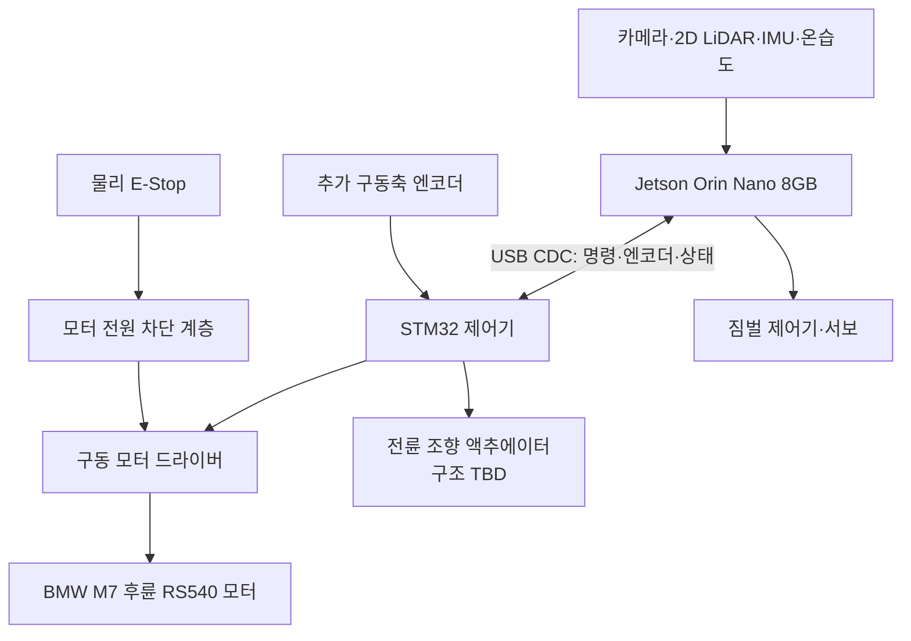

| 계층 | 장치 | 책임 | 고장 시 기본 동작 |
|---|---|---|---|
| 고수준 | Jetson Orin Nano | ROS 2, SLAM, Nav2, YOLO, Mission Manager, 영상, 서버 통신 | STM32 명령 중단, 주행 자동 재개 금지 |
| 저수준 | STM32 | 구동 엔코더 계수, 100Hz 속도 제어, 조향 액추에이터 제어, 통신 watchdog | 구동 PWM 0, driver disable 또는 제동 |
| 구동 | 모터 드라이버 | 모터 전력 스위칭 | enable LOW 시 출력 차단 |
| 독립 안전 | 물리 E-Stop | 모터 구동 전원 직접 차단 | 소프트웨어 상태와 무관하게 정지 |
| 보조 구동 | 짐벌 서보 | 센서 헤드 자세 안정화 | 중앙 또는 기계적 안전각 유지 |

## 21.3 인터페이스 할당

| 연결 | 권장 인터페이스 | 데이터 | 주의사항 |
|---|---|---|---|
| Jetson ↔ STM32 | USB CDC 우선 | 구동 속도·조향각 목표, 엔코더, fault, E-Stop | udev 별칭 `/dev/sentinel_mcu`, 케이블 고정 |
| Jetson ↔ LiDAR | USB Serial | `/scan` 약 11.03Hz 확인 | 실측 `/dev/ttyUSB0`, udev 별칭 사용, 모터 전원선과 분리 |
| Jetson ↔ 카메라 | USB 3.x | 720p MJPEG 약 29.93 FPS 확인 | 실측 `/dev/video0`, 단일 프로세스만 장치 open |
| Jetson ↔ IMU | USB 또는 I2C | 각속도·가속도 | 3.3V 논리 확인, 축 방향 기록 |
| Jetson ↔ 온습도 | I2C/USB | 온도·습도 | 실패해도 주행은 DEGRADED 허용 |
| Jetson ↔ 짐벌 | PWM 제어기 또는 MCU | 목표 pitch/roll | 모터 노이즈와 전원 분리 권장 |
| STM32 ↔ 구동 엔코더 | Timer Encoder/Interrupt | 구동축 tick | 5V 출력이면 레벨 변환 필요 |
| STM32 ↔ 드라이버 | PWM, DIR, ENABLE | 구동 신호 | 외부 pull-down으로 부팅 시 OFF |
| STM32 ↔ 조향 액추에이터 | PWM/DIR/릴레이 등 TBD, 선택적 angle feedback | 목표 조향각 또는 조향 상태 | 실물 분해 후 전압·전류·제어 방식 확정 |

핀 번호는 보드와 부품 모델 확정 전 단정하지 않는다. 부록 J의 핀맵은 데이터시트와 실제 도통 시험을 통과한 값만 기록한다.

## 21.4 전원 도메인

```text
배터리
├─ 퓨즈·메인 스위치
│  ├─ E-Stop·모터 전원 차단 → 모터 드라이버 → 구동 모터
│  ├─ DC-DC A → Jetson 전원
│  ├─ DC-DC B → STM32·센서
│  └─ DC-DC C → 조향·짐벌 서보
└─ 전압·전류 센서 → STM32 또는 Jetson → 관제
```

- 모터와 서보를 Jetson 또는 STM32의 GPIO 전원으로 직접 구동하지 않는다.
- 모터·서보 전원과 컴퓨팅 전원은 분리하되 신호 기준 GND는 설계에 맞게 공통화한다.
- 배터리, DC-DC, 퓨즈, 배선 굵기는 평균 전류가 아니라 **모터 정지 전류와 동시 기동 피크**를 기준으로 선정한다.
- E-Stop은 Jetson 전원을 끄는 버튼이 아니라 모터 구동 에너지를 빠르게 제거하는 회로로 설계한다.
- 첫 구동 시험은 구동 바퀴를 바닥에서 띄운 상태에서 수행한다.

## 21.5 전력 예산 산정

| 항목 | 입력 전압 | 평균 전력 | 피크 전력 | 측정 방법 | 상태 |
|---|---:|---:|---:|---|---|
| Jetson Orin Nano | TBD | TBD | TBD | 전력 모드별 실측 | TBD |
| 구동 모터 | 12V | TBD | RS540 정지 전류 기준 | 전류계·데이터시트 | 모델 확인·전류 TBD |
| 조향 액추에이터 | TBD | TBD | stall 전류 기준 | 전류계·데이터시트 | TBD |
| LiDAR·카메라·IMU | 5V 계열 | TBD | TBD | USB 전력 측정 | TBD |
| 짐벌 서보 | TBD | TBD | 동시 stall 고려 | 전류계 | TBD |
| STM32·보조 센서 | 3.3/5V | TBD | TBD | 벤치 전원 | TBD |

예상 운용시간은 `배터리 유효 Wh ÷ 시스템 평균 W`로 계산하되, 배터리 정격 용량 전부를 사용하지 않고 저전압 차단과 DC-DC 효율을 반영한다.

## 21.6 조립 인수 기준

- 전원 인가 직후 모터 PWM은 0이고 driver enable은 비활성이다.
- 물리 E-Stop을 누르면 Jetson·STM32 상태와 무관하게 모터 출력이 차단된다.
- 모든 USB·전원 케이블은 장력 완화와 커넥터 라벨이 있다.
- 모터 최대 부하에서 Jetson이 재부팅되거나 USB 장치가 재연결되지 않는다.
- 퓨즈·DC-DC·모터 드라이버 온도가 허용 범위를 넘지 않는다.

# 22. 센서 수집·시간 동기화·좌표계 상세 설계

## 22.1 핵심 원칙

SLAM, 사람 위치 추정, 영상 이벤트를 같은 사건으로 연결하려면 센서 데이터의 **좌표계와 시각**이 일치해야 한다. 모든 데이터는 ROS 2 timestamp를 포함하고, 기록용 wall clock과 제어용 monotonic clock을 구분한다.

## 22.2 센서별 처리

| 센서 | ROS 2 출력 | 권장 주기 | 핵심 검증 | 실패 영향 |
|---|---|---:|---|---|
| 2D LiDAR | `/scan` | 약 11.03Hz 실측 | X4 Pro, 128000bps, 약 1222~1231 points/scan, `laser_frame`, 0.1~12.0m, drop | 자율주행 중단 |
| 카메라 | `/camera/image_raw` 또는 공유 프레임 버스 | 29.93 FPS 캡처 실측 | 1280×720 MJPEG, ROS 2 동시 구동·지연·단일 open | 사람 탐지·수동 영상 제한 |
| IMU | `/imu/data_raw` | 50~100Hz | 축, 단위, bias, timestamp | 오도메트리 품질 저하 |
| 구동 엔코더·조향각 | `/wheel/odometry`, `/steering/state` | 50Hz 이상 | 부호·tick·overflow·조향 중앙/한계 | 위치 추정 실패 |
| 온습도 | `/environment` | 0.2~1Hz | 범위·센서 끊김 | 경고만 발생 |
| 배터리 | `/battery_state` | 1~2Hz | 전압·전류·잔량 산식 | 복귀 판단 제한 |

## 22.3 TF 좌표계

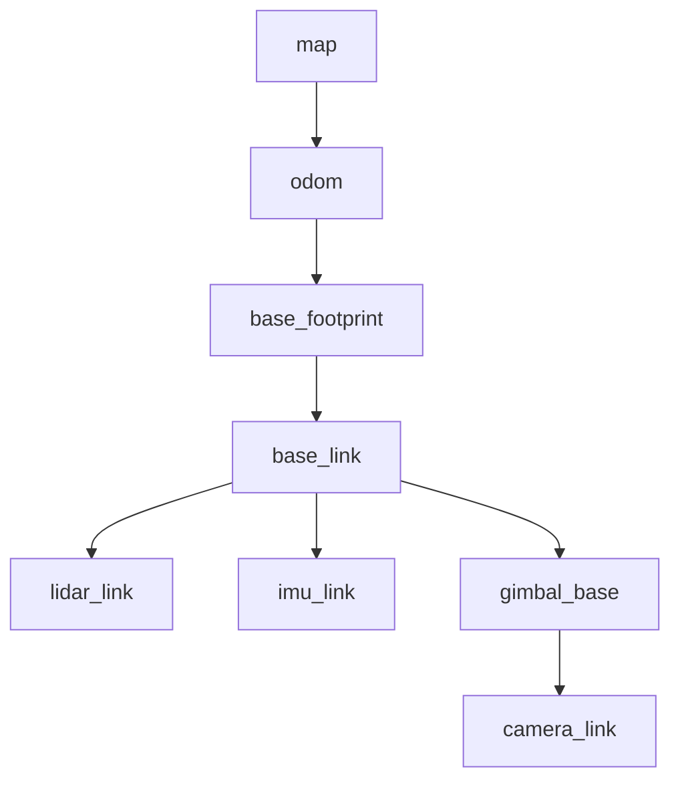

- `map → odom`: SLAM Toolbox가 전역 보정을 제공한다.
- `odom → base_footprint`: 엔코더·IMU EKF가 연속적인 로컬 자세를 제공한다.
- 고정 센서는 static TF를 사용한다.
- 짐벌에 탑재된 카메라 또는 LiDAR는 실제 관절각을 반영한 dynamic TF를 사용한다.
- TF가 미래 시각이거나 허용 지연을 넘으면 사람 map 좌표 확정을 보류한다.

## 22.4 시간 정책

| 목적 | 시계 | 이유 |
|---|---|---|
| 이벤트·영상·DB 정렬 | UTC wall clock | Jetson·EC2 간 비교 가능 |
| 명령 TTL·watchdog | monotonic clock | NTP 보정이나 시간 점프 영향 방지 |
| 파일명·로그 | UTC + missionId | 시간대 혼동과 충돌 방지 |

Jetson은 chrony/NTP로 시각을 동기화한다. 메시지에는 `occurredAt`과 서버의 `receivedAt`을 분리해 기록하며, 시간 오차가 임계값을 넘으면 관제에 경고한다.

## 22.5 센서 품질 게이트

센서 메시지가 존재한다는 이유만으로 정상으로 판정하지 않는다.

```text
최근 수신 시각
+ 실제 주기
+ 값 범위
+ frame_id
+ timestamp 지연
+ 변화량/고정값 여부
→ OK / DEGRADED / FAILED
```

LiDAR, 엔코더, STM32, E-Stop, TF가 FAILED이면 자율 임무를 시작할 수 없다. 카메라가 FAILED이면 사람 탐지와 영상 기반 수동 조종을 차단하되 저속 지도 탐사 허용 여부는 운영자가 결정한다.

# 23. SLAM·위치 추정·미지 영역 탐사 상세 설계

## 23.1 권장 파이프라인

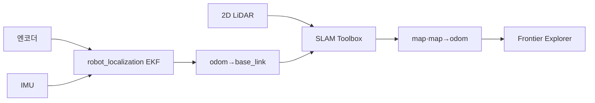

## 23.2 위치 추정 단계

1. STM32가 구동축 엔코더 tick·속도와 조향 상태를 제공한다.
2. 조향 구조 확인 후 Jetson이 실차 운동학과 엔코더·조향 상태를 사용해 wheel odometry를 계산한다.
3. EKF가 wheel odometry와 IMU yaw rate를 융합한다.
4. SLAM Toolbox가 LiDAR scan matching으로 누적 오차를 보정한다.
5. Mission Manager는 TF 연속성과 covariance를 감시한다.

명령한 조향 상태와 실제 바퀴 조향각은 백래시와 링크 기하 때문에 일치하지 않을 수 있다. 액추에이터 방식 확인 후 직선 거리 스케일, 휠베이스, 조향 중앙값, 좌·우 조향각 스케일과 최소 회전반경을 실측해 보정한다. 조향각 센서가 없으면 명령각 또는 명령 상태를 사용하되 covariance를 보수적으로 설정한다.

## 23.3 Frontier 선택

Frontier는 탐색된 자유 공간과 미탐색 공간의 경계다. 후보는 다음 기준으로 점수화한다.

```text
score = 정보이득 가중치 × 예상 신규 면적
      - 이동비용 가중치 × 경로 길이
      - 위험도 가중치 × 좁은 통로·장애물 근접도
      - 실패이력 가중치 × 최근 실패 횟수
```

| 필터 | 규칙 |
|---|---|
| 크기 | 너무 작은 Frontier 제거 |
| 접근성 | Nav2 global plan 생성 불가 후보 제거 |
| 안전거리 | 벽·장애물 inflation 영역 내부 제거 |
| 반복 실패 | 동일 후보 N회 실패 시 cooldown |
| 사람 상호작용 | encounter 진행 중 신규 선택 중단 |

## 23.4 탐사 종료 조건

- 유효 Frontier가 더 이상 없다.
- 임무 제한 시간이 끝났다.
- 배터리 복귀 임계값에 도달했다.
- 운영자가 복귀 또는 종료를 요청했다.
- 핵심 센서·위치 추정이 복구 불가능한 상태다.

정상 종료와 시간·배터리 종료는 `RETURNING`으로 전환한다. 위치를 잃어 home 경로를 생성할 수 없으면 정지 후 수동 회수를 요청한다.

## 23.5 실패 복구

| 실패 | 1차 처리 | 2차 처리 | 최종 처리 |
|---|---|---|---|
| 목표 경로 생성 실패 | 후보 재샘플링 | 다른 Frontier 선택 | 운영자 목표점 |
| local planner 정체 | Nav2 recovery | 아커만 가능한 전·후진 선회 복구 | PAUSED |
| 지도 중복·왜곡 | 정지 후 scan/TF 점검 | 저속 재시도 | 수동 모드 |
| localization lost | 즉시 정지 | 최근 신뢰 pose 재초기화 | ERROR |

# 24. Nav2 경로 계획·장애물 회피·안전 속도 설계

## 24.1 제어 명령 체인

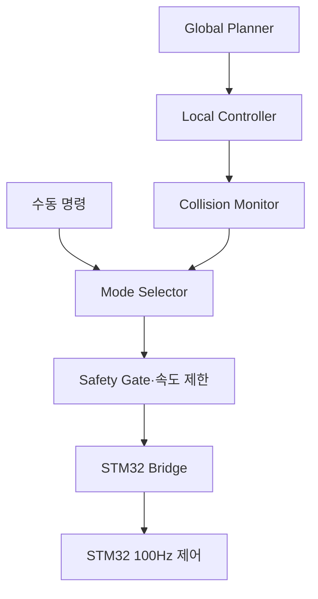

자동·수동 명령은 모두 Safety Gate를 통과한다. E-Stop, watchdog, 센서 실패, 오래된 명령은 어떤 모드보다 우선한다.

BMW M7 전륜 조향 구조가 확인되면 global planner는 최소 회전반경을 고려하는 Smac Hybrid-A*를 우선 검증하고, local controller는 Regulated Pure Pursuit를 기본 후보로 사용한다. 회전 제자리 정렬을 요구하는 rotation shim은 기본 비활성화하고, 경로와 recovery는 전·후진 선회가 가능한지 실차에서 확인한다.

## 24.2 기본 속도 정책

초기값은 실제 정지거리 시험 전의 보수적 시작값이며 최종값은 35장의 튜닝 절차로 확정한다.

| 상황 | 선속도 상한 | 각속도 상한 | 비고 |
|---|---:|---:|---|
| 자율 탐사 | 0.25m/s | 0.6rad/s | 복도 기준 시작값 |
| 피해자 접근 | 0.10m/s | 0.3rad/s | 안전거리 내 저속 |
| 수동 조종 | 0.30m/s | 0.7rad/s | deadman 필수 |
| 영상·위치 불안정 | 0 또는 0.10m/s | 제한 | 품질에 따라 정지 |
| E-Stop·watchdog | 0 | 0 | 즉시 출력 차단/제동 |

## 24.3 장애물 구역

| 구역 | 의미 | 동작 |
|---|---|---|
| 경고 구역 | 경로 주변 장애물 접근 | 감속 |
| 정지 구역 | 예상 정지거리 이내 | 목표 속도 0 |
| 물리 접촉 위험 | 초근거리·범퍼·초음파 | STM32 정지 또는 E-Stop |

정지 구역은 고정 숫자만 사용하지 않고 현재 속도, 센서 갱신 지연, 300ms watchdog, 실제 제동거리를 포함해 결정한다.

## 24.4 수동 조작 안전

- 조이스틱 deadman을 누르는 동안만 DRIVE 명령을 생성한다.
- 브라우저 명령 TTL은 250ms이며 만료된 명령은 폐기한다.
- Jetson이 유효한 상위 명령을 300ms 동안 받지 못하면 0 속도를 생성한다.
- STM32가 유효한 `DRIVE_COMMAND`를 300ms 동안 받지 못하면 독립 정지한다.
- 제어권 Lease가 없는 브라우저의 명령은 서버와 Jetson 양쪽에서 거부한다.
- 수동 종료 후 자율 탐사를 자동 재개하지 않고 운영자에게 재개 여부를 묻는다.

## 24.5 합격 기준

- 표준 장애물 코스에서 충돌 없이 우회하거나 안전 정지한다.
- 게임패드·브라우저·MQTT·USB 중 어느 한 경로를 끊어도 300ms 이내 STM32 PWM이 0이 된다.
- E-Stop 해제 후 새 enable 절차 없이는 움직이지 않는다.
- 사람 접근 중 안전거리보다 가까워지면 Nav2 목표와 무관하게 정지한다.

# 25. 사람 탐지·추적·위치 추정 상세 설계

## 25.1 처리 흐름

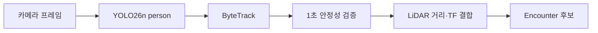

## 25.2 탐지 확정 규칙

단일 프레임의 박스는 이벤트로 확정하지 않는다. 초기 기준은 다음과 같다.

- class가 `person`이다.
- confidence가 설정값 이상이다.
- 동일 track이 약 1초 동안 최소 관측 횟수를 만족한다.
- 박스 크기·위치가 비정상적으로 급변하지 않는다.
- 카메라 timestamp와 TF를 조회할 수 있다.
- 이미 활성 encounter에 포함된 track 또는 공간 중복인지 검사한다.

COCO 가중치를 초기값으로 사용하되, 실제 시연 복장·조명·거리의 person 데이터를 수집해 YOLO26n Detect를 추가 학습한다. confidence와 관측 횟수는 학습 데이터와 분리한 시연 환경 검증셋으로 조정하며, 학습 가중치·데이터셋 버전·평가 결과를 함께 고정한다.

## 25.3 거리·지도 위치 추정

1. bounding box 중심 또는 하단 중심에서 카메라 광선을 계산한다.
2. 같은 방위의 LiDAR 유효 거리 후보를 탐색한다.
3. 인접 beam median과 유효 범위 검사를 적용한다.
4. `camera_link` 또는 `lidar_link` 좌표를 `map`으로 변환한다.
5. 위치 covariance 또는 quality 등급을 함께 저장한다.

LiDAR와 카메라 높이·시야가 달라 직접 거리를 얻지 못하면, 사람 주변의 지면/벽 반사를 잘못 선택할 수 있다. 이때는 지도 위치를 `ESTIMATED`로 표시하고 로봇 접근 과정의 추가 관측으로 갱신한다.

## 25.4 다중 인원과 중복 제거

- 사람은 ByteTrack `trackId` 단위로 개별 추적한다.
- 같은 시각·같은 공간의 여러 track은 하나의 `encounter`로 묶는다.
- 하나의 encounter는 여러 `victim` 후보와 다대다 관계를 가진다.
- 짧은 가림으로 trackId가 바뀌면 시간·위치·외형의 단순 조건으로 병합하되 정밀 재식별은 범위에서 제외한다.
- 이미 보고한 위치 근처의 재탐지는 새 피해자가 아니라 기존 후보 갱신을 우선한다.

## 25.5 성능 측정

| 지표 | 의미 |
|---|---|
| inference FPS | YOLO 처리 속도 |
| end-to-end latency | 프레임 획득부터 관제 표시까지 |
| track continuity | 가림 전후 ID 유지율 |
| event precision | 확정 이벤트 중 실제 사람 비율 |
| miss rate | 시연 사람을 놓친 비율 |
| position error | 지도상 마커와 실제 위치 오차 |

# 26. Mission Manager·임무 상태 머신 상세 설계

## 26.1 단일 권한 원칙

Mission Manager는 임무 상태를 변경하는 유일한 로봇 측 권한자다. Nav2, AI, 음성, 관제 명령이 각자 모터와 상태를 직접 바꾸지 않고 이벤트를 Mission Manager에 전달한다.

## 26.2 최종 상태

| 상태 | 설명 | 이동 허용 |
|---|---|---|
| `SAFE_IDLE` | 부팅·점검 완료 전 또는 임무 대기 | 아니오 |
| `EXPLORING` | Frontier 탐사 | 예 |
| `PERSON_APPROACHING` | 사람 그룹 안전 접근 | 저속 |
| `INTERACTING` | 음성 확인 | 아니오 |
| `POST_RECORDING` | 종료 후 3초 영상 확보 | 아니오 |
| `REPORTING` | 이벤트·피해자·미디어 저장 | 아니오 |
| `PAUSED` | 운영자 또는 오류로 일시정지 | 아니오 |
| `MANUAL` | 단일 Lease 수동 조작 | deadman 시 |
| `RETURNING` | home pose 복귀 | 예 |
| `COMPLETED` | 정상 종료 | 아니오 |
| `ESTOP` | 비상 정지 latch | 아니오 |
| `ERROR` | 핵심 기능 복구 불가 | 아니오 |

`OFFLINE`은 서버가 보는 연결 상태이며 Jetson 내부 주행 상태와 혼동하지 않는다.

## 26.3 상태 전이

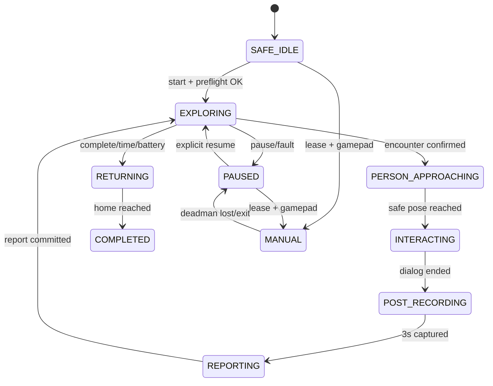

모든 이동 상태에서 E-Stop은 `ESTOP`으로, 핵심 센서 실패는 `PAUSED` 또는 `ERROR`로 우선 전환한다. Mermaid 도식에 표시되지 않은 비상 전이는 이 규칙을 따른다.

## 26.4 명령 멱등성과 재시작

- 모든 외부 명령은 `commandId`, `issuedAt`, `expiresAt`을 가진다.
- 이미 처리한 commandId는 결과 ACK만 재전송하고 다시 실행하지 않는다.
- Jetson 또는 서버 재시작 후 진행 중 임무를 자동 주행으로 복구하지 않는다.
- 로컬 checkpoint를 읽어 `RECOVERY_REQUIRED` 상태를 표시하고 운영자가 재개·복귀·종료를 선택한다.
- encounter 보고가 중단되면 동일 encounterId로 재시도한다.

## 26.5 이벤트 우선순위

```text
물리 E-Stop
> STM32 fault/watchdog
> 소프트웨어 E-Stop
> Collision stop
> 핵심 센서·위치 오류
> 수동 deadman/Lease
> 피해자 encounter
> 복귀
> 자율 탐사
```

# 27. Spring Boot 관제 백엔드·도메인·API 상세 설계

## 27.1 책임 경계

Spring Boot는 로봇을 실시간 폐루프로 제어하지 않는다. 임무·운영자·명령 이력·실시간 관제 전달·데이터 저장을 담당하며, 안전 판단과 최종 모터 권한은 Jetson·STM32에 남긴다.

## 27.2 모듈 구조

```text
backend/
├─ mission/          # 임무 생성·상태·요약
├─ robot/            # 등록·presence·health
├─ control/          # Lease·명령·ACK·감사 로그
├─ encounter/        # 피해자 발견·응답·미디어 연결
├─ telemetry/        # TimescaleDB 쓰기·조회
├─ media/            # S3 Presigned URL·상태
├─ realtime/         # STOMP/WebSocket 브로드캐스트
├─ messaging/        # MQTT 구독·발행·멱등 처리
├─ security/         # 인증·권한·감사
└─ common/           # 오류·시간·ID·검증
```

## 27.3 핵심 도메인 규칙

- 한 로봇에는 동시에 하나의 활성 임무만 존재한다.
- 한 로봇에는 동시에 하나의 유효 control lease만 존재한다.
- 로봇이 보낸 임무 상태와 서버 명령 상태를 분리해 저장한다.
- 이벤트는 `messageId` 또는 도메인 id의 unique constraint로 중복 삽입을 막는다.
- S3 업로드 성공 전에도 DB 이벤트는 `LOCAL_ONLY/PENDING`으로 조회 가능하다.
- 서버가 임의로 `COMPLETED`를 만들지 않고 로봇의 종료 결과와 증빙을 확인한다.

## 27.4 REST API 기준

| Method | Endpoint | 목적 |
|---|---|---|
| POST | `/api/v1/missions` | 임무 생성 |
| POST | `/api/v1/missions/{id}/commands` | start/pause/resume/return/stop |
| GET | `/api/v1/missions` | 임무 목록 |
| GET | `/api/v1/missions/{id}` | 임무 상세·요약 |
| GET | `/api/v1/missions/{id}/trajectory` | 경로 다운샘플 조회 |
| GET | `/api/v1/missions/{id}/telemetry` | 시계열 범위 조회 |
| GET | `/api/v1/missions/{id}/encounters` | 피해자 발견 목록 |
| POST | `/api/v1/robots/{id}/control-leases` | 제어권 요청 |
| DELETE | `/api/v1/robots/{id}/control-leases/{leaseId}` | 제어권 반납 |
| POST | `/api/v1/media/presign-upload` | 업로드 URL 발급 |
| GET | `/api/v1/media/{id}/view-url` | 단기 조회 URL 발급 |

제어 API가 HTTP 202를 반환한 것은 로봇이 동작을 완료했다는 뜻이 아니다. 응답에는 `commandId`와 `ACCEPTED_FOR_DELIVERY`를 반환하고, 실제 수락·실행 결과는 ACK 상태로 갱신한다.

## 27.5 오류 응답

```json
{
  "code": "CONTROL_LEASE_DENIED",
  "message": "다른 운영자가 제어권을 보유 중입니다.",
  "traceId": "uuid",
  "occurredAt": "2026-07-22T06:30:00Z"
}
```

내부 예외·AWS 키·SQL 문장은 클라이언트에 노출하지 않는다.

## 27.6 백엔드 인수 기준

- MQTT QoS 1 중복 메시지를 2회 받아도 DB 행과 웹 이벤트는 1회만 생성된다.
- 명령 요청부터 ACK까지 상태가 추적된다.
- 비활성·만료 Lease의 DRIVE 명령을 거부한다.
- 임무 상세에서 경로·시계열·encounter·미디어를 함께 조회할 수 있다.
- DB·S3 일부 장애가 다른 API 전체를 무한 대기시키지 않는다.

# 28. Next.js 관제 화면·조이스틱 UX 상세 설계

## 28.1 화면 구조

| 화면 | 핵심 정보 | 핵심 행동 |
|---|---|---|
| 실시간 관제 | 영상, 지도, 로봇 상태, 배터리, 온습도, 이벤트 | 시작·정지·복귀·수동·E-Stop |
| 임무 목록 | 시간, 상태, 탐지 수, 거리, 종료 사유 | 필터·상세 이동 |
| 임무 상세 | 경로, encounter, 영상, 센서 그래프 | 증빙 재생·다운로드 |
| 설정 | 속도·탐사 시간·영상 모드 | 관리자만 변경 |

## 28.2 실시간 관제 우선순위

운영자는 화면을 읽기 전에 위험을 알아야 한다. 상단 고정 영역에 다음을 항상 표시한다.

- `ROBOT STATE`와 서버 연결 상태를 분리 표시
- 물리·소프트웨어 E-Stop 상태
- STM32·LiDAR·카메라·TF health
- 배터리와 예상 복귀 가능 여부
- control lease 보유자와 게임패드 연결 상태
- 영상 지연·스트림 모드(LOCAL/REMOTE)

## 28.3 영상·지도 동기화

- 영상 위 AI 박스는 `frameId` 또는 `capturedAt`이 가까운 탐지 데이터만 표시한다.
- 오래된 박스는 자동 제거하고 네트워크 지연으로 뒤늦게 온 데이터는 폐기한다.
- 지도에는 로봇 pose, 이동 경로, home, 현재 Frontier, encounter 마커를 구분한다.
- encounter 마커를 클릭하면 피해자 수·응답 상태·스냅샷·영상을 연다.

## 28.4 게임패드 UX

1. Gamepad API로 연결을 감지한다.
2. 운영자가 제어권을 요청한다.
3. 축 중앙값·deadzone을 확인한다.
4. deadman을 누를 때만 20Hz DRIVE 명령을 전송한다.
5. 탭 비활성, 페이지 종료, 패드 분리, Lease 만료 시 즉시 0 명령을 보내고 수동 모드를 종료한다.

브라우저의 STOP 전송 성공에만 의존하지 않는다. 명령 중단 자체가 Jetson·STM32 300ms watchdog을 작동시켜야 한다.

## 28.5 위험 조작 보호

| 조작 | 보호 방식 |
|---|---|
| 탐사 시작 | preflight 결과 확인 |
| 수동 전환 | 게임패드 + Lease + deadman |
| 복귀 | 확인 대화상자, 현재 상태 표시 |
| E-Stop | 항상 활성, 한 번의 동작으로 실행 |
| E-Stop 해제 | 오류 해소·주변 확인·재enable 분리 |
| 설정 변경 | 임무 중 제한, 감사 로그 |

## 28.6 접근성과 실패 표현

색상만으로 상태를 표현하지 않고 텍스트·아이콘을 함께 사용한다. 네트워크가 끊겼을 때 마지막 상태를 정상처럼 보이지 않게 `STALE`과 마지막 수신 시각을 표시한다. 로딩·데이터 없음·권한 없음·장애를 서로 다른 화면 상태로 처리한다.

# 29. PostgreSQL·TimescaleDB·S3·Outbox 상세 설계

## 29.1 저장 책임

| 저장소 | 데이터 | 이유 |
|---|---|---|
| PostgreSQL | 로봇·임무·명령·encounter·피해자·미디어 메타데이터 | 관계·무결성·트랜잭션 |
| TimescaleDB 확장 | pose·환경·시스템·네트워크 시계열 | 시간 범위·집계 쿼리 |
| S3 | 영상·스냅샷·지도·선택 rosbag·보고서 | 대용량 객체 저장 |
| Jetson SQLite Outbox | 미전송 이벤트·메타데이터 | 네트워크 단절 복구 |
| Jetson 로컬 파일 | 업로드 대기 영상·지도 | S3 장애 복구 |

TimescaleDB는 별도 DB 서버가 아니라 PostgreSQL 인스턴스에 설치하는 확장으로 사용한다.

## 29.2 핵심 관계

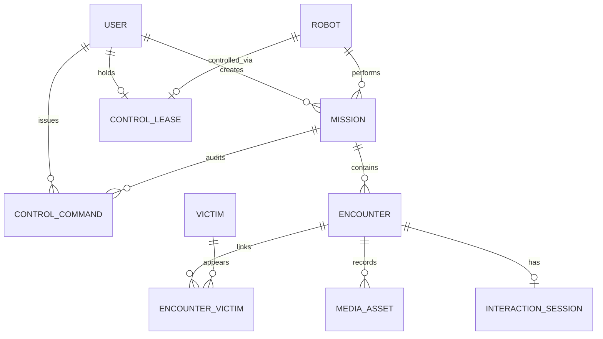

`USER`는 관제 운영자 계정이며, 조작 주체는 `MISSION.created_by_user_id`(임무 생성자), `CONTROL_COMMAND.issued_by_user_id`(명령 발행자), `CONTROL_LEASE.user_id`(제어권 보유자)로 식별한다. `CONTROL_LEASE`는 로봇 1대당 활성 1건으로 현재 제어권 보유자를 나타낸다.

시계열 행은 `mission_id`, `robot_id`, `time`을 공통으로 가지며, 임무 종료 후 요약 테이블을 계산한다.

## 29.3 데이터 무결성

- UUID는 생성 주체와 무관하게 충돌하지 않도록 사용한다.
- `message_id`, `command_id`, `encounter_id`, S3 object key에 unique constraint를 둔다.
- 임무·이벤트 시간은 UTC로 저장하고 UI에서 로컬 시간대로 표시한다.
- 미디어 DB 행과 S3 객체 상태를 `LOCAL_ONLY → PENDING → UPLOADING → READY/FAILED`로 관리한다.
- DB 행을 삭제할 때 S3 객체 삭제 결과를 추적하는 tombstone 또는 삭제 job을 사용한다.

## 29.4 Outbox 전송

```text
로컬 사건 발생
→ SQLite 트랜잭션으로 event + outbox 저장
→ MQTT/REST 전송
→ 서버 ACK와 id 확인
→ outbox SENT
→ 미디어 Presigned 업로드
→ 서버 READY 확인
→ 보존 유예 후 로컬 파일 삭제
```

재시도는 지수 백오프와 최대 간격을 사용한다. QoS 1의 중복 가능성을 전제로 서버는 멱등 처리하며, 업로드 성공 여부가 불명확하면 같은 object key를 조회한 후 재전송한다.

## 29.5 시계열 보존·다운샘플

| 데이터 | 원본 주기 | 원본 보존 | 장기 집계 |
|---|---:|---|---|
| pose | 2Hz 관제 저장 | 프로젝트 기간 또는 30일 | 1s/5s |
| 시스템·배터리 | 1Hz | 프로젝트 기간 | 1m 평균·최대 |
| 온습도 | 0.2~0.5Hz | 프로젝트 기간 | 1m 평균 |
| 네트워크 | 1Hz | 30일 | 1m 평균·p95 |
| AI 관측 원본 | 이벤트 주변 | 필요 기간 | encounter 요약 |

보존 기간은 36장의 개인정보 정책이 우선하며 시연 참가자 데이터는 필요 이상 장기 보관하지 않는다.

## 29.6 S3 key 규칙

```text
missions/{missionId}/
├─ encounters/{encounterId}/thumbnail.jpg
├─ encounters/{encounterId}/event.mp4
├─ encounters/{encounterId}/transcript.json
├─ maps/map.pgm
├─ maps/map.yaml
└─ reports/summary.json
```

파일명에 사람 이름·음성 원문·토큰을 포함하지 않는다.

# 30. 피해자 발견·접근·상호작용 오케스트레이션

## 30.1 목표

사람 탐지를 단순 알림으로 끝내지 않고, 안전한 접근·음성 확인·이벤트 영상·구조 정보 보고까지 하나의 **encounter**로 관리한다. 사람은 개별 추적하되 현장 접근과 대화·영상은 그룹 단위로 처리한다.

## 30.2 최종 흐름

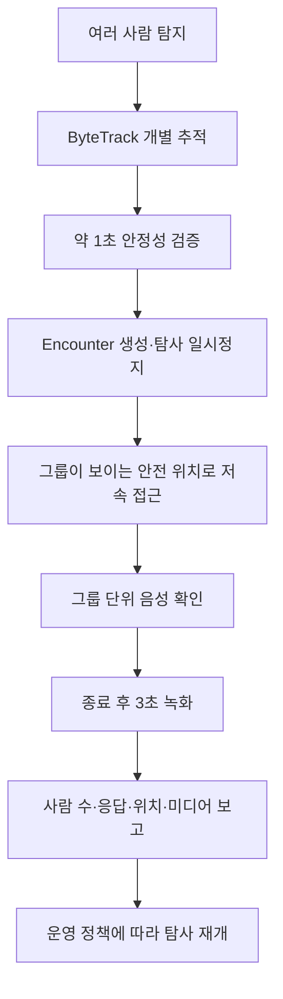

## 30.3 안전 접근

접근 목표는 사람 좌표 자체가 아니라 사람으로부터 안전거리만큼 떨어진 자유 공간의 관측 pose다.

1. 사람 그룹의 대표 위치와 분산을 계산한다.
2. costmap 자유 공간에서 후보 관측 pose를 만든다.
3. LiDAR 시야와 카메라 프레임에 그룹이 들어오는지 평가한다.
4. Nav2 경로 생성 가능성과 최소 장애물 거리를 확인한다.
5. 접근 속도를 0.10m/s 이하의 보수적 값으로 제한한다.
6. 사람이 움직이거나 경로가 막히면 즉시 정지하고 목표를 재평가한다.

접근이 불가능하면 현재 안전 위치에서 음성을 송출하고 `APPROACH_FAILED`를 보고한다. 사람을 향해 무리하게 직진하지 않는다.

## 30.4 상호작용 범위

MVP 질문은 구조 판단에 필요한 최소 항목으로 제한한다.

- “제 목소리가 들리시나요?”
- “몇 분이 함께 계신가요?”
- “움직일 수 있나요?”
- “다친 곳이나 도움이 필요한 분이 있나요?”

응답은 확정 의료 진단이 아니라 `RESPONSIVE`, `NO_RESPONSE`, `UNCERTAIN`, `MOBILITY_YES/NO/UNKNOWN` 같은 구조화 상태로 저장한다. 상세 VAD·STT·TTS와 실패 처리는 33장에서 정의한다.

## 30.5 종료·재개 조건

encounter는 다음 중 하나로 종료한다.

- 필수 질문이 완료되었다.
- 최대 상호작용 시간이 지났다.
- 무응답 재시도 횟수를 소진했다.
- 운영자가 종료했다.
- 안전 장애 또는 E-Stop이 발생했다.

종료 후 3초 영상 확보와 로컬 보고 저장까지 완료한 뒤 탐사를 재개한다. 안전 장애·미디어 저장 실패·Mission Manager 오류가 있으면 자동 재개하지 않고 `PAUSED`를 유지한다.

## 30.6 이벤트 영상 및 다중 인원 데이터 구조

### 30.6.1 기존 요구사항 변경

Sentinel UGV는 일반 주행 영상을 장시간 연속 저장하지 않고, 사람 발견과 상호작용을 중심으로 이벤트 영상을 저장한다.

> Jetson은 카메라 영상을 상시 H.264로 인코딩하면서 최근 3초를 순환 버퍼에 유지한다. 사람 탐지가 확정되면 탐지 이전 3초부터 녹화를 시작하고, 피해자 접근 및 음성 상호작용을 계속 기록한다. 상호작용 종료 후 3초를 추가 녹화한 뒤 하나의 이벤트 클립으로 저장한다.

```text
상시 H.264 인코딩
→ 최근 3초 Ring Buffer
→ 사람 탐지 확정
→ 탐지 이전 3초부터 이벤트 녹화
→ 접근·정지·음성 상호작용 기록
→ 상호작용 종료 후 3초 추가 기록
→ 이벤트 MP4 저장
→ S3 업로드
```

### 변경 이유

- 사람 발견과 구조 정보 수집이 핵심이므로 일반 주행 영상 전체를 장기간 저장할 필요가 없다.
- 탐지 이전 상황까지 남겨 오탐 여부와 접근 과정을 확인할 수 있다.
- EC2 및 S3로 전송하는 데이터량과 저장 비용을 크게 줄일 수 있다.
- 과거 이력 화면에서 중요한 장면을 바로 재생할 수 있다.

### 장단점 및 현실성

| 항목 | 1분 단위 지속 저장 | 이벤트 기반 저장 |
|---|---|---|
| 저장공간·업로드량 | 큼 | 작음 |
| 중요 장면 탐색 | 여러 파일을 확인해야 함 | 이벤트 단위로 즉시 조회 가능 |
| 탐지 이전 장면 | 우연히 포함될 수 있음 | 3초를 명시적으로 보장 |
| 오탐 영향 | 별도 영향 없음 | 오탐 클립이 생성될 수 있음 |
| 구현 난이도 | 낮음 | 중간 |
| Sentinel 적합성 | 보통 | 높음 |

Jetson의 H.264 하드웨어 인코더와 GStreamer 분기 파이프라인을 사용하면 프로젝트 기간 내 구현 가능하다. 구체적인 파이프라인과 WebRTC 연동은 32장에서 정의한다.

---

### 30.6.2 녹화 상태

```text
BUFFERING
→ PERSON_CANDIDATE
→ PERSON_CONFIRMED
→ RECORDING
→ INTERACTION
→ POST_RECORDING
→ FINALIZING
→ SAVED 또는 UPLOAD_PENDING
```

| 상태 | 처리 내용 |
|---|---|
| `BUFFERING` | 최근 3초의 인코딩 영상을 순환 보관 |
| `PERSON_CANDIDATE` | 사람 후보를 추적하지만 아직 이벤트를 생성하지 않음 |
| `PERSON_CONFIRMED` | 연속 탐지 조건 충족 후 발견 이벤트 생성 |
| `RECORDING` | 사전 버퍼를 포함하여 접근·정지 과정 녹화 |
| `INTERACTION` | 음성 상호작용 구간을 영상과 함께 기록 |
| `POST_RECORDING` | 상호작용 종료 후 3초 추가 녹화 |
| `FINALIZING` | MP4 컨테이너 마무리 및 체크섬 계산 |
| `SAVED` | 로컬 파일 정상 저장 및 S3 업로드 완료 |
| `UPLOAD_PENDING` | 네트워크 문제로 로컬에 보관하고 재업로드 대기 |

초기 사람 확정 조건은 다음과 같이 설정하고 실제 카메라 시험 후 조정한다.

```text
최근 1초 동안 서로 다른 5개 이상의 프레임에서 탐지
+ 평균 confidence 0.60 이상
→ PERSON_CONFIRMED
```

단일 프레임 탐지는 후보로만 처리하여 오탐 영상 생성을 줄인다.

### 녹화 종료 예외

- 상호작용 종료 후 3초 동안 사람 재탐지 또는 음성 입력이 발생하면 종료를 취소하고 녹화를 연장한다.
- 음성 종료 신호가 누락되면 30초 무응답 타임아웃을 적용한다.
- 하나의 이벤트 영상은 최대 5분으로 제한하며, 초과 시 현재 파일을 안전하게 종료하고 필요하면 다음 조각으로 이어서 저장한다.
- 녹화 도중 전원이 차단되어도 복구 가능하도록 fragmented MP4 또는 짧은 임시 조각 저장 방식을 사용한다.

---

### 30.6.3 한 화면에 여러 사람이 등장하는 경우

다중 인원은 다음 원칙으로 처리한다.

> 사람은 개별 피해자 후보로 관리하고, 같은 시공간에서 발생한 접근·대화·영상은 하나의 발견 이벤트로 묶는다.

```text
YOLO: 사람 3명 탐지
→ ByteTrack: track 12, 13, 14로 개별 추적
→ 하나의 encounter 생성
→ 피해자 후보 3명 생성
→ 그룹 전체가 보이는 안전 위치에서 정지
→ 그룹 단위 음성 확인
→ 이벤트 영상 1개 저장
→ encounter와 피해자 3명을 연결
```

### 다중 인원 판정 규칙

- 같은 프레임에서 분리된 바운딩 박스와 `track_id`를 가진 사람은 가까이 있어도 서로 다른 사람으로 본다.
- 가림 때문에 사람이 일시적으로 사라져도 2~3초 동안 기존 트랙의 복원을 시도한다.
- 기존 이벤트가 진행 중일 때 같은 장면에 새 사람이 확인되면 동일 `encounter`에 추가한다.
- 시간이 지난 뒤 다시 발견한 사람은 지도 위치, 시간, 추적 특징을 이용해 중복 후보로 표시한다.
- 중복 여부가 불확실하면 자동 병합하지 않고 관제자가 확인하도록 한다.

### 주행 및 상호작용

1. 여러 사람이 확정되면 자율 탐사를 일시 중지한다.
2. LiDAR 장애물 거리와 카메라 내 전체 인원 영역을 확인한다.
3. 그룹 중앙 방향을 바라보되 가장 가까운 사람과 1.5~2.0m 안전거리를 확보한다.
4. 그룹 단위 질문으로 발견 인원과 응답 인원을 확인한다.
5. 일반 USB 마이크로 화자를 정확히 구분하기 어려우므로 MVP에서는 개인별 발화 귀속을 강제하지 않는다.

초기 보고 예시는 다음과 같다.

```json
{
  "encounterId": "8b7b90dc-c0fb-4e57-9359-c30fb0528d75",
  "detectedPersonCount": 3,
  "responsivePersonCount": 2,
  "unresponsivePersonCount": 1,
  "summary": "3명 발견, 2명 음성 응답, 1명 응답 미확인"
}
```

개인별 상태 확인은 다음 확장 단계에서 관제자의 바운딩 박스 선택 또는 순차 질문 방식으로 추가한다.

---

### 30.6.4 데이터베이스 수정

여러 피해자가 하나의 영상을 공유할 수 있으므로 `encounters`와 연결 테이블을 추가한다.

### `encounters`

한 번의 현장 발견·접근·상호작용을 나타낸다.

```text
encounter_id              UUID PK
mission_id                UUID FK
map_id                    UUID FK
status                    VARCHAR
map_x                     DOUBLE PRECISION
map_y                     DOUBLE PRECISION
map_yaw                   DOUBLE PRECISION
detected_person_count     INTEGER
responsive_person_count   INTEGER
unresponsive_person_count INTEGER
interaction_summary       TEXT
started_at                TIMESTAMPTZ
interaction_started_at    TIMESTAMPTZ
interaction_ended_at      TIMESTAMPTZ
ended_at                  TIMESTAMPTZ
termination_reason        VARCHAR
created_at                TIMESTAMPTZ
```

`termination_reason` 예시:

```text
NORMAL
NO_RESPONSE_TIMEOUT
MAX_DURATION
MANUAL_STOP
MISSION_ABORTED
FAULT
```

### `encounter_victims`

발견 이벤트와 개별 피해자를 다대다로 연결한다.

```text
encounter_id              UUID FK
victim_id                 UUID FK
track_id                  INTEGER
response_status           VARCHAR
first_seen_at             TIMESTAMPTZ
last_seen_at              TIMESTAMPTZ
PRIMARY KEY (encounter_id, victim_id)
```

### `detections` 수정

```text
encounter_id              UUID FK NULL
```

한 사람에 대한 여러 탐지 결과는 `victim_id`로 묶고, 같은 장면의 사람들은 `encounter_id`로 묶는다.

### `media_assets` 수정

```text
encounter_id              UUID FK NULL
triggered_at              TIMESTAMPTZ
interaction_started_at    TIMESTAMPTZ
interaction_ended_at      TIMESTAMPTZ
pre_buffer_sec            REAL DEFAULT 3
post_buffer_sec           REAL DEFAULT 3
termination_reason        VARCHAR
```

이벤트 영상은 피해자 한 명에 직접 귀속하지 않고 `encounter_id`에 연결한다.

```text
missions/{mission_id}/encounters/{encounter_id}/event.mp4
missions/{mission_id}/encounters/{encounter_id}/thumbnail.jpg
```

수정된 핵심 관계는 다음과 같다.

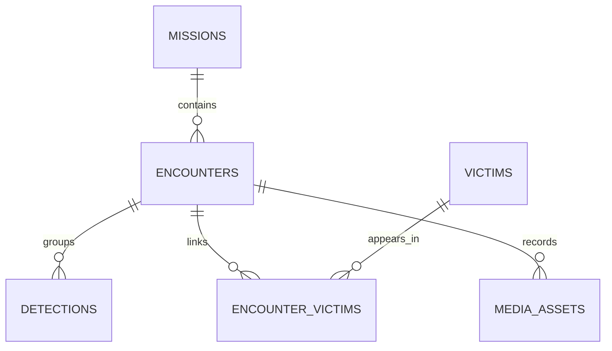

---

# 31. Jetson - Spring Boot - 관제 웹 통신 설계

## 31-1. 추천 결론

Sentinel UGV의 통신은 하나의 프로토콜로 통합하지 않고 데이터 성격에 따라 나눈다.

| 구간 | 프로토콜 | 주요 용도 |
|---|---|---|
| Jetson ↔ EC2 | MQTT 5 over TLS | 차량 상태, 이벤트, 명령, ACK, 연결 상태 |
| Jetson ↔ Spring Boot | HTTPS REST | 이벤트 영상 업로드 준비, 메타데이터 등록, 재전송 배치 |
| Next.js ↔ Spring Boot | HTTPS REST | 임무 생성, 이력·지도·탐지 결과 조회 |
| Next.js ↔ Spring Boot | STOMP over WSS | 실시간 상태·이벤트 수신, 조이스틱 명령 전달 |
| Jetson ↔ 브라우저 | WebRTC | 저지연 실시간 영상·음성 |
| Jetson 내부 | ROS 2 DDS | SLAM, Nav2, YOLO, Mission Manager 노드 통신 |
| Jetson ↔ STM32 | USB CDC 우선 | 구동 속도·조향각 목표, 엔코더·조향·오류·E-Stop 상태 |

ROS 2 DDS를 인터넷 구간까지 직접 확장하지 않는다. ROS 토픽은 크기와 주기가 다양하고 네트워크 설정이 복잡하므로, Jetson의 `cloud_bridge_node`가 관제에 필요한 데이터만 JSON 메시지로 변환한다.

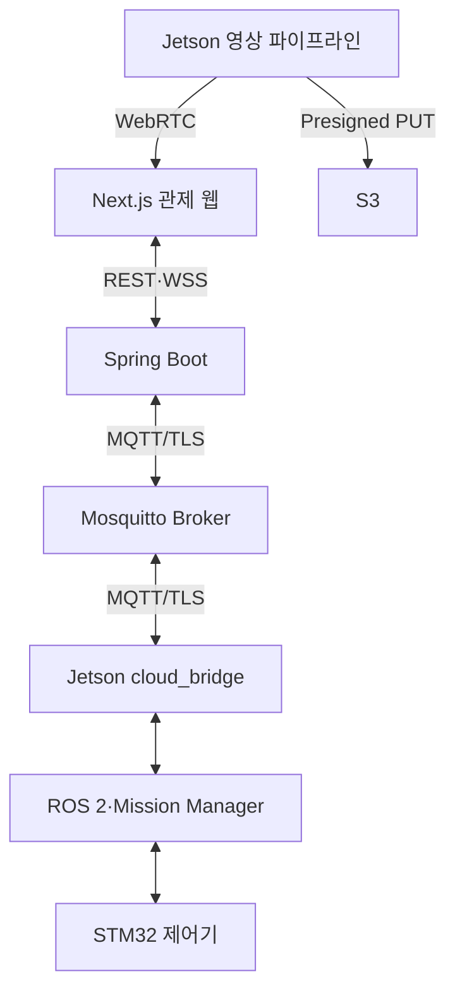

---

## 31-2. 통신 방식 선택 근거

- 재연결 후 구독 복구와 여러 종류의 메시지 분배가 필요하다.
- 차량 명령, 센서 상태, 사람 탐지 이벤트의 신뢰도 요구가 서로 다르다.
- 브라우저가 TCP 소켓에 직접 연결하기 어렵다.
- 파일과 영상은 메시지 브로커를 거치지 않고 별도 업로드해야 한다.
- 네트워크 단절 시 차량을 즉시 정지하고 중요 이벤트를 나중에 재전송해야 한다.

### 대안 비교

| 방식 | 장점 | 단점 | 판단 |
|---|---|---|---|
| 순수 TCP 소켓 | 지연이 낮고 단순한 시험이 쉬움 | 프레이밍·재연결·구독·ACK·다중 클라이언트를 직접 구현 | 학습용 또는 Jetson-STM32 외에는 비추천 |
| REST만 사용 | 구현과 디버깅이 쉬움 | 실시간 양방향 상태와 조이스틱에 부적합 | 조회·등록용으로 사용 |
| WebSocket만 사용 | 브라우저 양방향 통신에 적합 | 차량 오프라인 처리·QoS·메시지 영속성을 직접 구현 | 웹 실시간 구간에 사용 |
| MQTT만 사용 | 경량 Pub/Sub, QoS, LWT, 재연결에 유리 | 파일 전송과 일반 웹 조회에 부적합 | 차량 메시지의 중심으로 사용 |
| MQTT + REST + WebSocket | 각 데이터에 맞는 역할 분리 | 구성 요소가 늘어남 | Sentinel 최종 추천 |

구현 난이도는 중간 수준이다. 다만 MQTT는 `cloud_bridge`, REST는 파일·이력, WebSocket은 관제 화면으로 책임이 명확하여 팀이 병렬 개발하기 쉽고 4~6주 내 구현 가능성이 높다.

---

## 31-3. 서버 구성

EC2에는 다음 컨테이너를 둔다.

```text
Nginx
├─ HTTPS REST /api/* → Spring Boot
├─ WSS /ws          → Spring Boot STOMP
└─ Next.js 정적·SSR 요청

Spring Boot
├─ Mission API
├─ MQTT Gateway
├─ WebSocket Gateway
├─ Telemetry·Event 저장
├─ Control Lease 관리
└─ S3 Presigned URL 발급

Mosquitto
├─ Jetson MQTT 연결
└─ Spring Boot MQTT 연결

PostgreSQL + TimescaleDB
S3
```

초기에는 Spring의 단순 STOMP 브로커를 사용한다. 관제 서버가 한 대이므로 RabbitMQ나 Kafka를 추가하지 않는다.

### 권장 클라이언트

| 구성 요소 | 권장 구현 |
|---|---|
| Jetson | Python `paho-mqtt` MQTT 5 클라이언트 |
| Spring Boot | Eclipse Paho MQTT v5 비동기 클라이언트를 감싼 `MqttGateway` |
| 웹 | `@stomp/stompjs` |
| MQTT Broker | Eclipse Mosquitto |

---

## 31-4. MQTT 토픽 규칙

기본 형식:

```text
sentinel/v1/robots/{robotId}/{channel}
```

| 토픽 | 발행 → 구독 | QoS | Retain | 주기·조건 |
|---|---|---:|---:|---|
| `presence` | Jetson → Spring | 1 | O | 접속·종료·LWT |
| `state` | Jetson → Spring | 1 | O | 상태 변경 및 1초 heartbeat |
| `telemetry` | Jetson → Spring | 0 | X | 임무 중 2Hz |
| `events` | Jetson → Spring | 1 | X | 탐지·오류·상태 전환 즉시 |
| `acks` | Jetson → Spring | 1 | X | 명령 수락·거부·완료 시 |
| `cmd/mission` | Spring → Jetson | 1 | X | 시작·일시정지·재개·종료 |
| `cmd/mode` | Spring → Jetson | 1 | X | MANUAL·AUTO 전환 |
| `cmd/drive` | Spring → Jetson | 0 | X | 수동 조작 중 20Hz |
| `cmd/stop` | Spring → Jetson | 1 | X | 조이스틱 해제·제어권 상실 |
| `cmd/estop` | Spring → Jetson | 1 | X | 소프트웨어 E-Stop |

MQTT QoS 0은 유실될 수 있지만 다음 속도 명령이 곧 도착하는 `cmd/drive`와 반복 telemetry에 적합하다. QoS 1은 최소 한 번 전달되므로 이벤트와 상태 명령에 사용하되 중복 도착을 고려해야 한다. 모든 명령은 `commandId`로 멱등 처리한다.

### Retain 규칙

- 현재 연결·운영 상태인 `presence`, `state`만 Retain을 사용한다.
- 과거 명령이 재연결 직후 실행되는 것을 막기 위해 모든 `cmd/*` 토픽은 Retain을 금지한다.
- Jetson은 재연결 후 `SAFE_IDLE/STOP` 또는 현재 로컬 안전 상태를 서버와 동기화하며 자동 주행을 재개하지 않는다.

### 연결 상태

Jetson은 MQTT Last Will을 다음처럼 등록한다.

```json
{
  "robotId": "SENTINEL-01",
  "status": "OFFLINE",
  "reason": "MQTT_CONNECTION_LOST"
}
```

정상 접속 후에는 같은 `presence` 토픽에 `ONLINE`을 Retain 메시지로 발행한다. MQTT 연결 감지는 관제 표시용이며 모터 안전 정지에는 사용하지 않는다. 모터는 Jetson과 STM32의 300ms 로컬 watchdog으로 더 빠르게 정지한다.

---

## 31-5. 공통 JSON 봉투

MQTT와 WebSocket의 모든 메시지는 공통 필드를 사용한다.

```json
{
  "schemaVersion": "1.0",
  "messageId": "89b15463-af53-41e9-8aed-e16ae1721d2e",
  "messageType": "ROBOT_TELEMETRY",
  "robotId": "SENTINEL-01",
  "missionId": "4a43f45c-779f-4df5-ac04-1695724829a4",
  "sequence": 10231,
  "sentAt": "2026-07-22T06:30:15.123Z",
  "data": {}
}
```

| 필드 | 설명 |
|---|---|
| `schemaVersion` | 메시지 호환성 버전 |
| `messageId` | 중복 저장 방지용 UUID |
| `messageType` | 메시지 종류 |
| `robotId` | 차량 식별자 |
| `missionId` | 임무 외 상태이면 `null` 가능 |
| `sequence` | 같은 발행자 내 순서 확인용 증가 번호 |
| `sentAt` | Jetson에서 생성한 UTC 시각 |
| `data` | 메시지별 본문 |

Jetson과 EC2는 NTP로 시간을 동기화한다. 서버는 별도로 `receivedAt`을 기록하여 전송 지연과 시계 오차를 확인한다.

---

## 31-6. 주요 MQTT 메시지

### Telemetry

```json
{
  "schemaVersion": "1.0",
  "messageId": "f4053b8f-6070-4395-b931-a68019337254",
  "messageType": "ROBOT_TELEMETRY",
  "robotId": "SENTINEL-01",
  "missionId": "4a43f45c-779f-4df5-ac04-1695724829a4",
  "sequence": 10231,
  "sentAt": "2026-07-22T06:30:15.123Z",
  "data": {
    "pose": {"x": 4.31, "y": 1.82, "yaw": 0.74, "mapId": "4f87365c-c914-4ba5-8e47-34417cd38c52"},
    "motion": {"linearVelocityMps": 0.24, "angularVelocityRadps": 0.05},
    "battery": {"voltage": 14.7, "percent": 72.0},
    "environment": {"temperatureC": 28.4, "humidityPercent": 55.1},
    "compute": {"cpuPercent": 47.2, "gpuPercent": 63.0, "memoryPercent": 58.3, "jetsonTempC": 61.0},
    "health": {"mcuConnected": true, "lidarOk": true, "cameraOk": true},
    "missionState": "EXPLORING"
  }
}
```

### 다중 인원 발견 이벤트

```json
{
  "schemaVersion": "1.0",
  "messageId": "8130e47a-ad21-4eed-aec4-ab478722b9ae",
  "messageType": "ENCOUNTER_CONFIRMED",
  "robotId": "SENTINEL-01",
  "missionId": "4a43f45c-779f-4df5-ac04-1695724829a4",
  "sequence": 10244,
  "sentAt": "2026-07-22T06:30:21.440Z",
  "data": {
    "encounterId": "8b7b90dc-c0fb-4e57-9359-c30fb0528d75",
    "mapPose": {"x": 5.22, "y": 2.16, "yaw": 0.81, "mapId": "4f87365c-c914-4ba5-8e47-34417cd38c52"},
    "personCount": 3,
    "persons": [
      {"trackId": 12, "confidence": 0.91},
      {"trackId": 13, "confidence": 0.87},
      {"trackId": 14, "confidence": 0.79}
    ],
    "recordingState": "RECORDING",
    "preBufferSec": 3
  }
}
```

### 수동 주행 명령

```json
{
  "schemaVersion": "1.0",
  "messageId": "40ac11fb-4d02-4214-b9ae-6d66f44f1964",
  "messageType": "MANUAL_DRIVE_COMMAND",
  "robotId": "SENTINEL-01",
  "missionId": "4a43f45c-779f-4df5-ac04-1695724829a4",
  "sequence": 884,
  "sentAt": "2026-07-22T06:31:10.200Z",
  "data": {
    "controlSessionId": "a4e1a044-7825-4214-b0c4-1945157bd9c9",
    "linear": 0.35,
    "angular": -0.20,
    "deadman": true,
    "ttlMs": 250
  }
}
```

`linear`과 `angular`은 `-1.0~1.0` 정규화 값이다. Jetson은 차량 설정의 최대 선속도·각속도로 변환하고 안전 제한을 적용한다. `ttlMs`가 지난 명령, 이전 `sequence`, 유효하지 않은 제어 세션의 명령은 거부한다.

### 명령 ACK

```json
{
  "schemaVersion": "1.0",
  "messageId": "e38b2ce8-bc86-472c-88ed-71448e266009",
  "messageType": "COMMAND_ACK",
  "robotId": "SENTINEL-01",
  "missionId": "4a43f45c-779f-4df5-ac04-1695724829a4",
  "sequence": 10250,
  "sentAt": "2026-07-22T06:31:10.231Z",
  "data": {
    "commandId": "40ac11fb-4d02-4214-b9ae-6d66f44f1964",
    "status": "ACCEPTED",
    "reasonCode": null,
    "message": null
  }
}
```

ACK 상태:

```text
ACCEPTED
EXECUTED
REJECTED
EXPIRED
FAILED
```

고주기 `cmd/drive`는 매 메시지마다 ACK를 보내지 않고 최신 적용값을 `state`에 5~10Hz로 반영한다. 임무·모드·정지·E-Stop 명령은 개별 ACK를 보낸다.

---

## 31-7. REST API

REST는 이력 조회, 임무 관리 요청, 파일 업로드 절차에 사용한다.

| Method | URI | 기능 |
|---|---|---|
| `POST` | `/api/v1/missions` | 임무 생성 |
| `GET` | `/api/v1/missions` | 과거 임무 목록 |
| `GET` | `/api/v1/missions/{missionId}` | 임무 요약 조회 |
| `POST` | `/api/v1/missions/{missionId}/commands` | 시작·일시정지·재개·종료 요청 |
| `GET` | `/api/v1/missions/{missionId}/path` | 지도 위 주행 경로 조회 |
| `GET` | `/api/v1/missions/{missionId}/events` | 이벤트 타임라인 조회 |
| `GET` | `/api/v1/missions/{missionId}/encounters` | 발견 이벤트와 피해자 목록 |
| `GET` | `/api/v1/encounters/{encounterId}` | 영상·탐지·대화 요약 조회 |
| `POST` | `/api/v1/control-sessions` | 단일 조종자 제어권 획득 |
| `POST` | `/api/v1/control-sessions/{id}/heartbeat` | 제어권 유지 |
| `DELETE` | `/api/v1/control-sessions/{id}` | 제어권 반납 |
| `POST` | `/api/v1/media/uploads` | S3 업로드 URL 발급 |
| `POST` | `/api/v1/media/uploads/{mediaId}/complete` | 업로드 완료·체크섬 등록 |

### 임무 명령 응답

Spring Boot가 MQTT 명령을 발행했다는 것은 실제 실행 완료를 의미하지 않는다. REST는 `202 Accepted`를 반환하고, 최종 결과는 WebSocket과 MQTT ACK로 전달한다.

```json
{
  "commandId": "73512533-b3cf-419e-8420-9493a4709a56",
  "status": "PENDING",
  "requestedAt": "2026-07-22T06:40:00.000Z"
}
```

### 이벤트 영상 업로드

1. Jetson이 이벤트 MP4를 로컬에 안전하게 마무리한다.
2. `POST /api/v1/media/uploads`로 파일명, 크기, 체크섬, `encounterId`를 보낸다.
3. Spring Boot가 짧은 유효기간의 S3 Presigned PUT URL을 반환한다.
4. Jetson이 Spring Boot를 거치지 않고 S3에 직접 업로드한다.
5. 완료 API를 호출하면 `media_assets.storage_status`를 `AVAILABLE`로 변경한다.
6. 실패하면 `UPLOAD_PENDING`으로 두고 SQLite Outbox가 재시도한다.

Presigned URL은 AWS 자격 증명을 Jetson에 저장하지 않고 특정 객체만 제한적으로 업로드하기 위해 사용한다.

---

## 31-8. 관제 웹 WebSocket

Spring Boot는 STOMP over WebSocket 엔드포인트를 제공한다.

```text
연결 엔드포인트: /ws
애플리케이션 입력 prefix: /app
구독 prefix: /topic, /user
```

### 브라우저 구독

| Destination | 내용 |
|---|---|
| `/topic/robots/{robotId}/state` | 연결, 배터리, 센서, 모드, 현재 위치 |
| `/topic/missions/{missionId}/telemetry` | 지도 위 실시간 궤적 |
| `/topic/missions/{missionId}/events` | 사람 탐지, 오류, E-Stop, 임무 상태 |
| `/topic/missions/{missionId}/encounters` | 인원 수, 상호작용 상태, 업로드 상태 |
| `/user/queue/commands` | 해당 조작자가 보낸 명령의 ACK·거부 사유 |
| `/user/queue/control-session` | 제어권 획득·만료 알림 |

### 브라우저 발행

| Destination | 내용 |
|---|---|
| `/app/robots/{robotId}/drive` | 조이스틱 값, 20Hz |
| `/app/robots/{robotId}/stop` | 조이스틱 해제 즉시 정지 |
| `/app/robots/{robotId}/estop` | 소프트웨어 E-Stop |

SockJS는 기본으로 사용하지 않는다. 최신 브라우저의 Native WebSocket을 사용하고 연결 실패 시 재연결과 화면 경고를 구현한다.

---

## 31-9. 단일 조종자 제어권과 안전 정지

한 번에 한 명만 차량을 조종할 수 있도록 `Control Lease`를 사용한다. Lease는 서버가 일정 시간 동안 특정 브라우저에 조종 권한을 빌려주는 방식이다.

```text
조종 시작 버튼
→ Control Session 발급
→ 브라우저가 2초마다 heartbeat
→ 조이스틱 명령에 controlSessionId 포함
→ heartbeat가 6초 이상 끊기면 Lease 만료
→ Spring Boot가 STOP 발행
```

### 수동 조작 안전 규칙

- 브라우저는 조이스틱을 누르는 동안만 `deadman=true` 명령을 20Hz로 보낸다.
- 마우스·터치 해제, 창 숨김, 브라우저 종료, WebSocket 종료 시 즉시 `STOP`을 보낸다.
- Jetson은 유효한 주행 명령이 300ms 이상 오지 않으면 목표 속도를 0으로 만든다.
- STM32도 Jetson 명령이 300ms 이상 끊기면 독립적으로 모터 출력을 정지한다.
- Mission Manager가 `MANUAL` 모드일 때만 수동 주행 명령을 수락한다.
- E-Stop 상태에서는 속도 명령과 모드 전환을 거부한다.
- 소프트웨어 E-Stop과 별개로 물리 E-Stop이 모터 전원을 직접 차단해야 한다.

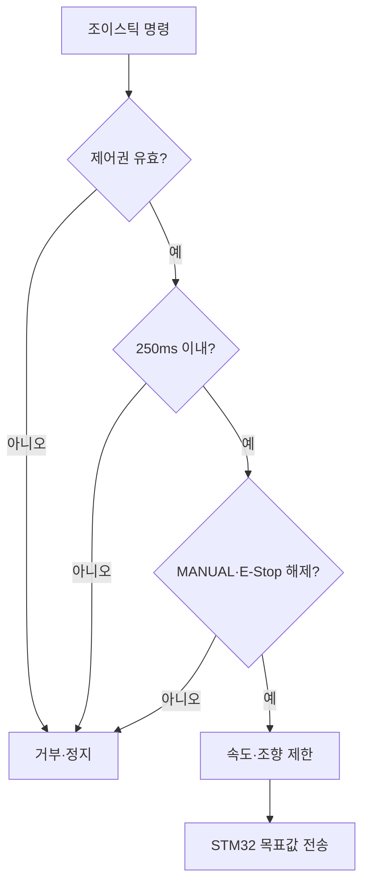

---

## 31-10. 재연결, 중복, Outbox 정책

### 메시지별 처리

| 데이터 | 단절 중 처리 | 복구 후 처리 |
|---|---|---|
| 주행 명령 | 저장하지 않고 즉시 폐기 | STOP·IDLE에서 새 명령 대기 |
| 일반 telemetry | 최신값 중심, 긴 backlog 금지 | 최신 상태부터 재개 |
| Mission 이벤트 | SQLite Outbox에 저장 | `messageId` 유지 후 재전송 |
| 탐지·encounter·보고 | SQLite Outbox에 저장 | ACK까지 재시도 |
| 이벤트 영상 | 로컬 파일과 업로드 작업 저장 | Presigned URL 재발급 후 업로드 |

### 중복 처리

MQTT QoS 1은 같은 메시지가 중복 전달될 수 있으므로 서버는 다음 규칙을 적용한다.

```text
events.message_id UNIQUE
detections.id UNIQUE
encounters.id UNIQUE
media_assets.id UNIQUE
control_commands.command_id UNIQUE
```

동일 ID가 다시 도착하면 새 행을 만들지 않고 기존 처리 결과를 ACK한다.

### 재연결 지수 백오프

```text
1초 → 2초 → 4초 → 8초 → 최대 30초
```

재연결에 성공하면 다음 순서로 복구한다.

1. `presence=ONLINE` 발행
2. 현재 `state` 발행
3. 서버와 활성 임무 ID 비교
4. 중요 Outbox 이벤트 재전송
5. 이벤트 영상 업로드 재개
6. 실시간 telemetry 재개

재연결만으로 자율주행이나 수동주행을 자동 재개하지 않는다. 관제자가 상태를 확인한 뒤 명시적으로 재개해야 한다.

---

## 31-11. 보안과 포트

| 포트 | 용도 | 공개 범위 |
|---:|---|---|
| `443` | Next.js, REST HTTPS, STOMP WSS | 관제 PC 접근 허용 |
| `8883` | MQTT over TLS | Jetson 및 서버 인증 클라이언트 |
| `5432` | PostgreSQL | 외부 공개 금지 |
| WebRTC 포트 | Jetson 직접 영상 | 32장에서 시연망 기준 확정 |

### 최소 보안 요구

- MQTT 평문 `1883`을 인터넷에 공개하지 않는다.
- Mosquitto는 익명 접속을 차단하고 차량별 계정과 ACL을 적용한다.
- Jetson 계정은 자신의 `telemetry/state/events/acks`만 발행하고 자신의 `cmd/*`만 구독할 수 있다.
- Spring Boot 서비스 계정만 모든 차량 토픽에 접근한다.
- REST와 WebSocket은 HTTPS/WSS만 사용한다.
- EC2 환경 변수와 Secret 파일에 비밀번호를 저장하고 Git에 올리지 않는다.
- 운영자 로그인은 구현하되(회원가입 제외), 인터넷 구간의 조종 API는 허용 IP·짧은 배포 환경 토큰·Control Lease로 추가 제한한다.
- Presigned URL은 짧은 시간만 유효하게 발급하고 `object_key`와 파일 종류를 서버가 결정한다.

---

## 31-12. 구현 모듈 구조

```text
jetson/
├─ ros2_ws/src/cloud_bridge/
│  ├─ cloud_bridge_node.py
│  ├─ mqtt_client.py
│  ├─ message_mapper.py
│  ├─ outbox_repository.py
│  └─ schemas/
├─ media_uploader/
│  ├─ upload_client.py
│  └─ upload_worker.py
└─ config/
   └─ communication.yaml

backend/
└─ src/main/java/.../
   ├─ mqtt/
   │  ├─ MqttGateway.java
   │  ├─ RobotMessageHandler.java
   │  └─ TopicPolicy.java
   ├─ websocket/
   │  ├─ WebSocketConfig.java
   │  └─ ControlMessageController.java
   ├─ control/
   │  ├─ ControlLeaseService.java
   │  └─ CommandService.java
   ├─ mission/
   ├─ telemetry/
   ├─ encounter/
   └─ media/

common/
├─ schemas/
│  ├─ envelope.schema.json
│  ├─ telemetry.schema.json
│  ├─ command.schema.json
│  └─ encounter.schema.json
└─ docs/
   └─ protocol.md
```

Python과 Java가 같은 JSON 계약을 사용하도록 `common/schemas`에 JSON Schema를 두고 CI에서 예제 메시지를 검증한다.

---

## 31-13. 구현 및 검증 순서

### 1단계 - MQTT 연결

1. EC2 Mosquitto TLS·계정·ACL 설정
2. Jetson `presence`, `state`, `telemetry` 발행
3. Spring Boot 구독 및 DB 저장
4. Wi-Fi 차단 후 LWT와 자동 재연결 확인

### 2단계 - 명령과 ACK

1. Mission·Mode·Stop 명령 구현
2. `commandId` 중복 방지 구현
3. 명령 만료와 잘못된 상태 거부 확인
4. Jetson·STM32 300ms watchdog 시험

### 3단계 - 관제 WebSocket

1. MQTT 수신 상태를 STOMP로 브라우저에 전달
2. 지도·배터리·센서 실시간 표시
3. Control Lease와 단일 조종자 제한
4. 조이스틱 20Hz·창 종료·연결 끊김 정지 시험

### 4단계 - 이벤트와 영상

1. 다중 인원 `encounter` 이벤트 전송
2. SQLite Outbox 재전송
3. S3 Presigned PUT 업로드
4. 과거 이력에서 썸네일·이벤트 영상 재생

### 필수 통합 시험

| 시험 | 기대 결과 |
|---|---|
| MQTT 차단 | 300ms 내 모터 정지, 관제 OFFLINE 표시 |
| QoS 1 이벤트 중복 전송 | DB에는 한 번만 저장 |
| 오래된 `cmd/drive` 재전송 | Jetson이 `EXPIRED`로 거부 |
| 관제 브라우저 2개 접속 | 한 명만 Control Lease 획득 |
| 브라우저 강제 종료 | Lease 만료 및 STOP |
| EC2 연결 중 영상 이벤트 발생 | 로컬 보관 후 복구 시 업로드 |
| 한 화면에 사람 3명 | encounter 1개, 피해자 후보 3명, 영상 1개 생성 |

---

## 31-14. 범위 우선순위

### 필수

- MQTT TLS 연결과 자동 재연결
- `presence`, `state`, `telemetry`, `events`, `cmd/mission`, `cmd/stop`, `acks`
- 메시지 UUID 기반 중복 방지
- Jetson·STM32 300ms watchdog
- REST 임무·이력 조회
- STOMP 실시간 상태 표시
- 이벤트 영상 Presigned PUT 업로드

### 선택

- 웹 조이스틱과 Control Lease
- MQTT 5 Message Expiry 보조 적용
- telemetry 단절 구간 배치 복원
- 개인별 음성 응답 연결

### 확장

- 차량별 X.509 클라이언트 인증서
- 다중 차량 관제
- 별도 외부 STOMP Broker
- VPN 기반 사설 차량망

---

## 31장 최종 확정안

> Sentinel UGV는 Jetson과 EC2 사이의 실시간 상태·이벤트·명령에 MQTT 5 over TLS를 사용하고, 임무 이력 및 미디어 업로드 절차에는 HTTPS REST를 사용한다. 관제 웹은 Spring Boot와 STOMP over WSS로 실시간 상태와 명령 결과를 교환하며, 실시간 영상은 메시지 서버를 거치지 않고 Jetson에서 브라우저로 WebRTC 전송한다. 고주기 수동 주행 명령은 QoS 0과 250ms TTL을 사용하고, 정지·E-Stop·임무 명령 및 중요 이벤트는 QoS 1과 UUID 기반 멱등 처리를 적용한다. 네트워크 단절 시 Jetson과 STM32의 300ms watchdog이 차량을 정지시키며, 중요 이벤트와 이벤트 영상은 Jetson의 SQLite Outbox 및 로컬 저장소에 보관한 뒤 연결 복구 후 재전송한다.

---

## 기술 참고

- OASIS MQTT 5.0: https://docs.oasis-open.org/mqtt/mqtt/v5.0/mqtt-v5.0.html
- Eclipse Paho Python Client: https://eclipse.dev/paho/files/paho.mqtt.python/html/
- Spring Framework STOMP over WebSocket: https://docs.spring.io/spring-framework/reference/web/websocket/stomp.html
- Amazon S3 Presigned Upload: https://docs.aws.amazon.com/AmazonS3/latest/userguide/PresignedUrlUploadObject.html
# 32. 영상 스트리밍·3초 링 버퍼·이벤트 녹화 설계

## 32-1. 목표와 추천 결론

Sentinel의 카메라 영상은 Jetson에서 한 번만 열고, 디코딩한 프레임을 AI·관제·녹화로 분기한다. 관제 영상은 MediaMTX가 WebRTC로 브라우저에 제공하고, 이벤트 녹화는 1초 단위 H.264 조각을 순환 보관하는 방식으로 구현한다.

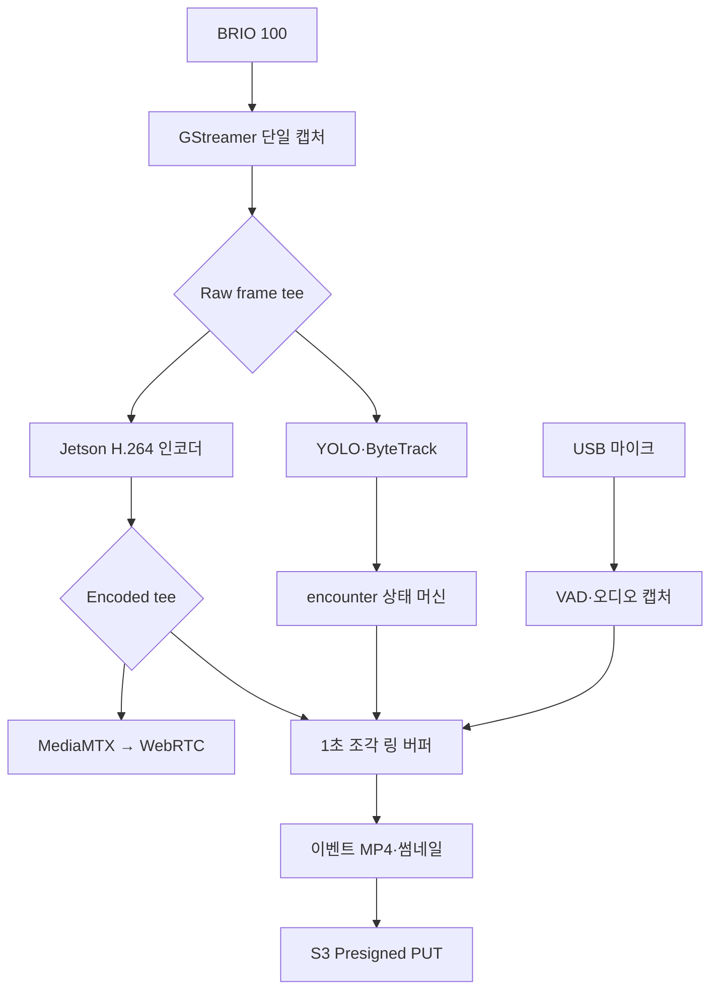

초기 운영값은 다음과 같다.

| 항목 | 초기값 | 조정 기준 |
|---|---:|---|
| 카메라 출력 | 1280×720, 15 FPS | BRIO 100의 실제 V4L2 포맷과 Jetson 부하 |
| 관제 영상 코덱 | H.264 | 브라우저·MediaMTX 호환성 |
| 목표 비트레이트 | 2.5 Mbps | 화질·Wi-Fi 사용량·지연 측정 |
| IDR 간격 | 최대 1초 | 이벤트 시작점과 복구 속도 |
| 링 버퍼 조각 | 1초 | 3초 사전 영상 보장 |
| 보관 조각 수 | 최소 8개 | 복사 지연과 디스크 쓰기 여유 |
| 사전·사후 구간 | 각 3초 | 최신 확정 정책 |
| 이벤트 최대 길이 | 5분 | 종료 신호 누락 보호 |
| 로컬 WebRTC 목표 | 중앙값 350ms 이하, P95 500ms 이하 | 동일 Wi-Fi 30회 측정 |

해상도와 비트레이트는 설계 목표이지 카메라 검증 전 확정 사양이 아니다. 첫 실물 시험에서 `v4l2-ctl --list-formats-ext` 결과를 기준으로 설정 파일을 고정한다.

---

## 32-2. 이벤트 녹화 방식 선택 이유

- 피해자 발견 전후의 근거 영상이 핵심이며 일반 주행 전체 영상은 우선순위가 낮다.
- 이벤트 단위 파일은 과거 이력에서 즉시 조회하기 쉽다.
- Jetson 디스크, S3 업로드량, 저장 비용을 줄일 수 있다.
- 탐지 이전 3초를 명시적으로 보장할 수 있다.
- 여러 사람이 동시에 보여도 같은 장면을 한 파일로 관리할 수 있다.

링 버퍼와 이벤트 종료 상태를 별도로 구현해야 하고 오탐도 영상 파일을 만들 수 있다. 단일 탐지 프레임이 아니라 1초간 반복 탐지로 이벤트를 확정하고, 오탐 판정 파일은 관제자가 삭제할 수 있게 하여 보완한다.

---

## 32-3. 카메라 단일 오픈 원칙

카메라를 OpenCV, YOLO 프로세스, MediaMTX가 각각 열지 않는다. `camera_pipeline`만 `/dev/video*`를 열고 다음 두 단계로 분기한다.

```text
BRIO 100
→ V4L2 입력
→ MJPEG 또는 YUYV 디코딩
→ Raw frame tee
   ├─ AI branch: 축소·색공간 변환 → appsink/ROS2 image
   └─ Media branch: NVMM 변환 → H.264 HW 인코딩
                       ├─ MediaMTX 발행
                       └─ 이벤트 링 버퍼
```

이 방식의 장점은 다음과 같다.

- USB 카메라 장치 점유 충돌을 막는다.
- AI·스트리밍·녹화의 프레임 시간이 같은 기준을 사용한다.
- H.264 인코딩을 한 번만 수행하여 Jetson 부하를 줄인다.
- 느린 AI나 네트워크가 카메라 캡처를 막지 않도록 각 분기에 독립 `queue`를 둘 수 있다.

각 분기의 큐 정책은 다음과 같다.

| 분기 | 큐 정책 | 이유 |
|---|---|---|
| AI | 최신 프레임 우선, 가득 차면 오래된 프레임 폐기 | 실시간 인식에 과거 프레임은 가치가 낮음 |
| WebRTC | 짧은 큐, 지연 증가 시 프레임 폐기 | 수동 관제는 최신 영상이 중요 |
| 이벤트 녹화 | 프레임 폐기 금지, 디스크 오류 시 이벤트 경고 | 증빙 영상 연속성 우선 |

파이프라인의 개념적 구성은 다음과 같다. 실제 플러그인 이름과 메모리 변환은 JetPack 버전에서 검증한 뒤 고정한다.

```text
v4l2src
→ decode/convert
→ tee
  ├→ queue(leaky=downstream) → AI appsink
  └→ queue → nvvideoconvert → nvv4l2h264enc
           → h264parse → tee
             ├→ MediaMTX publisher
             └→ ring segment writer
```

카메라 입력이 끊기면 파이프라인을 무한 재시작하지 않는다. 1초, 2초, 4초, 최대 10초 간격으로 3회 재시도한 뒤 `CAMERA_FAULT`를 발생시키고 자율 탐사를 `PAUSED`로 전환한다.

---

## 32-4. MediaMTX와 로컬 WebRTC

MediaMTX는 Jetson에서 실행하며 GStreamer가 발행한 H.264 스트림을 브라우저용 WebRTC로 변환한다. AI 처리나 영상 파일 생성 책임은 MediaMTX에 두지 않는다.

```text
GStreamer publisher
→ Jetson MediaMTX
→ WHEP/WebRTC signaling
→ ICE 연결
→ 동일 Wi-Fi 관제 브라우저
```

### 네트워크 원칙

- 시연 기본 경로는 Jetson과 관제 PC 사이의 LAN 직접 연결이다.
- LAN 시연에서는 호스트 ICE candidate를 우선하고 STUN/TURN 의존성을 제거한다.
- EC2에서 HTTPS로 열린 관제 페이지가 Jetson의 평문 HTTP 신호 주소에 접근하면 혼합 콘텐츠로 차단될 수 있다.
- 따라서 Jetson WHEP 엔드포인트도 HTTPS를 적용하고 관제 노트북이 신뢰하는 로컬 인증서를 설치한다.
- `sentinel.local` 또는 고정 DHCP 주소를 사용하고, 시연 전 실제 접속 주소를 환경변수로 고정한다.
- 외부 인터넷 관제는 선택 기능이며, 필요할 때 EC2 MediaMTX 릴레이와 STUN/TURN을 별도 구성한다.

관제 프론트는 다음 상태를 표시한다.

```text
CONNECTING → LIVE → DEGRADED → RECONNECTING → OFFLINE
```

`DEGRADED` 조건은 최근 5초 평균 지연 증가, 3초 이상 영상 정지, 연속 프레임 손실 등으로 판단한다. 영상이 1초 이상 갱신되지 않으면 수동 조작 화면에 노란 경고, 3초 이상이면 빨간 경고를 표시하고 새로운 수동 전진 명령을 차단한다. 이미 전송된 주행 명령은 Jetson의 300ms TTL로 정지한다.

### 로컬·원격 전환

| 모드 | 경로 | MVP 여부 | 실패 시 |
|---|---|---|---|
| `LOCAL` | Jetson → 브라우저 WebRTC | 필수 | 영상 경고 후 재연결 |
| `REMOTE` | Jetson → EC2 MediaMTX → 브라우저 | 선택 | 로컬 경로 안내 |
| `AUTO` | 로컬 우선, 실패 시 원격 | 확장 | 사용자가 명시적으로 경로 선택 |

자동 전환은 지연이 갑자기 달라져 수동 조작 판단을 흐릴 수 있으므로 MVP에서는 자동으로 바꾸지 않고 운영자가 선택한다.

---

## 32-5. 3초 링 버퍼 구현

### 저장 방식

인코딩된 H.264를 1초 단위 MPEG-TS 조각으로 지속 기록하고 최근 8개 이상을 순환 보관한다. MPEG-TS는 조각 단위 복구가 쉽고, 이벤트 종료 후 MP4로 재다중화할 수 있다.

```text
buffer/
├─ seg_000120.ts
├─ seg_000121.ts
├─ seg_000122.ts
├─ seg_000123.ts
└─ index.json
```

각 조각 메타데이터는 다음 값을 가진다.

```json
{
  "segmentId": 123,
  "startedAt": "2026-07-22T07:30:11.000Z",
  "endedAt": "2026-07-22T07:30:12.000Z",
  "durationMs": 1000,
  "firstPts": 88412000000,
  "firstFrameKey": true,
  "path": "buffer/seg_000123.ts"
}
```

인코더는 적어도 1초마다 IDR 프레임을 생성한다. 조각 시작점이 키프레임이 아니면 이벤트 첫 화면이 깨지거나 재생 시작이 늦어질 수 있기 때문이다.

### 이벤트 시작

사람이 확정되면 `recording_manager`가 다음 작업을 수행한다.

1. `encounterId`와 `mediaId`를 생성한다.
2. 탐지 확정 시각 직전 3초를 포함하는 완료 조각을 조회한다.
3. 해당 조각을 이벤트 작업 디렉터리에 hard link 또는 원자적 복사한다.
4. 현재 작성 중인 조각이 닫히면 같은 이벤트에 포함한다.
5. 이후 생성되는 조각을 `INTERACTION` 종료까지 계속 연결한다.
6. 상호작용 종료 후 3초가 지나면 조각 수집을 닫는다.

동시에 발생한 사람들은 하나의 `encounter`를 사용하므로 같은 영상 조각을 중복 복사하지 않는다.

### 이벤트 종료와 MP4 생성

```text
POST_RECORDING 완료
→ 조각 목록 시각·PTS 순서 검증
→ 누락 조각 검사
→ H.264/AAC 재다중화
→ event.partial.mp4 생성
→ 재생 검사
→ SHA-256 계산
→ event.mp4 원자적 rename
→ thumbnail.jpg 생성
→ UPLOAD_PENDING 등록
```

임시 파일은 `.partial` 확장자를 사용하고 MP4 마무리와 검사에 성공한 후에만 최종 이름으로 바꾼다. 전원 차단 후 부팅하면 `.partial`과 조각 목록을 검사하여 복구하거나 `CORRUPT`로 표시한다.

### 녹화 상태

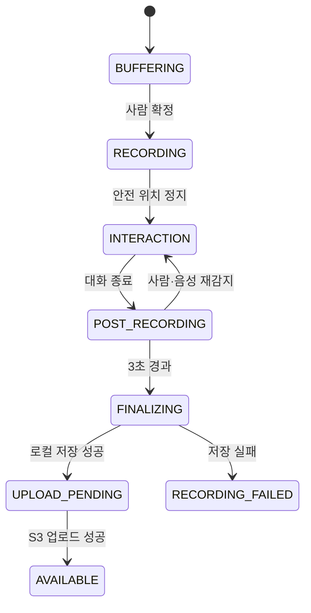

### 종료 예외

- 음성 응답이나 사람 재탐지가 사후 3초 안에 발생하면 `INTERACTION`으로 되돌린다.
- 30초 동안 상호작용 상태 변화가 없으면 `NO_RESPONSE_TIMEOUT`으로 종료한다.
- 이벤트가 5분을 넘으면 현재 MP4를 닫고 `MAX_DURATION`으로 종료한다.
- 디스크 여유가 임계값 아래면 새 이벤트 시작을 차단하지 않고, 오래된 업로드 완료 파일부터 삭제해 공간을 확보한다.
- 공간 확보가 실패하면 썸네일과 JSON 보고서는 남기되 영상 상태를 `RECORDING_FAILED_DISK_FULL`로 기록한다.

---

## 32-6. 음성·다중 인원 이벤트 연동

이벤트 영상은 `encounter` 하나에 연결한다. 사람별 YOLO 바운딩 박스, `trackId`, 지도 위치, 음성 보고서는 같은 타임라인을 공유한다.

```text
encounter
├─ victims 1..N
├─ detections 1..N
├─ interaction session 0..1
├─ media event.mp4 1개
└─ thumbnail 1개 이상
```

마이크 음성을 이벤트 MP4에 포함할 때는 카메라와 마이크의 monotonic timestamp를 기준으로 동기화한다. STT용 음성은 별도 WAV 조각으로 임시 저장할 수 있지만 S3 장기 보관은 기본적으로 이벤트 MP4와 구조화된 보고서만 사용한다. 원본 WAV 보관 여부는 36장의 개인정보 정책을 따른다.

개인별 발화자를 확실히 구분할 수 없으므로 영상의 오디오 트랙을 특정 `victim_id`에 자동 귀속하지 않는다. 대화 결과에는 `responseScope=GROUP`을 기록한다.

---

## 32-7. 구현 모듈과 설정

```text
jetson/media/
├─ camera_pipeline/
│  ├─ pipeline_builder.py
│  ├─ frame_publisher.py
│  └─ health_monitor.py
├─ streaming/
│  ├─ mediamtx.yml
│  └─ stream_supervisor.py
├─ recording/
│  ├─ ring_writer.py
│  ├─ recording_manager.py
│  ├─ segment_index.py
│  ├─ finalizer.py
│  └─ recovery.py
└─ config/
   └─ media.yaml
```

`media.yaml` 관리 항목:

```yaml
camera:
  device: /dev/video0
  width: 1280
  height: 720
  fps: 15
encoder:
  codec: h264
  bitrate_kbps: 2500
  keyframe_interval_frames: 15
recording:
  segment_seconds: 1
  ring_seconds: 8
  pre_seconds: 3
  post_seconds: 3
  max_event_seconds: 300
  pending_directory: /var/lib/sentinel/media/pending
streaming:
  path: sentinel
  local_whep_url: https://sentinel.local:8889/sentinel/whep
```

장치 경로는 `/dev/video0` 숫자에만 의존하지 않고 udev 규칙으로 고정 별칭을 만드는 것을 권장한다.

---

## 32-8. 장애 처리와 축소안

| 장애 | 즉시 동작 | 복구·대체 |
|---|---|---|
| 카메라 분리 | 자율 탐사 일시정지, `CAMERA_FAULT` | 장치 재탐색 3회 후 운영자 확인 |
| AI branch 지연 | 오래된 AI 프레임 폐기 | 입력 해상도·추론 FPS 감소 |
| WebRTC 실패 | 주행 영상 경고, 수동 전진 차단 | MediaMTX 재시작, 로컬 주소 재확인 |
| 녹화 branch 지연 | 이벤트 오류 기록 | 스트리밍 비트레이트 우선 감소 |
| 디스크 부족 | 업로드 완료 캐시 삭제 | 영상 실패 상태와 썸네일·보고 유지 |
| S3 장애 | 로컬 `UPLOAD_PENDING` 유지 | 백오프로 재업로드 |
| MP4 마무리 실패 | 원본 TS 조각 보존 | 재부팅 후 재다중화 |
| HW 인코더 실패 | 720p 10 FPS 소프트웨어 인코더 시험 | 부하 초과 시 녹화 우선·스트림 축소 |

기능 축소 순서는 `원격 중계 → 오버레이 합성 → 해상도/FPS → 라이브 오디오` 순서다. 사람 탐지와 이벤트 원본 저장은 가능한 한 유지한다.

---

## 32-9. 검증 항목과 합격 기준

| ID | 시험 | 합격 기준 |
|---|---|---|
| VID-01 | 동일 Wi-Fi WebRTC 지연 30회 | 중앙값 ≤350ms, P95 ≤500ms |
| VID-02 | 30분 연속 스트리밍 | 비정상 종료 없음, 영상 정지 3초 초과 0회 |
| VID-03 | 사람 탐지 이벤트 | 탐지 확정 전 영상 3초 이상 포함, 허용오차 -0/+1초 |
| VID-04 | 60초 상호작용 | 접근·대화·종료 후 3초가 한 파일에 재생됨 |
| VID-05 | 한 화면 사람 3명 | `encounter` 1개·이벤트 MP4 1개 생성 |
| VID-06 | Wi-Fi 60초 차단 | 로컬 파일 보존, 복구 후 중복 없이 S3 업로드 |
| VID-07 | 녹화 중 프로세스 강제 종료 | 재시작 후 조각 복구 또는 명시적 `CORRUPT` 판정 |
| VID-08 | AI 처리 인위 지연 | 관제 영상과 카메라 캡처가 멈추지 않음 |
| VID-09 | 디스크 임계값 주입 | 업로드 완료 캐시 정리 후 신규 이벤트 처리 또는 명확한 실패 상태 |
| VID-10 | 관제 영상 3초 정지 | 신규 수동 전진 명령 차단, 기존 명령은 300ms TTL로 정지 |

측정 증빙은 타임코드가 보이는 원본 촬영, GStreamer 로그, 이벤트 메타데이터, S3 객체 목록으로 남긴다.

---

## 32장 최종 확정안

> BRIO 100은 Jetson의 GStreamer 파이프라인이 한 번만 열고, 원본 프레임을 YOLO와 H.264 하드웨어 인코딩 분기로 전달한다. H.264 영상은 MediaMTX를 통해 동일 Wi-Fi 브라우저에 WebRTC로 제공하며, 동시에 1초 조각의 순환 버퍼에 최소 8초를 유지한다. 사람 탐지가 확정되면 직전 3초부터 접근·음성 상호작용·종료 후 3초까지를 하나의 encounter 영상으로 묶어 MP4와 썸네일을 생성하고, 로컬 보존 후 S3에 직접 업로드한다.

---

# 33. 피해자 음성 상호작용 설계

## 33-1. 범위와 추천 결론

피해자 음성 기능은 사용자가 확정한 **STT → LLM → TTS** 파이프라인으로 구현한다. LLM은 자유롭게 주행을 명령하거나 의료 판단을 내리지 않고, 피해자 응답을 정해진 구조로 정리하고 다음 질문·안내 문장을 생성하는 제한된 대화 계층으로 사용한다.

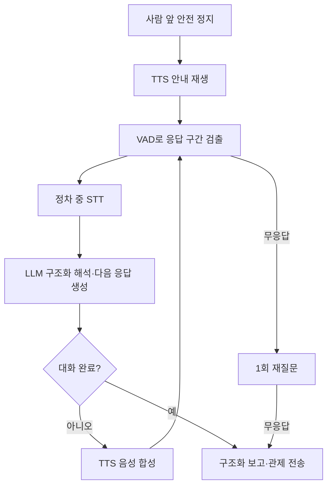

추천 구현은 다음과 같다.

- 음성 활동 감지(VAD)는 로컬에서 수행한다.
- STT는 로봇이 정지한 상호작용 구간에만 실행한다.
- STT 텍스트는 LLM에 전달하고, LLM은 사전에 정의한 JSON 스키마 안에서 응답 상태·이동 가능 여부·긴급 키워드·다음 질문을 반환한다.
- LLM이 만든 안내 문장은 TTS로 합성해 스피커로 전달한다.
- STT·LLM·TTS를 Jetson과 EC2 중 어디에서 실행할지는 확정하지 않는다. Jetson 8GB 부하, 응답 지연, 네트워크 단절 시험 후 배치한다.
- STT 실패가 사람의 무응답을 의미하지 않도록 `음성 감지 여부`와 `문장 해석 성공 여부`를 분리한다.
- 다중 인원은 그룹 단위로 질문하고 개별 화자 자동 식별을 하지 않는다.

이 기능은 의료 진단이나 구조 우선순위 판정을 자동 수행하지 않는다. 현장 응답을 관제자에게 전달하는 보조 수단으로 제한한다.

---

## 33-2. 하드웨어와 오디오 경로

필요 하드웨어:

- Jetson 호환 USB 마이크 1개
- 별도 전원 또는 USB 오디오 기반 스피커 1개
- 스피커 출력이 마이크로 재입력되는 것을 줄일 수 있는 물리적 거리와 방향 배치

```text
USB 마이크
→ ALSA 입력
→ high-pass/noise gate
→ VAD
→ 응답 WAV 임시 파일
→ STT
→ 제한된 LLM 구조화 해석
→ 다음 질문·안내 문장
→ TTS
→ ALSA 출력
→ 스피커

LLM 또는 네트워크 실패
→ 사전 정의 질문·키워드 파서 fallback
```

MVP에서는 반이중 방식으로 운용한다. 질문을 재생하는 동안 STT 입력을 열지 않고, 재생 종료 후 300ms 뒤부터 응답을 듣는다. 이는 완전한 에코 제거보다 구현이 단순하고 시연 안정성이 높다.

오디오 기준값:

| 항목 | 초기값 |
|---|---:|
| 샘플레이트 | 16kHz |
| 채널 | mono |
| PCM 형식 | signed 16-bit |
| 질문 후 대기 | 최대 8초 |
| 재질문 | 질문당 최대 1회 |
| 발화 종료 판단 | 1.0초 무음 |
| 전체 상호작용 목표 | 60초 이내 |
| 강제 종료 | 5분 이벤트 제한과 연동 |

---

## 33-3. 대화 상태 머신

### 질문 순서

| 단계 | 안내 문구 예시 | 저장 필드 | 실패 시 |
|---|---|---|---|
| `INTRO` | “탐사 로봇입니다. 대답할 수 있는 분은 말씀해 주세요.” | `anyResponseDetected` | 1회 반복 후 무응답 표시 |
| `COUNT` | “현재 응답 가능한 인원 수를 숫자로 말씀해 주세요.” | `reportedResponsiveCount` | `UNKNOWN` |
| `MOBILITY` | “스스로 이동할 수 있습니까? 예 또는 아니오로 답해 주세요.” | `mobilityStatus` | `UNKNOWN` |
| `URGENT` | “심한 출혈이나 호흡 곤란이 있습니까?” | `urgentConditionReported` | `UNKNOWN` |
| `CLOSING` | “정보를 관제실에 전달했습니다. 구조 요청을 기다려 주세요.” | 종료 시각 | 항상 재생 시도 |

질문 순서는 안전한 최소 정보 수집을 위한 기본 흐름이다. LLM은 문장을 자연스럽게 이어 주되 질문 목적과 출력 필드를 바꾸지 않는다. 부상 정도를 자동 진단하지 않으며, 긴급 표현은 화면에 우선 경고만 표시한다.

### 상태

```text
NOT_STARTED
→ PROMPTING
→ LISTENING
→ TRANSCRIBING
→ LLM_INTERPRETING
→ TTS_RESPONDING 또는 RETRYING
→ COMPLETED

어느 상태에서든
→ ABORTED_MANUAL / ABORTED_SAFETY / FAILED_AUDIO
```

### 무응답과 실패 구분

| VAD | STT | 판정 |
|---|---|---|
| 음성 없음 | 실행 안 함 | `NO_VOICE_DETECTED` |
| 음성 있음 | 텍스트 없음 | `VOICE_DETECTED_STT_FAILED` |
| 음성 있음 | 텍스트 있으나 LLM/파서 해석 실패 | `RESPONSE_UNRECOGNIZED` |
| 음성 있음 | LLM schema 검증 성공 | `ANSWER_STRUCTURED` |

`VOICE_DETECTED_STT_FAILED`를 무의식 또는 무응답으로 기록하면 안 된다. 관제 화면에는 음성 파형·재생 버튼과 함께 확인 필요 상태로 표시한다.

---

## 33-4. 다중 인원 처리

일반 USB 마이크 한 개로는 누가 말했는지 신뢰성 있게 구분하기 어렵다. 따라서 다음 원칙을 적용한다.

- `responseScope=GROUP`으로 저장한다.
- 동시에 보이는 사람 수는 YOLO·ByteTrack 결과로 기록한다.
- 응답 가능한 인원 수는 발화자가 말한 숫자를 `reportedResponsiveCount`로 별도 저장한다.
- 숫자 인식 신뢰도가 낮거나 인원 수보다 큰 값이면 `OPERATOR_REVIEW_REQUIRED`로 표시한다.
- 특정 피해자의 `mobilityStatus`나 부상 상태로 자동 귀속하지 않는다.
- 개인별 정보가 필요하면 관제자가 바운딩 박스를 선택하고 순차 질문하는 기능을 확장한다.

따라서 `responsivePersonCount`는 확정값이 아니라 다음 중 하나로 관리한다.

```text
CONFIRMED_BY_OPERATOR
SELF_REPORTED_GROUP_COUNT
UNKNOWN
```

---

## 33-5. STT·LLM·TTS 정책

STT 입력은 짧은 발화 단위로 처리한다. LLM은 다음 스키마 외의 행동을 출력하지 않으며, 주행 명령·의료 진단·구조 우선순위 결정을 생성할 수 없다.

```text
responseStatus: RESPONSIVE | NO_RESPONSE | UNCERTAIN
reportedResponsiveCount: integer | null
mobilityStatus: YES | NO | UNKNOWN
urgentKeywords: string[]
operatorReviewRequired: boolean
nextPrompt: string
conversationDone: boolean
```

JSON 스키마 검증 실패, 충돌하는 응답, 낮은 STT 신뢰도, LLM timeout은 자동 확정하지 않는다. 원문 텍스트와 오디오 구간을 관제자에게 보여주고 `REVIEW_REQUIRED`로 둔다. LLM을 사용할 수 없을 때는 예·아니오·숫자·긴급어 키워드 파서를 fallback으로 사용한다.

Jetson 자원 경쟁을 줄이기 위해 상호작용 중 다음 정책을 적용한다.

- 차량은 정지 상태를 유지한다.
- SLAM과 장애물 감지는 유지한다.
- YOLO는 그룹 이탈 감시를 위해 5 FPS 수준으로 낮출 수 있다.
- STT·LLM·TTS는 발화 단위로 실행하고 계속 스트리밍 추론하지 않는다.
- CUDA 메모리 부족 시 음성 AI를 축소하거나 서버 방식으로 전환하고, 영상·주행 안전 기능을 우선한다.
- LLM 응답은 반드시 JSON schema 검증과 금지 행동 검사를 통과한 뒤 TTS에 전달한다.
- TTS 문장 길이와 상호작용 총 시간을 제한한다.

---

## 33-6. 데이터 구조

### `interaction_sessions`

```text
interaction_id           UUID PK
encounter_id             UUID FK UNIQUE
status                   VARCHAR
response_scope           VARCHAR DEFAULT 'GROUP'
any_response_detected    BOOLEAN
reported_responsive_count INTEGER NULL
count_confidence         REAL NULL
mobility_status          VARCHAR
urgent_condition_reported VARCHAR
operator_review_required BOOLEAN
started_at               TIMESTAMPTZ
ended_at                 TIMESTAMPTZ
termination_reason       VARCHAR
summary                  TEXT
```

### `interaction_turns`

```text
turn_id                   UUID PK
interaction_id            UUID FK
turn_index                INTEGER
question_code             VARCHAR
prompt_started_at         TIMESTAMPTZ
listening_started_at      TIMESTAMPTZ
voice_detected             BOOLEAN
transcript                TEXT NULL
stt_confidence            REAL NULL
llm_model_version         VARCHAR NULL
llm_schema_valid          BOOLEAN
parsed_value              VARCHAR NULL
parse_status              VARCHAR
tts_text                  TEXT NULL
retry_count               INTEGER
audio_media_id            UUID NULL
```

보고 메시지 예시:

```json
{
  "encounterId": "8b7b90dc-c0fb-4e57-9359-c30fb0528d75",
  "interactionId": "6a92cc77-588c-49ce-9d28-80f5e621a857",
  "responseScope": "GROUP",
  "detectedPersonCount": 3,
  "anyResponseDetected": true,
  "reportedResponsiveCount": 2,
  "reportedCountStatus": "SELF_REPORTED_GROUP_COUNT",
  "mobilityStatus": "NO",
  "urgentConditionReported": "UNKNOWN",
  "operatorReviewRequired": true,
  "terminationReason": "NORMAL"
}
```

---

## 33-7. 녹화·임무 상태 연동

```text
PERSON_CONFIRMED
→ 이벤트 RECORDING 시작
→ PERSON_APPROACHING
→ 안전 정지
→ INTERACTING + 음성 세션 시작
→ interaction COMPLETED/FAILED
→ POST_RECORDING 3초
→ REPORTING
→ 탐사 재개 또는 운영자 지시 대기
```

다음 조건에서는 탐사를 자동 재개하지 않는다.

- 긴급 상태가 보고됨
- 운영자 확인이 필요한데 관제 연결이 살아 있음
- 사람이 로봇의 진행 경로 안에 남아 있음
- LiDAR·카메라·구동 안전 오류가 발생함
- E-Stop이 활성화됨

일반 완료이며 안전 조건이 충족되면 `REPORTING` 이후 기존 Frontier 탐사를 재개한다.

---

## 33-8. 장애 처리와 축소안

| 장애 | 처리 |
|---|---|
| 마이크 미인식 | 음성 기능 비활성화, 영상·위치 보고와 관제자 수동 확인 |
| 스피커 실패 | 관제 화면 경고, 상호작용을 `FAILED_AUDIO_OUTPUT`으로 종료 |
| VAD 오탐 | 질문 중 입력 무시, 최소 발화 길이 적용 |
| STT 지연 | 5초 초과 시 `STT_TIMEOUT`, 원본 응답 보존 |
| STT 실패 | 음성 감지 사실만 보고, 관제자 재생 확인 |
| LLM 지연·schema 실패 | 키워드 파서와 사전 정의 질문으로 전환, `REVIEW_REQUIRED` |
| TTS 실패 | 사전 생성 비상 안내 음원 재생 또는 관제자 확인 요청 |
| 주변 소음 | 1회 재질문, 입력 gain·VAD 임계값 현장 프로파일 사용 |
| GPU 메모리 부족 | 음성 모델 축소·서버 배치 또는 키워드 fallback, 주행·영상 우선 |
| 네트워크 단절 | 로컬 배치 모델이 없으면 사전 질문·키워드 fallback, 보고서는 Outbox에 보관 |
| 사람이 화면에서 사라짐 | LiDAR 안전 확인 후 상호작용 종료, `PERSON_LOST` 기록 |

MVP 축소 순서는 `LLM 자연어 응답 축소 → 사전 정의 질문+키워드 파서 → VAD 기반 응답 유무만 유지`다. STT-LLM-TTS 정상 경로와 축소 경로를 모두 상태에 명시한다.

---

## 33-9. 검증 항목과 합격 기준

| ID | 시험 | 합격 기준 |
|---|---|---|
| VOI-01 | 사람 앞 정지 후 시작 | 2초 이내 첫 안내 재생 |
| VOI-02 | 조용한 환경 예/아니오 20회 | VAD 검출률 95% 이상, 파싱 정확도 90% 이상 |
| VOI-03 | 무응답 | 1회 재질문 후 `NO_VOICE_DETECTED`로 종료 |
| VOI-04 | 음성은 있으나 STT 실패 | 무응답으로 오분류하지 않고 `REVIEW_REQUIRED` 표시 |
| VOI-05 | 화면 내 3명 | `responseScope=GROUP`, 개인별 발화 자동 귀속 없음 |
| VOI-06 | Wi-Fi 차단 | 로컬 모델 또는 사전 질문 fallback으로 종료·보고서 Outbox 저장 |
| VOI-07 | 스피커 재생 중 마이크 입력 | 자기 질문을 피해자 응답으로 저장하지 않음 |
| VOI-08 | 상호작용 전체 | 이벤트 영상에 질문·응답·종료 후 3초 포함 |
| VOI-09 | 전체 소요 시간 | 정상 4단계 질문이 60초 이내 완료 |
| VOI-10 | LLM 비정형·금지 출력 | JSON schema에서 거부되고 주행·의료 판단으로 전달되지 않음 |

---

## 33장 최종 확정안

> 피해자 음성 상호작용은 정차 상태에서 VAD·STT로 발화를 받고, 제한된 LLM이 구조화 해석과 다음 안내를 생성하며, TTS가 스피커로 응답하는 흐름으로 구성한다. LLM 출력은 JSON schema와 금지 행동 검사를 통과해야 하며 주행 명령이나 의료 판단으로 연결하지 않는다. 실행 위치와 모델은 성능 시험 후 동결하고, 실패 시 사전 질문·키워드 파서로 축소한다. 결과는 encounter 이벤트 영상과 연결해 관제 서버에 전송한다.

---

# 34. STM32 저수준 주행 제어·안전 통신 설계

## 34-1. 최신 확정 구조

Sentinel의 최종 제어 구조는 **Jetson 고수준 판단 + STM32 저수준 실행**으로 분리한다. Raspberry Pi 5는 차량 제어 경로에 포함하지 않는다.

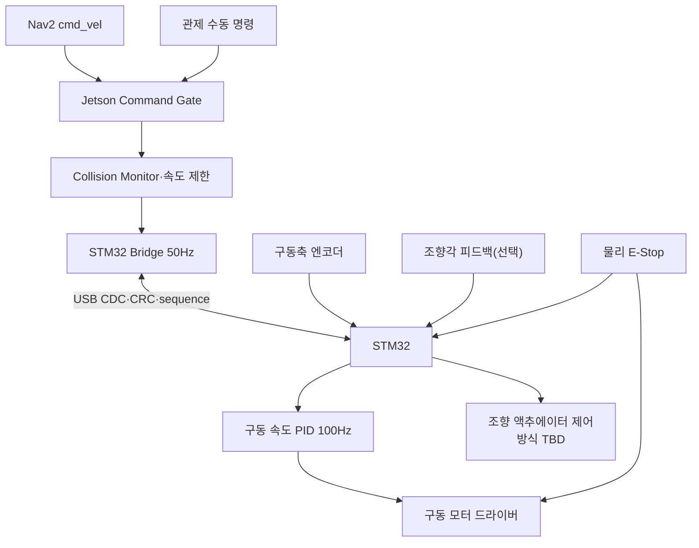

| 구성 요소 | 최종 책임 |
|---|---|
| Jetson | SLAM·Nav2·YOLO·임무 상태, 수동/AUTO 명령 선택, 장애물 안전 제한, 목표 `v/ω` 생성 |
| STM32 | 구동축 엔코더 계수, 구동 속도 폐루프, 조향 액추에이터 제어·한계, 브레이크, 통신 watchdog, 오류 시 출력 차단 |
| 모터 드라이버 | 모터 전력 구동, 과전류·과열 보호, enable/brake 입력 |
| 물리 E-Stop | 소프트웨어 상태와 무관하게 모터 전원 또는 드라이버 enable을 하드웨어로 차단 |

이 구조는 Linux 프로세스 지연과 CUDA·SLAM 부하가 모터 PWM 생성에 직접 영향을 주지 않게 한다. STM32가 경로를 계획하거나 AI 판단을 하지는 않으며, 유효한 목표 속도만 안전하게 실행한다.

---

## 34-2. 목표 차량 인터페이스와 운동학 확정 절차

관제와 Nav2 구간에서는 표준 Twist의 선속도 `v`와 각속도 `ω`를 사용한다. BMW M7의 전륜 조향 구조가 bicycle/Ackermann 방식으로 확인되면 Jetson의 차량 운동학 변환 계층에서 STM32용 **목표 구동 속도와 목표 조향각**으로 변환한다. 조향 액추에이터의 실제 신호가 PWM, 릴레이/모터 방향 제어, 별도 제어기 중 무엇인지는 분해 확인 후 결정한다.

| 구간 | 최종 표현 |
|---|---|
| 관제·ROS 2 | `linearVelocityMps`, `angularVelocityRadps` |
| Jetson → STM32 | `targetDriveSpeedMmps`, `targetSteeringAngleMdeg` |
| STM32 상태 | 엔코더 속도, 적용 구동 PWM, 목표/측정 조향각 또는 조향 상태, fault |
| 차량 기하 | 실물 확인 후 휠베이스 `L`, 조향각 `δ`, 최소 회전반경 `R_min` |

관제 명령은 정규화된 `linear`, `angular`를 보내고 Jetson이 차량 한계값으로 변환한다.

```json
{
  "linear": 0.35,
  "angular": -0.20,
  "deadman": true,
  "ttlMs": 250
}
```

STM32에는 물리 단위의 구동 속도와 조향각을 전달한다.

```text
δ = atan(L × ω / max(|v|, v_epsilon))
target_drive_speed = v
target_steering_angle = clamp(δ, δ_min, δ_max)
```

위 식은 전륜 조향 구조 확인 후 적용하는 기준식이다. `L`은 실측 휠베이스를 사용한다. `|v|`가 거의 0인데 `ω`만 존재하는 명령은 제자리 회전으로 보내지 않는다. Nav2가 실차에서 실행 가능한 곡률을 생성하도록 설정하고, 안전 변환 계층은 비현실적인 조향 요구를 제한하거나 정지시킨다.

---

## 34-3. Jetson 안전 명령 체인

최종 모터 명령은 다음 우선순위를 따른다.

```text
1. 물리 E-Stop
2. STM32 내부 FAULT / watchdog
3. Jetson 소프트웨어 E-Stop
4. Collision Monitor 정지
5. 센서·오도메트리 핵심 오류 정지
6. 수동 deadman·TTL 검사
7. AUTO/MANUAL 명령 선택
8. 속도·가속도 제한
9. STM32 구동 속도·조향각 목표 전송
```

Jetson의 ROS2 노드 흐름:

```text
/cmd_vel_nav ─┐
              ├→ command_mux_node
/cmd_vel_manual┘
→ velocity_smoother
→ collision_monitor
→ safety_gate_node
→ /cmd_vel_safe
→ stm32_bridge_node
```

비상 정지와 Collision Monitor의 정지 출력은 완만한 감속 설정보다 우선하여 즉시 0 속도와 브레이크 플래그를 전달한다.

### 명령 수락 조건

STM32 명령은 다음을 모두 만족해야 한다.

- 패킷 CRC가 유효하다.
- 프로토콜 버전과 길이가 일치한다.
- `sequence`가 최근 정상 명령보다 새롭다.
- E-Stop 입력이 해제되어 있다.
- 모터 드라이버 fault가 없다.
- 명령 속도가 설정된 물리 한계 안에 있다.
- Jetson과 STM32 handshake가 완료되었다.

조건을 벗어난 값은 그대로 실행하지 않고 포화 제한하거나 거부하며 오류 코드를 반환한다.

---

## 34-4. Jetson ↔ STM32 물리 연결

MVP의 1순위 연결은 **USB CDC 가상 시리얼**이다.

| 방식 | 장점 | 단점 | 판단 |
|---|---|---|---|
| USB CDC | 배선 단순, 장치 식별 쉬움, 노트북에서도 시험 가능 | USB 분리·재연결 처리 필요 | MVP 추천 |
| 3.3V UART | 지연과 구현이 단순 | 커넥터·GND·전압·포트 충돌 주의 | USB 문제 시 대안 |
| CAN | 노이즈와 오류 검출에 강함 | 트랜시버·구현 부담 | 향후 확장 |

USB 장치는 udev 규칙으로 `/dev/sentinel_mcu` 별칭을 만든다. USB 케이블에는 스트레인 릴리프를 적용하고 모터 전원선과 떨어뜨린다.

UART 대안을 사용할 때는 Jetson과 STM32 모두 **3.3V 논리 레벨**인지 확인하고 5V UART 신호를 Jetson 핀에 직접 연결하지 않는다. 전원 GND와 신호 기준 GND는 공통으로 연결하되, 모터 전류 경로가 신호 GND를 통과하지 않게 배선한다.

---

## 34-5. 직렬 프로토콜

직렬 스트림 경계를 안전하게 찾기 위해 COBS 프레이밍과 `0x00` 구분자를 사용하고, 프레임 전체에 CRC-16을 적용한다.

```text
[protocolVersion u8]
[messageType u8]
[sequence u16]
[payloadLength u16]
[senderUptimeMs u32]
[payload N bytes]
[crc16 u16]
→ COBS encode
→ 0x00 delimiter
```

- 바이트 순서: little-endian
- Baudrate: USB CDC는 가상값, UART 대안은 초기 921600bps
- 최대 payload: 128 bytes
- 잘못된 CRC·길이·버전 패킷은 실행하지 않음
- `senderUptimeMs`는 TTL 판단 보조와 재부팅 탐지에 사용
- 안전 정지는 통신 ACK를 기다리지 않고 로컬에서 실행

### 메시지 종류

| 코드 | 이름 | 방향 | 주기·조건 |
|---:|---|---|---|
| `0x01` | `HELLO` | Jetson → STM32 | 연결·재연결 시 |
| `0x02` | `HELLO_ACK` | STM32 → Jetson | 버전·장치 정보 응답 |
| `0x10` | `DRIVE_COMMAND` | Jetson → STM32 | 50Hz |
| `0x11` | `STOP_COMMAND` | Jetson → STM32 | 즉시, 3회 반복 전송 |
| `0x12` | `ESTOP_COMMAND` | Jetson → STM32 | 즉시, latch |
| `0x20` | `DRIVE_STATE` | STM32 → Jetson | 50Hz |
| `0x21` | `DIAGNOSTIC` | STM32 → Jetson | 5Hz 또는 오류 즉시 |
| `0x22` | `COMMAND_ACK` | STM32 → Jetson | 모드·정지 명령 |
| `0x30` | `CONFIG_GET/SET` | 양방향 | 정지·정비 모드에서만 |

### `DRIVE_COMMAND` payload

```text
mode                  u8   # SAFE_IDLE=0, MANUAL=1, AUTO=2
flags                 u8   # ENABLE, BRAKE, CLEARABLE_STOP
target_drive_mmps     i16
target_steering_mdeg  i16
max_accel_mmps2       u16
max_steering_rate_mdps u16
command_timeout_ms    u16  # 최대 300
```

### `DRIVE_STATE` payload

```text
applied_sequence      u16
state                 u8
fault_flags           u16
drive_encoder_ticks   i32
drive_speed_mmps      i16
drive_pwm_permille    i16
target_steering_mdeg  i16
measured_steering_mdeg i16 # 센서가 없으면 INVALID sentinel
steering_actuator_cmd i16 # 실물 확인 후 normalized/PWM/DIR 상태 의미를 프로토콜 버전에 명시
estop_active          u8
driver_enabled        u8
```

배터리 전압·전류는 전용 센서 위치에 따라 STM32 또는 Jetson이 읽을 수 있다. 어느 장치가 읽든 관제 메시지의 단위와 필드명은 동일하게 유지한다.

---

## 34-6. 연결·시동 handshake

STM32는 전원 인가와 리셋 직후 다음 상태로 시작한다.

```text
PWM = 0
모터 방향 = 중립
driver enable = LOW
상태 = SAFE_IDLE
watchdog = active
```

시동 순서:

1. STM32가 GPIO와 타이머를 안전값으로 초기화한다.
2. 독립 watchdog(IWDG)을 시작한다.
3. Jetson이 `/dev/sentinel_mcu`를 열고 `HELLO`를 보낸다.
4. STM32가 펌웨어·프로토콜 버전과 fault 상태를 응답한다.
5. Jetson이 버전·E-Stop·엔코더·드라이버 상태를 확인한다.
6. 운영자가 임무 또는 수동 모드를 명시적으로 시작할 때만 `ENABLE`한다.

USB가 재연결되어도 이전 AUTO/MANUAL 상태를 자동 복원하지 않는다. 항상 `SAFE_IDLE`에서 새 handshake와 운영자 명령을 기다린다.

---

## 34-7. watchdog과 정지 정책

### 이중 watchdog

| 감시 위치 | 조건 | 동작 |
|---|---|---|
| Jetson `safety_gate_node` | 유효한 상위 명령이 300ms 이상 없음 | `/cmd_vel_safe=0`, STM32 STOP |
| STM32 통신 watchdog | 정상 `DRIVE_COMMAND`가 300ms 이상 없음 | PWM=0, 브레이크, driver disable 선택 |
| STM32 IWDG | 제어 루프가 정해진 시간 안에 watchdog 갱신 실패 | MCU reset, 출력 초기 안전값 |
| 관제 Control Lease | 브라우저 heartbeat 6초 이상 없음 | 서버 STOP 발행, Jetson TTL이 먼저 정지 |

STM32의 300ms 통신 watchdog이 실제 모터 정지를 보장하므로 MQTT나 서버의 OFFLINE 판단 속도에 의존하지 않는다.

### 정지 방식

- 일반 속도 0: 설정된 감속도로 정지
- 명령 TTL 초과: 빠른 제동 또는 PWM 0
- Collision Monitor 정지: 즉시 제동
- 소프트웨어 E-Stop: STM32 latch, 명시적 reset 절차 필요
- 물리 E-Stop: 모터 전원 또는 driver enable 하드웨어 차단, 수동 해제 필요

물리 E-Stop을 해제했다고 차량이 자동으로 움직이면 안 된다. STM32와 Jetson 양쪽에서 `E_STOP_RESET`과 새로운 운전 시작 명령을 확인한 뒤에만 enable한다.

---

## 34-8. STM32 제어 루프

STM32의 권장 주기:

| 작업 | 주기 |
|---|---:|
| 구동 엔코더 하드웨어 카운터 읽기 | 1kHz 또는 타이머 연속 계수 |
| 구동 속도 추정·PID | 100Hz |
| 조향 목표·변화율·한계 적용 | 100Hz |
| Jetson 명령 적용 | 50Hz |
| `DRIVE_STATE` 송신 | 50Hz |
| 전류·전압·온도 진단 | 5~10Hz |
| watchdog 검사 | 1kHz task 또는 메인 루프 |

구동 모터는 엔코더 기반 속도 PID를 사용한다. 초기에는 P 또는 PI 제어부터 시작하고, 공중 무부하 값이 아니라 바닥에 놓은 저속 직진 시험으로 조정한다. 조향 액추에이터는 실물 확인 후 목표 조향각 또는 좌·중앙·우 상태를 실제 제어 신호에 매핑한다. 액추에이터 종류와 무관하게 좌·우 끝단, 최대 변화율과 기계 충돌 방지 한계를 적용하고, 조향각 피드백 센서가 있으면 명령과 측정 차이가 지속될 때 fault를 발생시킨다.

```text
error = target_speed - measured_speed
u = Kp × error + Ki × integral + feedforward(target_speed)
u = clamp(u, -max_pwm, +max_pwm)
```

다음 보호를 포함한다.

- 목표 속도 포화 제한
- PWM 변화율 제한
- 엔코더 무응답인데 PWM만 큰 상태 감지
- 조향 목표·실제각 편차 또는 서보 무응답 경고
- 모터 드라이버 fault 입력 즉시 차단
- 전류 센서가 있다면 stall 전류 지속 시 정지
- 방향 전환 전 짧은 중립·감속 구간

---

## 34-9. 상태와 오류 코드

STM32 상태:

```text
BOOT
SAFE_IDLE
READY
MANUAL_ACTIVE
AUTO_ACTIVE
STOPPING
ESTOP_LATCHED
FAULT_LATCHED
```

주요 fault bit:

| Bit | 코드 | 의미 |
|---:|---|---|
| 0 | `COMM_TIMEOUT` | Jetson 명령 300ms 초과 |
| 1 | `CRC_ERROR_RATE_HIGH` | 직렬 프레임 오류율 초과 |
| 2 | `DRIVE_ENCODER_FAULT` | 구동 엔코더 무응답·비정상 |
| 3 | `STEERING_FAULT` | 조향 액추에이터·각도 피드백 무응답 또는 한계 초과 |
| 4 | `DRIVER_FAULT` | 모터 드라이버 fault 입력 |
| 5 | `OVERCURRENT` | 전류 임계값 초과 |
| 6 | `UNDERVOLTAGE` | 구동 전원 저전압 |
| 7 | `ESTOP_ACTIVE` | 물리 E-Stop 입력 |
| 8 | `CONFIG_INVALID` | PPR·PID·한계값 오류 |
| 9 | `INTERNAL_WATCHDOG_RESET` | IWDG 재부팅 이력 |

구동 엔코더 또는 조향 계통에 치명적 오류가 생기면 자동 주행을 중지한다. 수동 강제 이동이 필요하면 운영자가 위험을 확인한 `RECOVERY_MANUAL` 모드에서 매우 낮은 속도로만 허용하며 시연 기본 기능에는 포함하지 않는다.

---

## 34-10. 물리 E-Stop·전원 안전

```text
모터 배터리
→ 퓨즈
→ 래칭형 NC E-Stop
→ 모터 드라이버 전원/contactor
→ 구동 모터

조향 액추에이터 전원
→ 별도 BEC/DC-DC
→ 비상 정지 정책에 따라 유지 또는 안전 차단

Jetson·STM32 논리 전원은 유지 가능
→ E-Stop 상태와 오류를 관제에 보고
```

- 모터와 서보를 Jetson·STM32 GPIO에서 직접 구동하지 않는다.
- STM32 reset 핀과 출력 핀의 부팅 순간 상태를 측정한다.
- driver enable에는 외부 pull-down을 두어 MCU 핀이 부유해도 모터가 켜지지 않게 한다.
- E-Stop 부품은 모터의 최대 전류를 직접 감당하거나 적절한 contactor/relay를 제어해야 한다.
- 퓨즈와 배선 굵기는 모터 정지 전류와 드라이버 정격을 확인한 뒤 확정한다.
- 모터 시험은 구동 바퀴를 바닥에서 띄운 상태에서 시작하고 E-Stop 시험을 가장 먼저 수행한다.

---

## 34-11. 구현 구조

```text
jetson/ros2_ws/src/
├─ sentinel_control/
│  ├─ command_mux_node
│  ├─ safety_gate_node
│  └─ control_limits.yaml
└─ stm32_bridge/
   ├─ stm32_bridge_node
   ├─ serial_transport
   ├─ packet_codec
   └─ diagnostics

stm32/
├─ Core/
├─ Drivers/
├─ App/
│  ├─ protocol
│  ├─ motor_control
│  ├─ encoder
│  ├─ safety
│  └─ diagnostics
├─ Tests/
└─ README.md

common/protocol/
├─ stm32_protocol.md
├─ message_ids.h
├─ fault_codes.h
└─ test_vectors/
```

프로토콜 상수와 CRC test vector는 Jetson과 STM32 양쪽 CI에서 동일하게 검증한다.

---

## 34-12. 검증 항목과 합격 기준

| ID | 시험 | 합격 기준 |
|---|---|---|
| CTRL-01 | STM32 부팅·리셋 | 출력 PWM 0, driver disable 유지 |
| CTRL-02 | USB 케이블 분리 | 300ms 이내 목표 PWM 0·정지 상태 전환 |
| CTRL-03 | Jetson bridge 강제 종료 | STM32 watchdog으로 300ms 이내 정지 |
| CTRL-04 | STM32 main loop 고의 정지 | IWDG reset 후 모터 출력 안전값 |
| CTRL-05 | CRC 오류 패킷 100개 | 잘못된 명령 실행 0회 |
| CTRL-06 | 오래된 sequence 재전송 | 실행 거부·진단 카운터 증가 |
| CTRL-07 | 구동 엔코더·조향 방향 | 전진 tick 부호와 좌·우 조향 명령 방향이 정의와 일치 |
| CTRL-08 | 물리 E-Stop | Jetson·STM32 상태와 무관하게 모터 전력 차단 |
| CTRL-09 | E-Stop 해제 | 자동 재출발하지 않고 SAFE_IDLE 유지 |
| CTRL-10 | 20분 저속 주행 | 통신 끊김·비정상 reset 없음, 온도·전류 한계 이내 |
| CTRL-11 | 엔코더 분리 | 자동 주행 정지와 정확한 fault 보고 |
| CTRL-12 | AUTO/MANUAL 동시 입력 | 상태 우선순위에 따라 하나만 실행 |
| CTRL-13 | 전진 중 즉시 후진 명령 | 가속 제한·중립 구간 적용, 드라이버 fault·과전류 없음 |
| CTRL-14 | 조향 한계 초과 명령 | 설정된 기계 한계에서 포화되고 링크 충돌·서보 과부하 없음 |
| CTRL-15 | 0m/s+각속도 명령 | 제자리 회전을 시도하지 않고 안전하게 거부 또는 정지 |

정지 시간은 명령 생성 시각, STM32 수신 시각, PWM 0 시각을 로직 애널라이저 또는 STM32 로그 핀으로 측정한다. 화면상의 관제 표시만으로 300ms를 판정하지 않는다.

---

## 34장 최종 확정안

> Sentinel UGV는 Jetson이 생성한 선속도·각속도를 BMW M7 실차 운동학에 맞는 구동 속도·조향 명령으로 변환해 USB CDC로 STM32에 50Hz 전송한다. STM32는 구동 엔코더 기반 100Hz 속도 제어, 조향 액추에이터 제어·한계, 브레이크, 통신 및 내부 watchdog을 담당한다. 정확한 조향 신호와 피드백 방식은 실물 확인 전 TBD다. 유효 명령이 300ms 동안 없으면 STM32가 서버나 Jetson 프로세스와 무관하게 구동 모터를 정지하며, 물리 E-Stop은 모든 소프트웨어와 독립적으로 구동 전원을 차단한다.

---

# 35. 센서·짐벌·엔코더 캘리브레이션 및 튜닝

## 35-1. 목적과 순서

캘리브레이션은 센서 값과 차량 실제 움직임의 관계를 측정해 설정값으로 고정하는 작업이다. Sentinel은 다음 순서를 바꾸지 않는다.

```text
전원·모터 방향
→ 엔코더 방향·PPR
→ 바퀴 이동 거리·휠베이스
→ 조향 영점·조향각·최소 회전반경
→ 차체 IMU
→ LiDAR·카메라·차체 TF
→ 짐벌 영점·동적 TF
→ SLAM
→ Nav2·Collision Monitor
→ YOLO·ByteTrack
→ 전체 시나리오
```

앞 단계가 틀린 상태에서 Nav2 파라미터를 먼저 만지면 원인을 구분할 수 없다. 모든 결과는 날짜·장소·차량 중량·타이어 상태·조향 링크 상태와 함께 YAML과 측정표로 남긴다.

---

## 35-2. 좌표계 기준

권장 TF 트리:

```text
map
└─ odom
   └─ base_link
      ├─ base_footprint
      ├─ imu_link
      ├─ rear_drive_wheel_link
      ├─ front_left_wheel_link
      ├─ front_right_wheel_link
      └─ gimbal_base_link
         ├─ gimbal_roll_link
         │  └─ gimbal_pitch_link
         │     ├─ lidar_link
         │     ├─ camera_link
         │     └─ head_imu_link
```

좌표축은 ROS REP-103 관례를 따른다.

```text
+X: 차량 전방
+Y: 차량 좌측
+Z: 차량 위쪽
Yaw: +Z축 기준 반시계 방향
```

고정 센서 위치는 URDF/Xacro에 기록하고, 짐벌 각도는 실제 측정값을 `joint_state`로 발행하여 동적 TF를 만든다. 명령 각도만 있고 실제 각도 피드백이 없다면 TF 정확도를 보장할 수 없으므로 짐벌 IMU 또는 각도 피드백을 권장한다.

---

## 35-3. 엔코더·바퀴·BMW M7 조향 보정

### 방향·PPR 확인

1. 구동 바퀴를 바닥에서 띄운다.
2. 구동 모터를 낮은 PWM으로 전진시킨다.
3. 전진 시 엔코더 누적값이 정의된 양의 방향인지 확인한다.
4. 모터축·출력축·구동 바퀴 1회전당 tick을 측정한다.
5. 데이터시트의 CPR/PPR과 x1·x2·x4 계수 방식, 감속비를 구분한다.

출력축 1회전당 유효 tick:

```text
ticks_per_output_rev
= encoder_pulses_per_motor_rev
× quadrature_multiplier
× gear_ratio
```

### 거리 스케일

바퀴의 이론 이동 거리는 유효 지름과 원주로 구하지만 실제 하중에서는 타이어 눌림과 미끄럼이 발생한다. 3m 직진 시험을 5회 수행하여 다음 스케일을 구한다.

```text
distance_scale = actual_distance / odom_distance
effective_meters_per_tick
= nominal_meters_per_tick × distance_scale
```

정방향과 역방향 스케일을 비교하고 차이가 크면 타이어, 구동계 백래시, 엔코더 방향, PID부터 점검한다.

### 휠베이스·조향 영점·최소 회전반경

1. 앞바퀴를 기계적으로 직진에 맞추고 조향 액추에이터의 중앙 명령값을 기록한다.
2. 좌·우 끝단 직전의 안전 PWM과 실제 내측·외측 바퀴 각도를 측정한다.
3. 서로 다른 조향 명령으로 일정한 원을 저속 주행해 실제 회전반경을 좌·우 각 5회 측정한다.
4. 명령 조향각과 실제 곡률의 매핑을 테이블 또는 보정식으로 저장한다.

```text
R_measured = traveled_distance / measured_yaw_rad
δ_effective = atan(wheelbase / R_measured)
```

전륜 조향 구조가 확인된 뒤 좌·우 회전반경이 다르면 링크 비대칭, 액추에이터 중앙, 타이어 간섭과 백래시를 먼저 점검한다. 제자리 회전 시험은 하지 않으며, Nav2의 `minimum_turning_radius`에는 실측한 가장 보수적인 값을 사용한다.

합격 기준:

- 3m 직진 5회 평균 거리 오차 ±5% 이내
- 일정 반경 원주행 종료 시 yaw 오차 ±10° 이내
- 조향 중앙 복귀 후 직진 3m 횡방향 이탈 15cm 이내
- 같은 조건 반복 결과 표준편차가 평균의 5% 이내

---

## 35-4. STM32 구동 속도·조향 튜닝

튜닝 전 배터리 전압과 차량 중량을 기록한다.

1. `Ki=0`, `Kd=0`에서 작은 `Kp`로 시작한다.
2. 0.05, 0.10, 0.20m/s 계단 입력을 준다.
3. 목표에 느리게 못 미치면 `Kp`를 올린다.
4. 지속 오차가 남을 때만 `Ki`를 조금 추가한다.
5. 진동·소음·속도 헌팅이 생기면 gain과 가속 제한을 낮춘다.
6. 정방향과 역방향 deadband가 다르면 feedforward 표를 별도 관리한다.

측정 항목:

- rise time
- overshoot
- steady-state error
- PWM·전류·배터리 전압
- 명령 0 이후 정지 거리
- 조향 중앙 오차·좌우 한계·명령-실제각 오차
- 조향 변화율과 서보 전류·온도

재난 탐사 MVP는 빠른 응답보다 저속 안정성과 정지 거리를 우선한다.

---

## 35-5. IMU 보정

차체 상태 추정용 IMU와 짐벌 안정화용 head IMU는 역할이 다르다. 가능하면 두 센서를 분리한다.

| IMU | 위치 | 용도 |
|---|---|---|
| `imu_link` | 차체 중심·진동이 적은 곳 | EKF yaw rate, 차체 기울기, 오도메트리 보조 |
| `head_imu_link` | 카메라·LiDAR 센서 헤드 | Roll/Pitch 수평 유지와 실제 짐벌 자세 |

예산상 하나만 사용할 경우 어떤 역할을 우선할지 기록해야 한다. 통합 능동 짐벌을 실제 사용한다면 head IMU가 필요하고, 차체 EKF는 엔코더·LiDAR SLAM 비중을 높인다.

보정 절차:

1. 모터를 끄고 10초 이상 완전히 정지한다.
2. 자이로 각 축 평균을 bias로 저장한다.
3. 센서를 여섯 방향으로 놓아 가속도 축 방향과 scale을 확인한다.
4. 자력계는 실내 모터·철제 차체 간섭이 크므로 검증 전 yaw에 사용하지 않는다.
5. 모터 OFF/ON 상태의 진동과 bias 변화를 비교한다.
6. 타임스탬프와 covariance가 ROS 메시지에 올바르게 들어가는지 확인한다.

정지 상태에서 yaw drift가 크면 소프트웨어 필터를 세게 하기 전에 고정 상태, 전원 노이즈, 샘플링 주기를 점검한다.

---

## 35-6. 카메라 보정

카메라 내부 파라미터는 checkerboard 또는 Charuco 보드로 구한다.

- 초점과 해상도를 실제 운용값으로 고정한다.
- 화면 중앙·모서리·거리별로 20장 이상 촬영한다.
- `camera_matrix`, `distortion_coefficients`를 YAML로 저장한다.
- 해상도나 디지털 줌이 바뀌면 다시 보정한다.
- 평균 reprojection error뿐 아니라 왜곡 보정 영상의 직선 형태를 눈으로 확인한다.

YOLO 바운딩 박스 중심을 LiDAR 방향과 결합하려면 카메라 내부 파라미터와 `camera_link ↔ lidar_link` 외부 파라미터가 모두 필요하다.

---

## 35-7. LiDAR·카메라·차체 외부 파라미터

### 1차 물리 측정

`base_link` 원점에서 센서 중심까지 X·Y·Z 거리와 Roll·Pitch·Yaw를 측정해 URDF에 입력한다. 회전축과 센서 중심을 가능한 가깝게 배치한다.

### LiDAR 검증

- 평평한 바닥에서 센서 헤드를 NAV_LOCK 중앙에 둔다.
- RViz에서 긴 평면 벽이 휘거나 두 겹으로 보이지 않는지 확인한다.
- 최소 반경 저속 선회 후 같은 벽과 코너가 겹치는지 확인한다.
- 짐벌이 움직일 때 `scan` timestamp와 동적 TF 시각이 일치하는지 확인한다.

### 카메라-LiDAR 검증

거리와 각도가 다른 평면 표적을 사용해 LiDAR 점을 카메라 영상에 투영한다. 중앙 한 지점만 맞추지 말고 화면 좌우와 1m·2m·3m 거리에서 확인한다.

초기 합격 기준:

- 2m 거리 표적에서 투영 중심 오차 10cm 또는 20px 이내
- 정지 상태 5회 반복 시 위치 오차 변화 5cm 이내
- 짐벌 중앙 복귀 후 같은 표적 오차가 허용범위 안으로 복원

---

## 35-8. 짐벌 영점·제한·동적 TF

짐벌 모드는 다음 세 개로 고정한다.

| 모드 | 동작 | 사용 시점 |
|---|---|---|
| `CENTER_LOCK` | Roll/Pitch 중앙 고정 | bring-up, SLAM fallback |
| `NAV_LOCK` | Yaw 고정, 제한된 Roll/Pitch 수평 유지 | 기본 탐사 목표안 |
| `OBSERVE` | 로봇 정차 후 제한 범위 관찰 | 피해자 확인 선택 기능 |

보정 절차:

1. 기구 중앙을 물리적으로 맞추고 이를 0°로 기록한다.
2. 서보 pulse와 실제 각도를 -최대~+최대에서 5° 또는 10° 간격으로 측정한다.
3. 기구 충돌과 케이블 비틀림 전의 soft limit을 정한다.
4. head IMU의 수평값과 실제 수평계 값을 비교한다.
5. 중앙 → 최대 → 중앙을 10회 반복하여 백래시와 복귀 오차를 측정한다.
6. `joint_state` 각도와 실제 각도가 허용오차 안인지 확인한다.
7. 주행 중 진동이 SLAM을 악화시키면 보정 속도와 gain을 낮춘다.

초기 안전 한계는 기구 실측 후 정하되 Yaw 능동 회전은 금지한다. Roll/Pitch도 빠르게 움직이면 한 번의 LiDAR scan 내부에서 자세가 달라져 지도가 왜곡될 수 있다.

fallback 조건:

- SLAM scan matching 실패율 증가
- 지도 벽 두께·이중상이 뚜렷해짐
- head IMU와 명령 각도 불일치
- 서보 진동·과열·전류 초과
- 카메라·LiDAR 케이블 간섭

fallback 발생 시 즉시 `CENTER_LOCK`으로 전환하고, 계속 불안정하면 LiDAR 차체 고정 또는 카메라만 짐벌 구조를 적용한다.

---

## 35-9. SLAM·Nav2 튜닝

순서는 SLAM 지도 품질을 먼저 확보한 뒤 Nav2를 조정한다.

### SLAM 확인

- 낮은 속도로 수동 주행하며 loop closure 전후 지도를 비교한다.
- 직선 복도 왕복 후 시작점 오차를 측정한다.
- 짐벌 `CENTER_LOCK`과 `NAV_LOCK` 결과를 같은 코스로 비교한다.
- 엔코더만, 엔코더+IMU, LiDAR SLAM 융합 결과를 rosbag으로 재생한다.

### Nav2 초기 제한값

| 항목 | 보수적 초기값 | 확정 방법 |
|---|---:|---|
| 최대 선속도 | 0.25m/s | 정지 거리·영상 안정성 |
| 최대 각속도 | 0.6rad/s | 최소 회전반경·조향 한계·SLAM 품질 |
| 선가속도 | 0.25m/s² | 전류·기구 흔들림 |
| 각가속도 | 0.6rad/s² | 회전 overshoot |
| 사람 접근 속도 | 0.10m/s 이하 | 안전거리 시험 |
| 목표 사람 정지거리 | 1.5~2.0m | LiDAR·카메라 시야 |

정확한 footprint는 조향된 앞바퀴의 최대 돌출 범위와 센서·범퍼를 포함한다. `robot_radius`로 대충 대신하지 말고 다각형 footprint를 사용한다.

Collision Monitor 구역은 최소 두 단계로 둔다.

```text
SLOWDOWN zone → 속도 비율 제한
STOP zone     → 즉시 0 속도
```

구역 크기는 최고 속도에서의 실제 정지 거리, LiDAR 갱신 지연, STM32 300ms timeout보다 앞서 동작하도록 시험으로 정한다.

---

## 35-10. YOLO·ByteTrack 기준 보정

초기 기준:

```text
person confidence ≥ 0.60
최근 1초 동안 서로 다른 5개 이상 프레임 탐지
→ PERSON_CONFIRMED

track lost buffer = 2~3초
같은 프레임의 서로 다른 track_id
→ 별도 사람
```

현장별로 다음 표를 수집한다.

- 거리 1m, 2m, 3m, 5m
- 정면·측면·앉음·누움
- 한 명·여러 명·부분 가림
- 밝음·어두움·역광
- 짐벌 중앙·NAV_LOCK

confidence를 올려 오탐을 줄이면 누워 있거나 가려진 사람을 놓칠 수 있다. 단일 숫자만 보고 결정하지 않고 precision·recall과 이벤트 생성률을 함께 본다.

---

## 35-11. 설정 파일과 변경 관리

```text
config/
├─ robot_geometry.yaml
├─ encoder.yaml
├─ stm32_control.yaml
├─ imu.yaml
├─ camera_intrinsics.yaml
├─ sensor_extrinsics.yaml
├─ gimbal.yaml
├─ nav2.yaml
├─ collision_monitor.yaml
└─ perception.yaml
```

각 임무는 다음 식별자를 저장한다.

```json
{
  "configVersion": "sentinel-config-2026.07.23.1",
  "firmwareVersion": "stm32-0.3.0",
  "modelVersion": "yolo26n-person-trt-001",
  "calibrationDate": "2026-07-23",
  "vehicleMassKg": null
}
```

파라미터 변경 시 이전값, 새값, 이유, 시험 결과를 Git 커밋과 캘리브레이션 기록에 남긴다. 시연 당일에는 승인된 기준 파일을 복사해 임의 수정하지 않는다.

---

## 35-12. 통합 캘리브레이션 합격 기준

| ID | 항목 | 합격 기준 |
|---|---|---|
| CAL-01 | 엔코더 거리 | 3m 평균 오차 ±5% 이내 |
| CAL-02 | 일정 반경 선회 | 원주행 종료 yaw 오차 ±10° 이내 |
| CAL-03 | 직진성 | 3m에서 횡방향 이탈 15cm 이내 |
| CAL-04 | 조향 영점·한계·최소 반경 | 중앙 복귀 직진성과 좌우 안전 한계, 실측 `R_min` 기록 |
| CAL-05 | IMU 정지 안정성 | 10초 측정 bias 재현, 비정상 spike 없음 |
| CAL-06 | TF | RViz frame jump·끊김 없음 |
| CAL-07 | 카메라-LiDAR | 2m 표적 10cm 또는 20px 이내 |
| CAL-08 | 짐벌 중앙 복귀 | 10회 후 실제 각도 오차 ±2° 이내 목표 |
| CAL-09 | NAV_LOCK 지도 | CENTER_LOCK 대비 지도 품질이 악화되지 않음 |
| CAL-10 | Nav2 정지 | STOP zone 침범 전 정지, 충돌 0회 |
| CAL-11 | 사람 접근 | 1.5~2.0m 범위 정지 5회 중 5회 |
| CAL-12 | 다중 인원 | 3명을 개별 track으로 유지하고 encounter 1개 생성 |

기구 백래시나 저가 서보로 ±2°를 달성하지 못하면 실측 한계를 기록하고 `CENTER_LOCK`을 MVP 기준으로 선택한다.

---

## 35장 최종 확정안

> 캘리브레이션은 STM32 구동 엔코더·속도 제어와 조향 영점·한계부터 시작해 차체 IMU, 센서 TF, 짐벌, SLAM, Nav2, YOLO 순서로 진행한다. 바퀴 이동 스케일, 휠베이스, 조향각 매핑과 최소 회전반경은 실험값으로 보정하고, 짐벌은 Yaw를 고정한 NAV_LOCK을 목표로 하되 지도 품질이 악화되면 CENTER_LOCK으로 전환한다. 모든 보정값은 버전이 있는 YAML로 관리하고 각 임무에 펌웨어·모델·캘리브레이션 버전을 함께 저장한다.

---

# 36. 보안·개인정보·데이터 보호 정책

## 36-1. 범위와 기본 원칙

Sentinel은 사람의 얼굴·음성·위치·부상 관련 응답을 저장할 수 있으므로 일반 센서 로그보다 높은 보호 수준을 적용한다. 다만 본 시스템은 교육·시연용 프로토타입이며 실제 재난 구조 시스템의 법적·의료적 인증을 받은 제품이 아니다.

기본 원칙:

1. 필요한 이벤트 데이터만 수집한다.
2. 실시간 제어와 장기 저장 권한을 분리한다.
3. 인터넷 구간은 TLS로 보호한다.
4. S3 객체는 공개하지 않는다.
5. Jetson에 장기 AWS Access Key를 저장하지 않는다.
6. 회원가입은 제외하고 관리자가 사전 등록한 운영자 로그인은 구현하며, 조종 API는 허용 네트워크·배포 환경 토큰·Control Lease 없이 공개하지 않는다.
7. 시연 종료 후 보존 기간에 따라 영상·음성을 삭제한다.
8. 비밀번호·토큰·Presigned URL·원문 음성을 일반 로그에 남기지 않는다.

---

## 36-2. 데이터 분류

| 등급 | 데이터 | 예시 | 보호 정책 |
|---|---|---|---|
| `SENSITIVE` | 얼굴·음성·부상 응답·정확한 위치 | 이벤트 MP4, transcript, victim report | 통제된 관제 환경만, 비공개 S3, 최소 보존 |
| `INTERNAL` | 임무·지도·경로·오류 | map, encounter metadata, safety event | 팀 내부 접근, DB 직접 공개 금지 |
| `OPERATIONAL` | 장치 상태·성능 | CPU/GPU, 온도, 배터리 | 관제·운영 목적, 식별정보 최소화 |
| `PUBLIC` | 발표용 익명 통계 | 평균 지연, FPS, 성공률 | 얼굴·음성·위치 제거 후 공개 가능 |

발표 영상은 별도 편집본을 사용하고, 원본 이벤트 파일의 얼굴·음성을 그대로 외부에 배포하지 않는다. 필요하면 얼굴 모자이크와 음성 제거를 적용한다.

---

## 36-3. 위협 모델

| 위협 | 영향 | 핵심 대응 |
|---|---|---|
| 허용되지 않은 웹 조종 | 충돌·안전사고 | 네트워크 제한·배포 환경 토큰·Control Lease·명령 TTL |
| 과거 명령 재전송 | 갑작스러운 주행 | `commandId`, sequence, TTL, Retain 금지 |
| MQTT 계정 탈취 | 상태 위조·명령 주입 | TLS, 차량별 계정·ACL, 키 교체 |
| S3 URL 노출 | 영상 무단 접근 | 짧은 만료, 비공개 버킷, 로그 마스킹 |
| Jetson 분실 | 로컬 영상·자격 증명 노출 | 최소 로컬 보존, 파일 권한, 키 폐기 절차 |
| Git에 비밀값 커밋 | 전체 인프라 노출 | CI secret scan, 환경변수·Secret 파일 |
| 공개 DB·MQTT 포트 | 데이터 탈취·변조 | Security Group 최소 공개, DB 사설 네트워크 |
| 악성·비정상 파일 업로드 | 저장소 오염 | 서버가 object key·형식·크기 결정, checksum |
| 로그를 통한 개인정보 유출 | 2차 노출 | transcript·토큰·URL 로그 금지 |
| 카메라·마이크 무고지 수집 | 개인정보 침해 | 시연 참가자 사전 고지·동의·삭제 일정 |

---

## 36-4. MVP 접근 보호와 제어권

MVP에서는 관리자가 사전 등록한 운영자 로그인은 구현하되, 회원가입·프로필·비밀번호 찾기·다중 역할 세분화 관리는 구현하지 않는다. 접근 보호와 실제 차량 제어권은 다음처럼 분리한다.

```text
관제 사이트 전체
→ Nginx HTTPS
→ 시연 허용 IP 또는 배포 환경 토큰 확인
→ REST/WSS 연결
→ 연결된 게임패드가 있는 하나의 브라우저 세션만 Control Lease 획득
→ Control Lease와 유효 TTL이 있는 명령만 주행
```

MVP 적용:

- 관제 운영자 로그인(UI 로그인 화면 + `users` 테이블)을 구현한다. 계정은 관리자가 사전 등록하며, 회원가입·소셜 로그인·프로필·비밀번호 찾기는 제외한다.
- EC2 Security Group은 시연 장소의 허용 IP로 제한한다.
- 외부 접속이 필요하면 사용자 계정 대신 배포 환경의 짧은 접근 토큰을 Nginx/Spring에서 검증한다.
- WebSocket handshake의 Origin과 접근 토큰을 검증한다.
- 15분 이상 비활성 시 제어 세션 만료
- 브라우저 종료·네트워크 단절·게임패드 해제 시 Control Lease 해제 및 STOP

추후 다중 사용자 서비스로 확장할 때 회원가입·역할 권한 세분화를 별도 설계한다.

---

## 36-5. MQTT 보안

```text
Jetson cloud_bridge
→ MQTT 5 over TLS :8883
→ Mosquitto
← Spring Boot service account
```

필수 정책:

- 평문 MQTT 1883 인터넷 공개 금지
- 익명 접속 금지
- Jetson 차량별 계정과 긴 무작위 비밀번호 또는 클라이언트 인증서
- Mosquitto ACL로 차량별 토픽 제한
- Spring Boot 계정과 차량 계정 분리
- `cmd/*` Retain 금지
- TLS 인증서 만료일 모니터링
- 접근 토큰 검증 실패와 ACL 거부 로그 수집

예시 ACL 의미:

```text
robot SENTINEL-01
  publish: sentinel/v1/robots/SENTINEL-01/presence|state|telemetry|events|acks
  subscribe: sentinel/v1/robots/SENTINEL-01/cmd/*

backend service
  subscribe: sentinel/v1/robots/+/presence|state|telemetry|events|acks
  publish: sentinel/v1/robots/+/cmd/*
```

차량 자격 증명이 노출되면 해당 계정만 비활성화·교체할 수 있어야 한다. 여러 장치가 하나의 MQTT 계정을 공유하지 않는다.

---

## 36-6. REST·WebSocket·WebRTC 보안

### REST/WSS

- 외부 공개는 Nginx 443만 사용한다.
- Spring Boot, PostgreSQL, TimescaleDB의 내부 포트는 외부에 직접 열지 않는다.
- 입력 JSON은 schema, 길이, 범위, enum을 검증한다.
- 명령 요청에는 접근 토큰, Control Lease, `commandId`, TTL을 검증한다.
- 오류 응답에 stack trace, DB 쿼리, 내부 IP를 노출하지 않는다.
- 요청 rate limit을 두되 E-Stop은 유효한 Control Lease 세션이 제한 때문에 누락되지 않게 별도 정책을 적용한다.

### WebRTC

- Jetson의 WHEP signaling도 HTTPS를 사용한다.
- 관제 노트북에만 신뢰된 로컬 인증서를 설치한다.
- 스트림 주소를 알기만 하면 누구나 시청할 수 있는 구성을 피한다.
- MediaMTX path 인증 또는 짧은 토큰을 사용한다.
- ICE candidate에 불필요한 외부 인터페이스를 노출하지 않는다.
- 원격 TURN을 도입하면 장기 credential을 프론트 코드에 하드코딩하지 않는다.

라이브 영상 연결 실패 때문에 TLS 검증을 끄거나 브라우저 보안 플래그를 비활성화한 상태를 최종 시연 구성으로 사용하지 않는다.

---

## 36-7. S3·DB 보호

### S3

- Block Public Access 활성화
- 객체 공개 ACL 금지
- HTTPS 전송만 허용
- 기본 서버 측 암호화 사용
- Jetson에는 AWS Access Key를 저장하지 않고 Spring Boot가 짧은 Presigned PUT URL 발급
- 조회도 짧은 Presigned GET URL 사용
- object key는 클라이언트 입력을 그대로 쓰지 않고 서버가 `missionId/encounterId/mediaId`로 생성
- 업로드 완료 시 크기, MIME, SHA-256, `encounterId`를 검증
- Presigned URL 전체를 애플리케이션 로그에 출력하지 않음

권장 만료:

| 용도 | 초기 만료 |
|---|---:|
| 이벤트 업로드 PUT | 10분 |
| 관제 재생 GET | 5분 |
| 썸네일 GET | 5분 |

네트워크 장애로 만료되면 기존 URL을 재사용하지 않고 새 URL을 발급한다.

### PostgreSQL·TimescaleDB

- DB는 Docker 내부 또는 사설 네트워크에서만 접근
- 애플리케이션 계정에 필요한 스키마 권한만 부여
- 운영 계정과 migration 계정 분리 권장
- 자동 백업 파일도 같은 수준으로 보호
- transcript 검색을 위해 불필요한 전체 텍스트 인덱스를 만들지 않음
- 직접 DB 조회가 필요하면 팀원별 계정 또는 제한된 읽기 계정 사용

---

## 36-8. Jetson 로컬 데이터·비밀값

로컬 경로 권장:

```text
/etc/sentinel/secrets/       root:sentinel 0640
/var/lib/sentinel/media/     sentinel:sentinel 0750
/var/lib/sentinel/outbox/    sentinel:sentinel 0750
/var/log/sentinel/           sentinel:adm 0750
```

필수 규칙:

- `.env`, 인증서 private key, MQTT 비밀번호를 Git에 올리지 않는다.
- systemd의 `EnvironmentFile` 또는 읽기 제한된 Secret 파일을 사용한다.
- Jetson shell history에 토큰과 Presigned URL을 직접 입력하지 않는다.
- 업로드 완료된 로컬 영상은 보존 정책에 따라 삭제한다.
- 서비스는 root가 아니라 필요한 장치 그룹만 가진 전용 사용자로 실행한다.
- `/dev/video*`, `/dev/tty*`, GPIO 접근 권한은 그룹과 udev 규칙으로 제한한다.

교육용 장비에서 전체 디스크 암호화를 적용하기 어렵다면 물리 접근 통제와 짧은 로컬 보존을 최소 대책으로 사용한다.

---

## 36-9. 보존·삭제 정책

다음은 MVP 기본값이며 지도교수·교육기관 정책이 있으면 그 정책을 우선한다.

| 데이터 | 기본 보존 | 삭제 방식 |
|---|---:|---|
| 이벤트 원본 MP4·오디오 | 30일 | S3 Lifecycle + DB 상태 갱신 |
| 썸네일 | 30일 | 원본 이벤트와 함께 삭제 |
| STT transcript | 30일 | interaction turn에서 삭제·비식별화 |
| 피해자 구조화 보고 | 30일 | encounter·victim 연결과 함께 삭제 |
| 임무 지도·경로 | 90일 | 임무 삭제 요청 시 함께 삭제 |
| 일반 telemetry | 30일 | TimescaleDB retention policy |
| 운영·보안 로그 | 14일 | rotation·retention |
| 발표용 익명 통계 | 프로젝트 종료까지 | 개인 식별 가능 정보 제거 |

임무 삭제 순서:

```text
DELETE_REQUESTED
→ 제어·업로드 작업 중지 확인
→ S3 객체 삭제
→ media_assets DELETED 확인
→ victim·interaction·encounter 삭제 또는 비식별화
→ telemetry·path 삭제
→ mission 삭제
→ 감사 로그에 결과만 기록
```

삭제가 일부 실패하면 `PARTIAL_DELETE` 상태로 두고 재시도한다. DB 행만 먼저 지워 S3 고아 객체가 남지 않게 한다.

---

## 36-10. 시연 참가자 고지

시연에는 촬영과 음성 저장에 동의한 팀원 또는 역할 참가자만 피해자 역할로 참여한다.

고지 내용:

- 카메라와 마이크가 작동함
- 사람 탐지·위치·음성 응답이 저장될 수 있음
- 데이터 사용 목적은 프로젝트 검증과 발표임
- 보존 기간과 삭제 요청 방법
- 실제 의료 진단·구조 판단 시스템이 아님

관객이 우연히 촬영되는 공개 공간보다 통제된 실내 코스를 사용한다. 발표 자료에는 원본보다 사전 동의한 편집 영상을 사용한다.

---

## 36-11. 사고 대응

비밀값 또는 장치 분실 시:

1. 해당 Jetson MQTT 계정 비활성화
2. 배포 환경 접근 토큰 교체
3. 노출된 인증서와 token 폐기
4. Presigned URL은 만료 확인, 필요 시 발급 권한 차단
5. S3·Nginx·Mosquitto 접근 로그 확인
6. 의심 시간대의 명령·다운로드 내역 확인
7. 영향받은 시연 참가자와 팀에 공유
8. 재발 방지 조치와 교체 일자를 기록

Jetson에는 정적 AWS 키를 두지 않으므로 분실 시 S3 전체 권한이 유출되는 구조를 피한다.

---

## 36-12. 보안 인수 시험

| ID | 시험 | 합격 기준 |
|---|---|---|
| SEC-01 | 허용 IP·접근 토큰 없는 REST/WSS 접근 | 401/403 또는 네트워크 차단, 제어 명령 실행 0회 |
| SEC-02 | 두 브라우저 조종 시도 | 하나의 Control Lease만 유효 |
| SEC-03 | MQTT 익명·다른 차량 토픽 접근 | broker가 거부 |
| SEC-04 | MQTT 1883 외부 접근 | 연결 불가 |
| SEC-05 | S3 객체 URL 직접 접근 | 공개 접근 거부 |
| SEC-06 | 만료된 Presigned URL | 업로드·조회 거부 |
| SEC-07 | 잘못된 object key·크기·checksum | 완료 처리 거부 |
| SEC-08 | Git secret scan | 실제 비밀번호·private key 검출 0건 |
| SEC-09 | 로그 점검 | 접근 token·Presigned URL·음성 원문 노출 0건 |
| SEC-10 | 임무 삭제 | DB와 S3 대상이 모두 삭제 또는 명시적 실패 상태 |
| SEC-11 | WebSocket Origin 위조 | handshake 거부 |
| SEC-12 | Jetson 계정 폐기 | 폐기 후 MQTT 재연결 불가 |

---

## 36장 최종 확정안

> Sentinel의 얼굴·음성·위치·부상 응답은 민감 데이터로 분류하고 비공개 S3와 제한된 DB에 저장한다. MVP에는 회원가입·로그인 기능을 넣지 않으며, 허용 IP 또는 배포 환경 토큰, HTTPS/WSS, 단일 Control Lease로 시연 접근과 조종 권한을 제한한다. MQTT는 TLS·차량별 계정·ACL을 사용하고, Jetson은 AWS 키 대신 짧은 Presigned URL만 사용한다. 이벤트 데이터는 기본 30일 후 삭제하며 시연 참가자에게 수집 목적과 보존 기간을 사전 고지한다.

---

# 37. 운영·모니터링·장애 복구 설계

## 37-1. 운영 목표

운영 설계의 목표는 장애를 전부 막는 것이 아니라, **어디가 고장 났는지 빠르게 확인하고 차량을 안전 상태로 만든 뒤 재현 가능한 순서로 복구하는 것**이다.

운영 원칙:

- 부팅·재연결 후 자동 주행 재개 금지
- 모터 enable보다 상태 점검을 먼저 수행
- 프로세스 자동 재시작과 임무 자동 재개를 구분
- 영상·이벤트·제어 상태를 각각 health로 관리
- wall clock은 기록 정렬, monotonic clock은 TTL·watchdog에 사용
- 실패를 숨기지 않고 `DEGRADED`, `FAULT`, `PAUSED`로 명시

---

## 37-2. Jetson 부팅 순서

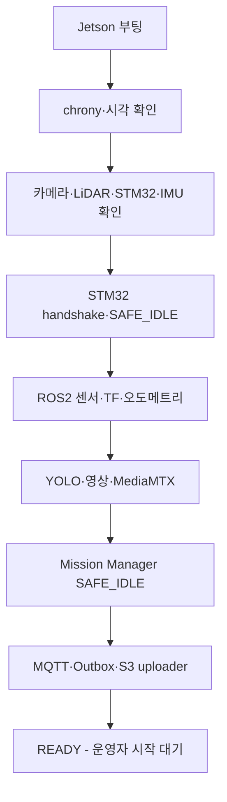

세부 순서:

1. OS, NVMe, 네트워크가 올라온다.
2. `chrony`가 동작하고 시각 이상 여부를 기록한다.
3. STM32는 독립적으로 `SAFE_IDLE`, PWM 0을 유지한다.
4. udev 별칭으로 카메라·LiDAR·STM32·IMU 장치를 확인한다.
5. STM32 handshake와 펌웨어 버전을 확인한다.
6. ROS2 센서 driver, robot_state_publisher, TF, odometry를 시작한다.
7. SLAM/Nav2 lifecycle node를 inactive 상태로 준비한다.
8. GStreamer, MediaMTX, YOLO, 녹화 링 버퍼를 시작한다.
9. Mission Manager와 안전 노드를 시작한다.
10. MQTT, Outbox worker, S3 uploader를 시작한다.
11. 모든 필수 health가 정상이면 `READY`를 표시한다.
12. 운영자 명령 전까지 모터 enable을 허용하지 않는다.

온습도, S3, EC2 연결 같은 보조 기능이 실패해도 `DEGRADED_READY`로 시작할 수 있지만 STM32, E-Stop, 엔코더, LiDAR, TF가 실패하면 자율 임무 시작을 차단한다.

---

## 37-3. systemd 서비스 구조

권장 서비스:

```text
sentinel-stm32-bridge.service
sentinel-ros-bringup.service
sentinel-media.service
sentinel-perception.service
sentinel-mission.service
sentinel-cloud-bridge.service
sentinel-uploader.service
sentinel-health-agent.service
```

의존 관계:

```text
stm32-bridge
├─ ros-bringup
│  ├─ perception
│  └─ mission
├─ media
└─ cloud-bridge
   └─ uploader
```

정책:

- 비안전 서비스는 `Restart=on-failure`와 지수 백오프를 사용한다.
- `stm32-bridge`가 죽어도 STM32 watchdog이 모터를 정지한다.
- `ExecStop`과 signal handler는 STOP을 보내되 이것만 안전 근거로 삼지 않는다.
- 반복 실패 횟수가 임계값을 넘으면 무한 재시작보다 `FAILED`로 남기고 관제에 원인을 표시한다.
- 서비스 파일과 환경변수는 Git에서 template로 관리하고 secret은 분리한다.

프로세스 재시작 후 Mission Manager는 `SAFE_IDLE` 또는 `PAUSED_RECOVERY`로 복구한다. 재부팅 전의 AUTO/MANUAL 동작을 자동으로 이어서 실행하지 않는다.

---

## 37-4. EC2 시작·종료 순서

Docker Compose 시작 순서:

```text
PostgreSQL + TimescaleDB healthy
→ DB migration
→ Mosquitto healthy
→ Spring Boot healthy
→ Next.js/Nginx healthy
→ 선택: EC2 MediaMTX
```

중지 순서:

1. 새로운 임무·제어 세션 생성을 차단한다.
2. 활성 Control Lease에 STOP을 보내고 만료시킨다.
3. Spring Boot가 Outbox·DB 작업을 마무리한다.
4. Next.js·Spring Boot·Mosquitto를 중지한다.
5. 마지막에 DB를 중지한다.

배포 중 서버가 잠시 내려가도 Jetson의 현재 자율 임무를 강제로 계속하게 두지 않는다. 최신 안전 정책은 EC2 연결 단절 시 로컬 자율 탐사를 계속할 수 있으나, 수동 조작 중 연결이 끊기면 300ms TTL로 정지하고 `PAUSED`로 전환한다.

---

## 37-5. Health 모델

health는 단순 Boolean이 아니라 다음 상태를 사용한다.

```text
OK
DEGRADED
FAILED
UNKNOWN
```

| 컴포넌트 | 확인 항목 | FAILED 시 |
|---|---|---|
| STM32 | heartbeat, firmware, fault, E-Stop | 모터 정지, 임무 불가 |
| Encoder | tick 변화·방향·불연속 | AUTO 중지 |
| LiDAR | `/scan` 주기·범위 | AUTO 중지 |
| Camera | frame 주기 | 탐사 일시정지 |
| IMU | 주기·NaN·bias | 융합 축소 또는 AUTO 중지 |
| SLAM | pose update·scan matching | PAUSED |
| Nav2 | lifecycle·action 상태 | 목표 취소·PAUSED |
| YOLO | inference heartbeat | 탐사는 정책에 따라 일시정지, 사람 탐지 불가 경고 |
| MediaMTX | publisher·viewer·frame age | 수동 영상 경고·전진 차단 |
| Ring buffer | 최근 조각·쓰기 지연 | 녹화 오류 경고 |
| MQTT | 연결·마지막 ACK | 관제 OFFLINE, 로컬 정책 적용 |
| Outbox | pending 개수·최고 age | 업로드 지연 경고 |
| DB/S3 | 요청 성공률·지연 | 로컬 저장·재시도 |

로봇 종합 상태:

```text
READY       = 모든 필수 health OK
DEGRADED    = 보조 기능 실패, 안전 주행 가능
PAUSED      = 임무 진행 불가, 모터 정지
FAULT       = 수동 확인·reset 없이는 복구 불가
ESTOP       = 물리/소프트웨어 E-Stop latch
```

---

## 37-6. 관제 지표와 임계값

초기 운영 임계값:

| 지표 | 경고 | 심각·동작 |
|---|---:|---|
| Jetson CPU | 90% 60초 | 추론 FPS·영상 해상도 축소 검토 |
| Jetson GPU | 95% 60초 | STT·오버레이 우선 축소 |
| Memory | 85% | 95%에서 새 STT 작업 차단 |
| Jetson 온도 | 75°C | 85°C에서 임무 PAUSED·냉각 확인 |
| 디스크 여유 | 10GB 미만 | 5GB 미만 캐시 정리·rosbag 차단 |
| 링 조각 생성 지연 | 2초 초과 | 녹화 `DEGRADED` |
| WebRTC frame age | 1초 | 3초에서 수동 전진 차단 |
| STM32 heartbeat | 100ms | 300ms에서 STM32 로컬 정지 |
| MQTT heartbeat | 3초 | 5초에서 관제 OFFLINE |
| Outbox 최고 대기 | 5분 | 30분에서 심각 경고 |
| 배터리 | 배터리 모델별 TBD | 저전압 복귀·정지 임계값은 실측 확정 |

온도 임계값은 보수적인 프로젝트 정책이며 실제 Jetson 모듈의 전력 모드·냉각·thermal specification을 확인해 최종 고정한다.

---

## 37-7. 로그 정책

공통 로그 필드:

```json
{
  "timestamp": "2026-07-22T08:10:01.123Z",
  "level": "ERROR",
  "component": "stm32_bridge",
  "robotId": "SENTINEL-01",
  "missionId": "...",
  "eventCode": "STM32_COMM_TIMEOUT",
  "message": "No valid drive state for 320ms",
  "context": {"lastSequence": 1832}
}
```

로그에 넣지 않는 값:

- DB·MQTT 비밀번호
- MQTT credential
- 배포 환경 접근 token
- Presigned URL 전체
- 피해자 음성 원문
- transcript 전체 문장

Jetson은 journald와 파일 rotation을 사용하고, 14일 또는 용량 상한 중 먼저 도달한 기준으로 정리한다. 안전 이벤트와 임무 이벤트는 일반 debug 로그와 별도로 DB에 구조화하여 보존한다.

주요 확인 명령:

```bash
systemctl --failed
journalctl -u sentinel-stm32-bridge -f
journalctl -u sentinel-media -f
ros2 node list
ros2 topic hz /scan
ros2 topic echo /diagnostics
tegrastats
df -h /var/lib/sentinel
sudo docker compose ps
sudo docker compose logs --since=10m backend
```

---

## 37-8. 장애별 복구 Runbook

| 장애 | 자동 처리 | 운영자 처리 | 재개 조건 |
|---|---|---|---|
| Jetson 앱 crash | systemd 재시작, STM32 정지 | 로그·health 확인 | SAFE_IDLE에서 명시적 시작 |
| Jetson OS reboot | STM32 timeout·정지 | 센서·서비스 전체 점검 | READY 확인 후 시작 |
| STM32 USB 분리 | 300ms 정지, bridge 재탐색 | 케이블·전원 확인 | handshake·엔코더 정상 |
| STM32 reset | 출력 0, reset reason 보고 | fault 원인 확인 | 새 handshake와 enable |
| LiDAR 분리 | Nav2 취소·PAUSED | USB·전원·driver 확인 | `/scan` 안정 10초 |
| 카메라 분리 | YOLO·영상 중지·PAUSED | 장치·파이프라인 확인 | frame 안정 10초 |
| WebRTC 실패 | 자동 signaling 재시도 | 인증서·IP·MediaMTX 확인 | 지연 시험 통과 |
| MQTT 단절 | Outbox 저장, presence OFFLINE | Wi-Fi·broker 확인 | 상태 동기화 후 명시적 재개 |
| EC2 장애 | 수동 정지, 로컬 저장 | Compose·DB health 확인 | 명령·상태 round-trip 확인 |
| DB 장애 | 요청 실패·Outbox 보존 | DB 로그·디스크·migration 확인 | health·쓰기 시험 통과 |
| S3 장애 | UPLOAD_PENDING | IAM·URL·네트워크 확인 | checksum 포함 업로드 성공 |
| 디스크 부족 | 완료 캐시 정리 | 오래된 rosbag·임시파일 검토 | 10GB 이상 확보 |
| 과열 | 추론 축소 또는 PAUSED | 팬·히트싱크·통풍 확인 | 온도 안정 5분 |
| 저전압 | 복귀 또는 안전 정지 | 배터리·DC-DC 점검 | 충전·전압 안정 |

어떤 장애도 단순 재연결만으로 모터를 자동 재가동하지 않는다.

---

## 37-9. 시각 동기화

Jetson과 EC2는 chrony/NTP로 UTC 시각을 맞춘다.

- `occurredAt`: 사건이 실제 발생한 Jetson 시각
- `receivedAt`: 서버 수신 시각
- `senderUptimeMs`: 장치 부팅 후 monotonic 시간
- TTL·watchdog: wall clock이 아니라 monotonic clock

시각 오차가 1초를 넘으면 관제에 경고하고, 5초를 넘으면 이벤트 타임라인을 `TIME_UNSYNCED`로 표시한다. 제어 TTL은 시각 동기화가 틀려도 로컬 monotonic 시간으로 안전하게 만료되어야 한다.

---

## 37-10. Outbox와 미디어 복구

SQLite Outbox 항목:

```text
outbox_id
message_id UNIQUE
message_type
payload_json
created_at
attempt_count
next_attempt_at
last_error
status
```

상태:

```text
PENDING → SENDING → ACKED
                └→ RETRY_WAIT
                └→ DEAD_LETTER
```

재시도는 1, 2, 4, 8, 16, 최대 60초 백오프와 작은 jitter를 사용한다. 중요 encounter 보고는 `messageId`를 유지하여 서버가 중복 저장하지 않게 한다.

부팅 시 미디어 복구 순서:

1. `.partial` 파일과 segment manifest 검색
2. 참조 조각 존재 여부 확인
3. 재다중화 가능한 이벤트는 MP4 복구
4. checksum 계산
5. DB/Outbox와 미디어 상태 대조
6. 업로드되지 않은 파일을 `UPLOAD_PENDING`으로 재등록
7. 복구 불가 파일은 `CORRUPT`, 원인과 조각 목록 기록

---

## 37-11. 배포·롤백

### EC2

- Docker image에 `latest`만 사용하지 않고 commit SHA 또는 release tag를 부여한다.
- DB migration은 배포 전에 백업과 하위 호환성을 확인한다.
- health check 실패 시 이전 Compose image tag로 되돌린다.
- migration이 비가역이면 롤백 스크립트 또는 복원 절차를 함께 준비한다.

### Jetson

- ROS2 package, Python venv, MediaMTX binary, config version을 release 단위로 묶는다.
- 현재 동작 버전과 이전 정상 버전을 각각 유지한다.
- 배포 중 모터는 SAFE_IDLE로 두고 구동 바퀴를 바닥에서 띄운다.
- STM32 firmware와 Jetson protocol version 호환표를 확인한다.
- firmware update 실패 시 ST-Link 등 유선 복구 경로를 문서화한다.

배포 완료는 프로세스가 떴다는 사실이 아니라 `STM32 handshake → 센서 health → 로컬 영상 → 가짜 임무 명령 → STOP` smoke test 통과로 판정한다.

---

## 37-12. 시연 전 백업·점검

시연 전날 고정할 항목:

- Jetson release tag와 STM32 firmware hash
- 승인된 calibration/config 묶음
- EC2 Compose image tag
- DB schema version
- MediaMTX·GStreamer 설정
- 로컬 인증서와 접속 주소
- 발표용 예비 임무 데이터
- E-Stop·배터리·예비 케이블

시연 당일에는 기능 추가보다 정상 버전 복구 가능성을 우선한다. 온라인 배포가 실패하면 이전 image와 config로 10분 안에 롤백할 수 있어야 한다.

---

## 37-13. 운영 인수 시험

| ID | 시험 | 합격 기준 |
|---|---|---|
| OPS-01 | Jetson cold boot | 모터 0 유지, 서비스 순서대로 READY |
| OPS-02 | 임무 중 Jetson 재부팅 | STM32 정지, 재부팅 후 자동 주행 재개 없음 |
| OPS-03 | STM32 reset | 모터 출력 0, reset reason 표시 |
| OPS-04 | LiDAR·카메라 순차 분리 | 정의된 PAUSED·FAULT와 정확한 컴포넌트 표시 |
| OPS-05 | MQTT·EC2 5분 차단 | 중요 이벤트·영상 로컬 보존, 복구 후 재전송 |
| OPS-06 | DB·S3 장애 | 손실 없이 pending 유지, 정상화 후 멱등 처리 |
| OPS-07 | 시각 10초 오차 주입 | 경고 표시, TTL·watchdog 정상 동작 |
| OPS-08 | 디스크 임계값 | 자동 정리 또는 명시적 recording failure |
| OPS-09 | 이전 버전 롤백 | 10분 내 정상 smoke test 완료 |
| OPS-10 | 로그 보안 검사 | secret·URL·음성 원문 노출 0건 |
| OPS-11 | 60분 통합 운전 | 비정상 reset·메모리 고갈·서비스 crash 0회 |

---

## 37장 최종 확정안

> Jetson은 STM32 SAFE_IDLE과 장치 인식부터 시작해 ROS2, 영상·AI, Mission Manager, 클라우드 연결 순서로 부팅하며 운영자 명령 전에는 모터를 enable하지 않는다. 각 컴포넌트는 OK·DEGRADED·FAILED·UNKNOWN 상태와 정량 임계값을 가지며, 장애 후 서비스는 재시작할 수 있어도 주행은 자동 재개하지 않는다. 중요 이벤트와 영상은 SQLite Outbox와 로컬 조각으로 복구하고, 배포 실패 시 이전 release·firmware·config 묶음으로 롤백한다.

---

# 38. 요구사항 추적표·최종 인수 시험

## 38-1. 목적과 판정 원칙

본 장은 요구사항, 구현 모듈, 시험, 정량 합격 기준, 증빙을 연결한다. 코드가 merge되었거나 한 번 동작했다는 사실만으로 완료 처리하지 않는다.

요구사항 상태:

```text
PLANNED
IMPLEMENTED
VERIFIED
ACCEPTED
DEFERRED
FAILED
```

판정 원칙:

- `IMPLEMENTED`: 실제 하드웨어 또는 지정된 통합 환경에서 기능이 실행됨
- `VERIFIED`: 연결된 시험과 정량 기준을 통과하고 증빙이 있음
- `ACCEPTED`: 전체 시나리오와 회귀 시험까지 통과해 팀이 최종 승인함
- `DEFERRED`: 선택·확장 기능으로 최종 시연 범위에서 제외하고 이유가 기록됨
- 시험 실패 후 코드·배선·파라미터를 바꾸면 영향받는 시험을 다시 수행함
- 3회 연속 시연 중 설정을 바꾸면 연속 성공 횟수를 0으로 초기화함

---

## 38-2. 최신 기능 요구사항 기준선

최신 대화에서 확정된 이벤트·피해자 대응 요구사항은 다음과 같다.

```text
FR-007
탐지 확정 전 3초 + 접근·음성 상호작용 전체 + 종료 후 3초를
하나의 encounter 이벤트 영상으로 저장해야 한다.

FR-008
사람 발견 시 탐사를 일시정지하고 안전거리까지 접근하여 음성 상호작용과 보고를
완료한 뒤, 안전 조건이 충족된 경우에만 탐사를 재개해야 한다.
```

추가 요구사항:

| ID | 요구사항 | 등급 |
|---|---|---|
| `FR-021` | STT-LLM-TTS로 피해자 응답을 해석하고 제한된 안내·구조화 보고를 생성해야 한다. | 필수 |
| `FR-022` | 한 화면의 여러 사람을 개별 추적하되 하나의 encounter로 관리해야 한다. | 필수 |
| `FR-023` | Jetson과 STM32를 분리하고 STM32가 저수준 모터·엔코더·watchdog을 담당해야 한다. | 필수 |
| `FR-024` | 짐벌은 NAV_LOCK과 CENTER_LOCK을 제공하고 SLAM 악화 시 fallback해야 한다. | 선택에 가까운 필수 |
| `FR-025` | 관제·MQTT·S3 접근은 인증과 암호화 정책을 적용해야 한다. | 필수 |
| `FR-026` | 네트워크 단절 중 이벤트를 로컬 보관하고 복구 후 멱등 재전송해야 한다. | 필수 |
| `FR-027` | 이벤트·대화·피해자·미디어는 encounter 중심 관계로 조회되어야 한다. | 필수 |
| `FR-028` | 부팅·재연결 후 차량은 자동 주행을 재개하지 않아야 한다. | 필수 |

---

## 38-3. 기능 요구사항 추적표

초기 상태는 모두 `PLANNED`이며 실제 구현·시험 후 갱신한다.

| ID | 핵심 구현 모듈 | 연결 시험 | 합격 기준 | 증빙 |
|---|---|---|---|---|
| FR-001 | Mission API, Mission Manager | MIS-01 | 허용된 관제 세션에서 임무 생성·시작 ACK·상태 전환 | API 로그·화면 |
| FR-002 | SLAM bringup, map manager | NAV-01 | 새 map ID와 home pose 생성·저장 | rosbag·DB |
| FR-003 | frontier_explorer | NAV-02 | 목표 입력 없이 frontier 3개 이상 순차 선택 | 지도 영상·로그 |
| FR-004 | Nav2, costmap, Collision Monitor | NAV-03 | 지정 장애물과 충돌 0회, 우회 또는 안전 정지 | 시험 영상 |
| FR-005 | 추가 학습 YOLO26n Detect, TensorRT | AI-01 | 분리된 시험 세트 사람 출현 10회 중 9회 이상 2초 내 확정 | 데이터셋 버전·탐지 로그·영상 |
| FR-006 | human_localizer, event manager | AI-02 | 사람 위치가 지도에 표시되고 timestamp·confidence 저장 | RViz·DB |
| FR-007 | ring writer, recording manager | VID-03/04 | 사전 3초 이상+상호작용 전체+사후 3초 포함 | MP4·manifest |
| FR-008 | Mission Manager, interaction FSM | SCN-01 | 탐사 일시정지→접근→대화→보고→안전 시 재개 | 전체 시연 영상 |
| FR-009 | ByteTrack, dedup service | AI-03 | 동일 인물 연속 관측 중 피해자 중복 생성 0건 | DB·track 로그 |
| FR-010 | Gamepad API, UI gate | MAN-01 | 게임패드 미연결 시 MANUAL 시작 불가 | 화면·이벤트 로그 |
| FR-011 | deadman, safety gate, STM32 watchdog | CTRL-02/03 | 입력 단절 후 300ms 이내 PWM 0 | 로직 분석 로그 |
| FR-012 | Control Lease | SEC-02 | 브라우저 2개 중 하나만 조종 | 세션·명령 로그 |
| FR-013 | GStreamer, MediaMTX, WHEP | VID-01/02 | 동일 Wi-Fi P95 지연 500ms 이하, 30분 안정 | 지연 측정표 |
| FR-014 | EC2 MediaMTX relay | OPT-VID-01 | 선택 구현 시 외부 브라우저 재생 | 선택 증빙 |
| FR-015 | telemetry, dashboard | TEL-01 | 온습도·배터리·Jetson·STM32 상태 2Hz 표시 | 화면·DB |
| FR-016 | Mission query API, history UI | WEB-01 | 지도·경로·encounter·영상 이력 조회 | 화면 녹화 |
| FR-017 | media uploader, S3, DB | MED-01 | 객체는 S3, metadata는 DB, checksum 일치 | S3·DB 결과 |
| FR-018 | local Mission Manager | NET-01 | EC2 단절 시 AUTO 정책 유지 또는 안전 PAUSED, 수동은 정지 | 장애 주입 영상 |
| FR-019 | MQTT TTL, local safety | CTRL-03 | 제어 연결 단절 후 300ms 이내 정지 | STM32 로그 |
| FR-020 | home pose, NavigateToPose | NAV-04 | 탐사 종료 후 home 허용 반경 도착 또는 명시적 fallback | 지도·action 로그 |
| FR-021 | VAD/STT/LLM/TTS/schema validator | VOI-01~10 | 안내·구조화 해석·금지 출력 차단·보고가 정의된 기준 통과 | 오디오·DB·영상 |
| FR-022 | ByteTrack, encounter manager | VID-05/AI-04 | 3명 개별 track, encounter 1개, 영상 1개 | DB·MP4 |
| FR-023 | STM32 firmware, bridge | CTRL-01~12 | 100Hz 제어와 300ms watchdog·E-Stop 시험 통과 | 펌웨어 로그·영상 |
| FR-024 | gimbal controller, dynamic TF | CAL-07/08 | 중앙 복귀와 SLAM 비교 통과, 실패 시 CENTER_LOCK | RViz·측정표 |
| FR-025 | Nginx 접근 제한, Control Lease, MQTT ACL, S3 | SEC-01~12 | 허용되지 않은 제어·공개 객체·평문 MQTT 없음 | 보안 시험표 |
| FR-026 | SQLite Outbox, uploader | NET-02 | 5분 단절 후 누락·중복 없이 중요 이벤트 복구 | Outbox·DB·S3 |
| FR-027 | encounter schema/API | DATA-01 | 다중 피해자·대화·미디어 관계가 한 조회로 반환 | API 응답·ERD |
| FR-028 | Mission Manager, STM32 handshake | OPS-01/02/03 | reboot·reconnect 후 SAFE_IDLE, 자동 이동 0회 | 부팅 영상·로그 |

`FR-018`의 “로컬 자율 탐사 유지”는 안전 조건이 충족될 때만 허용한다. 수동 조작 중 EC2나 관제 연결이 끊기면 무조건 정지하며, AUTO 중에도 핵심 센서·STM32 상태가 나쁘면 PAUSED로 전환한다.

---

## 38-4. 비기능 요구사항 추적표

| ID | 요구사항 | 시험 | 합격 기준 |
|---|---|---|---|
| NFR-001 | 로컬 영상 저지연 | VID-01 | 중앙값 ≤350ms, P95 ≤500ms |
| NFR-002 | 모듈 독립 시험 | MOD-01 | 센서 mock·recorded data로 주요 노드 단독 실행 |
| NFR-003 | 서버 배포 재현성 | DEP-01 | 새 EC2/VM에서 문서대로 Compose 기동 |
| NFR-004 | 메시지 식별·시각 | MSG-01 | 모든 공통 메시지에 ID·sequence·sentAt |
| NFR-005 | 재연결·재전송 | NET-02 | 중요 이벤트 누락·중복 0건 |
| NFR-006 | 구조화 로그 | LOG-01 | 컴포넌트·level·시각·eventCode 포함 |
| NFR-007 | 장시간 안정성 | OPS-11 | 60분 crash·비정상 reset·OOM 0회 |
| NFR-008 | 설정 재현성 | CFG-01 | 임무에 config·firmware·model version 저장 |
| NFR-009 | 시간 정렬 | OPS-07 | 시각 오류 감지, TTL은 정상 동작 |
| NFR-010 | 장애 가시성 | HLT-01 | 주입 장애의 컴포넌트와 상태가 5초 내 표시 |
| NFR-011 | 데이터 최소화 | SEC-09/10 | secret 로그 0건, 보존·삭제 시험 통과 |
| NFR-012 | 성능 측정 가능 | PERF-01 | FPS·지연·온도·CPU/GPU·메모리 기록 |

---

## 38-5. 안전 요구사항 추적표

| ID | 요구사항 | 시험 | 합격 기준 |
|---|---|---|---|
| SR-001 | 시작·종료·예외 시 모터 정지 | CTRL-01/03 | PWM 0·driver 안전 상태 |
| SR-002 | 물리 E-Stop 독립 차단 | CTRL-08 | Jetson·STM32 오동작과 무관하게 모터 전력 차단 |
| SR-003 | 명령 TTL 정지 | CTRL-02/03 | 300ms 이내 PWM 0 |
| SR-004 | LiDAR·엔코더 핵심 오류 시 AUTO 중단 | OPS-04/CTRL-11 | 상태 PAUSED/FAULT, 이동 없음 |
| SR-005 | 수동 deadman | MAN-02 | 버튼 해제 후 300ms 이내 정지 |
| SR-006 | 모터·서보·Jetson 전원 분리 | HW-01 | 배선도·정격 검토와 부하 시험 통과 |
| SR-007 | STM32 reset 안전 | CTRL-04 | reset 직후 PWM 0·enable LOW |
| SR-008 | E-Stop 해제 후 자동 재출발 금지 | CTRL-09 | SAFE_IDLE 유지 |
| SR-009 | 사람 접근 안전거리 | CAL-10 | 1.5~2.0m 범위 5/5회 정지 |
| SR-010 | 영상 상실 시 수동 전진 차단 | VID-10 | frame age 3초 후 신규 전진 명령 거부 |
| SR-011 | 과열·저전압 보호 | THM-01/PWR-01 | 임계값에서 감속·PAUSED·정지 정책 실행 |
| SR-012 | 방향 전환 보호 | CTRL-13 | 전진↔후진 전 중립·감속, 과전류 없음 |

안전 시험은 구동 바퀴를 띄운 벤치 시험에서 시작하고, 낮은 속도의 바닥 시험, 실제 시나리오 순으로 올린다.

---

## 38-6. 시험 환경 정의

### 환경 E1 - 벤치

- 구동 바퀴가 바닥에서 떠 있고 조향 링크가 장애물과 간섭하지 않는 상태
- 전류 제한 전원 또는 퓨즈 적용
- 로직 애널라이저·멀티미터 사용 가능
- STM32 watchdog·PWM·엔코더·E-Stop 시험

### 환경 E2 - 실내 주행 코스

- 평탄 복도와 경미한 변형 바닥
- 정적 장애물과 사람 역할 참가자
- Jetson·관제 PC 동일 Wi-Fi
- 코스 길이, 조도, AP 거리, 배터리 상태 기록

### 환경 E3 - 네트워크·서버 장애 주입

- Wi-Fi 차단, MQTT 차단, EC2 Compose 중지
- DB·S3 실패 응답 또는 방화벽 차단
- 복구 후 Outbox·중복·상태 동기화 확인

### 환경 E4 - 최종 시연

- 발표 장소와 동일한 네트워크·화면·코스
- 승인된 release와 config만 사용
- 코드·배선·파라미터 변경 없이 3회 연속 실행

모든 시험 기록에는 다음을 포함한다.

```text
시험 ID / 일시 / 담당자 / 환경 / Git commit
Jetson release / STM32 firmware / config version
배터리 전압 / 차량 중량 / 네트워크 조건
절차 / 실제 결과 / 합격 여부 / 증빙 경로 / 결함 ID
```

---

## 38-7. 단계별 인수 Gate

| Gate | 통과 조건 | 다음 단계 |
|---|---|---|
| G0 전기 안전 | 극성·정격·퓨즈·E-Stop·PWM 0 확인 | 모터 벤치 시험 |
| G1 저수준 제어 | CTRL 필수 시험, 엔코더·PID·watchdog | 수동 바닥 주행 |
| G2 센서·TF | LiDAR·카메라·IMU·TF·짐벌 기본 검증 | SLAM·Nav2 |
| G3 자율주행 | 지도·장애물 회피·복귀·안전 정지 | 사람 인식 통합 |
| G4 AI·이벤트 | 탐지·다중 인원·영상·음성 보고 | 관제·클라우드 |
| G5 관제·데이터 | MQTT·REST·WSS·S3·이력·인증 | 장애 주입 |
| G6 복구·보안 | SEC·OPS·NET 시험 통과 | 최종 시나리오 |
| G7 최종 인수 | 핵심 시나리오 3회 연속, 미해결 치명 결함 0건 | 발표 버전 동결 |

앞 Gate의 안전 결함이 해결되지 않은 상태에서 다음 단계의 속도나 복잡도를 올리지 않는다.

---

## 38-8. 최종 시나리오 시험

### SCN-01 단일 피해자 표준 시나리오

```text
READY
→ 미지 공간 탐사 시작
→ SLAM 지도·Frontier 목표 생성
→ 장애물 회피
→ 사람 1명 탐지
→ 탐사 일시정지
→ 1.5~2.0m 안전거리 접근
→ 음성 질문·응답
→ 사후 3초 녹화
→ encounter 보고·S3 업로드
→ 탐사 재개
→ home 복귀
→ 과거 이력 조회
```

합격:

- 충돌·위험 행동 0회
- 피해자 이벤트·위치·영상·보고 모두 조회 가능
- 영상 사전·상호작용·사후 구간 충족
- 안전 조건 충족 후 탐사 재개
- home 허용 반경 도착 또는 문서화된 수동 fallback 성공

### SCN-02 다중 인원 시나리오

```text
한 화면에 사람 3명
→ 3개 track 유지
→ encounter 1개
→ 그룹 중심 방향·안전거리 정지
→ responseScope=GROUP 음성 질문
→ 영상 1개·피해자 후보 3개 연결
→ 관제자 검토 표시
```

합격:

- 동시에 구분된 3명을 위치가 가깝다는 이유로 1명으로 병합하지 않음
- 화자를 특정 피해자로 자동 귀속하지 않음
- 영상·대화가 동일 encounter에 연결됨

### SCN-03 장애·안전 시나리오

다음 항목을 별도 저속 시험으로 수행한다.

1. 수동 주행 중 게임패드 deadman 해제
2. Jetson-STM32 USB 분리
3. 물리 E-Stop 작동
4. MQTT/EC2 연결 차단
5. 이벤트 업로드 중 S3 실패
6. 시스템 복구 후 Outbox 재전송

합격:

- 1~3은 정의된 시간·전기 경로로 정지
- 재연결·E-Stop 해제 후 자동 재출발 없음
- 4~5에서 중요 이벤트와 영상 손실 없음
- 6에서 DB와 S3 중복 생성 없음

---

## 38-9. 최종 3회 연속 성공 규칙

최종 인수는 SCN-01을 중심으로 SCN-02 핵심 요소를 포함한 통합 시연을 **같은 release·firmware·config로 3회 연속** 성공해야 한다.

연속 성공을 초기화하는 변경:

- 코드·펌웨어 변경
- Nav2·PID·YOLO·짐벌 파라미터 변경
- 배선·센서 위치·타이어·조향 링크·액추에이터 결합부 변경
- 카메라 해상도·FPS·비트레이트 변경
- 네트워크 구조·인증서·서버 image 변경

단순 배터리 교체, 로그 다운로드, 동일 부품의 케이블 재체결은 기능 변경이 아니지만 기록한다.

성공 기록표:

| 실행 | 일시 | release/config | 소요 시간 | 피해자 수 | 영상 | 복귀 | 안전 | 결과 | 확인자 |
|---:|---|---|---:|---:|---|---|---|---|---|
| 1 |  |  |  |  |  |  |  |  |  |
| 2 |  |  |  |  |  |  |  |  |  |
| 3 |  |  |  |  |  |  |  |  |  |

---

## 38-10. 증빙 파일 구조

```text
evidence/
└─ final-acceptance-YYYYMMDD/
   ├─ manifest.md
   ├─ versions.json
   ├─ test-results.csv
   ├─ logs/
   │  ├─ jetson/
   │  ├─ stm32/
   │  └─ ec2/
   ├─ rosbag/
   ├─ videos/
   │  ├─ SCN-01-run1.mp4
   │  ├─ SCN-01-run2.mp4
   │  └─ SCN-01-run3.mp4
   ├─ screenshots/
   ├─ media-manifests/
   └─ issues/
```

`manifest.md`에는 각 시험 ID와 실제 증빙 파일의 상대 경로를 연결한다. 개인정보가 포함된 원본 증빙은 공개 Git 저장소에 올리지 않고 접근이 제한된 저장소에 보관한다.

---

## 38-11. 결함 등급과 재시험

| 등급 | 예시 | 최종 인수 |
|---|---|---|
| Critical | E-Stop 실패, 무명령 주행, 모터 watchdog 실패 | 0건이어야 함 |
| High | 충돌, 사람 이벤트 손실, 자동 재출발, 인증 우회 | 0건이어야 함 |
| Medium | WebRTC 일시 끊김, STT 오해석, S3 재시도 지연 | 대응·fallback과 재시험 필요 |
| Low | UI 정렬, 비핵심 로그 문구, 발표 외 기능 | 알려진 제한으로 승인 가능 |

Critical·High 결함 수정 후에는 관련 단위 시험뿐 아니라 SCN-03과 최종 3회 연속 시험을 다시 수행한다.

---

## 38-12. 알려진 제한사항

최종 명세서에는 다음을 숨기지 않고 기록한다.

- 실제 붕괴 현장용 안전·방수·방진·의료 인증 장비가 아니다.
- 실내 복도와 경미한 변형 바닥을 대상으로 하며 계단·큰 잔해·자갈·침수 환경은 제외한다.
- 2D LiDAR는 스캔면 위·아래 장애물을 놓칠 수 있다.
- BMW M7 전륜 조향 베이스는 제자리 회전이 불가능할 가능성이 높으며, 조향 구조 확인 후 최소 회전반경 제약을 확정해야 한다.
- 조향 액추에이터 백래시와 실제 조향각 오차가 오도메트리·경로 추종 품질에 영향을 준다.
- 능동 짐벌이 LiDAR scan과 TF를 흔들면 CENTER_LOCK fallback이 필요하다.
- USB 마이크 한 개로 다중 화자를 구분하지 않는다.
- STT 결과는 의료 진단이나 구조 우선순위 결정에 사용하지 않는다.
- 로컬 WebRTC 성능은 AP 혼잡과 브라우저 환경에 영향을 받는다.
- STM32·모터 드라이버·E-Stop 구조는 교육용 프로토타입이며 안전 인증 제어기가 아니다.
- 모터·드라이버·배터리·DC-DC·서보의 정확한 모델과 정격은 BOM 확정 전까지 TBD다.
- 원격 EC2 영상 릴레이와 TURN은 선택 기능이다.

---

## 38-13. 최종 승인 체크리스트

### 하드웨어·안전

- [ ] 최종 BOM, 정격, 퓨즈, 전원 계통, 배선도 확정
- [ ] 물리 E-Stop과 STM32 300ms watchdog 통과
- [ ] 부팅·reset·통신 단절 시 PWM 0 확인
- [ ] 배터리 저전압·전류·온도 한계 확정

### 자율주행·AI

- [ ] 엔코더·IMU·TF·짐벌 캘리브레이션 버전 고정
- [ ] SLAM·Nav2·Collision Monitor 시험 통과
- [ ] 사람·다중 인원 탐지와 encounter 생성 통과
- [ ] 피해자 접근·음성 상호작용·탐사 재개 통과

### 영상·관제·데이터

- [ ] WebRTC 지연·안정성 목표 통과
- [ ] 3초 사전·상호작용·3초 사후 영상 확인
- [ ] MQTT·REST·WSS·S3·이력 조회 통과
- [ ] EC2/S3 단절과 Outbox 복구 통과

### 보안·운영

- [ ] 운영자 인증·Control Lease·MQTT ACL 적용
- [ ] S3 공개 접근 차단과 보존·삭제 정책 확인
- [ ] cold boot·장애 복구·롤백 시험 통과
- [ ] secret·개인정보 로그 노출 0건

### 최종 시연

- [ ] 승인된 release·firmware·config 동결
- [ ] Critical·High 미해결 결함 0건
- [ ] 전체 시나리오 3회 연속 성공
- [ ] 증빙 manifest와 발표용 지표 완성
- [ ] 팀 최종 확인자 승인

---

## 38장 최종 확정안

> Sentinel UGV의 최종 완료는 기능 목록이 아니라 요구사항별 구현 모듈, 정량 시험, 증빙의 연결로 판정한다. STM32 watchdog·물리 E-Stop·사람 접근·이벤트 영상·음성 상호작용·다중 인원·관제·Outbox·보안 시험을 단계별 Gate로 통과해야 하며, 최종 release·firmware·config를 바꾸지 않은 상태에서 전체 시나리오를 3회 연속 성공해야 v1.0 인수 완료로 본다.

---

# 부록 A. 기능 요구사항 상세
| **ID**     | **요구사항**                                               | **등급** |
|------------|------------------------------------------------------------|----------|
| **FR-001** | 시스템은 관제 화면에서 탐사 임무를 시작할 수 있어야 한다.  | 필수     |
| **FR-002** | 임무 시작 시 새 SLAM 지도와 home pose를 생성해야 한다.     | 필수     |
| **FR-003** | 시스템은 사용자 목표 없이 Frontier를 선택해 탐사해야 한다. | 필수     |
| **FR-004** | Nav2는 정적 장애물을 우회하거나 안전하게 정지해야 한다.    | 필수     |
| **FR-005** | 추가 학습 YOLO26n Detect는 person을 실시간 탐지해야 한다.    | 필수     |
| **FR-006** | 사람별 위치·신뢰도·시간을 encounter 관측으로 생성해야 한다. | 필수     |
| **FR-007** | 확정 전 3초+상호작용 전체+종료 후 3초 영상을 저장해야 한다. | 필수     |
| **FR-008** | 사람 발견 시 접근·음성·보고 후 안전할 때만 탐사를 재개해야 한다. | 필수  |
| **FR-009** | 동일 사람의 반복 이벤트를 억제해야 한다.                   | 필수     |
| **FR-010** | 게임패드 미연결 시 수동 모드를 사용할 수 없어야 한다.      | 필수     |
| **FR-011** | 게임패드 연결 해제 시 즉시 정지해야 한다.                  | 필수     |
| **FR-012** | 한 번에 한 세션만 제어권을 가져야 한다.                    | 필수     |
| **FR-013** | 로컬 WebRTC 영상을 제공해야 한다.                          | 필수     |
| **FR-014** | 원격 EC2 영상 중계를 지원할 수 있어야 한다.                | 선택     |
| **FR-015** | 온습도·배터리·Jetson 상태를 표시해야 한다.                 | 필수     |
| **FR-016** | 임무 이력과 지도·경로·이벤트를 조회해야 한다.              | 필수     |
| **FR-017** | 미디어는 S3, 메타데이터는 DB에 저장해야 한다.              | 필수     |
| **FR-018** | EC2 단절 시 안전 조건에 따라 로컬 AUTO를 유지하거나 PAUSED해야 한다. | 필수 |
| **FR-019** | 수동 제어 연결 단절 시 정지해야 한다.                      | 필수     |
| **FR-020** | 탐사 종료 시 home pose로 복귀해야 한다.                    | 필수     |
| **FR-021** | STT-LLM-TTS로 피해자 응답을 구조화하고 제한된 안내를 생성해야 한다. | 필수 |
| **FR-022** | 여러 사람을 개별 추적하되 한 encounter로 관리해야 한다.    | 필수     |
| **FR-023** | STM32가 모터·엔코더·300ms watchdog을 담당해야 한다.        | 필수     |
| **FR-024** | 짐벌은 NAV_LOCK/CENTER_LOCK과 fallback을 제공해야 한다.     | 선택     |
| **FR-025** | 관제·MQTT·S3에 접근 제한과 암호화를 적용해야 한다.          | 필수     |
| **FR-026** | 단절 중 이벤트를 로컬 보관하고 멱등 재전송해야 한다.        | 필수     |
| **FR-027** | 대화·피해자·미디어를 encounter 중심으로 조회해야 한다.      | 필수     |
| **FR-028** | 부팅·재연결 후 차량은 자동 주행을 재개하지 않아야 한다.     | 필수     |

# 부록 B. 비기능·안전 요구사항
| **ID**      | **요구사항**                                                   |
|-------------|----------------------------------------------------------------|
| **NFR-001** | 로컬 영상은 수동 조종이 가능한 낮은 지연을 제공해야 한다.      |
| **NFR-002** | 각 모듈은 독립 실행·테스트 가능해야 한다.                      |
| **NFR-003** | 서버 배포는 Docker Compose로 재현 가능해야 한다.               |
| **NFR-004** | 모든 메시지는 timestamp와 식별자를 포함해야 한다.              |
| **NFR-005** | 네트워크 재연결과 업로드 재시도를 지원해야 한다.               |
| **NFR-006** | 로그는 컴포넌트·레벨·시간·오류 코드를 포함해야 한다.           |
| **NFR-007** | 기준 설정으로 60분 동안 crash·OOM·비정상 reset 없이 동작해야 한다. |
| **NFR-008** | 임무에 config·firmware·model 버전을 기록해야 한다.             |
| **NFR-009** | 기록 시각을 동기화하고 TTL은 monotonic clock을 사용해야 한다.   |
| **NFR-010** | 장애 컴포넌트와 stale 상태를 관제에서 식별할 수 있어야 한다.    |
| **NFR-011** | 개인정보 최소 수집·보존·삭제 정책을 적용해야 한다.              |
| **NFR-012** | FPS·지연·온도·CPU/GPU·메모리를 측정 가능해야 한다.              |
| **SR-001**  | 프로그램 시작·종료·예외 시 모터는 정지 상태여야 한다.          |
| **SR-002**  | 물리 E-Stop은 소프트웨어와 무관하게 모터 전원을 차단해야 한다. |
| **SR-003**  | 모터 명령 TTL 초과 시 정지해야 한다.                           |
| **SR-004**  | LiDAR·모터·오도메트리 핵심 오류 시 자율주행을 중단해야 한다.   |
| **SR-005**  | 수동 제어에는 deadman 스위치를 사용해야 한다.                  |
| **SR-006**  | 서보와 모터 전원은 Jetson 전원과 적절히 분리해야 한다.         |
| **SR-007**  | STM32 reset 직후 PWM 0과 driver disable을 유지해야 한다.       |

# 부록 C. 주요 ROS 토픽·액션
| **이름**            | **형식/방향**                   | **설명**        |
|---------------------|---------------------------------|-----------------|
| /scan               | sensor_msgs/LaserScan           | LiDAR           |
| /camera/image_raw   | sensor_msgs/Image               | 카메라 프레임   |
| /detections         | custom/DetectionArray           | YOLO 결과       |
| /human_observations | custom/HumanObservationArray    | 지도 위치 후보  |
| /imu/data           | sensor_msgs/Imu                 | IMU             |
| /odom               | nav_msgs/Odometry               | 로봇 오도메트리 |
| /map                | nav_msgs/OccupancyGrid          | SLAM 지도       |
| /cmd_vel_nav        | geometry_msgs/Twist             | Nav2 출력       |
| /cmd_vel_manual     | geometry_msgs/Twist             | 수동 입력       |
| /cmd_vel            | geometry_msgs/Twist             | 최종 안전 명령  |
| /stm32/drive_state  | custom/DriveState               | 엔코더·속도·fault |
| /encounters         | custom/Encounter                | 사람 그룹 상태  |
| /interaction/status | custom/InteractionStatus        | 음성 상호작용    |
| /mission/status     | custom/MissionStatus            | 상태 머신       |
| /gimbal/state       | sensor_msgs/JointState          | 짐벌 각도       |
| NavigateToPose      | nav2_msgs/action/NavigateToPose | 목표 주행       |

# 부록 D. 환경 변수 예시
```bash
# frontend
NEXT_PUBLIC_API_BASE_URL=https://sentinel.example.com/api
NEXT_PUBLIC_WS_URL=wss://sentinel.example.com/ws
NEXT_PUBLIC_LOCAL_STREAM_URL=https://sentinel.local:8889/robot/whep
NEXT_PUBLIC_REMOTE_STREAM_URL=https://stream.example.com/robot/whep
# backend
DB_URL=jdbc:postgresql://postgres:5432/sentinel
DB_USER=sentinel
DB_PASSWORD=***
S3_BUCKET=sentinel-ugv-assets
AWS_REGION=ap-northeast-2
CONTROL_LEASE_TTL_MS=3000
MQTT_BROKER_URL=ssl://mqtt.example.com:8883
# jetson
ROBOT_ID=sentinel-01
MQTT_BROKER_URL=ssl://mqtt.example.com:8883
STM32_DEVICE=/dev/sentinel_mcu
EVENT_PRE_SECONDS=3
EVENT_POST_SECONDS=3
MANUAL_CMD_TTL_MS=250
STM32_WATCHDOG_MS=300
```

# 부록 E. 초기 실행 순서
1. JetPack `6.2.1+b38`·Ubuntu 22.04·ROS 2 Humble 확인
2. 물리 E-Stop·STM32 SAFE_IDLE·300ms watchdog 시험
3. BRIO 100·YDLIDAR·IMU 장치 인식과 udev 별칭 확인
4. 차량을 띄운 상태에서 엔코더 방향·모터 PID 시험
5. ROS 2 TF와 `/scan`, `/odom` 시각화
6. YOLO26n person·ByteTrack 시험
7. Spring Boot·Next.js·PostgreSQL/TimescaleDB·MQTT·MediaMTX 실행
8. 가짜 텔레메트리와 MQTT/WSS 재연결 확인
9. SLAM 수동 주행 → Nav2 목표점 → Frontier 순으로 검증
10. encounter·안전 접근·음성·이벤트 영상·S3/Outbox 시험
11. 복귀·E-Stop·네트워크/USB 장애 시험
12. 전체 시나리오 3회 연속 수행

# 부록 F. 주요 로그 확인 명령
```bash
# ROS2
ros2 node list
ros2 topic list
ros2 topic hz /scan
ros2 topic echo /mission/status
ros2 run tf2_tools view_frames
# Jetson
tegrastats
v4l2-ctl --device=/dev/video0 --list-formats-ext
dmesg -w
journalctl -u sentinel-bringup -f
journalctl -u sentinel-stm32-bridge -f
udevadm info /dev/sentinel_mcu
# EC2
sudo docker compose ps
sudo docker compose logs -f backend
sudo docker compose logs -f mediamtx
curl -f https://sentinel.example.com/health
```

# 부록 G. 용어집
| **용어**           | **설명**                                                    |
|--------------------|-------------------------------------------------------------|
| **UGV**            | Unmanned Ground Vehicle, 무인 지상 차량                     |
| **온디바이스 AI**  | 클라우드가 아닌 장치 내부에서 AI 추론을 수행하는 방식       |
| **추론**           | 학습된 모델에 새 입력을 넣어 결과를 얻는 과정               |
| **SLAM**           | 위치 추정과 지도 작성을 동시에 수행하는 기술                |
| **Nav2**           | ROS2 기반 경로 계획·주행·복구 프레임워크                    |
| **Frontier**       | 확인된 자유 공간과 미지 공간의 경계                         |
| **오도메트리**     | 바퀴·IMU 등으로 로봇 이동량을 추정한 값                     |
| **TF**             | ROS에서 좌표계 관계를 관리하는 시스템                       |
| **Costmap**        | 장애물과 이동 비용을 표현하는 격자 지도                     |
| **WebRTC**         | 브라우저 저지연 실시간 미디어 통신 기술                     |
| **WHEP**           | WebRTC 스트림 수신을 위한 HTTP 기반 표준 인터페이스         |
| **MediaMTX**       | RTSP/WebRTC 등 미디어 프로토콜 중계 서버                    |
| **TimescaleDB**    | PostgreSQL 확장 기반 시계열 데이터베이스                    |
| **MQTT**           | 차량 상태·이벤트·명령을 토픽 기반으로 교환하는 메시지 프로토콜 |
| **Encounter**      | 한 번의 사람 그룹 발견·접근·대화·보고를 묶는 도메인 단위     |
| **ByteTrack**      | 영상 프레임 간 사람별 track ID를 유지하는 다중 객체 추적기    |
| **Watchdog**       | 정해진 시간 안에 정상 신호가 없으면 안전 동작을 수행하는 감시기 |
| **S3**             | AWS 객체 스토리지                                           |
| **Presigned URL**  | 제한 시간 동안 특정 S3 객체 업로드·조회 권한을 제공하는 URL |
| **Deadman switch** | 버튼을 누르는 동안에만 장비가 동작하도록 하는 안전 입력     |
| **E-Stop**         | 비상 정지                                                   |
| **TBD**            | 추후 결정할 항목                                            |

# 부록 H. 최종 TBD 및 변경 관리
TBD 항목이 확정되면 문서 버전을 v1.0으로 올리고, 선택 근거·측정값·담당자·결정일을 변경 이력에 기록한다. 구현 중 명세와 다른 구조를 적용할 경우 실제 구현을 우선하되, 변경 이유와 장단점, 일정 영향, 대체안을 본 문서에 반영한다.

| **ID**      | **미확정 항목** | **결정 시 기록할 값**                           |
|-------------|-----------------|-------------------------------------------------|
| TBD-HW-001  | RS540 구동계·엔코더 | 감속비, 정지 전류, 차축 구조, 엔코더 장착·PPR   |
| TBD-HW-002  | 모터 드라이버   | 모델, 채널, 연속/피크 전류, 인터페이스          |
| TBD-HW-003  | 전원            | 배터리 종류, 셀 수, 용량, DC-DC, 예상 운용 시간 |
| TBD-HW-004  | 조향 계통       | 액추에이터 종류, 링크, 제어 신호, 각도 한계, 피드백 유무 |
| TBD-HW-005  | 짐벌            | 총 하중, 서보, IMU, 각도 범위, 보정 속도        |
| TBD-CAM-001 | 카메라 ROS 2 통합 | 확인된 720p MJPEG와 X4 Pro 동시 구동 안정성      |
| TBD-SW-001  | 추가 학습 YOLO26n 배포 | 데이터셋·가중치 해시, 라이선스, PyTorch/TensorRT FPS |
| TBD-NAV-001 | Frontier 구현   | 패키지 또는 자체 노드, 파라미터                 |
| TBD-AUD-001 | 마이크·스피커    | 모델, 연결 방식, 지향성, 출력, 소음 환경         |
| TBD-AUD-002 | STT·LLM·TTS 배치 | 각 모델, Jetson/EC2 실행 위치, 지연, 오프라인 fallback |
| TBD-CAL-001 | 최종 주행값      | PID, 휠베이스, 조향각 매핑, 최소 회전반경, 속도·가속도, 정지거리 |

# 부록 I. 최종 BOM·전력 예산 템플릿

| 분류 | 부품·모델 | 수량 | 정격·인터페이스 | 공급처 | 확정 상태 |
|---|---|---:|---|---|---|
| 컴퓨팅 | Jetson Orin Nano 8GB | 1 | JetPack 6.2.1+b38 | 제공 | 확정 |
| 제어 | STM32 보드 | 1 | 정확한 보드명·I/O TBD | 제공/구매 | 모델 기록 필요 |
| 차체 | BMW M7 유아전동차 구동 베이스 | 1 | 4륜·후륜 구동, 상부 3D 프린팅 | 보유 | 확정 |
| 센서 | YDLIDAR X4 Pro | 1 | USB Serial, 128000bps, 약 11.03Hz | 제공 | 동작 확인 |
| 센서 | Logitech BRIO 100 | 1 | USB, 720p MJPEG 약 29.93 FPS | 제공 | 캡처 확인 |
| 구동 | RS540 FD-12V RPM14000 DC 모터 | 1 | 12V 후륜 구동, 감속비·stall current TBD | BMW M7 기존 | 모델 확인 |
| 구동 | 구동축 엔코더 | 1식 | 2채널 quadrature 권장, PPR TBD | 구매/제작 | 확인 필요 |
| 구동 | 고전류 모터 드라이버 | 1 | 12V, 연속·피크·stall current 기준 | 구매/TBD | 확인 필요 |
| 조향 | 전륜 조향 액추에이터·링크 | 1식 | 종류·전압·제어 신호·각도 TBD | BMW M7 기존/추가 | 분해 확인 필요 |
| 조향 | 조향각 센서 | 1 | 포텐셔미터/엔코더 | TBD | 권장 |
| 전원 | 배터리·퓨즈·DC-DC | 각 1 | 전압·용량·효율 | TBD | 미확정 |
| 안전 | 물리 E-Stop | 1 | 모터 전원 차단 정격 | TBD | 미확정 |
| 음성 | 마이크·스피커 | 각 1 | USB/아날로그·출력 | TBD | 미확정 |

최종 BOM에는 단가뿐 아니라 데이터시트 링크, 무게, 공급 리드타임, 대체품, 실제 측정 전류를 기록한다.

# 부록 J. 배선도·핀맵 확정표

| From | To | 신호/전원 | 커넥터·핀 | 전압 | 검증자·일자 |
|---|---|---|---|---:|---|
| Jetson | STM32 | USB CDC | `/dev/sentinel_mcu` | USB | TBD |
| STM32 | 구동축 엔코더 | A/B | TBD | TBD | TBD |
| STM32 | 모터 드라이버 | PWM/DIR/ENABLE | TBD | 3.3V 논리 확인 | TBD |
| STM32 | 조향 액추에이터 | PWM/DIR/릴레이 등 TBD | TBD | 실물 전압·전류·신호 확인 | TBD |
| 조향각 센서 | STM32 | ADC/Encoder | TBD | TBD | TBD |
| E-Stop | 모터 전원 계층 | 전력 차단 | TBD | 배터리 전압 | TBD |
| DC-DC | Jetson | 전원 | 공식 전원 입력 | TBD | TBD |
| DC-DC | 서보 | 전원 | 별도 분기 | TBD | TBD |

배선도는 실제 핀을 확인하기 전까지 추정값을 넣지 않으며, 최종본에는 퓨즈·공통 GND·커넥터 방향·케이블 라벨까지 표시한다.

# 부록 K. 소프트웨어 기준선

| 항목 | 기준 | 확인 상태·명령 |
|---|---|---|
| JetPack | `6.2.1+b38` | 실기기 확인 완료 |
| Jetson Linux | 36.4.4 계열 | `cat /etc/nv_tegra_release` |
| Ubuntu | 22.04 | `lsb_release -a` |
| ROS 2 | Humble | `printenv ROS_DISTRO` |
| CUDA | 실기기 값 기록 | `nvcc --version` 또는 `dpkg-query` |
| TensorRT | 실기기 값 기록 | `dpkg-query -W '*nvinfer*'` |
| PyTorch·Ultralytics | lockfile·이미지 태그 기록 | `pip freeze` |
| YOLO | 추가 학습 `yolo26n` 가중치·데이터셋 버전·변환 engine SHA-256 | 학습 산출물 해시 |
| STM32 firmware | Git commit·protocol version | HELLO_ACK·release manifest |
| Backend·Frontend | Git tag·Docker digest | release manifest |
| PostgreSQL·TimescaleDB·MediaMTX | Docker image digest | `docker inspect` |

버전 기준선 변경은 전체 인수 시험 재실행 없이 시연 직전에 수행하지 않는다.

# 부록 L. 최종 파라미터 동결표

| 영역 | 파라미터 | 초기값 | 최종값 | 시험 증빙 |
|---|---|---:|---:|---|
| 안전 | Jetson command timeout | 300ms | TBD | CTRL-03 |
| 안전 | STM32 communication watchdog | 300ms | TBD | CTRL-03 |
| 수동 | 브라우저 command TTL | 250ms | TBD | MAN-02 |
| 영상 | encounter pre-buffer | 3s | 3s | VID-03 |
| 영상 | encounter post-buffer | 3s | 3s | VID-03 |
| 주행 | 최대 자율 선속도 | 0.25m/s | TBD | NAV-03 |
| 접근 | 최대 접근 선속도 | 0.10m/s | TBD | SCN-01 |
| 차체 | 엔코더 PPR·바퀴 거리 스케일 | TBD | TBD | CAL-01~03 |
| 차체 | 휠베이스·조향 중앙·좌우 한계 | TBD | TBD | CAL-04 |
| 차체 | 최소 회전반경 | TBD | TBD | CAL-04/NAV-04 |
| AI | person confidence·안정 관측 시간 | TBD·약 1s | TBD | AI-01~04 |
| Nav2 | inflation·collision distance | TBD | TBD | NAV-03 |
| 짐벌 | 영점·각도 제한·mode | TBD | TBD | CAL-07~08 |

# 참고 자료
- [NVIDIA JetPack 6.2.1 / Jetson Linux 36.4.4](https://forums.developer.nvidia.com/t/jetpack-6-2-1-jetson-linux-36-4-4-is-now-live/337335)
- [NVIDIA JetPack Archive](https://developer.nvidia.com/embedded/jetpack-archive)
- [ROS 2 Humble Ubuntu 22.04 설치](https://docs.ros.org/en/humble/Installation/Ubuntu-Install-Debs.html)
- [Ultralytics YOLO26](https://docs.ultralytics.com/models/yolo26/)
- [Nav2 공식 문서](https://docs.nav2.org/)
- [Nav2 알고리즘 선택 - Ackermann 지원](https://docs.nav2.org/setup_guides/algorithm/select_algorithm.html)
- [ROS 2 Control Humble - Wheeled Mobile Robot Kinematics](https://control.ros.org/humble/doc/ros2_controllers/doc/mobile_robot_kinematics.html)
- [MediaMTX 공식 문서](https://mediamtx.org/docs/kickoff/introduction)
- [MQTT 5.0 OASIS 표준](https://docs.oasis-open.org/mqtt/mqtt/v5.0/mqtt-v5.0.html)
- [AWS S3 보안 모범 사례](https://docs.aws.amazon.com/AmazonS3/latest/userguide/security-best-practices.html)

본 문서는 위 명세서의 교육 목표와 제공 하드웨어를 참고하되, Sentinel UGV의 재난 탐사 시나리오와 팀의 기술 스택에 맞게 재구성한 독립 프로젝트 종합 명세서이다.

**— 문서 끝 —**
