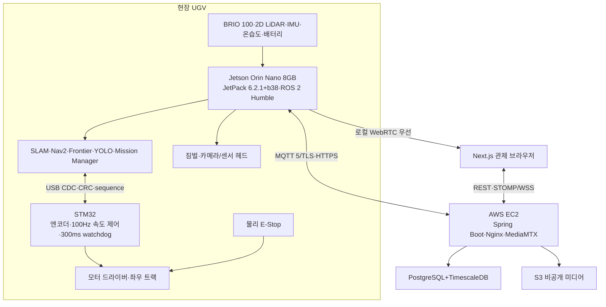

<!--
  GENERATED FILE - DO NOT EDIT DIRECTLY.
  Source: docs/specifications/Sentinel_UGV_최종_통합_명세서_v1.0-rc1.md
  Generator: scripts/docs/split-integrated-spec.ps1
-->

> 기준 문서: Sentinel UGV 통합 명세서 v1.0-rc1 (2026-07-22). 변경은 전체본에 반영한 뒤 분할 스크립트를 실행합니다.

# 5. 전체 시스템 아키텍처 [확정]
## 5.1 데이터 흐름

데이터 흐름은 다음 네 경로로 분리한다.

1. **자율주행 경로:** 센서 → Jetson SLAM·Nav2·Safety Gate → STM32 → 모터
2. **사람 구조 경로:** 카메라 → YOLO·ByteTrack → 안전 접근 → 음성 확인 → encounter 보고
3. **관제 경로:** Jetson → MQTT → Spring Boot → WSS → Next.js
4. **미디어 경로:** Jetson → 로컬 WebRTC → 브라우저, 이벤트 파일 → Presigned HTTPS → S3

## 5.2 장치별 책임
| **구성요소**           | **주요 책임**                                                                     | **하지 않는 일**                               |
|------------------------|-----------------------------------------------------------------------------------|------------------------------------------------|
| Jetson Orin Nano       | 카메라·LiDAR 입력, AI, SLAM, Nav2, 탐사, 목표 속도·짐벌 명령, 로컬 안전, 스트리밍 | 직접 모터 PWM 생성, 회원 관리, 장기 데이터 조회 |
| STM32                  | 엔코더 계수, 좌·우 속도 폐루프, PWM·방향·브레이크, 300ms watchdog, fault          | 경로 계획, 객체 인식, 클라우드 통신             |
| 모터 드라이버          | 좌우 모터 전력 구동과 enable                                                     | 속도 계획, 안전 정책, 객체 인식                 |
| AWS EC2                | API, MQTT broker 연동, WSS 중계, 임무·이력, 원격 스트림                           | 실시간 충돌 회피, 최종 모터 제어                |
| Next.js 브라우저       | 영상·지도·상태 표시, 게임패드 입력, 운영 명령, 과거 임무 조회                     | 로컬 주행 안전 판단                            |
| PostgreSQL/TimescaleDB | 관계 데이터 및 시계열 저장·집계                                                   | 대용량 영상 원본 저장                          |
| S3                     | 스냅샷·이벤트 영상·지도·rosbag 저장                                               | 관계형 조회와 실시간 제어                      |

## 5.3 로컬/원격 영상 이중 경로
| **모드** | **경로**                              | **장점**                         | **주의사항**                           |
|----------|---------------------------------------|----------------------------------|----------------------------------------|
| LOCAL    | Jetson MediaMTX → 동일 Wi-Fi 브라우저 | 최저 지연, 수동 조종 시연에 적합 | HTTPS 혼합 콘텐츠, 로컬 IP/인증서 설정 |
| REMOTE   | Jetson → EC2 MediaMTX → 외부 브라우저 | 외부 관제, 동일 URL 제공         | 인터넷 업로드·왕복 지연, EC2 포트 설정 |
| AUTO     | 로컬 연결 시도 후 실패하면 원격 전환  | 사용 편의성                      | 전환 상태와 지연 차이를 UI에 표시      |

## 5.4 네트워크 원칙
- Jetson은 공유기 내부에서도 연결 가능하도록 EC2의 MQTT broker와 HTTPS endpoint로 아웃바운드 연결을 시작한다.
- 제어 명령에는 sequence, commandId, timestamp, TTL을 포함한다.
- 영상은 WebRTC, Jetson 상태·명령은 MQTT, 웹 실시간 화면은 WSS, 이력 CRUD는 REST를 기본으로 한다.
- DB와 Spring Boot 내부 포트는 EC2 외부에 직접 공개하지 않는다.
- 로컬 제어 안전은 서버 ACK와 무관하게 Jetson Safety Gate와 STM32 watchdog이 이중으로 보장한다.
