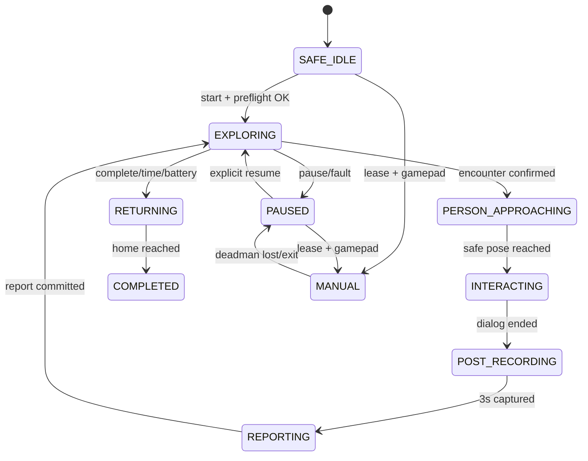

<!--
  GENERATED FILE - DO NOT EDIT DIRECTLY.
  Source: docs/specifications/Sentinel_UGV_최종_통합_명세서_v1.0-rc1.md
  Generator: scripts/docs/split-integrated-spec.ps1
-->

> 기준 문서: Sentinel UGV 통합 명세서 v1.0-rc1 (2026-07-22). 변경은 전체본에 반영한 뒤 분할 스크립트를 실행합니다.

# 26. Mission Manager·임무 상태 머신 상세 설계

## 26.1 단일 권한 원칙

Mission Manager는 임무 상태를 변경하는 유일한 로봇 측 권한자다. Nav2, AI, 음성, 관제 명령이 각자 모터와 상태를 직접 바꾸지 않고 이벤트를 Mission Manager에 전달한다.

## 26.2 최종 상태

| 상태 | 설명 | 이동 허용 |
|---|---|---|
| `SAFE_IDLE` | 부팅·점검 완료 전 또는 임무 대기 | 아니오 |
| `EXPLORING` | Frontier 탐사 | 예 |
| `PERSON_APPROACHING` | 사람 그룹 안전 접근 | 저속 |
| `INTERACTING` | 음성 확인 | 아니오 |
| `POST_RECORDING` | 종료 후 3초 영상 확보 | 아니오 |
| `REPORTING` | 이벤트·피해자·미디어 저장 | 아니오 |
| `PAUSED` | 운영자 또는 오류로 일시정지 | 아니오 |
| `MANUAL` | 단일 Lease 수동 조작 | deadman 시 |
| `RETURNING` | home pose 복귀 | 예 |
| `COMPLETED` | 정상 종료 | 아니오 |
| `ESTOP` | 비상 정지 latch | 아니오 |
| `ERROR` | 핵심 기능 복구 불가 | 아니오 |

`OFFLINE`은 서버가 보는 연결 상태이며 Jetson 내부 주행 상태와 혼동하지 않는다.

## 26.3 상태 전이



모든 이동 상태에서 E-Stop은 `ESTOP`으로, 핵심 센서 실패는 `PAUSED` 또는 `ERROR`로 우선 전환한다. Mermaid 도식에 표시되지 않은 비상 전이는 이 규칙을 따른다.

## 26.4 명령 멱등성과 재시작

- 모든 외부 명령은 `commandId`, `issuedAt`, `expiresAt`을 가진다.
- 이미 처리한 commandId는 결과 ACK만 재전송하고 다시 실행하지 않는다.
- Jetson 또는 서버 재시작 후 진행 중 임무를 자동 주행으로 복구하지 않는다.
- 로컬 checkpoint를 읽어 `RECOVERY_REQUIRED` 상태를 표시하고 운영자가 재개·복귀·종료를 선택한다.
- encounter 보고가 중단되면 동일 encounterId로 재시도한다.

## 26.5 이벤트 우선순위

```text
물리 E-Stop
> STM32 fault/watchdog
> 소프트웨어 E-Stop
> Collision stop
> 핵심 센서·위치 오류
> 수동 deadman/Lease
> 피해자 encounter
> 복귀
> 자율 탐사
```
