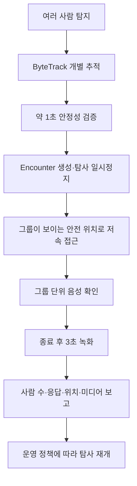
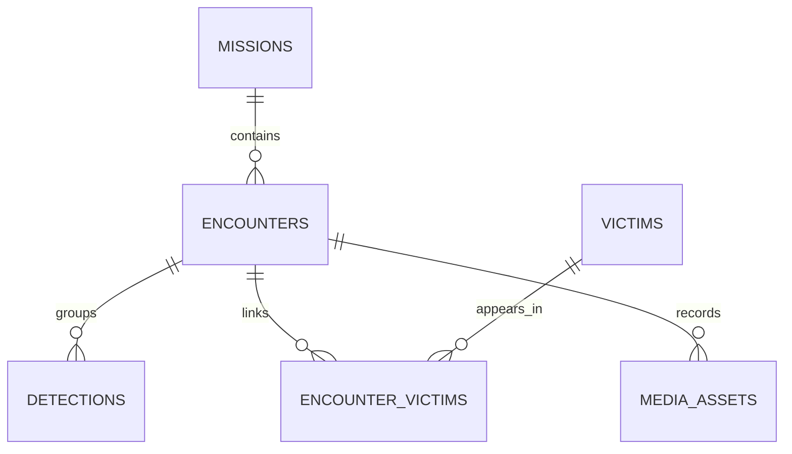

<!--
  GENERATED FILE - DO NOT EDIT DIRECTLY.
  Source: docs/specifications/Sentinel_UGV_최종_통합_명세서_v1.0-rc1.md
  Generator: scripts/docs/split-integrated-spec.ps1
-->

> 기준 문서: Sentinel UGV 통합 명세서 v1.0-rc1 (2026-07-22). 변경은 전체본에 반영한 뒤 분할 스크립트를 실행합니다.

# 30. 피해자 발견·접근·상호작용 오케스트레이션

## 30.1 목표

사람 탐지를 단순 알림으로 끝내지 않고, 안전한 접근·음성 확인·이벤트 영상·구조 정보 보고까지 하나의 **encounter**로 관리한다. 사람은 개별 추적하되 현장 접근과 대화·영상은 그룹 단위로 처리한다.

## 30.2 최종 흐름



## 30.3 안전 접근

접근 목표는 사람 좌표 자체가 아니라 사람으로부터 안전거리만큼 떨어진 자유 공간의 관측 pose다.

1. 사람 그룹의 대표 위치와 분산을 계산한다.
2. costmap 자유 공간에서 후보 관측 pose를 만든다.
3. LiDAR 시야와 카메라 프레임에 그룹이 들어오는지 평가한다.
4. Nav2 경로 생성 가능성과 최소 장애물 거리를 확인한다.
5. 접근 속도를 0.10m/s 이하의 보수적 값으로 제한한다.
6. 사람이 움직이거나 경로가 막히면 즉시 정지하고 목표를 재평가한다.

접근이 불가능하면 현재 안전 위치에서 음성을 송출하고 `APPROACH_FAILED`를 보고한다. 사람을 향해 무리하게 직진하지 않는다.

## 30.4 상호작용 범위

MVP 질문은 구조 판단에 필요한 최소 항목으로 제한한다.

- “제 목소리가 들리시나요?”
- “몇 분이 함께 계신가요?”
- “움직일 수 있나요?”
- “다친 곳이나 도움이 필요한 분이 있나요?”

응답은 확정 의료 진단이 아니라 `RESPONSIVE`, `NO_RESPONSE`, `UNCERTAIN`, `MOBILITY_YES/NO/UNKNOWN` 같은 구조화 상태로 저장한다. 상세 VAD·STT·TTS와 실패 처리는 33장에서 정의한다.

## 30.5 종료·재개 조건

encounter는 다음 중 하나로 종료한다.

- 필수 질문이 완료되었다.
- 최대 상호작용 시간이 지났다.
- 무응답 재시도 횟수를 소진했다.
- 운영자가 종료했다.
- 안전 장애 또는 E-Stop이 발생했다.

종료 후 3초 영상 확보와 로컬 보고 저장까지 완료한 뒤 탐사를 재개한다. 안전 장애·미디어 저장 실패·Mission Manager 오류가 있으면 자동 재개하지 않고 `PAUSED`를 유지한다.

## 30.6 이벤트 영상 및 다중 인원 데이터 구조

### 30.6.1 기존 요구사항 변경

Sub PJT 2의 기존 요구사항은 카메라 영상을 1분 단위로 지속 저장하는 방식이다. Sentinel UGV에서는 재난 탐사 목적과 저장 효율을 고려하여 다음과 같이 변경한다.

> Jetson은 카메라 영상을 상시 H.264로 인코딩하면서 최근 3초를 순환 버퍼에 유지한다. 사람 탐지가 확정되면 탐지 이전 3초부터 녹화를 시작하고, 피해자 접근 및 음성 상호작용을 계속 기록한다. 상호작용 종료 후 3초를 추가 녹화한 뒤 하나의 이벤트 클립으로 저장한다.

```text
상시 H.264 인코딩
→ 최근 3초 Ring Buffer
→ 사람 탐지 확정
→ 탐지 이전 3초부터 이벤트 녹화
→ 접근·정지·음성 상호작용 기록
→ 상호작용 종료 후 3초 추가 기록
→ 이벤트 MP4 저장
→ S3 업로드
```

### 변경 이유

- 사람 발견과 구조 정보 수집이 핵심이므로 일반 주행 영상 전체를 장기간 저장할 필요가 없다.
- 탐지 이전 상황까지 남겨 오탐 여부와 접근 과정을 확인할 수 있다.
- EC2 및 S3로 전송하는 데이터량과 저장 비용을 크게 줄일 수 있다.
- 과거 이력 화면에서 중요한 장면을 바로 재생할 수 있다.

### 장단점 및 현실성

| 항목 | 1분 단위 지속 저장 | 이벤트 기반 저장 |
|---|---|---|
| 저장공간·업로드량 | 큼 | 작음 |
| 중요 장면 탐색 | 여러 파일을 확인해야 함 | 이벤트 단위로 즉시 조회 가능 |
| 탐지 이전 장면 | 우연히 포함될 수 있음 | 3초를 명시적으로 보장 |
| 오탐 영향 | 별도 영향 없음 | 오탐 클립이 생성될 수 있음 |
| 구현 난이도 | 낮음 | 중간 |
| Sentinel 적합성 | 보통 | 높음 |

Jetson의 H.264 하드웨어 인코더와 GStreamer 분기 파이프라인을 사용하면 프로젝트 기간 내 구현 가능하다. 구체적인 파이프라인과 WebRTC 연동은 32장에서 정의한다.

---

### 30.6.2 녹화 상태

```text
BUFFERING
→ PERSON_CANDIDATE
→ PERSON_CONFIRMED
→ RECORDING
→ INTERACTION
→ POST_RECORDING
→ FINALIZING
→ SAVED 또는 UPLOAD_PENDING
```

| 상태 | 처리 내용 |
|---|---|
| `BUFFERING` | 최근 3초의 인코딩 영상을 순환 보관 |
| `PERSON_CANDIDATE` | 사람 후보를 추적하지만 아직 이벤트를 생성하지 않음 |
| `PERSON_CONFIRMED` | 연속 탐지 조건 충족 후 발견 이벤트 생성 |
| `RECORDING` | 사전 버퍼를 포함하여 접근·정지 과정 녹화 |
| `INTERACTION` | 음성 상호작용 구간을 영상과 함께 기록 |
| `POST_RECORDING` | 상호작용 종료 후 3초 추가 녹화 |
| `FINALIZING` | MP4 컨테이너 마무리 및 체크섬 계산 |
| `SAVED` | 로컬 파일 정상 저장 및 S3 업로드 완료 |
| `UPLOAD_PENDING` | 네트워크 문제로 로컬에 보관하고 재업로드 대기 |

초기 사람 확정 조건은 다음과 같이 설정하고 실제 카메라 시험 후 조정한다.

```text
최근 1초 동안 서로 다른 5개 이상의 프레임에서 탐지
+ 평균 confidence 0.60 이상
→ PERSON_CONFIRMED
```

단일 프레임 탐지는 후보로만 처리하여 오탐 영상 생성을 줄인다.

### 녹화 종료 예외

- 상호작용 종료 후 3초 동안 사람 재탐지 또는 음성 입력이 발생하면 종료를 취소하고 녹화를 연장한다.
- 음성 종료 신호가 누락되면 30초 무응답 타임아웃을 적용한다.
- 하나의 이벤트 영상은 최대 5분으로 제한하며, 초과 시 현재 파일을 안전하게 종료하고 필요하면 다음 조각으로 이어서 저장한다.
- 녹화 도중 전원이 차단되어도 복구 가능하도록 fragmented MP4 또는 짧은 임시 조각 저장 방식을 사용한다.

---

### 30.6.3 한 화면에 여러 사람이 등장하는 경우

다중 인원은 다음 원칙으로 처리한다.

> 사람은 개별 피해자 후보로 관리하고, 같은 시공간에서 발생한 접근·대화·영상은 하나의 발견 이벤트로 묶는다.

```text
YOLO: 사람 3명 탐지
→ ByteTrack: track 12, 13, 14로 개별 추적
→ 하나의 encounter 생성
→ 피해자 후보 3명 생성
→ 그룹 전체가 보이는 안전 위치에서 정지
→ 그룹 단위 음성 확인
→ 이벤트 영상 1개 저장
→ encounter와 피해자 3명을 연결
```

### 다중 인원 판정 규칙

- 같은 프레임에서 분리된 바운딩 박스와 `track_id`를 가진 사람은 가까이 있어도 서로 다른 사람으로 본다.
- 가림 때문에 사람이 일시적으로 사라져도 2~3초 동안 기존 트랙의 복원을 시도한다.
- 기존 이벤트가 진행 중일 때 같은 장면에 새 사람이 확인되면 동일 `encounter`에 추가한다.
- 시간이 지난 뒤 다시 발견한 사람은 지도 위치, 시간, 추적 특징을 이용해 중복 후보로 표시한다.
- 중복 여부가 불확실하면 자동 병합하지 않고 관제자가 확인하도록 한다.

### 주행 및 상호작용

1. 여러 사람이 확정되면 자율 탐사를 일시 중지한다.
2. LiDAR 장애물 거리와 카메라 내 전체 인원 영역을 확인한다.
3. 그룹 중앙 방향을 바라보되 가장 가까운 사람과 1.5~2.0m 안전거리를 확보한다.
4. 그룹 단위 질문으로 발견 인원과 응답 인원을 확인한다.
5. 일반 USB 마이크로 화자를 정확히 구분하기 어려우므로 MVP에서는 개인별 발화 귀속을 강제하지 않는다.

초기 보고 예시는 다음과 같다.

```json
{
  "encounterId": "8b7b90dc-c0fb-4e57-9359-c30fb0528d75",
  "detectedPersonCount": 3,
  "responsivePersonCount": 2,
  "unresponsivePersonCount": 1,
  "summary": "3명 발견, 2명 음성 응답, 1명 응답 미확인"
}
```

개인별 상태 확인은 다음 확장 단계에서 관제자의 바운딩 박스 선택 또는 순차 질문 방식으로 추가한다.

---

### 30.6.4 데이터베이스 수정

여러 피해자가 하나의 영상을 공유할 수 있으므로 `encounters`와 연결 테이블을 추가한다.

### `encounters`

한 번의 현장 발견·접근·상호작용을 나타낸다.

```text
encounter_id              UUID PK
mission_id                UUID FK
map_id                    UUID FK
status                    VARCHAR
map_x                     DOUBLE PRECISION
map_y                     DOUBLE PRECISION
map_yaw                   DOUBLE PRECISION
detected_person_count     INTEGER
responsive_person_count   INTEGER
unresponsive_person_count INTEGER
interaction_summary       TEXT
started_at                TIMESTAMPTZ
interaction_started_at    TIMESTAMPTZ
interaction_ended_at      TIMESTAMPTZ
ended_at                  TIMESTAMPTZ
termination_reason        VARCHAR
created_at                TIMESTAMPTZ
```

`termination_reason` 예시:

```text
NORMAL
NO_RESPONSE_TIMEOUT
MAX_DURATION
MANUAL_STOP
MISSION_ABORTED
FAULT
```

### `encounter_victims`

발견 이벤트와 개별 피해자를 다대다로 연결한다.

```text
encounter_id              UUID FK
victim_id                 UUID FK
track_id                  INTEGER
response_status           VARCHAR
first_seen_at             TIMESTAMPTZ
last_seen_at              TIMESTAMPTZ
PRIMARY KEY (encounter_id, victim_id)
```

### `detections` 수정

```text
encounter_id              UUID FK NULL
```

한 사람에 대한 여러 탐지 결과는 `victim_id`로 묶고, 같은 장면의 사람들은 `encounter_id`로 묶는다.

### `media_assets` 수정

```text
encounter_id              UUID FK NULL
triggered_at              TIMESTAMPTZ
interaction_started_at    TIMESTAMPTZ
interaction_ended_at      TIMESTAMPTZ
pre_buffer_sec            REAL DEFAULT 3
post_buffer_sec           REAL DEFAULT 3
termination_reason        VARCHAR
```

이벤트 영상은 피해자 한 명에 직접 귀속하지 않고 `encounter_id`에 연결한다.

```text
missions/{mission_id}/encounters/{encounter_id}/event.mp4
missions/{mission_id}/encounters/{encounter_id}/thumbnail.jpg
```

수정된 핵심 관계는 다음과 같다.



---
