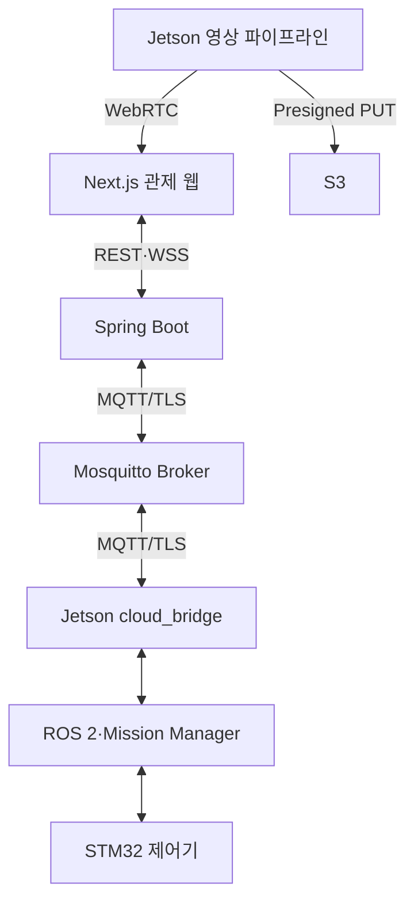
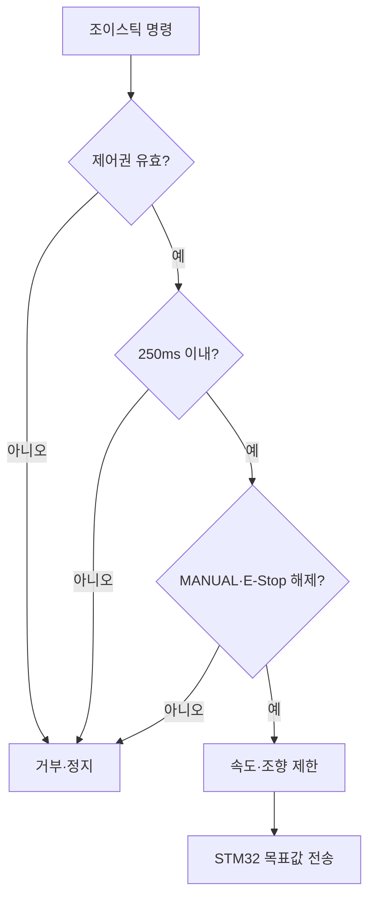

<!--
  GENERATED FILE - DO NOT EDIT DIRECTLY.
  Source: docs/specifications/Sentinel_UGV_최종_통합_명세서_v1.0-rc1.md
  Generator: scripts/docs/split-integrated-spec.ps1
-->

> 기준 문서: Sentinel UGV 통합 명세서 v1.0-rc1 (2026-07-22). 변경은 전체본에 반영한 뒤 분할 스크립트를 실행합니다.

# 31. Jetson - Spring Boot - 관제 웹 통신 설계

## 31-1. 추천 결론

Sentinel UGV의 통신은 하나의 프로토콜로 통합하지 않고 데이터 성격에 따라 나눈다.

| 구간 | 프로토콜 | 주요 용도 |
|---|---|---|
| Jetson ↔ EC2 | MQTT 5 over TLS | 차량 상태, 이벤트, 명령, ACK, 연결 상태 |
| Jetson ↔ Spring Boot | HTTPS REST | 이벤트 영상 업로드 준비, 메타데이터 등록, 재전송 배치 |
| Next.js ↔ Spring Boot | HTTPS REST | 임무 생성, 이력·지도·탐지 결과 조회 |
| Next.js ↔ Spring Boot | STOMP over WSS | 실시간 상태·이벤트 수신, 조이스틱 명령 전달 |
| Jetson ↔ 브라우저 | WebRTC | 저지연 실시간 영상·음성 |
| Jetson 내부 | ROS 2 DDS | SLAM, Nav2, YOLO, Mission Manager 노드 통신 |
| Jetson ↔ STM32 | USB CDC 우선 | 좌·우 트랙 목표 속도, 엔코더·오류·E-Stop 상태 |

ROS 2 DDS를 인터넷 구간까지 직접 확장하지 않는다. ROS 토픽은 크기와 주기가 다양하고 네트워크 설정이 복잡하므로, Jetson의 `cloud_bridge_node`가 관제에 필요한 데이터만 JSON 메시지로 변환한다.



---

## 31-2. 기존 명세서와 변경안 비교

### 기존 명세서 방식

Sub PJT 3은 Raspberry Pi를 TCP 서버, Jetson을 TCP 클라이언트로 두는 단일 소켓 통신 예제를 제시한다. 이 방식은 소켓의 기본 원리를 학습하기에는 적합하지만 Sentinel의 차량·관제·웹·파일 전송 전체를 담당하기에는 부족하다.

### 변경 이유

- 재연결 후 구독 복구와 여러 종류의 메시지 분배가 필요하다.
- 차량 명령, 센서 상태, 사람 탐지 이벤트의 신뢰도 요구가 서로 다르다.
- 브라우저가 TCP 소켓에 직접 연결하기 어렵다.
- 파일과 영상은 메시지 브로커를 거치지 않고 별도 업로드해야 한다.
- 네트워크 단절 시 차량을 즉시 정지하고 중요 이벤트를 나중에 재전송해야 한다.

### 대안 비교

| 방식 | 장점 | 단점 | 판단 |
|---|---|---|---|
| 순수 TCP 소켓 | 지연이 낮고 단순한 시험이 쉬움 | 프레이밍·재연결·구독·ACK·다중 클라이언트를 직접 구현 | 학습용 또는 Jetson-STM32 외에는 비추천 |
| REST만 사용 | 구현과 디버깅이 쉬움 | 실시간 양방향 상태와 조이스틱에 부적합 | 조회·등록용으로 사용 |
| WebSocket만 사용 | 브라우저 양방향 통신에 적합 | 차량 오프라인 처리·QoS·메시지 영속성을 직접 구현 | 웹 실시간 구간에 사용 |
| MQTT만 사용 | 경량 Pub/Sub, QoS, LWT, 재연결에 유리 | 파일 전송과 일반 웹 조회에 부적합 | 차량 메시지의 중심으로 사용 |
| MQTT + REST + WebSocket | 각 데이터에 맞는 역할 분리 | 구성 요소가 늘어남 | Sentinel 최종 추천 |

구현 난이도는 중간 수준이다. 다만 MQTT는 `cloud_bridge`, REST는 파일·이력, WebSocket은 관제 화면으로 책임이 명확하여 팀이 병렬 개발하기 쉽고 4~6주 내 구현 가능성이 높다.

---

## 31-3. 서버 구성

EC2에는 다음 컨테이너를 둔다.

```text
Nginx
├─ HTTPS REST /api/* → Spring Boot
├─ WSS /ws          → Spring Boot STOMP
└─ Next.js 정적·SSR 요청

Spring Boot
├─ Mission API
├─ MQTT Gateway
├─ WebSocket Gateway
├─ Telemetry·Event 저장
├─ Control Lease 관리
└─ S3 Presigned URL 발급

Mosquitto
├─ Jetson MQTT 연결
└─ Spring Boot MQTT 연결

PostgreSQL + TimescaleDB
S3
```

초기에는 Spring의 단순 STOMP 브로커를 사용한다. 관제 서버가 한 대이므로 RabbitMQ나 Kafka를 추가하지 않는다.

### 권장 클라이언트

| 구성 요소 | 권장 구현 |
|---|---|
| Jetson | Python `paho-mqtt` MQTT 5 클라이언트 |
| Spring Boot | Eclipse Paho MQTT v5 비동기 클라이언트를 감싼 `MqttGateway` |
| 웹 | `@stomp/stompjs` |
| MQTT Broker | Eclipse Mosquitto |

---

## 31-4. MQTT 토픽 규칙

기본 형식:

```text
sentinel/v1/robots/{robotId}/{channel}
```

| 토픽 | 발행 → 구독 | QoS | Retain | 주기·조건 |
|---|---|---:|---:|---|
| `presence` | Jetson → Spring | 1 | O | 접속·종료·LWT |
| `state` | Jetson → Spring | 1 | O | 상태 변경 및 1초 heartbeat |
| `telemetry` | Jetson → Spring | 0 | X | 임무 중 2Hz |
| `events` | Jetson → Spring | 1 | X | 탐지·오류·상태 전환 즉시 |
| `acks` | Jetson → Spring | 1 | X | 명령 수락·거부·완료 시 |
| `cmd/mission` | Spring → Jetson | 1 | X | 시작·일시정지·재개·종료 |
| `cmd/mode` | Spring → Jetson | 1 | X | MANUAL·AUTO 전환 |
| `cmd/drive` | Spring → Jetson | 0 | X | 수동 조작 중 20Hz |
| `cmd/stop` | Spring → Jetson | 1 | X | 조이스틱 해제·제어권 상실 |
| `cmd/estop` | Spring → Jetson | 1 | X | 소프트웨어 E-Stop |

MQTT QoS 0은 유실될 수 있지만 다음 속도 명령이 곧 도착하는 `cmd/drive`와 반복 telemetry에 적합하다. QoS 1은 최소 한 번 전달되므로 이벤트와 상태 명령에 사용하되 중복 도착을 고려해야 한다. 모든 명령은 `commandId`로 멱등 처리한다.

### Retain 규칙

- 현재 연결·운영 상태인 `presence`, `state`만 Retain을 사용한다.
- 과거 명령이 재연결 직후 실행되는 것을 막기 위해 모든 `cmd/*` 토픽은 Retain을 금지한다.
- Jetson은 재연결 후 `SAFE_IDLE/STOP` 또는 현재 로컬 안전 상태를 서버와 동기화하며 자동 주행을 재개하지 않는다.

### 연결 상태

Jetson은 MQTT Last Will을 다음처럼 등록한다.

```json
{
  "robotId": "SENTINEL-01",
  "status": "OFFLINE",
  "reason": "MQTT_CONNECTION_LOST"
}
```

정상 접속 후에는 같은 `presence` 토픽에 `ONLINE`을 Retain 메시지로 발행한다. MQTT 연결 감지는 관제 표시용이며 모터 안전 정지에는 사용하지 않는다. 모터는 Jetson과 STM32의 300ms 로컬 watchdog으로 더 빠르게 정지한다.

---

## 31-5. 공통 JSON 봉투

MQTT와 WebSocket의 모든 메시지는 공통 필드를 사용한다.

```json
{
  "schemaVersion": "1.0",
  "messageId": "89b15463-af53-41e9-8aed-e16ae1721d2e",
  "messageType": "ROBOT_TELEMETRY",
  "robotId": "SENTINEL-01",
  "missionId": "4a43f45c-779f-4df5-ac04-1695724829a4",
  "sequence": 10231,
  "sentAt": "2026-07-22T06:30:15.123Z",
  "data": {}
}
```

| 필드 | 설명 |
|---|---|
| `schemaVersion` | 메시지 호환성 버전 |
| `messageId` | 중복 저장 방지용 UUID |
| `messageType` | 메시지 종류 |
| `robotId` | 차량 식별자 |
| `missionId` | 임무 외 상태이면 `null` 가능 |
| `sequence` | 같은 발행자 내 순서 확인용 증가 번호 |
| `sentAt` | Jetson에서 생성한 UTC 시각 |
| `data` | 메시지별 본문 |

Jetson과 EC2는 NTP로 시간을 동기화한다. 서버는 별도로 `receivedAt`을 기록하여 전송 지연과 시계 오차를 확인한다.

---

## 31-6. 주요 MQTT 메시지

### Telemetry

```json
{
  "schemaVersion": "1.0",
  "messageId": "f4053b8f-6070-4395-b931-a68019337254",
  "messageType": "ROBOT_TELEMETRY",
  "robotId": "SENTINEL-01",
  "missionId": "4a43f45c-779f-4df5-ac04-1695724829a4",
  "sequence": 10231,
  "sentAt": "2026-07-22T06:30:15.123Z",
  "data": {
    "pose": {"x": 4.31, "y": 1.82, "yaw": 0.74, "mapId": "4f87365c-c914-4ba5-8e47-34417cd38c52"},
    "motion": {"linearVelocityMps": 0.24, "angularVelocityRadps": 0.05},
    "battery": {"voltage": 14.7, "percent": 72.0},
    "environment": {"temperatureC": 28.4, "humidityPercent": 55.1},
    "compute": {"cpuPercent": 47.2, "gpuPercent": 63.0, "memoryPercent": 58.3, "jetsonTempC": 61.0},
    "health": {"mcuConnected": true, "lidarOk": true, "cameraOk": true},
    "missionState": "EXPLORING"
  }
}
```

### 다중 인원 발견 이벤트

```json
{
  "schemaVersion": "1.0",
  "messageId": "8130e47a-ad21-4eed-aec4-ab478722b9ae",
  "messageType": "ENCOUNTER_CONFIRMED",
  "robotId": "SENTINEL-01",
  "missionId": "4a43f45c-779f-4df5-ac04-1695724829a4",
  "sequence": 10244,
  "sentAt": "2026-07-22T06:30:21.440Z",
  "data": {
    "encounterId": "8b7b90dc-c0fb-4e57-9359-c30fb0528d75",
    "mapPose": {"x": 5.22, "y": 2.16, "yaw": 0.81, "mapId": "4f87365c-c914-4ba5-8e47-34417cd38c52"},
    "personCount": 3,
    "persons": [
      {"trackId": 12, "confidence": 0.91},
      {"trackId": 13, "confidence": 0.87},
      {"trackId": 14, "confidence": 0.79}
    ],
    "recordingState": "RECORDING",
    "preBufferSec": 3
  }
}
```

### 수동 주행 명령

```json
{
  "schemaVersion": "1.0",
  "messageId": "40ac11fb-4d02-4214-b9ae-6d66f44f1964",
  "messageType": "MANUAL_DRIVE_COMMAND",
  "robotId": "SENTINEL-01",
  "missionId": "4a43f45c-779f-4df5-ac04-1695724829a4",
  "sequence": 884,
  "sentAt": "2026-07-22T06:31:10.200Z",
  "data": {
    "controlSessionId": "a4e1a044-7825-4214-b0c4-1945157bd9c9",
    "linear": 0.35,
    "angular": -0.20,
    "deadman": true,
    "ttlMs": 250
  }
}
```

`linear`과 `angular`은 `-1.0~1.0` 정규화 값이다. Jetson은 차량 설정의 최대 선속도·각속도로 변환하고 안전 제한을 적용한다. `ttlMs`가 지난 명령, 이전 `sequence`, 유효하지 않은 제어 세션의 명령은 거부한다.

### 명령 ACK

```json
{
  "schemaVersion": "1.0",
  "messageId": "e38b2ce8-bc86-472c-88ed-71448e266009",
  "messageType": "COMMAND_ACK",
  "robotId": "SENTINEL-01",
  "missionId": "4a43f45c-779f-4df5-ac04-1695724829a4",
  "sequence": 10250,
  "sentAt": "2026-07-22T06:31:10.231Z",
  "data": {
    "commandId": "40ac11fb-4d02-4214-b9ae-6d66f44f1964",
    "status": "ACCEPTED",
    "reasonCode": null,
    "message": null
  }
}
```

ACK 상태:

```text
ACCEPTED
EXECUTED
REJECTED
EXPIRED
FAILED
```

고주기 `cmd/drive`는 매 메시지마다 ACK를 보내지 않고 최신 적용값을 `state`에 5~10Hz로 반영한다. 임무·모드·정지·E-Stop 명령은 개별 ACK를 보낸다.

---

## 31-7. REST API

REST는 이력 조회, 임무 관리 요청, 파일 업로드 절차에 사용한다.

| Method | URI | 기능 |
|---|---|---|
| `POST` | `/api/v1/missions` | 임무 생성 |
| `GET` | `/api/v1/missions` | 과거 임무 목록 |
| `GET` | `/api/v1/missions/{missionId}` | 임무 요약 조회 |
| `POST` | `/api/v1/missions/{missionId}/commands` | 시작·일시정지·재개·종료 요청 |
| `GET` | `/api/v1/missions/{missionId}/path` | 지도 위 주행 경로 조회 |
| `GET` | `/api/v1/missions/{missionId}/events` | 이벤트 타임라인 조회 |
| `GET` | `/api/v1/missions/{missionId}/encounters` | 발견 이벤트와 피해자 목록 |
| `GET` | `/api/v1/encounters/{encounterId}` | 영상·탐지·대화 요약 조회 |
| `POST` | `/api/v1/control-sessions` | 단일 조종자 제어권 획득 |
| `POST` | `/api/v1/control-sessions/{id}/heartbeat` | 제어권 유지 |
| `DELETE` | `/api/v1/control-sessions/{id}` | 제어권 반납 |
| `POST` | `/api/v1/media/uploads` | S3 업로드 URL 발급 |
| `POST` | `/api/v1/media/uploads/{mediaId}/complete` | 업로드 완료·체크섬 등록 |

### 임무 명령 응답

Spring Boot가 MQTT 명령을 발행했다는 것은 실제 실행 완료를 의미하지 않는다. REST는 `202 Accepted`를 반환하고, 최종 결과는 WebSocket과 MQTT ACK로 전달한다.

```json
{
  "commandId": "73512533-b3cf-419e-8420-9493a4709a56",
  "status": "PENDING",
  "requestedAt": "2026-07-22T06:40:00.000Z"
}
```

### 이벤트 영상 업로드

1. Jetson이 이벤트 MP4를 로컬에 안전하게 마무리한다.
2. `POST /api/v1/media/uploads`로 파일명, 크기, 체크섬, `encounterId`를 보낸다.
3. Spring Boot가 짧은 유효기간의 S3 Presigned PUT URL을 반환한다.
4. Jetson이 Spring Boot를 거치지 않고 S3에 직접 업로드한다.
5. 완료 API를 호출하면 `media_assets.storage_status`를 `AVAILABLE`로 변경한다.
6. 실패하면 `UPLOAD_PENDING`으로 두고 SQLite Outbox가 재시도한다.

Presigned URL은 AWS 자격 증명을 Jetson에 저장하지 않고 특정 객체만 제한적으로 업로드하기 위해 사용한다.

---

## 31-8. 관제 웹 WebSocket

Spring Boot는 STOMP over WebSocket 엔드포인트를 제공한다.

```text
연결 엔드포인트: /ws
애플리케이션 입력 prefix: /app
구독 prefix: /topic, /user
```

### 브라우저 구독

| Destination | 내용 |
|---|---|
| `/topic/robots/{robotId}/state` | 연결, 배터리, 센서, 모드, 현재 위치 |
| `/topic/missions/{missionId}/telemetry` | 지도 위 실시간 궤적 |
| `/topic/missions/{missionId}/events` | 사람 탐지, 오류, E-Stop, 임무 상태 |
| `/topic/missions/{missionId}/encounters` | 인원 수, 상호작용 상태, 업로드 상태 |
| `/user/queue/commands` | 해당 조작자가 보낸 명령의 ACK·거부 사유 |
| `/user/queue/control-session` | 제어권 획득·만료 알림 |

### 브라우저 발행

| Destination | 내용 |
|---|---|
| `/app/robots/{robotId}/drive` | 조이스틱 값, 20Hz |
| `/app/robots/{robotId}/stop` | 조이스틱 해제 즉시 정지 |
| `/app/robots/{robotId}/estop` | 소프트웨어 E-Stop |

SockJS는 기본으로 사용하지 않는다. 최신 브라우저의 Native WebSocket을 사용하고 연결 실패 시 재연결과 화면 경고를 구현한다.

---

## 31-9. 단일 조종자 제어권과 안전 정지

한 번에 한 명만 차량을 조종할 수 있도록 `Control Lease`를 사용한다. Lease는 서버가 일정 시간 동안 특정 브라우저에 조종 권한을 빌려주는 방식이다.

```text
조종 시작 버튼
→ Control Session 발급
→ 브라우저가 2초마다 heartbeat
→ 조이스틱 명령에 controlSessionId 포함
→ heartbeat가 6초 이상 끊기면 Lease 만료
→ Spring Boot가 STOP 발행
```

### 수동 조작 안전 규칙

- 브라우저는 조이스틱을 누르는 동안만 `deadman=true` 명령을 20Hz로 보낸다.
- 마우스·터치 해제, 창 숨김, 브라우저 종료, WebSocket 종료 시 즉시 `STOP`을 보낸다.
- Jetson은 유효한 주행 명령이 300ms 이상 오지 않으면 목표 속도를 0으로 만든다.
- STM32도 Jetson 명령이 300ms 이상 끊기면 독립적으로 모터 출력을 정지한다.
- Mission Manager가 `MANUAL` 모드일 때만 수동 주행 명령을 수락한다.
- E-Stop 상태에서는 속도 명령과 모드 전환을 거부한다.
- 소프트웨어 E-Stop과 별개로 물리 E-Stop이 모터 전원을 직접 차단해야 한다.



---

## 31-10. 재연결, 중복, Outbox 정책

### 메시지별 처리

| 데이터 | 단절 중 처리 | 복구 후 처리 |
|---|---|---|
| 주행 명령 | 저장하지 않고 즉시 폐기 | STOP·IDLE에서 새 명령 대기 |
| 일반 telemetry | 최신값 중심, 긴 backlog 금지 | 최신 상태부터 재개 |
| Mission 이벤트 | SQLite Outbox에 저장 | `messageId` 유지 후 재전송 |
| 탐지·encounter·보고 | SQLite Outbox에 저장 | ACK까지 재시도 |
| 이벤트 영상 | 로컬 파일과 업로드 작업 저장 | Presigned URL 재발급 후 업로드 |

### 중복 처리

MQTT QoS 1은 같은 메시지가 중복 전달될 수 있으므로 서버는 다음 규칙을 적용한다.

```text
mission_events.message_id UNIQUE
detections.detection_id UNIQUE
encounters.encounter_id UNIQUE
media_assets.media_id UNIQUE
commands.command_id UNIQUE
```

동일 ID가 다시 도착하면 새 행을 만들지 않고 기존 처리 결과를 ACK한다.

### 재연결 지수 백오프

```text
1초 → 2초 → 4초 → 8초 → 최대 30초
```

재연결에 성공하면 다음 순서로 복구한다.

1. `presence=ONLINE` 발행
2. 현재 `state` 발행
3. 서버와 활성 임무 ID 비교
4. 중요 Outbox 이벤트 재전송
5. 이벤트 영상 업로드 재개
6. 실시간 telemetry 재개

재연결만으로 자율주행이나 수동주행을 자동 재개하지 않는다. 관제자가 상태를 확인한 뒤 명시적으로 재개해야 한다.

---

## 31-11. 보안과 포트

| 포트 | 용도 | 공개 범위 |
|---:|---|---|
| `443` | Next.js, REST HTTPS, STOMP WSS | 관제 PC 접근 허용 |
| `8883` | MQTT over TLS | Jetson 및 서버 인증 클라이언트 |
| `5432` | PostgreSQL | 외부 공개 금지 |
| WebRTC 포트 | Jetson 직접 영상 | 32장에서 시연망 기준 확정 |

### 최소 보안 요구

- MQTT 평문 `1883`을 인터넷에 공개하지 않는다.
- Mosquitto는 익명 접속을 차단하고 차량별 계정과 ACL을 적용한다.
- Jetson 계정은 자신의 `telemetry/state/events/acks`만 발행하고 자신의 `cmd/*`만 구독할 수 있다.
- Spring Boot 서비스 계정만 모든 차량 토픽에 접근한다.
- REST와 WebSocket은 HTTPS/WSS만 사용한다.
- EC2 환경 변수와 Secret 파일에 비밀번호를 저장하고 Git에 올리지 않는다.
- 회원가입·프로필 기능은 제외하더라도, 인터넷에 공개되는 조종 API에는 최소한 운영자 PIN 또는 짧은 수명의 토큰 인증을 둔다.
- Presigned URL은 짧은 시간만 유효하게 발급하고 `object_key`와 파일 종류를 서버가 결정한다.

---

## 31-12. 구현 모듈 구조

```text
jetson/
├─ ros2_ws/src/cloud_bridge/
│  ├─ cloud_bridge_node.py
│  ├─ mqtt_client.py
│  ├─ message_mapper.py
│  ├─ outbox_repository.py
│  └─ schemas/
├─ media_uploader/
│  ├─ upload_client.py
│  └─ upload_worker.py
└─ config/
   └─ communication.yaml

backend/
└─ src/main/java/.../
   ├─ mqtt/
   │  ├─ MqttGateway.java
   │  ├─ RobotMessageHandler.java
   │  └─ TopicPolicy.java
   ├─ websocket/
   │  ├─ WebSocketConfig.java
   │  └─ ControlMessageController.java
   ├─ control/
   │  ├─ ControlLeaseService.java
   │  └─ CommandService.java
   ├─ mission/
   ├─ telemetry/
   ├─ encounter/
   └─ media/

common/
├─ schemas/
│  ├─ envelope.schema.json
│  ├─ telemetry.schema.json
│  ├─ command.schema.json
│  └─ encounter.schema.json
└─ docs/
   └─ protocol.md
```

Python과 Java가 같은 JSON 계약을 사용하도록 `common/schemas`에 JSON Schema를 두고 CI에서 예제 메시지를 검증한다.

---

## 31-13. 구현 및 검증 순서

### 1단계 - MQTT 연결

1. EC2 Mosquitto TLS·계정·ACL 설정
2. Jetson `presence`, `state`, `telemetry` 발행
3. Spring Boot 구독 및 DB 저장
4. Wi-Fi 차단 후 LWT와 자동 재연결 확인

### 2단계 - 명령과 ACK

1. Mission·Mode·Stop 명령 구현
2. `commandId` 중복 방지 구현
3. 명령 만료와 잘못된 상태 거부 확인
4. Jetson·STM32 300ms watchdog 시험

### 3단계 - 관제 WebSocket

1. MQTT 수신 상태를 STOMP로 브라우저에 전달
2. 지도·배터리·센서 실시간 표시
3. Control Lease와 단일 조종자 제한
4. 조이스틱 20Hz·창 종료·연결 끊김 정지 시험

### 4단계 - 이벤트와 영상

1. 다중 인원 `encounter` 이벤트 전송
2. SQLite Outbox 재전송
3. S3 Presigned PUT 업로드
4. 과거 이력에서 썸네일·이벤트 영상 재생

### 필수 통합 시험

| 시험 | 기대 결과 |
|---|---|
| MQTT 차단 | 300ms 내 모터 정지, 관제 OFFLINE 표시 |
| QoS 1 이벤트 중복 전송 | DB에는 한 번만 저장 |
| 오래된 `cmd/drive` 재전송 | Jetson이 `EXPIRED`로 거부 |
| 관제 브라우저 2개 접속 | 한 명만 Control Lease 획득 |
| 브라우저 강제 종료 | Lease 만료 및 STOP |
| EC2 연결 중 영상 이벤트 발생 | 로컬 보관 후 복구 시 업로드 |
| 한 화면에 사람 3명 | encounter 1개, 피해자 후보 3명, 영상 1개 생성 |

---

## 31-14. 범위 우선순위

### 필수

- MQTT TLS 연결과 자동 재연결
- `presence`, `state`, `telemetry`, `events`, `cmd/mission`, `cmd/stop`, `acks`
- 메시지 UUID 기반 중복 방지
- Jetson·STM32 300ms watchdog
- REST 임무·이력 조회
- STOMP 실시간 상태 표시
- 이벤트 영상 Presigned PUT 업로드

### 선택

- 웹 조이스틱과 Control Lease
- MQTT 5 Message Expiry 보조 적용
- telemetry 단절 구간 배치 복원
- 개인별 음성 응답 연결

### 확장

- 차량별 X.509 클라이언트 인증서
- 다중 차량 관제
- 별도 외부 STOMP Broker
- VPN 기반 사설 차량망

---

## 31장 최종 확정안

> Sentinel UGV는 Jetson과 EC2 사이의 실시간 상태·이벤트·명령에 MQTT 5 over TLS를 사용하고, 임무 이력 및 미디어 업로드 절차에는 HTTPS REST를 사용한다. 관제 웹은 Spring Boot와 STOMP over WSS로 실시간 상태와 명령 결과를 교환하며, 실시간 영상은 메시지 서버를 거치지 않고 Jetson에서 브라우저로 WebRTC 전송한다. 고주기 수동 주행 명령은 QoS 0과 250ms TTL을 사용하고, 정지·E-Stop·임무 명령 및 중요 이벤트는 QoS 1과 UUID 기반 멱등 처리를 적용한다. 네트워크 단절 시 Jetson과 STM32의 300ms watchdog이 차량을 정지시키며, 중요 이벤트와 이벤트 영상은 Jetson의 SQLite Outbox 및 로컬 저장소에 보관한 뒤 연결 복구 후 재전송한다.

---

## 참고 근거

- SSAFY Sub PJT 2, p.115: 1분 영상 지속 저장 요구
- SSAFY Sub PJT 3, p.18: Raspberry Pi-Jetson TCP 소켓 통신 예제
- SSAFY Sub PJT 3, p.72: 주행 경로와 탐지 객체 위치의 웹 서버 전송 요구
- OASIS MQTT 5.0: https://docs.oasis-open.org/mqtt/mqtt/v5.0/mqtt-v5.0.html
- Eclipse Paho Python Client: https://eclipse.dev/paho/files/paho.mqtt.python/html/
- Spring Framework STOMP over WebSocket: https://docs.spring.io/spring-framework/reference/web/websocket/stomp.html
- Amazon S3 Presigned Upload: https://docs.aws.amazon.com/AmazonS3/latest/userguide/PresignedUrlUploadObject.html
