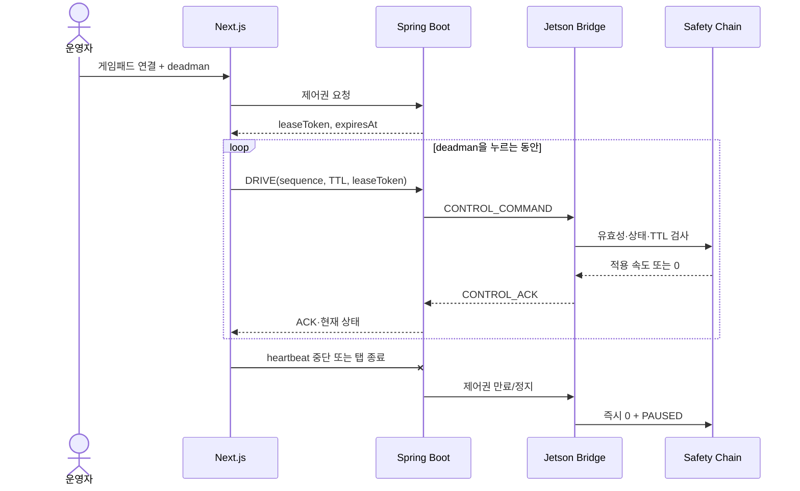
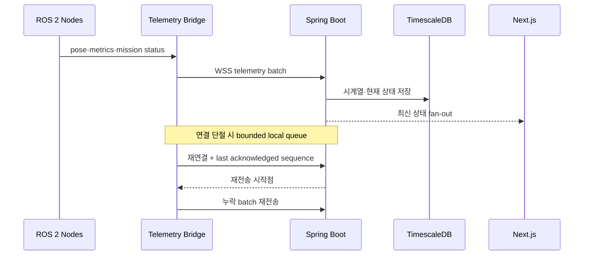

# Control and Telemetry

> 기준: 통합 프로젝트 명세서 v0.9, 5·11·12·13장
> 상태: 채널과 안전 의미 **확정**, 구체 필드·endpoint는 **잠정 확정**

## 설계 원칙

- 영상, 제어·텔레메트리, 이력 조회 경로를 분리합니다.
- Jetson이 서버로 아웃바운드 연결을 시작해 현장 NAT 환경에서도 연결할 수 있게 합니다.
- 모든 외부 메시지는 버전, 메시지 ID, 발신 시각, 로봇 ID와 필요한 경우 임무 ID를 포함합니다.
- 수동 제어의 안전 여부는 ACK 수신이 아니라 Jetson의 TTL, deadman, watchdog으로 결정합니다.
- 재연결은 중복 전송을 전제로 하며 message ID 또는 idempotency key로 중복을 제거합니다.

## 채널 분리

| 채널 | 사용 사례 | 생산자 → 소비자 | 안전·복구 특성 |
|---|---|---|---|
| REST/HTTPS | 임무 생성·이력·미디어 URL·설정 | Browser/Jetson ↔ Backend | 상태 변경은 멱등성 키 검토 |
| WebSocket/WSS | 상태, 텔레메트리, 탐지, 제어, ACK, heartbeat | Jetson ↔ Backend ↔ Browser | sequence, 재연결, 최신 상태 동기화 |
| WebRTC/WHEP | 로컬·원격 영상 | Jetson/MediaMTX → Browser | 제어 경로와 장애 격리 |
| Presigned URL | S3 업로드·조회 | Backend 발급, Jetson/Browser 사용 | AWS 키 비노출, 만료 시간 제한 |
| ROS 2 DDS | 로봇 내부 센서·인지·주행 | Jetson 노드 간 | 외부 계약과 직접 결합하지 않음 |

## 공통 메시지 envelope

기계 검증 가능한 최종 정의는 `common/schemas`에서 버전 관리합니다. 초기 envelope는 다음 의미를 가져야 합니다.

```json
{
  "schemaVersion": "1.0",
  "type": "TELEMETRY",
  "messageId": "uuid",
  "robotId": "sentinel-01",
  "missionId": "uuid-or-null",
  "sequence": 152,
  "sentAt": "2026-07-17T01:30:00.123Z",
  "payload": {}
}
```

| 필드 | 규칙 |
|---|---|
| `schemaVersion` | 파괴적 변경은 새 major 버전으로 분리합니다. |
| `type` | payload discriminator이며 소비자가 모르는 type은 실행하지 않고 기록합니다. |
| `messageId` | 재전송 중복 제거와 추적에 사용하는 UUID입니다. |
| `robotId` | 장치 설정에서 주입하며 샘플에는 실제 운영 ID를 쓰지 않습니다. |
| `missionId` | 임무 외 health 메시지는 `null`일 수 있습니다. |
| `sequence` | 연결 단위 단조 증가값으로 누락·역전 감지에 사용합니다. |
| `sentAt` | UTC RFC 3339 형식을 사용하고 수신 시각은 별도 저장합니다. |
| `payload` | type별 JSON Schema로 검증합니다. |

로봇과 서버 시계 차이가 안전 TTL을 무력화하지 않도록, 제어 명령 수신 후 경과 시간은 가능하면 monotonic clock으로 계산합니다.

## 수동 제어 흐름



### 제어 명령 필수 조건

- 유효한 `leaseToken`을 가진 현재 세션이어야 합니다.
- `deadman=true`인 DRIVE 명령만 이동을 허용합니다.
- 기본 명령 TTL은 `MANUAL_CMD_TTL_MS=400`입니다.
- sequence가 역전되거나 이미 처리한 command ID이면 실행하지 않습니다.
- ESTOP, ERROR 또는 핵심 health 실패 상태에서는 DRIVE를 거절합니다.
- 제한기를 적용한 실제 `linearX`, `angularZ`를 ACK에 기록합니다.

### 제어권 임대

- 한 로봇에는 한 세션만 활성 제어권을 가집니다.
- 기본 lease TTL은 `CONTROL_LEASE_TTL_MS=3000`입니다.
- heartbeat 중단, WebSocket 종료, 탭 종료, 운영자 반납 시 회수합니다.
- lease 만료는 Jetson의 명령 watchdog보다 느린 서버 측 권한 회수 장치이며, 모터 정지를 대신하지 않습니다.

## 텔레메트리와 상태 동기화



- pose는 초기 2~5Hz, robot/network metrics는 1Hz, 환경 센서는 0.2~0.5Hz를 시작점으로 사용합니다.
- UI 갱신 주기와 DB 저장 주기는 분리할 수 있습니다.
- 서버는 `receivedAt`과 Jetson의 `sentAt`을 함께 저장해 지연과 시계 오차를 분석합니다.
- 큐는 무제한 성장하지 않도록 용량과 보존 시간을 설정하고 초과 시 집계 데이터부터 유지합니다.

## 재연결과 중복 처리

1. Jetson은 지수 backoff에 상한과 jitter를 적용해 WSS를 재연결합니다.
2. 새 연결에서 robot ID, software version, 마지막 ACK sequence와 현재 mission state를 전송합니다.
3. Backend가 알고 있는 mission과 다르면 자동 명령 실행 없이 충돌 상태를 알립니다.
4. 미전송 telemetry와 event를 message ID 기준으로 재전송합니다.
5. 제어 명령은 재연결 후 자동 재생하지 않습니다. 새 lease와 명시적 운영자 입력이 필요합니다.

## 이벤트와 미디어 업로드

```text
Jetson 이벤트 판정
→ Backend에 event metadata 생성
→ Presigned upload URL 요청
→ snapshot/clip 직접 업로드
→ READY 상태 보고
```

네트워크 또는 S3 장애 시 `LOCAL_ONLY → PENDING → UPLOADING → READY` 순으로 복구합니다. event ID와 S3 key는 재시도해도 같은 객체를 가리키도록 멱등하게 생성합니다.

## REST 책임 범위

다음 endpoint 그룹을 v1 계약의 출발점으로 사용합니다. 상세 request/response는 OpenAPI 작성 이슈에서 확정합니다.

| 그룹 | 대표 endpoint | 주의사항 |
|---|---|---|
| 임무 명령 | `/api/missions`, `/{id}/start|pause|resume|return|stop` | 현재 상태와 허용 전이를 서버·로봇 양쪽에서 검증 |
| 임무 조회 | `/api/missions`, `/{id}/telemetry`, `/{id}/events` | pagination과 시간 범위 필수 |
| 로봇 안전 | `/api/robots/{id}/estop`, `/estop/release` | E-Stop 해제는 추가 확인과 감사 로그 필수 |
| 로봇 상태 | `/api/robots/{id}/health` | 장치별 health와 freshness 포함 |
| 미디어 | `/api/media/presign-upload`, `/{id}/presign-view` | MIME, 크기, 만료, object key 제한 |

## 오류 분류

| 분류 | 예시 | 기본 동작 |
|---|---|---|
| 연결 | `DEVICE_OFFLINE` | 제어 비활성화, 로컬 자율 정책 유지 |
| 핵심 센서 | `LIDAR_UNAVAILABLE`, `LOCALIZATION_LOST` | 정지 후 PAUSED/ERROR |
| 구동 | `MOTOR_NO_RESPONSE` | ESTOP, 치명 이벤트 |
| 운영 입력 | `GAMEPAD_DISCONNECTED`, `CONTROL_LEASE_DENIED` | 수동 정지 또는 조회 전용 |
| 저장 | `S3_UPLOAD_PENDING` | 로컬 보관 후 재시도 |
| 미디어 | `STREAM_LOCAL_FAILED` | REMOTE 전환 또는 조종 제한 경고 |

오류 payload에는 `errorCode`, `severity`, `component`, `occurredAt`, `recoverable`, `details`와 관련 message ID를 포함해야 합니다.

## 후속 계약 작업

- OpenAPI v1과 REST 오류 모델
- WebSocket/AsyncAPI 또는 type별 JSON Schema
- telemetry, detection, control command/ACK 샘플
- 정상, 만료, 중복, sequence gap, 재연결 샘플의 CI 검증
