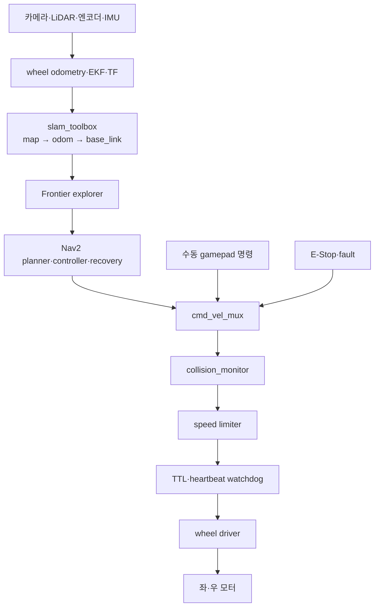

# Robot Runtime

> 기준: 통합 프로젝트 명세서 v0.9, 8·9·10·14장
> 상태: 책임과 안전 체인 **확정**, 하드웨어 파라미터와 성능값 **TBD**

## 런타임 목표

Jetson은 외부 네트워크 없이도 센서 입력, 위치 추정, 자율 탐사, 충돌 방지와 안전 정지를 수행해야 합니다. 관제 연결은 명령과 관측 가능성을 제공하지만 로컬 안전 루프의 전제 조건이 아닙니다.

## 처리 파이프라인



안전 체인을 거치지 않은 명령은 모터 드라이버에 전달할 수 없습니다.

## 패키지와 노드 경계

| 패키지 | 대표 노드·구성요소 | 책임 | 주요 인터페이스 |
|---|---|---|---|
| `sentinel_bringup` | launch, 공통 파라미터 | 의존 순서, 환경별 설정, lifecycle 조정 | launch arguments, health |
| `sentinel_drive` | wheel driver, odometry | 모터 출력, 엔코더 수집, 0 속도 종료 | `/cmd_vel`, `/odom_raw`, `/wheel_states` |
| `sentinel_perception` | camera capture, YOLO, human localizer | 카메라 단일 오픈, 탐지, 지도 좌표 후보 | `/camera/image_raw`, `/detections`, `/human_observations` |
| `sentinel_exploration` | mission manager, frontier explorer | 임무 상태, home pose, 종료·복귀 | `/mission/status`, NavigateToPose |
| `sentinel_safety` | mux, limiter, watchdog, collision monitor | 제어원 우선순위와 fail-safe 정지 | `/cmd_vel_nav`, `/cmd_vel_manual`, `/cmd_vel` |
| `sentinel_bridge` | telemetry, control, uploader | ROS와 관제 계약 변환, 재연결, pending 큐 | WSS, REST, Presigned URL |

실제 ROS 메시지 패키지와 토픽 이름은 `common/` 계약을 구현할 때 확정합니다. 여기의 이름은 모듈 경계 기준입니다.

## 기동 순서와 준비 상태

1. 모터 출력은 비활성 또는 0으로 시작합니다.
2. 장치 경로와 E-Stop 물리 상태를 확인합니다.
3. LiDAR, 카메라, IMU, 엔코더 드라이버를 시작합니다.
4. TF 정적 변환과 odometry/EKF를 확인합니다.
5. SLAM, Nav2, collision monitor와 safety mux를 활성화합니다.
6. mission manager가 핵심 장치 health를 집계합니다.
7. telemetry bridge와 미디어 경로를 연결합니다.
8. 필수 health가 모두 정상일 때만 `IDLE`로 전환하고 임무 시작을 허용합니다.

보조 장치인 온습도, EC2, S3, 원격 스트림 장애는 경고로 처리하고 로컬 탐사를 시작할 수 있습니다.

## TF 기준

```text
map
└─ odom
   └─ base_link
      ├─ base_footprint
      ├─ imu_link
      ├─ left_track_link
      ├─ right_track_link
      └─ gimbal_roll_link
         └─ gimbal_pitch_link
            ├─ laser_frame
            └─ camera_link
```

- `map → odom`은 SLAM 또는 localization이 담당합니다.
- `odom → base_link`는 wheel odometry와 EKF가 담당합니다.
- 능동 짐벌을 쓰지 않는 MVP fallback에서는 센서 프레임을 고정 TF로 단순화할 수 있습니다.
- LiDAR 스캔 중 짐벌 이동은 제한하며 NAV_LOCK에서 Yaw를 고정합니다.

## 탐사와 복귀 조건

- 도달 가능한 Frontier가 10초간 없으면 정지 후 저속 360도 재스캔을 수행합니다.
- 재스캔 후 후보가 없으면 탐사 완료로 판정합니다.
- 기본 최대 탐사 시간은 7분이며 설정 범위는 5~10분입니다.
- 사용자 종료 또는 배터리 20% 이하에서는 신규 Frontier 탐색을 중단하고 복귀합니다.
- 복귀 경로 생성 실패는 `PAUSED` 또는 `ERROR`로 전환하고 운영자 개입을 요청합니다.

## 사람 탐지 이벤트 흐름

1. person이 임계 confidence 이상으로 연속 3프레임 탐지됩니다.
2. 로봇을 2~3초 정지해 위치 계산을 안정화합니다.
3. Bounding Box 방향과 LiDAR 거리 후보를 결합합니다.
4. TF2로 후보를 `map` 좌표로 변환합니다.
5. 1m 이내·15초 이내 이벤트와 중복 여부를 확인합니다.
6. 신규 이벤트 또는 `last_seen` 갱신 결과를 bridge에 전달합니다.

LiDAR 거리 후보가 없으면 위치를 `UNKNOWN`으로 기록하고 영상 알림만 제공합니다. AI 결과는 충돌 회피의 단일 근거로 사용하지 않습니다.

## 카메라와 미디어 원칙

- 카메라는 `camera_capture_node` 또는 단일 GStreamer 파이프라인만 엽니다.
- 같은 프레임을 AI, WebRTC, 이벤트 링 버퍼에 분기합니다.
- 기본 이벤트 버퍼는 이전 5초와 이후 10초입니다.
- S3 업로드 실패 시 파일을 로컬 `pending` 상태로 유지합니다.
- frame ID 또는 capture timestamp로 영상과 탐지 메타데이터를 연결합니다.

## 종료와 예외 불변조건

- 정상 종료, SIGINT, SIGTERM, 예외 모두 마지막 출력은 0 속도여야 합니다.
- watchdog은 유효한 새 명령이 없으면 모터 출력을 비활성화합니다.
- Jetson 부팅·재부팅 중 모터 드라이버 기본 상태는 비활성입니다.
- `sentinel_safety`를 우회하는 직접 모터 명령 경로를 만들지 않습니다.

## 성능 기록

최적화 전에 다음을 같은 타임스탬프 기준으로 측정합니다.

- 카메라 입력·추론·관제 FPS와 프레임 드롭
- YOLO 지연, SLAM·Nav2 주기
- WebSocket RTT와 영상 end-to-end 지연
- CPU, GPU, 메모리, Jetson 온도
- 네트워크 업로드 대역폭과 rosbag 부하

모델, 해상도 또는 프로세스 구조 변경은 측정 결과와 rollback 기준을 Merge Request에 포함합니다.
