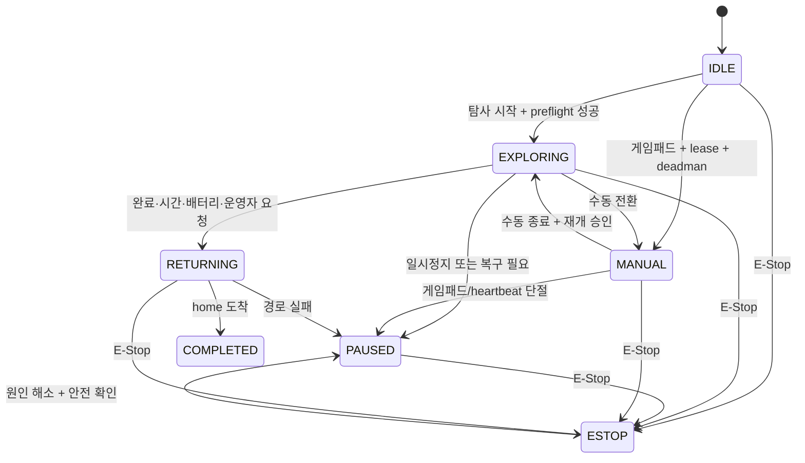

# Safety Policy

> 기준: 통합 프로젝트 명세서 v0.9, 2·8·11·14·16장 및 SR-001~006
> 상태: 안전 불변조건과 우선순위 **확정**, 하드웨어 임계값 **TBD**

## 적용 범위

이 정책은 프로젝트 시연 수준의 fail-safe 기준이며 산업용 기능 안전 인증을 의미하지 않습니다. 모터·E-Stop·전원·watchdog·제어권을 변경하는 구현과 테스트는 이 문서를 우회할 수 없습니다.

## 안전 불변조건

1. 프로그램 시작, 정상 종료, 예외, 재부팅 중 모터 출력은 0 또는 비활성입니다.
2. 물리 E-Stop은 Jetson과 소프트웨어 상태에 관계없이 모터 전원을 차단합니다.
3. 유효기간이 지난 명령과 deadman이 해제된 수동 명령은 실행하지 않습니다.
4. LiDAR, 모터 응답, 오도메트리 등 핵심 주행 상태가 유효하지 않으면 자율주행을 계속하지 않습니다.
5. 외부 서버 ACK는 모터 안전의 근거가 아닙니다.
6. 모든 자율·수동 명령은 safety mux, collision monitor, speed limiter, watchdog을 통과합니다.
7. E-Stop 해제는 주변 안전 확인과 원인 해소 없이는 이동 상태로 직접 전환하지 않습니다.

## 제어 우선순위

| 우선순위 | 제어원 | 하위 명령에 대한 효과 |
|---:|---|---|
| 1 | 물리 E-Stop·모터 전원 차단 | 모든 소프트웨어 출력 무효화 |
| 2 | 모터 드라이버 fault | ESTOP 및 이동 금지 |
| 3 | Collision Monitor·근거리 센서 | 감속 또는 즉시 0 |
| 4 | 소프트웨어 E-Stop | 모든 이동 명령 거절 |
| 5 | 유효한 수동 명령 | 자동 복귀·탐사 명령 대체 |
| 6 | 자동 복귀 | 자율 탐사 목표 대체 |
| 7 | 자율 탐사 | 상위 안전·운영 명령이 없을 때만 적용 |

## 상태와 모터 정책

| 상태 | 진입 의미 | 허용 제어원 | 모터 정책 |
|---|---|---|---|
| `OFFLINE` | 관제에서 Jetson 연결 미확인 | 로컬 safety 상태만 | 원격에서는 정지로 간주 |
| `IDLE` | 초기화 완료, 임무 대기 | 정지·상태 점검 | 0 |
| `EXPLORING` | Frontier 탐사 | Nav2 | safety 제한 적용 |
| `PAUSED` | 일시정지·복구 대기 | 정지, 제한적 복구 | 0 |
| `MANUAL` | 단일 lease 수동 조작 | deadman 수동 명령 | TTL·속도 제한 적용 |
| `RETURNING` | home pose 복귀 | Nav2 return goal | safety 제한 적용 |
| `COMPLETED` | 임무 종료 | 정지 | 0 |
| `ESTOP` | 비상 정지 | 해제 절차 외 없음 | 출력 차단 또는 0 |
| `ERROR` | 핵심 장치·제어 오류 | 진단·정지 | 0 |

## 시작 전 점검

### 필수 health

- Jetson runtime과 safety node
- 물리 E-Stop 상태와 모터 드라이버
- LiDAR freshness
- 엔코더와 odometry freshness
- SLAM/Localization과 Nav2 lifecycle
- 배터리 또는 전압 fallback
- 카메라: 사람 탐지 임무를 시작할 때 필수

하나라도 실패하면 탐사 시작을 차단합니다.

### 보조 health

- 온습도 센서
- EC2·S3
- 원격 스트림

실패 시 경고를 표시하되 로컬 탐사를 허용할 수 있습니다.

## watchdog과 기본 시간

| 항목 | 초기값 | 동작 |
|---|---:|---|
| 수동 command TTL | 400ms | 초과 명령 폐기, 즉시 0 |
| 게임패드/수동 heartbeat 정지 목표 | 500ms 이내 | MANUAL 종료, 0, PAUSED |
| 서버 control lease TTL | 3000ms | 제어권 회수, 새 명령 거절 |
| Frontier 없음 | 10초 | 정지·재스캔 후 종료 판단 |

시간값을 늘리는 변경은 네트워크 편의가 아니라 정지 거리와 실패 모드 분석을 근거로 해야 합니다.

## 장애 대응

| 장애 | 자율 모드 | 수동 모드 | 기록·복구 |
|---|---|---|---|
| EC2/WSS 단절 | 로컬 탐사 지속 | 즉시 정지 | bounded queue, 재연결 동기화 |
| S3 단절 | 지속 | 지속 | `LOCAL_ONLY`, 백오프 재업로드 |
| 로컬 영상 실패 | 지속 가능 | 원칙적으로 조종 제한 | REMOTE fallback 및 경고 |
| LiDAR stale/단절 | 즉시 정지 | 기본 금지, 별도 벤치 절차만 허용 | 치명 오류 |
| Localization 상실 | PAUSED/ERROR | 저속 복구는 별도 승인 | 오류 이벤트·TF 증적 |
| 모터 무응답 | ESTOP | 불가 | 치명 오류·전원 확인 |
| 카메라 단절 | AI 기능 중단 | 영상 없는 원격 조종 금지 | 경고, 탐사 정책 명시 |
| 온습도 단절 | 지속 | 지속 | 보조 센서 경고 |
| Jetson 과열 | 감속→복귀→정지 | 정지 | 온도와 throttle 기록 |

## 배터리 정책

배터리 퍼센트 계산이 검증되기 전에는 실측 전압 임계값 fallback을 함께 사용합니다.

| 추정 잔량 | 기본 동작 |
|---:|---|
| 30% 이하 | 관제 경고 |
| 20% 이하 | 신규 Frontier 중단, `RETURNING` |
| 10% 이하 | 안전 정지 |
| 측정 실패 | 운영자 경고, 전압 임계값 적용 |

최종 전압 임계값은 배터리·DC-DC·부하 시험 후 확정합니다.

## E-Stop 해제 절차

1. 모든 속도 명령을 0으로 고정합니다.
2. 정지 원인과 하드웨어 fault를 확인합니다.
3. 차량 주변과 바퀴·궤도 접촉 위험을 확인합니다.
4. 물리 E-Stop 회로 상태를 확인합니다.
5. 운영자가 UI 확인 절차를 수행합니다.
6. `IDLE` 또는 `PAUSED`로만 전환합니다.
7. 새 임무 또는 수동 lease를 명시적으로 다시 요청합니다.

E-Stop 해제와 동시에 이전 DRIVE 또는 Nav2 명령을 재생하지 않습니다.

## 구현 요구사항

- 모터 출력 코드는 `finally`, SIGINT, SIGTERM 처리에서 0을 보장합니다.
- watchdog은 제어 루프와 독립적으로 주기 실행하고 stale 시간을 monotonic clock으로 판단합니다.
- fault와 정지 이유는 timestamp, component, error code, 마지막 명령 ID와 함께 기록합니다.
- safety 파라미터는 환경별 설정 파일로 관리하되 임의의 runtime UI 변경을 허용하지 않습니다.
- 물리 안전 회로와 소프트웨어 E-Stop을 같은 기능으로 취급하지 않습니다.

## Merge 전 필수 증적

모터·E-Stop·전원·TTL 관련 변경은 다음을 포함해야 합니다.

- 차량을 바닥에서 띄운 벤치 테스트
- 물리 E-Stop 전원 차단 확인
- 프로그램 종료·예외·명령 만료 정지 로그
- 변경 전후 정지 시간과 최대 속도
- 실패 시 rollback 방법
- 임베디드 담당 리뷰
