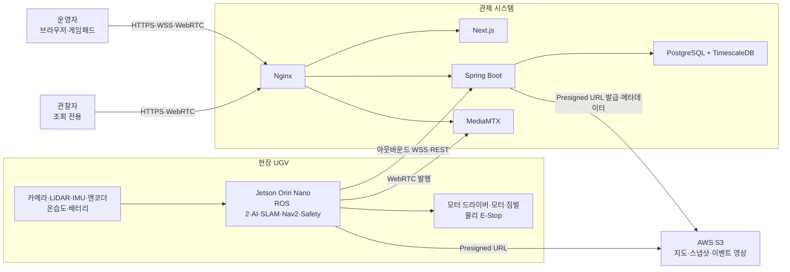

# 시스템 컨텍스트

> 기준: Sentinel UGV 통합 프로젝트 명세서 v0.9, 4·5·7·13장
> 상태: 시스템 경계 **확정**, 일부 하드웨어 및 인증 방식 **TBD**

## 목적과 범위

Sentinel UGV는 실내 재난 시연 공간을 로컬에서 자율 탐사하고, 사람 탐지와 장치 상태를 관제 시스템에 보고하는 단일 UGV 시스템입니다. 충돌 회피와 최종 모터 제어는 네트워크나 서버 상태와 무관하게 Jetson에서 수행합니다.

MVP는 다음 흐름을 하나의 임무로 연결합니다.

1. 새 지도와 home pose를 생성합니다.
2. Frontier와 Nav2로 미지 영역을 탐사합니다.
3. YOLO, LiDAR, TF로 사람 후보의 지도 위치를 계산합니다.
4. 실시간 영상·지도·텔레메트리·이벤트를 관제 화면에 표시합니다.
5. 탐사 종료 조건에서 home pose로 복귀합니다.
6. 임무 이력, 시계열, 지도와 이벤트 미디어를 조회합니다.

회원가입, 복수 UGV, GPS 실외 주행, 산업용 기능 안전, Kubernetes는 MVP 범위가 아닙니다.

## 시스템 경계

## 구성요소 책임

| 구성요소 | 책임 | 금지 또는 비책임 |
|---|---|---|
| Jetson | 센서 수집, AI, SLAM, 탐사, 경로 실행, 안전 제한, 모터·짐벌 명령, 로컬 미디어 큐 | 장기 이력 조회, 회원 관리, 서버 ACK에 의존한 안전 판단 |
| Spring Boot | 임무·이벤트·제어권 API, WebSocket 중계, 영속화, Presigned URL 발급 | 충돌 회피, 최종 속도 결정, 물리 E-Stop 해제 |
| Next.js | 실시간 관제, 게임패드 입력, 지도·영상·이벤트·이력 표시 | 단독 안전 판단, 모터에 직접 연결 |
| MediaMTX | 로컬 또는 원격 WebRTC 미디어 전달 | 제어·텔레메트리 전달, 이벤트 판정 |
| PostgreSQL/TimescaleDB | 관계 데이터, 시계열, 제어 감사 기록 | 대용량 미디어 원본 저장 |
| S3 | 지도, 스냅샷, 이벤트 영상, 선택 rosbag 저장 | 실시간 제어, 관계형 조회 |
| 물리 E-Stop | 소프트웨어와 무관한 모터 전원 차단 | 소프트웨어 상태 전환에만 의존 |

## 배치 프로필

### 개발 프로필

- 개발 PC에서 Git, Docker Desktop/Engine, Docker Compose를 사용합니다.
- PostgreSQL, MediaMTX, Nginx는 Compose로 검증합니다.
- Backend와 Frontend 이미지가 생성되기 전에는 Compose 설정 검증까지만 보장합니다.
- Jetson 없이 `common/samples`의 가짜 텔레메트리와 녹화 영상으로 개발합니다.

### 현장 로컬 프로필

- Jetson과 관제 브라우저가 같은 Wi-Fi에 연결됩니다.
- 영상은 Jetson MediaMTX에서 브라우저로 직접 전달하는 LOCAL 경로를 우선합니다.
- 서버 연결이 끊겨도 자율 탐사와 로컬 안전 판단은 유지합니다.
- 수동 제어 연결이 끊기면 로봇은 정지합니다.

### 원격 관제 프로필

- Jetson이 EC2로 아웃바운드 연결을 시작합니다.
- Nginx가 외부 HTTPS/WSS를 종료하고 내부 서비스는 직접 공개하지 않습니다.
- REMOTE 영상은 EC2 MediaMTX를 경유하며 제어 UI에 증가한 지연을 표시해야 합니다.

## 데이터 소유권과 저장 위치

| 데이터 | 실시간 생산자 | 기준 저장소 | 네트워크 단절 시 |
|---|---|---|---|
| 로봇 상태·텔레메트리 | Jetson | TimescaleDB | Jetson 로컬 큐 후 재전송 |
| 임무 상태 | Jetson mission manager + Backend | PostgreSQL | 재연결 시 상태 동기화 |
| 제어 요청·ACK | Browser, Backend, Jetson | PostgreSQL 감사 로그 | 새 수동 명령은 실행하지 않고 정지 |
| 사람 탐지 이벤트 | Jetson | PostgreSQL | 로컬 이벤트 큐 후 재전송 |
| 스냅샷·이벤트 영상 | Jetson | S3 | `LOCAL_ONLY`로 보관 후 재업로드 |
| 지도·경로 | Jetson | S3 + DB 메타데이터 | 임무 종료 후 업로드 재시도 |

## 외부 의존성 실패 원칙

- EC2 장애는 로컬 자율 탐사를 중단시키지 않습니다.
- S3 장애는 탐사를 중단시키지 않고 파일을 로컬 pending 큐에 보관합니다.
- 카메라 장애 시 사람 탐지는 중단하지만 LiDAR 기반 탐사 지속 여부는 안전 정책에 따릅니다.
- LiDAR, 모터, 오도메트리 핵심 장애는 자율주행을 중단하고 정지합니다.
- 영상 경로와 제어·텔레메트리 경로는 서로 장애를 전파하지 않도록 분리합니다.

## 아직 확정하지 않는 항목

- 최종 모터, 드라이버, 배터리, DC-DC, 짐벌 부품
- BRIO 100 실제 출력 포맷과 최종 FPS
- YOLO26n Jetson 배포 형식과 TensorRT 성능
- Frontier 구현 패키지 또는 자체 노드 선택
- 외부 공개 시 Basic Auth 또는 단일 PIN 적용 여부
