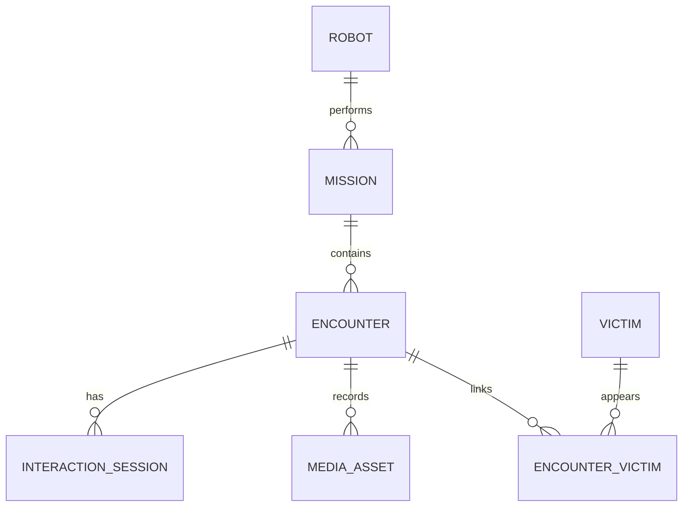

<!--
  GENERATED FILE - DO NOT EDIT DIRECTLY.
  Source: docs/specifications/Sentinel_UGV_최종_통합_명세서_v1.0-rc1.md
  Generator: scripts/docs/split-integrated-spec.ps1
-->

> 기준 문서: Sentinel UGV 통합 명세서 v1.0-rc1 (2026-07-22). 변경은 전체본에 반영한 뒤 분할 스크립트를 실행합니다.

# 29. PostgreSQL·TimescaleDB·S3·Outbox 상세 설계

## 29.1 저장 책임

| 저장소 | 데이터 | 이유 |
|---|---|---|
| PostgreSQL | 로봇·임무·명령·encounter·피해자·미디어 메타데이터 | 관계·무결성·트랜잭션 |
| TimescaleDB 확장 | pose·환경·시스템·네트워크 시계열 | 시간 범위·집계 쿼리 |
| S3 | 영상·스냅샷·지도·선택 rosbag·보고서 | 대용량 객체 저장 |
| Jetson SQLite Outbox | 미전송 이벤트·메타데이터 | 네트워크 단절 복구 |
| Jetson 로컬 파일 | 업로드 대기 영상·지도 | S3 장애 복구 |

TimescaleDB는 별도 DB 서버가 아니라 PostgreSQL 인스턴스에 설치하는 확장으로 사용한다.

## 29.2 핵심 관계



시계열 행은 `mission_id`, `robot_id`, `time`을 공통으로 가지며, 임무 종료 후 요약 테이블을 계산한다.

## 29.3 데이터 무결성

- UUID는 생성 주체와 무관하게 충돌하지 않도록 사용한다.
- `message_id`, `command_id`, `encounter_id`, S3 object key에 unique constraint를 둔다.
- 임무·이벤트 시간은 UTC로 저장하고 UI에서 로컬 시간대로 표시한다.
- 미디어 DB 행과 S3 객체 상태를 `LOCAL_ONLY → PENDING → UPLOADING → READY/FAILED`로 관리한다.
- DB 행을 삭제할 때 S3 객체 삭제 결과를 추적하는 tombstone 또는 삭제 job을 사용한다.

## 29.4 Outbox 전송

```text
로컬 사건 발생
→ SQLite 트랜잭션으로 event + outbox 저장
→ MQTT/REST 전송
→ 서버 ACK와 id 확인
→ outbox SENT
→ 미디어 Presigned 업로드
→ 서버 READY 확인
→ 보존 유예 후 로컬 파일 삭제
```

재시도는 지수 백오프와 최대 간격을 사용한다. QoS 1의 중복 가능성을 전제로 서버는 멱등 처리하며, 업로드 성공 여부가 불명확하면 같은 object key를 조회한 후 재전송한다.

## 29.5 시계열 보존·다운샘플

| 데이터 | 원본 주기 | 원본 보존 | 장기 집계 |
|---|---:|---|---|
| pose | 2Hz 관제 저장 | 프로젝트 기간 또는 30일 | 1s/5s |
| 시스템·배터리 | 1Hz | 프로젝트 기간 | 1m 평균·최대 |
| 온습도 | 0.2~0.5Hz | 프로젝트 기간 | 1m 평균 |
| 네트워크 | 1Hz | 30일 | 1m 평균·p95 |
| AI 관측 원본 | 이벤트 주변 | 필요 기간 | encounter 요약 |

보존 기간은 36장의 개인정보 정책이 우선하며 시연 참가자 데이터는 필요 이상 장기 보관하지 않는다.

## 29.6 S3 key 규칙

```text
missions/{missionId}/
├─ encounters/{encounterId}/snapshot.jpg
├─ encounters/{encounterId}/clip.mp4
├─ encounters/{encounterId}/audio-or-transcript.json
├─ maps/map.pgm
├─ maps/map.yaml
└─ reports/summary.json
```

파일명에 사람 이름·음성 원문·토큰을 포함하지 않는다.
