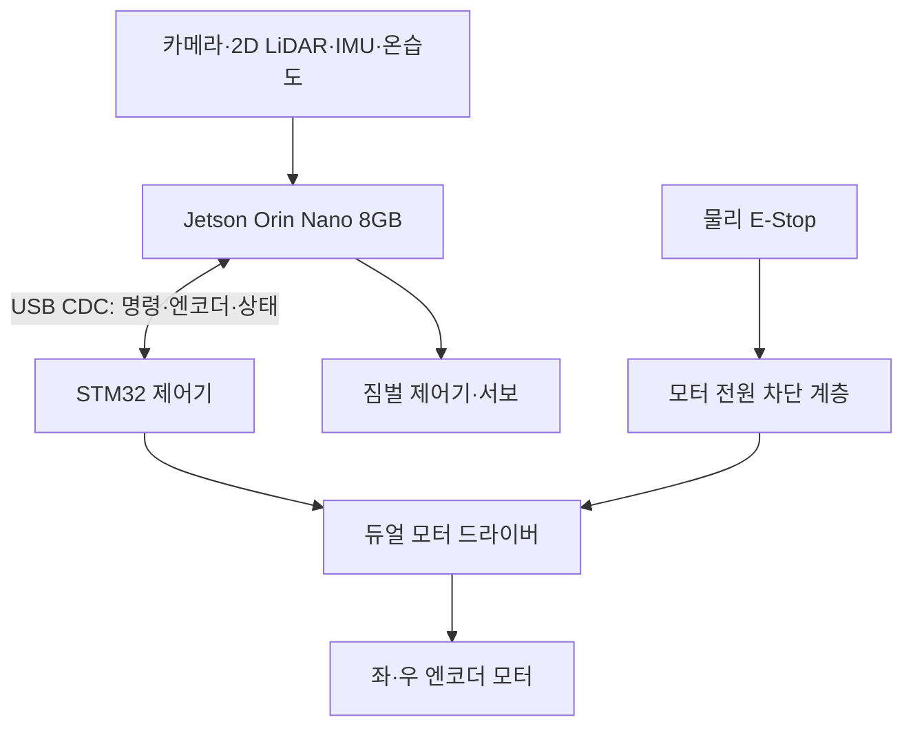

<!--
  GENERATED FILE - DO NOT EDIT DIRECTLY.
  Source: docs/specifications/Sentinel_UGV_최종_통합_명세서_v1.0-rc1.md
  Generator: scripts/docs/split-integrated-spec.ps1
-->

> 기준 문서: Sentinel UGV 통합 명세서 v1.0-rc1 (2026-07-22). 변경은 전체본에 반영한 뒤 분할 스크립트를 실행합니다.

# 21. 하드웨어 인터페이스·전원·배선 상세 설계

## 21.1 목적과 적용 범위

이 장은 6장의 구성 원칙을 실제 조립 가능한 인터페이스 수준으로 구체화한다. 최종 하드웨어는 **Jetson Orin Nano 8GB가 고수준 컴퓨팅**, **STM32가 저수준 모터·엔코더·watchdog 제어**를 담당하며 Raspberry Pi 5는 차량에 탑재하지 않는다.

## 21.2 최종 하드웨어 블록



| 계층 | 장치 | 책임 | 고장 시 기본 동작 |
|---|---|---|---|
| 고수준 | Jetson Orin Nano | ROS 2, SLAM, Nav2, YOLO, Mission Manager, 영상, 서버 통신 | STM32 명령 중단, 주행 자동 재개 금지 |
| 저수준 | STM32 | 엔코더 계수, 100Hz 속도 제어, PWM·방향, 통신 watchdog | PWM 0, driver disable 또는 제동 |
| 구동 | 모터 드라이버 | 모터 전력 스위칭 | enable LOW 시 출력 차단 |
| 독립 안전 | 물리 E-Stop | 모터 구동 전원 직접 차단 | 소프트웨어 상태와 무관하게 정지 |
| 보조 구동 | 짐벌 서보 | 센서 헤드 자세 안정화 | 중앙 또는 기계적 안전각 유지 |

## 21.3 인터페이스 할당

| 연결 | 권장 인터페이스 | 데이터 | 주의사항 |
|---|---|---|---|
| Jetson ↔ STM32 | USB CDC 우선 | 좌·우 목표 속도, 엔코더, fault, E-Stop | udev 별칭 `/dev/sentinel_mcu`, 케이블 고정 |
| Jetson ↔ LiDAR | USB Serial | `/scan` | 장치명 고정, 모터 전원선과 분리 |
| Jetson ↔ 카메라 | USB 3.x | 영상 프레임 | 단일 프로세스만 장치 open |
| Jetson ↔ IMU | USB 또는 I2C | 각속도·가속도 | 3.3V 논리 확인, 축 방향 기록 |
| Jetson ↔ 온습도 | I2C/USB | 온도·습도 | 실패해도 주행은 DEGRADED 허용 |
| Jetson ↔ 짐벌 | PWM 제어기 또는 MCU | 목표 pitch/roll | 모터 노이즈와 전원 분리 권장 |
| STM32 ↔ 엔코더 | Timer Encoder/Interrupt | 좌·우 tick | 5V 출력이면 레벨 변환 필요 |
| STM32 ↔ 드라이버 | PWM, DIR, ENABLE | 구동 신호 | 외부 pull-down으로 부팅 시 OFF |

핀 번호는 보드와 부품 모델 확정 전 단정하지 않는다. 부록 J의 핀맵은 데이터시트와 실제 도통 시험을 통과한 값만 기록한다.

## 21.4 전원 도메인

```text
배터리
├─ 퓨즈·메인 스위치
│  ├─ E-Stop·모터 전원 차단 → 모터 드라이버 → 좌·우 모터
│  ├─ DC-DC A → Jetson 전원
│  ├─ DC-DC B → STM32·센서
│  └─ DC-DC C → 짐벌 서보
└─ 전압·전류 센서 → STM32 또는 Jetson → 관제
```

- 모터와 서보를 Jetson 또는 STM32의 GPIO 전원으로 직접 구동하지 않는다.
- 모터·서보 전원과 컴퓨팅 전원은 분리하되 신호 기준 GND는 설계에 맞게 공통화한다.
- 배터리, DC-DC, 퓨즈, 배선 굵기는 평균 전류가 아니라 **모터 정지 전류와 동시 기동 피크**를 기준으로 선정한다.
- E-Stop은 Jetson 전원을 끄는 버튼이 아니라 모터 구동 에너지를 빠르게 제거하는 회로로 설계한다.
- 첫 구동 시험은 궤도를 바닥에서 띄운 상태에서 수행한다.

## 21.5 전력 예산 산정

| 항목 | 입력 전압 | 평균 전력 | 피크 전력 | 측정 방법 | 상태 |
|---|---:|---:|---:|---|---|
| Jetson Orin Nano | TBD | TBD | TBD | 전력 모드별 실측 | TBD |
| 좌·우 모터 | TBD | TBD | 정지 전류×2 | 전류계·데이터시트 | TBD |
| LiDAR·카메라·IMU | 5V 계열 | TBD | TBD | USB 전력 측정 | TBD |
| 짐벌 서보 | TBD | TBD | 동시 stall 고려 | 전류계 | TBD |
| STM32·보조 센서 | 3.3/5V | TBD | TBD | 벤치 전원 | TBD |

예상 운용시간은 `배터리 유효 Wh ÷ 시스템 평균 W`로 계산하되, 배터리 정격 용량 전부를 사용하지 않고 저전압 차단과 DC-DC 효율을 반영한다.

## 21.6 조립 인수 기준

- 전원 인가 직후 모터 PWM은 0이고 driver enable은 비활성이다.
- 물리 E-Stop을 누르면 Jetson·STM32 상태와 무관하게 모터 출력이 차단된다.
- 모든 USB·전원 케이블은 장력 완화와 커넥터 라벨이 있다.
- 모터 최대 부하에서 Jetson이 재부팅되거나 USB 장치가 재연결되지 않는다.
- 퓨즈·DC-DC·모터 드라이버 온도가 허용 범위를 넘지 않는다.
