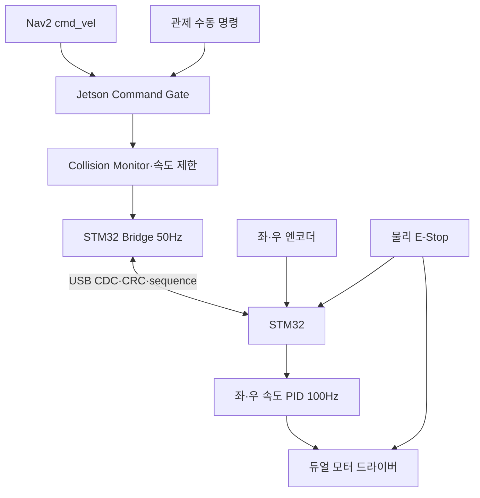

<!--
  GENERATED FILE - DO NOT EDIT DIRECTLY.
  Source: docs/specifications/Sentinel_UGV_최종_통합_명세서_v1.0-rc1.md
  Generator: scripts/docs/split-integrated-spec.ps1
-->

> 기준 문서: Sentinel UGV 통합 명세서 v1.0-rc1 (2026-07-22). 변경은 전체본에 반영한 뒤 분할 스크립트를 실행합니다.

# 34. STM32 저수준 주행 제어·안전 통신 설계

## 34-1. 최신 확정 구조

Sentinel의 최종 제어 구조는 **Jetson 고수준 판단 + STM32 저수준 실행**으로 분리한다. Raspberry Pi 5는 차량 제어 경로에 포함하지 않는다.



| 구성 요소 | 최종 책임 |
|---|---|
| Jetson | SLAM·Nav2·YOLO·임무 상태, 수동/AUTO 명령 선택, 장애물 안전 제한, 목표 `v/ω` 생성 |
| STM32 | 엔코더 계수, 좌·우 트랙 속도 폐루프, PWM·방향·브레이크, 통신 watchdog, 오류 시 출력 차단 |
| 모터 드라이버 | 모터 전력 구동, 과전류·과열 보호, enable/brake 입력 |
| 물리 E-Stop | 소프트웨어 상태와 무관하게 모터 전원 또는 드라이버 enable을 하드웨어로 차단 |

이 구조는 Linux 프로세스 지연과 CUDA·SLAM 부하가 모터 PWM 생성에 직접 영향을 주지 않게 한다. STM32가 경로를 계획하거나 AI 판단을 하지는 않으며, 유효한 목표 속도만 안전하게 실행한다.

---

## 34-2. 무한궤도 제어 용어 기준

무한궤도는 자동차식 조향각이 아니라 좌·우 트랙 속도 차이로 회전한다. 전체 통신·제어 문서에서 다음 필드를 사용한다.

| 사용하지 않는 표현 | 최종 표현 |
|---|---|
| `steering` | `angular` 또는 `targetAngularVelocityRadps` |
| `steeringAngleDeg` | `angularVelocityRadps` |
| 목표 속도·조향각 | 선속도 `v`·각속도 `ω`, 또는 좌·우 목표 속도 |
| `mcuConnected` | 유지 가능. 구체 장치는 STM32 |

관제 명령은 정규화된 `linear`, `angular`를 보내고 Jetson이 차량 제한값으로 변환한다.

```json
{
  "linear": 0.35,
  "angular": -0.20,
  "deadman": true,
  "ttlMs": 250
}
```

STM32에는 물리 단위의 좌·우 목표 속도를 전달한다.

```text
v_left  = v - ω × B_eff / 2
v_right = v + ω × B_eff / 2
```

여기서 `B_eff`는 실제 트랙 중심 간 거리와 바닥 미끄럼을 포함해 35장에서 실험적으로 구한 유효 트랙 폭이다.

---

## 34-3. Jetson 안전 명령 체인

최종 모터 명령은 다음 우선순위를 따른다.

```text
1. 물리 E-Stop
2. STM32 내부 FAULT / watchdog
3. Jetson 소프트웨어 E-Stop
4. Collision Monitor 정지
5. 센서·오도메트리 핵심 오류 정지
6. 수동 deadman·TTL 검사
7. AUTO/MANUAL 명령 선택
8. 속도·가속도 제한
9. STM32 목표 속도 전송
```

Jetson의 ROS2 노드 흐름:

```text
/cmd_vel_nav ─┐
              ├→ command_mux_node
/cmd_vel_manual┘
→ velocity_smoother
→ collision_monitor
→ safety_gate_node
→ /cmd_vel_safe
→ stm32_bridge_node
```

비상 정지와 Collision Monitor의 정지 출력은 완만한 감속 설정보다 우선하여 즉시 0 속도와 브레이크 플래그를 전달한다.

### 명령 수락 조건

STM32 명령은 다음을 모두 만족해야 한다.

- 패킷 CRC가 유효하다.
- 프로토콜 버전과 길이가 일치한다.
- `sequence`가 최근 정상 명령보다 새롭다.
- E-Stop 입력이 해제되어 있다.
- 모터 드라이버 fault가 없다.
- 명령 속도가 설정된 물리 한계 안에 있다.
- Jetson과 STM32 handshake가 완료되었다.

조건을 벗어난 값은 그대로 실행하지 않고 포화 제한하거나 거부하며 오류 코드를 반환한다.

---

## 34-4. Jetson ↔ STM32 물리 연결

MVP의 1순위 연결은 **USB CDC 가상 시리얼**이다.

| 방식 | 장점 | 단점 | 판단 |
|---|---|---|---|
| USB CDC | 배선 단순, 장치 식별 쉬움, 노트북에서도 시험 가능 | USB 분리·재연결 처리 필요 | MVP 추천 |
| 3.3V UART | 지연과 구현이 단순 | 커넥터·GND·전압·포트 충돌 주의 | USB 문제 시 대안 |
| CAN | 노이즈와 오류 검출에 강함 | 트랜시버·구현 부담 | 향후 확장 |

USB 장치는 udev 규칙으로 `/dev/sentinel_mcu` 별칭을 만든다. USB 케이블에는 스트레인 릴리프를 적용하고 모터 전원선과 떨어뜨린다.

UART 대안을 사용할 때는 Jetson과 STM32 모두 **3.3V 논리 레벨**인지 확인하고 5V UART 신호를 Jetson 핀에 직접 연결하지 않는다. 전원 GND와 신호 기준 GND는 공통으로 연결하되, 모터 전류 경로가 신호 GND를 통과하지 않게 배선한다.

---

## 34-5. 직렬 프로토콜

직렬 스트림 경계를 안전하게 찾기 위해 COBS 프레이밍과 `0x00` 구분자를 사용하고, 프레임 전체에 CRC-16을 적용한다.

```text
[protocolVersion u8]
[messageType u8]
[sequence u16]
[payloadLength u16]
[senderUptimeMs u32]
[payload N bytes]
[crc16 u16]
→ COBS encode
→ 0x00 delimiter
```

- 바이트 순서: little-endian
- Baudrate: USB CDC는 가상값, UART 대안은 초기 921600bps
- 최대 payload: 128 bytes
- 잘못된 CRC·길이·버전 패킷은 실행하지 않음
- `senderUptimeMs`는 TTL 판단 보조와 재부팅 탐지에 사용
- 안전 정지는 통신 ACK를 기다리지 않고 로컬에서 실행

### 메시지 종류

| 코드 | 이름 | 방향 | 주기·조건 |
|---:|---|---|---|
| `0x01` | `HELLO` | Jetson → STM32 | 연결·재연결 시 |
| `0x02` | `HELLO_ACK` | STM32 → Jetson | 버전·장치 정보 응답 |
| `0x10` | `DRIVE_COMMAND` | Jetson → STM32 | 50Hz |
| `0x11` | `STOP_COMMAND` | Jetson → STM32 | 즉시, 3회 반복 전송 |
| `0x12` | `ESTOP_COMMAND` | Jetson → STM32 | 즉시, latch |
| `0x20` | `DRIVE_STATE` | STM32 → Jetson | 50Hz |
| `0x21` | `DIAGNOSTIC` | STM32 → Jetson | 5Hz 또는 오류 즉시 |
| `0x22` | `COMMAND_ACK` | STM32 → Jetson | 모드·정지 명령 |
| `0x30` | `CONFIG_GET/SET` | 양방향 | 정지·정비 모드에서만 |

### `DRIVE_COMMAND` payload

```text
mode                  u8   # SAFE_IDLE=0, MANUAL=1, AUTO=2
flags                 u8   # ENABLE, BRAKE, CLEARABLE_STOP
target_left_mmps      i16
target_right_mmps     i16
max_accel_mmps2       u16
command_timeout_ms    u16  # 최대 300
```

### `DRIVE_STATE` payload

```text
applied_sequence      u16
state                 u8
fault_flags           u16
left_encoder_ticks    i32
right_encoder_ticks   i32
left_speed_mmps       i16
right_speed_mmps      i16
left_pwm_permille     i16
right_pwm_permille    i16
estop_active          u8
driver_enabled        u8
```

배터리 전압·전류는 전용 센서 위치에 따라 STM32 또는 Jetson이 읽을 수 있다. 어느 장치가 읽든 관제 메시지의 단위와 필드명은 동일하게 유지한다.

---

## 34-6. 연결·시동 handshake

STM32는 전원 인가와 리셋 직후 다음 상태로 시작한다.

```text
PWM = 0
모터 방향 = 중립
driver enable = LOW
상태 = SAFE_IDLE
watchdog = active
```

시동 순서:

1. STM32가 GPIO와 타이머를 안전값으로 초기화한다.
2. 독립 watchdog(IWDG)을 시작한다.
3. Jetson이 `/dev/sentinel_mcu`를 열고 `HELLO`를 보낸다.
4. STM32가 펌웨어·프로토콜 버전과 fault 상태를 응답한다.
5. Jetson이 버전·E-Stop·엔코더·드라이버 상태를 확인한다.
6. 운영자가 임무 또는 수동 모드를 명시적으로 시작할 때만 `ENABLE`한다.

USB가 재연결되어도 이전 AUTO/MANUAL 상태를 자동 복원하지 않는다. 항상 `SAFE_IDLE`에서 새 handshake와 운영자 명령을 기다린다.

---

## 34-7. watchdog과 정지 정책

### 이중 watchdog

| 감시 위치 | 조건 | 동작 |
|---|---|---|
| Jetson `safety_gate_node` | 유효한 상위 명령이 300ms 이상 없음 | `/cmd_vel_safe=0`, STM32 STOP |
| STM32 통신 watchdog | 정상 `DRIVE_COMMAND`가 300ms 이상 없음 | PWM=0, 브레이크, driver disable 선택 |
| STM32 IWDG | 제어 루프가 정해진 시간 안에 watchdog 갱신 실패 | MCU reset, 출력 초기 안전값 |
| 관제 Control Lease | 브라우저 heartbeat 6초 이상 없음 | 서버 STOP 발행, Jetson TTL이 먼저 정지 |

STM32의 300ms 통신 watchdog이 실제 모터 정지를 보장하므로 MQTT나 서버의 OFFLINE 판단 속도에 의존하지 않는다.

### 정지 방식

- 일반 속도 0: 설정된 감속도로 정지
- 명령 TTL 초과: 빠른 제동 또는 PWM 0
- Collision Monitor 정지: 즉시 제동
- 소프트웨어 E-Stop: STM32 latch, 명시적 reset 절차 필요
- 물리 E-Stop: 모터 전원 또는 driver enable 하드웨어 차단, 수동 해제 필요

물리 E-Stop을 해제했다고 차량이 자동으로 움직이면 안 된다. STM32와 Jetson 양쪽에서 `E_STOP_RESET`과 새로운 운전 시작 명령을 확인한 뒤에만 enable한다.

---

## 34-8. STM32 제어 루프

STM32의 권장 주기:

| 작업 | 주기 |
|---|---:|
| 엔코더 하드웨어 카운터 읽기 | 1kHz 또는 타이머 연속 계수 |
| 좌·우 속도 추정·PID | 100Hz |
| Jetson 명령 적용 | 50Hz |
| `DRIVE_STATE` 송신 | 50Hz |
| 전류·전압·온도 진단 | 5~10Hz |
| watchdog 검사 | 1kHz task 또는 메인 루프 |

좌·우 트랙은 독립 PID를 사용한다. 초기에는 P 또는 PI 제어부터 시작하고, 공중 무부하 값이 아니라 바닥에 놓은 저속 직진 시험으로 조정한다.

```text
error = target_speed - measured_speed
u = Kp × error + Ki × integral + feedforward(target_speed)
u = clamp(u, -max_pwm, +max_pwm)
```

다음 보호를 포함한다.

- 목표 속도 포화 제한
- PWM 변화율 제한
- 엔코더 무응답인데 PWM만 큰 상태 감지
- 좌·우 속도 편차 지속 경고
- 모터 드라이버 fault 입력 즉시 차단
- 전류 센서가 있다면 stall 전류 지속 시 정지
- 방향 전환 전 짧은 중립·감속 구간

---

## 34-9. 상태와 오류 코드

STM32 상태:

```text
BOOT
SAFE_IDLE
READY
MANUAL_ACTIVE
AUTO_ACTIVE
STOPPING
ESTOP_LATCHED
FAULT_LATCHED
```

주요 fault bit:

| Bit | 코드 | 의미 |
|---:|---|---|
| 0 | `COMM_TIMEOUT` | Jetson 명령 300ms 초과 |
| 1 | `CRC_ERROR_RATE_HIGH` | 직렬 프레임 오류율 초과 |
| 2 | `LEFT_ENCODER_FAULT` | 좌측 엔코더 무응답·비정상 |
| 3 | `RIGHT_ENCODER_FAULT` | 우측 엔코더 무응답·비정상 |
| 4 | `DRIVER_FAULT` | 모터 드라이버 fault 입력 |
| 5 | `OVERCURRENT` | 전류 임계값 초과 |
| 6 | `UNDERVOLTAGE` | 구동 전원 저전압 |
| 7 | `ESTOP_ACTIVE` | 물리 E-Stop 입력 |
| 8 | `CONFIG_INVALID` | PPR·PID·한계값 오류 |
| 9 | `INTERNAL_WATCHDOG_RESET` | IWDG 재부팅 이력 |

엔코더 하나가 고장 나면 자동 주행을 중지한다. 수동 강제 이동이 필요하면 운영자가 위험을 확인한 `RECOVERY_MANUAL` 모드에서 매우 낮은 속도로만 허용하며 시연 기본 기능에는 포함하지 않는다.

---

## 34-10. 물리 E-Stop·전원 안전

```text
모터 배터리
→ 퓨즈
→ 래칭형 NC E-Stop
→ 모터 드라이버 전원/contactor
→ 좌·우 모터

Jetson·STM32 논리 전원은 유지 가능
→ E-Stop 상태와 오류를 관제에 보고
```

- 모터와 서보를 Jetson·STM32 GPIO에서 직접 구동하지 않는다.
- STM32 reset 핀과 출력 핀의 부팅 순간 상태를 측정한다.
- driver enable에는 외부 pull-down을 두어 MCU 핀이 부유해도 모터가 켜지지 않게 한다.
- E-Stop 부품은 모터의 최대 전류를 직접 감당하거나 적절한 contactor/relay를 제어해야 한다.
- 퓨즈와 배선 굵기는 모터 정지 전류와 드라이버 정격을 확인한 뒤 확정한다.
- 모터 시험은 트랙을 바닥에서 띄운 상태에서 시작하고 E-Stop 시험을 가장 먼저 수행한다.

---

## 34-11. 구현 구조

```text
jetson/ros2_ws/src/
├─ sentinel_control/
│  ├─ command_mux_node
│  ├─ safety_gate_node
│  └─ control_limits.yaml
└─ stm32_bridge/
   ├─ stm32_bridge_node
   ├─ serial_transport
   ├─ packet_codec
   └─ diagnostics

firmware/stm32/
├─ Core/
├─ Drivers/
├─ App/
│  ├─ protocol
│  ├─ motor_control
│  ├─ encoder
│  ├─ safety
│  └─ diagnostics
├─ Tests/
└─ README.md

common/protocol/
├─ stm32_protocol.md
├─ message_ids.h
├─ fault_codes.h
└─ test_vectors/
```

프로토콜 상수와 CRC test vector는 Jetson과 STM32 양쪽 CI에서 동일하게 검증한다.

---

## 34-12. 검증 항목과 합격 기준

| ID | 시험 | 합격 기준 |
|---|---|---|
| CTRL-01 | STM32 부팅·리셋 | 출력 PWM 0, driver disable 유지 |
| CTRL-02 | USB 케이블 분리 | 300ms 이내 목표 PWM 0·정지 상태 전환 |
| CTRL-03 | Jetson bridge 강제 종료 | STM32 watchdog으로 300ms 이내 정지 |
| CTRL-04 | STM32 main loop 고의 정지 | IWDG reset 후 모터 출력 안전값 |
| CTRL-05 | CRC 오류 패킷 100개 | 잘못된 명령 실행 0회 |
| CTRL-06 | 오래된 sequence 재전송 | 실행 거부·진단 카운터 증가 |
| CTRL-07 | 좌우 엔코더 방향 | 전진 시 두 누적값의 정의된 부호 일치 |
| CTRL-08 | 물리 E-Stop | Jetson·STM32 상태와 무관하게 모터 전력 차단 |
| CTRL-09 | E-Stop 해제 | 자동 재출발하지 않고 SAFE_IDLE 유지 |
| CTRL-10 | 20분 저속 주행 | 통신 끊김·비정상 reset 없음, 온도·전류 한계 이내 |
| CTRL-11 | 엔코더 분리 | 자동 주행 정지와 정확한 fault 보고 |
| CTRL-12 | AUTO/MANUAL 동시 입력 | 상태 우선순위에 따라 하나만 실행 |
| CTRL-13 | 전진 중 즉시 후진 명령 | 가속 제한·중립 구간 적용, 드라이버 fault·과전류 없음 |

정지 시간은 명령 생성 시각, STM32 수신 시각, PWM 0 시각을 로직 애널라이저 또는 STM32 로그 핀으로 측정한다. 화면상의 관제 표시만으로 300ms를 판정하지 않는다.

---

## 34장 최종 확정안

> Sentinel UGV는 Jetson이 생성한 선속도·각속도를 좌·우 트랙 목표 속도로 변환해 USB CDC로 STM32에 50Hz 전송한다. STM32는 엔코더 기반 100Hz 속도 제어, PWM·방향·브레이크, 통신 및 내부 watchdog을 담당한다. 유효 명령이 300ms 동안 없으면 STM32가 서버나 Jetson 프로세스와 무관하게 모터를 정지하며, 물리 E-Stop은 모든 소프트웨어와 독립적으로 구동 전원을 차단한다.

---
