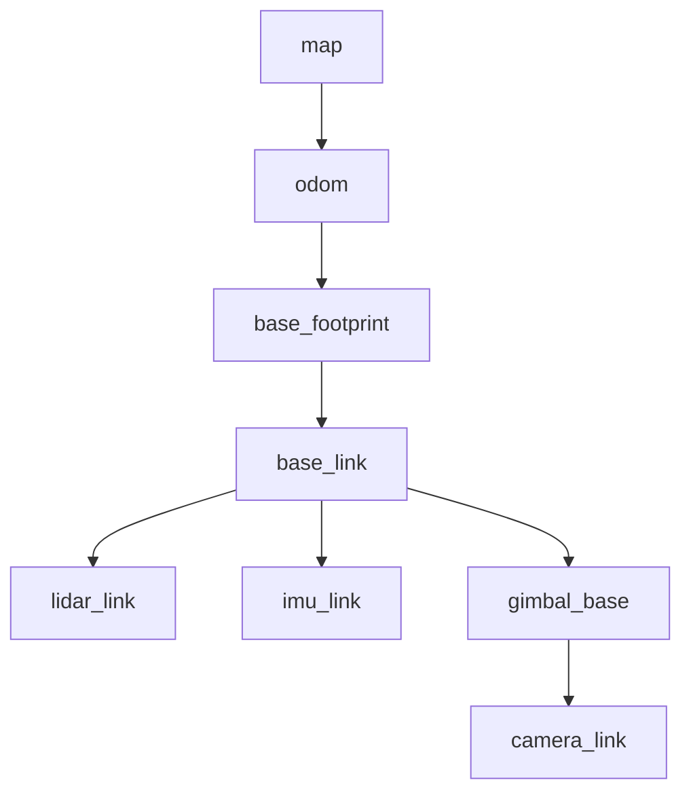

<!--
  GENERATED FILE - DO NOT EDIT DIRECTLY.
  Source: docs/specifications/Sentinel_UGV_최종_통합_명세서_v1.0-rc1.md
  Generator: scripts/docs/split-integrated-spec.ps1
-->

> 기준 문서: Sentinel UGV 통합 명세서 v1.0-rc1 (2026-07-22). 변경은 전체본에 반영한 뒤 분할 스크립트를 실행합니다.

# 22. 센서 수집·시간 동기화·좌표계 상세 설계

## 22.1 핵심 원칙

SLAM, 사람 위치 추정, 영상 이벤트를 같은 사건으로 연결하려면 센서 데이터의 **좌표계와 시각**이 일치해야 한다. 모든 데이터는 ROS 2 timestamp를 포함하고, 기록용 wall clock과 제어용 monotonic clock을 구분한다.

## 22.2 센서별 처리

| 센서 | ROS 2 출력 | 권장 주기 | 핵심 검증 | 실패 영향 |
|---|---|---:|---|---|
| 2D LiDAR | `/scan` | 장치 최대 안정 주기 | 각도·거리·frame_id·drop | 자율주행 중단 |
| 카메라 | `/camera/image_raw` 또는 공유 프레임 버스 | 15~30 FPS | 포맷·지연·노출·단일 open | 사람 탐지·수동 영상 제한 |
| IMU | `/imu/data_raw` | 50~100Hz | 축, 단위, bias, timestamp | 오도메트리 품질 저하 |
| 엔코더 | `/wheel/odometry` | 50Hz 이상 | 부호·tick·overflow·좌우 | 위치 추정 실패 |
| 온습도 | `/environment` | 0.2~1Hz | 범위·센서 끊김 | 경고만 발생 |
| 배터리 | `/battery_state` | 1~2Hz | 전압·전류·잔량 산식 | 복귀 판단 제한 |

## 22.3 TF 좌표계



- `map → odom`: SLAM Toolbox가 전역 보정을 제공한다.
- `odom → base_footprint`: 엔코더·IMU EKF가 연속적인 로컬 자세를 제공한다.
- 고정 센서는 static TF를 사용한다.
- 짐벌에 탑재된 카메라 또는 LiDAR는 실제 관절각을 반영한 dynamic TF를 사용한다.
- TF가 미래 시각이거나 허용 지연을 넘으면 사람 map 좌표 확정을 보류한다.

## 22.4 시간 정책

| 목적 | 시계 | 이유 |
|---|---|---|
| 이벤트·영상·DB 정렬 | UTC wall clock | Jetson·EC2 간 비교 가능 |
| 명령 TTL·watchdog | monotonic clock | NTP 보정이나 시간 점프 영향 방지 |
| 파일명·로그 | UTC + missionId | 시간대 혼동과 충돌 방지 |

Jetson은 chrony/NTP로 시각을 동기화한다. 메시지에는 `occurredAt`과 서버의 `receivedAt`을 분리해 기록하며, 시간 오차가 임계값을 넘으면 관제에 경고한다.

## 22.5 센서 품질 게이트

센서 메시지가 존재한다는 이유만으로 정상으로 판정하지 않는다.

```text
최근 수신 시각
+ 실제 주기
+ 값 범위
+ frame_id
+ timestamp 지연
+ 변화량/고정값 여부
→ OK / DEGRADED / FAILED
```

LiDAR, 엔코더, STM32, E-Stop, TF가 FAILED이면 자율 임무를 시작할 수 없다. 카메라가 FAILED이면 사람 탐지와 영상 기반 수동 조종을 차단하되 저속 지도 탐사 허용 여부는 운영자가 결정한다.
