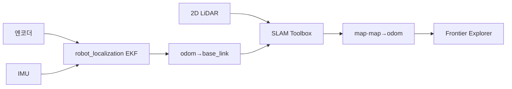

<!--
  GENERATED FILE - DO NOT EDIT DIRECTLY.
  Source: docs/specifications/Sentinel_UGV_최종_통합_명세서_v1.0-rc1.md
  Generator: scripts/docs/split-integrated-spec.ps1
-->

> 기준 문서: Sentinel UGV 통합 명세서 v1.0-rc1 (2026-07-22). 변경은 전체본에 반영한 뒤 분할 스크립트를 실행합니다.

# 23. SLAM·위치 추정·미지 영역 탐사 상세 설계

## 23.1 권장 파이프라인



## 23.2 위치 추정 단계

1. STM32가 좌·우 엔코더 tick과 속도를 제공한다.
2. Jetson이 무한궤도 차동 구동 모델로 wheel odometry를 계산한다.
3. EKF가 wheel odometry와 IMU yaw rate를 융합한다.
4. SLAM Toolbox가 LiDAR scan matching으로 누적 오차를 보정한다.
5. Mission Manager는 TF 연속성과 covariance를 감시한다.

무한궤도는 회전 중 미끄럼이 크므로 이론 트랙 폭을 그대로 신뢰하지 않는다. 직선 거리 스케일과 제자리 회전의 유효 트랙 폭을 별도로 실측해 보정한다.

## 23.3 Frontier 선택

Frontier는 탐색된 자유 공간과 미탐색 공간의 경계다. 후보는 다음 기준으로 점수화한다.

```text
score = 정보이득 가중치 × 예상 신규 면적
      - 이동비용 가중치 × 경로 길이
      - 위험도 가중치 × 좁은 통로·장애물 근접도
      - 실패이력 가중치 × 최근 실패 횟수
```

| 필터 | 규칙 |
|---|---|
| 크기 | 너무 작은 Frontier 제거 |
| 접근성 | Nav2 global plan 생성 불가 후보 제거 |
| 안전거리 | 벽·장애물 inflation 영역 내부 제거 |
| 반복 실패 | 동일 후보 N회 실패 시 cooldown |
| 사람 상호작용 | encounter 진행 중 신규 선택 중단 |

## 23.4 탐사 종료 조건

- 유효 Frontier가 더 이상 없다.
- 임무 제한 시간이 끝났다.
- 배터리 복귀 임계값에 도달했다.
- 운영자가 복귀 또는 종료를 요청했다.
- 핵심 센서·위치 추정이 복구 불가능한 상태다.

정상 종료와 시간·배터리 종료는 `RETURNING`으로 전환한다. 위치를 잃어 home 경로를 생성할 수 없으면 정지 후 수동 회수를 요청한다.

## 23.5 실패 복구

| 실패 | 1차 처리 | 2차 처리 | 최종 처리 |
|---|---|---|---|
| 목표 경로 생성 실패 | 후보 재샘플링 | 다른 Frontier 선택 | 운영자 목표점 |
| local planner 정체 | Nav2 recovery | 후진·회전 제한 복구 | PAUSED |
| 지도 중복·왜곡 | 정지 후 scan/TF 점검 | 저속 재시도 | 수동 모드 |
| localization lost | 즉시 정지 | 최근 신뢰 pose 재초기화 | ERROR |
