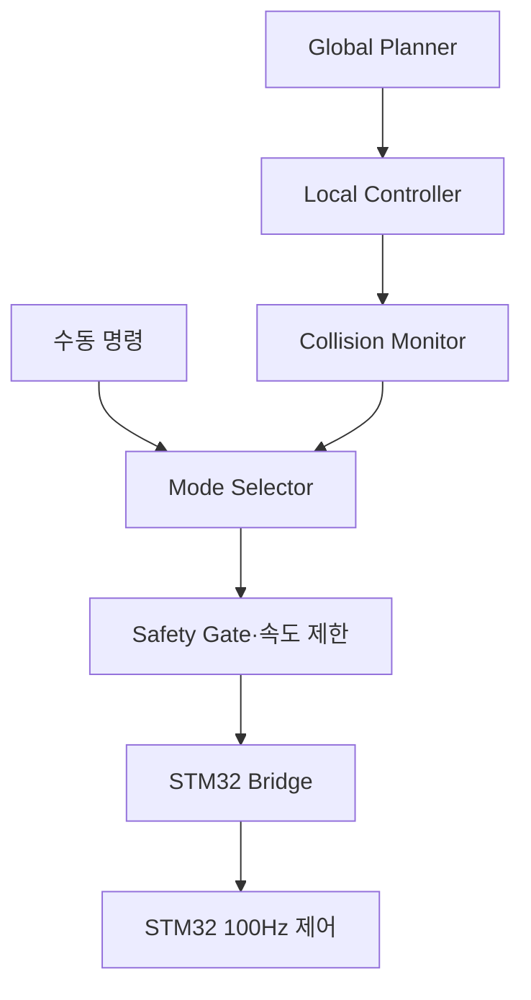

<!--
  GENERATED FILE - DO NOT EDIT DIRECTLY.
  Source: docs/specifications/Sentinel_UGV_최종_통합_명세서_v1.0-rc1.md
  Generator: scripts/docs/split-integrated-spec.ps1
-->

> 기준 문서: Sentinel UGV 통합 명세서 v1.0-rc1 (2026-07-22). 변경은 전체본에 반영한 뒤 분할 스크립트를 실행합니다.

# 24. Nav2 경로 계획·장애물 회피·안전 속도 설계

## 24.1 제어 명령 체인

자동·수동 명령은 모두 Safety Gate를 통과한다. E-Stop, watchdog, 센서 실패, 오래된 명령은 어떤 모드보다 우선한다.

## 24.2 기본 속도 정책

초기값은 실제 정지거리 시험 전의 보수적 시작값이며 최종값은 35장의 튜닝 절차로 확정한다.

| 상황 | 선속도 상한 | 각속도 상한 | 비고 |
|---|---:|---:|---|
| 자율 탐사 | 0.25m/s | 0.6rad/s | 복도 기준 시작값 |
| 피해자 접근 | 0.10m/s | 0.3rad/s | 안전거리 내 저속 |
| 수동 조종 | 0.30m/s | 0.7rad/s | deadman 필수 |
| 영상·위치 불안정 | 0 또는 0.10m/s | 제한 | 품질에 따라 정지 |
| E-Stop·watchdog | 0 | 0 | 즉시 출력 차단/제동 |

## 24.3 장애물 구역

| 구역 | 의미 | 동작 |
|---|---|---|
| 경고 구역 | 경로 주변 장애물 접근 | 감속 |
| 정지 구역 | 예상 정지거리 이내 | 목표 속도 0 |
| 물리 접촉 위험 | 초근거리·범퍼·초음파 | STM32 정지 또는 E-Stop |

정지 구역은 고정 숫자만 사용하지 않고 현재 속도, 센서 갱신 지연, 300ms watchdog, 실제 제동거리를 포함해 결정한다.

## 24.4 수동 조작 안전

- 조이스틱 deadman을 누르는 동안만 DRIVE 명령을 생성한다.
- 브라우저 명령 TTL은 250ms이며 만료된 명령은 폐기한다.
- Jetson이 유효한 상위 명령을 300ms 동안 받지 못하면 0 속도를 생성한다.
- STM32가 유효한 `DRIVE_COMMAND`를 300ms 동안 받지 못하면 독립 정지한다.
- 제어권 Lease가 없는 브라우저의 명령은 서버와 Jetson 양쪽에서 거부한다.
- 수동 종료 후 자율 탐사를 자동 재개하지 않고 운영자에게 재개 여부를 묻는다.

## 24.5 합격 기준

- 표준 장애물 코스에서 충돌 없이 우회하거나 안전 정지한다.
- 게임패드·브라우저·MQTT·USB 중 어느 한 경로를 끊어도 300ms 이내 STM32 PWM이 0이 된다.
- E-Stop 해제 후 새 enable 절차 없이는 움직이지 않는다.
- 사람 접근 중 안전거리보다 가까워지면 Nav2 목표와 무관하게 정지한다.
