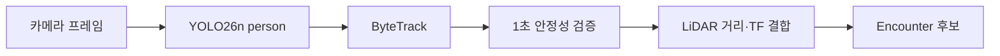

<!--
  GENERATED FILE - DO NOT EDIT DIRECTLY.
  Source: docs/specifications/Sentinel_UGV_최종_통합_명세서_v1.0-rc1.md
  Generator: scripts/docs/split-integrated-spec.ps1
-->

> 기준 문서: Sentinel UGV 통합 명세서 v1.0-rc1 (2026-07-22). 변경은 전체본에 반영한 뒤 분할 스크립트를 실행합니다.

# 25. 사람 탐지·추적·위치 추정 상세 설계

## 25.1 처리 흐름

## 25.2 탐지 확정 규칙

단일 프레임의 박스는 이벤트로 확정하지 않는다. 초기 기준은 다음과 같다.

- class가 `person`이다.
- confidence가 설정값 이상이다.
- 동일 track이 약 1초 동안 최소 관측 횟수를 만족한다.
- 박스 크기·위치가 비정상적으로 급변하지 않는다.
- 카메라 timestamp와 TF를 조회할 수 있다.
- 이미 활성 encounter에 포함된 track 또는 공간 중복인지 검사한다.

정확한 confidence와 관측 횟수는 시연 환경 검증셋으로 조정한다. COCO 사전학습 모델이 실제 복장·조명에서 부족하면 제한된 현장 데이터를 추가 학습하되, 데이터셋 제작이 핵심 통합 일정을 늦추지 않게 한다.

## 25.3 거리·지도 위치 추정

1. bounding box 중심 또는 하단 중심에서 카메라 광선을 계산한다.
2. 같은 방위의 LiDAR 유효 거리 후보를 탐색한다.
3. 인접 beam median과 유효 범위 검사를 적용한다.
4. `camera_link` 또는 `lidar_link` 좌표를 `map`으로 변환한다.
5. 위치 covariance 또는 quality 등급을 함께 저장한다.

LiDAR와 카메라 높이·시야가 달라 직접 거리를 얻지 못하면, 사람 주변의 지면/벽 반사를 잘못 선택할 수 있다. 이때는 지도 위치를 `ESTIMATED`로 표시하고 로봇 접근 과정의 추가 관측으로 갱신한다.

## 25.4 다중 인원과 중복 제거

- 사람은 ByteTrack `trackId` 단위로 개별 추적한다.
- 같은 시각·같은 공간의 여러 track은 하나의 `encounter`로 묶는다.
- 하나의 encounter는 여러 `victim` 후보와 다대다 관계를 가진다.
- 짧은 가림으로 trackId가 바뀌면 시간·위치·외형의 단순 조건으로 병합하되 정밀 재식별은 범위에서 제외한다.
- 이미 보고한 위치 근처의 재탐지는 새 피해자가 아니라 기존 후보 갱신을 우선한다.

## 25.5 성능 측정

| 지표 | 의미 |
|---|---|
| inference FPS | YOLO 처리 속도 |
| end-to-end latency | 프레임 획득부터 관제 표시까지 |
| track continuity | 가림 전후 ID 유지율 |
| event precision | 확정 이벤트 중 실제 사람 비율 |
| miss rate | 시연 사람을 놓친 비율 |
| position error | 지도상 마커와 실제 위치 오차 |
