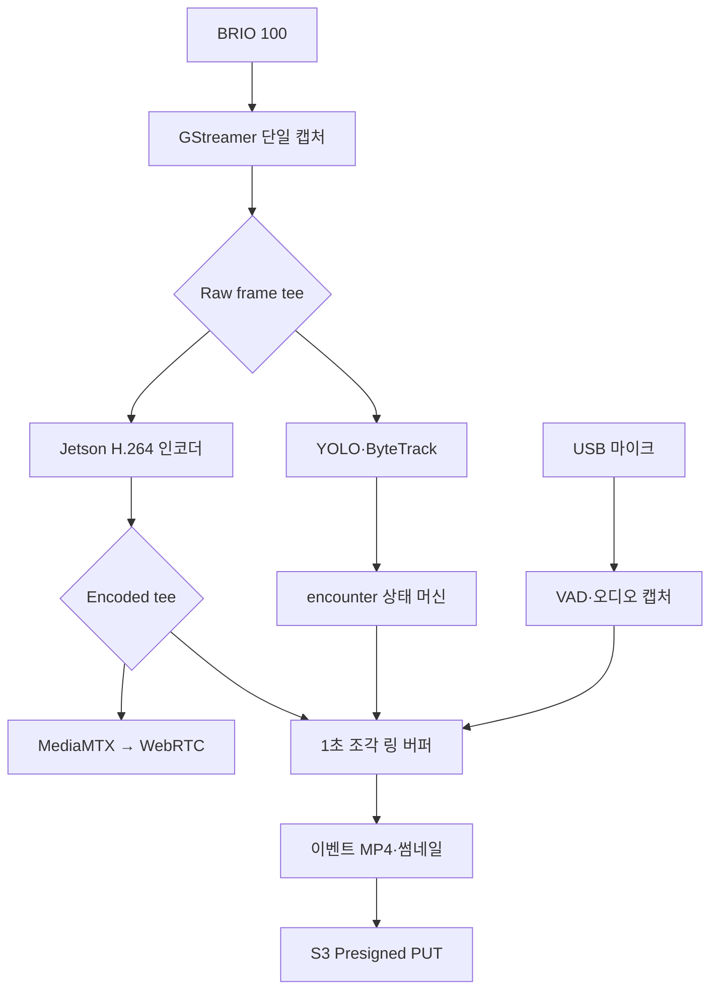
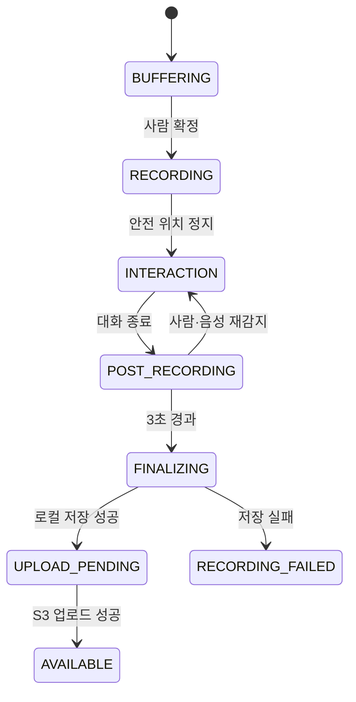

<!--
  GENERATED FILE - DO NOT EDIT DIRECTLY.
  Source: docs/specifications/Sentinel_UGV_최종_통합_명세서_v1.0-rc1.md
  Generator: scripts/docs/split-integrated-spec.ps1
-->

> 기준 문서: Sentinel UGV 통합 명세서 v1.0-rc1 (2026-07-22). 변경은 전체본에 반영한 뒤 분할 스크립트를 실행합니다.

# 32. 영상 스트리밍·3초 링 버퍼·이벤트 녹화 설계

## 32-1. 목표와 추천 결론

Sentinel의 카메라 영상은 Jetson에서 한 번만 열고, 디코딩한 프레임을 AI·관제·녹화로 분기한다. 관제 영상은 MediaMTX가 WebRTC로 브라우저에 제공하고, 이벤트 녹화는 1초 단위 H.264 조각을 순환 보관하는 방식으로 구현한다.



초기 운영값은 다음과 같다.

| 항목 | 초기값 | 조정 기준 |
|---|---:|---|
| 카메라 출력 | 1280×720, 15 FPS | BRIO 100의 실제 V4L2 포맷과 Jetson 부하 |
| 관제 영상 코덱 | H.264 | 브라우저·MediaMTX 호환성 |
| 목표 비트레이트 | 2.5 Mbps | 화질·Wi-Fi 사용량·지연 측정 |
| IDR 간격 | 최대 1초 | 이벤트 시작점과 복구 속도 |
| 링 버퍼 조각 | 1초 | 3초 사전 영상 보장 |
| 보관 조각 수 | 최소 8개 | 복사 지연과 디스크 쓰기 여유 |
| 사전·사후 구간 | 각 3초 | 최신 확정 정책 |
| 이벤트 최대 길이 | 5분 | 종료 신호 누락 보호 |
| 로컬 WebRTC 목표 | 중앙값 350ms 이하, P95 500ms 이하 | 동일 Wi-Fi 30회 측정 |

해상도와 비트레이트는 설계 목표이지 카메라 검증 전 확정 사양이 아니다. 첫 실물 시험에서 `v4l2-ctl --list-formats-ext` 결과를 기준으로 설정 파일을 고정한다.

---

## 32-2. 기존 명세서 방식과 변경 이유

Sub PJT 2는 카메라 영상을 1분 단위로 지속 저장하도록 제시한다. Sentinel은 이를 다음 이유로 변경한다.

- 피해자 발견 전후의 근거 영상이 핵심이며 일반 주행 전체 영상은 우선순위가 낮다.
- 이벤트 단위 파일은 과거 이력에서 즉시 조회하기 쉽다.
- Jetson 디스크, S3 업로드량, 저장 비용을 줄일 수 있다.
- 탐지 이전 3초를 명시적으로 보장할 수 있다.
- 여러 사람이 동시에 보여도 같은 장면을 한 파일로 관리할 수 있다.

변경의 단점은 링 버퍼와 이벤트 종료 상태를 별도로 구현해야 하고, 오탐도 영상 파일을 만든다는 점이다. 단일 탐지 프레임이 아니라 1초간 반복 탐지로 이벤트를 확정하고, 오탐 판정 파일은 관제자가 삭제할 수 있게 하여 보완한다.

---

## 32-3. 카메라 단일 오픈 원칙

카메라를 OpenCV, YOLO 프로세스, MediaMTX가 각각 열지 않는다. `camera_pipeline`만 `/dev/video*`를 열고 다음 두 단계로 분기한다.

```text
BRIO 100
→ V4L2 입력
→ MJPEG 또는 YUYV 디코딩
→ Raw frame tee
   ├─ AI branch: 축소·색공간 변환 → appsink/ROS2 image
   └─ Media branch: NVMM 변환 → H.264 HW 인코딩
                       ├─ MediaMTX 발행
                       └─ 이벤트 링 버퍼
```

이 방식의 장점은 다음과 같다.

- USB 카메라 장치 점유 충돌을 막는다.
- AI·스트리밍·녹화의 프레임 시간이 같은 기준을 사용한다.
- H.264 인코딩을 한 번만 수행하여 Jetson 부하를 줄인다.
- 느린 AI나 네트워크가 카메라 캡처를 막지 않도록 각 분기에 독립 `queue`를 둘 수 있다.

각 분기의 큐 정책은 다음과 같다.

| 분기 | 큐 정책 | 이유 |
|---|---|---|
| AI | 최신 프레임 우선, 가득 차면 오래된 프레임 폐기 | 실시간 인식에 과거 프레임은 가치가 낮음 |
| WebRTC | 짧은 큐, 지연 증가 시 프레임 폐기 | 수동 관제는 최신 영상이 중요 |
| 이벤트 녹화 | 프레임 폐기 금지, 디스크 오류 시 이벤트 경고 | 증빙 영상 연속성 우선 |

파이프라인의 개념적 구성은 다음과 같다. 실제 플러그인 이름과 메모리 변환은 JetPack 버전에서 검증한 뒤 고정한다.

```text
v4l2src
→ decode/convert
→ tee
  ├→ queue(leaky=downstream) → AI appsink
  └→ queue → nvvideoconvert → nvv4l2h264enc
           → h264parse → tee
             ├→ MediaMTX publisher
             └→ ring segment writer
```

카메라 입력이 끊기면 파이프라인을 무한 재시작하지 않는다. 1초, 2초, 4초, 최대 10초 간격으로 3회 재시도한 뒤 `CAMERA_FAULT`를 발생시키고 자율 탐사를 `PAUSED`로 전환한다.

---

## 32-4. MediaMTX와 로컬 WebRTC

MediaMTX는 Jetson에서 실행하며 GStreamer가 발행한 H.264 스트림을 브라우저용 WebRTC로 변환한다. AI 처리나 영상 파일 생성 책임은 MediaMTX에 두지 않는다.

```text
GStreamer publisher
→ Jetson MediaMTX
→ WHEP/WebRTC signaling
→ ICE 연결
→ 동일 Wi-Fi 관제 브라우저
```

### 네트워크 원칙

- 시연 기본 경로는 Jetson과 관제 PC 사이의 LAN 직접 연결이다.
- LAN 시연에서는 호스트 ICE candidate를 우선하고 STUN/TURN 의존성을 제거한다.
- EC2에서 HTTPS로 열린 관제 페이지가 Jetson의 평문 HTTP 신호 주소에 접근하면 혼합 콘텐츠로 차단될 수 있다.
- 따라서 Jetson WHEP 엔드포인트도 HTTPS를 적용하고 관제 노트북이 신뢰하는 로컬 인증서를 설치한다.
- `sentinel.local` 또는 고정 DHCP 주소를 사용하고, 시연 전 실제 접속 주소를 환경변수로 고정한다.
- 외부 인터넷 관제는 선택 기능이며, 필요할 때 EC2 MediaMTX 릴레이와 STUN/TURN을 별도 구성한다.

관제 프론트는 다음 상태를 표시한다.

```text
CONNECTING → LIVE → DEGRADED → RECONNECTING → OFFLINE
```

`DEGRADED` 조건은 최근 5초 평균 지연 증가, 3초 이상 영상 정지, 연속 프레임 손실 등으로 판단한다. 영상이 1초 이상 갱신되지 않으면 수동 조작 화면에 노란 경고, 3초 이상이면 빨간 경고를 표시하고 새로운 수동 전진 명령을 차단한다. 이미 전송된 주행 명령은 Jetson의 300ms TTL로 정지한다.

### 로컬·원격 전환

| 모드 | 경로 | MVP 여부 | 실패 시 |
|---|---|---|---|
| `LOCAL` | Jetson → 브라우저 WebRTC | 필수 | 영상 경고 후 재연결 |
| `REMOTE` | Jetson → EC2 MediaMTX → 브라우저 | 선택 | 로컬 경로 안내 |
| `AUTO` | 로컬 우선, 실패 시 원격 | 확장 | 사용자가 명시적으로 경로 선택 |

자동 전환은 지연이 갑자기 달라져 수동 조작 판단을 흐릴 수 있으므로 MVP에서는 자동으로 바꾸지 않고 운영자가 선택한다.

---

## 32-5. 3초 링 버퍼 구현

### 저장 방식

인코딩된 H.264를 1초 단위 MPEG-TS 조각으로 지속 기록하고 최근 8개 이상을 순환 보관한다. MPEG-TS는 조각 단위 복구가 쉽고, 이벤트 종료 후 MP4로 재다중화할 수 있다.

```text
buffer/
├─ seg_000120.ts
├─ seg_000121.ts
├─ seg_000122.ts
├─ seg_000123.ts
└─ index.json
```

각 조각 메타데이터는 다음 값을 가진다.

```json
{
  "segmentId": 123,
  "startedAt": "2026-07-22T07:30:11.000Z",
  "endedAt": "2026-07-22T07:30:12.000Z",
  "durationMs": 1000,
  "firstPts": 88412000000,
  "firstFrameKey": true,
  "path": "buffer/seg_000123.ts"
}
```

인코더는 적어도 1초마다 IDR 프레임을 생성한다. 조각 시작점이 키프레임이 아니면 이벤트 첫 화면이 깨지거나 재생 시작이 늦어질 수 있기 때문이다.

### 이벤트 시작

사람이 확정되면 `recording_manager`가 다음 작업을 수행한다.

1. `encounterId`와 `mediaId`를 생성한다.
2. 탐지 확정 시각 직전 3초를 포함하는 완료 조각을 조회한다.
3. 해당 조각을 이벤트 작업 디렉터리에 hard link 또는 원자적 복사한다.
4. 현재 작성 중인 조각이 닫히면 같은 이벤트에 포함한다.
5. 이후 생성되는 조각을 `INTERACTION` 종료까지 계속 연결한다.
6. 상호작용 종료 후 3초가 지나면 조각 수집을 닫는다.

동시에 발생한 사람들은 하나의 `encounter`를 사용하므로 같은 영상 조각을 중복 복사하지 않는다.

### 이벤트 종료와 MP4 생성

```text
POST_RECORDING 완료
→ 조각 목록 시각·PTS 순서 검증
→ 누락 조각 검사
→ H.264/AAC 재다중화
→ event.partial.mp4 생성
→ 재생 검사
→ SHA-256 계산
→ event.mp4 원자적 rename
→ thumbnail.jpg 생성
→ UPLOAD_PENDING 등록
```

임시 파일은 `.partial` 확장자를 사용하고 MP4 마무리와 검사에 성공한 후에만 최종 이름으로 바꾼다. 전원 차단 후 부팅하면 `.partial`과 조각 목록을 검사하여 복구하거나 `CORRUPT`로 표시한다.

### 녹화 상태



### 종료 예외

- 음성 응답이나 사람 재탐지가 사후 3초 안에 발생하면 `INTERACTION`으로 되돌린다.
- 30초 동안 상호작용 상태 변화가 없으면 `NO_RESPONSE_TIMEOUT`으로 종료한다.
- 이벤트가 5분을 넘으면 현재 MP4를 닫고 `MAX_DURATION`으로 종료한다.
- 디스크 여유가 임계값 아래면 새 이벤트 시작을 차단하지 않고, 오래된 업로드 완료 파일부터 삭제해 공간을 확보한다.
- 공간 확보가 실패하면 썸네일과 JSON 보고서는 남기되 영상 상태를 `RECORDING_FAILED_DISK_FULL`로 기록한다.

---

## 32-6. 음성·다중 인원 이벤트 연동

이벤트 영상은 `encounter` 하나에 연결한다. 사람별 YOLO 바운딩 박스, `trackId`, 지도 위치, 음성 보고서는 같은 타임라인을 공유한다.

```text
encounter
├─ victims 1..N
├─ detections 1..N
├─ interaction session 0..1
├─ media event.mp4 1개
└─ thumbnail 1개 이상
```

마이크 음성을 이벤트 MP4에 포함할 때는 카메라와 마이크의 monotonic timestamp를 기준으로 동기화한다. STT용 음성은 별도 WAV 조각으로 임시 저장할 수 있지만 S3 장기 보관은 기본적으로 이벤트 MP4와 구조화된 보고서만 사용한다. 원본 WAV 보관 여부는 36장의 개인정보 정책을 따른다.

개인별 발화자를 확실히 구분할 수 없으므로 영상의 오디오 트랙을 특정 `victim_id`에 자동 귀속하지 않는다. 대화 결과에는 `responseScope=GROUP`을 기록한다.

---

## 32-7. 구현 모듈과 설정

```text
jetson/media/
├─ camera_pipeline/
│  ├─ pipeline_builder.py
│  ├─ frame_publisher.py
│  └─ health_monitor.py
├─ streaming/
│  ├─ mediamtx.yml
│  └─ stream_supervisor.py
├─ recording/
│  ├─ ring_writer.py
│  ├─ recording_manager.py
│  ├─ segment_index.py
│  ├─ finalizer.py
│  └─ recovery.py
└─ config/
   └─ media.yaml
```

`media.yaml` 관리 항목:

```yaml
camera:
  device: /dev/video0
  width: 1280
  height: 720
  fps: 15
encoder:
  codec: h264
  bitrate_kbps: 2500
  keyframe_interval_frames: 15
recording:
  segment_seconds: 1
  ring_seconds: 8
  pre_seconds: 3
  post_seconds: 3
  max_event_seconds: 300
  pending_directory: /var/lib/sentinel/media/pending
streaming:
  path: sentinel
  local_whep_url: https://sentinel.local:8889/sentinel/whep
```

장치 경로는 `/dev/video0` 숫자에만 의존하지 않고 udev 규칙으로 고정 별칭을 만드는 것을 권장한다.

---

## 32-8. 장애 처리와 축소안

| 장애 | 즉시 동작 | 복구·대체 |
|---|---|---|
| 카메라 분리 | 자율 탐사 일시정지, `CAMERA_FAULT` | 장치 재탐색 3회 후 운영자 확인 |
| AI branch 지연 | 오래된 AI 프레임 폐기 | 입력 해상도·추론 FPS 감소 |
| WebRTC 실패 | 주행 영상 경고, 수동 전진 차단 | MediaMTX 재시작, 로컬 주소 재확인 |
| 녹화 branch 지연 | 이벤트 오류 기록 | 스트리밍 비트레이트 우선 감소 |
| 디스크 부족 | 업로드 완료 캐시 삭제 | 영상 실패 상태와 썸네일·보고 유지 |
| S3 장애 | 로컬 `UPLOAD_PENDING` 유지 | 백오프로 재업로드 |
| MP4 마무리 실패 | 원본 TS 조각 보존 | 재부팅 후 재다중화 |
| HW 인코더 실패 | 720p 10 FPS 소프트웨어 인코더 시험 | 부하 초과 시 녹화 우선·스트림 축소 |

기능 축소 순서는 `원격 중계 → 오버레이 합성 → 해상도/FPS → 라이브 오디오` 순서다. 사람 탐지와 이벤트 원본 저장은 가능한 한 유지한다.

---

## 32-9. 검증 항목과 합격 기준

| ID | 시험 | 합격 기준 |
|---|---|---|
| VID-01 | 동일 Wi-Fi WebRTC 지연 30회 | 중앙값 ≤350ms, P95 ≤500ms |
| VID-02 | 30분 연속 스트리밍 | 비정상 종료 없음, 영상 정지 3초 초과 0회 |
| VID-03 | 사람 탐지 이벤트 | 탐지 확정 전 영상 3초 이상 포함, 허용오차 -0/+1초 |
| VID-04 | 60초 상호작용 | 접근·대화·종료 후 3초가 한 파일에 재생됨 |
| VID-05 | 한 화면 사람 3명 | `encounter` 1개·이벤트 MP4 1개 생성 |
| VID-06 | Wi-Fi 60초 차단 | 로컬 파일 보존, 복구 후 중복 없이 S3 업로드 |
| VID-07 | 녹화 중 프로세스 강제 종료 | 재시작 후 조각 복구 또는 명시적 `CORRUPT` 판정 |
| VID-08 | AI 처리 인위 지연 | 관제 영상과 카메라 캡처가 멈추지 않음 |
| VID-09 | 디스크 임계값 주입 | 업로드 완료 캐시 정리 후 신규 이벤트 처리 또는 명확한 실패 상태 |
| VID-10 | 관제 영상 3초 정지 | 신규 수동 전진 명령 차단, 기존 명령은 300ms TTL로 정지 |

측정 증빙은 타임코드가 보이는 원본 촬영, GStreamer 로그, 이벤트 메타데이터, S3 객체 목록으로 남긴다.

---

## 32장 최종 확정안

> BRIO 100은 Jetson의 GStreamer 파이프라인이 한 번만 열고, 원본 프레임을 YOLO와 H.264 하드웨어 인코딩 분기로 전달한다. H.264 영상은 MediaMTX를 통해 동일 Wi-Fi 브라우저에 WebRTC로 제공하며, 동시에 1초 조각의 순환 버퍼에 최소 8초를 유지한다. 사람 탐지가 확정되면 직전 3초부터 접근·음성 상호작용·종료 후 3초까지를 하나의 encounter 영상으로 묶어 MP4와 썸네일을 생성하고, 로컬 보존 후 S3에 직접 업로드한다.

---
