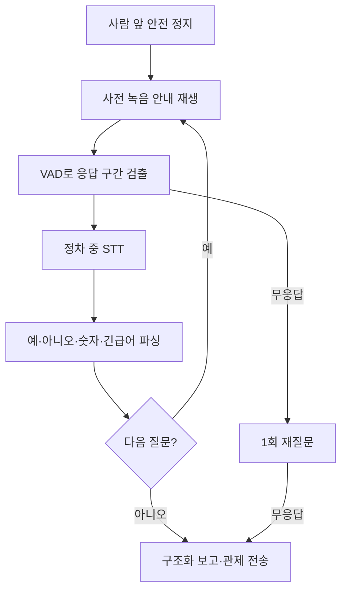

<!--
  GENERATED FILE - DO NOT EDIT DIRECTLY.
  Source: docs/specifications/Sentinel_UGV_최종_통합_명세서_v1.0-rc1.md
  Generator: scripts/docs/split-integrated-spec.ps1
-->

> 기준 문서: Sentinel UGV 통합 명세서 v1.0-rc1 (2026-07-22). 변경은 전체본에 반영한 뒤 분할 스크립트를 실행합니다.

# 33. 피해자 음성 상호작용 설계

## 33-1. 범위와 추천 결론

MVP의 음성 기능은 자유 대화형 AI가 아니라 **정해진 질문을 순서대로 재생하고, 응답 유무와 핵심 선택값을 구조화하는 상태 머신**으로 구현한다.



추천 구현은 다음과 같다.

- 질문 음성은 사전에 생성한 WAV 파일을 사용한다. 런타임 TTS 장애를 제거한다.
- 음성 활동 감지(VAD)는 로컬에서 수행한다.
- STT는 로봇이 정지한 상호작용 구간에만 실행한다.
- 초기 모델은 한국어를 지원하는 경량 `faster-whisper` base급을 시험하고, Jetson 부하가 크면 서버 STT 또는 키워드 입력으로 축소한다.
- STT 실패가 사람의 무응답을 의미하지 않도록 `음성 감지 여부`와 `문장 해석 성공 여부`를 분리한다.
- 다중 인원은 그룹 단위로 질문하고 개별 화자 자동 식별을 하지 않는다.

이 기능은 의료 진단이나 구조 우선순위 판정을 자동 수행하지 않는다. 현장 응답을 관제자에게 전달하는 보조 수단으로 제한한다.

---

## 33-2. 하드웨어와 오디오 경로

필요 하드웨어:

- Jetson 호환 USB 마이크 1개
- 별도 전원 또는 USB 오디오 기반 스피커 1개
- 스피커 출력이 마이크로 재입력되는 것을 줄일 수 있는 물리적 거리와 방향 배치

```text
USB 마이크
→ ALSA 입력
→ high-pass/noise gate
→ VAD
→ 응답 WAV 임시 파일
→ STT
→ 응답 파서

사전 생성 prompt WAV
→ ALSA 출력
→ 스피커
```

MVP에서는 반이중 방식으로 운용한다. 질문을 재생하는 동안 STT 입력을 열지 않고, 재생 종료 후 300ms 뒤부터 응답을 듣는다. 이는 완전한 에코 제거보다 구현이 단순하고 시연 안정성이 높다.

오디오 기준값:

| 항목 | 초기값 |
|---|---:|
| 샘플레이트 | 16kHz |
| 채널 | mono |
| PCM 형식 | signed 16-bit |
| 질문 후 대기 | 최대 8초 |
| 재질문 | 질문당 최대 1회 |
| 발화 종료 판단 | 1.0초 무음 |
| 전체 상호작용 목표 | 60초 이내 |
| 강제 종료 | 5분 이벤트 제한과 연동 |

---

## 33-3. 질문 상태 머신

### 질문 순서

| 단계 | 안내 문구 예시 | 저장 필드 | 실패 시 |
|---|---|---|---|
| `INTRO` | “탐사 로봇입니다. 대답할 수 있는 분은 예라고 말씀해 주세요.” | `anyResponseDetected` | 1회 반복 후 무응답 표시 |
| `COUNT` | “현재 응답 가능한 인원 수를 숫자로 말씀해 주세요.” | `reportedResponsiveCount` | `UNKNOWN` |
| `MOBILITY` | “스스로 이동할 수 있습니까? 예 또는 아니오로 답해 주세요.” | `mobilityStatus` | `UNKNOWN` |
| `URGENT` | “심한 출혈이나 호흡 곤란이 있습니까?” | `urgentConditionReported` | `UNKNOWN` |
| `CLOSING` | “정보를 관제실에 전달했습니다. 구조 요청을 기다려 주세요.” | 종료 시각 | 항상 재생 시도 |

질문의 목적은 정형화된 보고를 만들기 위한 것이며, 부상 정도를 자동 진단하지 않는다. 긴급 응답은 화면에 우선 경고를 표시하지만 로봇이 의학적 결정을 내리지는 않는다.

### 상태

```text
NOT_STARTED
→ PROMPTING
→ LISTENING
→ TRANSCRIBING
→ CONFIRMING 또는 RETRYING
→ COMPLETED

어느 상태에서든
→ ABORTED_MANUAL / ABORTED_SAFETY / FAILED_AUDIO
```

### 무응답과 실패 구분

| VAD | STT | 판정 |
|---|---|---|
| 음성 없음 | 실행 안 함 | `NO_VOICE_DETECTED` |
| 음성 있음 | 텍스트 없음 | `VOICE_DETECTED_STT_FAILED` |
| 음성 있음 | 텍스트 있으나 해석 실패 | `RESPONSE_UNRECOGNIZED` |
| 음성 있음 | 키워드 해석 성공 | `ANSWER_PARSED` |

`VOICE_DETECTED_STT_FAILED`를 무의식 또는 무응답으로 기록하면 안 된다. 관제 화면에는 음성 파형·재생 버튼과 함께 확인 필요 상태로 표시한다.

---

## 33-4. 다중 인원 처리

일반 USB 마이크 한 개로는 누가 말했는지 신뢰성 있게 구분하기 어렵다. 따라서 다음 원칙을 적용한다.

- `responseScope=GROUP`으로 저장한다.
- 동시에 보이는 사람 수는 YOLO·ByteTrack 결과로 기록한다.
- 응답 가능한 인원 수는 발화자가 말한 숫자를 `reportedResponsiveCount`로 별도 저장한다.
- 숫자 인식 신뢰도가 낮거나 인원 수보다 큰 값이면 `OPERATOR_REVIEW_REQUIRED`로 표시한다.
- 특정 피해자의 `mobilityStatus`나 부상 상태로 자동 귀속하지 않는다.
- 개인별 정보가 필요하면 관제자가 바운딩 박스를 선택하고 순차 질문하는 기능을 확장한다.

따라서 `responsivePersonCount`는 확정값이 아니라 다음 중 하나로 관리한다.

```text
CONFIRMED_BY_OPERATOR
SELF_REPORTED_GROUP_COUNT
UNKNOWN
```

---

## 33-5. STT·응답 파싱 정책

STT 입력은 한 질문당 짧은 발화만 처리한다. 자유 문장을 그대로 자동 요약하기보다 허용 키워드를 먼저 판정한다.

```text
긍정: 예, 네, 가능, 괜찮아
부정: 아니오, 아니, 못 움직여, 불가능
긴급: 출혈, 피, 숨, 호흡, 아파, 갇힘
숫자: 한 명~열 명, 1~10
```

충돌하는 키워드가 함께 나오거나 STT confidence가 기준보다 낮으면 자동 확정하지 않는다. 원문 텍스트와 오디오 구간을 관제자에게 보여주고 `REVIEW_REQUIRED`로 둔다.

Jetson 자원 경쟁을 줄이기 위해 상호작용 중 다음 정책을 적용한다.

- 차량은 정지 상태를 유지한다.
- SLAM과 장애물 감지는 유지한다.
- YOLO는 그룹 이탈 감시를 위해 5 FPS 수준으로 낮출 수 있다.
- STT는 발화 종료 후 한 번씩 실행하고 계속 스트리밍 추론하지 않는다.
- CUDA 메모리 부족 시 STT를 CPU 또는 서버 방식으로 전환하고, 영상·주행 안전 기능을 우선한다.

---

## 33-6. 데이터 구조

### `interaction_sessions`

```text
interaction_id           UUID PK
encounter_id             UUID FK UNIQUE
status                   VARCHAR
response_scope           VARCHAR DEFAULT 'GROUP'
any_response_detected    BOOLEAN
reported_responsive_count INTEGER NULL
count_confidence         REAL NULL
mobility_status          VARCHAR
urgent_condition_reported VARCHAR
operator_review_required BOOLEAN
started_at               TIMESTAMPTZ
ended_at                 TIMESTAMPTZ
termination_reason       VARCHAR
summary                  TEXT
```

### `interaction_turns`

```text
turn_id                   UUID PK
interaction_id            UUID FK
turn_index                INTEGER
question_code             VARCHAR
prompt_started_at         TIMESTAMPTZ
listening_started_at      TIMESTAMPTZ
voice_detected             BOOLEAN
transcript                TEXT NULL
stt_confidence            REAL NULL
parsed_value              VARCHAR NULL
parse_status              VARCHAR
retry_count               INTEGER
audio_media_id            UUID NULL
```

보고 메시지 예시:

```json
{
  "encounterId": "8b7b90dc-c0fb-4e57-9359-c30fb0528d75",
  "interactionId": "6a92cc77-588c-49ce-9d28-80f5e621a857",
  "responseScope": "GROUP",
  "detectedPersonCount": 3,
  "anyResponseDetected": true,
  "reportedResponsiveCount": 2,
  "reportedCountStatus": "SELF_REPORTED_GROUP_COUNT",
  "mobilityStatus": "NO",
  "urgentConditionReported": "UNKNOWN",
  "operatorReviewRequired": true,
  "terminationReason": "NORMAL"
}
```

---

## 33-7. 녹화·임무 상태 연동

```text
PERSON_CONFIRMED
→ 이벤트 RECORDING 시작
→ PERSON_APPROACHING
→ 안전 정지
→ INTERACTING + 음성 세션 시작
→ interaction COMPLETED/FAILED
→ POST_RECORDING 3초
→ REPORTING
→ 탐사 재개 또는 운영자 지시 대기
```

다음 조건에서는 탐사를 자동 재개하지 않는다.

- 긴급 상태가 보고됨
- 운영자 확인이 필요한데 관제 연결이 살아 있음
- 사람이 로봇의 진행 경로 안에 남아 있음
- LiDAR·카메라·구동 안전 오류가 발생함
- E-Stop이 활성화됨

일반 완료이며 안전 조건이 충족되면 `REPORTING` 이후 기존 Frontier 탐사를 재개한다.

---

## 33-8. 장애 처리와 축소안

| 장애 | 처리 |
|---|---|
| 마이크 미인식 | 음성 기능 비활성화, 영상·위치 보고와 관제자 수동 확인 |
| 스피커 실패 | 관제 화면 경고, 상호작용을 `FAILED_AUDIO_OUTPUT`으로 종료 |
| VAD 오탐 | 질문 중 입력 무시, 최소 발화 길이 적용 |
| STT 지연 | 5초 초과 시 `STT_TIMEOUT`, 원본 응답 보존 |
| STT 실패 | 음성 감지 사실만 보고, 관제자 재생 확인 |
| 주변 소음 | 1회 재질문, 입력 gain·VAD 임계값 현장 프로파일 사용 |
| GPU 메모리 부족 | STT CPU/서버 fallback 또는 키워드 기능 비활성화 |
| 네트워크 단절 | 로컬 질문·VAD 계속, 보고서는 Outbox에 보관 |
| 사람이 화면에서 사라짐 | LiDAR 안전 확인 후 상호작용 종료, `PERSON_LOST` 기록 |

MVP 축소 순서는 `자유 문장 요약 제거 → STT 서버 fallback 제거 → 키워드 해석 제거 → VAD 기반 응답 유무만 유지`다. 질문 재생과 음성 녹음은 가능한 한 유지한다.

---

## 33-9. 검증 항목과 합격 기준

| ID | 시험 | 합격 기준 |
|---|---|---|
| VOI-01 | 사람 앞 정지 후 시작 | 2초 이내 첫 안내 재생 |
| VOI-02 | 조용한 환경 예/아니오 20회 | VAD 검출률 95% 이상, 파싱 정확도 90% 이상 |
| VOI-03 | 무응답 | 1회 재질문 후 `NO_VOICE_DETECTED`로 종료 |
| VOI-04 | 음성은 있으나 STT 실패 | 무응답으로 오분류하지 않고 `REVIEW_REQUIRED` 표시 |
| VOI-05 | 화면 내 3명 | `responseScope=GROUP`, 개인별 발화 자동 귀속 없음 |
| VOI-06 | Wi-Fi 차단 | 로컬 상호작용 완료·보고서 Outbox 저장 |
| VOI-07 | 스피커 재생 중 마이크 입력 | 자기 질문을 피해자 응답으로 저장하지 않음 |
| VOI-08 | 상호작용 전체 | 이벤트 영상에 질문·응답·종료 후 3초 포함 |
| VOI-09 | 전체 소요 시간 | 정상 4단계 질문이 60초 이내 완료 |

---

## 33장 최종 확정안

> 피해자 음성 상호작용은 사전 녹음 질문, 로컬 VAD, 정차 중 단문 STT, 규칙 기반 응답 파싱으로 구성한다. 음성 감지와 STT 성공을 분리하여 인식 실패를 무응답으로 오판하지 않으며, 다중 인원은 그룹 단위로 보고하고 개인별 화자 귀속은 하지 않는다. 네트워크가 끊겨도 질문·녹음·구조화 보고를 로컬에서 완료하고, 결과는 encounter 이벤트 영상과 함께 연결 복구 후 관제 서버에 전송한다.

---
