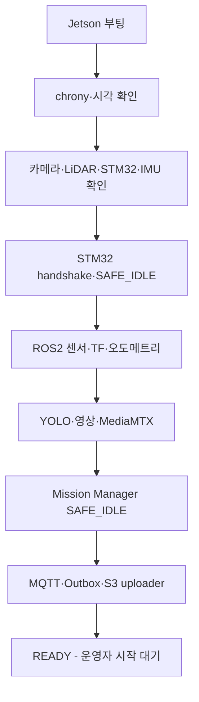

<!--
  GENERATED FILE - DO NOT EDIT DIRECTLY.
  Source: docs/specifications/Sentinel_UGV_최종_통합_명세서_v1.0-rc1.md
  Generator: scripts/docs/split-integrated-spec.ps1
-->

> 기준 문서: Sentinel UGV 통합 명세서 v1.0-rc1 (2026-07-22). 변경은 전체본에 반영한 뒤 분할 스크립트를 실행합니다.

# 37. 운영·모니터링·장애 복구 설계

## 37-1. 운영 목표

운영 설계의 목표는 장애를 전부 막는 것이 아니라, **어디가 고장 났는지 빠르게 확인하고 차량을 안전 상태로 만든 뒤 재현 가능한 순서로 복구하는 것**이다.

운영 원칙:

- 부팅·재연결 후 자동 주행 재개 금지
- 모터 enable보다 상태 점검을 먼저 수행
- 프로세스 자동 재시작과 임무 자동 재개를 구분
- 영상·이벤트·제어 상태를 각각 health로 관리
- wall clock은 기록 정렬, monotonic clock은 TTL·watchdog에 사용
- 실패를 숨기지 않고 `DEGRADED`, `FAULT`, `PAUSED`로 명시

---

## 37-2. Jetson 부팅 순서



세부 순서:

1. OS, NVMe, 네트워크가 올라온다.
2. `chrony`가 동작하고 시각 이상 여부를 기록한다.
3. STM32는 독립적으로 `SAFE_IDLE`, PWM 0을 유지한다.
4. udev 별칭으로 카메라·LiDAR·STM32·IMU 장치를 확인한다.
5. STM32 handshake와 펌웨어 버전을 확인한다.
6. ROS2 센서 driver, robot_state_publisher, TF, odometry를 시작한다.
7. SLAM/Nav2 lifecycle node를 inactive 상태로 준비한다.
8. GStreamer, MediaMTX, YOLO, 녹화 링 버퍼를 시작한다.
9. Mission Manager와 안전 노드를 시작한다.
10. MQTT, Outbox worker, S3 uploader를 시작한다.
11. 모든 필수 health가 정상이면 `READY`를 표시한다.
12. 운영자 명령 전까지 모터 enable을 허용하지 않는다.

온습도, S3, EC2 연결 같은 보조 기능이 실패해도 `DEGRADED_READY`로 시작할 수 있지만 STM32, E-Stop, 엔코더, LiDAR, TF가 실패하면 자율 임무 시작을 차단한다.

---

## 37-3. systemd 서비스 구조

권장 서비스:

```text
sentinel-stm32-bridge.service
sentinel-ros-bringup.service
sentinel-media.service
sentinel-perception.service
sentinel-mission.service
sentinel-cloud-bridge.service
sentinel-uploader.service
sentinel-health-agent.service
```

의존 관계:

```text
stm32-bridge
├─ ros-bringup
│  ├─ perception
│  └─ mission
├─ media
└─ cloud-bridge
   └─ uploader
```

정책:

- 비안전 서비스는 `Restart=on-failure`와 지수 백오프를 사용한다.
- `stm32-bridge`가 죽어도 STM32 watchdog이 모터를 정지한다.
- `ExecStop`과 signal handler는 STOP을 보내되 이것만 안전 근거로 삼지 않는다.
- 반복 실패 횟수가 임계값을 넘으면 무한 재시작보다 `FAILED`로 남기고 관제에 원인을 표시한다.
- 서비스 파일과 환경변수는 Git에서 template로 관리하고 secret은 분리한다.

프로세스 재시작 후 Mission Manager는 `SAFE_IDLE` 또는 `PAUSED_RECOVERY`로 복구한다. 재부팅 전의 AUTO/MANUAL 동작을 자동으로 이어서 실행하지 않는다.

---

## 37-4. EC2 시작·종료 순서

Docker Compose 시작 순서:

```text
PostgreSQL + TimescaleDB healthy
→ DB migration
→ Mosquitto healthy
→ Spring Boot healthy
→ Next.js/Nginx healthy
→ 선택: EC2 MediaMTX
```

중지 순서:

1. 새로운 임무·제어 세션 생성을 차단한다.
2. 활성 Control Lease에 STOP을 보내고 만료시킨다.
3. Spring Boot가 Outbox·DB 작업을 마무리한다.
4. Next.js·Spring Boot·Mosquitto를 중지한다.
5. 마지막에 DB를 중지한다.

배포 중 서버가 잠시 내려가도 Jetson의 현재 자율 임무를 강제로 계속하게 두지 않는다. 최신 안전 정책은 EC2 연결 단절 시 로컬 자율 탐사를 계속할 수 있으나, 수동 조작 중 연결이 끊기면 300ms TTL로 정지하고 `PAUSED`로 전환한다.

---

## 37-5. Health 모델

health는 단순 Boolean이 아니라 다음 상태를 사용한다.

```text
OK
DEGRADED
FAILED
UNKNOWN
```

| 컴포넌트 | 확인 항목 | FAILED 시 |
|---|---|---|
| STM32 | heartbeat, firmware, fault, E-Stop | 모터 정지, 임무 불가 |
| Encoder | tick 변화·방향·불연속 | AUTO 중지 |
| LiDAR | `/scan` 주기·범위 | AUTO 중지 |
| Camera | frame 주기 | 탐사 일시정지 |
| IMU | 주기·NaN·bias | 융합 축소 또는 AUTO 중지 |
| SLAM | pose update·scan matching | PAUSED |
| Nav2 | lifecycle·action 상태 | 목표 취소·PAUSED |
| YOLO | inference heartbeat | 탐사는 정책에 따라 일시정지, 사람 탐지 불가 경고 |
| MediaMTX | publisher·viewer·frame age | 수동 영상 경고·전진 차단 |
| Ring buffer | 최근 조각·쓰기 지연 | 녹화 오류 경고 |
| MQTT | 연결·마지막 ACK | 관제 OFFLINE, 로컬 정책 적용 |
| Outbox | pending 개수·최고 age | 업로드 지연 경고 |
| DB/S3 | 요청 성공률·지연 | 로컬 저장·재시도 |

로봇 종합 상태:

```text
READY       = 모든 필수 health OK
DEGRADED    = 보조 기능 실패, 안전 주행 가능
PAUSED      = 임무 진행 불가, 모터 정지
FAULT       = 수동 확인·reset 없이는 복구 불가
ESTOP       = 물리/소프트웨어 E-Stop latch
```

---

## 37-6. 관제 지표와 임계값

초기 운영 임계값:

| 지표 | 경고 | 심각·동작 |
|---|---:|---|
| Jetson CPU | 90% 60초 | 추론 FPS·영상 해상도 축소 검토 |
| Jetson GPU | 95% 60초 | STT·오버레이 우선 축소 |
| Memory | 85% | 95%에서 새 STT 작업 차단 |
| Jetson 온도 | 75°C | 85°C에서 임무 PAUSED·냉각 확인 |
| 디스크 여유 | 10GB 미만 | 5GB 미만 캐시 정리·rosbag 차단 |
| 링 조각 생성 지연 | 2초 초과 | 녹화 `DEGRADED` |
| WebRTC frame age | 1초 | 3초에서 수동 전진 차단 |
| STM32 heartbeat | 100ms | 300ms에서 STM32 로컬 정지 |
| MQTT heartbeat | 3초 | 5초에서 관제 OFFLINE |
| Outbox 최고 대기 | 5분 | 30분에서 심각 경고 |
| 배터리 | 배터리 모델별 TBD | 저전압 복귀·정지 임계값은 실측 확정 |

온도 임계값은 보수적인 프로젝트 정책이며 실제 Jetson 모듈의 전력 모드·냉각·thermal specification을 확인해 최종 고정한다.

---

## 37-7. 로그 정책

공통 로그 필드:

```json
{
  "timestamp": "2026-07-22T08:10:01.123Z",
  "level": "ERROR",
  "component": "stm32_bridge",
  "robotId": "SENTINEL-01",
  "missionId": "...",
  "eventCode": "STM32_COMM_TIMEOUT",
  "message": "No valid drive state for 320ms",
  "context": {"lastSequence": 1832}
}
```

로그에 넣지 않는 값:

- 비밀번호·PIN
- MQTT credential
- JWT/session token
- Presigned URL 전체
- 피해자 음성 원문
- transcript 전체 문장

Jetson은 journald와 파일 rotation을 사용하고, 14일 또는 용량 상한 중 먼저 도달한 기준으로 정리한다. 안전 이벤트와 임무 이벤트는 일반 debug 로그와 별도로 DB에 구조화하여 보존한다.

주요 확인 명령:

```bash
systemctl --failed
journalctl -u sentinel-stm32-bridge -f
journalctl -u sentinel-media -f
ros2 node list
ros2 topic hz /scan
ros2 topic echo /diagnostics
tegrastats
df -h /var/lib/sentinel
sudo docker compose ps
sudo docker compose logs --since=10m backend
```

---

## 37-8. 장애별 복구 Runbook

| 장애 | 자동 처리 | 운영자 처리 | 재개 조건 |
|---|---|---|---|
| Jetson 앱 crash | systemd 재시작, STM32 정지 | 로그·health 확인 | SAFE_IDLE에서 명시적 시작 |
| Jetson OS reboot | STM32 timeout·정지 | 센서·서비스 전체 점검 | READY 확인 후 시작 |
| STM32 USB 분리 | 300ms 정지, bridge 재탐색 | 케이블·전원 확인 | handshake·엔코더 정상 |
| STM32 reset | 출력 0, reset reason 보고 | fault 원인 확인 | 새 handshake와 enable |
| LiDAR 분리 | Nav2 취소·PAUSED | USB·전원·driver 확인 | `/scan` 안정 10초 |
| 카메라 분리 | YOLO·영상 중지·PAUSED | 장치·파이프라인 확인 | frame 안정 10초 |
| WebRTC 실패 | 자동 signaling 재시도 | 인증서·IP·MediaMTX 확인 | 지연 시험 통과 |
| MQTT 단절 | Outbox 저장, presence OFFLINE | Wi-Fi·broker 확인 | 상태 동기화 후 명시적 재개 |
| EC2 장애 | 수동 정지, 로컬 저장 | Compose·DB health 확인 | 명령·상태 round-trip 확인 |
| DB 장애 | 요청 실패·Outbox 보존 | DB 로그·디스크·migration 확인 | health·쓰기 시험 통과 |
| S3 장애 | UPLOAD_PENDING | IAM·URL·네트워크 확인 | checksum 포함 업로드 성공 |
| 디스크 부족 | 완료 캐시 정리 | 오래된 rosbag·임시파일 검토 | 10GB 이상 확보 |
| 과열 | 추론 축소 또는 PAUSED | 팬·히트싱크·통풍 확인 | 온도 안정 5분 |
| 저전압 | 복귀 또는 안전 정지 | 배터리·DC-DC 점검 | 충전·전압 안정 |

어떤 장애도 단순 재연결만으로 모터를 자동 재가동하지 않는다.

---

## 37-9. 시각 동기화

Jetson과 EC2는 chrony/NTP로 UTC 시각을 맞춘다.

- `occurredAt`: 사건이 실제 발생한 Jetson 시각
- `receivedAt`: 서버 수신 시각
- `senderUptimeMs`: 장치 부팅 후 monotonic 시간
- TTL·watchdog: wall clock이 아니라 monotonic clock

시각 오차가 1초를 넘으면 관제에 경고하고, 5초를 넘으면 이벤트 타임라인을 `TIME_UNSYNCED`로 표시한다. 제어 TTL은 시각 동기화가 틀려도 로컬 monotonic 시간으로 안전하게 만료되어야 한다.

---

## 37-10. Outbox와 미디어 복구

SQLite Outbox 항목:

```text
outbox_id
message_id UNIQUE
message_type
payload_json
created_at
attempt_count
next_attempt_at
last_error
status
```

상태:

```text
PENDING → SENDING → ACKED
                └→ RETRY_WAIT
                └→ DEAD_LETTER
```

재시도는 1, 2, 4, 8, 16, 최대 60초 백오프와 작은 jitter를 사용한다. 중요 encounter 보고는 `messageId`를 유지하여 서버가 중복 저장하지 않게 한다.

부팅 시 미디어 복구 순서:

1. `.partial` 파일과 segment manifest 검색
2. 참조 조각 존재 여부 확인
3. 재다중화 가능한 이벤트는 MP4 복구
4. checksum 계산
5. DB/Outbox와 미디어 상태 대조
6. 업로드되지 않은 파일을 `UPLOAD_PENDING`으로 재등록
7. 복구 불가 파일은 `CORRUPT`, 원인과 조각 목록 기록

---

## 37-11. 배포·롤백

### EC2

- Docker image에 `latest`만 사용하지 않고 commit SHA 또는 release tag를 부여한다.
- DB migration은 배포 전에 백업과 하위 호환성을 확인한다.
- health check 실패 시 이전 Compose image tag로 되돌린다.
- migration이 비가역이면 롤백 스크립트 또는 복원 절차를 함께 준비한다.

### Jetson

- ROS2 package, Python venv, MediaMTX binary, config version을 release 단위로 묶는다.
- 현재 동작 버전과 이전 정상 버전을 각각 유지한다.
- 배포 중 모터는 SAFE_IDLE, 트랙은 바닥에서 띄운다.
- STM32 firmware와 Jetson protocol version 호환표를 확인한다.
- firmware update 실패 시 ST-Link 등 유선 복구 경로를 문서화한다.

배포 완료는 프로세스가 떴다는 사실이 아니라 `STM32 handshake → 센서 health → 로컬 영상 → 가짜 임무 명령 → STOP` smoke test 통과로 판정한다.

---

## 37-12. 시연 전 백업·점검

시연 전날 고정할 항목:

- Jetson release tag와 STM32 firmware hash
- 승인된 calibration/config 묶음
- EC2 Compose image tag
- DB schema version
- MediaMTX·GStreamer 설정
- 로컬 인증서와 접속 주소
- 발표용 예비 임무 데이터
- E-Stop·배터리·예비 케이블

시연 당일에는 기능 추가보다 정상 버전 복구 가능성을 우선한다. 온라인 배포가 실패하면 이전 image와 config로 10분 안에 롤백할 수 있어야 한다.

---

## 37-13. 운영 인수 시험

| ID | 시험 | 합격 기준 |
|---|---|---|
| OPS-01 | Jetson cold boot | 모터 0 유지, 서비스 순서대로 READY |
| OPS-02 | 임무 중 Jetson 재부팅 | STM32 정지, 재부팅 후 자동 주행 재개 없음 |
| OPS-03 | STM32 reset | 모터 출력 0, reset reason 표시 |
| OPS-04 | LiDAR·카메라 순차 분리 | 정의된 PAUSED·FAULT와 정확한 컴포넌트 표시 |
| OPS-05 | MQTT·EC2 5분 차단 | 중요 이벤트·영상 로컬 보존, 복구 후 재전송 |
| OPS-06 | DB·S3 장애 | 손실 없이 pending 유지, 정상화 후 멱등 처리 |
| OPS-07 | 시각 10초 오차 주입 | 경고 표시, TTL·watchdog 정상 동작 |
| OPS-08 | 디스크 임계값 | 자동 정리 또는 명시적 recording failure |
| OPS-09 | 이전 버전 롤백 | 10분 내 정상 smoke test 완료 |
| OPS-10 | 로그 보안 검사 | secret·URL·음성 원문 노출 0건 |
| OPS-11 | 60분 통합 운전 | 비정상 reset·메모리 고갈·서비스 crash 0회 |

---

## 37장 최종 확정안

> Jetson은 STM32 SAFE_IDLE과 장치 인식부터 시작해 ROS2, 영상·AI, Mission Manager, 클라우드 연결 순서로 부팅하며 운영자 명령 전에는 모터를 enable하지 않는다. 각 컴포넌트는 OK·DEGRADED·FAILED·UNKNOWN 상태와 정량 임계값을 가지며, 장애 후 서비스는 재시작할 수 있어도 주행은 자동 재개하지 않는다. 중요 이벤트와 영상은 SQLite Outbox와 로컬 조각으로 복구하고, 배포 실패 시 이전 release·firmware·config 묶음으로 롤백한다.

---
