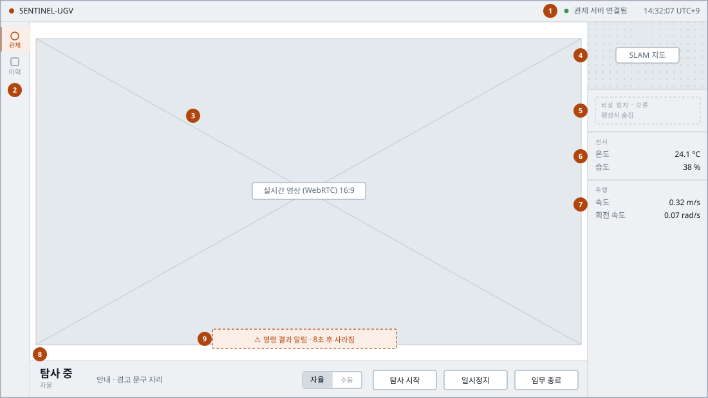
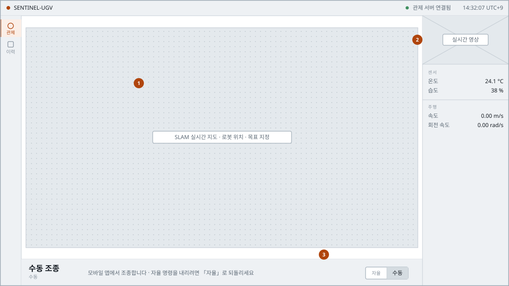
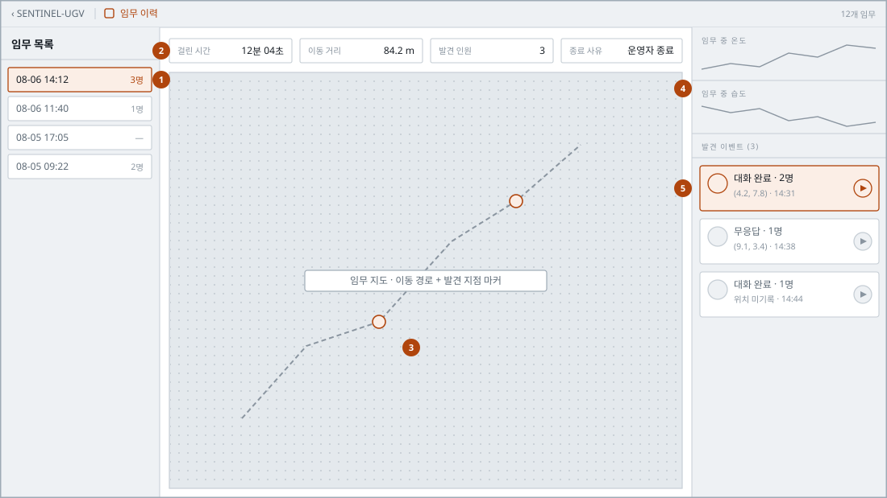
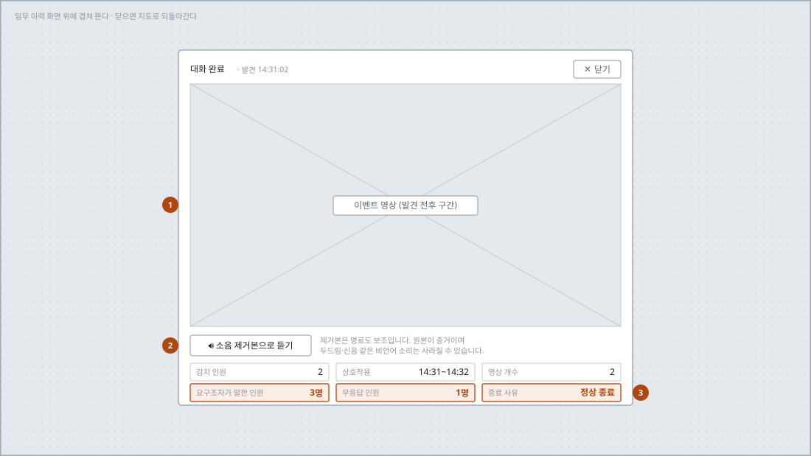

# 관제 웹(GCS) 와이어프레임

재난 현장에 먼저 들어간 로봇을 관제자가 지켜보고 조작하는 웹 화면이다. **실시간 관제**와 **임무 이력** 두 페이지로 이루어진다.

배치는 상상이 아니라 구현된 화면 구조를 옮긴 것이다. 폭도 코드값 그대로다 — 좌측 내비 56px, 우측 사이드바 260px, 하단 명령 바 64px.

| 항목 | 값 |
|---|---|
| 대상 | 관제 웹 · Next.js App Router |
| 페이지 | 2개 (`/` 관제, `/blackbox` 이력) |
| 기준 해상도 | 가로 모니터 16:9 |
| 근거 | `frontend/app/page.tsx`, `frontend/app/blackbox/page.tsx`, `frontend/features/` |

---

## 화면 1. 실시간 관제 — 영상이 주 화면 `/`

기본 상태다. 주 화면은 로봇 카메라 영상이고 지도는 오른쪽 위 작은 슬롯에 둔다. **관측하는 것들은 오른쪽 세로로, 조작하는 것들은 아래 가로로** 모았다.



| # | 요소 | 설명 |
|---|---|---|
| 1 | 상단 바 | 서비스명, 관제 서버 실시간 연결 표시, 시계. 연결 표시는 화면 전체에서 이 자리 하나뿐이다 |
| 2 | 좌측 내비 | 관제 / 이력. 페이지가 둘뿐이라 폭을 좁게 유지한다 |
| 3 | 주 화면 | 로봇 카메라 실시간 영상. 16:9를 유지하며 남는 공간에 가운데 맞춤한다 |
| 4 | 보조 슬롯 | SLAM 실시간 지도. 누르면 주 화면과 자리를 바꾼다(→ 화면 2) |
| 5 | 경고 패널 | 비상 정지·오류일 때만 나타난다. 평상시에는 자리를 차지하지 않는다 |
| 6 | 센서 | 현장 온도·습도. 임계 초과 시 경고 표시 |
| 7 | 주행 | 속도·회전 속도 |
| 8 | 명령 바 | 임무 상태, 안내 문구, 운행 모드 전환, 임무 명령. 상태에 따라 버튼이 바뀐다 |
| 9 | 명령 결과 알림 | 거부·실패 사유를 함께 띄운다. 8초 뒤 사라진다 |

---

## 화면 2. 실시간 관제 — 지도가 주 화면 `/`

보조 슬롯을 누르면 지도와 영상이 자리를 맞바꾼다. **골격은 화면 1과 완전히 같고 두 상자의 내용만 뒤집힌다** — 관제자가 화면을 다시 익힐 필요가 없게 하기 위해서다.



| # | 요소 | 설명 |
|---|---|---|
| 1 | 주 화면 | 지도로 바뀐다. 위치 확인과 자율 탐사 실패 시 목표 지점 지정에 쓴다 |
| 2 | 보조 슬롯 | 영상이 내려온다. 다시 누르면 화면 1로 되돌아간다 |
| 3 | 명령 바 | 수동 조종 중에는 임무 명령 버튼이 사라지고 안내만 남는다. **조종은 모바일 앱이 맡고, 관제 웹에는 자율로 되돌리는 전환만 둔다** |

---

## 화면 3. 임무 이력 `/blackbox`

끝난 임무를 되짚는 화면이다. 임무를 고르면 가운데 지도에 이동 경로와 발견 지점이 찍히고, 오른쪽에 그 임무에서 만난 사람들이 나열된다.



| # | 요소 | 설명 |
|---|---|---|
| 1 | 임무 목록 | 날짜·시각과 발견 인원. 고른 항목이 화면 전체의 기준이 된다 |
| 2 | 임무 결과 요약 | 걸린 시간, 이동 거리, 발견 인원, 종료 사유 |
| 3 | 임무 지도 | 이동 경로와 발견 지점. 마커를 누르면 그 자리의 영상이 열린다(→ 화면 4) |
| 4 | 온습도 그래프 | 임무 중 온도·습도. 재난 현장 기록으로 남긴다 |
| 5 | 발견 이벤트 목록 | 상태, 인원, 시각, 좌표. 이 화면의 주인공이라 스크롤 없이 항상 보이는 자리에 둔다 |

---

## 화면 4. 발견 이벤트 상세 — 영상과 음성 보고

발견 지점을 누르면 지도 위에 겹쳐 뜬다. 닫으면 지도로 되돌아가므로 여러 발견을 연달아 확인하기 쉽다.

**로봇이 요구조자와 나눈 대화 결과가 관제자에게 도달하는 유일한 자리다.**



| # | 요소 | 설명 |
|---|---|---|
| 1 | 이벤트 영상 | 사람을 발견한 전후 구간. 카드 폭 전체를 영상에 준다 |
| 2 | 소음 제거본 토글 | 영상은 그대로 두고 소리만 바꾼다. **원본이 증거**라는 점을 문구로 함께 밝힌다 |
| 3 | 음성 보고 | 로봇이 물어 얻은 값이다. 요구조자가 말한 인원, 무응답 인원, 종료 사유. 영상만으로는 알 수 없는 정보이며, 확인되지 않으면 `0`이 아니라 **「미확인」** 으로 표시한다 |

---

## 화면 흐름

```
실시간 관제  ──▸  임무 이력  ──▸  임무 선택  ──▸  발견 이벤트  ──▸  영상 · 음성 보고
```

실시간 관제 안에서 영상과 지도를 맞바꾸는 것은 페이지 이동이 아니라 같은 화면의 상태 변화다. 주소는 `/` 그대로이며 골격도 바뀌지 않는다.
